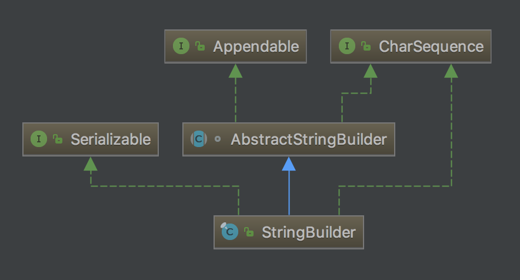
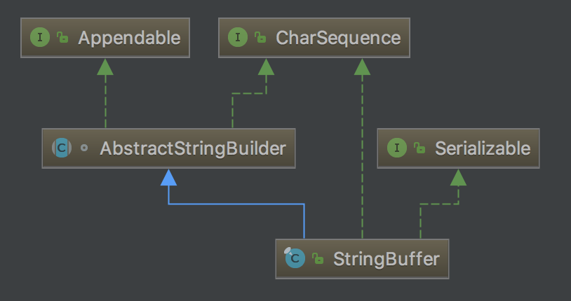
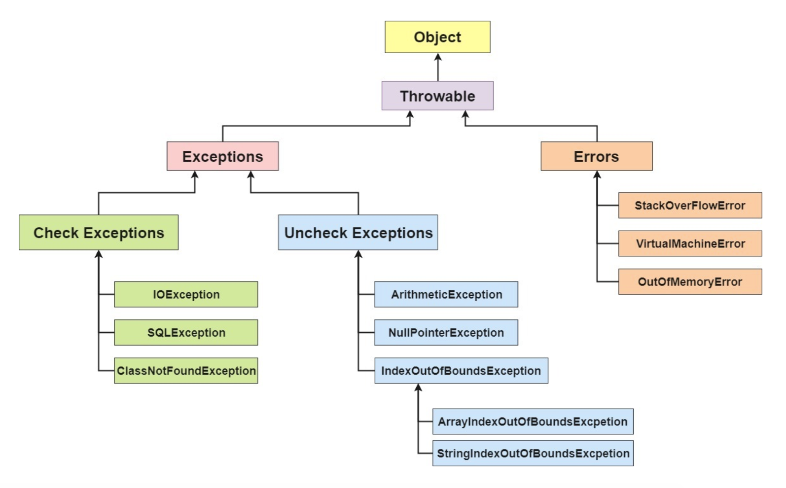
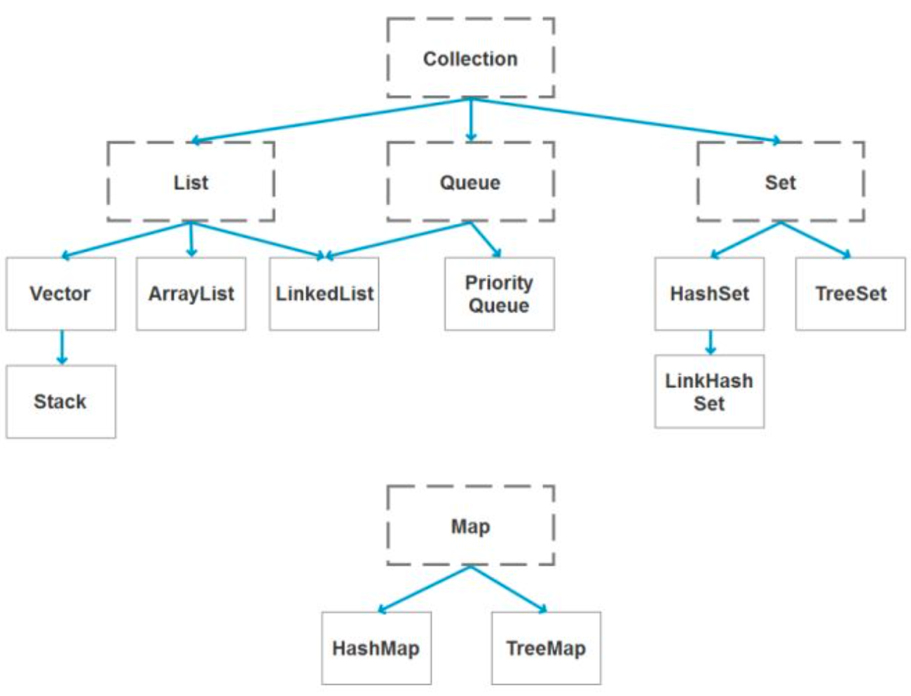
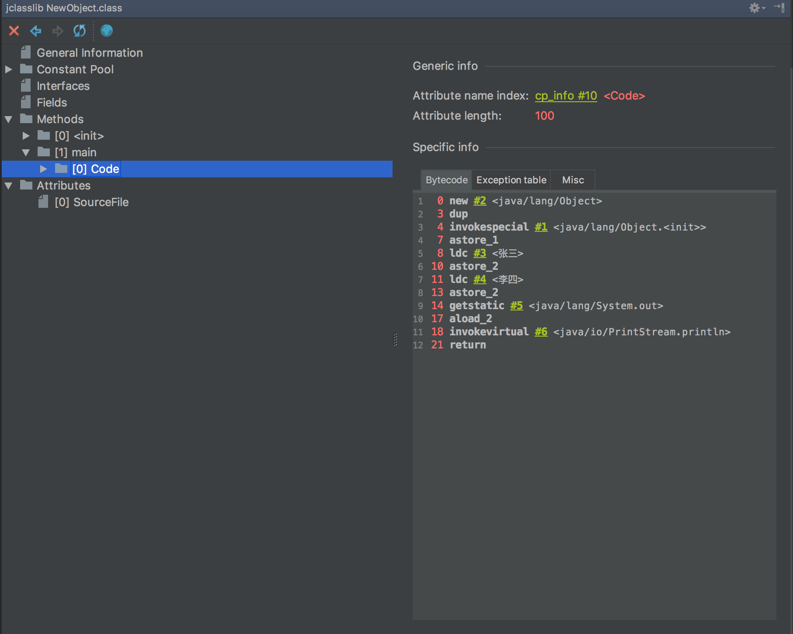
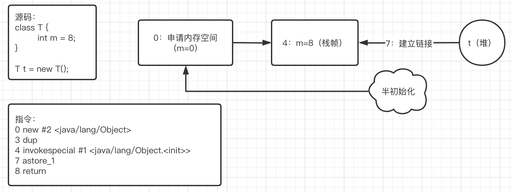

# JAVA知识汇集

> 学习地址：https://snailclimb.gitee.io/javaguide/#/?id=java
>
> 本文`jdk`版本：`jdk1.8.0_131`

## Java基础

#### 1，面向对象基础

1）面向对象和面向过程的区别

> **面向过程** ：**面向过程性能比面向对象高。** 因为类调用时需要实例化，开销比较大，比较消耗资源，所以当性能是最重要的考量因素的时候，比如单片机、嵌入式开发、`Linux/Unix` 等一般采用面向过程开发。但是，**面向过程没有面向对象易维护、易复用、易扩展；**
>
> **面向对象** ：**面向对象易维护、易复用、易扩展。** 因为面向对象有封装、继承、多态性的特性，所以可以设计出低耦合的系统，使系统更加灵活、更加易于维护。但是，**面向对象性能比面向过程低**。

2）面向对象的三大特征

> **封装** 是指把一个对象的状态信息（也就是属性）隐藏在对象内部，不允许外部对象直接访问对象的内部信息；
>
> **继承** 是使用已存在的类的定义作为基础建立新类的技术，新类的定义可以增加新的数据或新的功能，也可以用父类的功能，但不能选择性地继承父类。通过使用继承，可以快速地创建新的类，可以提高代码的重用，程序的可维护性，节省大量创建新类的时间 ，提高我们的开发效率；
>
> > 1）子类拥有父类对象所有的属性和方法（包括私有属性和私有方法），但是父类中的私有属性和方法子类是无法访问，**只是拥有**；
> >
> > 2）子类可以拥有自己属性和方法，即子类可以对父类进行扩展；
> >
> > 3）子类可以用自己的方式实现父类的方法。
>
> **多态**，表示一个对象具有多种的状态。具体表现为父类的引用指向子类的实例。
>
> **多态的特点:**
>
> > 对象类型和引用类型之间具有继承（类）/实现（接口）的关系；
> >
> > 对象类型不可变，引用类型可变；
> >
> > 方法具有多态性，属性不具有多态性；
> >
> > 引用类型变量发出的方法调用的到底是哪个类中的方法，必须在程序运行期间才能确定；
> >
> > 多态不能调用“只在子类存在但在父类不存在”的方法；
> >
> > 如果子类重写了父类的方法，真正执行的是子类覆盖的方法，如果子类没有覆盖父类的方法，执行的是父类的方法。

3）接口和抽象类的区别是什么？

> 1）接口的方法默认是 `public`，所有方法在接口中不能有实现(`Java 8` 开始接口方法可以有默认实现），而抽象类可以有非抽象的方法；
>
> 2）接口中除了 `static、final` 变量，不能有其他变量，而抽象类中则不一定；
>
> 3）一个类可以实现多个接口，但只能实现一个抽象类。接口自己本身可以通过 `extends` 关键字扩展多个接口；
>
> 4）接口方法默认修饰符是 `public`，抽象方法可以有 `public`、`protected` 和 `default` 这些修饰符（抽象方法就是为了被重写所以不能使用 `private` 关键字修饰）；
>
> 5）从设计层面来说，抽象是对类的抽象，是一种模板设计，而接口是对行为的抽象，是一种行为的规范。
>
> > 1）在 `jdk 7` 或更早版本中，接口里面只能有常量变量和抽象方法。这些接口方法必须由选择实现接口的类实现；
> >
> > 2）`jdk8` 的时候接口可以有默认方法和静态方法功能；
> >
> > 3）`jdk 9` 在接口中引入了私有方法和私有静态方法。

#### 2. Java 和 C++的区别?

- 都是面向对象的语言，都支持封装、继承和多态；
- `Java` 不提供指针来直接访问内存，程序内存更加安全；
- `Java` 的类是单继承的，`C++` 支持多重继承；虽然 `Java` 的类不可以多继承，但是接口可以多继承；
- `Java` 有自动内存管理机制，不需要程序员手动释放无用内存；
- 在 `C` 语言中，字符串或字符数组最后都会有一个额外的字符 `‘\0’` 来表示结束。

#### 3. Java泛型了解么？什么是类型擦除？介绍一下常用的通配符？

Java 泛型（`generics`）是 `JDK 5` 中引入的一个新特性, 泛型提供了编译时类型安全检测机制，该机制允许程序员在编译时检测到非法的类型。泛型的本质是参数化类型，也就是说所操作的数据类型被指定为一个参数。

**Java的泛型是伪泛型，这是因为Java在编译期间，所有的泛型信息都会被擦掉，这也就是通常所说类型擦除 。** 

实例一：原始类型相等

```java
package com.team.algorithm;

import java.util.ArrayList;

/**
 * 类型擦除-原始类型相等
 *
 * @author zhangbocheng
 * @version v1.0
 * @date 2020/6/3 15:02
 */
public class Test {
    public static void main(String[] args) {
        ArrayList<String> listStr = new ArrayList<>();
        ArrayList<Integer> listInt = new ArrayList<>();
        listStr.add("abc");
        listInt.add(123);
        // true
        System.out.println(listStr.getClass() == listInt.getClass());
    }
}

```

实例二：通过反射添加其它类型元素

```java
package com.team.algorithm;

import java.util.ArrayList;

/**
 * 类型擦除-通过反射添加其它类型元素
 *
 * @author zhangbocheng
 * @version v1.0
 * @date 2020/6/3 15:02
 */
public class Test {
    public static void main(String[] args) throws Exception {
        ArrayList<Integer> integers = new ArrayList<>();
        integers.add(1);
        integers.getClass().getMethod("add", Object.class).invoke(integers, "abc");
        for (int i = 0; i < integers.size(); i++) {
            System.out.println(integers.get(i));
        }
    }
}
```

**常用的通配符为： T，E，K，V，？**

- `？` 表示不确定的 `java` 类型
- `T (type)` 表示具体的一个 `java` 类型
- `K V (key value)` 分别代表java键值中的 `Key Value`
- `E (element)` 代表 `Element`

#### 4. hashCode()与 equals()

`hashCode()` 的作用是获取哈希码，也称为散列码，实际上是返回一个 `int` 整数，**其作用是确定该对象在哈希表中的索引位置**，大大减少了 `equals` 的次数，相应就大大提高了执行速度。`hashCode()` 定义在 `JDK` 的 `Object` 类中，这就意味着 `Java` 中的任何类都包含有 `hashCode()` 函数。另外需要注意的是： `Object` 的 `hashcode` 方法是本地方法，也就是用 `c` 语言或 `c++` 实现的，该方法通常用来将对象的内存地址转换为整数之后返回。

散列表的**本质**是通过数组实现的。当我们要获取散列表中的某个“值”时，实际上是要获取数组中的某个位置的元素。而数组的位置，就是通过“键”来获取的；更进一步说，数组的位置，是通过“键”对应的散列码计算得到的。

- `hashCode()` 源码：

```java
public native int hashCode();
```

`== `:  **判断两个对象的地址是不是相等**， 即判断两个对象是不是同一个对象。

`equals()` : **判断两个对象是否相等。**但它一般有两种使用情况：

> 1）类没有覆盖 `equals()` 方法。则通过 `equals()` 比较该类的两个对象时，等价于通过“`==`”比较这两个对象；
>
> 2）类覆盖了 `equals()` 方法。通常的做法是：若两个对象的内容相等，则 `equals()` 方法返回 `true`；否则，返回 `fasle`。

- `equals()` 源码：

```java
public boolean equals(Object obj) {
        return (this == obj);
}
```

如果两个对象相等，则 `hashcode` 一定也是相同的。两个对象相等，对两个对象分别调用 `equals` 方法都返回 `true`。但是，两个对象有相同的 `hashcode` 值，它们也不一定是相等的 。**因此，equals 方法被覆盖过，则 `hashCode` 方法也必须被覆盖。**

> `hashCode()`的默认行为是对堆上的对象产生独特值。如果没有重写 `hashCode()`，则该 `class` 的两个对象无论如何都不会相等（即使这两个对象指向相同的数据）

因为 `hashCode()` 所使用的杂凑算法也许刚好会让多个对象传回相同的杂凑值。越糟糕的杂凑算法越容易碰撞，但这也与数据值域分布的特性有关（所谓 **碰撞** 也就是指的是不同的对象得到相同的 `hashCode`。

#### 5. 自动装箱与拆箱

- **装箱**：将基本类型用它们对应的引用类型包装起来；
- **拆箱**：将包装类型转换为基本数据类型。

测试代码举例1：

```java
public class Test {
    public static void main(String[] args) {
        Integer i1 = 100;
        Integer i2 = 100;
        Integer i3 = 200;
        Integer i4 = 200;

        // true
        System.out.println(i1 == i2);  
        // false
        System.out.println(i3 == i4);
        // true
        System.out.println(i1.equals(i2));
        // true
        System.out.println(i3.equals(i4));
    }
}
```

源码解析：

```java
public boolean equals(Object obj) {
        if (obj instanceof Integer) {
            return value == ((Integer)obj).intValue();
        }
        return false;
}
```

```java
private static class IntegerCache {
    static final int low = -128;
    static final int high;
    static final Integer cache[];

    static {
        // high value may be configured by property
        int h = 127;
        String integerCacheHighPropValue =
            sun.misc.VM.getSavedProperty("java.lang.Integer.IntegerCache.high");
        if (integerCacheHighPropValue != null) {
            try {
                int i = parseInt(integerCacheHighPropValue);
                i = Math.max(i, 127);
                // Maximum array size is Integer.MAX_VALUE
                h = Math.min(i, Integer.MAX_VALUE - (-low) -1);
            } catch( NumberFormatException nfe) {
                // If the property cannot be parsed into an int, ignore it.
            }
        }
        high = h;

        cache = new Integer[(high - low) + 1];
        int j = low;
        for(int k = 0; k < cache.length; k++)
            cache[k] = new Integer(j++);

        // range [-128, 127] must be interned (JLS7 5.1.7)
        assert IntegerCache.high >= 127;
    }

    private IntegerCache() {}
}


public static Integer valueOf(int i) {
        if (i >= IntegerCache.low && i <= IntegerCache.high)
            return IntegerCache.cache[i + (-IntegerCache.low)];
        return new Integer(i);
}
```

测试代码举例2：

```java
public class Test {
    public static void main(String[] args) {
        Double i1 = 100.0;
        Double i2 = 100.0;
        Double i3 = 200.0;
        Double i4 = 200.0;

        // false
        System.out.println(i1 == i2);
        // false
        System.out.println(i3 == i4);
        // true
        System.out.println(i1.equals(i2));
        // true
        System.out.println(i3.equals(i4));
    }
}
```

源码解析：

```java
public static Double valueOf(double d) {
    return new Double(d);
}
```

```java
public boolean equals(Object obj) {
        return (obj instanceof Double)
               && (doubleToLongBits(((Double)obj).value) ==
                      doubleToLongBits(value));
}
```

测试代码举例3：

```java
public class Test {
    public static void main(String[] args) {
        Boolean i1 = false;
        Boolean i2 = false;
        Boolean i3 = true;
        Boolean i4 = true;

        // true
        System.out.println(i1 == i2);
        // true
        System.out.println(i3 == i4);
        // true
        System.out.println(i1.equals(i2));
        // true
        System.out.println(i3.equals(i4));
    }
}
```

源码解析：

```java
public static final Boolean TRUE = new Boolean(true);
public static final Boolean FALSE = new Boolean(false);

public static Boolean valueOf(boolean b) {
        return (b ? TRUE : FALSE);
}
```

```java
public boolean equals(Object obj) {
        if (obj instanceof Boolean) {
            return value == ((Boolean)obj).booleanValue();
        }
        return false;
}
```

**Java 基本类型的包装类的大部分都实现了常量池技术，即 Byte,Short,Integer,Long,Character,Boolean；前面 4 种包装类默认创建了数值[-128，127] 的相应类型的缓存数据，Character创建了数值在[0,127]范围的缓存数据，Boolean 直接返回True Or False。如果超出对应范围仍然会去创建新的对象。**

```java
public static void main(String[] args) {
    int num1 = 10;
    int num2 = 20;

    swap(num1, num2);

    System.out.println("num1 = " + num1); // 10
    System.out.println("num2 = " + num2);  // 20
}

public static void swap(int a, int b) {
    int temp = a;
    a = b;
    b = temp;

    System.out.println("a = " + a); // 20
    System.out.println("b = " + b); // 10
}
```

#### 6. 重载和重写的区别

> 重载：发生在同一个类中，方法名必须相同，参数类型不同、个数不同、顺序不同，方法返回值和访问修饰符可以不同；
>
> 重写：发生在运行期，是子类对父类的允许访问的方法的实现过程进行重新编写。
>
> 1. > 1）返回值类型、方法名、参数列表必须相同，抛出的异常范围小于等于父类，访问修饰符范围大于等于父类；
>    >
>    > 2）如果父类方法访问修饰符为 `private/final/static` 则子类就不能重写该方法，但是被 `static` 修饰的方法能够被再次声明；
>    >
>    > 3）构造方法无法被重写。

| 区别点     | 重载方法 | 重写方法                                       |
| ---------- | -------- | ---------------------------------------------- |
| 发生范围   | 同一个类 | 子类中                                         |
| 参数列表   | 必须修改 | 一定不能修改                                   |
| 返回类型   | 可修改   | 一定不能修改                                   |
| 异常       | 可修改   | 可以减少或删除，一定不能抛出新的或者更广的异常 |
| 访问修饰符 | 可修改   | 一定不能做更严格的限制（可以降低限制）         |
| 发生阶段   | 编译期   | 运行期                                         |

#### 7. String StringBuffer 和 StringBuilder 的区别是什么? String 为什么是不可变的?

`String` 类中使用 final 关键字修饰字符数组来保存字符串，`private final char value[]`，所以`String` 对象是不可变的。

源码如下：

```java
public final class String
    implements java.io.Serializable, Comparable<String>, CharSequence {
    /** The value is used for character storage. */
    private final char value[];

    /** Cache the hash code for the string */
    private int hash; // Default to 0
	..........
}
```

而 `StringBuilder` 与 `StringBuffer` 都继承自 `AbstractStringBuilder` 类，在 `AbstractStringBuilder` 中也是使用字符数组保存字符串`char[]value` 但是没有用 `final` 关键字修饰，所以这两种对象都是可变的。

`StringBuilder` 与 `StringBuffer` 的构造方法都是调用父类构造方法也就是`AbstractStringBuilder` 实现的。

源码如下：

```java
abstract class AbstractStringBuilder implements Appendable, CharSequence {
    /**
     * The value is used for character storage.
     */
    char[] value;

    /**
     * The count is the number of characters used.
     */
    int count;
    .............
    /**
     * The maximum size of array to allocate (unless necessary).
     * Some VMs reserve some header words in an array.
     * Attempts to allocate larger arrays may result in
     * OutOfMemoryError: Requested array size exceeds VM limit
     */
    private static final int MAX_ARRAY_SIZE = Integer.MAX_VALUE - 8;
    .............
}
```





`String` 中的对象是不可变的，也就可以理解为常量，线程安全。`AbstractStringBuilder` 是 `StringBuilder` 与 `StringBuffer` 的公共父类，定义了一些字符串的基本操作，如 `expandCapacity`、`append`、`insert`、`indexOf` 等公共方法。`StringBuffer` 对方法加了同步锁或者对调用的方法加了同步锁，所以是线程安全的。`StringBuilder` 并没有对方法进行加同步锁，所以是非线程安全的。

相关源码如下：

```java
/**
* A cache of the last value returned by toString. Cleared
* whenever the StringBuffer is modified.
*/
private transient char[] toStringCache;

@Override
public synchronized StringBuffer insert(int offset, Object obj) {
    toStringCache = null;
    super.insert(offset, String.valueOf(obj));
    return this;
}
```

#### 8. 成员变量与局部变量的区别有哪些？

> 1）从**语法形式**上看，成员变量属于类，而局部变量是在方法中定义的变量或是方法的参数；成员变量可以被  `public,private,static` 等修饰符所修饰，而局部变量不能被访问控制修饰符及 `static` 所修饰；但是，成员变量和局部变量都能被 `final` 所修饰；
>
> 2）从变量在内存中的 **存储方式** 来看：如果成员变量是使用 `static` 修饰的，那么这个成员变量属于类，如果没有使用`static`修饰，这个成员变量属于实例。而对象存在于 **堆** 内存，局部变量则存在于 **栈** 内存；
>
> 3）从变量在内存中的 **生存时间** 上看：成员变量是对象的一部分，它随着对象的创建而存在，而局部变量随着方法的调用而自动消失；
>
> 4）成员变量如果没有被赋初值，则会自动以类型的默认值而赋值（一种情况例外：被 `final` 修饰的成员变量也必须显式地赋值），而局部变量则不会自动赋值。

#### 9. final,static,this,super 关键字

`final` 关键字，意思是最终的、不可修改的，最见不得变化，用来修饰类、方法和变量，具有以下特点：

> `final` 修饰的类不能被继承，`final` 类中的所有成员方法都会被隐式的指定为 `final` 方法；
>
> `final` 修饰的方法不能被重写；
>
> `final` 修饰的变量是常量，如果是基本数据类型的变量，则其数值一旦在初始化之后便不能更改；如果是引用类型的变量，则在对其初始化之后便不能让其指向另一个对象。

`static` 关键字主要有以下四种使用场景：

> **修饰成员变量和成员方法:** 被 `static` 修饰的成员属于类，不属于单个这个类的某个对象，被类中所有对象共享，可以并且建议通过类名调用。被 `static` 声明的成员变量属于静态成员变量，静态变量存放在 `Java` 内存区域的方法区。调用格式：`类名.静态变量名` `类名.静态方法名()`；
>
> **静态代码块:** 静态代码块定义在类中方法外, 静态代码块在非静态代码块之前执行(静态代码块—>非静态代码块—>构造方法)。 该类不管创建多少对象，静态代码块只执行一次；
>
> **静态内部类（static修饰类的话只能修饰内部类）：** 静态内部类与非静态内部类之间存在一个最大的区别: 非静态内部类在编译完成之后会隐含地保存着一个引用，该引用是指向创建它的外围类，但是静态内部类却没有。没有这个引用就意味着：1. 它的创建是不需要依赖外围类的创建。2. 它不能使用任何外围类的非static成员变量和方法；
>
> **静态导包(用来导入类中的静态资源，1.5之后的新特性):** 格式为：`import static` 这两个关键字连用可以指定导入某个类中的指定静态资源，并且不需要使用类名调用类中静态成员，可以直接使用类中静态成员变量和成员方法。

`this` 关键字用于引用类的当前实例。

`super` 关键字用于从子类访问父类的变量和方法。 

> `this`、`super` 不能用在 `static` 方法中。

#### 10. Object 类

`Object` 类是一个特殊的类，是所有类的父类。它主要提供了以下 11 个方法：

```java
//native方法，用于返回当前运行时对象的Class对象，使用了final关键字修饰，故不允许子类重写。
public final native Class<?> getClass();
//native方法，用于返回对象的哈希码，主要使用在哈希表中，比如JDK中的HashMap。
public native int hashCode();
//用于比较两个个对象的内存地址是否相等，String类对该方法进行了重写用户比较字符串的值是否相等。
public boolean equals(Object obj) {
    return (this == obj);
}
//naitive方法，用于创建并返回当前对象的一份拷贝。一般情况下，对于任何对象 x，表达式 x.clone() != x 为true，x.clone().getClass() == x.getClass() 为true。Object本身没有实现Cloneable接口，所以不重写clone方法并且进行调用的话会发生CloneNotSupportedException异常。
protected native Object clone() throws CloneNotSupportedException;
//返回类的名字@实例的哈希码的16进制的字符串。建议Object所有的子类都重写这个方法。
public String toString() {
    return getClass().getName() + "@" + Integer.toHexString(hashCode());
}
//native方法，并且不能重写。唤醒一个在此对象监视器上等待的线程(监视器相当于就是锁的概念)。如果有多个线程在等待只会任意唤醒一个。
public final native void notify();
//native方法，并且不能重写。跟notify一样，唯一的区别就是会唤醒在此对象监视器上等待的所有线程，而不是一个线程。
public final native void notifyAll();
//native方法，并且不能重写。暂停线程的执行。注意：sleep方法没有释放锁，而wait方法释放了锁 。timeout是等待时间。
public final native void wait(long timeout) throws InterruptedException;
//多了nanos参数，这个参数表示额外时间（以毫微秒为单位，范围是 0-999999）。 所以超时的时间还需要加上nanos毫秒。
public final void wait(long timeout, int nanos) throws InterruptedException {
    if (timeout < 0) {
        throw new IllegalArgumentException("timeout value is negative");
    }

    if (nanos < 0 || nanos > 999999) {
        throw new IllegalArgumentException(
            "nanosecond timeout value out of range");
    }

    if (nanos > 0) {
        timeout++;
    }

    wait(timeout);
}
//跟之前的wait方法一样，只不过该方法一直等待，没有超时时间这个概念
public final void wait() throws InterruptedException {
    wait(0);
}
//实例被垃圾回收器回收的时候触发的操作
protected void finalize() throws Throwable { };
```

#### 11. Java 序列化中如果有些字段不想进行序列化，怎么办？

对于不想进行序列化的变量，使用 `transient` 关键字修饰。

`transient` 关键字的作用是：阻止实例中那些用此关键字修饰的的变量序列化；当对象被反序列化时，被 `transient` 修饰的变量值不会被持久化和恢复。`transient` 只能修饰变量，不能修饰类和方法。

演示代码：

```java
package com.team.algorithm;

import java.io.Serializable;

/**
 * transient 关键字
 *
 * @author zhangbocheng
 * @version v1.0
 * @date 2020/6/4 01:02
 */
public class User implements Serializable {
    public static long getSerialVersionUID() {
        return serialVersionUID;
    }

    public int getAge() {
        return age;
    }

    public void setAge(int age) {
        this.age = age;
    }

    public String getName() {
        return name;
    }

    public void setName(String name) {
        this.name = name;
    }

    private static final long serialVersionUID = 123456344567L;
    private transient int age;
    private String name;
    
    @Override
    public String toString() {
        return String.format("name=[%s], age=[%d]", name, age);
    }
}
```

```java
package com.team.algorithm;

import java.io.*;

/**
 * transient 关键字
 *
 * @author zhangbocheng
 * @version v1.0
 * @date 2020/6/4 01:09
 */
class UserTest {
    public static void main(String[] args) throws Exception {
        serializeUser();
        deSerializeUser();
    }

    /**
     * 序列化
     * @throws FileNotFoundException FileNotFoundException
     * @throws IOException IOException
     * @throws ClassNotFoundException ClassNotFoundException
     */
    private static void serializeUser() throws IOException, ClassNotFoundException {
        User user = new User();
        user.setName("Json, CEO");
        user.setAge(30);
        ObjectOutputStream oos = new ObjectOutputStream(new FileOutputStream("template"));
        oos.writeObject(user);
        oos.close();
        System.out.println("Add transient key serialize：" + user.toString());
    }

    /**
     * 反序列化
     * @throws IOException IOException
     * @throws ClassNotFoundException ClassNotFoundException
     */
    private static void deSerializeUser() throws IOException, ClassNotFoundException {
        ObjectInputStream ois = new ObjectInputStream(new FileInputStream("template"));
        User user = (User) ois.readObject();
        System.out.println("Add transient key deserialize：" + user.toString());
    }
} 
```

1）`transient` 底层实现原理是什么？

> `Java` 的 `serialization` 提供了一个非常棒的存储对象状态的机制，即 `serialization` 把对象的状态存储到硬盘上去，等需要的时候就可以再把它读出来使用。如上述示例中，`transient` 修饰的 `age` 字段，他的生命周期仅仅在内存中，不会被写到磁盘中。

2）被 `transient` 关键字修饰过得变量真的不能被序列化？

`Java` 序列化提供两种方式：

> （1）实现 `Serializable` 接口
>
> （2）实现 `Exteranlizable` 接口，需要重写 `writeExternal` 和 `readExternal` 方法，它的效率比 `Serializable` 高一些，并且可以决定哪些属性需要序列化（即使被 `transient` 修饰），但是对大量对象，或者重复对象，则效率低。

演示代码：

```java
package com.team.algorithm;

import java.io.Externalizable;
import java.io.IOException;
import java.io.ObjectInput;
import java.io.ObjectOutput;

/**
 * Externalizable 关键字
 *
 * @author zhangbocheng
 * @version v1.0
 * @date 2020/6/4 21:53
 */
public class UserExternal implements Externalizable {
    private transient String name;

    public String getName() {
        return name;
    }

    public void setName(String name) {
        this.name = name;
    }

    @Override
    public void writeExternal(ObjectOutput out) throws IOException {
        out.writeObject(name);
    }

    @Override
    public void readExternal(ObjectInput in) throws IOException, ClassNotFoundException {
        name = (String) in.readObject();
    }
    
    @Override
    public String toString() {
        return String.format("name=[%s]", name);
    }
}
```

```java
package com.team.algorithm;

import java.io.*;

/**
 * Externalizable 关键字
 *
 * @author zhangbocheng
 * @version v1.0
 * @date 2020/6/4 21:56
 */
class UserExternalTest {
    public static void main(String[] args) throws Exception {
        serializeUser();
        deSerializeUser();
    }

    /**
     * 序列化
     * @throws FileNotFoundException FileNotFoundException
     * @throws IOException IOException
     * @throws ClassNotFoundException ClassNotFoundException
     */
    private static void serializeUser() throws IOException, ClassNotFoundException {
        UserExternal user = new UserExternal();
        user.setName("Json, CEO");
        ObjectOutputStream oos = new ObjectOutputStream(new FileOutputStream("template"));
        oos.writeObject(user);
        oos.close();
        System.out.println("Add Externalizable key serialize：" + user.toString());
    }

    /**
     * 反序列化
     * @throws IOException IOException
     * @throws ClassNotFoundException ClassNotFoundException
     */
    private static void deSerializeUser() throws IOException, ClassNotFoundException {
        ObjectInputStream ois = new ObjectInputStream(new FileInputStream("template"));
        UserExternal user = (UserExternal) ois.readObject();
        System.out.println("Add Externalizable key deserialize：" + user.toString());
    }
}
```

3）静态变量能被序列化吗？没被 `transient` 关键字修饰之后呢？

静态变量是不会被序列化的，即使没有 `transient` 关键字修饰。

#### 12. Java 异常类层次结构图



面对必须要关闭的资源，我们总是应该优先使用 `try-with-resources` 而不是`try-finally`。随之产生的代码更简短，更清晰，产生的异常对我们也更有用。

#### 13. 集合有哪些？有哪些集合是线程不安全的？怎么解决呢？



我们常用的 `Arraylist` ,`LinkedList`,`Hashmap`,`HashSet`,`TreeSet`,`TreeMap`，`PriorityQueue` 都不是线程安全的。解决办法很简单，可以使用线程安全的集合来代替。

1）如果要使用线程安全的集合的话， `java.util.concurrent` 包中提供了很多并发容器供你使用：

> `ConcurrentHashMap`：可以看作是线程安全的 `HashMap`；
>
> `CopyOnWriteArrayList`：可以看作是线程安全的 `ArrayList`，在读多写少的场合性能非常好，远远好于 `Vector`；
>
> `ConcurrentLinkedQueue`：高效的并发队列，使用链表实现。可以看做一个线程安全的 `LinkedList`，这是一个非阻塞队列；
>
> `BlockingQueue`：这是一个接口，JDK 内部通过链表、数组等方式实现了这个接口。表示阻塞队列，非常适合用于作为数据共享的通道；
>
> `ConcurrentSkipListMap` ：跳表的实现。这是一个`Map`，使用跳表的数据结构进行快速查找。
>
> > 增加了向前指针的链表叫作 **跳表**。跳表全称叫做 **跳跃表**，简称 **跳表**。跳表是一个随机化的数据结构，实质就是一种可以进行二分查找的有序链表。跳表在原有的有序链表上面增加了多级索引，通过索引来实现快速查找。跳表不仅能提高搜索性能，同时也可以提高插入和删除操作的性能。

2）`HashMap， Hashtable，TreeMap` 比较

> `HashMap` 的实现原理：
>
> >  `HashMap` 是基于哈希表的 `Map` 接口的非同步实现；实现提供所有可选的映射操作，并允许使用 `null` 值和 `null` 键；此类不保证映射的顺序，特别是它不保证该顺序恒久不变。 
> >
> > `HashMap` 的数据结构： `HashMap` 实际上是一个“**链表散列**”的数据结构，即数组和链表的结合体。
> >
> > 当往 `Hashmap` 中 `put` 元素时，首先根据 `key` 的 `hashcode` 重新计算 `hash` 值，根据 `hash` 值得到这个元素在数组中的位置(下标)，如果该数组在该位置上已经存放了其他元素，那么在这个位置上的元素将以链表的形式存放，新加入的放在链头，最先加入的放入链尾；如果数组中该位置没有元素，就直接将该元素放到数组的该位置上。
> >
> > 需要注意 `JDK 1.8` 中对 `HashMap` 的实现做了优化，当链表中的节点数据超过8个之后，该链表会转为红黑树来提高查询效率，从原来的 $O(n)$ 到 $O(logn)$。
>
> `HashMap， Hashtable` 的区别：
>
> > `hashMap` 去掉了 `HashTable` 的 `contains` 方法，但是加上了 `containsValue（）` 和`containsKey（）` 方法；
> >
> > `hashTable` 同步的，而 `HashMap` 是非同步的，效率上比 `hashTable` 要高；
> >
> > `hashMap` 允许空键值，而 `hashTable` 不允许。
>
> `HashMap， TreeMap` 的区别：
>
> > 对于在 `Map` 中插入、删除和定位元素这类操作，`HashMap` 是最好的选择；
> >
> > 当需要对一个有序的 `key` 集合进行遍历，`TreeMap` 是更好的选择：
> >
> > `TreeMap`它还实现了`NavigableMap`接口和`SortedMap` 接口。
>
> `ConcurrentHashMap` 和 `Hashtable` 的区别：
>
> > **底层数据结构：** `JDK1.7` 的 `ConcurrentHashMap` 底层采用 **分段的数组+链表** 实现，`JDK1.8` 采用的数据结构跟 `HashMap1.8` 的结构一样，**数组+链表/红黑二叉树**。`Hashtable` 和 `JDK1.8` 之前的 `HashMap` 的底层数据结构类似都是采用 **数组+链表** 的形式，数组是 `HashMap` 的主体，链表则是主要为了解决哈希冲突而存在的；
> >
> > **实现线程安全的方式（重要）：** ① **在 JDK1.7 的时候，ConcurrentHashMap（分段锁）** 对整个桶数组进行了分割分段(`Segment`)，每一把锁只锁容器其中一部分数据，多线程访问容器里不同数据段的数据，就不会存在锁竞争，提高并发访问率。 **到了 JDK1.8 的时候已经摒弃了 Segment 的概念，而是直接用 Node 数组+链表+红黑树的数据结构来实现，并发控制使用 synchronized 和 CAS 来操作。（JDK1.6 以后 对 synchronized 锁做了很多优化）** 整个看起来就像是优化过且线程安全的 `HashMap`，虽然在 `JDK1.8` 中还能看到 `Segment` 的数据结构，但是已经简化了属性，只是为了兼容旧版本；② **Hashtable(同一把锁)** :使用 `synchronized` 来保证线程安全，效率非常低下。当一个线程访问同步方法时，其他线程也访问同步方法，可能会进入阻塞或轮询状态，如使用 `put` 添加元素，另一个线程不能使用 `put` 添加元素，也不能使用 `get`，竞争会越来越激烈效率越低。

- `HashSet` 的实现原理

```java
// Dummy value to associate with an Object in the backing Map
private static final Object PRESENT = new Object();

/**
 * Constructs a new, empty set; the backing <tt>HashMap</tt> instance has
 * default initial capacity (16) and load factor (0.75).
 */
public HashSet() {
  map = new HashMap<>();
}

public boolean add(E e) {
  return map.put(e, PRESENT)==null;
}
```

- `Queue`

```java
public E remove() {
  return removeFirst();
}

public E removeFirst() {
  final Node<E> f = first;
  if (f == null)
    throw new NoSuchElementException();
  return unlinkFirst(f);
}

public E poll() {
  final Node<E> f = first;
  return (f == null) ? null : unlinkFirst(f);
}
```

3）迭代器 `Iterator`

> **迭代器** 是一种设计模式，它是一个对象，它可以遍历并选择序列中的对象，而开发人员不需要了解该序列的底层结构。迭代器通常被称为“轻量级”对象，因为创建它的代价小。
>
> `Iterator` 怎么使用？有什么特点？
>
> > (1) 使用方法 `iterator()` 要求容器返回一个 `Iterator`。第一次调用 `Iterator` 的 `next()` 方法时，它返回序列的第一个元素。注意：`iterator()` 方法是 `java.lang.Iterable` 接口,被 `Collection` 继承；
> >
> > (2) 使用 `next()` 获得序列中的下一个元素；
> >
> > (3) 使用 `hasNext()` 检查序列中是否还有元素；
> >
> > (4) 使用 `remove()` 将迭代器新返回的元素删除。
>
> `Iterator` 和 `ListIterator` 有什么区别？
>
> > `Iterator` 可用来遍历 `Set` 和 `List` 集合，但是 `ListIterator` 只能用来遍历 `List`；
> >
> > `Iterator` 对集合只能是前向遍历，`ListIterator` 既可以前向也可以后向；
> >
> > `ListIterator` 实现了 `Iterator` 接口，并包含其他的功能，比如：增加元素，替换元素，获取前一个和后一个元素的索引，等等。

4） `Arraylist` 与 `LinkedList` 区别?

> （1）**是否保证线程安全：** `ArrayList` 和 `LinkedList` 都是不同步的，也就是不保证线程安全；
>
> （2）**底层数据结构：** `Arraylist` 底层使用的是 **`Object` 数组**；`LinkedList` 底层使用的是 **双向链表** 数据结构（JDK1.6 之前为循环链表，JDK1.7 取消了循环）；
>
> （3）**插入和删除是否受元素位置的影响：** ① **`ArrayList` 采用数组存储，所以插入和删除元素的时间复杂度受元素位置的影响。** 比如：执行`add(E e)`方法的时候， `ArrayList` 会默认在将指定的元素追加到此列表的末尾，这种情况时间复杂度就是 $O(1)$。但是如果要在指定位置 i 插入和删除元素的话（`add(int index, E element)`）时间复杂度就为 $O(n-i)$。因为在进行上述操作的时候集合中第 i 和第 i 个元素之后的(n-i)个元素都要执行向后位/向前移一位的操作。 ② **`LinkedList` 采用链表存储，所以对于`add(E e)`方法的插入，删除元素时间复杂度不受元素位置的影响，近似 O(1)，如果是要在指定位置`i`插入和删除元素的话（`(add(int index, E element)`） 时间复杂度近似为`o(n)`因为需要先移动到指定位置再插入。**
>
> （4）**是否支持快速随机访问：** `LinkedList` 不支持高效的随机元素访问，而 `ArrayList` 支持。快速随机访问就是通过元素的序号快速获取元素对象(对应于`get(int index)`方法)；
>
> （5）**内存空间占用：** `ArrayList` 的空间浪费主要体现在在 `list` 列表的结尾会预留一定的容量空间，而 `LinkedList` 的空间花费则体现在它的每一个元素都需要消耗比 `ArrayList` 更多的空间（因为要存放直接后继和直接前驱以及数据）。

#### 14. 乐观锁和悲观锁

- 悲观锁（多写）

> 总是假设最坏的情况，每次去拿数据的时候都认为别人会修改，所以每次在拿数据的时候都会上锁，这样别人想拿这个数据就会阻塞直到它拿到锁（**共享资源每次只给一个线程使用，其它线程阻塞，用完后再把资源转让给其它线程**）。传统的关系型数据库里边就用到了很多这种锁机制，比如行锁，表锁等，读锁，写锁等，都是在做操作之前先上锁。Java中 `synchronized` 和 `ReentrantLock` 等独占锁就是悲观锁思想的实现。

- 乐观锁（多读）

> 总是假设最好的情况，每次去拿数据的时候都认为别人不会修改，所以不会上锁，但是在更新的时候会判断一下在此期间别人有没有去更新这个数据，可以使用版本号机制和 `CAS` 算法实现。**乐观锁适用于多读的应用类型，这样可以提高吞吐量**，像数据库提供的类似于 **write_condition机制**，其实都是提供的乐观锁。在 `Java` 中`java.util.concurrent.atomic` 包下面的原子变量类就是使用了乐观锁的一种实现方式 **CAS** 实现的。

#### 15. 多线程

> **进程是程序运行和资源分配的基本单位**，一个程序至少有一个进程，一个进程至少有一个线程。进程在执行过程中拥有独立的内存单元，而多个线程共享内存资源，减少切换次数，从而效率更高；
>
> **线程是进程的一个实体，是 `cpu` 调度和分派的基本单位**，是比程序更小的能独立运行的基本单位。同一进程中的多个线程之间可以并发执行。

1） 并行和并发的区别

> **并行** 是指两个或者多个事件在 **同一时刻** 发生；**并发** 是指两个或多个事件在 **同一时间间隔** 发生；
>
> 并行是在不同实体上的多个事件，并发是在同一实体上的多个事件；
>
> 在一台处理器上“同时”处理多个任务，在多台处理器上同时处理多个任务，如 `hadoop` 分布式集群。

2）创建线程方式

>
> ① 继承 `Thread` 类创建线程类
>
> > 定义 `Thread` 类的子类，并重写该类的 `run` 方法，该 `run` 方法的方法体就代表了线程要完成的任务。因此把 `run()` 方法称为执行体；
> >
> > 创建 `Thread` 子类的实例，即创建了线程对象；
> >
> > 调用线程对象的 `start()` 方法来启动该线程。
>
> ② 通过 `Runnable` 接口创建线程类
>
> > 定义 `runnable` 接口的实现类，并重写该接口的 `run()` 方法，该 `run()` 方法的方法体同样是该线程的线程执行体；（返回值为 `void`）
> >
> > 创建 `Runnable` 实现类的实例，并依此实例作为 `Thread` 的 `target` 来创建 `Thread` 对象，该 `Thread` 对象才是真正的线程对象；
> >
> > 调用线程对象的 `start()` 方法来启动该线程。
>
> ③ 通过 `Callable` 和 `Future` 创建线程
>
> > 创建 `Callable` 接口的实现类，并实现 `call()` 方法，该 `call()` 方法将作为线程执行体，并且有返回值；
> >
> > 创建 `Callable` 实现类的实例，使用 `FutureTask` 类来包装 `Callable` 对象，该 `FutureTask` 对象封装了该 `Callable` 对象的 `call()` 方法的返回值；
> >
> > 使用 `FutureTask` 对象作为 `Thread` 对象的 `target` 创建并启动新线程；
> >
> > 调用 `FutureTask` 对象的 `get()` 方法来获得子线程执行结束后的返回值。

3）线程通常都有五种状态，创建、就绪、运行、阻塞和死亡。

> **创建（New）** 状态：在生成线程对象，并没有调用该对象的 `start` 方法，这是线程处于创建状态；
>
> **就绪（Runnable）** 状态：当调用了线程对象的 `start` 方法之后，该线程就进入了就绪状态，但是此时线程调度程序还没有把该线程设置为当前线程，此时处于就绪状态。在线程运行之后，从等待或者睡眠中回来之后，也会处于就绪状态；
>
> **运行（RUNNING）** 状态：线程调度程序将处于就绪状态的线程设置为当前线程，此时线程就进入了运行状态，开始运行 `run` 函数当中的代码；
>
> **阻塞（BLOCKED）** 状态：线程正在运行的时候，被暂停，通常是为了等待某个时间的发生(比如说某项资源就绪)之后再继续运行。`sleep，suspend，wait` 等方法都可以导致线程阻塞；
>
> > 等待阻塞（`o.wait` -> 等待对列）
> >
> > > 运行(`running`)的线程执行 `o.wait()` 方法，`JVM` 会把该线程放入等待队列(`waitting queue`) 中。
> >
> > 同步阻塞（`lock` -> 锁池）
> >
> > > 运行(`running`)的线程在获取对象的同步锁时，若该同步锁被别的线程占用，则 `JVM` 会把该线程放入锁池(`lock pool`)中。
> >
> > 其他阻塞（`sleep/join`）
> >
> > > 运行(`running`)的线程执行 `Thread.sleep(long ms)` 或 `t.join()` 方法，或者发出了 `I/O` 请求时，`JVM` 会把该线程置为阻塞状态。当 `sleep()` 状态超时、`join()` 等待线程终止或者超时、或者 `I/O` 处理完毕时，线程重新转入可运行(`runnable`)状态。
>
> > `sleep()`：是线程类（`Thread`）的静态方法，让调用线程进入睡眠状态，让出执行机会给其他线程，等到休眠时间结束后，线程进入就绪状态和其他线程一起竞争 `cpu` 的执行时间。因为 `sleep()`  是 `static` 静态的方法，不能改变对象的机锁，当一个 `synchronized` 块中调用了 `sleep()` 方法，线程虽然进入休眠，但是对象的锁没有被释放，其他线程依然无法访问这个对象；
> >
> > `wait()`：是 `Object` 类的方法，当一个线程执行到 `wait` 方法时，它就进入到一个和该对象相关的等待池，同时释放对象的锁，使得其他线程能够访问，可以通过 `notify`，`notifyAll` 方法来唤醒等待的线程。
> >
> > > 如果线程调用了对象的 `wait()` 方法，那么线程便会处于该对象的等待池中，等待池中的线程不会去竞争该对象的锁；
> > >
> > > 当有线程调用了对象的 `notifyAll()` 方法（唤醒所有 `wait` 线程）或 `notify()` 方法（只随机唤醒一个 `wait` 线程），被唤醒的的线程便会进入该对象的锁池中，锁池中的线程会去竞争该对象锁；
> > >
> > > 优先级高的线程竞争到对象锁的概率大，假若某线程没有竞争到该对象锁，它还会留在锁池中，唯有线程再次调用 `wait()` 方法，它才会重新回到等待池中。而竞争到对象锁的线程则继续往下执行，直到执行完了 `synchronized` 代码块，它会释放掉该对象锁，这时锁池中的线程会继续竞争该对象锁。
>
> **死亡** 状态：如果一个线程的 `run` 方法执行结束或者调用 `stop` 方法后，该线程就会死亡。

#### 16. 线程池

1）线程池参数

````java
    /**
     * Creates a new {@code ThreadPoolExecutor} with the given initial
     * parameters.
     *
     * @param corePoolSize the number of threads to keep in the pool, even
     *        if they are idle, unless {@code allowCoreThreadTimeOut} is set
     * @param maximumPoolSize the maximum number of threads to allow in the
     *        pool
     * @param keepAliveTime when the number of threads is greater than
     *        the core, this is the maximum time that excess idle threads
     *        will wait for new tasks before terminating.
     * @param unit the time unit for the {@code keepAliveTime} argument
     * @param workQueue the queue to use for holding tasks before they are
     *        executed.  This queue will hold only the {@code Runnable}
     *        tasks submitted by the {@code execute} method.
     * @param threadFactory the factory to use when the executor
     *        creates a new thread
     * @param handler the handler to use when execution is blocked
     *        because the thread bounds and queue capacities are reached
     * @throws IllegalArgumentException if one of the following holds:<br>
     *         {@code corePoolSize < 0}<br>
     *         {@code keepAliveTime < 0}<br>
     *         {@code maximumPoolSize <= 0}<br>
     *         {@code maximumPoolSize < corePoolSize}
     * @throws NullPointerException if {@code workQueue}
     *         or {@code threadFactory} or {@code handler} is null
     */
    public ThreadPoolExecutor(int corePoolSize,
                              int maximumPoolSize,
                              long keepAliveTime,
                              TimeUnit unit,
                              BlockingQueue<Runnable> workQueue,
                              ThreadFactory threadFactory,
                              RejectedExecutionHandler handler) {
        if (corePoolSize < 0 ||
            maximumPoolSize <= 0 ||
            maximumPoolSize < corePoolSize ||
            keepAliveTime < 0)
            throw new IllegalArgumentException();
        if (workQueue == null || threadFactory == null || handler == null)
            throw new NullPointerException();
        this.corePoolSize = corePoolSize;
        this.maximumPoolSize = maximumPoolSize;
        this.workQueue = workQueue;
        this.keepAliveTime = unit.toNanos(keepAliveTime);
        this.threadFactory = threadFactory;
        this.handler = handler;
    }
````

> `corePoolSize` ：线程池核心线程大小，线程池中会维护一个最小的线程数量，即使这些线程处理空闲状态，他们也不会被销毁，除非设置了`allowCoreThreadTimeOut`；
>
> `maximumPoolSize`：线程池最大线程数量，一个任务被提交到线程池后，首先会缓存到工作队列中，如果工作队列满了，则会创建一个新线程，然后从工作队列中的取出一个任务交由新线程来处理，而将刚提交的任务放入工作队列。线程池不会无限制的去创建新线程，它会有一个最大线程数量的限制，这个数量即由 `maximunPoolSize` 来指定；
>
> `keepAliveTime`：空闲线程存活时间，一个线程如果处于空闲状态，并且当前的线程数量大于 `corePoolSize`，那么在指定时间后，这个空闲线程会被销毁，这里的指定时间由 `keepAliveTime` 来设定；如果某个线程的空闲时间超过了存活时间，那么将被标记为可回收的，并且当线程池当前大小超过了 `corePoolSize` ，这个线程将被终止；
>
> `unit` ：空间线程存活时间单位，`keepAliveTime` 的计量单位；
>
> `workQueue` ：工作队列，新任务被提交后，会先进入到此工作队列中，任务调度时再从队列中取出任务。`JDK` 中提供了4种工作队列：
>
> > （1）`ArrayBlockingQueue`：基于数组的有界阻塞队列，按 `FIFO` 排序。新任务进来后，会放到该队列的队尾，有界的数组可以防止资源耗尽问题。当线程池中线程数量达到 `corePoolSize` 后，再有新任务进来，则会将任务放入该队列的队尾，等待被调度。如果队列已经是满的，则创建一个新线程，如果线程数量已经达到 `maxPoolSize`，则会执行拒绝策略；
> >
> > （2）`LinkedBlockingQuene`：基于链表的无界阻塞队列（其实最大容量为 `Interger.MAX`），按照 `FIFO` 排序。由于该队列的近似无界性，当线程池中线程数量达到 `corePoolSize` 后，再有新任务进来，会一直存入该队列，而不会去创建新线程直到 `maxPoolSize`，因此使用该工作队列时，参数 `maxPoolSize` 其实是不起作用的；
> >
> > （3）`SynchronousQuene`：一个不缓存任务的阻塞队列，生产者放入一个任务必须等到消费者取出这个任务。也就是说新任务进来时，不会缓存，而是直接被调度执行该任务，如果没有可用线程，则创建新线程，如果线程数量达到 `maxPoolSize`，则执行拒绝策略；
> >
> > （4）`PriorityBlockingQueue` ：具有优先级的无界阻塞队列，优先级通过参数 `Comparator` 实现。
>
> `threadFactory` ：线程工厂，创建一个新线程时使用的工厂，可以用来设定线程名、是否为 `daemon` 线程等等；
>
> `handler` 拒绝策略：调整饱和策略，当工作队列中的任务已到达最大限制，并且线程池中的线程数量也达到最大限制，这时如果有新任务提交进来，需要执行拒绝策略。`JDK` 中提供了4种拒绝策略：
>
> > `CallerRunsPolicy`：该策略下，在调用者线程中直接执行被拒绝任务的 `run` 方法，除非线程池已经 `shutdown`，则直接抛弃任务；
> >
> > `AbortPolicy`：该策略下，直接丢弃任务，并抛出 `RejectedExecutionException` 异常，默认的饱和策略；
> >
> > `DiscardPolicy` ：该策略下，直接丢弃任务，什么都不做；
> >
> > `DiscardOldestPolicy` ：该策略下，抛弃进入队列最早的那个任务，然后尝试把这次拒绝的任务放入队列。

```java
package com.exam;

import net.jcip.annotations.ThreadSafe;

import java.util.concurrent.Executor;
import java.util.concurrent.RejectedExecutionException;
import java.util.concurrent.Semaphore;

/**
 * 使用 Semaphore 来控制任务的提交速率
 *
 * @author zhangbocheng
 * @version v1.0
 * @date 2020/10/29 10:50
 */
@ThreadSafe
public class BoundedExecutor {
    
    private final Executor executor;
    private final Semaphore semaphore;

    public BoundedExecutor(Executor executor, int bound) {
        this.executor = executor;
        this.semaphore = new Semaphore(bound);
    }
    
    public void submitTask(final Runnable command) throws InterruptedException {
        semaphore.acquire();
        try {
            executor.execute(new Runnable() {
                @Override
                public void run() {
                    try {
                        command.run();
                    } finally {
                        semaphore.release();
                    }
                }
            });
        } catch (RejectedExecutionException e) {
            semaphore.release();
        }
    }
}
```

2）创建线程池方式

> ① `newFixedThreadPool(int nThreads)` ：创建一个固定长度的线程池，每当提交一个任务就创建一个线程，直到达到线程池的最大数量，这时线程规模将不再变化，当线程发生未预期的错误而结束时，线程池会补充一个新的线程，默认使用 `LinkedBlockingQuene`；
>
> ② `newCachedThreadPool()` ：创建一个可缓存的线程池，如果线程池的规模超过了处理需求，将自动回收空闲线程，而当需求增加时，则可以自动添加新线程，线程池的规模不存在任何限制，默认使用  `SynchronousQuene`；
>
> ③ `newSingleThreadExecutor()` ：这是一个单线程的 `Executor`，它创建单个工作线程来执行任务，如果这个线程异常结束，会创建一个新的来替代它；它的特点是能确保依照任务在队列中的顺序来串行执行，默认使用  `LinkedBlockingQuene` ；
>
> ④ `newScheduledThreadPool(int corePoolSize)`：创建了一个固定长度的线程池，而且以延迟或定时的方式来执行任务，类似于 `Timer`。

3）线程池有5种状态：`Running、ShutDown、Stop、Tidying、Terminated`。

#### 17. `synchronized` 锁

> 1)  `synchronized` 底层实现原理：
>
> `synchronized` 可以保证方法或者代码块在运行时，同一时刻只有一个方法可以进入到临界区，同时它还可以保证共享变量的内存可见性。
>
> > **临界区 ** 指的是一个访问共用资源（例如：共用设备或是共用存储器）的程序片段，而这些共用资源又无法同时被多个线程访问的特性。当有线程进入临界区段时，其他线程或是进程必须等待（例如：`bounded waiting` 等待法），有一些同步的机制必须在临界区段的进入点与离开点实现，以确保这些共用资源是被互斥获得使用，例如：`semaphore`。只能被单一线程访问的设备，例如：打印机。
>
> `Java` 中每一个对象都可以作为锁，这是 `synchronized` 实现同步的基础：
>
> > 普通同步方法，锁是当前实例对象；
> >
> > 静态同步方法，锁是当前类的 `class` 对象；
> >
> > 同步方法块，锁是括号里面的对象。
>
> 2）`synchronized` 和 `volatile` 的区别：
>
> > `volatile` **本质** 是在告诉 `JVM` 当前变量在寄存器（工作内存）中的值是不确定的，需要从主存中读取； `synchronized` 则是锁定当前变量，只有当前线程可以访问该变量，其他线程被阻塞；
> >
> > `volatile` 仅能使用在变量级别；`synchronized` 则可以使用在变量、方法、和类级别的；
> >
> > `volatile` 仅能实现变量的修改可见性，不能保证原子性；而 `synchronized` 则可以保证变量的修改可见性和原子性；
> >
> > `volatile` 不会造成线程的阻塞；`synchronized` 可能会造成线程的阻塞；
> >
> > `volatile` 标记的变量不会被编译器优化；`synchronized` 标记的变量可以被编译器优化。
>
> 3）`synchronized` 和 `Lock` 的区别：
>
> > `synchronized` 是 `java` 内置关键字，在 `jvm` 层面，`Lock` 是个 `java` 类；
> >
> > `synchronized` 无法判断是否获取锁的状态，`Lock` 可以判断是否获取到锁；
> >
> > `synchronized` 会自动释放锁(`a` 线程执行完同步代码会释放锁 ；`b` 线程执行过程中发生异常会释放锁)，`Lock` 需在 `finally` 中手工释放锁（`unlock()` 方法释放锁），否则容易造成线程死锁；
> >
> > 用 `synchronized` 关键字的两个线程1和线程2，如果当前线程1获得锁，线程2线程等待。如果线程1阻塞，线程2则会一直等待下去，而 `Lock` 锁就不一定会等待下去，如果尝试获取不到锁，线程可以不用一直等待就会结束；
> >
> > `synchronized` 的锁可重入、不可中断、非公平，而 `Lock` 锁可重入、可判断、可公平；
> >
> > `Lock` 锁适合大量同步的代码的同步问题，`synchronized` 锁适合代码少量的同步问题。
>
> 4）`synchronized` 和 `ReentrantLock` 的区别：
>
> > `synchronized` 是 `java` 内置关键字，在 `jvm` 层面，`ReentrantLock` 是个 `java` 类；
> >
> > `ReentrantLock` 可以对获取锁的等待时间进行设置，这样就避免了死锁；
> >
> > `ReentrantLock` 可以获取各种锁的信息；
> >
> > `ReentrantLock` 可以灵活地实现多路通知；
> >
> > `ReentrantLock` 底层调用的是 `Unsafe` 的 `park` 方法加锁，`synchronized` 操作的应该是对象头中 `mark word`。
>
> 5） `atomic` 的原理：
>
> > `Atomic` 包中的类基本的特性就是在多线程环境下，当有多个线程同时对单个（包括基本类型及引用类型）变量进行操作时，具有排他性，即当多个线程同时对该变量的值进行更新时，仅有一个线程能成功，而未成功的线程可以向自旋锁一样，继续尝试，一直等到执行成功。
> >
> > `Atomic` 系列的类中的核心方法都会调用 `unsafe` 类中的几个本地方法；全名为： `sun.misc.Unsafe` ，这个类包大量的对 `C` 代码的操作，包括很多直接内存分配以及原子操作的调用，而它之所以标记为非安全的，是告诉你这个里面大量的方法调用都会存在安全隐患，需要小心使用，否则会导致严重的后果，例如在通过 `unsafe` 分配内存的时候，如果自己指定某些区域可能会导致一些类似 `C++` 一样的指针越界到其他进程的问题。

## JAVA面试知识点整理

#### 1，关于 `Object o = new Object()`

> 1）请解释一下对象的创建过程？（半初始化）
>
> 2）DCL与volatile问题？（指令重排）
>
> 3）对象在内存中的存储布局？（对象与数组的存储不同）
>
> 4）对象头具体包括什么？（markword klasspointer）
>
> ​	 synchronized锁信息
>
> 5）对象怎么定位？（直接/间接）
>
> 6）对象怎么分配？（栈上-线程本地-Eden-old）
>
> 7） `Object o = new Object()` 在内存中占用多少字节？
>
> 8）class对象是在堆还是方法区？

- 几种反编译文件的方式

方法一：命令行

```java
☁  leetcode_zh [master] ⚡  javap -c target.classes.com.team.offer.NewObject
警告: 文件 ./target/classes/com/team/offer/NewObject.class 不包含类 target.classes.com.team.offer.NewObject
Compiled from "NewObject.java"
public class com.team.offer.NewObject {
  public com.team.offer.NewObject();
    Code:
       0: aload_0
       1: invokespecial #1                  // Method java/lang/Object."<init>":()V
       4: return

  public static void main(java.lang.String[]);
    Code:
       0: new           #2                  // class java/lang/Object
       3: dup
       4: invokespecial #1                  // Method java/lang/Object."<init>":()V
       7: astore_1
       8: ldc           #3                  // String 张三
      10: astore_2
      11: ldc           #4                  // String 李四
      13: astore_2
      14: getstatic     #5                  // Field java/lang/System.out:Ljava/io/PrintStream;
      17: aload_2
      18: invokevirtual #6                  // Method java/io/PrintStream.println:(Ljava/lang/String;)V
      21: return
}
```

方法二：字节码分析插件 —> `jclasslib Bytecode viewer`



关于`Object o = new Object()` 字节码如下：

```java
0 new #2 <java/lang/Object>
3 dup
4 invokespecial #1 <java/lang/Object.<init>>
7 astore_1
8 return
```

对象创建过程举例分析：



`volatile` 基本作用：

> 1）保证此变量对所有的线程的可见性，即当一个线程修改了这个变量的值，`volatile` 保证了新值能立即同步到主内存，以及每次使用前立即从主内存刷新；
>
> 2）禁止指令重排序优化。有`volatile`修饰的变量，赋值后多执行了一个“`load addl $0x0, (%esp)`”操作，这个操作相当于一个**内存屏障**（指令重排序时不能把后面的指令重排序到内存屏障之前的位置），只有一个`CPU`访问内存时，并不需要内存屏障；（指令重排序是指CPU采用了允许将多条指令不按程序规定的顺序分开发送给各相应电路单元处理）。

#### 2. BIO、NIO、AIO 有什么区别？

> `BIO`：`Block IO` 同步阻塞式 `IO`，就是平常使用的传统 `IO`，它的特点是模式简单使用方便，并发处理能力低；
>
> `NIO`：`New IO` 同步非阻塞 IO，是传统 `IO` 的升级，客户端和服务器端通过 `Channel`（通道）通讯，实现了多路复用；
>
> `AIO`：`Asynchronous IO` 是 `NIO` 的升级，也叫 `NIO2`，实现了异步非堵塞 `IO`，异步 `IO` 的操作基于事件和回调机制。

## 网络基础

#### 1，`http` 状态码

| 分类 | 分类描述                                       |
| :--- | :--------------------------------------------- |
| 1**  | 信息，服务器收到请求，需要请求者继续执行操作   |
| 2**  | 成功，操作被成功接收并处理                     |
| 3**  | 重定向，需要进一步的操作以完成请求             |
| 4**  | 客户端错误，请求包含语法错误或无法完成请求     |
| 5**  | 服务器错误，服务器在处理请求的过程中发生了错误 |

| 状态码 | 状态码英文名称                  | 中文描述                                                     |
| :----- | :------------------------------ | :----------------------------------------------------------- |
| 100    | Continue                        | 继续。客户端应继续其请求                                     |
| 101    | Switching Protocols             | 切换协议。服务器根据客户端的请求切换协议。只能切换到更高级的协议，例如，切换到HTTP的新版本协议 |
|        |                                 |                                                              |
| 200    | OK                              | 请求成功。一般用于GET与POST请求                              |
| 201    | Created                         | 已创建。成功请求并创建了新的资源                             |
| 202    | Accepted                        | 已接受。已经接受请求，但未处理完成                           |
| 203    | Non-Authoritative Information   | 非授权信息。请求成功。但返回的meta信息不在原始的服务器，而是一个副本 |
| 204    | No Content                      | 无内容。服务器成功处理，但未返回内容。在未更新网页的情况下，可确保浏览器继续显示当前文档 |
| 205    | Reset Content                   | 重置内容。服务器处理成功，用户终端（例如：浏览器）应重置文档视图。可通过此返回码清除浏览器的表单域 |
| 206    | Partial Content                 | 部分内容。服务器成功处理了部分GET请求                        |
|        |                                 |                                                              |
| 300    | Multiple Choices                | 多种选择。请求的资源可包括多个位置，相应可返回一个资源特征与地址的列表用于用户终端（例如：浏览器）选择 |
| 301    | Moved Permanently               | 永久移动。请求的资源已被永久的移动到新URI，返回信息会包括新的URI，浏览器会自动定向到新URI。今后任何新的请求都应使用新的URI代替 |
| 302    | Found                           | 临时移动。与301类似。但资源只是临时被移动。客户端应继续使用原有URI |
| 303    | See Other                       | 查看其它地址。与301类似。使用GET和POST请求查看               |
| 304    | Not Modified                    | 未修改。所请求的资源未修改，服务器返回此状态码时，不会返回任何资源。客户端通常会缓存访问过的资源，通过提供一个头信息指出客户端希望只返回在指定日期之后修改的资源 |
| 305    | Use Proxy                       | 使用代理。所请求的资源必须通过代理访问                       |
| 306    | Unused                          | 已经被废弃的HTTP状态码                                       |
| 307    | Temporary Redirect              | 临时重定向。与302类似。使用GET请求重定向                     |
|        |                                 |                                                              |
| 400    | Bad Request                     | 客户端请求的语法错误，服务器无法理解                         |
| 401    | Unauthorized                    | 请求要求用户的身份认证                                       |
| 402    | Payment Required                | 保留，将来使用                                               |
| 403    | Forbidden                       | 服务器理解请求客户端的请求，但是拒绝执行此请求               |
| 404    | Not Found                       | 服务器无法根据客户端的请求找到资源（网页）。通过此代码，网站设计人员可设置"您所请求的资源无法找到"的个性页面 |
| 405    | Method Not Allowed              | 客户端请求中的方法被禁止                                     |
| 406    | Not Acceptable                  | 服务器无法根据客户端请求的内容特性完成请求                   |
| 407    | Proxy Authentication Required   | 请求要求代理的身份认证，与401类似，但请求者应当使用代理进行授权 |
| 408    | Request Time-out                | 服务器等待客户端发送的请求时间过长，超时                     |
| 409    | Conflict                        | 服务器完成客户端的 PUT 请求时可能返回此代码，服务器处理请求时发生了冲突 |
| 410    | Gone                            | 客户端请求的资源已经不存在。410不同于404，如果资源以前有现在被永久删除了可使用410代码，网站设计人员可通过301代码指定资源的新位置 |
| 411    | Length Required                 | 服务器无法处理客户端发送的不带Content-Length的请求信息       |
| 412    | Precondition Failed             | 客户端请求信息的先决条件错误                                 |
| 413    | Request Entity Too Large        | 由于请求的实体过大，服务器无法处理，因此拒绝请求。为防止客户端的连续请求，服务器可能会关闭连接。如果只是服务器暂时无法处理，则会包含一个Retry-After的响应信息 |
| 414    | Request-URI Too Large           | 请求的URI过长（URI通常为网址），服务器无法处理               |
| 415    | Unsupported Media Type          | 服务器无法处理请求附带的媒体格式                             |
| 416    | Requested range not satisfiable | 客户端请求的范围无效                                         |
| 417    | Expectation Failed              | 服务器无法满足Expect的请求头信息                             |
|        |                                 |                                                              |
| 500    | Internal Server Error           | 服务器内部错误，无法完成请求                                 |
| 501    | Not Implemented                 | 服务器不支持请求的功能，无法完成请求                         |
| 502    | Bad Gateway                     | 作为网关或者代理工作的服务器尝试执行请求时，从远程服务器接收到了一个无效的响应 |
| 503    | Service Unavailable             | 由于超载或系统维护，服务器暂时的无法处理客户端的请求。延时的长度可包含在服务器的Retry-After头信息中 |
| 504    | Gateway Time-out                | 充当网关或代理的服务器，未及时从远端服务器获取请求           |
| 505    | HTTP Version not supported      | 服务器不支持请求的HTTP协议的版本，无法完成处理               |

#### 2，`forward` 和 `redirect` 的区别？

`Forward` 和 `Redirect` 代表了两种请求转发方式：直接转发和间接转发。

> **直接转发方式（Forward）**，客户端和浏览器只发出一次请求，`Servlet`、`HTML`、`JSP` 或其它信息资源，由第二个信息资源响应该请求，在请求对象 `request` 中，保存的对象对于每个信息资源是共享的；
>
> **间接转发方式（Redirect）**实际是两次 `HTTP` 请求，服务器端在响应第一次请求的时候，让浏览器再向另外一个 `URL` 发出请求，从而达到转发的目的。

#### 3，`tcp` 和 `udp` 的区别


|              | UDP                                        | TCP                                    |
| :----------- | :----------------------------------------- | :------------------------------------- |
| 是否连接     | 无连接                                     | 面向连接                               |
| 是否可靠     | 不可靠传输，不使用流量控制和拥塞控制       | 可靠传输，使用流量控制和拥塞控制       |
| 连接对象个数 | 支持一对一，一对多，多对一和多对多交互通信 | 只能是一对一通信                       |
| 传输方式     | 面向报文                                   | 面向字节流                             |
| 首部开销     | 首部开销小，仅8字节                        | 首部最小20字节，最大60字节             |
| 适用场景     | 适用于实时应用（IP电话、视频会议、直播等） | 适用于要求可靠传输的应用，例如文件传输 |

#### 4，`TCP` 三次握手和四次挥手

| 字段 | 含义                                                         |
| :--- | :----------------------------------------------------------- |
| URG  | 紧急指针是否有效。为1，表示某一位需要被优先处理              |
| ACK  | 确认号是否有效，一般置为1。                                  |
| PSH  | 提示接收端应用程序立即从TCP缓冲区把数据读走。                |
| RST  | 对方要求重新建立连接，复位。                                 |
| SYN  | 请求建立连接，并在其序列号的字段进行序列号的初始值设定。建立连接，设置为1 |
| FIN  | 希望断开连接。                                               |

`TCP` 的连接建立：


> 1）客户 `A` 是主动打开连接；服务器 `B` 是被动打开连接；
>
> 2）`A`、`B` 的 `TCP` 进程首先需要创建传输控制块 `TCB`，然后向 `B` 发出请求报文段，同部位 `SYN=1`，初始序列号 `seq=x`，`SNY=1` 的报文段不能携带数据，但要消耗一个序号，`A` 进入 `SYN-SENT`（同步已发送）状态；
>
> 3）`B` 收到请求后，如同意建立连接则向 `A` 发送确认， `ACK=1`，`SNY=1` ，`ack=x+1`，`seq=y`，此报文段不能携带数据，但要消耗一个序号，`B` 进入 `SYN-RCVD`（同步收到）状态；
>
> 4）`A` 收到确认后，向 `B` 发送确认， `ACK=1`，`SNY=1` ，`ack=y+1`，`seq=x+1`，`ACK` 报文段可以携带数据，但如果不携带数据则不消耗序号，此时，`TCP` 连接已建立，`A` 进入 `ESTAB_LISHED`（已建立连接）状态；当 `B` 收到确认后，进入 `ESTAB_LISHED`（已建立连接）状态。
>
> > 再次确认原因：防止 **已失效的连接请求报文段** （网络延时造成再次重传产生的）突然又传到了 `B`而产生错误。

`TCP` 的连接释放：


> 1）起初，`A` 和 `B` 处于 `ESTABLISHED` 状态；
>
> 2）`A` 进程发出连接释放报文，并且停止发送数据，主动关闭连接。释放数据报文首部，`FIN=1`，`seq=u`，`A` 进入 `FIN-WAIT-1` 状态。 `FIN` 报文段即使不携带数据，也要消耗一个序号；
>
> 3）`B` 收到请求后立即发出确认，`ACK=1`，`ack=u+1`，`seq=v`，`B` 进入了 `CLOSE-WAIT` 状态。`TCP` 服务器通知高层的应用进程，`A` 向 `B` 的方向就释放了，这时候处于 **半关闭** （`half-close`）状态，即 `A` 已经没有数据要发送了，但是 `B` 若发送数据，`A` 依然要接受。这个状态还要持续一段时间，也就是整个 `CLOSE-WAIT` 状态持续的时间；
>
> 4）`A` 收到确认请求后就进入 `FIN-WAIT-2` 状态，等待 `B` 发送连接释放报文；
>
> 5）`B` 将最后的数据发送完毕后，就发送连接释放报文，`FIN=1`，`ack=u+1`，由于在半关闭状态，`B` 很可能又发送了一些数据，`seq=w`，`B` 就进入了 `LAST-ACK`状态，等待 `A` 确认；
>
> 6）`A` 收到连接释放报文后，必须发出确认，`ACK=1`，`ack=w+1`，`seq=u+1`，就进入了 `TIME-WAIT` 状态。注意此时 `TCP` 连接还没有释放，必须经过 `2MSL`（**最长报文段寿命**）的时间后（建议 2 `min`），当 `A` 撤销相应的 `TCB` 后，才进入 `CLOSED` 状态；
>
> > 等待 `2MSL` 原因：
> >
> > > 1）为了保证 `A` 最后发送的 `ACK` 报文段能够到达 `B`。这个 `ACK` 报文段可能会丢失。因而使处在 `LAST-ACK` 状态的 `B` 收不到对已发送的 `FIN＋ACK` 报文段的确认。服务器会超时重传这个 `FIN＋ACK` 报文段，而客户机就能在2MSL时间内收到这个重传的FIN+ACK报文段。接着客户机重传一次确认，重新启动2MSL计时器，最后客户机和服务器都可以进入到CLOSED（关闭）状态。如果没有 `2MSL` 等待时间，那么就无法收到重传的FIN+ ACK包，无法进入正常的CLOSED状态。
> > >
> > > 2）防止“已失效的连接请求报文段”出现在本连接中。客户机在发送完最后一个 `ACK` 报文段，再经过时间 `2MSL`，就可以使本连接持续的时间内所产生的报文段都从网络中消失。这样就可以使下一个新的连接中不会出现这种旧的连接请求报文段。
>
> 7）`B` 只要收到了确认，立即进入 `CLOSED` 状态。

## 参考文献

- [java中的关键字transient，这篇文章你再也不发愁了](https://baijiahao.baidu.com/s?id=1636557218432721275&wfr=spider&for=pc)

- [你还在为怎么查看字节码指令而担忧吗？](https://blog.csdn.net/u010979642/article/details/106055368)
- [2020最新Java面试题，常见面试题及答案汇总](https://blog.csdn.net/qq_41701956/article/details/104093593)
- [Java线程池七个参数详解](https://blog.csdn.net/ye17186/article/details/89467919)
- [Java线程池-ThreadPoolExecutor原理分析与实战](https://blog.csdn.net/z_s_z2016/article/details/81674893?utm_medium=distribute.pc_relevant.none-task-blog-BlogCommendFromMachineLearnPai2-1.channel_param&depth_1-utm_source=distribute.pc_relevant.none-task-blog-BlogCommendFromMachineLearnPai2-1.channel_param)

## 

