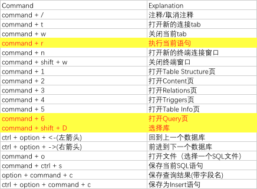

# MAC Book日常笔记

##1， Mac OS X删除临时文件释放空间

- 禁用 `SafeSleep` 休眠模式——能节省出 $1GB-16GB$ 空间

> 关闭 `OS X` 原生的休眠功能，也就是 `SafeSleep`	，这种休眠模式当 `Mac` 休眠或者没电池时会将内存中的内容储存在硬盘上的 `sleepimage` 文件上。 `sleepimage` 文件与 `Mac` 电脑的内存一样大，关闭 `SafeSleep` 可以不让系统自动创建该文件，缺点就是当 `Mac` 电脑没电池时，不能恢复到之前的状态。

```bash
# 禁用SafeSleep功能
☁  ~  sudo pmset -a hibernatemode 0
# 定位到/private/var/vm/删除已经存在的sleepimage文件，根据需要删除
☁  ~  cd /private/var/vm
# 重新开启SafeSleep功能
☁  ~  sudo pmset -a hibernatemode 3
```

- 移除系统嗓音文件

```bash
☁  ~  cd /System/Library/Speech/Voices
```

- 删除所有系统日志

```bash
☁  ~  cd /private/var/log
```

- 删除快速查看生成的缓存文件

```bash
☁  ~  cd /private/var/folders/
```

- 删除 `Emacs`

```bash
☁  ~  cd /usr/share/emacs
```

- 删除临时文件

```bash
☁  ~  cd /private/var/tmp
```

- 清除缓存文件

```bash
☁  ~  cd Library/Caches
```

## 2，安装mysql问题

1）问题：`error: [Errno 13] Permission denied: '/Library/Python/2.7/site-packages/_mysql.so' `

```bash
$ sudo chmod +a 'user:zhangbocheng  allow add_subdirectory,add_file,delete_child,directory_inherit' /Library/Python/2.7/site-packages   
```

2）问题：`EnvironmentError: mysql_config not found`

解决办法：安装 `mysql` 即可。

## 3，关闭OSX的SIP机制方法

> **SIP**：即：`System Integrity Protection`（系统完整性保护）。

> 1）重启 `OSX` 系统，然后按住 `Command+R`；
>
> 2）出现界面之后，选择 `Utilities menu` 中 `Terminal`；
>
> 3）在 `Terminal` 中输入 `csrutil disable` 关闭 `SIP` (`csrutil enable` 打开 `SIP`)；
>
> 4）重启 `reboot OSX`。

## 4，zsh 不能调用 bash 下命令解决方案

```bash
vim ~/.bash_profile

export PATH=/bin:/usr/bin:/usr/local/bin:"${PATH}"

:wq

source ~/.bash_profile  # 需要在zsh下执行
```

## 5，安装升级 Python

```bash
$ brew search python3
$ brew install python3
$ brew upgrade python

# /usr/local/bin/python3
```

## 6，sequelPro常用快捷键



## 参考文献

- [Mac OS X删除临时文件释放空间](https://blog.csdn.net/x_focus/article/details/50042385)


## 附录

#### 1，日常基础命令

```bash
# 查看端口是否被占用
$ sudo lsof -i:3306

# 杀进程
$ sudo kill -9 3306

# 启动／停止／重启／状态MSYQL服务
$ bash mysql.server start／stop／resart／status

# 修改root 密码    
$ mysqladmin -u root -p password xxxxxx

# 跟踪路由
☁  ~  traceroute 180.76.112.236 3306 
traceroute to 180.76.112.236 (180.76.112.236), 64 hops max, 3306 byte packets
 1  192.168.0.1 (192.168.0.1)  3.309 ms  1.346 ms  1.241 ms
 2  192.168.1.1 (192.168.1.1)  2.533 ms  5.676 ms  2.484 ms
 3  183.94.172.1 (183.94.172.1)  3.895 ms  74.408 ms  5.043 ms
 4  58.19.157.205 (58.19.157.205)  3.604 ms  3.516 ms  3.242 ms
 5  218.104.110.149 (218.104.110.149)  6.642 ms  5.882 ms  3.883 ms
 6  58.19.112.13 (58.19.112.13)  54.130 ms  97.687 ms  138.359 ms
 7  219.158.16.53 (219.158.16.53)  34.991 ms  25.782 ms  24.958 ms
 8  124.65.194.86 (124.65.194.86)  32.338 ms  27.921 ms  27.784 ms
 9  124.65.62.42 (124.65.62.42)  26.102 ms * *
10  * 61.49.140.106 (61.49.140.106)  26.099 ms  38.736 ms
11  182.61.254.133 (182.61.254.133)  35.196 ms  29.947 ms  27.130 ms

# 远程登陆服务器
☁  ~  ssh  root@114.115.142.32
```

#### 2，VIM 常用命令

```bash
:<<'
1.跳到文本的最后一行：按“G”,即“shift+g”
2.跳到最后一行的最后一个字符 ： 先重复1的操作即按“G”，之后按“$”键，即“shift+4”。
3.跳到第一行的第一个字符：先按两次“g”，
4.跳转到当前行的第一个字符：在当前行按“0”。
5.vi加密。进入vi，输入":"  + "X" 之后就提示你输入两次密码。之后:wq 保存退出。再次进入时就提示你输入密码了。如果你不想要密码了，就:X 提示你输入密码时连续按两次回车，就搞定了。

yy复制当前行
yw复制一个单词
y$复制光标到结尾
y^复制光标到行首
#yy复制#行
#yw复制#个单词
m,ny复制m到n行内容。
粘贴在命令模式下，将光标移动到将要粘贴的行处，按“p”进行粘贴。
'

# vim添加行号
vi /etc/vimrc
:set number

:wq!

## 1) 文件内全部替换：（把abc替换成123）
## (如文件内有#，可用/替换,:%s/abc/123/g)
:%s#abc#123#g 

## 2) 文件内局部替换：（把20行到30行内abc替换成123）
:20,30s#abc#123(如文件内有#，可用/替换,:%s/abc/123/g)

# 查看VIMRC所使用的配置文件，vim 打开，推出编辑模式
echo $MYVIMRC

# 显示高亮节和自动缩排
zsyntax on
:set autoindent

# 删除多行
: n,m de

# 去重
$ awk '!a[$0]++' company_list_data.txt >> new.txt
```

