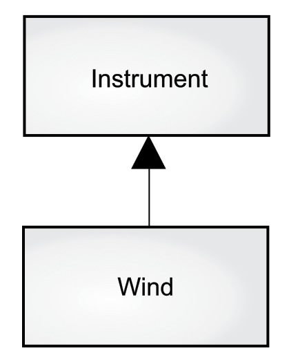

# 《Java编程思想（第5版）》读书笔记

> 地址：https://lingcoder.github.io/OnJava8/#/sidebar

## 一，对象的概念

#### 1，抽象

所有编程语言都提供 **抽象机制**。从某种程度上来说，问题的复杂度直接取决于抽象的类型和质量。

将问题空间中的元素以及它们在解决方案空间的表示称作“**对象**”（`Object`）。

一个对象具有自己的状态、行为和标识，这意味着对象有自己的内部数据（提供状态）、方法（产生行为）、并彼此区分（每个对象在内存中都有唯一的地址）。

面向对象程序设计方法（`smalltalk`）：

> 1）万物皆对象：从要解决的问题身上抽象出概念性的组件，然后在程序中将其表示为一个对象；
>
> 2）程序是一组对象，通过消息传递来告知彼此该做什么（**重要特征**）；
>
> 3）每个对象都有自己的存储空间，可容纳其他对象；
>
> 4）每个对象都有一种类型；
>
> 5）同一类所有对象都能接收相同的消息。（**可替换性**）

#### 2，接口

所有对象都是唯一的，但同时也是具有相同的特性和行为的对象所归属的类的一部分。

“类型”与“接口”的对应关系是面向对象程序设计的基础。

#### 3，服务

在开发或理解程序设计时，我们可以将对象看成是“服务提供者”，最终目标是开发或调用工具库中已有的一些对象，提供理想的服务来解决问题。

软件设计的基本原则是高内聚：每个组件的内部作用明确，功能紧密相关。

#### 4，封装

`Java` 有三个显式关键字来设置类中的访问权限：`public`（公开），`private`（私有）和`protected`（受保护）。这些访问修饰符决定了谁能使用它们修饰的方法、变量或类。

1）`public`（公开）表示任何人都可以访问和使用该元素；

2）`private`（私有）除了类本身和类内部的方法，外界无法直接访问该元素。`private` 是类和调用者之间的屏障。任何试图访问私有成员的行为都会报编译时错误；

3）`protected`（受保护）类似于 `private`，区别是子类可以访问 `protected` 的成员，但不能访问 `private` 成员；

4）`default`（默认），默认访问权限。`default` 被称为包访问，因为该权限下的资源可以被同一包（库组件）中其他类的成员访问。

#### 5，复用

代码和设计方案的复用性是面向对象程序设计的优点之一。可以通过重复使用某个类的对象来达到这种复用性：

- **组合**（`Composition`）经常用来表示“拥有”关系（`has-a relationship`），例如，“汽车拥有引擎”；
- **聚合**（`Aggregation`）动态的**组合**。

两个类生命周期不同步，则是聚合关系，生命周期同步就是组合关系。

#### 6，继承

在继承过程中，若原始类（正式名称叫作 **基类**、**超类** 或 **父类**）发生了变化，修改过的“克隆”类（正式名称叫作 **继承类** 或者 **子类**）也会反映出这种变化。

**继承** 通过基类和派生类的概念来表达这种相似性；基类包含派生自它的类型之间共享的所有特征和行为；创建基类以表示思想的核心；从基类中派生出其他类型来表示实现该核心的不同方式。

继承应该只覆盖基类的方法(不应该添加基类中没有的方法)吗？如果这样的话，基类和派生类就是相同的类型了，因为它们具有相同的接口。这会造成，你可以用一个派生类对象完全替代基类对象，这叫作”**纯粹替代**"，也经常被称作”**替代原则**"。在某种意义上，这是一种处理继承的理想方式，把这种基类和派生类的关系称为 **是一个（`is-a`）关系**。

在派生类添加了新的接口元素，从而扩展接口。虽然新类型仍然可以替代基类，但是这种替代不完美，原因在于基类无法访问新添加的方法。这种关系称为 **像是一个(`is-like-a`)关系**。

#### 7，多态

在传统意义上，编译器不能进行函数调用。由非 `OOP` 编译器产生的函数调用会引起所谓的 **早期绑定**，这意味着编译器生成对特定函数名的调用，该调用会被解析为将执行的代码的绝对地址。

通过继承，程序直到运行时才能确定代码的地址，因此发送消息给对象时，还需要其他一些方案。为了解决这个问题，面向对象语言使用 **后期绑定** 的概念。当向对象发送信息时，被调用的代码直到运行时才确定。编译器确保方法存在，并对参数和返回值执行类型检查，但是它不知道要执行的确切代码。

在 `Java` 中，动态绑定是默认行为，不需要额外的关键字来实现多态性。

```java
void doSomething(Shape shape) {
    shape.erase();
    // ...
    shape.draw();
}
```

```java
    Circle circle = new Circle();
    Triangle triangle = new Triangle();
    Line line = new Line();
    doSomething(circle);
    doSomething(triangle);
    doSomething(line);
```

把子类当成其基类来处理的过程叫做“**向上转型**”（`upcasting`）。在面向对象的编程里，经常利用这种方法来给程序解耦。

发送消息给对象时，如果程序不知道接收的具体类型是什么，但最终执行是正确的，这就是对象的“**多态性**” （`Polymorphism`）。面向对象的程序设计语言是通过“**动态绑定**”的方式来实现对象的多态性的。编译器和运行时系统会负责对所有细节的控制；我们只需知道要做什么，以及如何利用多态性来更好地设计程序。

#### 8，单继承结构

所有对象都具有一个公共接口，因此它们最终都属于同一个基类，即  `Object`。

单继承的结构使得垃圾收集器的实现更为容易。这也是 `Java` 在 `C++` 基础上的根本改进之一。

#### 9，集合

“集合”这种类型的对象可以存储任意类型、数量的其他对象。

集合可以提供不同类型的接口和外部行为；不同的集合对某些操作有不同的效率。

强制类型转换将其转为更具体的类型，这个过程称为对象的“**向下转型**”。

**参数化类型机制** 可以使得编译器能够自动识别某个 `class` 的具体类型并正确地执行。`Java 5` 版本支持了参数化类型机制，称之为“**泛型**”（`Generic`），泛型是 `Java 5` 的主要特性之一。

#### 10，对象创建与生命周期

`Java` 使用动态内存分配。每次创建对象时，使用 `new` 关键字构建该对象的动态实例。

较之堆内存，在栈内存中创建对象，编译器能够确定该对象的生命周期并自动销毁它；然而如果你在堆内存创建对象的话，编译器是不知道它的生命周期的。

`Java` 的内存管理是建立在垃圾收集器上的，它能自动发现对象不再被使用并释放内存。

#### 11，异常处理

异常处理机制将程序错误直接交给编程语言甚至是操作系统。“异常”（`Exception`）是一个从出错点“抛出”（`thrown`）后能被特定类型的异常处理程序捕获（`catch`）的一个对象。它不会干扰程序的正常运行，仅当程序出错的时候才被执行。

“异常机制”提供了一种可靠地从错误状况中恢复的方法，使得我们可以编写出更健壮的程序。

## 二，万物皆对象

#### 1，对象创建

`new` 关键字代表：创建一个新的对象实例。

- 数据存储

> 1）**寄存器**（`Registers`）最快的存储区域，位于 `CPU` 内部；
>
> 2）**栈内存**（`Stack`）存在于常规内存 `RAM`（随机访问存储器，`Random Access Memory`）区域中，可通过栈指针获得处理器的直接支持。栈指针下移分配内存，上移释放内存。这是一种仅次于寄存器的非常快速有效的分配存储方式。创建程序时，`Java` 系统必须知道栈内保存的所有项的生命周期，这种约束限制了程序的灵活性。因此，虽然在栈内存上存在一些 `Java` 数据（如对象引用），但 `Java` 对象本身的数据却是保存在堆内存的；
>
> 3）**堆内存**（`Heap`）这是一种通用的内存池（也在 `RAM` 区域），所有 `Java` 对象都存在于其中。用堆内存保存数据更具灵活性，但是分配和清理堆内存要比栈内存需要更多的时间。创建一个对象时，只需用 `new` 命令实例化对象即可，当执行代码时，会自动在堆中进行内存分配；
>
> 4）**常量存储**（`Constant storage`）常量值通常直接放在程序代码中，因为它们永远不会改变。如需严格保护，可考虑将它们置于只读存储器 `ROM` （只读存储器，`Read Only Memory`）中；
>
> 5）**非 RAM 存储**（`Non-RAM storage`）数据完全存在于程序之外，在程序未运行以及脱离程序控制后依然存在。两个例子：（1）序列化对象：对象被转换为字节流，通常被发送到另一台机器；（2）持久化对象：对象被放置在磁盘上，即使程序终止，数据依然存在。

- 基本类型的存储（**栈**）

| 基本类型  | 大小      | 最小值      | 最大值                | 包装类型    |
| --------- | --------- | ----------- | --------------------- | ----------- |
| `boolean` | —         | —           | —                     | `Boolean`   |
| `char`    | `16 bits` | `Unicode` 0 | `Unicode` $2^{16} -1$ | `Character` |
| `byte`    | `8 bits`  | -128        | +127                  | `Byte`      |
| `short`   | `16 bits` | $- 2^{15}$  | $+ 2^{15} -1$         | `Short`     |
| `int`     | `32 bits` | $- 2^{31}$  | $+ 2^{31} -1$         | `Integer`   |
| `long`    | `64 bits` | $- 2^{63}$  | $+ 2^{63} -1$         | `Long`      |
| `float`   | `32 bits` | `IEEE754`   | `IEEE754`             | `Float`     |
| `double`  | `64 bits` | `IEEE754`   | `IEEE754`             | `Double`    |
| `void`    | —         | —           | —                     | `Void`      |

基本类型自动转换成包装类型（**自动装箱**）

```java
Character ch = 'x';
```

包装类型转化为基本类型（**自动拆箱**）

```java
char c = ch;
```

在 `Java` 中有两种类型的数据可用于高精度的计算。它们是 `BigInteger` 和 `BigDecimal`。尽管它们大致可以划归为“包装类型”，但是它们并没有对应的基本类型。

- 数组的存储

当创建对象数组时，实际上是创建了一个引用数组，并且每个引用的初始值都为 **null** 。在使用该数组之前，我们必须为每个引用指定一个对象 。如果我们尝试使用为 **null** 的引用，则会在运行时报错。因此，在 `Java` 中就防止了数组操作的常规错误。还可创建基本类型的数组，编译器通过将该数组的内存全部置 **零** 来保证初始化。

#### 2，代码注释

`Java` 中有两种类型的注释：

> 1）是传统的 `C` 风格的注释，以 `/*` 开头，可以跨越多行，到 `*/ ` 结束；
>
> 2）注释形式来自 `C++` ，它是单行注释，以 `//` 开头并一直持续到行结束。

#### 3，对象清理

**作用域** 决定了在该范围内定义的变量名的可见性和生存周期。在 `C、 C++` 和 `Java` 中，作用域是由大括号 `{}` 的位置决定的。

`Java` 对象与基本类型具有不同的生命周期。当我们使用 `new` 关键字来创建 `Java` 对象时，它的生命周期将会超出作用域。

`Java` 的垃圾收集器会检查所有 `new` 出来的对象并判断哪些不再可达，继而释放那些被占用的内存，供其他新的对象使用。

#### 4，类的创建

当创建好一个类之后，可以往类里存放两种类型的元素：**方法**（`method`）和 **字段**（`field`）。类的字段可以是基本类型，也可以是引用类型。如果类的字段是对某个对象的引用，那么必须要初始化该引用将其关联到一个实际的对象上。每个对象都有用来存储其字段的空间。通常，**字段不在对象间共享**。

如果类的成员变量（字段）是基本类型，那么在类初始化时，这些类型将会被赋予一个初始值。

==注意：== 在方法中定义的基本类型数据变量，该变量不会自动初始化，如果没有初始化， `Java` 将会提示“编译时错误，该变量可能尚未被初始化”。

在 `Java` 中，方法决定对象能接收哪些消息。方法的基本组成部分包括名称、参数、返回类型、方法体。

方法名和参数列表统称为 **方法签名**（`signature of the method`）。签名作为方法的唯一标识。

- 命名可见性

  在 `Java` 中防止命名冲突的解决方案：为一个类库生成一个明确的名称，`Java` 创建者希望我们反向使用自己的网络域名，因为域名通常是唯一的。

- `static` 关键字

> 1）有时只想为特定字段（注：也称为属性、域）分配一个共享存储空间，而不去考虑究竟要创建多少对象，甚至根本就不创建对象；
>
> 2）创建一个与此类的任何对象无关的方法。也就是说，即使没有创建对象，也能调用该方法

一些面向对象的语言使用类数据（`class data`）和类方法（`class method`），表示静态数据和方法只是作为类，而不是类的某个特定对象而存在的。

```java
class StaticTest {
    static int i = 47;
}
```

现在，即使创建了两个 `StaticTest` 对象，但是静态变量 `i` 仍只占一份存储空间。两个对象都会共享相同的变量 `i`。

```java
// 方法一：通过实例对象引用静态变量
StaticTest st1 = new StaticTest();
StaticTest st2 = new StaticTest();

// 方法二：通过类名直接饮引用静态变量（推荐使用）
StaticTest.i++;
```

直接通过类来调用，相比非静态的对象，`static` 属性改变了数据创建的方式。同样，当 `static` 关键字修饰方法时，它允许我们无需创建对象就可以直接通过类的引用来调用该方法。

## 三，运算符 & 控制流

#### 1，运算符

所有运算符都能根据自己的运算对象生成一个值。除此以外，一些运算符可改变运算对象的值，这叫作“**副作用**”（`Side Effect`）。

通常，当我们向程序中插入一个 **字面值常量**（`Literal`）时，编译器会确切地识别它的类型。当类型不明确时，必须辅以字面值常量关联来帮助编译器识别。

`Java 7` 中有一个深思熟虑的补充：可以在数字字面量中包含下划线 `_`，以使结果更清晰。

 `Java` 用 `%n` 实现的可以忽略平台间差异而生成适当的换行符，但只有当你使用 `System.out.printf()` 或 `System.out.format()` 时。对于 `System.out.println()`，我们仍然必须使用 `\n`；如果你使用 `%n`，`println()` 只会输出 `%n` 而不是换行符。

移位可以与等号 `<<=` 或 `>>=` 或 `>>>=` 组合使用。其中，无符号右移 `>>>`，忽略符号位，空位都以0补齐。

从 **float** 和 **double** 转换为整数值时，小数位将被截断；若想对结果进行四舍五入，可以使用 `java.lang.Math` 的 ` round()` 方法。

通常，表达式中最大的数据类型是决定表达式结果的数据类型。

#### 2，控制流

**迭代语句**：**while**，**do-while** 和 **for** 用来控制循环语句（有时也称迭代语句）。只有控制循环的布尔表达式计算结果为 `false`，循环语句才会停止。

`Java 5` 引入了更为简洁的“增强版 **for** 循环”语法来操纵数组和集合。

> `forEach()` 方法是 `Java 8` 为所有集合新增的方法。该方法定义在 `java.lang.Iterable` 接口中；
>
> `java.lang.Iterable` 接口是 `Java 5` 引入的，目的在于为实现该语句的对象提供 「 `for-each` 循环 」 语句。换句话说，所有实现了该接口的对象都可以使用 `for` 语句进行迭代。

`Java` 中并不支持 **goto** 语句，但是可以使用 **标签** 机制。

```java
package com.exam;

/**
 * java 标签机制
 *
 * @author zhangbocheng
 * @version v1.0
 * @date 2020/10/18 18:17
 */
public class LabeledFor {

    public static void main(String[] args) {

        int i = 0;
        outer:
        for (; true;) {
            System.out.println("outer loop");
            inner:
            for (; i < 10; i++) {
                System.out.println("inner loop");
                System.out.println("i = " + i);
                if (i == 2) {
                    System.out.println("continue");
                    continue;
                }

                if (i == 3) {
                    System.out.println("break");
                    i++;
                }

                if (i == 7) {
                    System.out.println("continue outer");
                    i++;
                    continue outer;
                }

                if (i == 8) {
                    System.out.println("break outer");
                    break outer;
                }

                for (int j = 0; j < 5; j++) {
                    if (i == 3) {
                        System.out.println("continue outer");
                        continue outer;
                    }
                }
            }
        }
    }
}
```

`Java 7` 增加了在字符串上 **switch** 的用法。

## 四，初始化和清理

#### 1，构造器

在 `Java` 中，类的设计者通过构造器保证每个对象的初始化。

构造器没有返回值，它是一种特殊的方法。但它和返回类型为 `void` 的普通方法不同，普通方法可以返回空值，你还能选择让它返回别的类型；而构造器没有返回值，却同时也没有给你选择的余地（`new` 表达式虽然返回了刚创建的对象的引用，但构造器本身却没有返回任何值）。如果它有返回值，并且你也可以自己选择让它返回什么，那么编译器就还得知道接下来该怎么处理那个返回值（这个返回值没有接收者）。

一个无参构造器就是不接收参数的构造器，用来创建一个"默认的对象"。如果你创建一个类，类中没有构造器，那么编译器就会自动为你创建一个无参构造器。

**this** 关键字只能在非静态方法内部使用。当你调用一个对象的方法时，**this** 生成了一个对象引用。

**this**，意味着"这个对象"或"当前对象"，它本身生成对当前对象的引用。

**static** 方法中不会存在 **this**。你不能在静态方法中调用非静态方法（反之可以）。静态方法是为类而创建的，不需要任何对象。

> **析构函数**( `destructor` ) 与构造函数相反，当对象结束其生命周期，如对象所在的函数已调用完毕时，系统自动执行析构函数。析构函数往往用来做“清理善后” 的工作（例如在建立对象时用 `new` 开辟了一片内存空间，`delete` 会自动调用析构函数后释放内存）。

#### 2，方法重载

在 `Java (C++)` 中，还有一个因素也促使了必须使用方法重载：构造器。每个被重载的方法必须有独一无二的参数列表。

#### 3，垃圾回收器

当垃圾回收器准备回收对象的内存时，首先会调用其 `finalize()` 方法，并在下一轮的垃圾回收动作发生时，才会真正回收对象占用的内存。

> 1）对象可能不被垃圾回收；
>
> 2）垃圾回收不等同于析构；
>
> 3）垃圾回收只与内存有关。

对 `finalize()` 的需求限制到一种特殊情况，即通过某种创建对象方式之外的方式为对象分配了存储空间。

无论是"垃圾回收"还是"终结"，都不保证一定会发生。如果 `Java` 虚拟机（`JVM`）并未面临内存耗尽的情形，它可能不会浪费时间执行垃圾回收以恢复内存。

`finalize()` 有一个有趣的用法，它不依赖于每次都要对 `finalize()` 进行调用，这就是 **对象终结条件的验证**。

```java
package com.exam;

/**
 * interview
 *
 * @author zhangbocheng
 * @version v1.0
 * @date 2020/10/18 22:03
 */
public class BookFinalize {

    public static void main(String[] args) {
        Book novel = new Book(true);
        novel.checkIn();

        new Book(true);

        System.gc();
    }
}


class Book {

    boolean checkedOut = false;

    Book(boolean checkedOut) {
        this.checkedOut = checkedOut;
    }

    void checkIn() {
        checkedOut = true;
    }

    @Override
    protected void finalize() throws Throwable {
        if (checkedOut) {
            System.out.println("Error: checked out.");
        }
    }
}

```

本例的终结条件是：所有的 **Book** 对象在被垃圾回收之前必须被登记。但在 `main()` 方法中，有一本书没有登记。要是没有 `finalize()` 方法来验证终结条件，将会很难发现这个 `bug`。

- 垃圾回收器说如何工作

一种简单但速度很慢的垃圾回收机制叫做 **引用计数**。每个对象中含有一个引用计数器，每当有引用指向该对象时，引用计数加 1；当引用离开作用域或被置为 **null** 时，引用计数减 1。这个机制存在一个缺点：如果对象之间存在循环引用，那么它们的引用计数都不为 0，就会出现应该被回收但无法被回收的情况。

在更快的策略中，垃圾回收器并非基于引用计数。它们依据的是：对于任意"活"的对象，一定能最终追溯到其存活在栈或静态存储区中的引用。这个引用链条可能会穿过数个对象层次，由此，如果从栈或静态存储区出发，遍历所有的引用，你将会发现所有"活"的对象。

如何处理找到的存活对象，取决于不同的 `Java` 虚拟机实现。其中有一种做法叫做 **停止-复制**（`stop-and-copy`）。顾名思义，这需要先暂停程序的运行（不属于后台回收模式），然后将所有存活的对象从当前堆复制到另一个堆，没有复制的就是需要被垃圾回收的。效率低下主要原因：

> 1）必须有两个堆，然后在这两个分离的堆之间来回折腾，得维护比实际需要多一倍的空间。某些 `Java` 虚拟机对此问题的处理方式是，按需从堆中分配几块较大的内存，复制动作发生在这些大块内存之间；
>
> 2）复制本身。一旦程序进入稳定状态之后，可能只会产生少量垃圾，甚至没有垃圾。尽管如此，复制回收器仍然会将所有内存从一处复制到另一处，这很浪费。

要是没有新垃圾产生，就会转换到另一种模式（即"自适应"）。这种模式称为 **标记-清扫**（`mark-and-sweep`），思路是从栈和静态存储区出发，遍历所有的引用，找出所有存活的对象。

#### 5，初始化

- 成员初始化

`Java` 尽量保证所有变量在使用前都能得到恰当的初始化。

类的每个基本类型数据成员保证都会有一个初始值；在类里定义一个对象引用时，如果不将其初始化，那么引用就会被赋值为 **null**。

- 构造器初始化

```java
// housekeeping/Counter.java

public class Counter {
    int i;

    Counter() {
        i = 7;
    }
    // ...
}
```

**i** 首先会被初始化为 **0**，然后变为 **7**。

在类中变量定义的顺序决定了它们初始化的顺序。即使变量定义散布在方法定义之间，它们仍会在任何方法（包括构造器）被调用之前得到初始化。

```java
package com.exam;

/**
 * 初始化的顺序
 *
 * @author zhangbocheng
 * @version v1.0
 * @date 2020/10/21 10:31
 */
public class OrderOfInitialization {
    public static void main(String[] args) {
        House house = new House(1);
        house.f();

        house = new House();
        house.f();
    }
}


class Window {
    Window(int marker) {
        System.out.println("Window(" + marker + ")");
    }
}


class House {
    Window w1 = new Window(1);

    House() {
        System.out.println("House() ");
        w3 = new Window(33);
    }

    House(int i) {
        System.out.println("House(): " + i);
        w3 = new Window(33);
    }

    Window w2 = new Window(2);

    void f() {
        System.out.println("f()");
    }

    Window w3 = new Window(3);
}
```

- 静态数据的初始化

无论创建多少个对象，静态数据都只占用一份存储区域。**static** 关键字不能应用于局部变量，所以只能作用于属性（字段、域）。

```java
package com.exam;

/**
 * 静态数据的初始化
 *
 * @author zhangbocheng
 * @version v1.0
 * @date 2020/10/21 10:50
 */
public class StaticInitialization {

    public static void main(String[] args) {
        System.out.println("main creating new Cupboard()");
        new Cupboard();
        System.out.println("main creating new Cupboard()");
        new Cupboard();
        System.out.println("main created new Cupboard()");

        table.f2(1);
        cupboard.f3(1);
    }

    static Table table = new Table();
    static Cupboard cupboard = new Cupboard();
}


class Bowl {
    Bowl(int marker) {
        System.out.println("Bowl(" + marker + ")");
    }

    void f1(int marker) {
        System.out.println("f1(" + marker + ")");
    }
}


class Table {
    static Bowl bowl1 = new Bowl(1);

    Table() {
        System.out.println("Table()");
        bowl2.f1(1);
    }

    void f2(int marker) {
        System.out.println("f2(" + marker + ")");
    }

    static Bowl bowl2 = new Bowl(2);
}


class Cupboard {
    Bowl bowl3 = new Bowl(3);
    static Bowl bowl4 = new Bowl(4);

    Cupboard() {
        System.out.println("Cupboard()");
        bowl4.f1(2);
    }

    void f3(int marker) {
        System.out.println("f3(" + marker + ")");
    }

    static Bowl bowl5 = new Bowl(5);
}
```

静态初始化只有在必要时刻才会进行。如果不创建 **Table** 对象，也不引用 **Table.bowl1** 或 **Table.bowl2**，那么静态的 **Bowl** 类对象 **bowl1** 和 **bowl2** 永远不会被创建。只有在第一个 **Table** 对象被创建（或被访问）时，它们才会被初始化。此后，静态对象不会再次被初始化。

初始化的顺序先是静态对象（如果它们之前没有被初始化的话）（==构造器实际上也是静态方法==），然后是非静态对象。要执行 `main()` 方法，必须加载 **StaticInitialization** 类，它的静态属性 **table** 和 **cupboard** 随后被初始化，这会导致它们对应的类也被加载，而由于它们都包含静态的 **Bowl** 对象，所以 **Bowl** 类也会被加载。因此，在这个特殊的程序中，所有的类都会在 `main()` 方法之前被加载。

创建对象的过程（假设有个名为 **Dog** 的类）：

> 1）即使没有显式地使用 **static** 关键字，构造器实际上也是静态方法。所以，当首次创建 **Dog** 类型的对象或是首次访问 **Dog** 类的静态方法或属性时，Java 解释器必须在类路径中查找，以定位 **Dog.class**；
>
> 2）当加载完 **Dog.class** 后，有关静态初始化的所有动作都会执行。因此，静态初始化只会在首次加载 **Class** 对象时初始化一次；
>
> 3）当用 `new Dog()` 创建对象时，首先会在堆上为 **Dog** 对象分配足够的存储空间；
>
> 4）分配的存储空间首先会被清零，即会将 **Dog** 对象中的所有基本类型数据设置为默认值（数字会被置为 0，布尔型和字符型也相同），引用被置为 **null**；
>
> 5）执行所有出现在字段定义处的初始化动作；
>
> 6）执行构造器。

将一组静态初始化动作放在类里面一个特殊的"静态子句"（有时叫做静态块）中，进行 **显式的静态初始化**。

Java 提供了被称为 **实例初始化** 的类似语法，用来初始化每个对象的非静态变量。

如果在编写程序时，不确定数组中需要多少个元素，可以使用 **new** 在数组中创建元素。

- 数组的初始化

**数组** 是相同类型的、用一个标识符名称封装到一起的一个对象序列或基本类型数据序列。

数组是通过方括号下标操作符 `[]` 来定义和使用的。要定义一个数组引用，只需要在类型名加上方括号；或者方括号放在标识符的后面。

#### 5，枚举类型

由于枚举类型的实例是常量，因此按照命名惯例，它们都用大写字母表示（如果名称中含有多个单词，使用下划线分隔）。

## 五，封装，复用，多态

#### 1，包

包内包含一组类，它们被组织在一个单独的命名空间（`namespace`）下。

一个 `Java` 源代码文件称为一个 **编译单元**（`compilation unit`）（有时也称 **翻译单元**（`translation unit`））。每个编译单元的文件名后缀必须是 `.java`。在编译单元中可以有一个 `public` 类，它的类名必须与文件名相同（包括大小写，但不包括后缀名 `.java`）。每个编译单元中只能有一个 `public` 类，否则编译器不接受。如果这个编译单元中还有其他类，那么在包之外是无法访问到这些类的，因为它们不是 `public` 类，此时它们为主 `public` 类提供“支持”类 。

**类库** 是一组类文件。每个源文件通常都含有一个 `public` 类和任意数量的非 `public` 类，因此每个文件都有一个 `public` 组件。如果把这些组件集中在一起，就需要使用关键字 `package`。

#### 2，访问权限修饰符

默认访问权限没有关键字，通常被称为 **包访问权限**（`package access`）（有时也称为 `friendly`）。

类控制着哪些代码有权访问自己的成员，取得对成员的访问权的唯一方式：

> 1）使成员成为 `public`，那么无论是谁，无论在哪，都可以访问它；
>
> 2）赋予成员默认包访问权限，不用加任何访问修饰符，然后将其他类放在相同的包内，这样，其他类就可以访问该成员；
>
> 3）继承的类既可以访问 `public` 成员，也可以访问 `protected` 成员（但不能访问 `private` 成员）。只有当两个类处于同一个包内，它才可以访问包访问权限的成员，但现在不用担心继承和 `protected`；
>
> 4）提供访问器（`accessor`）和修改器（`mutator`）方法（有时也称为”`get/set`" 方法），从而读取和改变值。

#### 3，接口

**访问控制** 通常被称为 **隐藏实现**（`implementation hiding`）。将数据和方法包装进类中并把具体实现隐藏被称作是 **封装**（`encapsulation`）。

类既不能是 **private** 的（这样除了该类自身，任何类都不能访问它），也不能是 **protected** 的。所以对于类的访问权限只有两种选择：包访问权限或者 **public**。  

#### 4，组合

编译器不会为每个引用创建一个默认对象，这是有意义的，因为在许多情况下，这会导致不必要的开销。初始化引用有四种方法：

> 1）当对象被定义时，这意味着它们总是在调用构造函数之前初始化；
>
> 2）在该类的构造函数中；
>
> 3）在实际使用对象之前，这通常称为 **延迟初始化**。在对象创建开销大且不需要每次都创建对象的情况下，它可以减少开销；
>
> 4）使用实例初始化。

#### 5，继承

在创建类时总是要继承，因为除非显式地继承其他类，否则就隐式地继承 	`Java` 的标准根类对象（`Object`）。

 通过调用基类构造函数在构造函数中执行初始化，该构造函数具有执行基类初始化所需的所有适当信息和特权。`Java` 自动在派生类构造函数中插入对基类构造函数的调用。

```java
package com.exam;

/**
 * 三个层次的继承
 *
 * @author zhangbocheng
 * @version v1.0
 * @date 2020/10/22 21:29
 */
public class Cartoon extends Drawing {

    public Cartoon() {
        System.out.println("Cartoon constructor.");
    }

    public static void main(String[] args) {
        Cartoon cartoon = new Cartoon();
    }
}


class Art {
    Art() {
        System.out.println("Art constructor.");
    }
}


class Drawing extends Art {
    Drawing() {
        System.out.println("Drawing constructor.");
    }
}
```

- 委托

`Java` 不直接支持的第三种重用关系称为 **委托**。这介于继承和组合之间，因为你将一个成员对象放在正在构建的类中(比如组合)，但同时又在新类中公开来自成员对象的所有方法(比如继承)。

```java
package com.exam;

/**
 * Java 委托实现
 *
 * @author zhangbocheng
 * @version v1.0
 * @date 2020/10/22 21:39
 */
public class SpaceShipDelegation {

    private String name;
    private SpaceShipControls controls = new SpaceShipControls();

    public SpaceShipDelegation(String name) {
        this.name = name;
    }

    public void back(int velocity) {
        controls.back(velocity);
    }

    public void down(int velocity) {
        controls.down(velocity);
    }

    public void forward(int velocity) {
        controls.forward(velocity);
    }

    public void left(int velocity) {
        controls.left(velocity);
    }

    private void right(int velocity) {
        controls.right(velocity);
    }

    public void up(int velocity) {
        controls.up(velocity);
    }

    public void turboBoost() {
        controls.turboBoost();
    }

    public static void main(String[] args) {
        SpaceShipDelegation delegation = new SpaceShipDelegation("NSEA Protector");
        delegation.forward(100);
    }
}


class SpaceShipControls {

    void up(int velocity) {}
    void down(int velocity) {}
    void left(int velocity) {}
    void right(int velocity) {}
    void forward(int velocity) {}
    void back(int velocity) {}
    void turboBoost() {}
}


class DerivedSpaceShip extends SpaceShipControls {

    private String name;
    public DerivedSpaceShip(String name) {
        this.name = name;
    }

    @Override
    public String toString() {
        return name;
    }
}
```

如果 `Java` 基类的方法名多次重载，则在派生类中重新定义该方法名不会隐藏任何基类版本。不管方法是在这个级别定义的，还是在基类中定义的，重载都会起作用。

当你想在新类中包含一个已有类的功能时，使用组合，而非继承。也就是说，在新类中嵌入一个对象（通常是私有的），以实现其功能。新类的使用者看到的是你所定义的新类的接口，而非嵌入对象的接口。

有时让类的用户直接访问到新类中的组合成分是有意义的。只需将成员对象声明为 **public** 即可（可以把这当作“半委托”的一种）。成员对象隐藏了具体实现，所以这是安全的。当用户知道你正在组装一组部件时，会使得接口更加容易理解。

- `protected`

在实际项目中，却经常想把一个事物尽量对外界隐藏，而允许派生类的成员访问。关键字 **protected** 就起这个作用。它表示“就类的用户而言，这是 **private** 的。但对于任何继承它的子类或在同一包中的类，它是可访问的。”（**protected** 也提供了包访问权限）。



继承图中派生类转型为基类是向上的，所以通常称作 **向上转型**。因为是从一个更具体的类转化为一个更一般的类，所以向上转型永远是安全的。也就是说，派生类是基类的一个超集。它可能比基类包含更多的方法，但它必须至少具有与基类一样的方法。在向上转型期间，类接口只可能失去方法，不会增加方法。

#### 6，`final`

一个被 **static** 和 **final** 同时修饰的属性只会占用一段不能改变的存储空间。

当用 **final** 修饰对象引用而非基本类型时，对于基本类型，**final** 使数值恒定不变，而对于对象引用，**final** 使引用恒定不变。一旦引用被初始化指向了某个对象，它就不能改为指向其他对象。但是，对象本身是可以修改的，Java 没有提供将任意对象设为常量的方法。

```java
public static void main(String[] args) {
  final int[] array = {1, 2, 3, 5, 4};

  for (int item: array) {
    System.out.printf("%d ", item);
  }

  array[3] = 10;
  for (int item: array) {
    System.out.printf("%d ", item);
  }
}
```

**空白 `final`** 指的是没有初始化值的 **final** 属性。编译器确保空白 `final` 在使用前必须被初始化。这样既能使一个类的每个对象的 **final** 属性值不同，也能保持它的不变性。

在参数列表中，将参数声明为 `final` 意味着在方法中不能改变参数指向的对象或基本变量。

使用 **final** 方法的原因：

> 1）给方法上锁，防止子类通过覆写改变方法的行为，这是出于继承的考虑，确保方法的行为不会因继承而改变；
>
> 2）效率。在早期的 `Java` 实现中，如果将一个方法指明为 **final**，就是同意编译器把对该方法的调用转化为内嵌调用。当编译器遇到 **final** 方法的调用时，就会很小心地跳过普通的插入代码以执行方法的调用机制（将参数压栈，跳至方法代码处执行，然后跳回并清理栈中的参数，最终处理返回值），而用方法体内实际代码的副本替代方法调用。这消除了方法调用的开销。但是如果一个方法很大代码膨胀，你也许就看不到内嵌带来的性能提升，因为内嵌调用带来的性能提高被花费在方法里的时间抵消了。
>
> 在最近的 `Java` 版本中，虚拟机可以探测到这些情况（尤其是 `hotspot` 技术），并优化去掉这些效率反而降低的内嵌调用方法。有很长一段时间，使用 **final** 来提高效率都被阻止。你应该让编译器和 `JVM` 处理性能问题，只有在为了明确禁止覆写方法时才使用 **final**。

类中所有的 **private** 方法都隐式地指定为 **final**。因为不能访问 **private** 方法，所以不能覆写它。

当说一个类是 **final** （**final** 关键字在类定义之前），就意味着它不能被继承，因为类的设计就是永远不需要改动，或者是出于安全考虑不希望它有子类。

#### 7，类初始化和加载

一个类当它任意一个 **static** 成员被访问时，就会被加载；首次使用时就是 **static** 初始化发生时，所有的 **static** 对象和 **static** 代码块在加载时按照文本的顺序（在类中定义的顺序）依次初始化，**static** 变量只被初始化一次。

```java
package com.exam;

/**
 * 继承和初始化
 *
 * @author zhangbocheng
 * @version v1.0
 * @date 2020/10/23 15:37
 */
public class Beetle extends Insect {

    private int k = printInit("Beetle.k initialized.");

    public Beetle() {
        System.out.println("k = " + k + ", j = " + j);
    }

    private static int x2 = printInit("Static Beetle.x2 initialized.");

    public static void main(String[] args) {
        System.out.println("Beetle constructor");
        new Beetle();
    }
}


class Insect {

    private int i = 9;
    protected int j;

    Insect() {
        System.out.println("i = " + i + ", j = " + j);
        j = 39;
    }

    private static int x1 = printInit("Static Insect.x1 initialized.");

    static int printInit(String s) {
        System.out.println(s);
        return 47;
    }
}
```

运行结果：

```bash
Static Insect.x1 initialized.
Static Beetle.x2 initialized.
Beetle constructor
i = 9, j = 0
Beetle.k initialized.
k = 47, j = 39
```

解释：

> 在继承中代码的执行顺序为：静态对象—>非静态对象—>构造函数；父类—>子类。
>
> > 1）父类静态对象，父类静态代码块；
> >
> > 2）子类静态对象，子类静态代码块；
> >
> > 3）父类非静态对象，父类非静态代码块；
> >
> > 4）父类构造函数；
> >
> > 5）子类非静态对象，子类非静态代码块；
> >
> > 6）子类构造函数。

#### 8， 多态

```java
package com.exam;

/**
 * interview
 *
 * @author zhangbocheng
 * @version v1.0
 * @date 2020/10/23 19:13
 */
public class PolymorphicTest {

    public static void main(String[] args) {
        // 输出 22 34 17
        System.out.println(new B().getValue());
    }

    static class A {
        public int value;

        public A (int v) {
            setValue(v);
        }

        public void setValue(int value) {
            this.value = value;
        }

        public int getValue() {
            try {
                value++;
                return value;
            } finally {
                this.setValue(value);
                System.out.println(value);
            }
        }
    }

    static class B extends A {

        public B () {
            super(5);
            setValue(getValue() - 3);
        }

        @Override
        public void setValue(int value) {
            super.setValue(2 * value);
        }
    }
}
```

解释：

> 1）`new B()`，调用 `super() ==> value = 10`，`setValue` 有重写；初始化未完成，继续 `getVaule()`，该方法没有重写，调用父类的方法，在 `return` 之前调用 `finally` ，其中，`setValue()` 有重写，执行后， `value=22`；但是**真正返回的值为11，而不是22** ；
>
> 2）`getValue()` 返回值为11，调用 `setValue()` 后，`value=16`，经过（1）分析知，暂存值为17，故而输出为34；真正返回为8，最后输出为17。

- 方法调用绑定

将一个方法调用和一个方法主体关联起来称作 **绑定**。若绑定发生在程序运行前（如果有的话，由编译器和链接器实现），叫做 **前期绑定**。

在运行时根据对象的类型进行绑定称为 **后期绑定** 也称为 **动态绑定** 或 **运行时绑定**。当一种语言实现了后期绑定，就必须具有某种机制在运行时能判断对象的类型，从而调用恰当的方法。即，编译器仍然不知道对象的类型，但是方法调用机制能找到正确的方法体并调用。`Java` 中除了 **static** 和 **final** 方法（**private** 方法也是隐式的 **final**）外，其他所有方法都是后期绑定。这意味着通常情况下，我们不需要判断后期绑定是否会发生——它自动发生。

- 陷阱

> **重写私有方法**：只有非 **private** 方法才能被重写，但是得小心重写 **private** 方法的现象，编译器不报错，但不会按我们所预期的执行；
>
> **属性与静态方法**：当子对象向上转型为父对象引用时，任何属性访问都被编译器解析，因此不是多态的；如果一个方法是静态（**static**）的，它的行为就不具有多态性；静态的方法只与类关联，与单个的对象无关。

```java
package com.exam;

/**
 * interview
 *
 * @author zhangbocheng
 * @version v1.0
 * @date 2020/10/23 23:51
 */
public class Sub extends Super {

    public int field = 1;

    @Override
    public int getField() {
        return field;
    }

    public int getSuperField() {
        return super.field;
    }


    public static void main(String[] args) {
        Super sup = new Sub();
        // 输出： 0 1
        System.out.println(sup.field + " " + sup.getField());

        Sub sub = new Sub();
        // 输出： 1 1 0  
        System.out.println(sub.field + " " + sub.getField() + " " + sub.getSuperField());
    }
}


class Super {

    public int field = 0;

    public int getField() {
        return field;
    }
}
```

- 构造器调用顺序

对象的构造器调用顺序：

> 1）基类构造器被调用。这个步骤被递归地重复，这样一来类层次的顶级父类会被最先构造，然后是它的派生类，以此类推，直到最底层的派生类；
>
> 2）按声明顺序初始化成员；
>
> 3）调用派生类构造器的方法体。

对于基类（遵循 `C++` 析构函数的形式），首先进行派生类的清理工作，然后才是基类的清理。

- 构造器内部多态方法的行为

如果在构造器中调用了动态绑定方法，就会用到那个方法的重写定义。然而，调用的结果难以预料因为被重写的方法在对象被完全构造出来之前已经被调用，这使得一些 `bug` 很隐蔽，难以发现。

从概念上讲，构造器的工作就是创建对象。在构造器内部，整个对象可能只是部分形成——只知道基类对象已经初始化。如果构造器只是构造对象过程中的一个步骤，且构造的对象所属的类是从构造器所属的类派生出的，那么派生部分在当前构造器被调用时还没有初始化。然而，一个动态绑定的方法调用向外深入到继承层次结构中，它可以调用派生类的方法。如果你在构造器中这么做，就可能调用一个方法，该方法操纵的成员可能还没有初始化——这肯定会带来灾难。

```java
package com.exam;

/**
 * interview
 *
 * @author zhangbocheng
 * @version v1.0
 * @date 2020/10/25 00:06
 */
public class RoundGlyph extends Glyph {

    private int radius = 1;

    RoundGlyph(int r) {
        radius = r;
        System.out.println("RoundGlyph.RoundGlyph(), radius = " + radius);
    }

    @Override
    void draw() {
        System.out.println("RoundGlyph.draw(), radius = " + radius);
    }

    public static void main(String[] args) {
        new RoundGlyph(5);
    }
}


class Glyph {

    void draw() {
        System.out.println("Glyph.draw()");
    }

    Glyph() {
        System.out.println("Glyph() before draw()");
        draw();
        System.out.println("Glyph() after draw()");
    }
}
```

运行结果：

```bash
Glyph() before draw()
RoundGlyph.draw(), radius = 0
Glyph() after draw()
RoundGlyph.RoundGlyph(), radius = 5
```

#### 9，协变返回类型

在面向对象程序设计中，协变返回类型指的是子类中的成员函数的返回值类型不必严格等同于父类中被重写的成员函数的返回值类型，而可以是更 "狭窄" 的类型。

`Java 5` 中引入了协变返回类型，这表示派生类的被重写方法可以返回基类方法返回类型的派生类型。

```java
package com.exam;

/**
 * interview
 *
 * @author zhangbocheng
 * @version v1.0
 * @date 2020/10/25 00:22
 */
public class CovariantReturn {

    public static void main(String[] args) {
        Mill m = new Mill();
        Grain g = m.process();
        System.out.println(g);

        m = new WheatMill();
        g = m.process();
        System.out.println(g);
    }
}


class Grain {

    @Override
    public String toString() {
        return "Grain";
    }
}


class Wheat extends Grain {

    @Override
    public String toString() {
        return "Wheat";
    }
}


class Mill {

    Grain process() {
        return new Grain();
    }
}


class WheatMill extends Mill {

    @Override
    Wheat process() {
        return new Wheat();
    }
}
```

#### 10，使用继承设计

**通用准则**：使用继承表达行为的差异，使用属性表达状态的变化。

只有基类的方法才能在派生类中被重写，这被称作 **纯粹的“`is - a`”关系**，因为类的接口已经确定了它是什么。


按这种方式思考，似乎只有纯粹的“`is - a`”关系才是唯一明智的做法，其他任何设计只会导致混乱且注定失败。一旦按这种方式开始思考，就会转而发现继承扩展接口才是解决特定问题的完美方案。这可以称为 **“`is - like - a`” 关系**，因为派生类就像是基类——它有着相同的基本接口，但还具有需要额外方法实现的其他特性。


在 `Java` 中，每次转型都会被检查，所以即使只是进行一次普通的加括号形式的类型转换，在运行时这个转换仍会被检查，以确保它的确是希望的那种类型。如果不是，就会得到 `ClassCastException`（类转型异常）。这种在运行时检查类型的行为称作 **运行时类型信息**。

## 六，接口，内部类

#### 1，抽象类与方法

`Java` 提供了一个叫做 **抽象方法** 的机制，这个方法是不完整的：它只有声明没有方法体。

```java
abstract void f();
```

包含抽象方法的类叫做 **抽象类**。如果一个类包含一个或多个抽象方法，那么类本身也必须限定为抽象的，否则，编译器会报错。

#### 2，接口

使用 **interface** 关键字创建接口；描述 `Java 8` 之前的接口更加容易，因为它们只允许抽象方法；`Java 8` 允许接口包含默认方法和静态方法。

接口同样可以包含属性，这些属性被隐式指明为 **static** 和 **final**。

- 默认方法

`Java 8` 为关键字 **default** 增加了一个新的用途（之前只用于 **switch** 语句和注解中）。当在接口中使用它时，任何实现接口却没有定义方法的时候可以使用 **default** 创建的方法体。默认方法比抽象类中的方法受到更多的限制，但是非常有用。

```java
package com.exam;

/**
 * interview
 *
 * @author zhangbocheng
 * @version v1.0
 * @date 2020/10/25 10:35
 */
public interface InterfaceJava8 {
    
    void f1();
    void f2();
    
    default void newFunc() {
        System.out.println("Java 8 Interface default method.");
    }
}
```

增加默认方法的极具说服力的理由是它允许在不破坏已使用接口的代码的情况下，在接口中增加新的方法。默认方法有时也被称为 **守卫方法**或 **虚拟扩展方法**。

- 多继承

多继承意味着一个类可能从多个父类型中继承特征和特性。

`Java` 过去是一种严格要求单继承的语言：只能继承自一个类（或抽象类），但可以实现任意多个接口。在 `Java 8` 之前，接口没有包袱——它只是方法外貌的描述。

现在，`Java` 通过默认方法具有了某种多继承的特性。结合带有默认方法的接口意味着结合了多个基类中的行为。因为接口中仍然不允许存在属性（只有静态属性，不适用），所以属性仍然只会来自单个基类或抽象类，也就是说，不会存在状态的多继承。

`Java 8` 允许在接口中添加静态方法，这么做能恰当地把工具功能置于接口中，从而操作接口，或者成为通用的工具。

| 特性                 | 接口                                                       | 抽象类                                   |
| -------------------- | ---------------------------------------------------------- | ---------------------------------------- |
| 组合                 | 新类可以组合多个接口                                       | 只能继承单一抽象类                       |
| 状态                 | 不能包含属性（除了静态属性，不支持对象状态）               | 可以包含属性，非抽象方法可能引用这些属性 |
| 默认方法 和 抽象方法 | 不需要在子类中实现默认方法。默认方法可以引用其他接口的方法 | 必须在子类中实现抽象方法                 |
| 构造器               | 没有构造器                                                 | 可以有构造器                             |
| 可见性               | 隐式 **public**                                            | 可以是 **protected** 或友元              |

**实际经验**：尽可能地抽象。

将接口与实现解耦使得接口可以应用于多种不同的实现，因而代码更具可复用性。

#### 3，多接口结合

```java
package com.exam;

/**
 * 多接口结合的实现
 *
 * @author zhangbocheng
 * @version v1.0
 * @date 2020/10/25 14:47
 */
public class Adventure {

    public static void t(CanFight x) {
        x.fight();
    }

    public static void u(CanSwim x) {
        x.swim();
    }

    public static void v(CanFly x) {
        x.fly();
    }

    public static void w(ActionCharacter x) {
        x.fight();
    }

    public static void main(String[] args) {
        Hero hero = new Hero();
        t(hero);
        u(hero);
        v(hero);
        w(hero);
    }
}


interface CanFight {
    void fight();
}


interface CanSwim {
    void swim();
}


interface CanFly {
    void fly();
}


class ActionCharacter {
    public void fight() {}
}


class Hero extends ActionCharacter implements CanFight, CanSwim, CanFly {
    public void swim() {}

    public void fly() {}
}
```

使用接口的核心原因：

> 1）为了能够向上转型为多个基类型（以及由此带来的灵活性）；
>
> 2）使用抽象基类相同：防止客户端程序员创建这个类的对象，确保这仅仅只是一个接口。

通过继承，可以很容易在接口中增加方法声明，还可以在新接口中结合多个接口。

通常来说，**extends** 只能用于单一类，但是在构建接口时可以引用多个基类接口。注意到，接口名之间用逗号分隔。

当打算组合接口时，在不同的接口中使用相同的方法名通常会造成代码可读性的混乱，尽量避免这种情况。

#### 4，接口适配

一个接受接口类型的方法提供了一种让任何类都可以与该方法进行适配的方式。这就是使用接口而不是类的强大之处。

因为接口中的字段都自动是 **static** 和 **final** 的，所以接口就成为了创建一组常量的方便的工具。在 `Java 5` 之前，这是产生与 `C` 或 `C++` 中的 `enum` (枚举类型) 具有相同效果的唯一方式。

接口中定义的字段不能是“空 **final**"，但是可以用非常量表达式初始化。

接口可以嵌套在类或其他接口中。由于 `Java` 中 `interface` 内是不可以嵌套 `class` 的，所以接口的嵌套就共有两种方式：`class` 嵌套 `interface` （可以是 `public`，`private` 和 `package`）、`interface` 嵌套 `interface`。被定义为私有的接口只能在接口所在的类被实现；当被实现为 `public` 时，只能在被自身所在的类内部使用。实现 **private** 接口是一种可以强制该接口中的方法定义不会添加任何类型信息（即不可以向上转型）的方式；嵌套在另一个接口中的接口自动就是 **public** 的，不能指明为 **private**。

#### 5，内部类

一个定义在另一个类中的类，叫作 **内部类**。

内部类是一种非常有用的特性，因为它允许你把一些逻辑相关的类组织在一起，并控制位于内部的类的可见性。

如果想从外部类的非静态方法之外的任意位置创建某个内部类的对象，那么必须具体地指明这个对象的类型：`OuterClassName.InnerClassName`。(注：在外部类的静态方法中也可以直接指明类型 `InnerClassName`，在其他类中需要指明 `OuterClassName.InnerClassName`。)

- 链接外部类

当生成一个内部类的对象时，此对象与制造它的外部对象（`enclosing object`）之间就有了一种联系，所以它能访问其外部对象的所有成员，而不需要任何特殊条件。此外，内部类还拥有其外部类的所有元素的访问权。

如果需要生成对外部类对象的引用，可以使用外部类的名字后面紧跟圆点和 **this**；如果想要告知某些其他对象，去创建其某个内部类的对象，必须在 **new** 表达式中提供对其他外部类对象的引用，这是需要使用 **.new** 语法。

```java
package com.exam;

/**
 * interview
 *
 * @author zhangbocheng
 * @version v1.0
 * @date 2020/10/25 15:46
 */
public class DotNew {
    public class Inner {
        public DotNew outer() {
            return DotNew.this;
        }
    }
    public static void main(String[] args) {
        DotNew dn = new DotNew();
        DotNew.Inner dni = dn.new Inner();
    }
}
```

当将内部类向上转型为其基类，尤其是转型为一个接口的时候，内部类就有了用武之地。

**private** 内部类给类的设计者提供了一种途径，通过这种方式可以完全阻止任何依赖于类型的编码，并且完全隐藏了实现的细节。

在方法的作用域内（而不是在其他类的作用域内）创建一个完整的类。这被称作 **局部内部类**。

#### 6，匿名内部类

```java
package com.exam;

/**
 * interview
 *
 * @author zhangbocheng
 * @version v1.0
 * @date 2020/10/25 16:38
 */
public class AnonymousInner {

    public Contents contents() {
        return new Contents() {

            private int i = 11;

            @Override
            public int value() {
                System.out.println("AnonymousInner.Contents i=" + i);
                return i;
            }
        };
    }

    public static void main(String[] args) {
        AnonymousInner inner = new AnonymousInner();
        Contents contents = inner.contents();
        contents.value();
    }
}


interface Contents {
    int value();
}
```

创建一个继承自 **Contents** 的匿名类的对象。通过 **new** 表达式返回的引用被自动向上转型为对 **Contents** 的引用。

匿名内部类与正规的继承相比有些受限，因为匿名内部类既可以扩展类，也可以实现接口，但是不能两者兼备，而且如果是实现接口，也只能实现一个接口。

#### 7，嵌套类

如果不需要内部类对象与其外部类对象之间有联系，那么可以将内部类声明为 **static**，这通常称为 **嵌套类**。

> 1）要创建嵌套类的对象，并不需要其外部类的对象；
>
> 2）不能从嵌套类的对象中访问非静态的外部类对象。

普通内部类的字段与方法，只能放在类的外部层次上，所以普通的内部类不能有 **static** 数据和 **static** 字段，也不能包含嵌套类。

嵌套类可以作为接口的一部分。你放到接口中的任何类都自动地是 **public** 和 **static** 的。因为类是 **static** 的，只是将嵌套类置于接口的命名空间内，这并不违反接口的规则。

一个内部类被嵌套多少层并不重要——它能透明地访问所有它所嵌入的外部类的所有成员。

- 为什么需要内部类

每个内部类都能独立地继承自一个（接口的）实现，所以无论外部类是否已经继承了某个（接口的）实现，对于内部类都没有影响。

如果没有内部类提供的、可以继承多个具体的或抽象的类的能力，一些设计与编程问题就很难解决。从这个角度看，内部类使得多重继承的解决方案变得完整。接口解决了部分问题，而内部类有效地实现了“多重继承”。也就是说，内部类允许继承多个非接口类型（译注：类或抽象类）。

> 1）内部类可以有多个实例，每个实例都有自己的状态信息，并且与其外部类对象的信息相互独立；
>
> 2）在单个外部类中，可以让多个内部类以不同的方式实现同一个接口，或继承同一个类。 稍后就会展示一个这样的例子；
>
> 3）创建内部类对象的时刻并不依赖于外部类对象的创建；
>
> 4）内部类并没有令人迷惑的"is-a”关系，它就是一个独立的实体。

- 闭包

**闭包**（`closure`）是一个可调用的对象，它记录了一些信息，这些信息来自于创建它的作用域。通过这个定义，可以看出内部类是面向对象的闭包，因为它不仅包含外部类对象（创建内部类的作用域）的信息，还自动拥有一个指向此外部类对象的引用，在此作用域内，内部类有权操作所有的成员，包括 **private** 成员。

在 `Java 8` 之前，内部类是实现闭包的唯一方式。

通过内部类提供闭包的功能是优良的解决方案，它比指针更灵活、更安全。

- 继承内部类

```java
package com.exam;

/**
 * interview
 *
 * @author zhangbocheng
 * @version v1.0
 * @date 2020/10/25 20:09
 */
public class InheritInner extends WithInner.Inner {

    InheritInner(WithInner wi) {
        wi.super();
    }

    public static void main(String[] args) {
        WithInner wi = new WithInner();
        InheritInner ii = new InheritInner(wi);
    }
}


class WithInner {
    class Inner {}
}
```

当继承了某个外部类的时候，内部类并没有发生什么特别神奇的变化。这两个内部类是完全独立的两个实体，各自在自己的命名空间内。当然，明确地继承某个内部类也是可以的。

#### 8，局部内部类

在代码块里创建内部类，典型的方式是在一个方法体的里面创建。局部内部类不能有访问说明符，因为它不是外部类的一部分；但是它可以访问当前代码块内的常量，以及此外部类的所有成员。

```java
package com.exam;

/**
 * 局部内部类与匿名内部类的创建比较
 *
 * @author zhangbocheng
 * @version v1.0
 * @date 2020/10/25 20:22
 */
public class LocalInnerClass {

    private int count = 0;

    Counter getCounter(final String name) {
        class LocalCounter implements Counter {
            LocalCounter() {
                System.out.println("LocalCounter()");
            }

            @Override
            public int next() {
                System.out.printf("%s", name);
                return count++;
            }
        }

        return new LocalCounter();
    }

    Counter getAnonymousCounter(final String name) {
        return new Counter() {
            {
                System.out.println("LocalAnonymousCounter()");
            }

            @Override
            public int next() {
                System.out.printf("%s", name);
                return count++;
            }
        };
    }

    public static void main(String[] args) {

        LocalInnerClass lic = new LocalInnerClass();
        Counter c1 = lic.getCounter("Local inner ");
        Counter c2 = lic.getAnonymousCounter("Anonymous inner ");

        int count = 5;
        for (int i = 0; i < count; i++) {
            System.out.println(c1.next());
        }

        for (int i = 0; i < count; i++) {
            System.out.println(c2.next());
        }
    }
}


interface Counter {
    int next();
}
```

编译后每个类都会产生一个 **.class** 文件，其中包含了如何创建该类型的对象的全部信息（此信息产生一个"meta-class"，叫做 **Class** 对象）；内部类必须生成一个 **.class** 文件以包含它们的 **Class** 对象信息。这些类文件的命名有严格的规则：外部类的名字，加上 **"$"** ，再加上内部类的名字。

## 七，集合

#### 1，泛型和泛型安全的集合

通过使用泛型，就可以在编译期防止将错误类型的对象放置到集合中。

`Java` 集合类库采用“**持有对象**”（`holding objects`）的思想，并将其分为两个不同的概念，表示为类库的基本接口：

> 1）**集合（Collection）** ：一个独立元素的序列，这些元素都服从一条或多条规则。**List** 必须以插入的顺序保存元素， **Set** 不能包含重复元素， **Queue** 按照排队规则来确定对象产生的顺序（通常与它们被插入的顺序相同）；
>
> 2）**映射（Map）** ： 一组成对的“键值对”对象，允许使用键来查找值。 **map** 允许使用一个对象来查找另一个对象，它也被称作 **关联数组**（`associative array`），因为它将对象和其它对象关联在一起；或者称作 **字典**（`dictionary`），因为可以使用一个键对象来查找值对象， **Map** 是强大的编程工具。

#### 2，集合

- `List`

> 基本的 **ArrayList** ，擅长随机访问元素，但在 **List** 中间插入和删除元素时速度较慢；
>
> **LinkedList** ，它通过代价较低的在 **List** 中间进行的插入和删除操作，提供了优化的顺序访问。 **LinkedList** 对于随机访问来说相对较慢，但它具有比 **ArrayList** 更大的特征集。

**迭代器** 是一个对象，它在一个序列中移动并选择该序列中的每个对象，而客户端程序员不知道或不关心该序列的底层结构。另外，迭代器通常被称为 **轻量级对象**（`lightweight object`）：创建它的代价小。

 **Iterator** 的真正威力：能够将遍历序列的操作与该序列的底层结构分离。

**ListIterator** 是一个更强大的 **Iterator** 子类型，它只能由各种 **List** 类生成。 **Iterator** 只能向前移动，而 **ListIterator** 可以双向移动。

```java

/**
 * Returns a list iterator over the elements in this list (in proper
 * sequence).
 *
 * <p>The returned list iterator is <a href="#fail-fast"><i>fail-fast</i></a>.
 *
 * @see #listIterator(int)
 */
public ListIterator<E> listIterator() {
    return new ListItr(0);
}
```

````java
/**
 * An optimized version of AbstractList.ListItr
 */
private class ListItr extends ArrayList.Itr implements ListIterator<E> {
    ListItr(int index) {
        super();
        cursor = index;
    }

    public boolean hasPrevious() {
        return cursor != 0;
    }

    public int nextIndex() {
        return cursor;
    }

    public int previousIndex() {
        return cursor - 1;
    }

    @SuppressWarnings("unchecked")
    public E previous() {
        checkForComodification();
        int i = cursor - 1;
        if (i < 0)
            throw new NoSuchElementException();
        Object[] elementData = ArrayList.this.elementData;
        if (i >= elementData.length)
            throw new ConcurrentModificationException();
        cursor = i;
        return (E) elementData[lastRet = i];
    }

    public void set(E e) {
        if (lastRet < 0)
            throw new IllegalStateException();
        checkForComodification();

        try {
            ArrayList.this.set(lastRet, e);
        } catch (IndexOutOfBoundsException ex) {
            throw new ConcurrentModificationException();
        }
    }

    public void add(E e) {
        checkForComodification();

        try {
            int i = cursor;
            ArrayList.this.add(i, e);
            cursor = i + 1;
            lastRet = -1;
            expectedModCount = modCount;
        } catch (IndexOutOfBoundsException ex) {
            throw new ConcurrentModificationException();
        }
    }
}
````

- `Stack`

**堆栈** 是“后进先出”（`LIFO`）集合。它有时被称为 **叠加栈**（`pushdown stack`），因为最后“压入”（`push`）栈的元素，第一个被“弹出”（`pop`）栈。

- `Set`

**Set** 不保存重复的元素。 如果试图将相同对象的多个实例添加到 **Set** 中，那么它会阻止这种重复行为。 **Set** 最常见的用途是测试归属性，可以很轻松地询问某个对象是否在一个 **Set** 中。因此，查找通常是 **Set** 最重要的操作，因此通常会选择 **HashSet** 实现，该实现针对快速查找进行了优化。

**TreeSet** 将元素存储在红-黑树数据结构中，而 **HashSet** 使用散列函数。

- `Map`

将对象映射到其他对象的能力是解决编程问题的有效方法。

- `Queue`

**队列** 是一个典型的“先进先出”（`FIFO`）集合。 即从集合的一端放入事物，再从另一端去获取它们，事物放入集合的顺序和被取出的顺序是相同的。队列通常被当做一种可靠的将对象从程序的某个区域传输到另一个区域的途径。

**LinkedList** 实现了 **Queue** 接口，并且提供了一些方法以支持队列行为，因此 **LinkedList** 可以用作 **Queue** 的一种实现。 

- `PriorityQueue`

先进先出（`FIFO`）描述了最典型的 **队列规则**（`queuing discipline`）。**队列规则** 是指在给定队列中的一组元素的情况下，确定下一个弹出队列的元素的规则。先进先出声明的是下一个弹出的元素应该是等待时间最长的元素。

优先级队列声明下一个弹出的元素是最需要的元素（具有最高的优先级），在 `Java 5` 中添加了 **PriorityQueue** ，以便自动实现这种行为。

当在 **PriorityQueue** 上调用 `offer()` 方法来插入一个对象时，该对象会在队列中被排序。默认的排序使用队列中对象的自然顺序（`natural order`），但是可以通过提供自己的 **Comparator** 来修改这个顺序。 **PriorityQueue** 确保在调用 `peek()` ， `poll()` 或 `remove()` 方法时，获得的元素将是队列中优先级最高的元素。

- 迭代器

**Collection** 是所有序列集合共有的根接口。它可能会被认为是一种“附属接口”（`incidental interface`），即因为要表示其他若干个接口的共性而出现的接口。此外，**java.util.AbstractCollection** 类提供了 **Collection** 的默认实现，使得可以创建 **AbstractCollection** 的子类型，而其中没有不必要的代码重复。

使用接口描述的一个理由是它可以使我们创建更通用的代码。在 `Java` 中，遵循 `C++` 的方式看起来似乎很明智，即用迭代器而不是 **Collection** 来表示集合之间的共性。

`for-in` 语法主要用于数组，但它也适用于任何 **Collection** 对象。

`Java 5` 引入了一个名为 **Iterable** 的接口，该接口包含一个能够生成 **Iterator** 的 `iterator()` 方法。`for-in` 使用此 **Iterable** 接口来遍历序列。因此，如果创建了任何实现了 **Iterable** 的类，都可以将它用于 `for-in` 语句中。

```java
package com.exam;

import java.util.Iterator;

/**
 * 迭代器实现
 *
 * @author zhangbocheng
 * @version v1.0
 * @date 2020/10/25 21:49
 */
public class IterableClass implements Iterable<String> {

    protected String[] words = "And that is how we know the Earth to the banana-shaped.".split(" ");

    @Override
    public Iterator<String> iterator() {
        return new Iterator<String>() {

            private int index = 0;

            @Override
            public boolean hasNext() {
                return index < words.length;
            }

            @Override
            public String next() {
                return words[index++];
            }

            @Override
            public void remove() {
                throw new UnsupportedOperationException();
            }
        };
    }

    public static void main(String[] args) {
        for (String s: new IterableClass()) {
            System.out.printf("%s ", s);
        }
    }
}
```

## 八，函数式编程和流式编程

#### 1，函数式

为了使程序能在有限的内存上运行，在程序运行时，程序员通过修改内存中的代码，使程序可以执行不同的操作，用这种方式来节省代码空间。这种技术被称为**自修改代码** （`self-modifying code`）。

`OO`（`object oriented`，面向对象）是抽象数据，`FP`（`functional programming`，函数式编程）是抽象行为。

`Java 8` 的 `Lambda` 表达式，其参数和函数体被箭头 `->` 分隔开。箭头右侧是从 `Lambda` 返回的表达式。它与单独定义类和采用匿名内部类是等价的，但代码少得多。

`Java 8` 的 **方法引用**，它以 `::` 为特征。 `::` 的左边是类或对象的名称， `::` 的右边是方法的名称，但是没有参数列表。

#### 2，`Lambda` 表达式

`Lambda` 表达式是使用**最小可能**语法编写的函数定义：

> 1）`Lambda` 表达式产生函数，而不是类。 在 `JVM`（`Java Virtual Machine`，`Java` 虚拟机）上，一切都是一个类，因此在幕后执行各种操作使 `Lambda` 看起来像函数 —— 但作为程序员，你可以高兴地假装它们“只是函数”；
>
> 2）`Lambda` 语法尽可能少，这正是为了使 `Lambda` 易于编写和使用。

```java
package com.exam;

/**
 * LambdaExpressions
 *
 * @author zhangbocheng
 * @version v1.0
 * @date 2020/10/26 09:12
 */
public class LambdaExpressions {

    static Body body1 = head -> head + " No parents!";
    static Body body2 = (head) -> head + " More details.";
    static Description desc = () -> "Short info.";
    static Multi multi = (head, d) -> head + d;
    static Description moreLine = () -> {
        System.out.println("moreLine()");
        return "from moreLine()";
    };

    public static void main(String[] args) {
        System.out.println(body1.detailed("Oh!"));
        System.out.println(body2.detailed("Hi!"));
        System.out.println(desc.brief());
        System.out.println(multi.towArgs("Pi!", Math.PI));
        System.out.println(moreLine.brief());
    }
}


interface Description {
    String brief();
}


interface Body {
    String detailed(String head);
}


interface Multi {
    String towArgs(String head, Double d);
}
```

所有 `Lambda` 表达式方法体都是单行。 该表达式的结果自动成为 `Lambda` 表达式的返回值，在此处使用 **return** 关键字是非法的。 这是 `Lambda` 表达式简化相应语法的另一种方式。如果在 `Lambda` 表达式中确实需要多行，则必须将这些行放在花括号中。 在这种情况下，就需要使用 **return**。

```java
package com.exam;

/**
 * RecursiveFibonacci
 *
 * @author zhangbocheng
 * @version v1.0
 * @date 2020/10/26 09:41
 */
public class RecursiveFibonacci {

    IntCall fib;

    RecursiveFibonacci() {
        fib = n -> n == 0 ? 0 :
                n == 1 ? 1 :
                        fib.call(n - 1) + fib.call(n - 2);
    }

    int fibonacci(int n) {
        return fib.call(n);
    }

    public static void main(String[] args) {
        RecursiveFibonacci fibonacci = new RecursiveFibonacci();

        int count = 10;
        for (int i = 0; i < count; i++) {
            System.out.println(fibonacci.fibonacci(i));
        }
    }
}


interface IntCall {
    int call(int arg);
}
```

#### 3，方法引用

`Java 8` 方法引用没有历史包袱。方法引用组成：类名或对象名，后面跟 `::` ，然后跟方法名称。

对已实例化对象的方法的引用，有时称为 **绑定方法引用**。

```java
package com.exam;

/**
 * RunnableMethodReference
 *
 * @author zhangbocheng
 * @version v1.0
 * @date 2020/10/26 09:54
 */
public class RunnableMethodReference {

    public static void main(String[] args) {
        new Thread(new Runnable() {
            @Override
            public void run() {
                System.out.println("Anonymous");
            }
        }).start();

        new Thread(
                () -> System.out.println("Lambda Expression")
        ).start();

        new Thread(Go::go).start();
    }
}


class Go {
    static void go() {
        System.out.println("Go::go()");
    }
}
```

**未绑定的方法引用** 是指没有关联对象的普通（非静态）方法。 使用未绑定的引用时，我们必须先提供对象。

捕获构造函数的引用，然后通过引用调用该构造函数。

#### 4，函数式接口

`Java 8` 引入了 `java.util.function` 包，它包含一组接口，这些接口是 `Lambda` 表达式和方法引用的目标类型。 每个接口只包含一个抽象方法，称为 **函数式方法**。

在编写接口时，可以使用 `@FunctionalInterface` 注解强制执行此“函数式方法”模式。

如果将方法引用或 `Lambda` 表达式赋值给函数式接口（类型需要匹配），`Java` 会适配你的赋值到目标接口。

- 多参数函数式接口

```java
package com.exam;

/**
 * 多参数函数式接口
 *
 * @author zhangbocheng
 * @version v1.0
 * @date 2020/10/26 10:10
 */
public class TriFunctionTest {

    static double f(int i, long l, double d) {
        return i + l + d;
    }

    public static void main(String[] args) {
        TriFunction<Integer, Long, Double, Double> tf = TriFunctionTest::f;
        System.out.println(tf.apply(2, 2L, 3.0d));

        tf = (i, l, d) -> i * l * d;
        System.out.println(tf.apply(2, 2L, 3.0d));
    }
}


@FunctionalInterface
interface TriFunction<T, U, V, R> {
    R apply(T t, U u, V v);
}
```

#### 5，函数式编程

- 高阶函数

**高阶函数**（`Higher-order Function`）只是一个消费或产生函数的函数。

```java
package com.exam;

import java.util.function.Function;

/**
 * 高阶函数
 *
 * @author zhangbocheng
 * @version v1.0
 * @date 2020/10/26 10:58
 */
public class TransformFunction {

    static Function<Input, Output> transform(Function<Input, Output> in) {
        return in.andThen(o -> {
            System.out.println(o);
            return o;
        });
    }

    public static void main(String[] args) {
        Function<Input, Output> f = transform(i -> {
            System.out.println(i);
            return new Output();
        });

       f.apply(new Input());
    }
}


class Input {
    @Override
    public String toString() {
        return "Input";
    }
}


class Output {
    @Override
    public String toString() {
        return "Output";
    }
}
```

- 闭包

**等同 final 效果**（`Effectively Final`）：`Java 8` 才开始出现的，表示虽然没有明确地声明变量是 `final` 的，但是因变量值没被改变过而实际有了 `final` 同等的效果。 如果局部变量的初始值永远不会改变，那么它实际上就是 `final` 的。

```java
import java.util.function.*;

public class AnonymousClosure {
  IntSupplier makeFun(int x) {
    int i = 0;
    // 同样规则的应用:
    // i++; // 非等同 final 效果
    // x++; // 同上
    return new IntSupplier() {
      public int getAsInt() { return x + i; }
    };
  }
}
```

实际上只要有内部类，就会有闭包（`Java 8` 只是简化了闭包操作）。在 `Java 8` 之前，变量 `x` 和 `i` 必须被明确声明为 `final`。在 `Java 8` 中，内部类的规则放宽，包括**等同 final 效果**。

- 函数组合

**函数组合**（`Function Composition`）意为“多个函数组合成新函数”，它通常是函数式编程的基本组成部分。

| 组合方法                                         | 支持接口                                                     |
| ------------------------------------------------ | ------------------------------------------------------------ |
| `andThen(argument)` 根据参数执行原始操作         | **Function BiFunction Consumer BiConsumer IntConsumer LongConsumer DoubleConsumer UnaryOperator IntUnaryOperator LongUnaryOperator DoubleUnaryOperator BinaryOperator** |
| `compose(argument)` 根据参数执行原始操作         | **Function UnaryOperator IntUnaryOperator LongUnaryOperator DoubleUnaryOperator** |
| `and(argument)` 短路**逻辑与**原始谓词和参数谓词 | **Predicate BiPredicate IntPredicate LongPredicate DoublePredicate** |
| `or(argument)` 短路**逻辑或**原始谓词和参数谓词  | **Predicate BiPredicate IntPredicate LongPredicate DoublePredicate** |
| `negate()` 该谓词的**逻辑否**谓词                | **Predicate BiPredicate IntPredicate LongPredicate DoublePredicate** |

```java
package com.exam;

import java.util.function.Function;

/**
 * 函数组合
 *
 * @author zhangbocheng
 * @version v1.0
 * @date 2020/10/26 11:23
 */
public class FunctionComposition {

    static Function<String, String> f1 = s -> {
        System.out.println(s);
        return s.replace('A', '_');
    },
    f2 = s -> s.substring(3),
    f3 = String::toLowerCase,
    f4 = f1.compose(f2).andThen(f3);

    public static void main(String[] args) {
        
        System.out.println(f4.apply("GO AFTER ALL AMBULANCES"));
    }
}
```

- 柯里化和部分求值

**柯里化**（`Currying`）的名称来自于其发明者之一 `Haskell Curry`。他可能是计算机领域唯一姓氏和名字都命名过重要概念的人（另外就是 `Haskell` 编程语言）。 柯里化意为：将一个多参数的函数，转换为一系列单参数函数。

```java
package com.exam;

import java.util.function.Function;

/**
 * 柯里化应用
 *
 * @author zhangbocheng
 * @version v1.0
 * @date 2020/10/26 11:35
 */
public class CurryingAndPartials {

    /**
     * 未柯里化
     */
    static String incurred(String a, String b) {
        return a + b;
    }

    public static void main(String[] args) {

        System.out.println(incurred("Hi ", "John"));

        // 柯里化函数
        Function<String, Function<String, String>> sum = a -> b -> a + b;
        Function<String, String> hi = sum.apply("Hi ");
        System.out.println(hi.apply("John"));

        Function<String, String> sumHi = sum.apply("Hup ");
        System.out.println(sumHi.apply("John"));
        System.out.println(sumHi.apply("Hey"));
    }
}
```

对于每个级别的箭头级联（`Arrow-cascading`），你都要在类型声明中包裹另一层 **Function**。

#### 5，流

**流** 是一系列与特定存储机制无关的元素——实际上，流并没有“存储”之说。

使用流，无需迭代集合中的元素，就可以从管道提取和操作元素。这些管道通常被组合在一起，形成一系列对流进行操作的管道。

**声明式编程**（`Declarative programming`）是一种编程风格，它声明想要做什么，而非指明如何做。

一个大的挑战来自于使用接口的库。集合类是其中关键的一部分，因为想把集合转为流。但是如果你将一个新方法添加到接口，那就破坏了每一个实现接口的类，因为这些类都没有实现你添加的新方法。

`Java 8` 采用的解决方案是：在接口中添加被 `default`（默认）修饰的方法。通过这种方案，设计者们可以将流式（`stream`）方法平滑地嵌入到现有类中。流操作的类型有三种：创建流，修改流元素（中间操作， `Intermediate Operations`），消费流元素（终端操作， `Terminal Operations`）。最后一种类型通常意味着收集流元素（通常是到集合中）。    

- 创建流

通过 `Stream.of()` 很容易地将一组元素转化成为流；每个集合都可以通过调用 `stream()` 方法来产生一个流。

`Java 8` 在 `java.util.regex.Pattern` 中增加了一个新的方法 `splitAsStream()`。这个方法可以根据传入的公式将字符序列转化为流。但是有一个限制，输入只能是 **CharSequence**，因此不能将流作为 `splitAsStream()` 的参数。

#### 6，中间操作

**中间操作** 用于从一个流中获取对象，并将对象作为另一个流从后端输出，以连接到其他操作。

- 跟踪和调试

`peek()` 操作的目的是帮助调试。它允许你无修改地查看流中的元素。

- 流元素排序

实现方式有 `sorted()` 默认比较器和传入一个 **Comparator** 参数。

- 移除元素

`distinct()`：用于消除流中的重复元素，相比创建一个 **Set** 集合，该方法的工作量要少得多。

`filter(Predicate)`：若元素传递给过滤函数产生的结果为`true` ，则过滤操作保留这些元素。

- 应用函数到元素

`map(Function)`：将函数操作应用在输入流的元素中，并将返回值传递到输出流中。

`flatMap()` 做了两件事：将产生流的函数应用在每个元素上（与 `map()` 所做的相同），然后将每个流都扁平化为元素，因而最终产生的仅仅是元素。

#### 7，`Optional` 类

**Optional** 可以实现这样的功能：在持有流元素的同时，即使在查找的元素不存在时，也能友好地进行提示（也就是说，不会产生异常）。一些标准流操作返回 **Optional** 对象，因为它们并不能保证预期结果一定存在。包括：

> `findFirst()` 返回一个包含第一个元素的 **Optional** 对象，如果流为空则返回 **Optional.empty**；
>
> `findAny()` 返回包含任意元素的 **Optional** 对象，如果流为空则返回 **Optional.empty**；
>
> `max()` 和 `min()` 返回一个包含最大值或者最小值的 **Optional** 对象，如果流为空则返回 **Optional.empty**；
>
> `reduce()` 不再以 `identity` 形式开头，而是将其返回值包装在 **Optional** 中。（`identity` 对象成为其他形式的 `reduce()` 的默认结果，因此不存在空结果的风险）

当流管道生成了 **Optional** 对象，下面 3 个方法可使得 **Optional** 的后续能做更多的操作：

> `filter(Predicate)`：对 **Optional** 中的内容应用**Predicate** 并将结果返回。如果 **Optional** 不满足 **Predicate** ，将 **Optional** 转化为空 **Optional** 。如果 **Optional** 已经为空，则直接返回空**Optional** 。
>
> `map(Function)`：如果 **Optional** 不为空，应用 **Function** 于 **Optional** 中的内容，并返回结果。否则直接返回 **Optional.empty**。
>
> `flatMap(Function)`：同 `map()`，但是提供的映射函数将结果包装在 **Optional** 对象中，因此 `flatMap()` 不会在最后进行任何包装。

以上方法都不适用于数值型 **Optional**。一般来说，流的 `filter()` 会在 **Predicate** 返回 `false` 时移除流元素。而 `Optional.filter()` 在失败时不会删除 **Optional**，而是将其保留下来，并转化为空。

#### 8，终端操作

**终端操作**（`Terminal Operations`）总是在流管道中所做的最后一件事。

- 数组

> `toArray()`：将流转换成适当类型的数组；
>
> `toArray(generator)`：在特殊情况下，生成自定义类型的数组。

- 循环

> `forEach(Consumer)`：常见如 `System.out::println` 作为 **Consumer** 函数；
>
> `forEachOrdered(Consumer)`： 保证 `forEach` 按照原始流顺序操作。

- 集合

> `collect(Collector)`：使用 **Collector** 收集流元素到结果集合中；
>
> `collect(Supplier, BiConsumer, BiConsumer)`：同上，第一个参数 **Supplier** 创建了一个新的结果集合，第二个参数 **BiConsumer** 将下一个元素收集到结果集合中，第三个参数 **BiConsumer** 用于将两个结果集合合并起来。

- 组合

> `reduce(BinaryOperator)`：使用 **BinaryOperator** 来组合所有流中的元素。因为流可能为空，其返回值为 **Optional**；
>
> `reduce(identity, BinaryOperator)`：功能同上，但是使用 **identity** 作为其组合的初始值。因此如果流为空，**identity** 就是结果；
>
> `reduce(identity, BiFunction, BinaryOperator)`：更复杂的使用形式（暂不介绍），这里把它包含在内，因为它可以提高效率。

- 匹配

> `allMatch(Predicate)` ：如果流的每个元素提供给 **Predicate** 都返回 true ，结果返回为 true。在第一个 false 时，则停止执行计算；
>
> `anyMatch(Predicate)`：如果流的任意一个元素提供给 **Predicate** 返回 true ，结果返回为 true。在第一个 true 是停止执行计算；
>
> `noneMatch(Predicate)`：如果流的每个元素提供给 **Predicate** 都返回 false 时，结果返回为 true。在第一个 true 时停止执行计算。

- 查找

> `findFirst()`：返回第一个流元素的 **Optional**，如果流为空返回 **Optional.empty**；
>
> `findAny(`：返回含有任意流元素的 **Optional**，如果流为空返回 **Optional.empty**。

- 信息

> `count()`：流中的元素个数；
>
> `max(Comparator)`：根据所传入的 **Comparator** 所决定的“最大”元素；
>
> `min(Comparator)`：根据所传入的 **Comparator** 所决定的“最小”元素。

- 数字流信息

> `average()` ：求取流元素平均值；
>
> `max()` 和 `min()`：数值流操作无需 **Comparator**；
>
> `sum()`：对所有流元素进行求和；
>
> `summaryStatistics()`：生成可能有用的数据。

## 九，异常

#### 1，异常概念 

改进的错误恢复机制是提高代码健壮性的最强有力的方式。错误恢复在我们所编写的每一个程序中都是基本的要素，但是在 `Java` 中它显得格外重要，因为 `Java` 的主要目标之一就是创建供他人使用的程序构件。

**异常情形**（`exceptional condition`）是指阻止当前方法或作用域继续执行的问题。

创建一个代表错误信息的对象，并且将它从当前环境中“抛出”，这样就把错误信息传播到了“更大”的环境中。这被称为 **抛出一个异常**。

能够抛出任意类型的 **Throwable** 对象，它是异常类型的根类。

```java
try {
    // Code that might generate exceptions
} catch(Type1 id1) {
    // Handle exceptions of Type1
} catch(Type2 id2) {
    // Handle exceptions of Type2
} catch(Type3 id3) {
    // Handle exceptions of Type3
}
// etc.
```

异常处理理论上有两种基本模型：

> 1）`Java` 支持 **终止模型**（它是 `Java` 和 `C++` 所支持的模型）。在这种模型中，将假设错误非常严重，以至于程序无法返回到异常发生的地方继续执行，一旦异常被抛出，就表明错误已无法挽回，也不能回来继续执行；
>
> 2）恢复模型，意思是异常处理程序的工作是修正错误，然后重新尝试调用出问题的方法，并认为第二次能成功。对于恢复模型，通常希望异常被处理之后能继续执行程序。

这种在编译时被强制检查的异常称为被 **检查的异常**。

#### 2，异常处理

通过 `Java 7` 的多重捕获机制，你可以使用“或”将不同类型的异常组合起来，只需要一行 `catch` 语句：

```java
public class MultiCatch {
    void x() throws Except1, Except2, Except3, Except4 {}
    void process() {}
    void f() {
        try {
            x();
        } catch(Except1 | Except2 | Except3 | Except4 e) {
            process();
        }
    }
}
```

`printStackTrace()` 方法所提供的信息可以通过 `getStackTrace()` 方法来直接访问，这个方法将返回一个由栈轨迹中的元素所构成的数组，其中每一个元素都表示栈中的一桢。

常常会想要在捕获一个异常后抛出另一个异常，并且希望把原始异常的信息保存下来，这被称为 **异常链**。在 `JDK1.4` 以前，程序员必须自己编写代码来保存原始异常的信息。现在所有 `Throwable` 的子类在构造器中都可以接受一个 `cause`（因由）对象作为参数。这个 `cause` 就用来表示原始异常，这样通过把原始异常传递给新的异常，使得即使在当前位置创建并抛出了新的异常，也能通过这个异常链追踪到异常最初发生的位置。

- `Java` 标准异常

`Throwable` 这个 `Java` 类被用来表示任何可以作为异常被抛出的类。`Throwable` 对象可分为两种类型（指从 `Throwable` 继承而得到的类型）：`Error` 用来表示编译时和系统错误（除特殊情况外）；`Exception` 是可以被抛出的基本类型，在 `Java` 类库、用户方法以及运行时故障中都可能抛出 `Exception` 型异常。

代码中只有 `RuntimeException`（及其子类）类型的异常可以被忽略，因为编译器强制要求处理所有受检查类型的异常。

- 使用 `finally` 进行清理
  

`finally` 的作用是：无论 `try` 块里发生了什么，内存总能得到释放。

- `try-With-Resources` 用法

在 `Java 7` 之前，`try` 后面总是跟着一个 `{`，但是现在可以跟一个带括号的定义 ——如 `FileInputStream` 对象。括号内的部分称为资源规范头（`resource specification header`）。现在 `in` 在整个 `try` 块的其余部分都是可用的。

```java
import java.io.*;

public class TryWithResources {
    public static void main(String[] args) {
        try(
                InputStream in = new FileInputStream(
                        new File("TryWithResources.java"))
        ) {
            int contents = in.read();
            // Process contents
        } catch(IOException e) {
            // Handle the error
        }
    }
}
```

应该在下列情况下使用异常：

> 1）尽可能使用 `try-with-resource`；
>
> 2）在恰当的级别处理问题（在知道该如何处理的情况下才捕获异常。）；
>
> 3） 解决问题并且重新调用产生异常的方法；
>
> 4）进行少许修补，然后绕过异常发生的地方继续执行；
>
> 5）用别的数据进行计算，以代替方法预计会返回的值；
>
> 6）把当前运行环境下能做的事情尽量做完，然后把相同的异常重抛到更高层；
>
> 7）把当前运行环境下能做的事情尽量做完，然后把不同的异常抛到更高层；
>
> 8）终止程序；
>
> 9）进行简化（如果你的异常模式使问题变得太复杂，那用起来会非常痛苦也很烦人。）；
>
> 10） 让类库和程序更安全。（这既是在为调试做短期投资，也是在为程序的健壮性做长期投资。）

## 十，文件

#### 1，文件系统

一个 **Path** 对象表示一个文件或者目录的路径，是一个跨操作系统（OS）和文件系统的抽象，目的是在构造路径时不必关注底层操作系统，代码可以在不进行修改的情况下运行在不同的操作系统上。**java.nio.file.Paths** 类包含一个重载方法 **static get()**，该方法接受一系列 **String** 字符串或一个 **统一资源标识符(URI)** 作为参数，并且进行转换返回一个 **Path** 对象。

删除目录树的方法实现依赖于 **Files.walkFileTree()**，"**walking**" 目录树意味着遍历每个子目录和文件。**Visitor** 设计模式提供了一种标准机制来访问集合中的每个对象，然后你需要提供在每个对象上执行的操作。 此操作的定义取决于实现的  **FileVisitor** 的四个抽象方法，包括：

```bash
preVisitDirectory()：在访问目录中条目之前在目录上运行。 
visitFile()：运行目录中的每一个文件。  
visitFileFailed()：调用无法访问的文件。   
postVisitDirectory()：在访问目录中条目之后在目录上运行，包括所有的子目录。
```

通过 **WatchService** 可以设置一个进程对目录中的更改做出响应。

如果一个文件很“小”，也就是说“它运行得足够快且占用内存小”，那么 `java.nio.file.Files` 类中的实用程序将帮助你轻松读写文本和二进制文件。

## 十一，字符串

#### 1，字符串

`String` 对象是不可变的。

`StringBuilder `是 `Java SE5` 引入的，在这之前用的是 `StringBuffer`。后者是线程安全的，因此开销也会大些。使用 `StringBuilder` 进行字符串操作更快一点。

- 字符串操作

| 方法 | 参数，重载版本 | 作用 |
| ------------------ | -------------| ----------------------- |
| 构造方法                               | 默认版本， `String`，`StringBuilder`，`StringBuffer`，`char`数组，`byte`数组 | 创建`String`对象                                             |
| `length()`                             |                                                              | `String`中字符的个数                                         |
| `charAt()`                             | `int`索引                                                    | 获取`String`中索引位置上的`char`                             |
| `getChars()`，`getBytes()`             | 待复制部分的开始和结束索引，复制的目标数组，目标数组的开始索引 | 复制`char`或`byte`到一个目标数组中                           |
| `toCharArray()`                        |                                                              | 生成一个`char[]`，包含`String`中的所有字符                   |
| `equals()`，`equalsIgnoreCase()`       | 与之进行比较的`String`                                       | 比较两个`String`的内容是否相同。如果相同，结果为`true`       |
| `compareTo()`，`compareToIgnoreCase()` | 与之进行比较的`String`                                       | 按词典顺序比较`String`的内容，比较结果为负数、零或正数。注意，大小写不等价 |
| `contains()`                           | 要搜索的`CharSequence`                                       | 如果该`String`对象包含参数的内容，则返回`true`               |
| `contentEquals()`                      | 与之进行比较的`CharSequence`或`StringBuffer`                 | 如果该`String`对象与参数的内容完全一致，则返回`true`         |
| `isEmpty()`                            |                                                              | 返回`boolean`结果，以表明`String`对象的长度是否为0           |
| `regionMatches()`                      | 该`String`的索引偏移量，另一个`String`及其索引偏移量，要比较的长度。重载版本增加了“忽略大小写”功能 | 返回`boolean`结果，以表明所比较区域是否相等                  |
| `startsWith()`                         | 可能的起始`String`。重载版本在参数中增加了偏移量             | 返回`boolean`结果，以表明该`String`是否以传入参数开始        |
| `endsWith()`                           | 该`String`可能的后缀`String`                                 | 返回`boolean`结果，以表明此参数是否是该字符串的后缀          |
| `indexOf()`，`lastIndexOf()`           | 重载版本包括：`char`，`char`与起始索引，`String`，`String`与起始索引 | 如果该`String`并不包含此参数，就返回-1；否则返回此参数在`String`中的起始索引。`lastIndexOf`()是从后往前搜索 |
| `matches()`                            | 一个正则表达式                                               | 返回`boolean`结果，以表明该`String`和给出的正则表达式是否匹配 |
| `split()`                              | 一个正则表达式。可选参数为需要拆分的最大数量                 | 按照正则表达式拆分`String`，返回一个结果数组                 |
| `join()`（Java8引入的）                | 分隔符，待拼字符序列。用分隔符将字符序列拼接成一个新的`String` | 用分隔符拼接字符片段，产生一个新的`String`                   |
| `substring()`（即`subSequence()`）     | 重载版本：起始索引；起始索引+终止索引                        | 返回一个新的`String`对象，以包含参数指定的子串               |
| `concat()`                             | 要连接的`String`                                             | 返回一个新的`String`对象，内容为原始`String`连接上参数`String` |
| `replace()`                            | 要替换的字符，用来进行替换的新字符。也可以用一个`CharSequence`替换另一个`CharSequence` | 返回替换字符后的新`String`对象。如果没有替换发生，则返回原始的`String`对象 |
| `replaceFirst()`                       | 要替换的正则表达式，用来进行替换的`String`                   | 返回替换首个目标字符串后的`String`对象                       |
| `replaceAll()`                         | 要替换的正则表达式，用来进行替换的`String`                   | 返回替换所有目标字符串后的`String`对象                       |
| `toLowerCase()`，`toUpperCase()`       |                                                              | 将字符的大小写改变后，返回一个新的`String`对象。如果没有任何改变，则返回原始的`String`对象 |
| `trim()`                               |                                                              | 将`String`两端的空白符删除后，返回一个新的`String`对象。如果没有任何改变，则返回原始的`String`对象 |
| `valueOf()`（`static`）                | 重载版本：`Object`；`char[]`；`char[]`，偏移量，与字符个数；`boolean`；`char`；`int`；`long`；`float`；`double` | 返回一个表示参数内容的`String`                               |
| `intern()`                             |                                                              | 为每个唯一的字符序列生成一个且仅生成一个`String`引用         |
| `format()`                             | 要格式化的字符串，要替换到格式化字符串的参数                 | 返回格式化结果`String`                                       |

- 格式化操作

在 `Java` 中，所有的格式化功能都是由 `java.util.Formatter` 类处理的。

在插入数据时，如果想要优化空格与对齐，你需要更精细复杂的格式修饰符。

```java
%[argument_index$][flags][width][.precision]conversion 
```

| 类型 | 含义               |
| ---- | ------------------ |
| `d`  | 整型（十进制）     |
| `c`  | Unicode字符        |
| `b`  | Boolean值          |
| `s`  | String             |
| `f`  | 浮点数（十进制）   |
| `e`  | 浮点数（科学计数） |
| `x`  | 整型（十六进制）   |
| `h`  | 散列码（十六进制） |
| `%`  | 字面值“%”          |

#### 2，正则表达式

正则表达式是一种强大而灵活的文本处理工具。使用正则表达式，我们能够以编程的方式，构造复杂的文本模式，并对输入 `String` 进行搜索。

正则表达式提供了一种完全通用的方式，能够解决各种 `String` 处理相关的问题：匹配、选择、编辑以及验证。

| 表达式   | 含义                                    |
| -------- | --------------------------------------- |
| `B`      | 指定字符`B`                             |
| `\xhh`   | 十六进制值为`0xhh`的字符                |
| `\uhhhh` | 十六进制表现为`0xhhhh`的 `Unicode` 字符 |
| `\t`     | 制表符 `Tab`                            |
| `\n`     | 换行符                                  |
| `\r`     | 回车                                    |
| `\f`     | 换页                                    |
| `\e`     | 转义（`Escape`）                        |

| 边界匹配符 | 含义             |
| ---------- | ---------------- |
| `^`        | 一行的开始       |
| `$`        | 一行的结束       |
| `\b`       | 词的边界         |
| `\B`       | 非词的边界       |
| `\G`       | 前一个匹配的结束 |

**量词** 描述了一个模式捕获输入文本的方式。

> **贪婪型**： 量词总是贪婪的，除非有其他的选项被设置。贪婪表达式会为所有可能的模式发现尽可能多的匹配。导致此问题的一个典型理由就是假定我们的模式仅能匹配第一个可能的字符组，如果它是贪婪的，那么它就会继续往下匹配；
>
> **勉强型**： 用问号来指定，这个量词匹配满足模式所需的最少字符数。因此也被称作懒惰的、最少匹配的、非贪婪的或不贪婪的；
>
> **占有型**：这种类型的量词只有在 `Java` 语言中才可用（在其他语言中不可用），并且也更高级，因此我们大概不会立刻用到它。当正则表达式被应用于 `String` 时，它会产生相当多的状态，以便在匹配失败时可以回溯。而“占有的”量词并不保存这些中间状态，因此它们可以防止回溯。它们常常用于防止正则表达式失控，因此可以使正则表达式执行起来更高效。

| 贪婪型   | 勉强型    | 占有型    | 如何匹配                    |
| -------- | --------- | --------- | --------------------------- |
| `X?`     | `X??`     | `X?+`     | 一个或零个`X`               |
| `X*`     | `X*?`     | `X*+`     | 零个或多个`X`               |
| `X+`     | `X+?`     | `X++`     | 一个或多个`X`               |
| `X{n}`   | `X{n}?`   | `X{n}+`   | 恰好`n`次`X`                |
| `X{n,}`  | `X{n,}?`  | `X{n,}+`  | 至少`n`次`X`                |
| `X{n,m}` | `X{n,m}?` | `X{n,m}+` | `X`至少`n`次，但不超过`m`次 |

比起功能有限的 `String` 类，我们更愿意构造功能强大的正则表达式对象，只需导入 `java.util.regex`包，然后用 `static Pattern.compile()` 方法来编译你的正则表达式即可。它会根据你的 `String` 类型的正则表达式生成一个 `Pattern` 对象，把想要检索的字符串传入 `Pattern` 对象的 `matcher()` 方法，`matcher()` 方法会生成一个 `Matcher` 对象，它有很多功能可用（可以参考 `java.util.regext.Matcher` 的 JDK 文档）。

`Pattern` 类还提供了一个`static`方法：

```java
static boolean matches(String regex, CharSequence input)
```

```java
// 判断整个输入字符串是否匹配正则表达式模式
boolean matches() 
// 判断该字符串（不必是整个字符串）的起始部分是否能够匹配模式
boolean lookingAt() 
// 在 CharSequence 中查找多个匹配  
boolean find() 
boolean find(int start)
```

**组(Groups)** 是用括号划分的正则表达式，可以根据组的编号来引用某个组。组号为 0 表示整个表达式，组号 1 表示被第一对括号括起来的组，以此类推。

`Matcher` 对象提供了一系列方法，用以获取与组相关的信息：

- `public int groupCount()` 返回该匹配器的模式中的分组数目，组 0 不包括在内。
- `public String group()` 返回前一次匹配操作（例如 `find()`）的第 0 组（整个匹配）。
- `public String group(int i)` 返回前一次匹配操作期间指定的组号，如果匹配成功，但是指定的组没有匹配输入字符串的任何部分，则将返回 `null`。
- `public int start(int group)` 返回在前一次匹配操作中寻找到的组的起始索引。
- `public int end(int group)` 返回在前一次匹配操作中寻找到的组的最后一个字符索引加一的值。

`Pattern` 类的 `compile()` 方法还有另一个版本，它接受一个标记参数，以调整匹配行为：

```java
Pattern Pattern.compile(String regex, int flag)
```

其中的 `flag` 来自以下 `Pattern` 类中的常量：

| 编译标记                       | 效果                                                         |
| ------------------------------ | ------------------------------------------------------------ |
| `Pattern.CANON_EQ`             | 当且仅当两个字符的完全规范分解相匹配时，才认为它们是匹配的。例如，如果我们指定这个标记，表达式`\u003F`就会匹配字符串`?`。默认情况下，匹配不考虑规范的等价性 |
| `Pattern.CASE_INSENSITIVE(?i)` | 默认情况下，大小写不敏感的匹配假定只有US-ASCII字符集中的字符才能进行。这个标记允许模式匹配不考虑大小写（大写或小写）。通过指定`UNICODE_CASE`标记及结合此标记。基于Unicode的大小写不敏感的匹配就可以开启了 |
| `Pattern.COMMENTS(?x)`         | 在这种模式下，空格符将被忽略掉，并且以`#`开始直到行末的注释也会被忽略掉。通过嵌入的标记表达式也可以开启Unix的行模式 |
| `Pattern.DOTALL(?s)`           | 在dotall模式下，表达式`.`匹配所有字符，包括行终止符。默认情况下，`.`不会匹配行终止符 |
| `Pattern.MULTILINE(?m)`        | 在多行模式下，表达式`^`和`$`分别匹配一行的开始和结束。`^`还匹配输入字符串的开始，而`$`还匹配输入字符串的结尾。默认情况下，这些表达式仅匹配输入的完整字符串的开始和结束 |
| `Pattern.UNICODE_CASE(?u)`     | 当指定这个标记，并且开启`CASE_INSENSITIVE`时，大小写不敏感的匹配将按照与Unicode标准相一致的方式进行。默认情况下，大小写不敏感的匹配假定只能在US-ASCII字符集中的字符才能进行 |
| `Pattern.UNIX_LINES(?d)`       | 在这种模式下，在`.`、`^`和`$`的行为中，只识别行终止符`\n`    |

- 替换操作

> `replaceFirst(String replacement)` 以参数字符串 `replacement` 替换掉第一个匹配成功的部分；
>
> `replaceAll(String replacement)` 以参数字符串 `replacement` 替换所有匹配成功的部分；
>
> `appendReplacement(StringBuffer sbuf, String replacement)` 执行渐进式的替换，而不是像 `replaceFirst()` 和 `replaceAll()` 那样只替换第一个匹配或全部匹配。这是一个非常重要的方法。它允许你调用其他方法来生成或处理 `replacement`（`replaceFirst()` 和 `replaceAll()` 则只能使用一个固定的字符串），使你能够以编程的方式将目标分割成组，从而具备更强大的替换功能；
>
> `appendTail(StringBuffer sbuf)` 在执行了一次或多次 `appendReplacement()` 之后，调用此方法可以将输入字符串余下的部分复制到 `sbuf` 中。

#### 3，字符串输入

`StringReader` 将 `String` 转化为可读的流对象，然后用这个对象来构造 `BufferedReader` 对象，因为要使用 `BufferedReader` 的 `readLine()` 方法，最终可以使用 `input` 对象一次读取一行文本。

`readLine()` 方法将一行输入转为 `String` 对象。`Java SE5` 新增了 `Scanner` 类。`Scanner` 的构造器可以接收任意类型的输入对象，包括 `File`、`InputStream`、`String` 或者 `Readable` 实现类。`Readable` 是 `Java SE5` 中新加入的一个接口，表示“具有 `read()` 方法的某种东西”。

在 `Java` 引入正则表达式（`J2SE1.4`）和 `Scanner` 类（`Java SE5`）之前，分割字符串的唯一方法是使用  `StringTokenizer` 来分词。

## 十二，类型信息

#### 1，类型信息概念

> `RTTI`（`RunTime Type Information`，运行时类型信息）能够在程序运行时发现和使用类型信息。

多态层次结构的示例代码：

```java
package com.exam;

import java.util.stream.Stream;

/**
 * 多态实现
 *
 * @author zhangbocheng
 * @version v1.0
 * @date 2020/11/9 23:55
 */
public class Shapes {

    public static void main(String[] args) {
        Stream.of(new Circle(), new Square(), new Triangle()).forEach(Shape::draw);
    }
}

abstract class Shape {
    void draw() {
        System.out.println(this + ".draw()");
    }

    @Override
    public abstract String toString();
}


class Circle extends Shape {
    @Override
    public String toString() {
        return "Circle";
    }
}


class Square extends Shape {
    @Override
    public String toString() {
        return "Square";
    }
}


class Triangle extends Shape {
    @Override
    public String toString() {
        return "Triangle";
    }
}
```

`Stream` 实际上是把放入其中的所有对象都当做 `Object` 对象来持有，只是取元素时会自动将其类型转为 `Shape`。这也是 `RTTI` 最基本的使用形式，因为在 `Java` 中，所有类型转换的正确性检查都是在运行时进行的。这也正是 `RTTI` 的含义所在：在运行时，识别一个对象的类型。

- `Class` 对象

要理解 `RTTI` 在 Java 中的工作原理，首先必须知道类型信息在运行时是如何表示的。这项工作是由称为 **`Class`对象** 的特殊对象完成的，它包含了与类有关的信息。实际上，`Class` 对象就是用来创建该类所有"常规"对象的。Java 使用 `Class` 对象来实现 `RTTI`，即便是类型转换这样的操作都是用 `Class` 对象实现的。


## 参考文献

- [Java高新技术——大数操作（BigInteger、BigDecimal）](https://blog.csdn.net/zhongkelee/article/details/52289163)
- [Java 8 集合遍历 forEach() 方法](https://www.twle.cn/c/yufei/java8/java8-basic-iterator-foreach.html)

