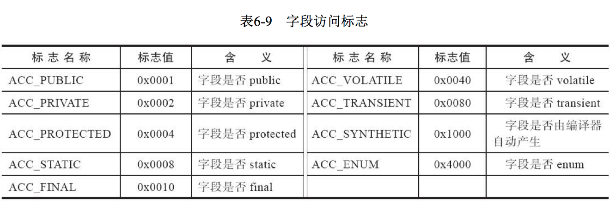
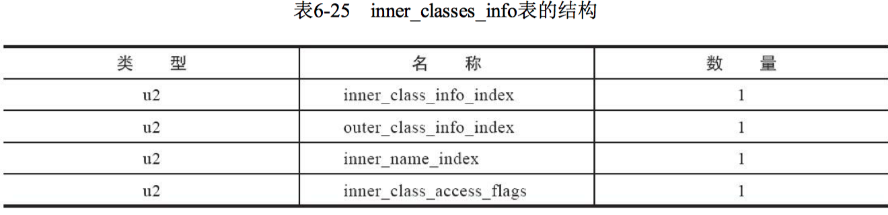

#《深入理解Java虚拟机：JVM高级特性与最佳实践(第3版.周志明)》读书笔记

## 一，走进JAVA

#### 1，`Java` 技术体系

从广义上讲， `Kotlin`、 `Clojure`、 `JRuby`、 `Groovy` 等运行于 `Java` 虚拟机上的编程语言及其相关的程序都属于 `Java` 技术体系中的一员。 `JCP` 官方所定义的 `Java` 技术体系包括：

> Java程序设计语言
>
> 各种硬件平台上的Java虚拟机实现
>
> Class文件格式
>
> Java类库API
>
> 来自商业机构和开源社区的第三方Java类库  

`Java` 技术体系如下图所示：


`Java` 技术路线如下图所示：


#### 2，实战：编译JDK

## 二，Java内存区域与内存溢出异常

#### 1，运行时数据区


- 程序计数器（`Program Counter Register`） 是一块较小的内存空间， 可以看作是当前线程所执行的字节码的行号指示器。   在Java虚拟机的概念模型里， **字节码解释器**工作时就是通过改变这个计数器的值来选取下一条需要执行的字节码指令， 它是程序控制流的指示器， 分支、 循环、 跳转、 异常处理、 线程恢复等基础功能都需要依赖这个计数器来完成。  

- `Java` 虚拟机栈（`Java Virtual Machine Stack`） 也是线程私有的， 它的生命周期与线程相同。 虚拟机栈描述的是 `Java` 方法执行的线程内存模型： 每个方法被执行的时候， `Java` 虚拟机都会同步创建一个栈帧（`Stack Frame`）用于存储局部变量表、 操作数栈、 动态连接、 方法出口等信息。  

> `Java` 虚拟机基本数据类型（`boolean`、`byte`、`char`、`short`、`int`、`float`、`long`、 `double`） 、 对象引用等数据类型在局部变量表中的存储空间以局部变量槽（`Slot`） 来表示， 其中64位长度的 `long` 和 `double` 类型的数据会占用两个变量槽， 其余的数据类型只占用一个。 局部变量表所需的内存空间在编译期间完成分配， 当进入一个方法时， 这个方法需要在栈帧中分配多大的局部变量空间是完全确定的， 在方法运行期间不会改变局部变量表的大小。   
>
> 在《Java虚拟机规范》 中， 对这个内存区域规定了两类异常状况： 
>
> > 如果线程请求的栈深度大于虚拟机所允许的深度， 将抛出 **StackOverflowError异常**；
> >
> > 如果 `Java` 虚拟机栈容量可以动态扩展，当栈扩展时无法申请到足够的内存会抛出**OutOfMemoryError异常**。  

- 本地方法栈（`Native Method Stacks`） 与虚拟机栈所发挥的作用是非常相似的， 其区别只是虚拟机栈为虚拟机执行 `Java` 方法（也就是字节码） 服务， 而本地方法栈则是为虚拟机使用到的本地（`Native`）方法服务。  

- `Java`堆（`Java Heap`） 是虚拟机所管理的内存中最大的一块，是被所有线程共享的一块内存区域， 在虚拟机启动时创建。 此内存区域的唯一目的就是存放对象实例， `Java` 世界里“几乎”所有的对象实例都在这里分配内存。 在《Java虚拟机规范》 中对Java堆的描述是：“==所有的对象实例以及数组都应当在**堆**上分配==”。   

- 方法区（`Method Area`） 与 `Java` 堆一样， 是各个线程共享的内存区域， 用于存储已被虚拟机加载的类型信息、 常量、 静态变量、 即时编译器编译后的代码缓存等数据。  

> 运行时常量池（`Runtime Constant Pool`） 是方法区的一部分。 `Class` 文件中除了有类的版本、 字段、 方法、 接口等描述信息外， 还有一项信息是常量池表（`Constant Pool Table`）， 用于存放编译期生成的各种字面量与符号引用， 这部分内容将在类加载后存放到方法区的运行时常量池中。  

#### 2，对象的创建

当 `Java` 虚拟机遇到一条字节码 `new` 指令时：

> 首先将去检查这个指令的参数是否能在常量池中定位到一个类的符号引用， 并且检查这个符号引用代表的类是否已被加载、 解析和初始化过；
>
> 在类加载检查通过后， 接下来虚拟机将为新生对象分配内存；
>
> > 假设`Java`堆中内存是绝对规整的， 所有被使用过的内存都被放在一边， 空闲的内存被放在另一边， 中间放着一个指针作为分界点的指示器， 那所分配内存就仅仅是把那个指针向空闲空间方向挪动一段与对象大小相等的距离， 这种分配方式称为“**指针碰撞**”（`Bump The Pointer`） 。  
> >
> > 如果`Java`堆中的内存并不是规整的， 已被使用的内存和空闲的内存相互交错在一起， 虚拟机就必须维护一个列表， 记录上哪些内存块是可用的， 在分配的时候从列表中找到一块足够大的空间划分给对象实例， 并更新列表上的记录， 这种分配方式称为“**空闲列表**”（`Free List`） 。  
> >
> > **注意**：
> >
> > 1）垃圾收集器是否带有空间压缩整理能力 –> `Java` 堆是否规整 --> 分配方式选择。
> >
> > 2）线程安全问题的解决方案：
> >
> > > i）对分配内存空间的动作进行同步处理——实际上虚拟机是采用`CAS` 配上失败重试的方式保证更新操作的原子性；  
> > >
> > > ii）把内存分配的动作按照线程划分在不同的空间之中进行， 即每个线程在 `Java` 堆中预先分配一小块内存， 称为本地线程分配缓冲（`Thread Local Allocation Buffer`， `TLAB`） ， 哪个线程要分配内存， 就在哪个线程的本地缓冲区中分配， 只有本地缓冲区用完了， 分配新的缓存区时才需要同步锁定。 虚拟机是否使用`TLAB`， 可以通过 `-XX： +/-UseTLAB` 参数来设定。  
>
> 虚拟机必须将分配到的内存空间（但不包括对象头） 都初始化为零值， 如果
> 使用了 `TLAB` 的话， 这一项工作也可以提前至 `TLAB` 分配时顺便进行；
>
> 最后，`Java` 虚拟机还要对对象进行必要的设置， 例如这个对象是哪个类的实例、 如何才能找到类的元数据信息、 对象的哈希码（实际上对象的哈希码会延后到真正调用 `Object::hashCode()` 方法时才计算） 、 对象的 `GC`分代年龄等信息。   

#### 3，对象的内存布局

在 `HotSpot` 虚拟机里， 对象在堆内存中的存储布局可以划分为三个部分： 对象头（`Header`） 、 实例数据（`Instance Data`） 和对齐填充（`Padding`） 。  

`HotSpot` 虚拟机对象的对象头包括：

> 1）用于存储对象自身的运行时数据， 如哈希码（`HashCode`） 、`GC`分代年龄、 锁状态标志、 线程持有的锁、 偏向线程`ID`、 偏向时间戳等， 这部分数据的长度在32位和64位的虚拟机（未开启压缩指针） 中分别为32个比特和64个比特， 官方称它为“``Mark Word`”。   
>
> 2）类型指针， 即对象指向它的类型元数据的指针，`Java` 虚拟机通过这个指针
> 来确定该对象是哪个类的实例。   

`HotSpot` 虚拟机对象头 `Mark Word`  如下图所示：


`HotSpot` 虚拟机对象的实例数据是对象真正存储的有效信息， 即在程序代码里面所定义的各种类型的字段内容， 无论是从父类继承下来的， 还是在子类中定义的字段都必须记录起来。 这部分的存储顺序会受到虚拟机分配策略参数（`-XX： FieldsAllocationStyle` 参数） 和字段在 `Java` 源码中定义顺序的影响。`HotSpot` 虚拟机默认的分配顺序为 `longs/doubles`、`ints`、`horts/chars`、 `bytes/booleans`、 `oops`（`Ordinary Object Pointers`，`OOPs`）。

`HotSpot` 虚拟机对象的对齐填充， 这并不是必然存在的， 也没有特别的含义， 它仅仅起着占位符的作用。  

#### 4， 对象的访问定位

`Java` 程序会通过栈上的 `reference` 数据来操作堆上的具体对象。 由于 `reference` 类型在《Java虚拟机规范》 里面只规定了它是一个指向对象的引用， 并没有定义这个引用应该通过什么方式去定位、 访问到堆中对象的具体位置， 所以对象访问方式也是由虚拟机实现而定的， 主流的访问方式主要有：  

> 使用句柄访问，`Java` 堆中将可能会划分出一块内存来作为句柄池， `reference` 中存储的就是对象的句柄地址， 而句柄中包含了对象实例数据与类型数据各自具体的地址信息。其优点在于：`reference` 中存储的是稳定句柄地址， 在对象被移动（垃圾收集时移动对象是非常普遍的行为） 时只会改变句柄中的实例数据指针， 而 `reference` 本身不需要被修改。
>
> 使用直接指针访问，`Java` 堆中对象的内存布局就必须考虑如何放置访问类型数据的相关信息， `reference` 中存储的直接就是对象地址， 如果只是访问对象本身的话， 就不需要多一次间接访问的开销。其优点在于：速度更快， 它节省了一次指针定位的时间开销， 由于对象访问在 `Java` 中非常频繁， 因此这类开销积少成多也是一项极为可观的执行成本。

通过句柄访问对象，如下图所示：


通过直接指针访问对象，如下图所示：


#### 5，实战：OutOfMemoryError异常  

- 代码清单2-1 `Java` 堆内存溢出异常测试

```java
package com.algorithm;

import java.util.ArrayList;
import java.util.List;

/**
 * 堆内存溢出异常测试
 * VM Args： -Xms20m -Xmx20m -XX:+HeapDumpOnOutOfMemoryError
 *
 * @author zhangbc
 * @version 1.0.0
 * @date 2020/7/12 17:25
 **/
public class HeapOOM {

    static class OOMObject {

    }

    public static void main(String[] args) {
        List<OOMObject> objectList = new ArrayList<>();
        while (true) {
            objectList.add(new OOMObject());
        }
    }
}
```

运行结果：

```bash
java.lang.OutOfMemoryError: Java heap space
Dumping heap to java_pid728.hprof ...
Heap dump file created [28418149 bytes in 0.099 secs]
Exception in thread "main" java.lang.OutOfMemoryError: Java heap space
	at java.util.Arrays.copyOf(Arrays.java:3210)
	at java.util.Arrays.copyOf(Arrays.java:3181)
	at java.util.ArrayList.grow(ArrayList.java:265)
	at java.util.ArrayList.ensureExplicitCapacity(ArrayList.java:239)
	at java.util.ArrayList.ensureCapacityInternal(ArrayList.java:231)
	at java.util.ArrayList.add(ArrayList.java:462)
	at com.algorithm.HeapOOM.main(HeapOOM.java:22)
```

- 代码清单2-2 虚拟机栈和本地方法栈测试（使用 `-Xss` 参数减少栈内存容量）  

```java
package com.jvm;

/**
 * 虚拟机栈和本地方法栈测试(使用 `-Xss` 参数减少栈内存容量)
 * VM Args： -Xss128k
 *
 * @author zhangbc
 * @version 1.0.0
 * @date 2020/7/12 17:47
 **/
public class JavaVMStackSOF {

    private int stackLength = 1;

    public void stackLeak() {
        stackLength++;
        stackLeak();
    }

    public static void main(String[] args) {
        JavaVMStackSOF stackSOF = new JavaVMStackSOF();
        try {
            stackSOF.stackLeak();
        } catch (Throwable e) {
            System.out.println("Stack length: " + stackSOF.stackLength);
            throw e;
        }
    }
}
```

运行结果：

```java
Stack length: 996
Exception in thread "main" java.lang.StackOverflowError
	at com.jvm.JavaVMStackSOF.stackLeak(JavaVMStackSOF.java:16)
	at com.jvm.JavaVMStackSOF.stackLeak(JavaVMStackSOF.java:17)
    .............
```

- 代码清单2-3 虚拟机栈和本地方法栈测试（定义大量的本地变量，增大此方法帧中本地变量表的长度）  

```java
package com.jvm;

/**
 * 虚拟机栈和本地方法栈测试(定义大量的本地变量，增大此方法帧中本地变量表的长度)
 *
 * @author zhangbc
 * @version 1.0.0
 * @date 2020/7/12 18:01
 **/
public class JavaVMStackSOFNative {

    private static int stackLength = 0;

    public static void test() {
        long unused1, unused2, unused3, unused4, unused5, unused6, unused7, unused8, unused9, unused10,
                unused11, unused12, unused13, unused14, unused15, unused16, unused17, unused18, unused19, unused20,
                unused21, unused22, unused23, unused24, unused25, unused26, unused27, unused28, unused29, unused30,
                unused31, unused32, unused33, unused34, unused35, unused36, unused37, unused38, unused39, unused40,
                unused41, unused42, unused43, unused44, unused45, unused46, unused47, unused48, unused49, unused50,
                unused51, unused52, unused53, unused54, unused55, unused56, unused57, unused58, unused59, unused60,
                unused61, unused62, unused63, unused64, unused65, unused66, unused67, unused68, unused69, unused70,
                unused71, unused72, unused73, unused74, unused75, unused76, unused77, unused78, unused79, unused80,
                unused81, unused82, unused83, unused84, unused85, unused86, unused87, unused88, unused89, unused90,
                unused91, unused92, unused93, unused94, unused95, unused96, unused97, unused98, unused99, unused100;
        stackLength++;
        test();
        unused1 = unused2 = unused3 = unused4 = unused5 = unused6 = unused7 = unused8 = unused9 = unused10
                = unused11 = unused12 = unused13 = unused14 = unused15 = unused16 = unused17 = unused18 = unused19
                = unused20 = unused21 = unused22 = unused23 = unused24 = unused25 = unused26 = unused27 = unused28
                = unused29 = unused30 = unused31 = unused32 = unused33 = unused34 = unused35 = unused36 = unused37
                = unused38 = unused39 = unused40 = unused41 = unused42 = unused43 = unused44 = unused45 = unused46
                = unused47 = unused48 = unused49 = unused50 = unused51 = unused52 = unused53 = unused54 = unused55
                = unused56 = unused57 = unused58 = unused59 = unused60 = unused61 = unused62 = unused63 = unused64
                = unused65 = unused66 = unused67 = unused68 = unused69 = unused70 = unused71 = unused72 = unused73
                = unused74 = unused75 = unused76 = unused77 = unused78 = unused79 = unused80 = unused81 = unused82
                = unused83 = unused84 = unused85 = unused86 = unused87 = unused88 = unused89 = unused90 = unused91
                = unused92 = unused93 = unused94 = unused95 = unused96 = unused97 = unused98 = unused99 = unused100 = 0;
    }

    public static void main(String[] args) {
        try {
            test();
        } catch (Error e) {
            System.out.println("Stack length: " + stackLength);
            throw e;
        }
    }
}
```

运行结果：

```bash
Stack length: 7478
Exception in thread "main" java.lang.StackOverflowError
	at com.jvm.JavaVMStavckSOFNative.test(JavaVMStavckSOFNative.java:26)
	at com.jvm.JavaVMStavckSOFNative.test(JavaVMStavckSOFNative.java:26)
	................
```

- 代码清单2-4  创建线程导致内存溢出异常

```java
package com.jvm;

/**
 * 创建线程导致内存溢出异常
 * VM Args： -Xss2M
 *
 * @author zhangbc
 * @version 1.0.0
 * @date 2020/7/19 13:46
 **/
public class JavaVMStackOOM {

    private void dontStop() {
        while (true) {

        }
    }

    public void stackLeakByThread() {
        while (true) {
            Thread thread = new Thread(new Runnable() {
                @Override
                public void run() {
                    dontStop();
                }
            });
            thread.start();
        }
    }
}
```

- 代码清单2-5 运行时常量池导致的内存溢出异常

```java
package com.jvm;

import java.util.HashSet;
import java.util.Set;

/**
 * 运行时常量池导致的内存溢出异常
 * VM Args： -XX:PermSize=6M -XX:MaxPermSize=6M (jdk1.6)
 * VM Args： -Xms6M (> jdk1.6)
 * String::intern()是一个本地方法， 作用是如果字符串常量池中已经包含一个等于此String对象的字符串， 
 * 则返回代表池中这个字符串的String对象的引用； 否则， 会将此String对象包含的字符串添加到常量池中， 
 * 并且返回此String对象的引用。 
 *
 * @author zhangbc
 * @version 1.0.0
 * @date 2020/7/19 14:09
 **/
public class RuntimeConstantPoolOOM {

    public static void main(String[] args) {
        Set<String> set = new HashSet<>(16);
        short i = 0;
        while (true) {
            set.add(String.valueOf(i++).intern());
        }
    }
}
```

运行结果：

```bash
Exception in thread "main" java.lang.OutOfMemoryError: GC overhead limit exceeded
	at java.lang.Integer.toString(Integer.java:401)
	at java.lang.String.valueOf(String.java:3099)
	at com.jvm.RuntimeConstantPoolOOM.main(RuntimeConstantPoolOOM.java:24)
```


- 代码清单2-6  `String.intern()`返回引用的测试

```java
package com.jvm;


/**
 * String.intern()返回引用的测试
 * 在JDK6中运行，会得到两个false，而在JDK7中运行，会得到一个true和一个false。
 * 产生差异的原因是：
 * 在JDK6中， intern()方法会把首次遇到的字符串实例复制到永久代的字符串常量池中存储，
 * 返回的也是永久代里面这个字符串实例的引用，而由StringBuilder创建的字符串对象实例
 * 在Java堆上， 所以必然不可能是同一个引用， 结果将返回false。
 * JDK7的intern()方法实现不需要再拷贝字符串的实例到永久代，既然字符串常量池已经移到Java堆中，
 * 那只需要在常量池里记录一下首次出现的实例引用即可，因此intern()返回的引用和由StringBuilder
 * 创建的那个字符串实例就是同一个。 而对str2比较返回false，这是因为“java”这个字符串在执行
 * String-Builder.toString()之前就已经出现过，字符串常量池中已经有它的引用，不符合intern()
 * 方法要求“首次遇到”的原则， “计算机软件”这个字符串则是首次出现的，因此结果返回true。
 *
 * @author zhangbc
 * @version 1.0.0
 * @date 2020/7/19 14:09
 **/
public class RuntimeConstantPoolOOMTest {

    public static void main(String[] args) {
        String s1 = new StringBuilder("计算机").append("软件").toString();
        System.out.println(s1.intern() == s1);

        String s2 = new StringBuilder("ja").append("va").toString();
        System.out.println(s2.intern() == s2);
    }
}
```

- 代码清单2-7 借助CGLib使得方法区出现内存溢出异常

```java
package com.jvm;

import org.springframework.cglib.proxy.Enhancer;
import org.springframework.cglib.proxy.MethodInterceptor;
import org.springframework.cglib.proxy.MethodProxy;

import java.lang.reflect.Method;

/**
 * 借助CGLib使得方法区出现内存溢出异常(jdk1.7)
 * VM Args： -XX:PermSize=10M -XX:MaxPermSize=10M
 *
 * @author zhangbc
 * @version 1.0.0
 * @date 2020/7/19 18:09
 **/
public class JavaMethodAreaOOM {
    public static void main(String[] args) {
        while (true) {
            Enhancer enhancer = new Enhancer();
            enhancer.setSuperclass(OOMObject.class);
            enhancer.setUseCache(false);
            enhancer.setCallback(new MethodInterceptor() {
                @Override
                public Object intercept(Object o, Method method, Object[] objects,
                                        MethodProxy methodProxy) throws Throwable {
                    return methodProxy.invokeSuper(o, objects);
                }
            });

            enhancer.create();
        }
    }

    static class OOMObject {

    }
}
```

- 代码清单2-8  使用 `unsafe` 分配本机内存  

```java
package com.jvm;

import sun.misc.Unsafe;

import java.lang.reflect.Field;

/**
 * 使用unsafe分配本机内存
 * VM Args： -Xmx20M -XX:MaxDirectMemorySize=10M
 *
 * @author zhangbc
 * @version 1.0.0
 * @date 2020/7/19 18:20
 **/
public class DirectMemoryOOM {

    private static final int _1MB = 1024 * 1024;

    public static void main(String[] args) throws Exception {
        Field unsafeField = Unsafe.class.getDeclaredFields()[0];
        unsafeField.setAccessible(true);
        Unsafe unsafe = (Unsafe) unsafeField.get(null);
        while (true) {
            unsafe.allocateMemory(_1MB);
        }
    }
}
```

运行结果：

```bash
Exception in thread "main" java.lang.OutOfMemoryError
	at sun.misc.Unsafe.allocateMemory(Native Method)
	at com.jvm.DirectMemoryOOM.main(DirectMemoryOOM.java:24)
```

## 三，垃圾收集器与内存分配策略

#### 1，引用计数算法

- 代码清单3-1  引用计数算法的缺陷

```java
package com.jvm;

/**
 * 引用计数算法的缺陷
 * 问题：testGC()方法执行后，objA和objB会不会被GC呢？
 * VM Args：-verbose:gc -Xms20m -Xmx20m -Xmn10m -XX:+PrintGCDetails -XX:SurvivorRatio=8
 *
 * @author zhangbc
 * @version 1.0.0
 * @date 2020/7/19 18:39
 **/
public class ReferenceCountingGC {

    private Object instance = null;
    private static final int _1MB = 1024 * 1024;
    /**
     * 占内存，以便能在GC日志中看清是否回收过
     */
    private byte[] bigSize = new byte[2 * _1MB];

    public static void testGC() {
        ReferenceCountingGC objA = new ReferenceCountingGC();
        ReferenceCountingGC objB = new ReferenceCountingGC();
        objA.instance = objB;
        objB.instance = objA;

        objA = null;
        objB = null;

        System.gc();
    }

    public static void main(String[] args) {
        testGC();
    }
}
```

运行结果：

```bash
[GC (System.gc()) [PSYoungGen: 6757K->1002K(9216K)] 6757K->1010K(19456K), 0.0011649 secs] [Times: user=0.00 sys=0.00, real=0.00 secs] 
[Full GC (System.gc()) [PSYoungGen: 1002K->0K(9216K)] [ParOldGen: 8K->889K(10240K)] 1010K->889K(19456K), [Metaspace: 3249K->3249K(1056768K)], 0.0046353 secs] [Times: user=0.02 sys=0.00, real=0.00 secs] 
Heap
 PSYoungGen      total 9216K, used 166K [0x00000000ff600000, 0x0000000100000000, 0x0000000100000000)
  eden space 8192K, 2% used [0x00000000ff600000,0x00000000ff629900,0x00000000ffe00000)
  from space 1024K, 0% used [0x00000000ffe00000,0x00000000ffe00000,0x00000000fff00000)
  to   space 1024K, 0% used [0x00000000fff00000,0x00000000fff00000,0x0000000100000000)
 ParOldGen       total 10240K, used 889K [0x00000000fec00000, 0x00000000ff600000, 0x00000000ff600000)
  object space 10240K, 8% used [0x00000000fec00000,0x00000000fecde718,0x00000000ff600000)
 Metaspace       used 3261K, capacity 4496K, committed 4864K, reserved 1056768K
  class space    used 350K, capacity 388K, committed 512K, reserved 1048576K
```

结果分析：从运行结果中可以清楚看到内存回收日志中包含 “1002K->0K”， 意味着虚拟机并没有因为这两个对象互相引用就放弃回收它们， 这也从侧面说明了`Java` 虚拟机并不是通过引用计数算法来判断对象是否存活的。  

#### 2，可达性分析算法

基本思路：通过一系列称为“`GC Roots`”的根对象作为起始节点集， 从这些节点开始， 根据引用关系向下搜索， 搜索过程所走过的路径称为“**引用链**”（`Reference Chain`） ， 如果某个对象到 `GC Roots` 间没有任何引用链相连，或者用图论的话来说就是从 `GC Roots` 到这个对象不可达时， 则证明此对象是不可能再被使用的。  

在 `Java` 技术体系中， 固定可作为 `GC Roots` 的对象包括：

> 1）在虚拟机栈（栈帧中的本地变量表） 中引用的对象， 如各个线程被调用的方法堆栈中使用到的参数、 局部变量、 临时变量等；
>
> 2）在方法区中类静态属性引用的对象， 如 `Java` 类的引用类型静态变量；
>
> 3）在方法区中常量引用的对象，如字符串常量池（`String Table`） 里的引用；
>
> 4）在本地方法栈中 `JNI`（即通常所说的`Native`方法） 引用的对象；
>
> 5）`Java` 虚拟机内部的引用，如基本数据类型对应的 `Class` 对象，一些常驻的异常对象（如 `NullPointExcepiton`、 `OutOfMemoryError`） 等， 还有系统类加载器；
>
> 6）所有被同步锁（`synchronized`关键字） 持有的对象；
>
> 7）反映`Java`虚拟机内部情况的 `JMXBean`、 `JVMTI` 中注册的回调、本地代码缓存等；
>
> 8）根据用户所选用的垃圾收集器以及当前回收的内存区域不同， 还可以有其他对象“临时性”地加入， 共同构成完整 `GC Roots` 集合。  

在 `JDK 1.2` 版之后，`Java` 对引用的概念进行了扩充，将引用分为**强引用**（`Strongly Re-ference`）、**软引用**（`Soft Reference`）、**弱引用**（`Weak Reference`）和**虚引用**（`Phantom Reference`），引用强度依次逐渐减弱。  

> **强引用**（`Strongly Re-ference`）：指在程序代码之中普遍存在的引用赋值， 即类似“ `Object obj=new Object()`”这种引用关系。无论任何情况下，只要强引用关系还存在， 垃圾收集器就永远不会回收掉被引用的对象。  
>
> **软引用**（`Soft Reference`）：描述一些还有用， 但非必须的对象。 只被软引用关联着的对象， 在系统将要发生内存溢出异常前， 会把这些对象列进回收范围之中进行第二次回收， 如果这次回收还没有足够的内存，才会抛出内存溢出异常。   
>
> **弱引用**（`Weak Reference`）：描述那些非必须对象， 但是它的强度比软引用更弱一些， 被弱引用关联的对象只能生存到下一次垃圾收集发生为止。 当垃圾收集器开始工作， 无论当前内存是否足够， 都会回收掉只被弱引用关联的对象。   
>
> **虚引用**（`Phantom Reference`）：也称为“幽灵引用”或者“幻影引用”， 它是最弱的一种引用关系。 一个对象是否有虚引用的存在， 完全不会对其生存时间构成影响， 也无法通过虚引用来取得一个对象实例。  

- 代码清单3-2  一次对象自我拯救演示

```java
package com.jvm;

/**
 * 一次对象自我拯救的演示：
 *                     1）对象可以在被GC时自我拯救；
 *                     2）这种自救的机会只有一次， 因为一个对象的finalize()方法最多只会被系统自动调用一次
 *
 * @author zhangbc
 * @version 1.0.0
 * @date 2020/8/8 15:22
 **/
public class FinalizeEscapeGC {
    
    public static FinalizeEscapeGC saveHook = null;
    
    public void isAlive() {
        System.out.println("Yes, I am still alive.");
    }

    @Override
    protected void finalize() throws Throwable {
        super.finalize();
        System.out.println("Finalize method executed.");
        FinalizeEscapeGC.saveHook = this;
    }

    public static void main(String[] args) throws Throwable {
        
        saveHook = new FinalizeEscapeGC();
        saveHook = null;
        System.gc();
        // 因为Finalizer方法的优先级很低，暂停0.5s等待。
        Thread.sleep(500);
        
        if (saveHook != null) {
            saveHook.isAlive();
        } else {
            System.out.println("No, I am dead(first).");
        }

        saveHook = null;
        System.gc();
        // 因为Finalizer方法的优先级很低，暂停0.5s等待。
        Thread.sleep(500);

        if (saveHook != null) {
            saveHook.isAlive();
        } else {
            System.out.println("No, I am dead(second).");
        }
    }
}
```

运行结果：

```bash
Finalize method executed.
Yes, I am still alive.
No, I am dead(second).
```

#### 3，回收方法区

方法区的垃圾收集主要回收：**废弃的常量**和**不再使用的类型**。   

判定一个类型是否属于“不再被使用的类”，需要同时满足下面三个条件：

> 1）该类所有的实例都已经被回收， 也就是 `Java` 堆中不存在该类及其任何派生子类的实例；
>
> 2）加载该类的类加载器已经被回收， 这个条件除非是经过精心设计的可替换类加载器的场景， 如 `OSGi`、`JSP` 的重加载等，否则通常是很难达成的；
>
> 3）该类对应的 `java.lang.Class` 对象没有在任何地方被引用，无法在任何地方通过反射访问该类的方法。  

#### 4，垃圾收集算法

从如何判定对象消亡的角度出发， 垃圾收集算法可以划分为“**引用计数式垃圾收集**”（`Reference Counting GC`）和“**追踪式垃圾收集**”（`Tracing GC`）两大类，这两类也常被称作“**直接垃圾收集**”和“**间接垃圾收集**”。  

###### 1，分代收集理论

分代收集名为理论， **实质**是一套符合大多数程序运行实际情况的经验法则， 其基础是两个**分代假说**：

> 1）**弱分代假说**（`Weak Generational Hypothesis`）：绝大多数对象都是朝生夕灭的；
>
> 2）**强分代假说**（`Strong Generational Hypothesis`）：熬过越多次垃圾收集过程的对象就越难以消亡；
>
> > 1）& 2）**推论**：存在互相引用关系的两个对象， 是应该倾向于同时生存或者同时消亡的。   
>
> 3）**跨代引用假说**（`Intergenerational Reference Hypothesis`）：跨代引用相对于同代引用来说仅占极少数。  

这两个分代假说共同奠定了多款常用的垃圾收集器的一致的**设计原则**：收集器应该将 `Java` 堆划分出不同的区域， 然后将回收对象依据其年龄（年龄即对象熬过垃圾收集过程的次数） 分配到不同的区域之中存储。  

**收集器（GC）** 统一定义：

> **部分收集**（`Partial GC`）：指目标不是完整收集整个 `Java` 堆的垃圾收集，其中又分为：
>
> > **新生代收集**（ `Minor GC/Young GC`）：指目标只是新生代的垃圾收集；
> >
> > **老年代收集**（ `Major GC/Old GC`）：指目标只是老年代的垃圾收集。目前只有 `CMS` 收集器会有单
> > 独收集老年代的行为；
> >
> > **混合收集**（ `Mixed GC`）：指目标是收集整个新生代以及部分老年代的垃圾收集。目前只有 `G1` 收
> > 集器会有这种行为。
>
> **整堆收集**（ `Full GC` ）：收集整个 `Java` 堆和方法区的垃圾收集。  

###### 2，标记-清除算法

最早出现也是最基础的垃圾收集算法是“**标记-清除**”（`Mark-Sweep`）算法， 在1960年由 `Lisp` 之父 `John McCarthy` 所提出。 算法分为“**标记**”和“**清除**”两个阶段：

> 首先标记出所有需要回收的对象（或者存活的对象）；
>
> 在标记完成后， 统一回收掉所有被标记的对象（或者所有未被标记的对象）。

其主要缺点：

> 1）是执行效率不稳定，如果 `Java` 堆中包含大量对象，而且其中大部分是需要被回收的， 这时必须进行大量标记和清除的动作， 导致标记和清除两个过
> 程的执行效率都随对象数量增长而降低； 
>
> 2）是内存空间的碎片化问题， 标记、清除之后会产生大量不连续的内存碎片， 空间碎片太多可能会导致当以后在程序运行过程中需要分配较大对象时无法找到足够的连续内存而不得不提前触发另一次垃圾收集动作。  


###### 3，标记-复制算法

为了解决标记-清除算法面对大量可回收对象时**执行效率低**的问题， 1969年 `Fenichel` 提出了一种称为“**半区复制**”（`Semispace Copying`）的垃圾收集算法，它将可用内存按容量划分为大小相等的两块，每次只使用其中的一块，当这一块的内存用完了， 就将还存活着的对象复制到另外一块上面， 然后再把已使用过的内存空间**一次清理掉**。 如果内存中多数对象都是存活的， 这种算法将会产生**大量的内存间复制的开销**， 但对于多数对象都是可回收的情况， 算法需要复制的就是占少数的存活对象， 而且每次都是针对整个半区进行内存回收， 分配内存时也就不用考虑有空间碎片的复杂情况， 只要移动堆顶指针， 按顺序分配即可。 


在1989年，`Andrew Appel` 针对具备“**朝生夕灭**”特点的对象， 提出了一种更优化的半区复制分代策略， 现在称为“**`Appel`式回收**”。具体做法是把新生代分为一块较大的 `Eden` 空间和两块较小的 `Survivor` 空间， 每次分配内存只使用 `Eden` 和其中一块 `Survivor`，发生垃圾搜集时， 将 `Eden` 和 `Survivor` 中仍然存活的对象一次性复制到另外一块 `Survivor` 空间上， 然后直接清理掉 `Eden` 和已用过的那块 `Survivor` 空间。`HotSpot` 虚拟机默认 `Eden` 和 `Survivor` 的大小比例是 8∶ 1，即每次新生代中可用内存空间为整个新生代容量的90%（`Eden`的80%加上一个`Survivor`的10%），只有一个 `Survivor` 空间，即10%的新生代是会被“浪费”的。 

###### 4，标记-整理算法

针对老年代对象的存亡特征，1974年 `Edward Lueders` 提出了另外一种有针对性的“**标记-整理**”（`Mark-Compact`） 算法， 其中的标记过程仍然与“标记-清除”算法一样， 但后续步骤不是直接对可回收对象进行清理， 而是让所有存活的对象都向内存空间一端移动， 然后直接清理掉边界以外的内存。与**标记-清除**算法**本质区别**在于它是一种移动式的回收算法，是否移动回收后的存活对象是一项优缺点并存的风险决策：

> 如果移动存活对象， 尤其是在老年代这种每次回收都有大量对象存活区域， 移动存活对象并更新所有引用这些对象的地方将会是一种极为负重的操作， 而且这种对象移动操作必须全程暂停用户应用程序才能进行，这就更加让使用者权衡其弊端， 像这样的停顿被最初的虚拟机设计者形象地描述为“ `Stop The World`”；（**内存回收复杂**）
>
> 如果跟标记-清除算法那样完全不考虑移动和整理存活对象的话， 弥散于堆中的存活对象导致的空间碎片化问题就只能依赖更为复杂的内存分配器和内存访问器来解决。 譬如通过“分区空闲分配链表”来解决内存分配问题（计算机硬盘存储大文件就不要求物理连续的磁盘空间， 能够在碎片化的硬盘
> 上存储和访问就是通过硬盘分区表实现的） 。 内存的访问是用户程序最频繁的操作，假如在这个环节上增加了额外的负担， 势必会直接影响应用程序的吞吐量。  （**内存分配复杂**）


#### 5，HotSpot的算法细节实现

1）**枚举根节点**

所有收集器在根节点枚举这一步骤时都是必须暂停用户线程的，即使是号称停顿时间可控， 或者（几乎） 不会发生停顿的 `CMS`、`G1`、
`ZGC` 等收集器， 枚举根节点时也是必须要停顿的。  

2）**安全点**

在 `OopMap` 的协助下，`HotSpot` 可以快速准确地完成 `GC Roots` 枚举，但可能导致引用关系变化，或者说导致 `OopMap` 内容变化的指令非常多， 如果为每一条指令都生成对应的 `OopMap`，那将会需要大量的额外存储空间，这样垃圾收集伴随而来的空间成本就会变得无法忍受的高昂。  

实际上，`HotSpot` 的确没有为每条指令都生成 `OopMap`，只是在“特定的位置”记录了这些信息， 这些位置被称为**安全点**（`Safepoint`）。  

**安全点位置的选取**基本上是以“是否具有让程序长时间执行的特征”为标准进行选定的， 因为每条指令执行的时间都非常短暂， 程序不太可能因为指令流长度太长这样的原因而长时间执行， “长时间执行”的**最明显特征**就是指令序列的复用， 例如方法调用、 循环跳转、 异常跳转等都属于指令序列复用， 所以只有具有这些功能的指令才会产生安全点。  

如何在垃圾收集发生时让所有线程（这里其实不包括执行 `JNI` 调用的线程）都跑到最近的安全点，然后停顿下来。这里有两种选择方案：

> **抢先式中断**（`Preemptive Suspension`） ：不需要线程的执行代码主动去配合， 在垃圾收集发生时， 系统首先把所有用户线程全部中断， 如果发现有用户线程中断的地方不在安全点上， 就恢复这条线程执行， 让它一会再重新中断， 直到跑到安全点上。 现在几乎没有虚拟机实现采用抢先式中断来暂停线程响应 `GC` 事件。
>
>  **主动式中断**（`Voluntary Suspension`）：其思想是当垃圾收集需要中断线程的时候， 不直接对线程操作， 仅仅简单地设置一个标志位， 各个线程执行过程时会不停地主动去轮询这个标志， 一旦发现中断标志为真时就自己在最近的安全点上主动中断挂起。 轮询标志的地方和安全点是重合的， 另外还要加上所有创建对象和其他需要在 `Java` 堆上分配内存的地方，这是为了检查是否即将要发生垃圾收集，避免没有足够内存分配新对象。由于轮询操作在代码中会频繁出现， 这要求它必须足够高效。 `HotSpot` 使用内存保护陷阱的方式，把轮询操作精简至只有一条汇编指令的程度。 

安全点机制保证了程序执行时， 在不太长的时间内就会遇到可进入垃圾收集过程的安全点。  

3）**安全区域**

**程序不执行**：指没分配处理器时间， 典型的场景便是用户线程处于 `Sleep` 状态或者 `Blocked` 状态，这时候线程无法响应虚拟机的中断请求， 不能再走到安全的地方去中断挂起自己， 虚拟机也显然不可能持续等待线程重新被激活分配处理器时间。 对于这种情况， 就必须引入**安全区域**（`Safe Region`） 来解决。

**安全区域**是指能够确保在某一段代码片段之中， 引用关系不会发生变化， 因此， 在这个区域中任意地方开始垃圾收集都是安全的。  

4）**记忆集与卡表**

**记忆集**（`Remembered Se  `）是一种用于记录从非收集区域指向收集区域的指针集合的抽象数据结构。   

```java
Class RememberedSet {
	Object[] set[OBJECT_INTERGENERATIONAL_REFERENCE_SIZE];
}
```

可供选择的**记录精度**如下：

> **字长精度**：每个记录精确到一个机器字长（就是处理器的寻址位数，如常见的32位或64位，这个精度决定了机器访问物理内存地址的指针长度），该字包含跨代指针；
>
> **对象精度**：每个记录精确到一个对象， 该对象里有字段含有跨代指针；
>
> **卡精度**：每个记录精确到一块内存区域，该区域内有对象含有跨代指针。  

**卡表**：是记忆集的一种具体实现，定义了记忆集的记录精度、与堆内存的映射关系等。

```java
CARD_TABLE [this address >> 9] = 0;
```

字节数组 `CARD_TABLE` 的每一个元素都对应着其标识的内存区域中一块特定大小的内存块，这个内存块被称作“**卡页**”（`Card Page`）。一般来说， 卡页大小都是以2的 `N` 次幂的字节数， 通过上面代码可以看出 `HotSpot` 中使用的卡页是2的9次幂， 即512字节（地址右移9位， 相当于用地址除以512） 。  

一个卡页的内存中通常包含不止一个对象， 只要卡页内有一个（或更多） 对象的字段存在着跨代指针， 那就将对应卡表的数组元素的值标识为1，称为这个元素**变脏**（`Dirty`），没有则标识为0。   

5）**写屏障**

在 `HotSpot` 虚拟机里是通过**写屏障**（`Write Barrier`）技术维护卡表状态的。   

**写屏障**可以看作在虚拟机层面对“引用类型字段赋值”这个动作的 `AOP` 切面，在引用对象赋值时会产生一个环形（`Around`） 通知， 供程序执行额外的动作， 也就是说赋值的前后都在写屏障的覆盖范畴内。在赋值前的部分的写屏障叫作**写前屏障**（`Pre-Write Barrier`），在赋值后的则叫作**写后屏障**（`Post-Write Barrier`） 。   

```c++
/** 写后屏障更新卡表 **/
void oop_field_store(oop* field, oop new_value) {
	// 引用字段赋值操作
	*field = new_value;
	// 写后屏障， 在这里完成卡表状态更新
	post_write_barrier(field, new_value);
}
```

除了写屏障的开销外， 卡表在高并发场景下还面临着“**伪共享**”（`False Sharing`）问题。

**伪共享**是处理并发底层细节时一种经常需要考虑的问题，现代中央处理器的缓存系统中是以缓存行（`Cache Line`）为单位存储的， 当多线程修改互相独立的变量时， 如果这些变量恰好共享同一个缓存行， 就会彼此影响（写回、 无效化或者同步） 而导致性能降低， 这就是**伪共享问题**。  

为了避免伪共享问题， 一种简单的**解决方案**是不采用无条件的写屏障， 而是先检查卡表标记， 只有当该卡表元素未被标记过时才将其标记为变脏。

```java
if (CARD_TABLE [this address >> 9] != 0)
	CARD_TABLE [this address >> 9] = 0;
```

在 `JDK 7` 之后， `HotSpot` 虚拟机增加了一个新的参数 ``-XX： +UseCondCardMark`， 用来决定是否开启卡表更新的条件判断。   

6）并发的可达性分析

**三色标记**（`Tri-color Marking`）  ： 

> **白色**：表示对象尚未被垃圾收集器访问过。显然在可达性分析刚刚开始的阶段， 所有的对象都是白色的， 若在分析结束的阶段， 仍然是白色的对象， 即代表不可达。
>
> **黑色**：表示对象已经被垃圾收集器访问过， 且这个对象的所有引用都已经扫描过。黑色的对象代表已经扫描过， 它是安全存活的， 如果有其他对象引用指向了黑色对象， 无须重新扫描一遍。 黑色对象不可能直接（不经过灰色对象） 指向某个白色对象；
>
> **灰色**： 表示对象已经被垃圾收集器访问过， 但这个对象上至少存在一个引用还没有被扫描过。  


`Wilson` 于1994年在理论上证明：当且仅当以下两个条件同时满足时， 会产生“对象消失”的问题， 即原本应该是黑色的对象被误标为白色：

> 赋值器插入了一条或多条从黑色对象到白色对象的新引用；
>
> 赋值器删除了全部从灰色对象到该白色对象的直接或间接引用。

解决方案：

> **增量更新**（`Incremental Update`）：要破坏的是第一个条件， 当黑色对象插入新的指向白色对象的引用关系时，就将这个新插入的引用记录下来， 等并发扫描结束之后， 再将这些记录过的引用关系中的黑色对象为根， 重新扫描一次。 可以简化理解为， 黑色对象一旦新插入了指向白色对象的引用之后， 它就变回灰色对象了。
>
> **原始快照**（`Snapshot At The Beginning，SATB`） ：要破坏的是第二个条件， 当灰色对象要删除指向白色对象的引用关系时， 就将这个要删除的引用记录下来， 在并发扫描结束之后， 再将这些记录过的引用关系中的灰色对象为根， 重新扫描一次。 可以简化理解为， 无论引用关系删除与否， 都会按照刚刚开始扫描那一刻的对象图快照来进行搜索  。

#### 6，经典垃圾收集器


###### 1，Serial收集器

`Serial` 收集器是最基础、历史最悠久的收集器，曾经（在 `JDK 1.3.1` 之前） 是 `HotSpot` 虚拟机新生代收集器的唯一选择。   


对于内存资源受限的环境， 它是所有收集器里额外内存消耗（`Memory Footprint`）最小的； 对于单核处理器或处理器核心数较少的环境来说， `Serial`收集器由于没有线程交互的开销， 专心做垃圾收集自然可以获得最高的单线程收集效率。   

###### 2，ParNew收集器

`ParNew` 收集器实质上是 `Serial` 收集器的多线程并行版本，除了同时使用多条线程进行垃圾收集之外， 其余的行为包括 `Serial` 收集器可用的所有控制参数（例如：`-XX： SurvivorRatio`、`-XX：PretenureSizeThreshold`、`-XX： HandlePromotionFailure` 等）、收集算法、`Stop The World`、对象分配规则、 回收策略等都与 `Serial` 收集器完全一致。


除了 `Serial` 收集器外， 目前只有它能与 `CMS` 收集器配合工作。  

在 `JDK 5` 发布时，`HotSpot` 推出了一款在强交互应用中几乎可称为具有划时代意义的垃圾收集器— `CMS`收集器。这款收集器是 `HotSpot` 虚拟机中第一款真正意义上支持并发的垃圾收集器， 它**首次**实现了让垃圾收集线程与用户线程（基本上） 同时工作。

但是，`CMS` 作为老年代的收集器，却无法与 `JDK 1.4.0` 中已经存在的新生代收集器 `Parallel Scavenge` 配合工作，所以在 `JDK 5` 中使用 `CMS` 来收集老年代的时候， 新生代只能选择 `ParNew` 或者 `Serial` 收集器中的一个。 `ParNew` 收集器是激活 `CMS` 后（使用 ``-XX： +UseConcMarkSweepGC` 选项）的默认新生代收集器， 也可以使用 `-XX： +/-UseParNewGC` 选项来强制指定或者禁用它。  

> **并行**（`Parallel`）：并行描述的是多条垃圾收集器线程之间的关系，说明同一时间有多条这样的线程在协同工作， 通常默认此时用户线程是处于等待状态；
>
> **并发**（`Concurrent`）：并发描述的是垃圾收集器线程与用户线程之间的关系，说明同一时间垃圾收集器线程与用户线程都在运行。 由于用户线程并未被冻结， 所以程序仍然能响应服务请求， 但由于垃圾收集器线程占用了一部分系统资源， 此时应用程序的处理的吞吐量将受到一定影响。  

###### 3，Parallel Scavenge收集器  

`Parallel Scavenge`收集器的**目标**是达到一个可控制的**吞吐量**（`Throughput`）。所谓**吞吐量**就是处理器用于运行用户代码的时间与处理器总消耗时间的比值，
即：
$$
吞吐量=\frac{运行用户代码时间}{运行用户代码时间+运行垃圾收集时间} \tag{3.1}
$$
`Parallel Scavenge`收集器提供了两个参数用于精确控制吞吐量， 分别是**控制最大垃圾收集停顿时间**的 `-XX： MaxGCPauseMillis` 参数以及**直接设置吞吐量**大小的 `-XX： GCTimeRatio` 参数。  

> `-XX： MaxGCPauseMillis` 参数：允许的值是一个大于0的毫秒数，收集器将尽力保证内存回收花费的时间不超过用户设定值。垃圾收集停顿时间缩短是以牺牲吞吐量和新生代空间为代价换取的：系统把新生代调得小一些， 收集300MB新生代肯定比收集500MB快， 但这也直接导致垃圾收集发生得更频繁， 原来10秒收集一次、 每次停顿100毫秒， 现在变成5秒收集一次、 每次停顿70毫秒。 停顿时间的确在下降， 但吞吐量也降下来了。
>
> `-XX： GCTimeRatio`参数：允许的值是一个大于0小于100的整数，也就是垃圾收集时间占总时间的比率， 相当于吞吐量的倒数。
>
> `-XX： +UseAdaptiveSizePolicy` 是一个开关参数，当这个参数被激活之后， 就不需要人工指定新生代的大小（`-Xmn`）、`Eden` 与 `Survivor` 区的比例（`-XX： SurvivorRatio`）、 晋升老年代对象大小（`-XX： PretenureSizeThreshold`）等细节参数了， 虚拟机会根据当前系统的运行情况收集性能监控信息， 动态调整这些参数以提供最合适的停顿时间或者最大的吞吐量。 这种调节方式称为**垃圾收集的自适应的调节策略**（`GC Ergonomics`）。  

###### 4，Serial Old收集器

`Serial Old` 是 `Serial` 收集器的老年代版本，它同样是一个单线程收集器， 使用标记-整理算法。其主要意义在于供客户端模式下的 `HotSpot` 虚拟机使用。如果在服务端模式下， 它也可能有两种用途：

> 1）在 `JDK 5` 以及之前的版本中与 `Parallel Scavenge` 收集器搭配使用；
>
> 2）作为 `CMS` 收集器发生失败时的后备预案，在并发收集发生 `Concurrent Mode Failure` 时使用。 


###### 5，Parallel Old收集器

`Parallel Old` 是 `Parallel Scavenge` 收集器的老年代版本， 支持多线程并发收集， 基于标记-整理算法实现，直到JDK 6时才开始提供的。在注重吞吐量或者处理器资源较为稀缺的场合， 都可以优先考虑 `Parallel Scavenge+Parallel Old` 收集器这个组合。


###### 6，CMS收集器

`CMS（Concurrent Mark Sweep）` 收集器是一种以获取最短回收停顿时间为目标的收集器。`CMS` 收集器是基于标记-清除算法实现的， 它的运作
过程分为四个步骤， 包括：

> 1） **初始标记**（`CMS initial mark`）：需要 “`Stop The World`”，仅仅只是标记一下 `GC Roots` 能直接关联到的对象， 速度很快；
>
> 2） **并发标记**（`CMS concurrent mark`）：从 `GC Roots` 的直接关联对象开始遍历整个对象图的过程，耗时较长但不需要停顿用户线程，可以与垃圾收集线程一起并发运行；  
>
> 3） **重新标记**（`CMS remark`）：需要 “`Stop The World`”，为了修正并发标记期间， 因用户程序继续运作而导致标记产生变动的那一部分对象的标记记录 ， 停顿时间通常会比初始标记阶段稍长一些， 但也远比并发标记阶段的时间短；   
>
> 4） **并发清除**（`CMS concurrent sweep`）：清理删除掉标记阶段判断的已经死亡的对象， 由于不需要移动存活对象， 所以这个阶段也是可以与用户线程同时并发的。       

从总体上来说，`CMS`收集器的内存回收过程是与用户线程一起并发执行的。  


`CMS` 是一款优秀的收集器， 最主要的优点：**并发收集、 低停顿**，一些官方公开文档里面也称之为“**并发低停顿收集器**”（`Concurrent Low Pause Collector`） 。 但其缺点也明显：

> 1）CMS收集器对处理器资源非常敏感。在并发阶段， 它虽然不会导致用户线程停顿， 但却会因为占用了一部分线程（或者说处理器的计算能力） 而导致应用程序变慢， 降低总吞吐量。 `CMS` 默认启动的回收线程数是（处理器核心数量+3） /4， 即如果处理器核心数在四个或以上， 并发回收时垃圾收集线程只占用不超过25%的处理器运算资源， 并且会随着处理器核心数量的增加而下降；
>
> 2）由于 `CMS` 收集器无法处理“浮动垃圾”（`Floating Garbage`），有可能出现“`Con-current Mode Failure`”失败进而导致另一次完全“`Stop The World`”的 `Full GC` 的产生；
>
> > 在 `CMS` 的并发标记和并发清理阶段，用户线程是还在继续运行的，程序在运行自然就还会伴随有新的垃圾对象不断产生，但这一部分垃圾对象是出现在标记过程结束以后，`CMS` 无法在当次收集中处理掉它们， 只好留待下一次垃圾收集时再清理掉。 这一部分垃圾就称为“**浮动垃圾**”。   
>
> 3）`CMS` 是一款基于“标记-清除”算法实现的收集器，意味着收集结束时会有大量空间碎片产生。 空间碎片过多时， 将会给大对象分配带来很大麻烦， 往往会出现老年代还有很多剩余空间， 但就是无法找到足够大的连续空间来分配当前对象， 而不得不提前触发一次 `Full GC` 的情况。   

###### 7，Garbage First收集器  

`Garbage First`（简称 `G1`） 收集器是垃圾收集器技术发展历史上的里程碑式的成果， 它开创了收集器面向局部收集的设计思路和基于 `Region` 的内存布局形式。

`G1`是一款主要**面向服务端应用**的垃圾收集器。 `HotSpot` 开发团队最初赋予它的期望是未来可以替换掉 `JDK 5` 中发布的 `CMS` 收集器。`JDK 9` 发布之日， `G1` 宣告取代`Parallel Scavenge+Parallel Old` 组合， 成为服务端模式下的默认垃圾收集器， 而 `CMS` 则沦落至被声明为不推荐使用（`Deprecate`） 的收集器。

`G1` 可以面向堆内存任何部分来组成回收集（`Collection Set`， 一般简称 `CSet`） 进行回收，衡量标准不再是它属于哪个分代，而是哪块内存中存放的垃圾数量最多， 回收收益最大，这就是 `G1` 收集器的 ** `Mixed GC` 模式**。

`G1` 不再坚持固定大小以及固定数量的分代区域划分， 而是把连续的 `Java` 堆划分为多个大小相等的独立区域（`Region`），每一个 `Region` 都可以根据需要， 扮演新生代的 `Eden` 空间、 `Survivor` 空间， 或者老年代空间；`Region` 中还有一类特殊的 `Humongous` 区域， 专门用来存储大对象。 `G1` 认为只要大小超过了一个
`Region`容量一半的对象即可判定为大对象。 每个`Region` 的大小可以通过参数 `-XX： G1HeapRegionSize` 设定， 取值范围为 `1MB～32MB`， 且应为2的 `N` 次幂。而对于那些超过了整个`Region` 容量的超级大对象，将会被存放在 `N` 个连续的 `Humongous Region` 之中，`G1` 的大多数行为都把 `Humongous Region` 作为老年代的一部分来进行看待。


`CMS`收集器采用增量更新算法实现， 而 `G1` 收集器则是通过原始快照（`SATB`）算法来实现的。   

`G1`收集器的运作过程划分为以下四个步骤：

> **初始标记**（`Initial Marking`）：仅仅只是标记一下 `GC Roots` 能直接关联到的对象，并且修改 `TAMS（Top at Mark Start）` 指针的值， 让下一阶段用户线程并发运行时， 能正确地在可用的 `Region`中分配新对象。 这个阶段需要停顿线程， 但耗时很短， 而且是借用进行 `Minor GC` 的时候同步完成的， 所以 `G1` 收集器在这个阶段实际并没有额外的停顿；
>
> **并发标记**（`Concurrent Marking`）：从 `GC Root` 开始对堆中对象进行可达性分析，递归扫描整个堆里的对象图， 找出要回收的对象， 这阶段耗时较长， 但可与用户程序并发执行。 当对象图扫描完成以后， 还要重新处理 `SATB` 记录下的在并发时有引用变动的对象；
>
> **最终标记**（`Final Marking`）：对用户线程做另一个短暂的暂停， 用于处理并发阶段结束后仍遗留下来的最后那少量的 `SATB` 记录；
>
> **筛选回收**（`Live Data Counting and Evacuation`）：负责更新 `Region` 的统计数据， 对各个 `Region` 的回收价值和成本进行排序， 根据用户所期望的停顿时间来制定回收计划， 可以自由选择任意多个 `Region` 构成回收集， 然后把决定回收的那一部分 `Region` 的存活对象复制到空的 `Region` 中，再清理掉整个旧 `Region` 的全部空间。 这里的操作涉及存活对象的移动， 是必须暂停用户线程， 由多条收集器线程并行完成的。

从上述阶段可以看出， `G1` 收集器除了并发标记外，其余阶段也是要完全暂停用户线程的，换言之， 它并非纯粹地追求低延迟， 它的目标是在延迟可控的情况下获得尽可能高的吞吐量。


#### 7，低延迟垃圾收集器

衡量垃圾收集器的最重要的指标是：**内存占用**（`Footprint`）、**吞吐量**（`Throughput`）和**延迟**（`Latency`）。

###### 1，Shenandoah收集器  

`Shenandoah` 相比 `G1` 有如下明显的改进之处：

> 1）`Shenandoah` 最核心的功能：支持并发的整理算法， `G1` 的回收阶段是可以多线程并行的， 但却不能与用户线程并发；
>
> 2）`Shenandoah`（目前）是默认不使用分代收集的，即不会有专门的新生代 `Region` 或者老年代 `Region` 的存在，没有实现分代，出于性价比的权衡， 基于工作量上的考虑而将其放到优先级较低的位置上；
>
> 3）`Shenandoah` 摒弃了在 `G1` 中耗费大量内存和计算资源去维护的记忆集，改用名为“**连接矩阵**”（`Connection Matrix`）的全局数据结构来记录跨 `Region` 的引用关系， 降低了处理跨代指针时的记忆集维护消耗， 也降低了**伪共享**问题的发生概率。  

`Shenandoah` 收集器的工作过程可以划分为以下九个阶段：

> **初始标记**（`Initial Marking`）：标记与 `GC Roots` 直接关联的对象，这个阶段仍是“ `Stop The World` ”的，但停顿时间与堆大小无关， 只与 `GC Roots`的数量相关；
>
> **并发标记**（`Concurrent Marking`）：遍历对象图，标记出全部可达的对象，这个阶段是与用户线程一起并发的， 时间长短取决于堆中存活对象的数量以及对象图的结构复杂程度；
>
> **最终标记**（`Final Marking`）：处理剩余的 `SATB` 扫描， 并在这个阶段统计出回收价值最高的 `Region`， 将这些`Region`构成一组回收集（`Collection Set`）。这个阶段也会有一小段短暂的停顿；
>
> **并发清理**（`Concurrent Cleanup`）：用于清理那些整个区域内连一个存活对象都没有找到的 `Region`（这类 `Region` 被称为 `Immediate Garbage Region`） ；
>
> **并发回收**（`Concurrent Evacuation`）：`Shenandoah` 与之前 `HotSpot` 中其他收集器的**核心差异**之处。`Shenandoah` 要把回收集里面的存活对象先复制一份到其他未被使用的 `Region` 之中。此阶段的复制对象困难点是在移动对象的同时， 用户线程仍然可能不停对被移动的对象进行读写访问， 移动对象是一次性的行为， 但移动之后整个内存中所有指向该对象的引用都还是旧对象的地址， 这是很难一瞬间全部改变过来的。 `Shenandoah` 将会通过读屏障和被称为“``Brooks Pointers`”的转发指针来解决。并发回收阶段运行的时间长短取决于回收集的大小；
>
> **初始引用更新**（`Initial Update Reference`）： 并发回收阶段复制对象结束后， 还需要把堆中所有指向旧对象的引用修正到复制后的新地址， 这个操作称为**引用更新**。这个阶段任务只是为了建立一个线程集合点， 确保所有并发回收阶段中进行的收集器线程都已完成分配给它们的对象移动任务而已。 初始引用更新时间很短， 会产生一个非常短暂的停顿；
>
> **并发引用更新**（`Concurrent Update Reference`）：真正开始进行引用更新操作，与用户线程一起并发的， 时间长短取决于内存中涉及的引用数量的多少。 并发引用更新与并发标记不同， 它不再需要沿着对象图来搜索， 只需要按照内存物理地址的顺序， 线性地搜索出引用类型， 把旧值改为新值即可；
>
> **最终引用更新**（`Final Update Reference`）：解决了堆中的引用更新后， 还要修正存在于 `GC Roots` 中的引用。 这个阶段是 `Shenandoah` 的最后一次停顿， 停顿时间只与 `GC Roots` 的数量相关；
>
> **并发清理**（`Concurrent Cleanup`）：经过并发回收和引用更新之后， 整个回收集中所有的 `Region` 已再无存活对象， 这些 `Region` 都变成 `Immediate Garbage Regions` ，最后再调用一次并发清理过程来回收这些 `Region` 的内存空间， 供以后新对象分配使用。  


`Brooks Pointer` 简介：

> 1984年， `Rodney A.Brooks` 在论文《`Trading Data Space for Reduced Time and Code Space in Real-Time Garbage Collection on Stock Hardware`》 中提出了使用转发指针（`Forwarding Pointer`， 也常被称为 `Indirection Pointer`） 来实现对象移动与用户程序并发的一种解决方案。
>
>  此前， 要做类似的并发操作， 通常是在被移动对象原有的内存上设置保护陷阱（`Memory Protection Trap`） ，一旦用户程序访问到归属于旧对象的内存空间就会产生自陷中段， 进入预设好的异常处理器中， 再由其中的代码逻辑把访问转发到复制后的新对象上。虽然确实能够实现对象移动与用户线程并发， 但是如果没有操作系统层面的直接支持， 这种方案将导致用户态频繁切换到核心态，代价是非常大的， 不能频繁使用。  
>
> `Brooks`提出的新方案不需要用到内存保护陷阱， 而是在原有对象布局结构的最前面统一增加一个新的引用字段， 在正常不处于并发移动的情况下， 该引用指向对象自己。但是出现的问题有：
>
> > 1）多线程竞争问题：如果收集器线程与用户线程发生的只是并发读取， 那无论读到旧对象还是新对象上的字段， 返回的结果都应该是一样的； 但如果发生的是并发写入， 就一定必须保证写操作只能发生在新复制的对象上， 而不是写入旧对象的内存中；
> >
> > 解决方案：`Shenandoah` 收集器是通过**比较并交换**（`Compare And Swap， CAS`） 操作来保证并发时对象的访问正确性的。  
> >
> > 2）执行频率的问题：尽管通过对象头上的 `Brooks Pointer` 来保证并发时原对象与复制对象的访问一致性，但要覆盖全部对象访问操作， `Shenandoah` 不得不同时设置读、 写屏障去拦截。  
> >
> > 解决方案：在 `JDK 13` 中将 `Shenandoah` 的内存屏障模型改进为基于 **引用访问屏障**（`Load Reference Barrier`）的实现，所谓“**引用访问屏障**”是指内存屏障只拦截对象中数据类型为引用类型的读写操作， 而不去管原生数据类型等其他非引用字段的读写， 这能够省去大量对原生类型、 对象比较、 对象加锁等场景中设置内存屏障所带来的消耗。

###### 2，ZGC收集器  

`ZGC`（`Z Garbage Collector`）是一款在 `JDK 11` 中新加入的具有实验性质的低延迟垃圾收集器，是由 `Oracle` 公司研发的。   

`ZGC` 收集器是一款基于 `Region` 内存布局的，不设分代的， 使用了读屏障、 染色指针和内存多重映射等技术来实现可并发的标记-整理算法的， 以低延迟为首要目标的一款垃圾收集器。  

`ZGC` 的 `Region`（`Page` 或者 `ZPage`）具有**动态性**——动态创建和销毁， 以及动态的区域容量大小。 在 `x64` 硬件平台下， `ZGC` 的 `Region` 可以具有大、中、小三类容量：

> **小型`Region`**（`Small Region`）：容量固定为 `2MB`， 用于放置小于 `256KB` 的小对象；
>
> **中型`Region`**（`Medium Region`）：容量固定为 `32MB`，用于放置大于等于 `256KB` 但小于 `4MB` 的对象；
>
> **大型`Region`**（`Large Region`）：容量不固定，可以动态变化，但必须为 `2MB` 的整数倍，用于放置 `4MB` 或以上的大对象。每个大型 `Region` 中只会存放一个大对象，大型 `Region` 在 `ZGC` 的实现中是不会被重分配，因为复制一个大对象的代价非常高昂 。

`ZGC` 收集器有一个**标志性**的设计是采用的**染色指针技术**（`Colored Pointer`，亦称 `Tag Pointer` 或者 `Version Pointer`）。

> **染色指针**是一种直接将少量额外的信息存储在指针上的技术。在64位系统中， 理论可以访问的内存高达16EB（2的64次幂） 字节。
>
> 在 `AMD64` 架构中只支持到52位（`4PB`） 的地址总线和48位（`256TB`）的虚拟地址空间， 所以目前64位的硬件实际能够支持的最大内存只有 `256TB`。 此外， 操作系统一侧也还会施加自己的约束， 64位的 `Linux` 则分别支持47位（`128TB`） 的进程虚拟地址空间和46位（`64TB`） 的物理地址空间，64位的`Windows` 系统甚至只支持44位（`16TB`） 的物理地址空间。      
>
> 染色指针的优势所在：
>
> > 1）使得一旦某个 `Region` 的存活对象被移走之后，这个 `Region` 立即就能够被释放和重用掉， 而不必等待整个堆中所有指向该 `Region` 的引用都被修正后才能清理。
> >
> > 2）可以大幅减少在垃圾收集过程中内存屏障的使用数量， 设置内存屏障， 尤其是写屏障的目的通常是为了记录对象引用的变动情况， 如果将这些信息直接维护在指针中， 显然就可以省去一些专门的记录操作；
> >
> > 3）可以作为一种可扩展的存储结构用来记录更多与对象标记、 重定位过程相关的数据， 以便日后进一步提高性能。


`ZGC` 的运作过程可划分为以下四个大的阶段，全部四个阶段都是可以并发执行的， 仅是两个阶段中间会存在短暂的停顿小阶段。

> **并发标记**（`Concurrent Mark`）：遍历对象图做可达性分析的阶段，`ZGC`的标记是在指针上而不是在对象上进行的，会更新染色指针中的 `Marked 0`、`Marked 1`标志位；
>
> **并发预备重分配**（`Concurrent Prepare for Relocate`）：需要根据特定的查询条件统计得出本次收集过程要清理哪些 `Region`，将这些 `Region` 组成重分配集（`Relocation Set`） 。`ZGC` 划分 `Region` 的目的并非为了像G1那样做收益优先的增量回收，相反， `ZGC` 每次回收都会扫描所有的 `Region`，用范围更大的扫描成本换取省去 `G1` 中记忆集的维护成本。 因此， `ZGC` 的重分配集只是决定了里面的存活对象会被重新复制到其他的 `Region` 中，里面的`Region`会被释放， 而并不能说回收行为就只是针对这个集合里面的 `Region` 进行， 因为标记过程是针对全堆的。
>
> **并发重分配**（`Concurrent Relocate`）：重分配是 `ZGC` 执行过程中的**核心阶段**，这个过程要把重分配集中的存活对象复制到新的`Region`上， 并为重分配集中的每个`Region`维护一个转发表（`Forward Table`），记录从旧对象到新对象的转向关系。 得益于染色指针的支持， ZGC收集器能仅从引用上就明确得知一个对象是否处于重分配集之中， 如果用户线程此时并发访问了位于重分配集中的对象， 这次访问将会被预置的内存屏障所截获， 然后立即根据`Region`上的转发表记录将访问转发到新复制的对象上，并同时修正更新该引用的值， 使其直接指向新对象， `ZGC` 将这种行为称为指针的 “**自愈**” （`SelfHealing`） 能力。 
>
> **并发重映射**（`Concurrent Remap`）：重映射所做的就是修正整个堆中指向重分配集中旧对象的所有引用，`ZGC` 的并发重映射并不是一个必须要“迫切”去完成的任务，即使是旧引用， 它也是可以自愈的， 最多只是第一次使用时多一次转发和修正操作。 重映射清理这些旧引用的主要目的是为了不变慢（还有清理结束后可以释放转发表这样的附带收益） ， 所以说这并不是很“迫切”。

#### 8，选择合适的垃圾收集器  

`Epsilon` 是一款以不能够进行垃圾收集为“卖点”的垃圾收集器，出现在JDK 11的特征清单中。

如何选择一款适合自己应用的收集器呢？

> **应用程序的主要关注点**是什么？如果是数据分析、 科学计算类的任务， 目标是能尽快算出结果，那**吞吐量**就是主要关注点； 如果是SLA应用， 那停顿时间直接影响服务质量， 严重的甚至会导致事务超时， 这样**延迟**就是主要关注点； 而如果是客户端应用或者嵌入式应用， 那垃圾收集的**内存占用**则是不可忽视的。
>
> **运行应用的基础设施**如何？ 譬如硬件规格， 要涉及的系统架构是`x86-32/64`、 `SPARC` 还是 `ARM/Aarch64`； 处理器的数量多少， 分配内存的大小； 选择的操作系统是 `Linux`、`Solaris` 还是 `Windows`等。
>
> **使用JDK的发行商**是什么？版本号是多少？ 是 `ZingJDK/Zulu`、 `OracleJDK`、 `Open-JDK`、 `OpenJ9` 抑或是其他公司的发行版？ 该 `JDK` 对应了《Java虚拟机规范》 的哪个版本？     

`HotSpot` 所有功能的日志都收归到了“`-Xlog`”参数上：

```bash
-Xlog[:[selector][:[output][:[decorators][:output-options]]]]
```

**注意**：命令行中最关键的参数是**选择器**（`Selector`） ， 它由标签（`Tag`） 和日志级别（`Level`） 共同组成。

> **标签**：可理解为虚拟机中某个功能模块的名字， 它告诉日志框架用户希望得到虚拟机哪些功能的日志输出。垃圾收集器的标签名称为“`gc`”，由此可见， 圾收集器日志只是`HotSpot`众多功能日志的其中一项， 全部支持的功能模块标签名如下所示：
>
> ```bash
> add, age, alloc, annotation, aot, arguments, attach, barrier, biasedlocking, blocks, bot, breakpoint, bytecode
> ```
>
> **日志**：日志级别从低到高， 共有 `Trace`，`Debug`，`Info`，`Warning`，`Error`，`Off` 六种级别， 日志级别决定了输出信息的详细程度， 默认级别为`Info`，`HotSpot`的日志规则与`Log4j、 SLF4j`这类`Java`日志框架大体上是一致的。支持附加在日志行上的信息包括：
>
> > `time`： 当前日期和时间。
> > `uptime`： 虚拟机启动到现在经过的时间， 以秒为单位。
> > `timemillis`： 当前时间的毫秒数， 相当于`System.currentTimeMillis()`的输出。
> > `uptimemillis`： 虚拟机启动到现在经过的毫秒数。
> > `timenanos`： 当前时间的纳秒数， 相当于`System.nanoTime()`的输出。
> > `uptimenanos`： 虚拟机启动到现在经过的纳秒数。
> > `pid`： 进程`ID`。
> > `tid`： 线程`ID`。
> > `level`： 日志级别。
> > `tags`： 日志输出的标签集。
>
> 如果不指定， 默认值是 `uptime`、` level`、 `tags`， 此时日志输出类似于以下形式：
>
> ```bash
> [3.080s][info][gc,cpu] GC(5) User=0.03s Sys=0.00s Real=0.01s  
> ```

日志示例：

- 代码清单3-3  垃圾收集器日志测试

```java
package com.jvm;

/**
 * 垃圾收集器日志测试
 *
 * @author zhangbc
 * @version 1.0.0
 * @date 2020/8/9 19:00
 **/
public class GCTest {

    private static final int _1MB = 1024 * 1024;

    public static void main(String[] args) {
        byte[] alloc1, alloc2, alloc3, alloc4;
        alloc1 = new byte[2 * _1MB];
        alloc2 = new byte[2 * _1MB];
        alloc3 = new byte[2 * _1MB];
        alloc4 = new byte[4 * _1MB];
    }
}
```

以下测试环境为：

```bash
☁  java [interview] ⚡  java -version
java version "11.0.6" 2020-01-14 LTS
Java(TM) SE Runtime Environment 18.9 (build 11.0.6+8-LTS)
Java HotSpot(TM) 64-Bit Server VM 18.9 (build 11.0.6+8-LTS, mixed mode)
```

1）查看 `GC` 基本信息，在`JDK 9`之前使用`-XX：+PrintGC`，`JDK 9`后使用`-Xlog：gc`。

```bash
☁  java [interview] ⚡  java -Xlog:gc com.jvm.GCTest       
[0.009s][info][gc] Using G1
```

2）查看 `GC` 详细信息，在`JDK 9`之前使用`-XX：+PrintGCDetails`，`JDK 9`后使用`-Xlog：gc*`。

```bash
☁  java [interview] ⚡  java -Xlog:gc* com.jvm.GCTest          
[0.008s][info][gc,heap] Heap region size: 1M
[0.010s][info][gc     ] Using G1
[0.010s][info][gc,heap,coops] Heap address: 0x0000000780000000, size: 2048 MB, Compressed Oops mode: Zero based, Oop shift amount: 3
[0.089s][info][gc,heap,exit ] Heap
[0.089s][info][gc,heap,exit ]  garbage-first heap   total 131072K, used 15360K [0x0000000780000000, 0x0000000800000000)
[0.089s][info][gc,heap,exit ]   region size 1024K, 2 young (2048K), 0 survivors (0K)
[0.089s][info][gc,heap,exit ]  Metaspace       used 3462K, capacity 4486K, committed 4864K, reserved 1056768K
[0.089s][info][gc,heap,exit ]   class space    used 308K, capacity 386K, committed 512K, reserved 1048576K
```

3）查看`GC`前后的堆、方法区可用容量变化，在`JDK 9`之前使用`-XX：+PrintHeapAtGC`，`JDK 9`之后使用`-Xlog：gc+heap=debug`。

```bash
☁  java [interview] ⚡  java -Xlog:gc+heap=debug com.jvm.GCTest
[0.014s][info][gc,heap] Heap region size: 1M
[0.014s][debug][gc,heap] Minimum heap 8388608  Initial heap 134217728  Maximum heap 2147483648
```

4）查看`GC`过程中用户线程并发时间以及停顿的时间，在`JDK 9`之前使用`-XX：+PrintGCApplicationConcurrentTime` 以及 `-XX：+PrintGCApplicationStoppedTime`，`JDK 9`之后使用`-Xlog：safepoint`。

```bash
☁  java [interview] ⚡  java -Xlog:safepoint com.jvm.GCTest
[0.090s][info][safepoint] Entering safepoint region: EnableBiasedLocking
[0.091s][info][safepoint] Leaving safepoint region
[0.091s][info][safepoint] Total time for which application threads were stopped: 0.0005900 seconds, Stopping threads took: 0.0000416 seconds
[0.100s][info][safepoint] Application time: 0.0057175 seconds
[0.100s][info][safepoint] Entering safepoint region: RevokeBias
[0.100s][info][safepoint] Leaving safepoint region
[0.100s][info][safepoint] Total time for which application threads were stopped: 0.0000894 seconds, Stopping threads took: 0.0000355 seconds
[0.109s][info][safepoint] Application time: 0.0092134 seconds
[0.109s][info][safepoint] Entering safepoint region: Halt
```

5）查看收集器 `Ergonomics` 机制（自动设置堆空间各分代区域大小、收集目标等内容，从`Parallel`收集器开始支持）自动调节的相关信息。在`JDK 9`之前使用`-XX：+PrintAdaptive-SizePolicy`，`JDK 9`之后使用`-Xlog：gc+ergo*=trace`。

```bash
☁  java [interview] ⚡  java -Xlog:gc+ergo*=trace com.jvm.GCTest
[0.007s][debug][gc,ergo,heap] Expand the heap. requested expansion amount: 134217728B expansion amount: 134217728B
[0.008s][debug][gc,ergo,refine] Initial Refinement Zones: green: 4, yellow: 12, red: 20, min yellow size: 8
```

6）查看熬过收集后剩余对象的年龄分布信息，在`JDK 9`前使用`-XX：+PrintTenuring-Distribution`，`JDK 9`之后使用`-Xlog：gc+age=trace`。

```bash
☁  java [interview] ⚡  java -Xlog:gc+age=trace com.jvm.GCTest
```


垃圾收集相关的常用参数如下：


#### 9，实战：内存分配与回收策略

`Java` 技术体系的自动内存管理，**最根本的目标**是自动化地解决两个问题：自动给对象分配内存以及自动回收分配给对象的内存。

大多数情况下，对象在新生代`Eden`区中分配。当`Eden`区没有足够空间进行分配时，虚拟机将发起一次 `Minor GC`。

- 代码清单3-4 新生代Minor GC

```java
package com.jvm;

/**
 * 新生代Minor GC
 * VM Args： -verbose:gc -Xms20M -Xmx20M -Xmn10M -XX:+PrintGCDetails -XX:SurvivorRatio=8
 *
 * @author zhangbocheng
 * @version v1.0
 * @date 2020/8/10 00:45
 */
public class MinorGC {

    private static final int _1MB = 1024 * 1024;

    public static void testAllocation() {
        byte[] allocation1, allocation2, allocation3, allocation4;
        allocation1 = new byte[2 * _1MB];
        allocation2 = new byte[2 * _1MB];
        allocation3 = new byte[2 * _1MB];
        // 出现一次 Minor GC
        allocation4 = new byte[4 * _1MB];
    }

    public static void main(String[] args) {
        testAllocation();
    }
}
```

运行结果：

```bash
Heap
 PSYoungGen      total 9216K, used 7324K [0x00000007bf600000, 0x00000007c0000000, 0x00000007c0000000)
  eden space 8192K, 89% used [0x00000007bf600000,0x00000007bfd27088,0x00000007bfe00000)
  from space 1024K, 0% used [0x00000007bff00000,0x00000007bff00000,0x00000007c0000000)
  to   space 1024K, 0% used [0x00000007bfe00000,0x00000007bfe00000,0x00000007bff00000)
 ParOldGen       total 10240K, used 4096K [0x00000007bec00000, 0x00000007bf600000, 0x00000007bf600000)
  object space 10240K, 40% used [0x00000007bec00000,0x00000007bf000010,0x00000007bf600000)
 Metaspace       used 2673K, capacity 4486K, committed 4864K, reserved 1056768K
  class space    used 287K, capacity 386K, committed 512K, reserved 1048576K
```

`HotSpot` 虚拟机提供了 `-XX：PretenureSizeThreshold` 参数，指定大于该设置值的对象直接在老年代分配，这样做的目的就是避免在`Eden`区及两个`Survivor`区之间来回复制，产生大量的内存复制操作。

**注意**：`-XX：PretenureSizeThreshold` 参数只对 `Serial` 和 `ParNew` 两款新生代收集器有效，`HotSpot` 的其他新生代收集器，如 `Parallel Scavenge` 并不支持这个参数，如果必须使用此参数进行调优，可考虑 `ParNew` 加 `CMS` 的收集器组合。

代码清单3-5 大对象直接进入老年代 GC

```java
package com.jvm;

/**
 * 大对象直接进入老年代 GC
 * VM Args： -verbose:gc -Xms20M -Xmx20M -Xmn10M -XX:+PrintGCDetails -XX:SurvivorRatio=8
 *
 * @author zhangbocheng
 * @version v1.0
 * @date 2020/8/10 00:45
 */
public class PretenureSizeThresholdGC {

    private static final int _1MB = 1024 * 1024;

    public static void testPretenureSizeThreshold() {
        byte[] allocation;
        // 直接分配在老年代中
        allocation = new byte[4 * _1MB];
    }

    public static void main(String[] args) {
        testPretenureSizeThreshold();
    }
}
```

运行结果：

```bash
Heap
 PSYoungGen      total 9216K, used 5276K [0x00000007bf600000, 0x00000007c0000000, 0x00000007c0000000)
  eden space 8192K, 64% used [0x00000007bf600000,0x00000007bfb27070,0x00000007bfe00000)
  from space 1024K, 0% used [0x00000007bff00000,0x00000007bff00000,0x00000007c0000000)
  to   space 1024K, 0% used [0x00000007bfe00000,0x00000007bfe00000,0x00000007bff00000)
 ParOldGen       total 10240K, used 0K [0x00000007bec00000, 0x00000007bf600000, 0x00000007bf600000)
  object space 10240K, 0% used [0x00000007bec00000,0x00000007bec00000,0x00000007bf600000)
 Metaspace       used 2671K, capacity 4486K, committed 4864K, reserved 1056768K
  class space    used 287K, capacity 386K, committed 512K, reserved 1048576K
```

对象通常在`Eden`区里诞生，如果经过第一次 `Minor GC` 后仍然存活，并且能被 `Survivor` 容纳的话，该对象会被移动到 `Survivor` 空间中，并且将其对象年龄设为1岁。对象在 `Survivor` 区中每熬过一次 `Minor GC`，年龄就增加1岁，当它的年龄增加到一定程 度（默认为15），就会被晋升到老年代中。对象晋升老年代的年龄阈值，可以通过参数 `-XX： MaxTenuringThreshold`设置。

- 代码清单3-6 长期存活的对象进入老年代 GC

```java
package com.jvm;

/**
 * 长期存活的对象进入老年代 GC
 * VM Args： -verbose:gc -Xms20M -Xmx20M -Xmn10M -XX:+PrintGCDetails -XX:SurvivorRatio=8
 * -XX:MaxTenuringThreshold=1 -XX:+PrintTenuringDistribution
 *
 * @author zhangbocheng
 * @version v1.0
 * @date 2020/8/10 00:45
 */
public class TenuringThresholdGC {

    private static final int _1MB = 1024 * 1024;

    @SuppressWarnings("unused")
    public static void testTenuringThreshold() {
        byte[] allocation1, allocation2, allocation3;
        allocation1 = new byte[_1MB / 4];
        allocation2 = new byte[4 * _1MB];
        allocation3 = new byte[4 * _1MB];
        allocation3 = null;
        allocation3 = new byte[4 * _1MB];
    }

    public static void main(String[] args) {
        testTenuringThreshold();
    }
}
```

运行结果：

1）以`-verbose:gc -Xms20M -Xmx20M -Xmn10M -XX:+PrintGCDetails -XX:SurvivorRatio=8  -XX:MaxTenuringThreshold=1 -XX:+PrintTenuringDistribution`执行

```bash
Heap
 PSYoungGen      total 9216K, used 5532K [0x00000007bf600000, 0x00000007c0000000, 0x00000007c0000000)
  eden space 8192K, 67% used [0x00000007bf600000,0x00000007bfb670b0,0x00000007bfe00000)
  from space 1024K, 0% used [0x00000007bff00000,0x00000007bff00000,0x00000007c0000000)
  to   space 1024K, 0% used [0x00000007bfe00000,0x00000007bfe00000,0x00000007bff00000)
 ParOldGen       total 10240K, used 8192K [0x00000007bec00000, 0x00000007bf600000, 0x00000007bf600000)
  object space 10240K, 80% used [0x00000007bec00000,0x00000007bf400020,0x00000007bf600000)
 Metaspace       used 2673K, capacity 4486K, committed 4864K, reserved 1056768K
  class space    used 287K, capacity 386K, committed 512K, reserved 1048576K
```

2）以`-verbose:gc -Xms20M -Xmx20M -Xmn10M -XX:+PrintGCDetails -XX:SurvivorRatio=8  -XX:MaxTenuringThreshold=15 -XX:+PrintTenuringDistribution`执行

```bash
Heap
 PSYoungGen      total 9216K, used 5532K [0x00000007bf600000, 0x00000007c0000000, 0x00000007c0000000)
  eden space 8192K, 67% used [0x00000007bf600000,0x00000007bfb670b0,0x00000007bfe00000)
  from space 1024K, 0% used [0x00000007bff00000,0x00000007bff00000,0x00000007c0000000)
  to   space 1024K, 0% used [0x00000007bfe00000,0x00000007bfe00000,0x00000007bff00000)
 ParOldGen       total 10240K, used 8192K [0x00000007bec00000, 0x00000007bf600000, 0x00000007bf600000)
  object space 10240K, 80% used [0x00000007bec00000,0x00000007bf400020,0x00000007bf600000)
 Metaspace       used 2669K, capacity 4486K, committed 4864K, reserved 1056768K
  class space    used 287K, capacity 386K, committed 512K, reserved 1048576K
```

- 代码清单3-7 动态对象年龄判定 GC

```java
package com.jvm;

/**
 * 动态对象年龄判定 GC
 * VM Args： -verbose:gc -Xms20M -Xmx20M -Xmn10M -XX:+PrintGCDetails -XX:SurvivorRatio=8
 * -XX:MaxTenuringThreshold=15 -XX:+PrintTenuringDistribution
 *
 * @author zhangbocheng
 * @version v1.0
 * @date 2020/8/10 00:45
 */
public class TenuringAgeThresholdGC {

    private static final int _1MB = 1024 * 1024;

    @SuppressWarnings("unused")
    public static void testTenuringThreshold() {
        byte[] allocation1, allocation2, allocation3, allocation4;
        allocation1 = new byte[_1MB / 4];
        allocation2 = new byte[_1MB / 4];
        allocation3 = new byte[4 * _1MB];
        allocation4 = new byte[4 * _1MB];
        allocation4 = null;
        allocation4 = new byte[4 * _1MB];
    }

    public static void main(String[] args) {
        testTenuringThreshold();
    }
}
```

运行结果：

```bash
Heap
 PSYoungGen      total 9216K, used 5788K [0x00000007bf600000, 0x00000007c0000000, 0x00000007c0000000)
  eden space 8192K, 70% used [0x00000007bf600000,0x00000007bfba7128,0x00000007bfe00000)
  from space 1024K, 0% used [0x00000007bff00000,0x00000007bff00000,0x00000007c0000000)
  to   space 1024K, 0% used [0x00000007bfe00000,0x00000007bfe00000,0x00000007bff00000)
 ParOldGen       total 10240K, used 8192K [0x00000007bec00000, 0x00000007bf600000, 0x00000007bf600000)
  object space 10240K, 80% used [0x00000007bec00000,0x00000007bf400020,0x00000007bf600000)
 Metaspace       used 2673K, capacity 4486K, committed 4864K, reserved 1056768K
  class space    used 287K, capacity 386K, committed 512K, reserved 1048576K
```

- 代码清单3-8 动态对象年龄判定 GC

```java
package com.jvm;

/**
 * 空间分配担保
 * VM Args：-Xms20M -Xmx20M -Xmn10M -XX:+PrintGCDetails -XX:SurvivorRatio=8
 * -XX:-Handle-PromotionFailure (jdk1.8运行有误)
 *
 * @author zhangbocheng
 * @version v1.0
 * @date 2020/8/10 00:45
 */
public class HandlePromotionGC {

    private static final int _1MB = 1024 * 1024;

    @SuppressWarnings("unused")
    public static void testHandlePromotion() {
        byte[] allocation1, allocation2, allocation3, allocation4, allocation5, allocation6, allocation7;
        allocation1 = new byte[2 * _1MB];
        allocation2 = new byte[2 * _1MB];
        allocation3 = new byte[2 * _1MB];
        allocation1 = null;
        allocation4 = new byte[2 * _1MB];
        allocation5 = new byte[2 * _1MB];
        allocation6 = new byte[2 * _1MB];
        allocation4 = null;
        allocation5 = null;
        allocation6 = null;
        allocation7 = new byte[2 * _1MB];
    }

    public static void main(String[] args) {
        testHandlePromotion();
    }
}
```

在 `JDK 6 Update 24` 之后，`-XX：HandlePromotionFailure` 参数不会再影响到虚拟机的空间分配担保策略，观察 `OpenJDK` 中的源码变化，虽然源码中还定义了`-XX：HandlePromotionFailure` 参数，但是在实际虚拟机中已经不会再使用它。`JDK 6 Update 24` 之后的规则变为只要老年代的连续空间大于新生代对象总大小或者历次晋升的平均大小，就会进行 `Minor GC`，否则将进行 `Full GC`。

## 四，虚拟机性能监控、故障处理工具

#### 1，基础故障处理工具

根据软件可用性和授权的不同，可以把用于监视虚拟机运行状态和进行故障处理的工具划分：

> **
>
> 商业授权工具**：主要是`JMC`（`Java Mission Control`）及它要使用到的`JFR`（`Java Flight Recorder`），`JMC`这个原本来自于`JRockit` 的运维监控套件从 `JDK 7 Update 40`开始就被集成到`OracleJDK`中，`JDK 11`之前都无须独立下载，但是在商业环境中使用它则是要付费的；
>
> **正式支持工具**：这一类工具属于被长期支持的工具，不同平台、不同版本的`JDK`之间，这类工具可能会略有差异，但是不会出现某一个工具突然消失的情况；
>
> **实验性工具**：这一类工具在它们的使用说明中被声明为“没有技术支持，并且是实验性质 的”（`Unsupported and Experimental`）产品，日后可能会转正，也可能会在某个`JDK`版本中无声无息 消失。但事实上它们通常都非常稳定而且功能强大，也能在处理应用程序性能问题、定位故障时发挥很大的作用。

- **jps**：虚拟机进程状况工具

`jps`的作用是列出正在运行的虚拟机进程，并显示虚拟机执行主类（`Main Class`，`main()`函数所在的类）名称以及这些进程的本地虚拟机唯一 `ID`（`LVMID`，`Local Virtual Machine Identifier`）。

`jps`命令格式：

```bash
jps [options] [hostid] 
```

基本使用实例：

```bash
douqu@iZ2ze0blc58weob3oi45cjZ:~$ jps -l
29203 douqu_channel.jar
24500 douqu_console.jar
16029 sun.tools.jps.Jps
```

<center>表4-1  jps工具主要选项</center>

| 选项 | 作用                                                   |
| :--: | ------------------------------------------------------ |
|  -q  | 只输出`LVMID`，省略主类的名称                          |
|  -m  | 输出虚拟机进程启动时传递给主类`main()`函数的参数       |
|  -l  | 输出主类的全名，如果进程执行的`JAR`包，则输出`JAR`路径 |
|  -v  | 输出虚拟机进程启动时的`JVM`参数                        |

- **jstat**：虚拟机统计信息监视工具

`jstat`（`JVM Statistics Monitoring Tool`）是用于监视虚拟机各种运行状态信息的命令行工具。它可以显示本地或者远程虚拟机进程中的类加载、内存、垃圾收集、即时编译等运行时数据，在没有 GUI图形界面、只提供了纯文本控制台环境的服务器上，它将是运行期定位虚拟机性能问题的常用工具。

`jstat` 命令格式：

```bash
jstat [option vmid [interval[s|ms] [count]]]
```

**参数说明**：

1）对于命令格式中的 `VMID` 与 `LVMID` 需要特别说明：如果是本地虚拟机进程，`VMID` 与 `LVMID` 是一致的；如果是远程虚拟机进程，那 `VMID` 的格式应当是：

```bash
[protocol:][//]lvmid[@hostname[:port]/servername]
```

2）参数 `interval` 和 `count` 代表查询间隔和次数，如果省略这2个参数，说明只查询一次。假设需要每250 毫秒查询一次进程2764垃圾收集状况，一共查询20次，那命令应当是：

```bash
jstat -gc 2764 250 20
```

3）选项 `option` 代表用户希望查询的虚拟机信息，主要分为三类：类加载、垃圾收集、运行期编译状况。

基本使用实例：

```bash
douqu@iZ2ze0blc58weob3oi45cjZ:~$ jstat -gcutil 3063
  S0     S1     E      O      M     CCS    YGC     YGCT    FGC    FGCT     GCT   
 18.45   0.00  34.15   9.21  97.25  95.67     90    1.792     6    0.237    2.029
```

**查询结果表明**：这台服务器的新生代`Eden`区（`E`，表示`Eden`）使用了34.15%的空间，2个`Survivor`区 （`S0`、`S1`，表示`Survivor0`、`Survivor1`）分别使用了18.45%和0，老年代（`O`，表示`Old`）使用了9.21%，永久代（`P`，表示`Permanent`）没显示。程序运行以来共发生`Minor GC`（`YGC`，表示`Young GC`）90次，总耗时1.792秒；发生 `Full GC`（`FGC`，表示`Full GC`）6次，总耗时（`FGCT`，表示`Full GC Time`）为0.237秒；所有`GC`总耗时（`GCT`，表示`GC Time`）为2.029秒。

<center>表4-2  jstat工具主要选项</center>

|       选项        | 作用                                                         |
| :---------------: | ------------------------------------------------------------ |
|      -class       | 监视类加载、卸载数量、总空间以及类装载所耗费的时间           |
|        -gc        | 监视`Java`堆状况，包括`Eden`区，2个`Survivor`区，老年代，永久代等的容量，已用空间，垃圾收集时间合计等信息 |
|    -gccapacity    | 监视内容基本与 `-gc`一致，但输出主要关注 `Java` 堆各个区域使用到的最大最小空间 |
|      -gcutil      | 监视内容基本与 `-gc`一致，但输出主要关注已使用空间占总空间的百分比 |
|     -gccause      | 功能与`-gcutil`一致，但会额外输出导致上一次垃圾收集产生的原因 |
|      -gcnew       | 监视新生代垃圾收集状况                                       |
|  -gcnewcapacity   | 监视内容基本与 `-gcnew`一致，但输出主要关注使用到的最大最小空间 |
|      -gcold       | 监视老年代垃圾收集状况                                       |
|  -gcoldcapacity   | 监视内容基本与 `-gcold`一致，但输出主要关注使用到的最大最小空间 |
|  -gcpermcapacity  | 输出永久代使用到的最大最小空间                               |
|     -compiler     | 输出即时编译器编译过的方法、耗时等信息                       |
| -printcompilation | 输出已被即时编译过的方法                                     |

- **jinfo**：`Java`配置信息工具

`jinfo`（`Configuration Info for Java`）的作用是实时查看和调整虚拟机各项参数。

`jinfo`命令格式：

```bash
jinfo [ option ] pid
```

基本使用实例：

```bash
douqu@iZ2ze0blc58weob3oi45cjZ:~$ jinfo -flag CMSInitiatingOccupancyFraction 3063
-XX:CMSInitiatingOccupancyFraction=70
```

- **jmap**：`Java`内存映像工具

`jmap`（`Memory Map for Java`）命令用于生成堆转储快照（一般称为`heapdump`或`dump`文件），还可以查询`finalize`执行队列、`Java`堆和方法区的详细信息，如空间使用率、当前用的是哪种收集器等。

`jmap`命令格式：

```bash
jmap [ option ] vmid
```

基本使用实例：

```bash
douqu@iZ2ze0blc58weob3oi45cjZ:~$ jmap -dump:format=b,file=douqu_console.bin 3063
Dumping heap to /home/douqu/douqu_console.bin ...
Heap dump file created
```

<center>表4-3  jmap工具主要选项</center>

|      选项      | 作用                                                         |
| :------------: | ------------------------------------------------------------ |
|     -dump      | 生成`Java`堆转储快照。格式为`-dump:[live,]format=b,file=<filename>`，其中`live`子参数说明是否只`dump`出存活的对象 |
| -finalizerinfo | 显示在`F-Queue` 中等待`Finalizer`线程执行`finalize`方法的对象；只在`Linux/Solaris`平台下有效 |
|     -heap      | 显示`Java`堆详细信息，如使用哪种回收器，参数配置，分代状况等；只在`Linux/Solaris`平台下有效 |
|     -histo     | 显示堆中对象统计信息，包括类，实例数量，合计容量             |
|   -permstat    | 以`ClassLoader`为统计口径显示永久代内存状态。只在`Linux/Solaris`平台下有效 |
|       -F       | 当虚拟机进程对`-dump`选项没有响应时，可以使用这个选项强制生成`dump`快照；只在`Linux/Solaris`平台下有效 |

- **jhat**：虚拟机堆转储快照分析工具

`jhat`（`JVM Heap Analysis Tool`）命令与`jmap`搭配使用，来分析`jmap`生成的堆转储快照。`jhat`内置了一个微型的`HTTP/Web`服务器，生成堆转储快照的分析结果后，可以在浏览器中查看。在实际工作中多数人是不会直接使用 `jhat` 命令来分析堆转储快照文件的，主要原因有：

> 1）一般不会在部署应用程序的服务器上直接分析堆转储快照，即使可以这样做，也会尽量将堆转储快照文件复制到其他机器上进行分析，因为分析工作是一个耗时而且极为耗费硬件资源的过程；
>
> 2）`jhat`的分析功能相对来说比较简陋，不如VisualVM，以及专业用于分析堆转储快照文件的`Eclipse Memory Analyzer`、`IBM HeapAnalyzer` 等工具，它们都能实现比 `jhat` 更强大专业的分析功能。

基本使用实例：

```bash
☁  2020-07-11 [master] ⚡  /Library/Java/JavaVirtualMachines/jdk1.8.0_131.jdk/Contents/Home/bin/jhat douqu_console.bin
Reading from douqu_console.bin...
Dump file created Tue Aug 11 13:45:36 CST 2020
Snapshot read, resolving...
Resolving 3243089 objects...
Chasing references, expect 648 dots........................................................................................................................................................................................................................................................................................................................................................................................................................................................................................................................................................................................................................................................................
Eliminating duplicate references........................................................................................................................................................................................................................................................................................................................................................................................................................................................................................................................................................................................................................................................................
Snapshot resolved.
Started HTTP server on port 7000
Server is ready.
```

- **jstack**：`Java`堆栈跟踪工具

`jstack`（`Stack Trace for Java`）命令用于生成虚拟机当前时刻的线程快照（一般称为`threaddump`或者`javacore`文件）。

`jstack`命令格式：

```bash
jstack [option] vmid
```

基本使用实例：

```bash
douqu@iZ2ze0blc58weob3oi45cjZ:~$ jstack -l 3063
2020-08-11 14:01:12
Full thread dump OpenJDK 64-Bit Server VM (25.191-b12 mixed mode):

"Attach Listener" #65 daemon prio=9 os_prio=0 tid=0x00007f0cac005000 nid=0x59c9 waiting on condition [0x0000000000000000]
   java.lang.Thread.State: RUNNABLE

   Locked ownable synchronizers:
        - None

"ThreadPoolTaskScheduler-10" #56 prio=5 os_prio=0 tid=0x00007f0ce4018800 nid=0x1870 waiting on condition [0x00007f0c733f8000]
   java.lang.Thread.State: WAITING (parking)
        at sun.misc.Unsafe.park(Native Method)
        - parking to wait for  <0x00000000d414ca98> (a java.util.concurrent.locks.AbstractQueuedSynchronizer$ConditionObject)
        at java.util.concurrent.locks.LockSupport.park(LockSupport.java:175)
        at java.util.concurrent.locks.AbstractQueuedSynchronizer$ConditionObject.await(AbstractQueuedSynchronizer.java:2039)
        at java.util.concurrent.ScheduledThreadPoolExecutor$DelayedWorkQueue.take(ScheduledThreadPoolExecutor.java:1088)
        at java.util.concurrent.ScheduledThreadPoolExecutor$DelayedWorkQueue.take(ScheduledThreadPoolExecutor.java:809)
        at java.util.concurrent.ThreadPoolExecutor.getTask(ThreadPoolExecutor.java:1074)
        at java.util.concurrent.ThreadPoolExecutor.runWorker(ThreadPoolExecutor.java:1134)
        at java.util.concurrent.ThreadPoolExecutor$Worker.run(ThreadPoolExecutor.java:624)
        at java.lang.Thread.run(Thread.java:748)

   Locked ownable synchronizers:
        - None

"ThreadPoolTaskScheduler-9" #55 prio=5 os_prio=0 tid=0x00007f0c84117800 nid=0xfc1 waiting on condition [0x00007f0c739fc000]
   java.lang.Thread.State: WAITING (parking)
        at sun.misc.Unsafe.park(Native Method)
        - parking to wait for  <0x00000000d414ca98> (a java.util.concurrent.locks.AbstractQueuedSynchronizer$ConditionObject)
        at java.util.concurrent.locks.LockSupport.park(LockSupport.java:175)
        at java.util.concurrent.locks.AbstractQueuedSynchronizer$ConditionObject.await(AbstractQueuedSynchronizer.java:2039)
        at java.util.concurrent.ScheduledThreadPoolExecutor$DelayedWorkQueue.take(ScheduledThreadPoolExecutor.java:1088)
        at java.util.concurrent.ScheduledThreadPoolExecutor$DelayedWorkQueue.take(ScheduledThreadPoolExecutor.java:809)
        at java.util.concurrent.ThreadPoolExecutor.getTask(ThreadPoolExecutor.java:1074)
        at java.util.concurrent.ThreadPoolExecutor.runWorker(ThreadPoolExecutor.java:1134)
        at java.util.concurrent.ThreadPoolExecutor$Worker.run(ThreadPoolExecutor.java:624)
        at java.lang.Thread.run(Thread.java:748)

   Locked ownable synchronizers:
        - None

"ThreadPoolTaskScheduler-8" #54 prio=5 os_prio=0 tid=0x00007f0cd8037800 nid=0xf71 waiting on condition [0x00007f0c738fb000]
   java.lang.Thread.State: WAITING (parking)
        at sun.misc.Unsafe.park(Native Method)
        - parking to wait for  <0x00000000d414ca98> (a java.util.concurrent.locks.AbstractQueuedSynchronizer$ConditionObject)
        at java.util.concurrent.locks.LockSupport.park(LockSupport.java:175)
        at java.util.concurrent.locks.AbstractQueuedSynchronizer$ConditionObject.await(AbstractQueuedSynchronizer.java:2039)
        at java.util.concurrent.ScheduledThreadPoolExecutor$DelayedWorkQueue.take(ScheduledThreadPoolExecutor.java:1088)
        at java.util.concurrent.ScheduledThreadPoolExecutor$DelayedWorkQueue.take(ScheduledThreadPoolExecutor.java:809)
        at java.util.concurrent.ThreadPoolExecutor.getTask(ThreadPoolExecutor.java:1074)
        at java.util.concurrent.ThreadPoolExecutor.runWorker(ThreadPoolExecutor.java:1134)
        at java.util.concurrent.ThreadPoolExecutor$Worker.run(ThreadPoolExecutor.java:624)
        at java.lang.Thread.run(Thread.java:748)

   Locked ownable synchronizers:
        - None

"ThreadPoolTaskScheduler-7" #53 prio=5 os_prio=0 tid=0x00007f0c9407d000 nid=0xebc waiting on condition [0x00007f0c73bfe000]
   java.lang.Thread.State: WAITING (parking)
        at sun.misc.Unsafe.park(Native Method)
        - parking to wait for  <0x00000000d414ca98> (a java.util.concurrent.locks.AbstractQueuedSynchronizer$ConditionObject)
        at java.util.concurrent.locks.LockSupport.park(LockSupport.java:175)
        at java.util.concurrent.locks.AbstractQueuedSynchronizer$ConditionObject.await(AbstractQueuedSynchronizer.java:2039)
        at java.util.concurrent.ScheduledThreadPoolExecutor$DelayedWorkQueue.take(ScheduledThreadPoolExecutor.java:1088)
        at java.util.concurrent.ScheduledThreadPoolExecutor$DelayedWorkQueue.take(ScheduledThreadPoolExecutor.java:809)
        at java.util.concurrent.ThreadPoolExecutor.getTask(ThreadPoolExecutor.java:1074)
        at java.util.concurrent.ThreadPoolExecutor.runWorker(ThreadPoolExecutor.java:1134)
        at java.util.concurrent.ThreadPoolExecutor$Worker.run(ThreadPoolExecutor.java:624)
        at java.lang.Thread.run(Thread.java:748)

   Locked ownable synchronizers:
        - None

"ThreadPoolTaskScheduler-6" #52 prio=5 os_prio=0 tid=0x00007f0cb0007000 nid=0xe6d waiting on condition [0x00007f0c735fa000]
   java.lang.Thread.State: WAITING (parking)
        at sun.misc.Unsafe.park(Native Method)
        - parking to wait for  <0x00000000d414ca98> (a java.util.concurrent.locks.AbstractQueuedSynchronizer$ConditionObject)
        at java.util.concurrent.locks.LockSupport.park(LockSupport.java:175)
        at java.util.concurrent.locks.AbstractQueuedSynchronizer$ConditionObject.await(AbstractQueuedSynchronizer.java:2039)
        at java.util.concurrent.ScheduledThreadPoolExecutor$DelayedWorkQueue.take(ScheduledThreadPoolExecutor.java:1088)
        at java.util.concurrent.ScheduledThreadPoolExecutor$DelayedWorkQueue.take(ScheduledThreadPoolExecutor.java:809)
        at java.util.concurrent.ThreadPoolExecutor.getTask(ThreadPoolExecutor.java:1074)
        at java.util.concurrent.ThreadPoolExecutor.runWorker(ThreadPoolExecutor.java:1134)
        at java.util.concurrent.ThreadPoolExecutor$Worker.run(ThreadPoolExecutor.java:624)
        at java.lang.Thread.run(Thread.java:748)

   Locked ownable synchronizers:
        - None

"ThreadPoolTaskScheduler-5" #51 prio=5 os_prio=0 tid=0x00007f0c8437b000 nid=0xdcf waiting on condition [0x00007f0c734f9000]
   java.lang.Thread.State: WAITING (parking)
        at sun.misc.Unsafe.park(Native Method)
        - parking to wait for  <0x00000000d414ca98> (a java.util.concurrent.locks.AbstractQueuedSynchronizer$ConditionObject)
        at java.util.concurrent.locks.LockSupport.park(LockSupport.java:175)
        at java.util.concurrent.locks.AbstractQueuedSynchronizer$ConditionObject.await(AbstractQueuedSynchronizer.java:2039)
        at java.util.concurrent.ScheduledThreadPoolExecutor$DelayedWorkQueue.take(ScheduledThreadPoolExecutor.java:1088)
        at java.util.concurrent.ScheduledThreadPoolExecutor$DelayedWorkQueue.take(ScheduledThreadPoolExecutor.java:809)
        at java.util.concurrent.ThreadPoolExecutor.getTask(ThreadPoolExecutor.java:1074)
        at java.util.concurrent.ThreadPoolExecutor.runWorker(ThreadPoolExecutor.java:1134)
        at java.util.concurrent.ThreadPoolExecutor$Worker.run(ThreadPoolExecutor.java:624)
        at java.lang.Thread.run(Thread.java:748)

   Locked ownable synchronizers:
        - None

"ThreadPoolTaskScheduler-4" #50 prio=5 os_prio=0 tid=0x00007f0c94329800 nid=0xd3e waiting on condition [0x00007f0c73afd000]
   java.lang.Thread.State: WAITING (parking)
        at sun.misc.Unsafe.park(Native Method)
        - parking to wait for  <0x00000000d414ca98> (a java.util.concurrent.locks.AbstractQueuedSynchronizer$ConditionObject)
        at java.util.concurrent.locks.LockSupport.park(LockSupport.java:175)
        at java.util.concurrent.locks.AbstractQueuedSynchronizer$ConditionObject.await(AbstractQueuedSynchronizer.java:2039)
        at java.util.concurrent.ScheduledThreadPoolExecutor$DelayedWorkQueue.take(ScheduledThreadPoolExecutor.java:1088)
        at java.util.concurrent.ScheduledThreadPoolExecutor$DelayedWorkQueue.take(ScheduledThreadPoolExecutor.java:809)
        at java.util.concurrent.ThreadPoolExecutor.getTask(ThreadPoolExecutor.java:1074)
        at java.util.concurrent.ThreadPoolExecutor.runWorker(ThreadPoolExecutor.java:1134)
        at java.util.concurrent.ThreadPoolExecutor$Worker.run(ThreadPoolExecutor.java:624)
        at java.lang.Thread.run(Thread.java:748)

   Locked ownable synchronizers:
        - None

"ThreadPoolTaskScheduler-3" #41 prio=5 os_prio=0 tid=0x00007f0c84566800 nid=0xc91 waiting on condition [0x00007f0c8c19a000]
   java.lang.Thread.State: TIMED_WAITING (parking)
        at sun.misc.Unsafe.park(Native Method)
        - parking to wait for  <0x00000000d414ca98> (a java.util.concurrent.locks.AbstractQueuedSynchronizer$ConditionObject)
        at java.util.concurrent.locks.LockSupport.parkNanos(LockSupport.java:215)
        at java.util.concurrent.locks.AbstractQueuedSynchronizer$ConditionObject.awaitNanos(AbstractQueuedSynchronizer.java:2078)
        at java.util.concurrent.ScheduledThreadPoolExecutor$DelayedWorkQueue.take(ScheduledThreadPoolExecutor.java:1093)
        at java.util.concurrent.ScheduledThreadPoolExecutor$DelayedWorkQueue.take(ScheduledThreadPoolExecutor.java:809)
        at java.util.concurrent.ThreadPoolExecutor.getTask(ThreadPoolExecutor.java:1074)
        at java.util.concurrent.ThreadPoolExecutor.runWorker(ThreadPoolExecutor.java:1134)
        at java.util.concurrent.ThreadPoolExecutor$Worker.run(ThreadPoolExecutor.java:624)
        at java.lang.Thread.run(Thread.java:748)

   Locked ownable synchronizers:
        - None

"SessionValidationThread-1" #40 daemon prio=5 os_prio=0 tid=0x00007f0c6c5e2800 nid=0xc45 waiting on condition [0x00007f0c8c69b000]
   java.lang.Thread.State: TIMED_WAITING (parking)
        at sun.misc.Unsafe.park(Native Method)
        - parking to wait for  <0x00000000d406e620> (a java.util.concurrent.locks.AbstractQueuedSynchronizer$ConditionObject)
        at java.util.concurrent.locks.LockSupport.parkNanos(LockSupport.java:215)
        at java.util.concurrent.locks.AbstractQueuedSynchronizer$ConditionObject.awaitNanos(AbstractQueuedSynchronizer.java:2078)
        at java.util.concurrent.ScheduledThreadPoolExecutor$DelayedWorkQueue.take(ScheduledThreadPoolExecutor.java:1093)
        at java.util.concurrent.ScheduledThreadPoolExecutor$DelayedWorkQueue.take(ScheduledThreadPoolExecutor.java:809)
        at java.util.concurrent.ThreadPoolExecutor.getTask(ThreadPoolExecutor.java:1074)
        at java.util.concurrent.ThreadPoolExecutor.runWorker(ThreadPoolExecutor.java:1134)
        at java.util.concurrent.ThreadPoolExecutor$Worker.run(ThreadPoolExecutor.java:624)
        at java.lang.Thread.run(Thread.java:748)

   Locked ownable synchronizers:
        - None

"DestroyJavaVM" #39 prio=5 os_prio=0 tid=0x00007f0d0800b800 nid=0xbf8 waiting on condition [0x0000000000000000]
   java.lang.Thread.State: RUNNABLE

   Locked ownable synchronizers:
        - None

"http-nio-10010-AsyncTimeout" #37 daemon prio=5 os_prio=0 tid=0x00007f0d093ce000 nid=0xc44 waiting on condition [0x00007f0c8c99c000]
   java.lang.Thread.State: TIMED_WAITING (sleeping)
        at java.lang.Thread.sleep(Native Method)
        at org.apache.coyote.AbstractProtocol$AsyncTimeout.run(AbstractProtocol.java:1211)
        at java.lang.Thread.run(Thread.java:748)

   Locked ownable synchronizers:
        - None

"http-nio-10010-Acceptor-0" #36 daemon prio=5 os_prio=0 tid=0x00007f0d089b1000 nid=0xc43 runnable [0x00007f0c8ca9d000]
   java.lang.Thread.State: RUNNABLE
        at sun.nio.ch.ServerSocketChannelImpl.accept0(Native Method)
        at sun.nio.ch.ServerSocketChannelImpl.accept(ServerSocketChannelImpl.java:422)
        at sun.nio.ch.ServerSocketChannelImpl.accept(ServerSocketChannelImpl.java:250)
        - locked <0x00000000d414a050> (a java.lang.Object)
        at org.apache.tomcat.util.net.NioEndpoint$Acceptor.run(NioEndpoint.java:455)
        at java.lang.Thread.run(Thread.java:748)

   Locked ownable synchronizers:
        - None

"http-nio-10010-ClientPoller-1" #35 daemon prio=5 os_prio=0 tid=0x00007f0d09ca8000 nid=0xc42 runnable [0x00007f0c8cb9e000]
   java.lang.Thread.State: RUNNABLE
        at sun.nio.ch.EPollArrayWrapper.epollWait(Native Method)
        at sun.nio.ch.EPollArrayWrapper.poll(EPollArrayWrapper.java:269)
        at sun.nio.ch.EPollSelectorImpl.doSelect(EPollSelectorImpl.java:93)
        at sun.nio.ch.SelectorImpl.lockAndDoSelect(SelectorImpl.java:86)
        - locked <0x00000000d4150f80> (a sun.nio.ch.Util$3)
        - locked <0x00000000d4150f68> (a java.util.Collections$UnmodifiableSet)
        - locked <0x00000000d38b67d0> (a sun.nio.ch.EPollSelectorImpl)
        at sun.nio.ch.SelectorImpl.select(SelectorImpl.java:97)
        at org.apache.tomcat.util.net.NioEndpoint$Poller.run(NioEndpoint.java:793)
        at java.lang.Thread.run(Thread.java:748)

   Locked ownable synchronizers:
        - None

"http-nio-10010-ClientPoller-0" #34 daemon prio=5 os_prio=0 tid=0x00007f0c8905e800 nid=0xc41 runnable [0x00007f0c8cc9f000]
   java.lang.Thread.State: RUNNABLE
        at sun.nio.ch.EPollArrayWrapper.epollWait(Native Method)
        at sun.nio.ch.EPollArrayWrapper.poll(EPollArrayWrapper.java:269)
        at sun.nio.ch.EPollSelectorImpl.doSelect(EPollSelectorImpl.java:93)
        at sun.nio.ch.SelectorImpl.lockAndDoSelect(SelectorImpl.java:86)
        - locked <0x00000000d414cae0> (a sun.nio.ch.Util$3)
        - locked <0x00000000d414cac8> (a java.util.Collections$UnmodifiableSet)
        - locked <0x00000000d4119678> (a sun.nio.ch.EPollSelectorImpl)
        at sun.nio.ch.SelectorImpl.select(SelectorImpl.java:97)
        at org.apache.tomcat.util.net.NioEndpoint$Poller.run(NioEndpoint.java:793)
        at java.lang.Thread.run(Thread.java:748)

   Locked ownable synchronizers:
        - None

"http-nio-10010-exec-10" #33 daemon prio=5 os_prio=0 tid=0x00007f0d090d5800 nid=0xc40 waiting on condition [0x00007f0c8cda0000]
   java.lang.Thread.State: WAITING (parking)
        at sun.misc.Unsafe.park(Native Method)
        - parking to wait for  <0x00000000d414a080> (a java.util.concurrent.locks.AbstractQueuedSynchronizer$ConditionObject)
        at java.util.concurrent.locks.LockSupport.park(LockSupport.java:175)
        at java.util.concurrent.locks.AbstractQueuedSynchronizer$ConditionObject.await(AbstractQueuedSynchronizer.java:2039)
        at java.util.concurrent.LinkedBlockingQueue.take(LinkedBlockingQueue.java:442)
        at org.apache.tomcat.util.threads.TaskQueue.take(TaskQueue.java:103)
        at org.apache.tomcat.util.threads.TaskQueue.take(TaskQueue.java:31)
        at java.util.concurrent.ThreadPoolExecutor.getTask(ThreadPoolExecutor.java:1074)
        at java.util.concurrent.ThreadPoolExecutor.runWorker(ThreadPoolExecutor.java:1134)
        at java.util.concurrent.ThreadPoolExecutor$Worker.run(ThreadPoolExecutor.java:624)
        at org.apache.tomcat.util.threads.TaskThread$WrappingRunnable.run(TaskThread.java:61)
        at java.lang.Thread.run(Thread.java:748)

   Locked ownable synchronizers:
        - None

"http-nio-10010-exec-9" #32 daemon prio=5 os_prio=0 tid=0x00007f0d0a71c000 nid=0xc3f waiting on condition [0x00007f0c8cea1000]
   java.lang.Thread.State: WAITING (parking)
        at sun.misc.Unsafe.park(Native Method)
        - parking to wait for  <0x00000000d414a080> (a java.util.concurrent.locks.AbstractQueuedSynchronizer$ConditionObject)
        at java.util.concurrent.locks.LockSupport.park(LockSupport.java:175)
        at java.util.concurrent.locks.AbstractQueuedSynchronizer$ConditionObject.await(AbstractQueuedSynchronizer.java:2039)
        at java.util.concurrent.LinkedBlockingQueue.take(LinkedBlockingQueue.java:442)
        at org.apache.tomcat.util.threads.TaskQueue.take(TaskQueue.java:103)
        at org.apache.tomcat.util.threads.TaskQueue.take(TaskQueue.java:31)
        at java.util.concurrent.ThreadPoolExecutor.getTask(ThreadPoolExecutor.java:1074)
        at java.util.concurrent.ThreadPoolExecutor.runWorker(ThreadPoolExecutor.java:1134)
        at java.util.concurrent.ThreadPoolExecutor$Worker.run(ThreadPoolExecutor.java:624)
        at org.apache.tomcat.util.threads.TaskThread$WrappingRunnable.run(TaskThread.java:61)
        at java.lang.Thread.run(Thread.java:748)

   Locked ownable synchronizers:
        - None

"http-nio-10010-exec-8" #31 daemon prio=5 os_prio=0 tid=0x00007f0d08cf9000 nid=0xc3e waiting on condition [0x00007f0c8cfa2000]
   java.lang.Thread.State: WAITING (parking)
        at sun.misc.Unsafe.park(Native Method)
        - parking to wait for  <0x00000000d414a080> (a java.util.concurrent.locks.AbstractQueuedSynchronizer$ConditionObject)
        at java.util.concurrent.locks.LockSupport.park(LockSupport.java:175)
        at java.util.concurrent.locks.AbstractQueuedSynchronizer$ConditionObject.await(AbstractQueuedSynchronizer.java:2039)
        at java.util.concurrent.LinkedBlockingQueue.take(LinkedBlockingQueue.java:442)
        at org.apache.tomcat.util.threads.TaskQueue.take(TaskQueue.java:103)
        at org.apache.tomcat.util.threads.TaskQueue.take(TaskQueue.java:31)
        at java.util.concurrent.ThreadPoolExecutor.getTask(ThreadPoolExecutor.java:1074)
        at java.util.concurrent.ThreadPoolExecutor.runWorker(ThreadPoolExecutor.java:1134)
        at java.util.concurrent.ThreadPoolExecutor$Worker.run(ThreadPoolExecutor.java:624)
        at org.apache.tomcat.util.threads.TaskThread$WrappingRunnable.run(TaskThread.java:61)
        at java.lang.Thread.run(Thread.java:748)

   Locked ownable synchronizers:
        - None

"http-nio-10010-exec-7" #30 daemon prio=5 os_prio=0 tid=0x00007f0d0a8c9000 nid=0xc3d waiting on condition [0x00007f0c8d0a3000]
   java.lang.Thread.State: WAITING (parking)
        at sun.misc.Unsafe.park(Native Method)
        - parking to wait for  <0x00000000d414a080> (a java.util.concurrent.locks.AbstractQueuedSynchronizer$ConditionObject)
        at java.util.concurrent.locks.LockSupport.park(LockSupport.java:175)
        at java.util.concurrent.locks.AbstractQueuedSynchronizer$ConditionObject.await(AbstractQueuedSynchronizer.java:2039)
        at java.util.concurrent.LinkedBlockingQueue.take(LinkedBlockingQueue.java:442)
        at org.apache.tomcat.util.threads.TaskQueue.take(TaskQueue.java:103)
        at org.apache.tomcat.util.threads.TaskQueue.take(TaskQueue.java:31)
        at java.util.concurrent.ThreadPoolExecutor.getTask(ThreadPoolExecutor.java:1074)
        at java.util.concurrent.ThreadPoolExecutor.runWorker(ThreadPoolExecutor.java:1134)
        at java.util.concurrent.ThreadPoolExecutor$Worker.run(ThreadPoolExecutor.java:624)
        at org.apache.tomcat.util.threads.TaskThread$WrappingRunnable.run(TaskThread.java:61)
        at java.lang.Thread.run(Thread.java:748)

   Locked ownable synchronizers:
        - None

"http-nio-10010-exec-6" #29 daemon prio=5 os_prio=0 tid=0x00007f0d08c2c800 nid=0xc3c waiting on condition [0x00007f0c8d1a4000]
   java.lang.Thread.State: WAITING (parking)
        at sun.misc.Unsafe.park(Native Method)
        - parking to wait for  <0x00000000d414a080> (a java.util.concurrent.locks.AbstractQueuedSynchronizer$ConditionObject)
        at java.util.concurrent.locks.LockSupport.park(LockSupport.java:175)
        at java.util.concurrent.locks.AbstractQueuedSynchronizer$ConditionObject.await(AbstractQueuedSynchronizer.java:2039)
        at java.util.concurrent.LinkedBlockingQueue.take(LinkedBlockingQueue.java:442)
        at org.apache.tomcat.util.threads.TaskQueue.take(TaskQueue.java:103)
        at org.apache.tomcat.util.threads.TaskQueue.take(TaskQueue.java:31)
        at java.util.concurrent.ThreadPoolExecutor.getTask(ThreadPoolExecutor.java:1074)
        at java.util.concurrent.ThreadPoolExecutor.runWorker(ThreadPoolExecutor.java:1134)
        at java.util.concurrent.ThreadPoolExecutor$Worker.run(ThreadPoolExecutor.java:624)
        at org.apache.tomcat.util.threads.TaskThread$WrappingRunnable.run(TaskThread.java:61)
        at java.lang.Thread.run(Thread.java:748)

   Locked ownable synchronizers:
        - None

"http-nio-10010-exec-5" #28 daemon prio=5 os_prio=0 tid=0x00007f0c8946c000 nid=0xc3b waiting on condition [0x00007f0c8d2a5000]
   java.lang.Thread.State: WAITING (parking)
        at sun.misc.Unsafe.park(Native Method)
        - parking to wait for  <0x00000000d414a080> (a java.util.concurrent.locks.AbstractQueuedSynchronizer$ConditionObject)
        at java.util.concurrent.locks.LockSupport.park(LockSupport.java:175)
        at java.util.concurrent.locks.AbstractQueuedSynchronizer$ConditionObject.await(AbstractQueuedSynchronizer.java:2039)
        at java.util.concurrent.LinkedBlockingQueue.take(LinkedBlockingQueue.java:442)
        at org.apache.tomcat.util.threads.TaskQueue.take(TaskQueue.java:103)
        at org.apache.tomcat.util.threads.TaskQueue.take(TaskQueue.java:31)
        at java.util.concurrent.ThreadPoolExecutor.getTask(ThreadPoolExecutor.java:1074)
        at java.util.concurrent.ThreadPoolExecutor.runWorker(ThreadPoolExecutor.java:1134)
        at java.util.concurrent.ThreadPoolExecutor$Worker.run(ThreadPoolExecutor.java:624)
        at org.apache.tomcat.util.threads.TaskThread$WrappingRunnable.run(TaskThread.java:61)
        at java.lang.Thread.run(Thread.java:748)

   Locked ownable synchronizers:
        - None

"http-nio-10010-exec-4" #27 daemon prio=5 os_prio=0 tid=0x00007f0d0a811800 nid=0xc3a waiting on condition [0x00007f0c8d3a6000]
   java.lang.Thread.State: WAITING (parking)
        at sun.misc.Unsafe.park(Native Method)
        - parking to wait for  <0x00000000d414a080> (a java.util.concurrent.locks.AbstractQueuedSynchronizer$ConditionObject)
        at java.util.concurrent.locks.LockSupport.park(LockSupport.java:175)
        at java.util.concurrent.locks.AbstractQueuedSynchronizer$ConditionObject.await(AbstractQueuedSynchronizer.java:2039)
        at java.util.concurrent.LinkedBlockingQueue.take(LinkedBlockingQueue.java:442)
        at org.apache.tomcat.util.threads.TaskQueue.take(TaskQueue.java:103)
        at org.apache.tomcat.util.threads.TaskQueue.take(TaskQueue.java:31)
        at java.util.concurrent.ThreadPoolExecutor.getTask(ThreadPoolExecutor.java:1074)
        at java.util.concurrent.ThreadPoolExecutor.runWorker(ThreadPoolExecutor.java:1134)
        at java.util.concurrent.ThreadPoolExecutor$Worker.run(ThreadPoolExecutor.java:624)
        at org.apache.tomcat.util.threads.TaskThread$WrappingRunnable.run(TaskThread.java:61)
        at java.lang.Thread.run(Thread.java:748)

   Locked ownable synchronizers:
        - None

"http-nio-10010-exec-3" #26 daemon prio=5 os_prio=0 tid=0x00007f0d08de4000 nid=0xc39 waiting on condition [0x00007f0c8d4a7000]
   java.lang.Thread.State: WAITING (parking)
        at sun.misc.Unsafe.park(Native Method)
        - parking to wait for  <0x00000000d414a080> (a java.util.concurrent.locks.AbstractQueuedSynchronizer$ConditionObject)
        at java.util.concurrent.locks.LockSupport.park(LockSupport.java:175)
        at java.util.concurrent.locks.AbstractQueuedSynchronizer$ConditionObject.await(AbstractQueuedSynchronizer.java:2039)
        at java.util.concurrent.LinkedBlockingQueue.take(LinkedBlockingQueue.java:442)
        at org.apache.tomcat.util.threads.TaskQueue.take(TaskQueue.java:103)
        at org.apache.tomcat.util.threads.TaskQueue.take(TaskQueue.java:31)
        at java.util.concurrent.ThreadPoolExecutor.getTask(ThreadPoolExecutor.java:1074)
        at java.util.concurrent.ThreadPoolExecutor.runWorker(ThreadPoolExecutor.java:1134)
        at java.util.concurrent.ThreadPoolExecutor$Worker.run(ThreadPoolExecutor.java:624)
        at org.apache.tomcat.util.threads.TaskThread$WrappingRunnable.run(TaskThread.java:61)
        at java.lang.Thread.run(Thread.java:748)

   Locked ownable synchronizers:
        - None

"http-nio-10010-exec-2" #25 daemon prio=5 os_prio=0 tid=0x00007f0d0909a800 nid=0xc38 waiting on condition [0x00007f0c8d5a8000]
   java.lang.Thread.State: WAITING (parking)
        at sun.misc.Unsafe.park(Native Method)
        - parking to wait for  <0x00000000d414a080> (a java.util.concurrent.locks.AbstractQueuedSynchronizer$ConditionObject)
        at java.util.concurrent.locks.LockSupport.park(LockSupport.java:175)
        at java.util.concurrent.locks.AbstractQueuedSynchronizer$ConditionObject.await(AbstractQueuedSynchronizer.java:2039)
        at java.util.concurrent.LinkedBlockingQueue.take(LinkedBlockingQueue.java:442)
        at org.apache.tomcat.util.threads.TaskQueue.take(TaskQueue.java:103)
        at org.apache.tomcat.util.threads.TaskQueue.take(TaskQueue.java:31)
        at java.util.concurrent.ThreadPoolExecutor.getTask(ThreadPoolExecutor.java:1074)
        at java.util.concurrent.ThreadPoolExecutor.runWorker(ThreadPoolExecutor.java:1134)
        at java.util.concurrent.ThreadPoolExecutor$Worker.run(ThreadPoolExecutor.java:624)
        at org.apache.tomcat.util.threads.TaskThread$WrappingRunnable.run(TaskThread.java:61)
        at java.lang.Thread.run(Thread.java:748)

   Locked ownable synchronizers:
        - None

"http-nio-10010-exec-1" #24 daemon prio=5 os_prio=0 tid=0x00007f0c88f46000 nid=0xc37 waiting on condition [0x00007f0c8d6a9000]
   java.lang.Thread.State: WAITING (parking)
        at sun.misc.Unsafe.park(Native Method)
        - parking to wait for  <0x00000000d414a080> (a java.util.concurrent.locks.AbstractQueuedSynchronizer$ConditionObject)
        at java.util.concurrent.locks.LockSupport.park(LockSupport.java:175)
        at java.util.concurrent.locks.AbstractQueuedSynchronizer$ConditionObject.await(AbstractQueuedSynchronizer.java:2039)
        at java.util.concurrent.LinkedBlockingQueue.take(LinkedBlockingQueue.java:442)
        at org.apache.tomcat.util.threads.TaskQueue.take(TaskQueue.java:103)
        at org.apache.tomcat.util.threads.TaskQueue.take(TaskQueue.java:31)
        at java.util.concurrent.ThreadPoolExecutor.getTask(ThreadPoolExecutor.java:1074)
        at java.util.concurrent.ThreadPoolExecutor.runWorker(ThreadPoolExecutor.java:1134)
        at java.util.concurrent.ThreadPoolExecutor$Worker.run(ThreadPoolExecutor.java:624)
        at org.apache.tomcat.util.threads.TaskThread$WrappingRunnable.run(TaskThread.java:61)
        at java.lang.Thread.run(Thread.java:748)

   Locked ownable synchronizers:
        - None

"NioBlockingSelector.BlockPoller-1" #23 daemon prio=5 os_prio=0 tid=0x00007f0d0ad3d000 nid=0xc36 runnable [0x00007f0c8d7aa000]
   java.lang.Thread.State: RUNNABLE
        at sun.nio.ch.EPollArrayWrapper.epollWait(Native Method)
        at sun.nio.ch.EPollArrayWrapper.poll(EPollArrayWrapper.java:269)
        at sun.nio.ch.EPollSelectorImpl.doSelect(EPollSelectorImpl.java:93)
        at sun.nio.ch.SelectorImpl.lockAndDoSelect(SelectorImpl.java:86)
        - locked <0x00000000d414a140> (a sun.nio.ch.Util$3)
        - locked <0x00000000d414a128> (a java.util.Collections$UnmodifiableSet)
        - locked <0x00000000d40887b8> (a sun.nio.ch.EPollSelectorImpl)
        at sun.nio.ch.SelectorImpl.select(SelectorImpl.java:97)
        at org.apache.tomcat.util.net.NioBlockingSelector$BlockPoller.run(NioBlockingSelector.java:339)

   Locked ownable synchronizers:
        - None

"ThreadPoolTaskScheduler-2" #22 prio=5 os_prio=0 tid=0x00007f0c845b9800 nid=0xc35 waiting on condition [0x00007f0cc57ac000]
   java.lang.Thread.State: WAITING (parking)
        at sun.misc.Unsafe.park(Native Method)
        - parking to wait for  <0x00000000d414ca98> (a java.util.concurrent.locks.AbstractQueuedSynchronizer$ConditionObject)
        at java.util.concurrent.locks.LockSupport.park(LockSupport.java:175)
        at java.util.concurrent.locks.AbstractQueuedSynchronizer$ConditionObject.await(AbstractQueuedSynchronizer.java:2039)
        at java.util.concurrent.ScheduledThreadPoolExecutor$DelayedWorkQueue.take(ScheduledThreadPoolExecutor.java:1088)
        at java.util.concurrent.ScheduledThreadPoolExecutor$DelayedWorkQueue.take(ScheduledThreadPoolExecutor.java:809)
        at java.util.concurrent.ThreadPoolExecutor.getTask(ThreadPoolExecutor.java:1074)
        at java.util.concurrent.ThreadPoolExecutor.runWorker(ThreadPoolExecutor.java:1134)
        at java.util.concurrent.ThreadPoolExecutor$Worker.run(ThreadPoolExecutor.java:624)
        at java.lang.Thread.run(Thread.java:748)

   Locked ownable synchronizers:
        - None

"ThreadPoolTaskScheduler-1" #21 prio=5 os_prio=0 tid=0x00007f0d08ca0800 nid=0xc34 waiting on condition [0x00007f0c8f5d2000]
   java.lang.Thread.State: WAITING (parking)
        at sun.misc.Unsafe.park(Native Method)
        - parking to wait for  <0x00000000d414ca98> (a java.util.concurrent.locks.AbstractQueuedSynchronizer$ConditionObject)
        at java.util.concurrent.locks.LockSupport.park(LockSupport.java:175)
        at java.util.concurrent.locks.AbstractQueuedSynchronizer$ConditionObject.await(AbstractQueuedSynchronizer.java:2039)
        at java.util.concurrent.ScheduledThreadPoolExecutor$DelayedWorkQueue.take(ScheduledThreadPoolExecutor.java:1088)
        at java.util.concurrent.ScheduledThreadPoolExecutor$DelayedWorkQueue.take(ScheduledThreadPoolExecutor.java:809)
        at java.util.concurrent.ThreadPoolExecutor.getTask(ThreadPoolExecutor.java:1074)
        at java.util.concurrent.ThreadPoolExecutor.runWorker(ThreadPoolExecutor.java:1134)
        at java.util.concurrent.ThreadPoolExecutor$Worker.run(ThreadPoolExecutor.java:624)
        at java.lang.Thread.run(Thread.java:748)

   Locked ownable synchronizers:
        - None

"commons-pool-evictor-thread" #20 prio=5 os_prio=0 tid=0x00007f0d0aa8c800 nid=0xc33 waiting on condition [0x00007f0c8daab000]
   java.lang.Thread.State: TIMED_WAITING (parking)
        at sun.misc.Unsafe.park(Native Method)
        - parking to wait for  <0x00000000d3c77d48> (a java.util.concurrent.locks.AbstractQueuedSynchronizer$ConditionObject)
        at java.util.concurrent.locks.LockSupport.parkNanos(LockSupport.java:215)
        at java.util.concurrent.locks.AbstractQueuedSynchronizer$ConditionObject.awaitNanos(AbstractQueuedSynchronizer.java:2078)
        at java.util.concurrent.ScheduledThreadPoolExecutor$DelayedWorkQueue.take(ScheduledThreadPoolExecutor.java:1093)
        at java.util.concurrent.ScheduledThreadPoolExecutor$DelayedWorkQueue.take(ScheduledThreadPoolExecutor.java:809)
        at java.util.concurrent.ThreadPoolExecutor.getTask(ThreadPoolExecutor.java:1074)
        at java.util.concurrent.ThreadPoolExecutor.runWorker(ThreadPoolExecutor.java:1134)
        at java.util.concurrent.ThreadPoolExecutor$Worker.run(ThreadPoolExecutor.java:624)
        at java.lang.Thread.run(Thread.java:748)

   Locked ownable synchronizers:
        - None

"Abandoned connection cleanup thread" #18 daemon prio=5 os_prio=0 tid=0x00007f0d09058800 nid=0xc31 in Object.wait() [0x00007f0c8efce000]
   java.lang.Thread.State: TIMED_WAITING (on object monitor)
        at java.lang.Object.wait(Native Method)
        at java.lang.ref.ReferenceQueue.remove(ReferenceQueue.java:144)
        - locked <0x00000000d1deb160> (a java.lang.ref.ReferenceQueue$Lock)
        at com.mysql.jdbc.AbandonedConnectionCleanupThread.run(AbandonedConnectionCleanupThread.java:43)

   Locked ownable synchronizers:
        - None

"Tomcat JDBC Pool Cleaner[791452441:1597113681423]" #17 daemon prio=5 os_prio=0 tid=0x00007f0d086ee800 nid=0xc30 in Object.wait() [0x00007f0c8f0cf000]
   java.lang.Thread.State: TIMED_WAITING (on object monitor)
        at java.lang.Object.wait(Native Method)
        at java.util.TimerThread.mainLoop(Timer.java:552)
        - locked <0x00000000d1deb178> (a java.util.TaskQueue)
        at java.util.TimerThread.run(Timer.java:505)

   Locked ownable synchronizers:
        - None

"container-0" #16 prio=5 os_prio=0 tid=0x00007f0d09a96000 nid=0xc2f waiting on condition [0x00007f0c8f3d0000]
   java.lang.Thread.State: TIMED_WAITING (sleeping)
        at java.lang.Thread.sleep(Native Method)
        at org.apache.catalina.core.StandardServer.await(StandardServer.java:427)
        at org.springframework.boot.context.embedded.tomcat.TomcatEmbeddedServletContainer$1.run(TomcatEmbeddedServletContainer.java:177)

   Locked ownable synchronizers:
        - None

"ContainerBackgroundProcessor[StandardEngine[Tomcat]]" #15 daemon prio=5 os_prio=0 tid=0x00007f0d09a95800 nid=0xc2e waiting on condition [0x00007f0c8f4d1000]
   java.lang.Thread.State: TIMED_WAITING (sleeping)
        at java.lang.Thread.sleep(Native Method)
        at org.apache.catalina.core.ContainerBase$ContainerBackgroundProcessor.run(ContainerBase.java:1355)
        at java.lang.Thread.run(Thread.java:748)

   Locked ownable synchronizers:
        - None

"Service Thread" #9 daemon prio=9 os_prio=0 tid=0x00007f0d08208000 nid=0xc0e runnable [0x0000000000000000]
   java.lang.Thread.State: RUNNABLE

   Locked ownable synchronizers:
        - None

"C1 CompilerThread2" #8 daemon prio=9 os_prio=0 tid=0x00007f0d081fc800 nid=0xc0d waiting on condition [0x0000000000000000]
   java.lang.Thread.State: RUNNABLE

   Locked ownable synchronizers:
        - None

"C2 CompilerThread1" #7 daemon prio=9 os_prio=0 tid=0x00007f0d081fa800 nid=0xc0c waiting on condition [0x0000000000000000]
   java.lang.Thread.State: RUNNABLE

   Locked ownable synchronizers:
        - None

"C2 CompilerThread0" #6 daemon prio=9 os_prio=0 tid=0x00007f0d081f8800 nid=0xc0b waiting on condition [0x0000000000000000]
   java.lang.Thread.State: RUNNABLE

   Locked ownable synchronizers:
        - None

"Signal Dispatcher" #5 daemon prio=9 os_prio=0 tid=0x00007f0d081f6800 nid=0xc0a runnable [0x0000000000000000]
   java.lang.Thread.State: RUNNABLE

   Locked ownable synchronizers:
        - None

"Surrogate Locker Thread (Concurrent GC)" #4 daemon prio=9 os_prio=0 tid=0x00007f0d081f5000 nid=0xc09 waiting on condition [0x0000000000000000]
   java.lang.Thread.State: RUNNABLE

   Locked ownable synchronizers:
        - None

"Finalizer" #3 daemon prio=8 os_prio=0 tid=0x00007f0d081c3000 nid=0xc08 in Object.wait() [0x00007f0cc6bd7000]
   java.lang.Thread.State: WAITING (on object monitor)
        at java.lang.Object.wait(Native Method)
        at java.lang.ref.ReferenceQueue.remove(ReferenceQueue.java:144)
        - locked <0x00000000d010b0a0> (a java.lang.ref.ReferenceQueue$Lock)
        at java.lang.ref.ReferenceQueue.remove(ReferenceQueue.java:165)
        at java.lang.ref.Finalizer$FinalizerThread.run(Finalizer.java:216)

   Locked ownable synchronizers:
        - None

"Reference Handler" #2 daemon prio=10 os_prio=0 tid=0x00007f0d081c0800 nid=0xc07 in Object.wait() [0x00007f0cc6cd8000]
   java.lang.Thread.State: WAITING (on object monitor)
        at java.lang.Object.wait(Native Method)
        at java.lang.Object.wait(Object.java:502)
        at java.lang.ref.Reference.tryHandlePending(Reference.java:191)
        - locked <0x00000000d0109ff0> (a java.lang.ref.Reference$Lock)
        at java.lang.ref.Reference$ReferenceHandler.run(Reference.java:153)

   Locked ownable synchronizers:
        - None

"VM Thread" os_prio=0 tid=0x00007f0d081b6800 nid=0xc06 runnable 

"Gang worker#0 (Parallel GC Threads)" os_prio=0 tid=0x00007f0d08011000 nid=0xbf9 runnable 

"Gang worker#1 (Parallel GC Threads)" os_prio=0 tid=0x00007f0d0801e800 nid=0xbfa runnable 

"Gang worker#2 (Parallel GC Threads)" os_prio=0 tid=0x00007f0d08020000 nid=0xbfb runnable 

"Gang worker#3 (Parallel GC Threads)" os_prio=0 tid=0x00007f0d08022000 nid=0xbfc runnable 

"Gang worker#4 (Parallel GC Threads)" os_prio=0 tid=0x00007f0d08023800 nid=0xbfd runnable 

"Gang worker#5 (Parallel GC Threads)" os_prio=0 tid=0x00007f0d08025800 nid=0xbfe runnable 

"Concurrent Mark-Sweep GC Thread" os_prio=0 tid=0x00007f0d08088000 nid=0xc05 runnable 

"Gang worker#0 (Parallel CMS Threads)" os_prio=0 tid=0x00007f0d0807d800 nid=0xbff runnable 

"Gang worker#1 (Parallel CMS Threads)" os_prio=0 tid=0x00007f0d0807f000 nid=0xc00 runnable 

"Gang worker#2 (Parallel CMS Threads)" os_prio=0 tid=0x00007f0d08081000 nid=0xc01 runnable 

"Gang worker#3 (Parallel CMS Threads)" os_prio=0 tid=0x00007f0d08082800 nid=0xc02 runnable 

"Gang worker#4 (Parallel CMS Threads)" os_prio=0 tid=0x00007f0d08084800 nid=0xc03 runnable 

"Gang worker#5 (Parallel CMS Threads)" os_prio=0 tid=0x00007f0d08086000 nid=0xc04 runnable 

"VM Periodic Task Thread" os_prio=0 tid=0x00007f0d0820a800 nid=0xc0f waiting on condition 

JNI global references: 287
```

<center>表4-4  jstack工具主要选项</center>

| 选项 | 作用                                           |
| :--: | ---------------------------------------------- |
|  -F  | 当正常输出的情况下不被响应时，强制输出线程堆栈 |
|  -l  | 除堆栈外，显示关于锁的附加信息                 |
|  -m  | 如果调用到本地方法时，可以显示`C/C++`的堆栈    |

- 基础工具总结


`Java IDL` 与 `RMI-IIOP`：在 `JDK 11` 中结束了十余年的 `CORBA` 支持，这些工具不再提供。


`WebService` 工具：与 `CORBA` 一起在 `JDK 11` 中被移除。


#### 2，可视化故障处理工具

- **JHSDB**：基于服务性代理的调试工具

`JHSDB`是一款基于服务性代理（`Serviceability Agent`，`SA`）实现的进程外调试工具。服务性代理是 `HotSpot` 虚拟机中一组用于映射 `Java` 虚拟机运行信息的、主要基于 `Java` 语言（含少量 `JNI` 代码）实现的 `API` 集合。

`JCMD`、`JHSDB`和基础工具的对比：


查看 `jdk` 本地安装多个版本：

```java
☁  images [interview] ⚡  /usr/libexec/java_home -V

Matching Java Virtual Machines (2):
    11.0.6, x86_64:	"Java SE 11.0.6"	/Library/Java/JavaVirtualMachines/jdk-11.0.6.jdk/Contents/Home
    1.8.0_131, x86_64:	"Java SE 8"	/Library/Java/JavaVirtualMachines/jdk1.8.0_131.jdk/Contents/Home

/Library/Java/JavaVirtualMachines/jdk-11.0.6.jdk/Contents/Home
```

基本使用实例：

1）代码清单4-1 `JHSDB` 测试用例

```java
package com.jvm;


/**
 * JHSDB 测试用例
 * VM Args： -Xmx10M -XX:+UseSerialGC -XX:UseCompressedOops
 * staticObj、instanceObj、localObj存放在哪里？
 *
 * @author zhangbocheng
 * @version v1.0
 * @date 2020/8/11 23:33
 */
public class JhsdbTestCase {

    static class TestCase {
        /**
         * 方法区
         */
        static ObjectHolder staticObj = new ObjectHolder();

        /**
         * Java堆
         */
        ObjectHolder instanceObj = new ObjectHolder();

        void foo() {
            // 局部变量表
            ObjectHolder localObj = new ObjectHolder();
            System.out.println("Done.");
        }
    }

    public static class ObjectHolder {}

    public static void main(String[] args) {
        TestCase testCase = new JhsdbTestCase.TestCase();
        testCase.foo();
    }
}
```

2）`debug`执行后

```bash
# 查看进程ID
☁  ~  jps -l
963 org.jetbrains.jps.cmdline.Launcher
1476 org.jetbrains.jps.cmdline.Launcher
1477 com.jvm.JhsdbTestCase
917
1479 jdk.jcmd/sun.tools.jps.Jps
1144
☁  ~  jhsdb hsdb 1477
# 执行 jhsdb
☁  ~  jhsdb hsdb --pid 1477
```

```bash
Heap Parameters:
Gen 0:   eden [0x0000000124400000,0x000000012459f298,0x00000001246b0000) space capacity = 2818048, 60.343329851017444 used
  from [0x0000000124700000,0x000000012474fff8,0x0000000124750000) space capacity = 327680, 99.99755859375 used
  to   [0x00000001246b0000,0x00000001246b0000,0x0000000124700000) space capacity = 327680, 0.0 usedInvocations: 1

Gen 1:   old  [0x0000000124750000,0x000000012486ed78,0x0000000124e00000) space capacity = 7012352, 16.754777854848133 usedInvocations: 0
```

```bash
scanoops 0x0000000124400000 0x0000000124700000 JhsdbTestCase$ObjectHolder
```

- **JConsole**：`Java`监视与管理控制台

`JConsole`（`Java Monitoring and Management Console`）是一款基于`JMX`（`Java Manage-ment Extensions`）的可视化监视、管理工具。它的主要功能是通过`JMX`的`MBean`（`Managed Bean`）对系统进行信息收集和参数动态调整。

代码清单4-2  `JConsole` 监视用例

```java
package com.jvm;

import java.util.ArrayList;
import java.util.List;

/**
 * JConsole 监视用例
 * 内存占位符对象：一个 OOMObject 大约占64KKB
 * VM Args：-Xms100m -Xmx100m -XX:+UseSerialGC
 *
 * @author zhangbocheng
 * @version v1.0
 * @date 2020/8/13 01:18
 */
public class JconsoleTestCase {

    static class OOMObject {
        public byte[] placeholder = new byte[64 * 1024];
    }

    public static void fillHeap(int num) throws InterruptedException {
        List<OOMObject> list = new ArrayList<>(16);
        for (int i = 0; i < num; i++) {
            Thread.sleep(5000);
            list.add(new OOMObject());
        }

        System.gc();
    }

    public static void main(String[] args) throws Exception {
        fillHeap(1000);
    }
}
```

```bash
☁  ~  /Library/Java/JavaVirtualMachines/jdk1.8.0_131.jdk/Contents/Home/bin/jconsole
```

代码清单4-3 线程等待演示

```java
package com.jvm;

import java.io.BufferedReader;
import java.io.InputStreamReader;

/**
 * 线程等待用例
 *
 * @author zhangbocheng
 * @version v1.0
 * @date 2020/8/13 08:35
 */
public class ThreadWaitingCase {

    /**
     * 线程死循环
     */
    public static void createBusyThread() {
        Thread thread = new Thread(new Runnable() {
            @Override
            public void run() {
                while (true) {

                }
            }
        }, "testBusyThread");
        thread.start();
    }

    /**
     * 线程锁等待
     * @param lock 锁
     */
    public static void createLockThread(final Object lock) {
        Thread thread = new Thread(new Runnable() {
            @Override
            public void run() {
                synchronized (lock) {
                    try {
                        lock.wait();
                    } catch (InterruptedException e) {
                        e.printStackTrace();
                    }
                }
            }
        }, "testLockThread");
        thread.start();
    }

    public static void main(String[] args) throws Exception {
        BufferedReader reader = new BufferedReader(new InputStreamReader(System.in));
        reader.readLine();
        createBusyThread();
        reader.readLine();
        Object obj = new Object();
        createLockThread(obj);
    }
}
```

代码清单4-4 线程死锁演示

```java
package com.jvm;

/**
 * 线程死锁用例
 *
 * @author zhangbocheng
 * @version v1.0
 * @date 2020/8/13 22:57
 */
public class ThreadLockCase {

    /**
     * 线程死锁等待
     */
    static class SynAddRunnable implements Runnable {
        int x, y;
        public SynAddRunnable(int x, int y) {
            this.x = x;
            this.y = y;
        }

        @Override
        public void run() {
            synchronized (Integer.valueOf(x)) {
                synchronized (Integer.valueOf(y)) {
                    System.out.println(x + y);
                }
            }
        }
    }

    public static void main(String[] args) {
        int count = 100;
        for (int i = 0; i < count; i++) {
            new Thread(new SynAddRunnable(1, 2)).start();
            new Thread(new SynAddRunnable(2, 1)).start();
        }
    }
}
```

- **VisualVM**：多合-故障处理工具

`VisualVM（All-in-One Java Troubleshooting Tool）`是功能最强大的运行监视和故障处理程序之一，曾经是`Oracle`官方主力发展的虚拟机故障处理工具。`VisualVM`在`JDK 6 Update 7`中首次发布。

> 显示虚拟机进程以及进程的配置、环境信息（`jps`、`jinfo`）；
>
> 监视应用程序的处理器、垃圾收集、堆、方法区以及线程的信息（`jstat`、`jstack`）；
>
> `dump`以及分析堆转储快照（`jmap`、`jhat`）；
>
> 方法级的程序运行性能分析，找出被调用最多、运行时间最长的方法；
>
> 离线程序快照：收集程序的运行时配置、线程`dump`、内存`dump`等信息建立一个快照，可以将快照发送开发者处进行`Bug`反馈；
>
> 其他插件带来的无限可能性。

- **Java Mission Control**：可持续在线的监控工具

## 五 调优案例分析与实战

#### 1，案例分析

- 大内存硬件上的程序部署策略

监控服务器运行状况后，发现网站失去响应是由**垃圾收集停顿**所导致的，在该系统软硬件条件下，`HotSpot` 虚拟机是以服务端模式运行，默认使用的是**吞吐量优先收集器**，回收`12GB`的`Java`堆，一次`Full GC`的停顿时间就高达14秒。

目前单体应用在较大内存的硬件上主要的部署方式有两种：

> 1）通过一个单独的`Java`虚拟机实例来管理大量的`Java`堆内存；
>
> 2）同时使用若干个`Java`虚拟机，建立逻辑集群来利用硬件资源。

如果计划使用单个`Java`虚拟机实例来管理大内存，还需要考虑下面可能面临的问题：

> 1）回收大块堆内存而导致的长时间停顿，自从`G1`收集器的出现，增量回收得到比较好的应用，这个问题有所缓解，但要到`ZGC`和`Shenandoah`收集器成熟之后才得到相对彻底地解决；
>
> 2）大内存必须有64位`Java`虚拟机的支持，但由于压缩指针、处理器缓存行容量（`Cache Line`）等因素，64位虚拟机的性能测试结果普遍略低于相同版本的32位虚拟机；
>
> 3）必须保证应用程序足够稳定，因为这种大型单体应用要是发生了堆内存溢出，几乎无法产生堆转储快照（要产生十几`GB`乃至更大的快照文件），哪怕成功生成了快照也难以进行分析；如果确实出了问题要进行诊断，可能就必须应用`JMC`这种能够在生产环境中进行的运维工具；
>
> 4）相同的程序在64位虚拟机中消耗的内存一般比32位虚拟机要大，这是由于指针膨胀，以及数据类型对齐补白等因素导致的，可以开启（默认即开启）压缩指针功能来缓解。

- 集群间同步导致的内存溢出

一个基于`B/S`的`MIS`系统，硬件为两台双路处理器、`8GB`内存的`HP`小型机，应用中间件是`WebLogic 9.2`，每台机器启动了3个`WebLogic`实例，构成一个6个节点的亲合式集群。由于是亲合式集群，节点之间没有进行`Session`同步，但是有一些需求要实现部分数据在各个节点间共享。最开始这些数据是存放在数据库中的，但由于读写频繁、竞争很激烈，性能影响较大，后面使用`JBossCache`构建了一个全局缓存。全局缓存启用后，服务正常使用了一段较长的时间。但在最近不定期出现多次的内存溢出问题。

- 堆外内存导致的溢出错误

基于`B/S`的电子考试系统，为了实现客户端能实时地从服务器端接收考试数据，系统使用了逆向`AJAX`技术（也称为`Comet`或者`Server Side Push`），选用`CometD 1.1.1`作为服务端推送框架，服务器是`Jetty 7.1.4`，硬件为一台很普通`PC`机，`Core i5 CPU`，`4GB`内存，运行32位 `Windows`操作系统。测试期间发现服务端不定时抛出内存溢出异常，服务不一定每次都出现异常。网站管理员尝试过把堆内存调到最大，32位系统最多到1.6GB基本无法再加大，而且开大了基本没效果，抛出内存溢出异常好像还更加频繁。加入`-XX： +HeapDumpOnOutOfMemoryError`参数，居然也没有任何反应，抛出内存溢出异常时什么文件都没有 产生。无奈之下只好挂着`jstat`紧盯屏幕，发现垃圾收集并不频繁，`Eden`区、`Survivor`区、老年代以及 法区的内存全部都很稳定，压力并不大，但就是照样不停抛出内存溢出异常。最后，在内存溢出后从系统日志中找到异常堆栈。

- 外部命令导致系统缓慢

每个用户请求的处理都需要执行一个外部`Shell`脚本来获得系统的一些信息。执行这个`Shell`脚本是通过`Java`的`Runtime.getRuntime().exec()`方法来调用的。 这种调用方式可以达到执行`Shell`脚本的目的，但是它在`Java`虚拟机中是非常消耗资源的操作，即使外部命令本身能很快执行完毕，频繁调用时创建进程的开销也会非常可观。Java虚拟机执行这个命令的过程是首先复制一个和当前虚拟机拥有一样环境变量的进程，再用这个新的进程去执行外部命令，最后再退出这个进程。

- 服务器虚拟机进程崩溃

一个基于`B/S`的`MIS`系统，硬件为两台双路处理器、`8GB`内存的`HP`系统，服务器是`WebLogic 9.2`，正常运行一段时间后，最近发现在运行期间频繁出现集群节点的虚拟机进程自动关闭的现象，留下了一个`hs_err_pid###.log`文件后，虚拟机进程就消失了，两台物理机器里的每个节点都出现过进程崩溃的现象。从系统日志中注意到，每个节点的虚拟机进程在崩溃之前，都发生过大量相同的异常。

- 不恰当数据结构导致内存占用过大

一个后台`RPC`服务器，使用64位`Java`虚拟机，内存配置为`-Xms4g-Xmx8g-Xmn1g`，使用`ParNew`加 `CMS` 的收集器组合。平时对外服务的`Minor GC`时间约在30毫秒以内，完全可以接受。但业务上需要每10分钟加载一个约`80MB`的数据文件到内存进行数据分析，这些数据会在内存中形成超过100万个 `HashMap<Long，Long>Entry`，在这段时间里面`Minor GC`就会造成超过500毫秒的停顿。

> 在`HashMap<Long，Long>`结构中，只有`Key`和`Value`所存放的两个长整型数据是有效数据，共16字节（2×8字节）。这两个长整型数据包装成`java.lang.Long`对象之 后，就分别具有8字节的`Mark Word`、8字节的`Klass`指针，再加8字节存储数据的`long`值。然后这2个 `Long`对象组成`Map.Entry`之后，又多了16字节的对象头，然后一个8字节的`next`字段和4字节的`int`型的 `hash`字段，为了对齐，还必须添加4字节的空白填充，最后还有`HashMap`中对这个`Entry`的8字节的引用，这样增加两个长整型数字，实际耗费的内存为`(Long(24byte)×2)+Entry(32byte)+HashMap Ref(8byte)=88byte`，空间效率为有效数据除以全部内存空间，即16字节/88字节=18%。

- 由`Windows`虚拟内存导致的长时间停顿


在`Java`的`GUI`程序中要避免这种现象，可以加入参数“`Dsun.awt.keepWorkingSetOnMinimize=true`”来解决。这个参数在许多`AWT`的程序上都有应用，例如 `JDK`（曾经）自带的`VisualVM`，启动配置文件中就有这个参数，保证程序在恢复最小化时能够立即响应。

- 由安全点导致长时间停顿

```bash
[Times: user=1.51 sys=0.67, real=0.14 secs] 
2019-06-25T 12:12:43.376+0800: 3448319.277: Total time for which application threads were stopped: 2.2645818 second
```

> `user`：进程执行用户态代码所耗费的处理器时间；
>
> `sys`：进程执行核心态代码所耗费的处理器时间；
>
> `rea`l：执行动作从开始到结束耗费的时钟时间。

处理器时间代表的是线程占用处理器一个核心的耗时计数，而时钟时间就是现实世界中的时间计数。如果是单核单线程的场景下，这两者可以认为是等价的，但如果是多核环境下，同一个时钟时间内有多少处理器核心正在工 作，就会有多少倍的处理器时间被消耗和记录下来。

在垃圾收集调优时，我们主要依据`real`时间为目标来优化程序，因为最终用户只关心发出请求到得到响应所花费的时间，也就是响应速度，而不太关心程序到底使用了多少个线程或者处理器来完成任务。

#### 2，实战：Eclipse运行速度调优

## 六 类文件结构

#### 1，无关性的基石

各种不同平台的`Java`虚拟机，以及所有平台都统一支持的程序存储格式——**字节码**（`Byte Code`）是构成**平台无关性**的基石。

实现**语言无关性**的基础是虚拟机和字节码存储格式。`Java`虚拟机不与包括Java语言在内的任何程序语言绑定，它只与“`Class`文件”这种特定的二进制文件格式所关联，`Class`文件中包含了`Java`虚拟机指令集、符号表以及若干其他辅助信息。


#### 2，Class类文件的结构

`Class`文件是一组以8个字节为基础单位的二进制流，各个数据项目严格按照顺序紧凑地排列在文件之中，中间没有添加任何分隔符，这使得整个`Class`文件中存储的内容几乎全部是程序运行的必要数据，没有空隙存在。当遇到需要占用8个字节以上空间的数据项时，则会按照高位在前成若干个8个字节进行存储。

根据《Java虚拟机规范》的规定，`Class`文件格式采用一种类似于`C`语言结构体的伪结构来存储数据，这种伪结构中只有两种数据类型：“**无符号数**”和“**表**”。

> **无符号数**属于基本的数据类型，以`u1`、`u2`、`u4`、`u8`来分别代表1个字节、2个字节、4个字节和8个字节的无符号数，可以用来描述数字、索引引用、数量值或者按照`UTF-8`编码构成字符串值；
>
> **表**是由多个无符号数或者其他表作为数据项构成的复合数据类型，为了便于区分，所有表的命名都习惯性地以“`_info`”结尾。表用于描述有层次关系的复合结构的数据，整个`Class`文件**本质**上也可以视作是一张表，这张表由表6-1所示的数据项按严格顺序排列构成。

<center>表6-1 Class文件格式</center>


- 魔数

每个`Class`文件的头4个字节被称为**魔数**（`Magic Number`），其唯一作用是确定这个文件是否为一个能被虚拟机接受的`Class`文件。紧接着魔数的4个字节存储的是`Class`文件的版本号：第5和第6个字节是次版本号（`Minor Version`），第7和第8个字节是主版本号（`Major Version`）。`Java`的版本号是从45开始的，`JDK 1.1`之后 的每个`JDK`大版本发布主版本号向上加1（`JDK 1.0～1.1`使用了45.0～45.3的版本号）。

```bash
☁  jvm [interview] ⚡  hexdump -C GCTest.class
00000000  ca fe ba be 00 00 00 37  00 15 0a 00 05 00 12 07  |.......7........|
00000010  00 13 03 00 20 00 00 03  00 40 00 00 07 00 14 01  |.... ....@......|
00000020  00 04 5f 31 4d 42 01 00  01 49 01 00 0d 43 6f 6e  |.._1MB...I...Con|
00000030  73 74 61 6e 74 56 61 6c  75 65 03 00 10 00 00 01  |stantValue......|
00000040  00 06 3c 69 6e 69 74 3e  01 00 03 28 29 56 01 00  |..<init>...()V..|
00000050  04 43 6f 64 65 01 00 0f  4c 69 6e 65 4e 75 6d 62  |.Code...LineNumb|
00000060  65 72 54 61 62 6c 65 01  00 04 6d 61 69 6e 01 00  |erTable...main..|
00000070  16 28 5b 4c 6a 61 76 61  2f 6c 61 6e 67 2f 53 74  |.([Ljava/lang/St|
00000080  72 69 6e 67 3b 29 56 01  00 0a 53 6f 75 72 63 65  |ring;)V...Source|
00000090  46 69 6c 65 01 00 0b 47  43 54 65 73 74 2e 6a 61  |File...GCTest.ja|
000000a0  76 61 0c 00 0a 00 0b 01  00 0e 63 6f 6d 2f 6a 76  |va........com/jv|
000000b0  6d 2f 47 43 54 65 73 74  01 00 10 6a 61 76 61 2f  |m/GCTest...java/|
000000c0  6c 61 6e 67 2f 4f 62 6a  65 63 74 00 21 00 02 00  |lang/Object.!...|
000000d0  05 00 00 00 01 00 1a 00  06 00 07 00 01 00 08 00  |................|
000000e0  00 00 02 00 09 00 02 00  01 00 0a 00 0b 00 01 00  |................|
000000f0  0c 00 00 00 1d 00 01 00  01 00 00 00 05 2a b7 00  |.............*..|
00000100  01 b1 00 00 00 01 00 0d  00 00 00 06 00 01 00 00  |................|
00000110  00 0a 00 09 00 0e 00 0f  00 01 00 0c 00 00 00 3e  |...............>|
00000120  00 01 00 05 00 00 00 16  12 03 bc 08 4c 12 03 bc  |............L...|
00000130  08 4d 12 03 bc 08 4e 12  04 bc 08 3a 04 b1 00 00  |.M....N....:....|
00000140  00 01 00 0d 00 00 00 16  00 05 00 00 00 10 00 05  |................|
00000150  00 11 00 0a 00 12 00 0f  00 13 00 15 00 14 00 01  |................|
00000160  00 10 00 00 00 02 00 11                           |........|
00000168
```

```bash
☁  jvm [interview] ⚡  javap -verbose GCTest
警告: 文件 ./GCTest.class 不包含类 GCTest
Classfile /home/projects/java_pro/java_projects/interview/src/main/java/com/jvm/GCTest.class
  Last modified 2020年8月15日; size 360 bytes
  MD5 checksum f362bf05a49a6afff1b198be515746f6
  Compiled from "GCTest.java"
public class com.jvm.GCTest
  minor version: 0
  major version: 55
  flags: (0x0021) ACC_PUBLIC, ACC_SUPER
  this_class: #2                          // com/jvm/GCTest
  super_class: #5                         // java/lang/Object
  interfaces: 0, fields: 1, methods: 2, attributes: 1
Constant pool:
   #1 = Methodref          #5.#18         // java/lang/Object."<init>":()V
   #2 = Class              #19            // com/jvm/GCTest
   #3 = Integer            2097152
   #4 = Integer            4194304
   #5 = Class              #20            // java/lang/Object
   #6 = Utf8               _1MB
   #7 = Utf8               I
   #8 = Utf8               ConstantValue
   #9 = Integer            1048576
  #10 = Utf8               <init>
  #11 = Utf8               ()V
  #12 = Utf8               Code
  #13 = Utf8               LineNumberTable
  #14 = Utf8               main
  #15 = Utf8               ([Ljava/lang/String;)V
  #16 = Utf8               SourceFile
  #17 = Utf8               GCTest.java
  #18 = NameAndType        #10:#11        // "<init>":()V
  #19 = Utf8               com/jvm/GCTest
  #20 = Utf8               java/lang/Object
{
  public com.jvm.GCTest();
    descriptor: ()V
    flags: (0x0001) ACC_PUBLIC
    Code:
      stack=1, locals=1, args_size=1
         0: aload_0
         1: invokespecial #1                  // Method java/lang/Object."<init>":()V
         4: return
      LineNumberTable:
        line 10: 0

  public static void main(java.lang.String[]);
    descriptor: ([Ljava/lang/String;)V
    flags: (0x0009) ACC_PUBLIC, ACC_STATIC
    Code:
      stack=1, locals=5, args_size=1
         0: ldc           #3                  // int 2097152
         2: newarray       byte
         4: astore_1
         5: ldc           #3                  // int 2097152
         7: newarray       byte
         9: astore_2
        10: ldc           #3                  // int 2097152
        12: newarray       byte
        14: astore_3
        15: ldc           #4                  // int 4194304
        17: newarray       byte
        19: astore        4
        21: return
      LineNumberTable:
        line 16: 0
        line 17: 5
        line 18: 10
        line 19: 15
        line 20: 21
}
SourceFile: "GCTest.java"
```

- 常量池

紧接着主、次版本号之后的是**常量池入口**，常量池可以比喻为 `Class` 文件里的资源仓库，它是 `Class` 文件结构中与其他项目关联最多的数据，通常也是占用 `Class` 文件空间最大的数据项目之一。

由于常量池中常量的数量是不固定的，所以在常量池的入口需要放置一项`u2`类型的数据，代表常量池容量计数值（`constant_pool_count`），其计数是从1而不是0开始的，如（上述例子），常量池容量（偏移地址：0x00000008）为十六进制数0x0015，即十进制的21，代表常量池中有20项常量，索引值范围为1～20。

常量池中主要存放两大类常量：**字面量**（`Literal`）和**符号引用**（`Symbolic References`）。字面量比较接近于`Java`语言层面的常量概念，如文本字符串、被声明为`final`的常量值等。而符号引用则属于编译原理方面的概念，主要包括：

> 被模块导出或者开放的包（`Package`） 
>
> 类和接口的全限定名（`Fully Qualified Name`） 
>
> 字段的名称和描述符（`Descriptor`） 
>
> 方法的名称和描述符 
>
> 方法句柄和方法类型（`Method Handle`、`Method Type`、`Invoke Dynamic`） 
>
> 动态调用点和动态常量（`Dynamically-Computed Call Site`、`Dynamically-Computed Constant`） 

常量池中每一项常量都是一个表，最初常量表中共有11种结构各不相同的表结构数据，后来为了更好地支持动态语言调用，额外增加了4种动态语言相关的常量，为了支持`Java`模块化系统 （`Jigsaw`），又加入了`CONSTANT_Module_info`和`CONSTANT_Package_info`两个常量，所以截至`JDK 13`，常量表中分别有17种不同类型的常量。其共同的特点是，表结构起始的第一位是个`u1`类型的标志位（`tag`），代表着当前常量属于哪种常量类型。


- 访问标志

在常量池结束之后，紧接着的2个字节代表访问标志（`access_flags`），用于识别一些类或者接口层次的访问信息，包括：这个`Class`是类还是接口；是否定义为`public`类型；是否定义为`abstract` 类型；如果是类的话，是否被声明为`final`；等等。


- 类索引、父类索引与接口索引集合

类索引（`this_class`）和父类索引（`super_class`）都是一个`u2`类型的数据，而接口索引集合 （`interfaces`）是一组`u2`类型的数据的集合，`Class`文件中由这三项数据来确定该类型的继承关系。类索 引用于确定这个类的全限定名，父类索引用于确定这个类的父类的全限定名。

代码清单6-1 类文件结构测试用例

```java
package com.jvm;

/**
 * 类文件结构测试用例
 *
 * @author zhangbocheng
 * @version v1.0
 * @date 2020/8/15 12:28
 */
public class ClassTest {

    private int number;

    public int increase() {
        return number + 1;
    }
}
```


- 字段表集合

字段表（`field_info`）用于描述接口或者类中声明的变量。`Java`语言中的“字段”（`Field`）包括类级变量以及实例级变量，但不包括在方法内部声明的局部变量。


字段修饰符放在`access_flags`项目中，是一个`u2`的数据类型。



由于语法规则的约束，`ACC_PUBLIC`、`ACC_PRIVATE` 、`ACC_PROTECTED` 三个标志最多只能选择其一，`ACC_FINAL`、`ACC_VOLATILE` 不能同时选择。接口之中的字段必须有 `ACC_PUBLIC`、`ACC_STATIC`、`ACC_FINAL`  标志，这些都是由 `Java` 本身的语言规则所导致的。

跟随 `access_flags` 标志的是两项索引值：`name_index` 和 `descriptor_index`。它们都是对常量池项的引用，分别代表着字段的简单名称以及字段和方法的描述符。

全限定名和简单名称：以代码清单6-1中的代码为例，“`com/jvm/ClassTest`”是这个类的**全限定名**，仅仅是把类全名中的“.”替换成了“/”而已，为了使连续的多个全限定名之间不产生混淆，在使用时最后一般会加入一个“；”号表示全限定名结束；**简单名称**则是指没有类型和参数修饰的方法或者字段名称，这个类中的 `increase()` 方法和 `number` 字段的简单名称分别就是“`increase`”和“`number`”。

**描述符**的作用是用来描述字段的数据类型、方法的参数列表（包括数量、类型以及顺序）和返回值。根据描述符规则，基本数据类型（`byte`、`char`、`double`、`float`、`int`、`long`、`short`、`boolean`）以及代表无返回值的`void`类型都用一个大写字符来表示，而对象类型则用字符`L`加对象的全限定名来表示。


对于**数组类型**，每一维度将使用一个前置的“[”字符来描述，如一个定义为“`java.lang.String[][]`”类型的二维数组将被记录成“`[[Ljava/lang/String；`”，一个整型数组“`int[]`”将被记录成“`[I`”。

用描述符来描述**方法**时，按照先参数列表、后返回值的顺序描述，参数列表按照参数的严格顺序放在一组小括号“`()`”之内。如方法 `void inc()` 的描述符为“`()V`”；方法 `java.lang.String toString()` 的描述符 为“`()Ljava/lang/String；`”；方法 `int indexOf(char[]source，int sourceOffset，int sourceCount，char[]target， int targetOffset，int targetCount，int fromIndex)` 的描述符为“`([CII[CIII)I`”。

- 方法表集合

方法表的结构依次包括访问标志（`access_flags`）、名称索引（`name_index`）、描述符索引（`descriptor_index`）、属性表 集合（`attributes`）。

在`Java`语言中，要重载（`Overload`）一个方法，除了要与原方法具有相同的简单名称之外，还要求必须拥有一个与原方法不同的特征签名。**特征签名**是指一个方法中各个参数在常量池中的字段符号引用的集合。如果两个方法有相同的名称和特征签名，但返回值不同，那么也是可以合法共存于同一个`Class`文件中的。


- 属性表集合

属性表（`attribute_info`），`Class`文件、字段表、方法表都可以携带自己的属性表集合，以描述某些场景专有的信息。

对于每一个属性，它的名称都要从常量池中引用一个`CONSTANT_Utf8_info`类型的常量来表示， 而属性值的结构则是完全自定义的，只需要通过一个`u4`的长度属性去说明属性值所占用的位数即可。


1）`Code`属性

`Java` 程序方法体里面的代码经过 `Javac` 编译器处理之后，最终变为字节码指令存储在 `Code` 属性内。`Code` 属性出现在方法表的属性集合之中，但并非所有的方法表都必须存在这个属性，如接口或者抽象类中的方法就不存在`Code`属性。


**说明**：

> `attribute_name_index` 是一项指向 `CONSTANT_Utf8_info` 型常量的索引，此常量值固定为“`Code`”，它 代表了该属性的属性名称；
>
> `attribute_length`指示了属性值的长度，由于属性名称索引与属性长度一共为6个字节，所以属性值的长度固定为整个属性表长度减去6个字节；
>
> `max_stack` 代表了操作数栈（`Operand Stack`）深度的最大值。在方法执行的任意时刻，操作数栈都 不会超过这个深度。虚拟机运行的时候需要根据这个值来分配栈帧（`Stack Frame`）中的操作栈深度；
>
> `max_locals` 代表了局部变量表所需的存储空间，单位是变量槽（`Slot`），**变量槽**是虚拟机为局部变量分配内存所使用的最小单位；
>
> `code_length`和`code`用来存储`Java`源程序编译后生成的字节码指令。`code_length`代表字节码长度，` code`是用于存储字节码指令的一系列字节流。**字节码指令**，顾名思义每个指令就是一个`u1`类型的单字节，当虚拟机读取到`code`中的一个字节码时，就可以对应找出这个字节码代表的是什么指令，并且可以知道这条指令后面是否需要跟随参数，以及后续的参数应当如何解析。

字节码分析：

```bash
☁  java [interview] ⚡  jjavap -verbose com.jvm.ClassTest                   
Classfile /home/projects/java_pro/java_projects/interview/src/main/java/com/jvm/ClassTest.class
  Last modified 2020年8月15日; size 293 bytes
  MD5 checksum 61e56613c3b29b394a1ea4dbdc0aca53
  Compiled from "ClassTest.java"
public class com.jvm.ClassTest
  minor version: 0
  major version: 55
  flags: (0x0021) ACC_PUBLIC, ACC_SUPER
  this_class: #3                          // com/jvm/ClassTest
  super_class: #4                         // java/lang/Object
  interfaces: 0, fields: 1, methods: 2, attributes: 1
Constant pool:
   #1 = Methodref          #4.#15         // java/lang/Object."<init>":()V
   #2 = Fieldref           #3.#16         // com/jvm/ClassTest.number:I
   #3 = Class              #17            // com/jvm/ClassTest
   #4 = Class              #18            // java/lang/Object
   #5 = Utf8               number
   #6 = Utf8               I
   #7 = Utf8               <init>
   #8 = Utf8               ()V
   #9 = Utf8               Code
  #10 = Utf8               LineNumberTable
  #11 = Utf8               increase
  #12 = Utf8               ()I
  #13 = Utf8               SourceFile
  #14 = Utf8               ClassTest.java
  #15 = NameAndType        #7:#8          // "<init>":()V
  #16 = NameAndType        #5:#6          // number:I
  #17 = Utf8               com/jvm/ClassTest
  #18 = Utf8               java/lang/Object
{
  public com.jvm.ClassTest();
    descriptor: ()V
    flags: (0x0001) ACC_PUBLIC
    Code:
      stack=1, locals=1, args_size=1
         0: aload_0
         1: invokespecial #1                  // Method java/lang/Object."<init>":()V
         4: return
      LineNumberTable:
        line 10: 0

  public int increase();
    descriptor: ()I
    flags: (0x0001) ACC_PUBLIC
    Code:
      stack=2, locals=1, args_size=1
         0: aload_0
         1: getfield      #2                  // Field number:I
         4: iconst_1
         5: iadd
         6: ireturn
      LineNumberTable:
        line 15: 0
}
SourceFile: "ClassTest.java"
```

这个类有两个方法——实例构 造器`<init>()`和`increase()`，这两个方法很明显都是没有参数的，为什么`args_size`会为1？而且无论是在参数列表里还是方法体内，都没有定义任何局部变量，那`locals`又为什么会等于1？

答案：在任何实例方法里面，都可以通过“`this`”关键字访问到此方法所属的对象。在实例方法的局部变量表中至少会存在一个指向当前对象实例的局部变量，局部变量表中也会预留出第一个变量槽位来存放对象实例的引用，所以实例方法参数值从1开始计算。

如果存在异常表，它应该包含四个字段，这些字段的含义为：如果当字节码从第`start_pc`行到第`end_pc`行之间（不含第`end_pc`行）出现了类型为`catch_type`或者其子类的异常（`catch_type`为指向一个`CONSTANT_Class_info`型常量的索引），则转到第`handler_pc`行继续处理。当 `catch_type` 的值为0时，代表任意异常情况都需要转到`handler_pc`处进行处理。


代码清单6-2 异常表运作实例

```java
package com.jvm;

/**
 * 异常表运作实例
 *
 * @author zhangbocheng
 * @version v1.0
 * @date 2020/8/16 13:30
 */
public class ExceptionInstance {

    private static int getNumber() {
        int x;
        try {
            x = 1;
            return x;
        } catch (Exception e) {
            x = 2;
            return x;
        } finally {
            x = 3;
            System.out.println(x);
        }
    }

    public static void main(String[] args) {
        System.out.println(getNumber());
    }
}
```

编译后，字节码为：

```bash
☁  java [interview] ⚡  /Library/Java/JavaVirtualMachines/jdk1.8.0_131.jdk/Contents/Home/bin/javap -verbose com.jvm.ExceptionInstance 
Classfile /home/projects/java_pro/java_projects/interview/src/main/java/com/jvm/ExceptionInstance.class
  Last modified 2020-8-16; size 680 bytes
  MD5 checksum 4de130fcf098363c0f055a0a1b2fa81d
  Compiled from "ExceptionInstance.java"
public class com.jvm.ExceptionInstance
  minor version: 0
  major version: 52
  flags: ACC_PUBLIC, ACC_SUPER
Constant pool:
   #1 = Methodref          #7.#21         // java/lang/Object."<init>":()V
   #2 = Fieldref           #22.#23        // java/lang/System.out:Ljava/io/PrintStream;
   #3 = Methodref          #24.#25        // java/io/PrintStream.println:(I)V
   #4 = Class              #26            // java/lang/Exception
   #5 = Methodref          #6.#27         // com/jvm/ExceptionInstance.getNumber:()I
   #6 = Class              #28            // com/jvm/ExceptionInstance
   #7 = Class              #29            // java/lang/Object
   #8 = Utf8               <init>
   #9 = Utf8               ()V
  #10 = Utf8               Code
  #11 = Utf8               LineNumberTable
  #12 = Utf8               getNumber
  #13 = Utf8               ()I
  #14 = Utf8               StackMapTable
  #15 = Class              #26            // java/lang/Exception
  #16 = Class              #30            // java/lang/Throwable
  #17 = Utf8               main
  #18 = Utf8               ([Ljava/lang/String;)V
  #19 = Utf8               SourceFile
  #20 = Utf8               ExceptionInstance.java
  #21 = NameAndType        #8:#9          // "<init>":()V
  #22 = Class              #31            // java/lang/System
  #23 = NameAndType        #32:#33        // out:Ljava/io/PrintStream;
  #24 = Class              #34            // java/io/PrintStream
  #25 = NameAndType        #35:#36        // println:(I)V
  #26 = Utf8               java/lang/Exception
  #27 = NameAndType        #12:#13        // getNumber:()I
  #28 = Utf8               com/jvm/ExceptionInstance
  #29 = Utf8               java/lang/Object
  #30 = Utf8               java/lang/Throwable
  #31 = Utf8               java/lang/System
  #32 = Utf8               out
  #33 = Utf8               Ljava/io/PrintStream;
  #34 = Utf8               java/io/PrintStream
  #35 = Utf8               println
  #36 = Utf8               (I)V
{
  public com.jvm.ExceptionInstance();
    descriptor: ()V
    flags: ACC_PUBLIC
    Code:
      stack=1, locals=1, args_size=1
         0: aload_0
         1: invokespecial #1                  // Method java/lang/Object."<init>":()V
         4: return
      LineNumberTable:
        line 10: 0

  public static void main(java.lang.String[]);
    descriptor: ([Ljava/lang/String;)V
    flags: ACC_PUBLIC, ACC_STATIC
    Code:
      stack=2, locals=1, args_size=1
         0: getstatic     #2                  // Field java/lang/System.out:Ljava/io/PrintStream;
         3: invokestatic  #5                  // Method getNumber:()I
         6: invokevirtual #3                  // Method java/io/PrintStream.println:(I)V
         9: return
      LineNumberTable:
        line 27: 0
        line 28: 9
}
SourceFile: "ExceptionInstance.java"
```

2） `Exceptions` 属性

`Exceptions` 属性的作用是列举出方法中可能抛出的受查异常（`Checked Excepitons`），也 就是方法描述时在`throws`关键字后面列举的异常。


3）`LineNumberTable`属性

`LineNumberTable`属性用于描述`Java`源码行号与字节码行号（字节码的偏移量）之间的对应关系。


4）`LocalVariableTable`及`LocalVariableTypeTable`属性

`LocalVariableTable`属性用于描述栈帧中局部变量表的变量与`Java`源码中定义的变量之间的关系，它也不是运行时必需的属性，但默认会生成到`Class`文件之中，可以在`Javac`中使用`-g：none`或`-g：vars`选项来取消或要求生成这项信息。如果没有生成这项属性，最大的影响就是当其他人引用这个方法时，所有的参数名称都将会丢失。


**说明**：

> `start_pc` 和 `length` 属性分别代表了这个局部变量的生命周期开始的字节码偏移量及其作用范围覆盖的长度，两者结合起来就是这个局部变量在字节码之中的作用域范围；
>
> `name_index`和`descriptor_index`都是指向常量池中`CONSTANT_Utf8_info`型常量的索引，分别代表了局部变量的名称以及这个局部变量的描述符；
>
> `index`是这个局部变量在栈帧的局部变量表中变量槽的位置。当这个变量数据类型是64位类型时 （`double`和`long`），它占用的变量槽为`index`和`index+1`两个。
>
> 在`JDK 5`引入泛型之后，`LocalVariableTable`属性增加了一个“姐妹属性”—`LocalVariableTypeTable`，仅仅是把记录的字段描述符的`descriptor_index`替换成了字段的特征签名（`Signature`）。
>

5）`SourceFile`及`SourceDebugExtension`属性

`SourceFile`属性用于记录生成这个`Class`文件的源码文件名称。这个属性也是可选的，可以使用`Javac` 的`-g：none`或`-g：source`选项来关闭或要求生成这项信息。


**说明**：

> `sourcefile_index`数据项是指向常量池中`CONSTANT_Utf8_info`型常量的索引，常量值是源码文件的文件名。

在`JDK 5`时，新增了 `SourceDebugExtension` 属性用于存储额外的代码调试信息。典型的场景是在进行`JSP`文件调试时，无法通过`Java`堆栈来定位到`JSP`文件的行号。


**说明**：

> `debug_extension`存储的就是额外的调试信息，是一组通过变长`UTF-8`格式来表示的字符串。一 个类中最多只允许存在一个`SourceDebugExtension`属性。

6）`ConstantValue`属性

`Cons ConstantValue`属性的作用是通知虚拟机自动为静态变量赋值。只有被`static`关键字修饰的变量（类变量）才可以使用这项属性。

> 对非static类型的变量（也就是 实例变量）的赋值是在实例构造器`<init>()`方法中进行的；而对于类变量，则有两种方式可以选择：在 类构造器`<clinit>()`方法中或者使用`ConstantValue`属性。


7）`InnerClasses`属性

`InnerClasses`属性用于记录内部类与宿主类之间的关联。如果一个类中定义了内部类，那编译器将会为它以及它所包含的内部类生成`InnerClasses`属性。


数据项`number_of_classes`代表需要记录多少个内部类信息，每一个内部类的信息都由一个 `inner_classes_info` 表进行描述。



**说明**：

> `inner_class_info_index`和`outer_class_info_index`都是指向常量池中`CONSTANT_Class_info`型常量的索 引，分别代表了内部类和宿主类的符号引用；
>
> `inner_name_index`是指向常量池中`CONSTANT_Utf8_info`型常量的索引，代表这个内部类的名称，如果是匿名内部类，这项值为0；
>
> `inner_class_access_flags`是内部类的访问标志，类似于类的`access_flags`。


8）`Deprecated`及`Synthetic`属性

`Deprecated`和`Synthetic`两个属性都属于标志类型的布尔属性，只存在有和没有的区别，没有属性值的概念。

`Deprecated`属性用于表示某个类、字段或者方法，已经被程序作者定为不再推荐使用，它可以通过代码中使用“`@deprecated`”注解进行设置。

`Synthetic` 属性代表此字段或者方法并不是由`Java`源码直接产生的，而是由编译器自行添加的，在 `JDK 5` 之后，标识一个类、字段或者方法是编译器自动产生的，也可以设置它们访问标志中的 `ACC_SYNTHETIC` 标志位。


**说明**：

> `attribute_length`数据项的值必须为`0x00000000`，因为没有任何属性值需要设置。

9）`StackMapTable`属性 

`StackMapTable`属性在`JDK 6`增加到`Class`文件规范之中，它是一个相当复杂的变长属性，位于`Code` 属性的属性表中。这个属性会在虚拟机类加载的字节码验证阶段被新类型检查验证器（`Type Checker`）使用，目的在于代替以前比较消耗性能的基于数据流分析的 类型推导验证器。这个类型检查验证器最初来源于`Sheng Liang`实现为`Jav ME CLDC`实现的字节码验证器。

`StackMapTable`属性中包含零至多个栈映射帧（`Stack Map Frame`），每个栈映射帧都显式或隐式地代表了一个字节码偏移量，用于表示执行到该字节码时局部变量表和操作数栈的验证类型。


10）`Signature`属性

`Signature`属性在`JDK 5`增加到`Class`文件规范之中，它是一个可选的定长属性，可以出现于类、字段 表和方法表结构的属性表中。


11）`BootstrapMethods`属性 

`BootstrapMethods`属性在`JDK 7`时增加到`Class`文件规范之中，它是一个复杂的变长属性，位于类文件的属性表中。这个属性用于保存`invokedynamic`指令引用的引导方法限定符。


**说明**：

> `bootstrap_method_ref` ：值必须是一个对常量池的有效索引。常量池在该索引处的值必须是一个`CONSTANT_MethodHandle_info`结构；
>
> `num_bootstrap_arguments`：值给出了`bootstrap_argu-ments[]` 数组成员的数量；
>
> `bootstrap_arguments[]`：数组的每个成员必须是一个对常量池的有效索引。 常量池在该索引出必须是下列结构之一：`CONSTANT_String_info`、`CONSTANT_Class_info`、 `CONSTANT_Integer_info`、`CONSTANT_Long_info`、`CONSTANT_Float_info`、 `CONSTANT_Double_info`、`CONSTANT_MethodHandle_info` 或 `CONSTANT_MethodType_info`。

12） `MethodParameters`属性 

`MethodParameters`是在`JDK 8`时新加入到`Class`文件格式中的，它是一个用在方法表中的变长属性。 `MethodParameters`的作用是记录方法的各个形参名称和信息。


**说明**：

> `name_index`是一个指向常量池`CONSTANT_Utf8_info`常量的索引值，代表了该参数的名称。而`access_flags`是参数的状态指示器，它可以包含以下三种状态中的一种或多种：
>
> > `0x0010（ACC_FINAL）`：表示该参数被`final`修饰；
> >
> > `0x1000（ACC_SYNTHETIC）`：表示该参数并未出现在源文件中，是编译器自动生成的；
> >
> > `0x8000（ACC_MANDATED）`：表示该参数是在源文件中隐式定义的。`Java`语言中的典型场景是 `this` 关键字。

13）模块化相关属性

`JDK 9`的一个重量级功能是`Java`的模块化功能，因为模块描述文件（`module-info.java`）最终是要编译成一个独立的`Class`文件来存储的，所以，`Class`文件格式也扩展了`Module`、`ModulePackages`和 `ModuleMainClass` 三个属性用于支持`Java`模块化相关功能。

`Module`属性是一个非常复杂的变长属性，除了表示该模块的名称、版本、标志信息以外，还存储 了这个模块 `requires`、`exports`、`opens`、`uses`和`provides`定义的全部内容。


**说明**：

> `module_name_index`是一个指向常量池`CONSTANT_Utf8_info`常量的索引值，代表了该模块的名称；
>
> `module_flags`是模块的状态指示器，它可以包含以下三种状态中的一种或多种： 
>
> > `0x0020（ACC_OPEN）`：表示该模块是开放；
> >
> > `0x1000（ACC_SYNTHETIC）`：表示该模块并未出现在源文件中，是编译器自动生成的； 
> >
> > `0x8000（ACC_MANDATED）`：表示该模块是在源文件中隐式定义的。
>
>  `module_version_index`是一个指向常量池`CONSTANT_Utf8_info`常量的索引值，代表了该模块的版本号。


**说明**：

> `exports`属性的每一元素都代表一个被模块所导出的包；
>
> `exports_index`是一个指向常量池 `CONSTANT_Package_info` 常量的索引值，代表了被该模块导出的包；
>
> `exports_flags`是该导出包的状态指示器，它可以包含以下两种状态中的一种或多种：
>
> > `0x1000（ACC_SYNTHETIC）`：表示该导出包并未出现在源文件中，是编译器自动生成的；
> >
> > `0x8000（ACC_MANDATED）`：表示该导出包是在源文件中隐式定义的。
>
> `exports_to_count`是该导出包的限定计数器，如果这个计数器为零，这说明该导出包是无限定的 （`Unqualified`），即完全开放的，任何其他模块都可以访问该包中所有内容。如果该计数器不为零， 则后面的`exports_to_index`是以计数器值为长度的数组，每个数组元素都是一个指向常量池中 `CONSTANT_Module_info`常量的索引值，代表着只有在这个数组范围内的模块才被允许访问该导出包的内容。

`ModulePackages`是用于支持Java模块化的变长属性，它用于描述该模块中所有的包，不论是不是被`export`或者`open`的。


`ModuleMainClass` 属性是一个定长属性，用于确定该模块的主类（`Main Class`）。


14）运行时注解相关

`RuntimeVisibleAnnotations`是一个变长属性，它记录了类、字段或方法的声明上记录运行时可见注解，当我们使用反射`API`来获取类、字段或方法上的注解时，返回值就是通过这个属性来取到的。


#### 3，字节码指令

`Java`虚拟机的**指令**由一个字节长度的、代表着某种特定操作含义的数字（称为操作码，`Opcode`） 以及跟随其后的零至多个代表此操作所需的参数（称为操作数，`Operand`）构成。

- 字节码与数据类型

对于大部分与数据类型相关的**字节码指令**，它们的操作码助记符中都有特殊的字符来表明专门为哪种数据类型服务：`i`代表对`int`类型的数据操作，`l`代表`long`，`s`代表`short`，`b`代表`byte`，`c`代表`char`，`f`代表 `float`，`d`代表`double`，`a`代表`reference`；也有一些指令的助记符中没有明确指明操作类型的字母，如 ·arraylength· 指令，它没有代表数据类型的特殊字符，但操作数永远只能是一个数组类型的对象；还有另 外一些指令，如无条件跳转指令`goto`则是与数据类型无关的指令。


- 加载和存储指令

**加载和存储指令** 用于将数据在栈帧中的局部变量表和操作数栈之间来回传输，这类指令包括：

> 将一个局部变量加载到操作栈：`iload、iload_<n>、lload、lload_<n>、fload、fload_<n>、dload、 dload_<n>、aload、aload_<n>`；
>
> 将一个数值从操作数栈存储到局部变量表：`istore、istore_<n>、lstore、lstore_<n>、fstore、 fstore_<n>、dstore、dstore_<n>、astore、astore_<n>`；
>
> 将一个常量加载到操作数栈：`bipush、sipush、ldc、ldc_w、ldc2_w、aconst_null、iconst_m1、 iconst_<i>、lconst_<l>、fconst_<f>、dconst_<d>`；
>
> 扩充局部变量表的访问索引的指令：`wide`

- 运算指令

**算术指令**用于对两个操作数栈上的值进行某种特定运算，并把结果重新存入到操作栈顶。大体上运算指令可以分为两种：

> 对整型数据进行运算的指令：
>
> 对浮点型数据进行运算的指令。
>
> 不存在直接支持`byte`、`short`、`char`和`boolean`类型的算术指令，应使用操作`int`类型的指令代替。

所有的算术指令包括：

> 加法指令：`iadd、ladd、fadd、dadd`；
>
> 减法指令：`isub、lsub、fsub、dsub`； 
>
> 乘法指令：`imul、lmul、fmul、dmul`；
>
> 除法指令：`idiv、ldiv、fdiv、ddiv`；
>
> 求余指令：`irem、lrem、frem、drem`；
>
> 取反指令：`ineg、lneg、fneg、dneg`；
>
> 位移指令：`ishl、ishr、iushr、lshl、lshr、lushr`；
>
> 按位或指令：`ior、lor`；
>
> 按位与指令：`iand、land`；
>
> 按位异或指令：`ixor、lxor`；
>
> 局部变量自增指令：`iinc`；
>
> 比较指令：`dcmpg、dcmpl、fcmpg、fcmpl、lcmp`

- 类型转换指令

**类型转换指令**可以将两种不同的数值类型相互转换，这些转换操作一般用于实现用户代码中的显式类型转换操作，或者用来处理字节码指令集中数据类型相关指令无法与数据类型 一一对应的问题。

`Java`虚拟机直接支持（即转换时无须显式的转换指令）以下数值类型的**宽化类型转换**（`Widening Numeric Conversion`，即小范围类型向大范围类型的安全转换）：

> `int`类型到`long`、`float`或者`double`类型
>
> `long`类型到`float`、`double`类型 
>
> `float`类型到`double`类型

处理**窄化类型转换**（`Narrowing Numeric Conversion`）时，就必须显式地使用转换指令来完成，这些转换指令包括`i2b`、`i2c`、`i2s`、`l2i`、`f2i`、`f2l`、`d2i`、`d2l`和`d2f`。窄化类型转换可能会导致转换结果产生不同的正负号、不同的数量级的情况，转换过程很可能会导致数值的精度丢失。

- 对象创建与访问指令

`Java`虚拟机对类实例和数组的创建与操作使用了不同的字节码指令。对象创建后，就可以通过**对象访问指令**获取对象实例或者数组实例中的字段或者数组元素，这些指令包括：

> 创建类实例的指令：`new` 
>
> 创建数组的指令：`newarray`、`anewarray`、`multianewarray` 
>
> 访问类字段（`static`字段，或者称为类变量）和实例字段（非`static`字段，或者称为实例变量）的 指令：`getfield`、`putfield`、`getstatic`、`putstatic`
>
> 把一个数组元素加载到操作数栈的指令：`baload`、`caload`、`saload`、`iaload`、`laload`、`faload`、 `daload`、`aaload`
>
>  将一个操作数栈的值储存到数组元素中的指令：`bastore`、`castore`、`sastore`、`iastore`、`fastore`、 `dastore`、`aastore` 
>
> 取数组长度的指令：`arraylength` 
>
> 检查类实例类型的指令：`instanceof`、`checkcast`

- 操作数栈管理指令

`Java`虚拟机提供了一些用于直接操作操作数栈的指令，包括：

> 将操作数栈的栈顶一个或两个元素出栈：`pop`、`pop2` 
>
> 复制栈顶一个或两个数值并将复制值或双份的复制值重新压入栈顶：`dup`、`dup2`、`dup_x1`、` dup2_x1`、`dup_x2`、`dup2_x2` 
>
> 将栈最顶端的两个数值互换：`swap`

- 控制转移指令

**控制转移指令**可以让`Java`虚拟机有条件或无条件地从指定位置指令（而不是控制转移指令）的下 一条指令继续执行程序，从概念模型上理解，可以认为控制指令就是在有条件或无条件地修改`PC`寄存器的值。控制转移指令包括：

> 条件分支：`ifeq、iflt、ifle、ifne、ifgt、ifge、ifnull、ifnonnull、if_icmpeq、if_icmpne、if_icmplt、 if_icmpgt、if_icmple、if_icmpge、if_acmpeq` 和 `if_acmpn`
>
> 复合条件分支：`tableswitch`、`lookupswitch`
>
> 无条件分支：`goto、goto_w、jsr、jsr_w、ret`

- 方法调用和返回指令

**方法调用**（分派、执行过程）有如下指令：

> `invokevirtual`指令：用于调用对象的实例方法，根据对象的实际类型进行分派（虚方法分派）， 这也是 `Java` 语言中最常见的方法分派方式；
>
> `invokeinterface`指令：用于调用接口方法，它会在运行时搜索一个实现了这个接口方法的对象，找出适合的方法进行调用；
>
> `invokespecial`指令：用于调用一些需要特殊处理的实例方法，包括实例初始化方法、私有方法和父类方法；
>
> `invokestatic`指令：用于调用类静态方法（`static`方法）；
>
> `invokedynamic`指令：用于在运行时动态解析出调用点限定符所引用的方法并执行该方法；前面四条调用指令的分派逻辑都固化在`Java`虚拟机内部，用户无法改变，而`invokedynamic`指令的分派逻辑是由用户所设定的引导方法决定的。

**方法返回指令**是根据返回值的类型区分的，包括 `ireturn`（当返回值是`boolean`、`byte`、`char`、`short`和`int`类型时使用）、`lreturn`、`freturn`、`dreturn` 和 `areturn`，另外还有一条`return`指令供声明为`void`的方法、实例初始化方法、类和接口的类初始化方法使用。

- 异常处理指令

在`Java`程序中显式抛出异常的操作（`throw`语句）都由`athrow`指令来实现，除了用`throw`语句显式抛出异常的情况之外，《`Java`虚拟机规范》还规定了许多运行时异常会在其他`Java`虚拟机指令检测到异常状况时自动抛出。

在`Java`虚拟机中，处理异常（`catch`语句）不是由字节码指令来实现的（曾经使用`jsr`和 `ret`指令来实现，现已废弃），而是采用**异常表**来完成。

- 同步指令

`Java` 虚拟机可以支持方法级的同步和方法内部一段指令序列的同步，这两种同步结构都是使用**管程**（`Monitor`，更常见的是直接将它称为“**锁**”）来实现的。

方法级的同步是**隐式**的，无须通过字节码指令来控制，它实现在方法调用和返回操作之中。虚拟机可以从方法常量池中的方法表结构中的 `ACC_SYNCHRONIZED` 访问标志得知一个方法是否被声明为同步方法。当方法调用时，调用指令将会检查方法的 `ACC_SYNCHRONIZED` 访问标志是否被设置，如果设置了，执行线程就要求先成功持有管程，然后才能执行方法，最后当方法完成（无论是正常完成还是非正常完成）时释放管程。在方法执行期间，执行线程持有了管程，其他任何线程都无法再获取到同一个管程。如果一个同步方法执行期间抛出了异常，并且在方法内部无法处理此异常，那这个同 步方法所持有的管程将在异常抛到同步方法边界之外时自动释放。

同步一段指令集序列通常是由`Java`语言中的 `synchronized` 语句块来表示的，`Java` 虚拟机的指令集中有 `monitorenter` 和 `monitorexit` 两条指令来支持 `synchronized` 关键字的语义，正确实现 `synchronized` 关键字需要`Javac` 编译器与 `Java` 虚拟机两者共同协作支持。

#### 4，公有设计，私有实现

理解公有设计与私有实现之间的分界线是非常有必要的，任何一款 `Java` 虚拟机实现都必须能够读取 `Class` 文件并精确实现包含在其中的 `Java` 虚拟机代码的语义。一个优秀的虚拟机实现，在满足《`Java`虚拟机规范》的约束下对具体实现做出修改和优化也是完全可行的，只要优化以后 `Class` 文件依然可以被正确读取，并且包含在其中的语义能得到完整保持， 那实现者就可以选择以任何方式去实现这些语义，虚拟机在后台如何处理 `Class` 文件完全是实现者自己 的事情，只要它在外部接口上看起来与规范描述的一致即可。

虚拟机实现者可以使用这种伸缩性来让 `Java` 虚拟机获得更高的性能、更低的内存消耗或者更好的可移植性，选择哪种特性取决于 `Java` 虚拟机实现的目标和关注点是什么，虚拟机实现的方式主要有：

> 将输入的`Java`虚拟机代码在加载时或执行时翻译成另一种虚拟机的指令集； 
>
> 将输入的`Java`虚拟机代码在加载时或执行时翻译成宿主机处理程序的本地指令集（即即时编译器代码生成技术）。

#### 5，Class文件结构的发展

`Class`文件格式所具备的平台中立（不依赖于特定硬件及操作系统）、紧凑、稳定和可扩展的特 点，是`Java`技术体系实现平台无关、语言无关两项特性的重要支柱。

## 七，虚拟机类加载机制

#### 1，类加载的时机

`Java` 虚拟机把描述类的数据从 `Class` 文件加载到内存，并对数据进行校验、转换解析和初始化，最终形成可以被虚拟机直接使用的 `Java` 类型，这个过程被称作**虚拟机的类加载机制**。

一个类型从被加载到虚拟机内存中开始，到卸载出内存为止，它的整个**生命周期**将会经历**加载** （`Loading`）、**验证**（`Verification`）、**准备**（`Preparation`）、**解析**（`Resolution`）、**初始化** （`Initialization`）、**使用**（`Using`）和**卸载**（`Unloading`）七个阶段，其中验证、准备、解析三个部分统称为**连接**（`Linking`）。


对于初始化阶段，《`Java`虚拟机规范》 则是严格规定了有且只有**六**种情况必须立即对类进行“初始化”：

> 1）遇到`new`、`getstatic`、`putstatic` 或 `invokestatic` 这四条字节码指令时，如果类型没有进行过初始 化，则需要先触发其初始化阶段。能够生成这四条指令的典型 `Java` 代码场景有：
>
> > 使用`new`关键字实例化对象
> >
> > 读取或设置一个类型的静态字段（被`final`修饰、已在编译期把结果放入常量池的静态字段除外） 
> >
> > 调用一个类型的静态方法
>
> 2）使用 `java.lang.reflect` 包的方法对类型进行反射调用的时候，如果类型没有进行过初始化，则需要先触发其初始化；
>
> 3）当初始化类的时候，如果发现其父类还没有进行过初始化，则需要先触发其父类的初始化；
>
> 4）当虚拟机启动时，用户需要指定一个要执行的主类（包含 `main()` 方法的类），虚拟机会先初始化这个主类；
>
> 5）当使用 `JDK 7` 新加入的动态语言支持时，如果一个 `java.lang.invoke.MethodHandle` 实例最后的解析结果为 `REF_getStatic`、`REF_putStatic`、`REF_invokeStatic`、`REF_newInvokeSpecial` 四种类型的方法句 柄，并且这个方法句柄对应的类没有进行过初始化，则需要先触发其初始化；
>
> 6）当一个接口中定义了`JDK 8`新加入的默认方法（被`default` 关键字修饰的接口方法）时，如果有这个接口的实现类发生了初始化，那该接口要在其之前被初始化。

上述六种场景中的行为称为对一个类型进行**主动引用**；除此之外，所有引用类型的方式都不会触发初始化，称为**被动引用**。

代码清单7-1&7-2  通过子类引用父类的静态字段，不会导致子类初始化 & 通过数组定义来引用类，不会触发此类的初始化

```java
package com.jvm;

/**
 * 父类
 *
 * @author zhangbocheng
 * @version v1.0
 * @date 2020/8/16 21:31
 */
public class SuperClass {

    static {
        System.out.println("SuperClass init!");
    }

    public static int value = 123;
}
```

```java
package com.jvm;

/**
 * 子类
 *
 * @author zhangbocheng
 * @version v1.0
 * @date 2020/8/16 21:31
 */
public class SubClass extends SuperClass {

    static {
        System.out.println("SubClass init!");
    }
}
```

```java
package com.jvm;

/**
 * 非主动使用类字段用例
 *
 * @author zhangbocheng
 * @version v1.0
 * @date 2020/8/16 21:37
 */
public class NotInitialization {
    public static void main(String[] args) {
        
        /**
         * 被动使用类字段演示(1)：通过子类引用父类的静态字段，不会导致子类初始化
         * 输出结果：
         *        SuperClass init!
         *        123
         */
        System.out.println(SubClass.value);

        /**
         * 被动使用类字段演示(2)：通过数组定义来引用类，不会触发此类的初始化
         * 输出结果：无
         */
        SuperClass[] sca = new SuperClass[10];
      
      	/**
         * 被动使用类字段演示(3)：常量在编译阶段会存入调用类的常量池中，本质上没有直接引用到定义常量的类，
         *                    因此不会触发定义常量的 类的初始化
         * 输出结果: Hello world
         */
        System.out.println(ConstClass.HELLO_WORLD);
    }
}
```

代码清单7-3  常量在编译阶段会存入调用类的常量池中，本质上没有直接引用到定义常量的类，因此不会触发定义常量的 类的初始化

```java
package com.jvm;

/**
 * 常量类
 *
 * @author zhangbocheng
 * @version v1.0
 * @date 2020/8/16 21:49
 */
public class ConstClass {

    static {
        System.out.println("ConstClass init!");
    }

    public static final String HELLO_WORLD = "Hello world";
}
```

####  2，类加载的过程

1）加载

在 **加载** 阶段，`Java` 虚拟机需要完成以下事情：

> 1）通过一个类的全限定名来获取定义此类的二进制字节流；
>
> 2）将这个字节流所代表的静态存储结构转化为方法区的运行时数据结构；
>
> 3）在内存中生成一个代表这个类的 `java.lang.Class` 对象，作为方法区这个类的各种数据的访问入口。

相对于类加载过程的其他阶段，**非数组类型**的加载阶段（加载阶段中获取类的二进 制字节流的动作）是开发人员可控性最强的阶段。加载阶段既可以使用`Java`虚拟机里内置的引导类加载器来完成，也可以由用户自定义的类加载器去完成，开发人员通过定义自己的类加载器去控制字节流的获取方式，实现根据自己的想法来赋予应用程序获取运行代码的动态性。

对于**数组类**而言，因其本身不通过类加载器创建，它是由`Java`虚拟机直接在内存中动态构造出来的。

2）验证

**验证**是连接阶段的第一步，目的是确保`Class`文件的字节流中包含的信息符合《`Java`虚拟机规范》的全部约束要求，保证这些信息被当作代码运行后不会危害虚拟机自身的安全。

从整体上看，验证阶段大致上会完成下面四个阶段的检验动作：

> **文件格式验证**：验证字节流是否符合 `Class` 文件格式的规范，并且能被当前版本的虚拟机处理。
>
> **元数据验证**：对字节码描述的信息进行语义分析，以保证其描述的信息符合《`Java`语言规范》的要求。
>
> **字节码验证**：整个验证过程中最复杂的一个阶段，主要目的是通过数据流分析和控制流分析，确定程序语义是合法的、符合逻辑的。
>
> **符号引用验证**：校验行为发生在虚拟机将符号引用转化为直接引用的时候，这个转化动作将在连接的第三阶段——解析阶段中发生。符号引用验证可以看作是对类自身以外（常量池中的各种符号引用）的各类信息进行匹配性校验，即该类是否缺少或者被禁止访问它依赖的某些外部类、方法、字段等资源。

3）准备

**准备**阶段是正式为类中定义的变量（即静态变量，被`static`修饰的变量）分配内存并设置类变量初始值的阶段，从概念上讲，这些变量所使用的内存都应当在方法区中进行分配，但必须注意到方法区本身是一个逻辑上的区域，在`JDK 7`及之前，`HotSpot` 使用永久代来实现方法区时，实现是完全符合这种逻辑概念的；而在 `JDK 8` 及之后，类变量则会随着 `Class` 对象一起存放在 `Java` 堆中，这时候“类变量在 方法区”就完全是一种对逻辑概念的表述。

4）解析

**解析**阶段是 `Java` 虚拟机将常量池内的符号引用替换为直接引用的过程，符号引用在 `Class` 文件中它以`CONSTANT_Class_info`、`CONSTANT_Fieldref_info`、`CONSTANT_Methodref_info` 等类型的常量出现，那解析阶段中所说的直接引用与符号引用又有什么关联呢？

> **符号引用**（`Symbolic References`）：以一组符号来描述所引用的目标，符号可以是任何形式的字面量，只要使用时能无歧义地定位到目标即可。符号引用与虚拟机实现的内存布局无关，但是各种虚拟机能接受的符号引用必须都是一致的，因为符号引用的字面量形式明确定义在《`Java`虚拟机规范》的 `Class` 文件格式中；
>
> **直接引用**（`Direct References`）：是可以直接指向目标的指针、相对偏移量或者是一个能间接定位到目标的句柄。直接引用是和虚拟机实现的内存布局直接相关的，同一个符号引用在不同虚拟机实例上翻译出来的直接引用一般不会相同。

《`Java` 虚拟机规范》之中并未规定解析阶段发生的具体时间，只要求了在执行 `ane-warray、 checkcast、getfield、getstatic、instanceof、invokedynamic、invokeinterface、invoke-special、 invokestatic、invokevirtual、ldc、ldc_w、ldc2_w、multianewarray、new、putfield、putstatic` 这17个用于操作符号引用的字节码指令之前，先对它们所使用的符号引用进行解析。

对同一个符号引用进行多次解析请求，除 `invokedynamic` 指令以外，虚拟机实现可以对第一次解析的结果进行缓存。

解析动作主要针对类或接口、字段、类方法、接口方法、方法类型、方法句柄和调用点限定符这7类符号引用进行，分别对应于常量池的 `CONSTANT_Class_info、CON-STANT_Fieldref_info、 CONSTANT_Methodref_info、CONSTANT_InterfaceMethodref_info、 CONSTANT_MethodType_info、CONSTANT_MethodHandle_info、CONSTANT_Dyna-mic_info、CONSTANT_InvokeDynamic_info` 8种常量类型。

- 类或接口的解析

假设当前代码所处的类为 $D$，如果要把一个从未解析过的符号引用 $N$ 解析为一个类或接口 $C$ 的直接引用，那虚拟机完成整个解析的过程需要包括以下步骤：

> 1）如果 $C$ 不是一个数组类型，那虚拟机将会把代表 $N$ 的全限定名传递给 $D$ 的类加载器去加载这个类 $C$。在加载过程中，由于元数据验证、字节码验证的需要，又可能触发其他相关类的加载动作，如加载这个类的父类或实现的接口。一旦这个加载过程出现了任何异常，解析过程就将宣告失败；
>
> 2）如果 $C$ 是一个数组类型，并且数组的元素类型为对象，也就是 $N$ 的描述符会是类似“ `[Ljava/lang/Integer` ” 的形式，那将会按照1）的规则加载数组元素类型。如果 $N$ 的描述符如前面所假设的形式，需要加载的元素类型就是“ `java.lang.Integer` ”，接着由虚拟机生成一个代表该数组维度和元素的数组对象；
>
> 3）如果上面两步没有出现任何异常，那么 $C$ 在虚拟机中实际上已经成为一个有效的类或接口，但在解析完成前还要进行符号引用验证，确认 $D$ 是否具备对 $C$ 的访问权限。如果发现不具备访问权限，将抛出  `java.lang.IllegalAccessError `异常。

- 字段解析

要解析一个未被解析过的字段符号引用，首先将会对字段表内 `class_index` 项中索引的 `CONSTANT_Class_info` 符号引用进行解析，也就是字段所属的类或接口的符号引用。如果在解析这个类或接口符号引用的过程中出现了任何异常，都会导致字段符号引用解析的失败。如果解析成功完成，那把这个字段所属的类或接口用 $C$ 表示，《`Java` 虚拟机规范》要求按照如下步骤对 $C$ 进行后续字段的搜索：

> 1）如果 $C$ 本身就包含了简单名称和字段描述符都与目标相匹配的字段，则返回这个字段的直接引用，查找结束；
>
> 2）否则，如果在 $C$ 中实现了接口，将会按照继承关系从下往上递归搜索各个接口和它的父接口，如果接口中包含了简单名称和字段描述符都与目标相匹配的字段，则返回这个字段的直接引用，查找结束；
>
> 3）否则，如果 $C$ 不是 `java.lang.Object` 的话，将会按照继承关系从下往上递归搜索其父类，如果在父类中包含了简单名称和字段描述符都与目标相匹配的字段，则返回这个字段的直接引用，查找结束；
>
> 4）否则，查找失败，抛出 `java.lang.NoSuchFieldError` 异常；
>
> 5）如果查找过程成功返回了引用，将会对这个字段进行权限验证，如果发现不具备对字段的访问权限，将抛出 `java.lang.IllegalAccessError` 异常。

代码清单7-4	字段解析

```java
package com.jvm;

/**
 * 字段解析
 *
 * @author zhangbocheng
 * @version v1.0
 * @date 2020/8/17 01:07
 */
public class FieldResolution {

    interface Interdace0 {
        int number = 0;
    }

    interface Interdace1 extends Interdace0 {
        int number = 1;
    }

    interface Interdace2 {
        int number = 2;
    }

    static class Parent implements Interdace1 {
        public static int number = 3;
    }

    static class Children extends Parent implements Interdace2 {
        /**
         * 若注释掉，会抛出异常：
         * Error:(33, 36) java: 对number的引用不明确
                            com.jvm.FieldResolution.Parent 中的变量 number
                                和 com.jvm.FieldResolution.Interdace2 中的变量 number 都匹配
         */
        public static int number = 4;
    }

    public static void main(String[] args) {
        System.out.println(Children.number);
    }
}
```

- 方法解析

首先解析出方法表的 `class_index` 项中索引的方法所属的类或接口的符号引用，如果解析成功，那么依然用 $C$ 表示这个类，接下来虚拟机将会按照如下步骤进行后续的方法搜索：

> 1）由于 `Class` 文件格式中类的方法和接口的方法符号引用的常量类型定义是分开的，如果在类的方法表中发现 `class_index` 中索引的 $C$ 是个接口的话，那就直接抛出 `java.lang.IncompatibleClassChangeError` 异常；
>
> 2）如果通过了步骤 1），在类 $C$ 中查找是否有简单名称和描述符都与目标相匹配的方法，如果有则返回这个方法的直接引用，查找结束；
>
> 3）否则，在类 $C$ 的父类中递归查找是否有简单名称和描述符都与目标相匹配的方法，如果有则返回这个方法的直接引用，查找结束；
>
> 4）否则，在类 $C$ 实现的接口列表及它们的父接口之中递归查找是否有简单名称和描述符都与目标相匹配的方法，如果存在匹配的方法，说明类 $C$ 是一个抽象类，这时候查找结束，抛出 `java.lang.AbstractMethodError` 异常；
>
> 5）否则，宣告方法查找失败，抛出 `java.lang.NoSuchMethodError`；
>
> 6）如果查找过程成功返回了直接引用，将会对这个方法进行权限验证，如果发现不具备对此方法的访问权限，将抛出 `java.lang.IllegalAccessError` 异常。

- 接口方法解析

首先解析出接口方法表的 `class_index`  项中索引的方法所属的类或接口的符号引用，如果解析成功，依然用 $C$ 表示这个接口，接下来虚拟机将会按照如下步骤进行后续的接口方法搜索：

> 1）与类的方法解析相反，如果在接口方法表中发现 `class_index` 中的索引 $C$ 是个类而不是接口，那 么就直接抛出 `java.lang.IncompatibleClassChangeError` 异常；
>
> 2）否则，在接口 $C$ 中查找是否有简单名称和描述符都与目标相匹配的方法，如果有则返回这个方法的直接引用，查找结束；
>
> 3）否则，在接口 $C$ 的父接口中递归查找，直到 `java.lang.Object` 类（接口方法的查找范围也会包括 `Object` 类中的方法）为止，看是否有简单名称和描述符都与目标相匹配的方法，如果有则返回这个方法的直接引用，查找结束；
>
> 4）对于步骤 3），由于 `Java` 的接口允许多重继承，如果 $C$ 的不同父接口中存有多个简单名称和描述符都与目标相匹配的方法，那将会从这多个方法中返回其中一个并结束查找，《`Java` 虚拟机规范》中没有进一步规则约束应该返回哪一个接口方法；
>
> 5）否则，宣告方法查找失败，抛出 `java.lang.NoSuchMethodError` 异常；
>
> 6）在 `JDK 9` 之前，`Java` 接口中的所有方法都默认是 `public` 的，也没有模块化的访问约束，所以不存在访问权限的问题，接口方法的符号解析就不可能抛出 `java.lang.IllegalAccessError` 异常；在 `JDK 9` 中增加了接口的静态私有方法，也有了模块化的访问约束，所以从 `JDK 9` 起，接口方法的访问也完全有可能因访问权限控制而出现 `java.lang.IllegalAccessError` 异常。

5）初始化

类的**初始化**阶段是类加载过程的最后一个步骤，`Java` 虚拟机才真正开始执行类中编写的 `Java` 程序代码，将主导权移交给应用程序。

进行准备阶段时，变量已经赋过一次系统要求的初始零值，而在初始化阶段，则会根据程序员通过程序编码制定的主观计划去初始化类变量和其他资源。**初始化阶段就是执行类构造器 `<clinit>()` 方法的过程。**

`<clinit>()` 方法是由编译器自动收集类中的所有类变量的赋值动作和静态语句块（`static{}` 块）中的语句合并产生的，编译器收集的顺序是由语句在源文件中出现的顺序决定的，静态语句块中只能访问到定义在静态语句块之前的变量，定义在它之后的变量，在前面的静态语句块可以赋值，但是不能访问。

`Java` 虚拟机必须保证一个类的 `<clinit>()` 方法在多线程环境中被正确地加锁同步，如果多个线程同时去初始化一个类，那么只会有其中一个线程去执行这个类的 `<clinit>()` 方法，其他线程都需要阻塞等待，直到活动线程执行完毕`<clinit>()` 方法。如果在一个类的 `<clinit>()` 方法中有耗时很长的操作，那就可能造成多个进程阻塞，在实际应用中这种阻塞往往是很隐蔽的。

代码清单7-5  死循环(初始化)

```java
package com.jvm;

/**
 * 死循环(初始化)
 *
 * @author zhangbocheng
 * @version v1.0
 * @date 2020/8/18 00:26
 */
public class DeadLoop {

    static {
        if (true) {
            System.out.println(Thread.currentThread() + " init DeadLoop Class.");
            while (true) {

            }
        }
    }

    public static void main(String[] args) {
        Runnable script = new Runnable() {
            @Override
            public void run() {
                System.out.println(Thread.currentThread() + " start.");
                new DeadLoop();
                System.out.println(Thread.currentThread() + " end.");
            }
        };

        Thread t1 = new Thread(script);
        Thread t2 = new Thread(script);
        t1.start();
        t2.start();
    }
}
```

#### 3，类加载器

`Java` 虚拟机设计团队有意把类加载阶段中的“通过一个类的全限定名来获取描述该类的二进制字节流”这个动作放到 `Java` 虚拟机外部去实现，以便让应用程序自己决定如何去获取所需的类。实现这个动作的代码被称为“**类加载器**”（`Class Loader`）。

对于任意一个类，都必须由加载它的类加载器和这个类本身一起共同确立其在 `Java` 虚拟机中的唯一性，每一个类加载器，都拥有一个独立的类名称空间。

代码清单7-6　不同的类加载器对 `instanceof` 关键字运算的结果的影响

```java
package com.jvm;

import java.io.IOException;
import java.io.InputStream;

/**
 * 类加载器与instanceof关键字
 *
 * @author zhangbocheng
 * @version v1.0
 * @date 2020/8/18 00:58
 */
public class ClassLoaderTest {

    public static void main(String[] args) throws Exception {

        ClassLoader loader = new ClassLoader() {
            @Override
            public Class<?> loadClass(String name) throws ClassNotFoundException {
                try {
                    String fileName = name.substring(name.lastIndexOf(".") + 1) + ".class";
                    InputStream is = getClass().getResourceAsStream(fileName);
                    if (is == null) {
                        return super.loadClass(name);
                    }

                    byte[] bytes = new byte[is.available()];
                    is.read(bytes);
                    return defineClass(name, bytes, 0, bytes.length);
                } catch (IOException e) {
                    throw new ClassNotFoundException(name);
                }
            }
        };

        Object obj = loader.loadClass("com.jvm.ClassLoaderTest").newInstance();

        System.out.println(obj.getClass());
        System.out.println(obj instanceof com.jvm.ClassLoaderTest);
    }
}
```

运行结果：

```bash
class com.jvm.ClassLoaderTest
false
```

在Java虚拟机的角度来看，只存在两种不同的类加载器：一种是**启动类加载器**（`Bootstrap ClassLoader`），这个类加载器使用 `C++` 语言实现，是虚拟机自身的一部分；另一种就是**其他所有的类加载器**，由 `Java` 语言实现，独立存在于虚拟机外部，并且全都继承自抽象类 `java.lang.ClassLoader`。

自 `JDK 1.2` 以来，`Java` 一直保持着 **三层类加载器**、**双亲委派** 的类加载架构。

- 三层类加载器

> **启动类加载器**（`Bootstrap Class Loader`）：负责加载存放在 `<JAVA_HOME>\lib` 目录，或者被 `-Xbootclasspath` 参数所指定的路径中存放的，而且是 `Java` 虚拟机能够识别的（按照文件名识别，如 `rt.jar`、`tools.jar`，名字不符合的类库即使放在 `lib` 目录中也不会被加载）类库加载到虚拟机的内存中。启动类加载器无法被 `Java` 程序直接引用，用户在编写自定义类加载器时，如果需要把加载请求委派给引导类加载器去处理，那直接使用 `null` 代替即可；
>
> **扩展类加载器**（`Extension Class Loader`）：在类 `sun.misc.Launcher$ExtClassLoader` 中以 `Java` 代码的形式实现的。负责加载 `<JAVA_HOME>\lib\ext` 目录中，或者被 `java.ext.dirs` 系统变量所指定的路径中所有的类库。`JDK` 的开发团队允许用户将具有通用性的类库放置在 `ext` 目录里以扩展 `Java SE` 的功能，在 `JDK 9` 后，这种扩展机制被**模块化**带来的天然的扩展能力所取代；
>
> **应用程序类加载器**（`Application Class Loader`）：由 `sun.misc.Launcher$AppClassLoader` 来实现。由于应用程序类加载器是 `ClassLoader` 类中的 `getSystemClassLoader()` 方法的返回值，所以有些场合中也称它为“**系统类加载器**”。负责加载用户类路径 （`ClassPath`）上所有的类库，开发者可以直接在代码中使用这个类加载器。如果应用程序中没有自定义过类加载器，一般情况下这个就是程序中默认的类加载器。

`JDK 9` 之前的 `Java` 应用都是由这三种类加载器互相配合来完成加载的。

- 双亲委派模型


各种类加载器之间的层次关系被称为类加载器的“**双亲委派模型**（`Parents Delegation Model`）”，在 `JDK 1.2` 时期被引入。双亲委派模型要求除了顶层的启动类加载器外，其余的类加载器都应有自己的父类加载器。类加载器之间的父子关系一般不是以 **继承**（`Inheritance`）的关系来实现的，而是通常使用 **组合**（`Composition`）关系来复用父加载器的代码。

**双亲委派模型工作过程** ：如果一个类加载器收到了类加载的请求，它首先不会自己去尝试加载这个类，而是把这个请求委派给父类加载器去完成，每一个层次的类加载器都是如此，因此所有的加载请求最终都应该传送到最顶层的启动类加载器中，只有当父加载器反馈自己无法完成这个加载请求（它的搜索范围中没有找到所需的类）时，子加载器才会尝试自己去完成加载。

代码清单7-7　双亲委派模型的实现（`jdk1.8`）

```java
protected Class<?> loadClass(String name, boolean resolve)
  throws ClassNotFoundException
{
  synchronized (getClassLoadingLock(name)) {
    // First, check if the class has already been loaded
    Class<?> c = findLoadedClass(name);
    if (c == null) {
      long t0 = System.nanoTime();
      try {
        if (parent != null) {
          c = parent.loadClass(name, false);
        } else {
          c = findBootstrapClassOrNull(name);
        }
      } catch (ClassNotFoundException e) {
        // ClassNotFoundException thrown if class not found
        // from the non-null parent class loader
      }

      if (c == null) {
        // If still not found, then invoke findClass in order
        // to find the class.
        long t1 = System.nanoTime();
        c = findClass(name);

        // this is the defining class loader; record the stats
        sun.misc.PerfCounter.getParentDelegationTime().addTime(t1 - t0);
        sun.misc.PerfCounter.getFindClassTime().addElapsedTimeFrom(t1);
        sun.misc.PerfCounter.getFindClasses().increment();
      }
    }
    if (resolve) {
      resolveClass(c);
    }
    return c;
  }
}
```

- 破坏双亲委派模型

双亲委派模型的 **第一次“被破坏”** 发生在双亲委派模型出现之前——即 `JDK 1.2` 面世以前的“远古”时代。面对已经存在的用户自定义类加载器的代码，`Java` 设计者引入双亲委派模型时不得不做出一些妥协，为了兼容这些已有代码，无法再以技术手段避免 `loadClass()` 被子类覆盖的可能性，只能在 `JDK 1.2` 之后的 `java.lang.ClassLoader` 中添加一个新的 `protected` 方法 `findClass()` ，并引导用户编写的类加载逻辑时尽可能去重写这个方法，而不是在 `loadClass()` 中编写代码。

**第二次“被破坏”** 是由这个模型自身的缺陷导致的，双亲委派很好地解决了各个类加载器协作时基础类型的一致性问题（越基础的类由越上层的加载器进行加载），但程序设计往往没有绝对不变的完美规则，如果有基础类型又要调用回用户的代码，那该怎么办呢？

一个典型的例子是 `JNDI` 服务，`JNDI` 现已是 `Java` 的标准服务， 它的代码由 **启动类加载器** 来完成加载（在 `JDK 1.3` 时加入到 `rt.jar` ），但 `JNDI` 的目的是对资源进行查找和集中管理，需要调用由其他厂商实现并部署在应用程序的 `ClassPath` 下的 `JNDI` 服务提供者接口（`Service Provider Interface，SPI`）的代码，然而，启动类加载器是绝不可能认识、加载这些代码，那该怎么办？

为了解决这个困境，`Java` 的设计团队引入了一个不太优雅的设计：**线程上下文类加载器** （`Thread Context ClassLoader`）。这个类加载器可以通过 `java.lang.Thread` 类的 `setContext-ClassLoader()` 方法进行设置，如果创建线程时还未设置，它将会从父线程中继承一个，如果在应用程序的全局范围内都没有设置过的话，那这个类加载器默认就是应用程序类加载器。`JNDI` 服务使用这个线程上下文类加载器去加载所需的 `SPI` 服务代码，这是一种父类加载器去请求子类加载器完成类加载的行为，实际上是打通了双亲委派模型的层次结构来逆向使用类加载器，已经违背了双亲委派模型的一般性原则。`Java` 中涉及 `SPI` 的加载基本上都采用这种方式来完成，例如 `JNDI`、 `JDBC`、`JCE`、`JAXB` 和`JBI` 等。在 `JDK 6` 时，`JDK` 提供了 `java.util.ServiceLoader` 类，以 `META-INF/services` 中的配置信息，辅以责任链模式，这才算是给 SPI` 的加载提供了一种相对合理的解决方案。

**第三次“被破坏”** 是由于用户对程序动态性的追求而导致的，这里所说的“动态性”指的是 **代码热替换**（`Hot Swap`）、**模块热部署**（`Hot Deployment`）等。

**`OSGi`** 实现模块化热部署的**关键**是它自定义的类加载器机制的实现，每一个程序模块（`OSGi` 中称为 `Bundle`）都有一个自己的类加载器，当需要更换一个 `Bundle` 时，就把 `Bundle` 连同类加载器一起换掉以实现代码的热替换。在 `OSGi` 环境下，类加载器不再双亲委派模型推荐的树状结构，而是进一步发展为更加复杂的网状结构，当收到类加载请求时， `OSGi` 将按照以下顺序进行类搜索：

> 1）将以 `java.*` 开头的类，委派给父类加载器加载；
>
> 2）否则，将委派列表名单内的类，委派给父类加载器加载；
>
> 3）否则，将 `Import` 列表中的类，委派给 `Export` 这个类的 `Bundle` 的类加载器加载；
>
> 4）否则，查找当前 `Bundle` 的 `ClassPath`，使用自己的类加载器加载；
>
> 5）否则，查找类是否在自己的 `Fragment Bundle` 中，如果在，则委派给 `Fragment Bundle` 的类加载器加载；
>
> 6）否则，查找 `Dynamic Import` 列表的 `Bundle`，委派给对应 `Bundle` 的类加载器加载；
>
> 7）否则，类查找失败。

#### 4，Java模块化系统

在 `JDK 9` 中引入的 `Java` **模块化系统**（`Java Platform Module System，JPMS`）是对 `Java` 技术的一次重要升级，为了能够实现模块化的 **关键目标**——可配置的封装隔离机制，`Java` 虚拟机对类加载架构也做出了相应的变动调整，才使模块化系统得以顺利地运作。`JDK 9` 的模块除了代码外，还包含以下内容：

> 依赖其他模块的列表；
>
> 导出的包列表，即其他模块可以使用的列表；
>
> 开放的包列表，即其他模块可反射访问模块的列表；
>
> 使用的服务列表；
>
> 提供服务的实现列表。

**可配置的封装隔离机制** 首先解决了 `JDK 9` 之前基于类路径（`ClassPath`）来查找依赖的可靠性问题；还解决了原来类路径上跨 `JAR` 文件的 `public` 类型的可访问性问题。

**模块路径**（`ModulePath`）即某个类库到底是模块还是传统的 `JAR` 包，只取决于它存放在哪种路径上。只要是放在类路径上的 `JAR` 文件，无论其中是否包 含模块化信息（是否包含了 `module-info.class` 文件），它都会被当作传统的 `JAR` 包来对待；相应地，只要放在模块路径上的 `JAR` 文件，即使没有使用 `JMOD` 后缀，甚至说其中并不包含 `module-info.class` 文 件，它也仍然会被当作一个模块来对待。

模块化系统将按照以下规则来保证使用传统类路径依赖的 `Java` 程序可以不经修改地直接运行在 `JDK 9` 及以后的 `Java` 版本上：

> **`JAR` 文件在类路径的访问规则**：所有类路径下的 `JAR` 文件及其他资源文件，都被视为自动打包在一个匿名模块（`Unnamed Module`）里，这个匿名模块几乎是没有任何隔离的，它可以看到和使用类路径上所有的包、`JDK` 系统模块中所有的导出包，以及模块路径上所有模块中导出的包；
>
> **模块在模块路径的访问规则**：模块路径下的具名模块（`Named Module`）只能访问到它依赖定义中列明依赖的模块和包，匿名模块里所有的内容对具名模块来说都是不可见的，即具名模块看不见传统 `JAR` 包的内容；
>
> **`JAR` 文件在模块路径的访问规则**：如果把一个传统的、不包含模块定义的 `JAR` 文件放置到模块路径中，它就会变成一个自动模块（`Automatic Module`）。尽管不包含 `module-info.class`，但自动模块将默认依赖于整个模块路径中的所有模块，因此可以访问到所有模块导出的包，自动模块也默认导出自己所有的包。

```bash
☁  images [interview] ⚡  java --list-modules
java.base@11.0.6
java.compiler@11.0.6
java.datatransfer@11.0.6
java.desktop@11.0.6
java.instrument@11.0.6
java.logging@11.0.6
java.management@11.0.6
java.management.rmi@11.0.6
java.naming@11.0.6
................................
```

模块化下的类加载器有如下特点：

> 1）扩展类加载器（`Extension Class Loader`）被 **平台类加载器**（`Platform Class Loader`）取代；
>
> 2）平台类加载器和应用程序类加载器都不再派生自 `java.net.URLClassLoader`，如果有程序直接依赖了这种继承关系，或者依赖了 `URLClassLoader` 类的特定方法，那代码很可能会在 `JDK 9` 及更高版本的 `JDK` 中崩溃。现在启动类加载器、平台类加载器、应用程序类加载器全都继承于 `jdk.internal.loader.BuiltinClassLoader`，在 `BuiltinClassLoader` 中实现了新的模块化架构下类如何从模块中加载的逻辑，以及模块中资源可访问性的处理；
>
> 3）`JDK 9` 中虽然仍然维持着三层类加载器和双亲委派的架构，但类加载的委派关系也发生了变动。当平台及应用程序类加载器收到类加载请求，在委派给父加载器加载前，要先判断该类是否能够归属到某一个系统模块中，如果可以找到这样的归属关系，就要优先委派给负责那个模块的加载器完成加载，也许这可以算是对双亲委派的**第四次破坏**。


启动类加载器负责加载的模块：

```bash
java.base 
java.datatransfer 
java.desktop 
java.instrument 
java.logging 
java.management 
java.management.rmi 
java.naming 
java.prefs
java.rmi
java.security.sasl 
java.xml 
jdk.httpserver 
jdk.internal.vm.ci 
jdk.management 
jdk.management.agent
jdk.naming.rmi 
jdk.net 
jdk.sctp 
jdk.unsupported
```

平台类加载器负责加载的模块：

```bash
java.activation* 
java.compiler* 
java.corba* 
java.scripting
java.se 
java.se.ee 
java.security.jgss 
java.smartcardio 
java.sql 
java.sql.rowset 
java.transaction* 
java.xml.bind* 
java.xml.crypto 
java.xml.ws* 
java.xml.ws.annotation*
jdk.accessibility
jdk.charsets
jdk.crypto.cryptoki 
jdk.crypto.ec 
jdk.dynalink 
jdk.incubator.httpclient 
jdk.internal.vm.compiler*
jdk.jsobject
jdk.localedata 
jdk.naming.dns
jdk.scripting.nashorn
jdk.security.auth 
jdk.security.jgss 
jdk.xml.dom 
jdk.zipfs
```

应用程序类加载器负责加载的模块：

```bash
jdk.aot
jdk.attach
jdk.compiler 
jdk.editpad 
jdk.hotspot.agent
jdk.internal.ed 
jdk.internal.jvmstat 
jdk.internal.le 
jdk.internal.opt
jdk.jartool 
jdk.javadoc 
jdk.jcmd 
jdk.jconsole
jdk.jdeps 
jdk.jdi 
jdk.jdwp.agent 
jdk.jlink 
jdk.jshell
jdk.jstatd 
jdk.pack
jdk.policytool
jdk.rmic 
jdk.scripting.nashorn.shell 
jdk.xml.bind* 
jdk.xml.ws*
```
