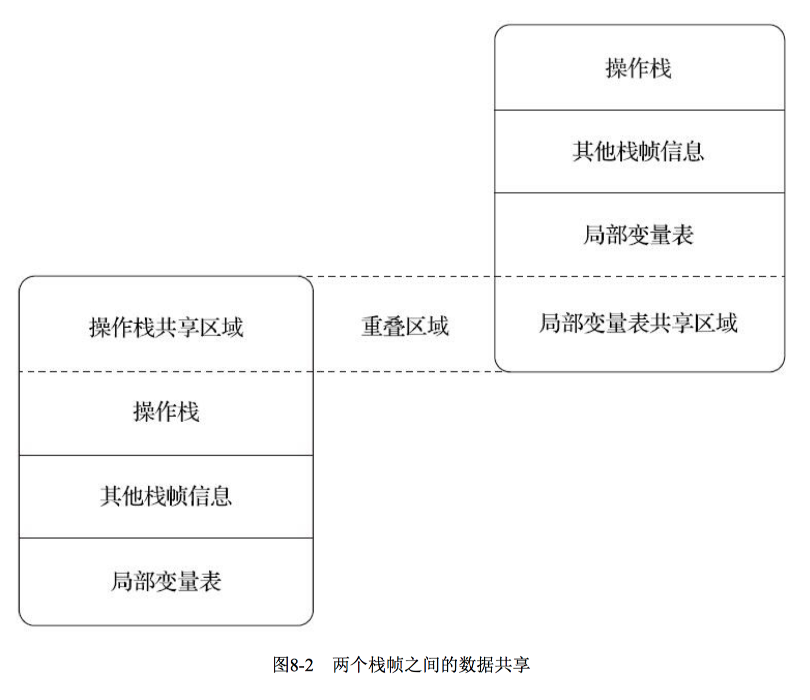
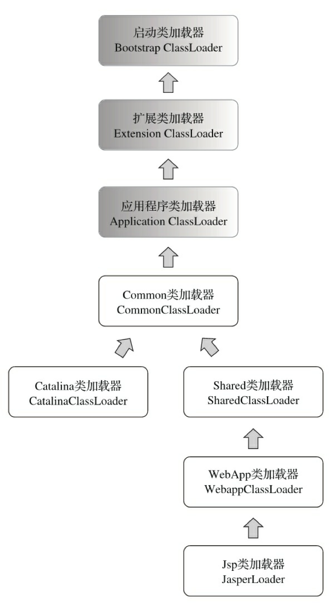
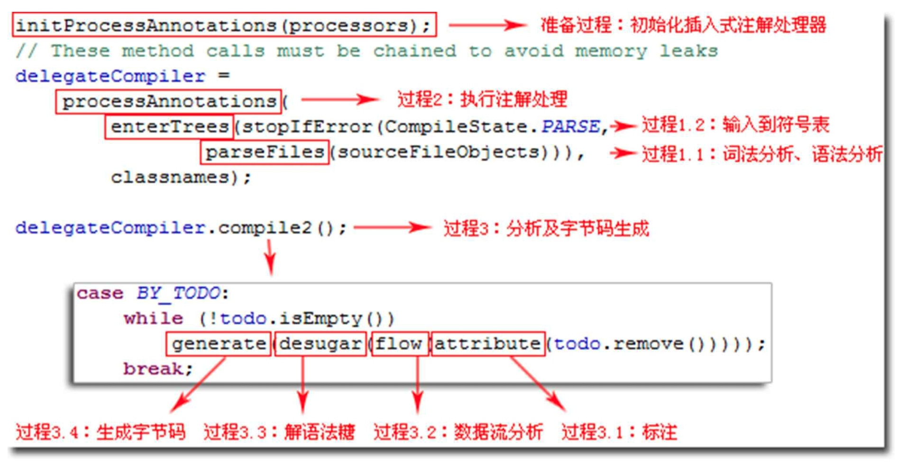
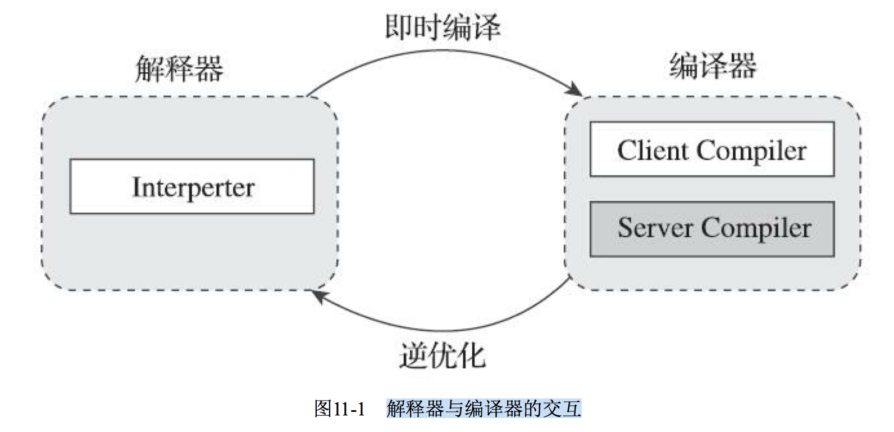
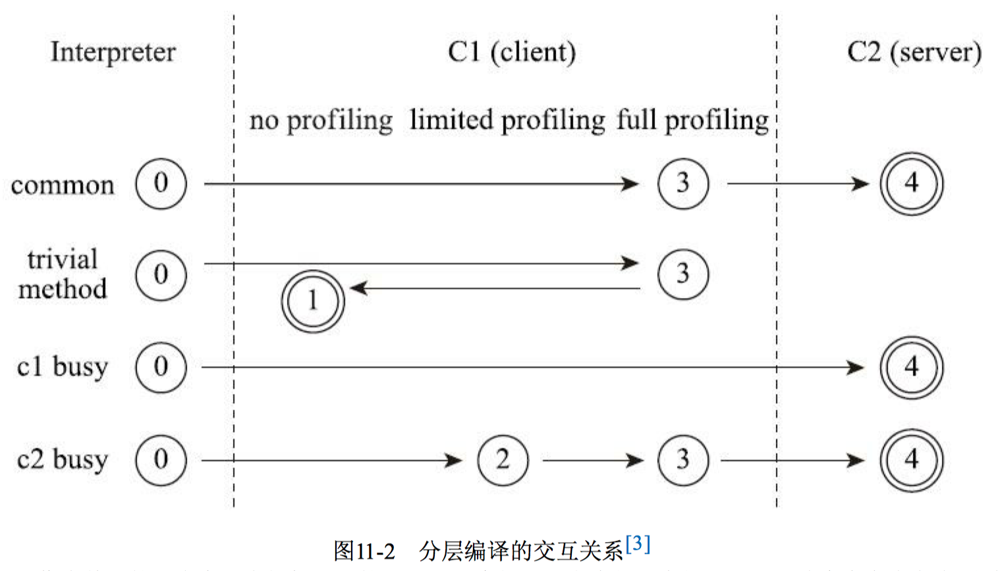
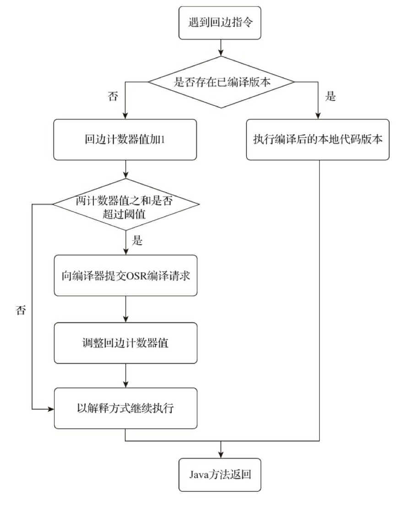
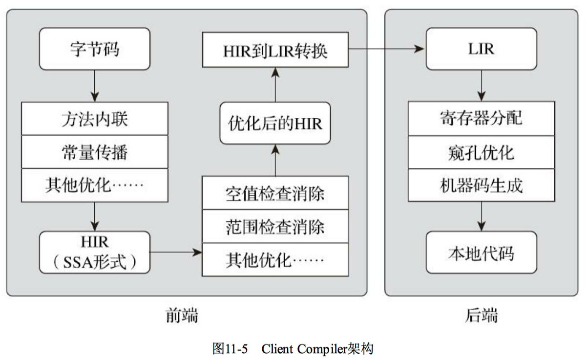
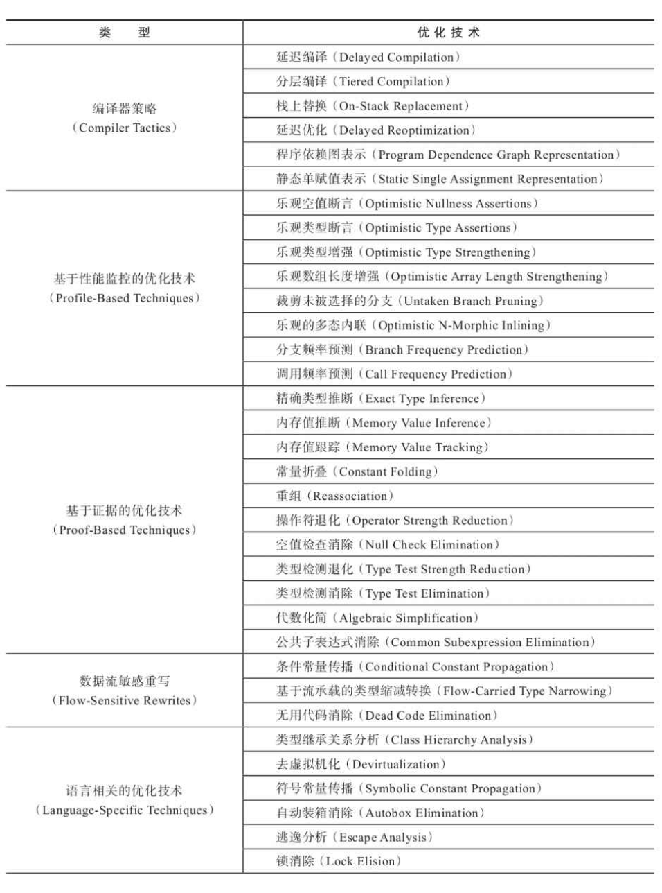
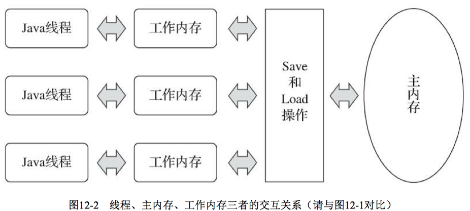
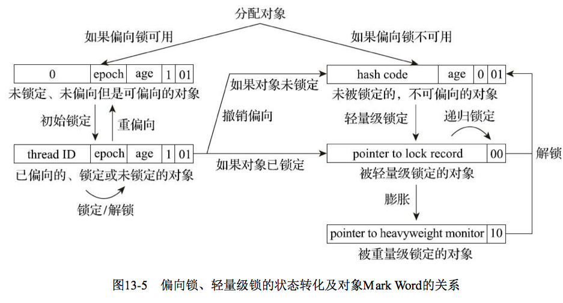

#《深入理解Java虚拟机：JVM高级特性与最佳实践(第3版.周志明)》读书笔记

## 八，虚拟机字节码执行引擎

#### 1，运行时栈帧结构

`Java` 虚拟机以 **方法** 作为最基本的执行单元，“**栈帧**”（`Stack Frame`）则是用于支持虚拟机进行方法调用和方法执行背后的数据结构，也是虚拟机运行时数据区中的虚拟机栈（`Virtual Machine Stack`）的栈元素。栈帧存储了方法的局部变量表、操作数栈、动态连接和方法返回地址等信息，每 一个方法从调用开始至执行结束的过程，都对应着一个栈帧在虚拟机栈里面从入栈到出栈的过程。

一个栈帧需要分配多少内存，并不会受到程序运行期变量数据的影响，而仅仅取决于程序源码和具体的虚拟机实现的栈内存布局形式。以 `Java` 程序的角度来看，同一时刻、同一条线程里面，在调用堆栈的所有方法都同时处于执行状态。对于执行引擎来讲，在活动线程中，只有位于栈顶的方法才是在运行的，只有位于栈顶的栈帧才是生效的，其被称为“**当前栈帧**”（`Current Stack Frame`），与这个栈帧所关联的方法被称为“**当前方法**”（`Current Method`）。


- 局部变量表

**局部变量表**（`Local Variables Table`）是一组变量值的存储空间，用于存放方法参数和方法内部定义的局部变量。局部变量表的容量以 **变量槽**（`Variable Slot`）为最小单位。

一个变量槽可以存放一个32位以内的数据类型，`Java` 中占用不超过32位存储空间的数据类型有 `boolean、byte、char、short、int、float、reference`  和 `returnAddress` 等8种类型。其中，`reference` 类型表示对一个对象实例的引用，《`Java` 虚拟机规范》既没有说明它的长度，也没有明确指出这种引用应有怎样的结构。一般来说，虚拟机实现至少都应当能通过这个引用做到两件事情：

> 1）从根据引用直接或间接地查找到对象在 `Java` 堆中的数据存放的起始地址或索引；
>
> 2）根据引用直接或间接地查找到对象所属数据类型在方法区中的存储的类型信息，否则将无法实现《`Java` 语言规范》中定义的语法约定。

`returnAddress` 类型目前已经很少见，是为字节码指令 `jsr`、`jsr_w` 和 `ret` 服务的，指向了一条字节码指令的地址，某些很古老的 `Java` 虚拟机曾经使用这几条指令来实现异常处理时的跳转，但现在也已经全部改为采用 **异常表** 来代替。

对于64位的数据类型，`Java` 虚拟机会以 **高位对齐** 的方式为其分配两个连续的变量槽空间。`Java` 语言中明确的64位的数据类型只有 `long` 和 `double` 两种。

当一个方法被调用时，`Java` 虚拟机会使用局部变量表来完成参数值到参数变量列表的传递过程， 即实参到形参的传递。

代码清单8-1 局部变量表槽复用对垃圾收集的影响之一

```java
package com.jvm;

/**
 * 局部变量表槽复用对垃圾收集的影响之一
 * VM Args：-verbose:gc
 *
 * @author zhangbocheng
 * @version v1.0
 * @date 2020/8/20 23:41
 */
public class LocalTableOne {
    public static void main(String[] args) {
        byte[] placeholder = new byte[64 * 1024 * 1024];
        System.gc();
    }
}
```

运行结果：

```bash
[GC (System.gc())  67532K->66024K(125952K), 0.0020378 secs]
[Full GC (System.gc())  66024K->65915K(125952K), 0.0060439 secs]
```

原因分析：没有回收掉 `placeholder` 所占的内存，因为在执行 `System.gc()` 时， 变量 `placeholder` 还处于作用域之内，虚拟机自然不敢回收掉 `placeholder` 的内存。

代码清单8-2 局部变量表 `Slot` 复用对垃圾收集的影响之二

```java
package com.jvm;

/**
 * 局部变量表Slot复用对垃圾收集的影响之二
 * VM Args：-verbose:gc
 *
 * @author zhangbocheng
 * @version v1.0
 * @date 2020/8/20 23:41
 */
public class LocalTableTwo {
    public static void main(String[] args) {
        {
            byte[] placeholder = new byte[64 * 1024 * 1024];
        }
        
        System.gc();
    }
}
```

运行结果：

```bash
[GC (System.gc())  67532K->66056K(125952K), 0.0008080 secs]
[Full GC (System.gc())  66056K->65915K(125952K), 0.0052654 secs]
```

原因分析：`placeholder` 的作用域被限制在花括号以内，从代码逻辑上讲，在执行 `System.gc()` 的时候，`placeholder` 已经不可能再被访问，但同时在此之后，再没有发生过任何对局部变量表的读写操作，`placeholder` 原本所占用的变量槽还没有被其他变量所复用，所以作为 `GC Roots` 一部分的局部变量表仍然保持着对它的关联。

代码清单8-3 局部变量表 `Slot` 复用对垃圾收集的影响之三

```java
package com.jvm;

/**
 * 局部变量表Slot复用对垃圾收集的影响之三
 * VM Args：-verbose:gc
 *
 * @author zhangbocheng
 * @version v1.0
 * @date 2020/8/20 23:41
 */
public class LocalTableThree {
    public static void main(String[] args) {
        {
            byte[] placeholder = new byte[64 * 1024 * 1024];
        }

        int a = 0;
        System.gc();
    }
}
```

运行结果：

```bash
[GC (System.gc())  67532K->65992K(125952K), 0.0019575 secs]
[Full GC (System.gc())  65992K->379K(125952K), 0.0062516 secs]
```

原因分析：本次内存被正确回收。 `placeholder` 能否被回收的 **根本原因**：局部变量表中的变量槽是否还存有关于 `placeholder` 数组对象的引用。

- 操作数栈

**操作数栈**（`Operand Stack`）也常被称为 **操作栈**，它是一个后入先出（`Last In First Out`，`LIFO`）栈。操作数栈的最大深度也在编译的时候被写入到 `Code` 属性的 `max_stacks` 数据项之中。操作数栈的每一个元素都可以是包括 `long` 和 `double` 在内的任意 `Java` 数据类型。32位数据类型所占的栈容量为1，64位数据类型所占的栈容量为2。



- 动态连接

每个栈帧都包含一个指向运行时常量池中该栈帧所属方法的引用，持有这个引用是为了支持方法调用过程中的 **动态连接**（`Dynamic Linking`）。在 `Class` 文件的常量池中存有大量的符号引用，字节码中的方法调用指令就以常量池里指向方法的符号引用作为参数。这些符号引用一部分会在类加载阶段或者第一次使用的时候就被转化为直接引用，这种转化被称为 **静态解析**。 另外一部分将在每一次运行期间都转化为直接引用，这部分就称为 **动态连接**。

- 方法返回地址

当一个方法开始执行后，只有两种方式退出这个方法：

> 1）执行引擎遇到任意一个方法返回的字节码指令，这时候可能会有返回值传递给上层的方法调用者（调用当前方法的方法称为 **调用者** 或者 **主调方法**），方法是否有返回值以及返回值的类型将根据遇到何种方法返回指令来决定，这种退出方法的方式称为“**正常调用完成**”（`Normal Method Invocation Completion`）；
>
> 2）在方法执行的过程中遇到了异常，并且这个异常没有在方法体内得到妥善处理。无论是 `Java` 虚拟机内部产生的异常，还是代码中使用 `athrow` 字节码指令产生的异常，只要在本方法的异常表中没有搜索到匹配的异常处理器，就会导致方法退出，这种退出方法的方式称为“**异常调用完成**（`Abrupt Method Invocation Completion`）”。一个方法使用异常完成出口的方式退出，是不会给它的上层调用者提供任何返回值的。

方法退出的过程实际上等同于把当前栈帧出栈，因此退出时可能执行的操作有：恢复上层方法的局部变量表和操作数栈，把返回值（如果有的话）压入调用者栈帧的操作数栈中，调整 `PC` 计数器的值以指向方法调用指令后面的一条指令等。

- 附加信息

《`Java` 虚拟机规范》允许虚拟机实现增加一些规范里没有描述的信息到栈帧之中，例如与调试、 性能收集相关的信息，这部分信息完全取决于具体的虚拟机实现。在讨论概念时，一 般会把动态连接、方法返回地址与其他附加信息全部归为一类，称为 **栈帧信息**。

#### 2，方法调用

方法调用并不等同于方法中的代码被执行，方法调用阶段唯一的 **任务** 就是确定被调用方法的版本 （即调用哪一个方法），暂时还未涉及方法内部的具体运行过程。

- 解析

所有方法调用的目标方法在 `Class` 文件里面都是一个常量池中的符号引用，在类加载的解析阶段，会将其中的一部分符号引用转化为直接引用，这种解析能够成立的 **前提** 是：方法在程序真正运行之前就有一个可确定的调用版本，并且这个方法的调用版本在运行期是不可改变的。换而言之，调用目标在程序代码写好、编译器进行编译那一刻就已经确定下来，这类方法的调用被称为 **解析**（`Resolution`）。

在 `Java` 语言中符合“**编译期可知，运行期不可变**”这个要求的方法，主要有 **静态方法** 和 **私有方法** 两大类，前者与类型直接关联，后者在外部不可被访问，这两种方法各自的特点决定了它们都不可能通过继承或别的方式重写出其他版本，因此它们都适合在类加载阶段进行解析。

在 `Java` 虚拟机支持以下5条方法调用字节码指令，分别是：

> `invokestatic`：用于调用静态方法；
>
> `invokespecial`：用于调用实例构造器 `<init>()` 方法、私有方法和父类中的方法；
>
> `invokevirtual`：用于调用所有的虚方法；
>
> `invokeinterface`：用于调用接口方法，会在运行时再确定一个实现该接口的对象；
>
> `invokedynamic`：先在运行时动态解析出调用点限定符所引用的方法，然后再执行该方法。前面4条调用指令，分派逻辑都固化在 `Java` 虚拟机内部，而 `invokedynamic` 指令的分派逻辑是由用户设定的引导方法来决定的。

只要能被 `invokestatic` 和 `invokespecial` 指令调用的方法，都可以在解析阶段中确定唯一的调用版本， `Java` 语言里符合这个条件的方法共有 **静态方法、私有方法、实例构造器、父类方法** 4种，再加上被 `final` 修饰的方法（尽管它使用 `invokevirtual` 指令调用），这5种方法调用会在类加载的时候就可以把符号引用解析为该方法的直接引用。这些方法统称为“**非虚方法**”（`Non-Virtual Method`），与之相反，其他方法就被称为“**虚方法**”（`Virtual Method`）。

代码清单8-4 方法静态解析

```java
package com.jvm;

/**
 * 方法静态解析
 *
 * @author zhangbocheng
 * @version v1.0
 * @date 2020/8/21 23:01
 */
public class StaticResolution {

    public static void sayHello() {
        System.out.println("Hello world!");
    }

    public static void main(String[] args) {
        StaticResolution.sayHello();
    }
}
```

运行结果：

```bash
☁  java [interview] ⚡  javap -verbose com.jvm.StaticResolution 
...
 public static void main(java.lang.String[]);
    descriptor: ([Ljava/lang/String;)V
    flags: (0x0009) ACC_PUBLIC, ACC_STATIC
    Code:
      stack=0, locals=1, args_size=1
         0: invokestatic  #5                  // Method sayHello:()V
         3: return
      LineNumberTable:
        line 17: 0
        line 18: 3
}
...
```

- 分派

1）静态分派

“**分派**”（`Dispatch`）这个词本身就具有动态性，一 般不应用在静态语境之中，这部分原本在英文原版的《`Java` 虚拟机规范》和《`Java` 语言规范》里的说法都是“`Method Overload Resolution`”，但部分其他外文资料和国内翻译的许多中文资料都将这种行为称为“**静态分派**”。

代码清单8-5 方法静态分派

```java
package com.jvm;

/**
 * 方法静态分派
 *
 * @author zhangbocheng
 * @version v1.0
 * @date 2020/8/21 23:28
 */
public class StaticDispatch {

    static abstract class BaseHuman {

    }

    static class Man extends BaseHuman {

    }

    static class Woman extends BaseHuman {

    }

    public void sayHello(BaseHuman guy) {
        System.out.println("Hello, guy!");
    }

    public void sayHello(Man guy) {
        System.out.println("Hello, gentleman!");
    }

    public void sayHello(Woman guy) {
        System.out.println("Hello, lady!");
    }

    public static void main(String[] args) {
        BaseHuman man = new Man();
        BaseHuman woman = new Woman();
        StaticDispatch dispatch = new StaticDispatch();
        dispatch.sayHello(man);
        dispatch.sayHello(woman);

        // 改进代码
        // dispatch.sayHello((Man) man);
        // dispatch.sayHello((Woman) woman);
    }
}
```

运行结果：

```bash
Hello, guy!
Hello, guy!
```

原因分析：

对于

```java
BaseHuman man = new Man();
```

代码中的“`BaseHuman`”称为变量的“**静态类型**”（`Static Type`），或者叫“**外观类型**”（`Apparent Type`），后面的“`Man`”则被称为变量的“**实际类型**”（`Actual Type`）或者叫“**运行时类型**”（`Runtime Type`）。静态类型和实际类型在程序中都可能会发生变化，**区别**是静态类型的变化仅仅在使用时发生，变量本身的静态类型不会被改变，并且最终的静态类型是在编译期可知的；而实际类型变化的结果在运行期才可确定，编译器在编译程序的时候并不知道一个对象的实际类型是什么。

`main()` 里面的两次 `sayHello()` 方法调用，在方法接收者已经确定是对象“`dispatch`”的前提下，使用哪个重载版 本，就完全取决于传入参数的数量和数据类型。代码中故意定义了两个静态类型相同，而实际类型不同的变量，但虚拟机（或者准确地说是编译器）在重载时是通过**参数的静态类型**而不是实际类型作为判定依据的。由于静态类型在编译期可知，所以在编译阶段，`Javac` 编译器就根据参数的静态类型决定了会使用哪个重载版本，因此选择了 `sayHello(Human)` 作为调用目标，并把这个方法的符号引用写到 `main()` 方法里的两条 `invokevirtual` 指令的参数中。

所有依赖静态类型来决定方法执行版本的分派动作，都称为 **静态分派**。静态分派的最典型应用表现就是 **方法重载**。静态分派发生在编译阶段，因此确定静态分派的动作实际上不是由虚拟机来执行的。

改进代码：

```java
public static void main(String[] args) {
   BaseHuman man = new Man();
   BaseHuman woman = new Woman();
   StaticDispatch dispatch = new StaticDispatch();
   dispatch.sayHello((Man) man);
   dispatch.sayHello((Woman) woman);
}
```

运行结果：

```bash
Hello, gentleman!
Hello, lady!
```

代码清单8-6 重载方法匹配优先级

```java
package com.jvm;

import java.io.Serializable;

/**
 * 重载方法匹配优先级
 *
 * @author zhangbocheng
 * @version v1.0
 * @date 2020/8/22 13:46
 */
public class OverLoading {

    public static void sayHello(Object arg) {
        System.out.println("Hello Object.");
    }

    public static void sayHello(int arg) {
        System.out.println("Hello int.");
    }

  	public static void sayHello(Integer arg) {
        System.out.println("Hello Integer.");
    }
    
    public static void sayHello(long arg) {
        System.out.println("Hello long.");
    }

    public static void sayHello(Character arg) {
        System.out.println("Hello Character.");
    }

    public static void sayHello(char arg) {
        System.out.println("Hello char.");
    }

    public static void sayHello(char... arg) {
        System.out.println("Hello char... .");
    }

    public static void sayHello(Serializable arg) {
        System.out.println("Hello Serializable.");
    }

    public static void main(String[] args) {
        sayHello('a');
    }
}
```

分析：搜索顺序：`char-->int-->long-->Character-->Serializable-->Object-->char…`，因为 `java.lang.Serializable` 是 `java.lang.Character` 类实现的一个接口，当自动装箱之后发现还是找不到装箱类，但是找到了装箱类所实现的接口类型，所以紧接着又发生一次自动转型。`char` 可以转型成 `int`，但是 `Character` 是绝对不会转型为 `Integer` 的，它只能安全地转型为它实现的接口或父类。

2）动态分派

在运行期根据实际类型确定方法执行版本的分派过程称为 **动态分派**。

代码清单8-7 方法动态分派

```java
package com.jvm;

/**
 * 方法动态分派
 *
 * @author zhangbocheng
 * @version v1.0
 * @date 2020/8/22 14:16
 */
public class DynamicDispatch {

    static abstract class BaseHuman {
        /**
         * sayHello方法
         */
        protected abstract void sayHello();
    }

    static class Man extends BaseHuman {
        @Override
        protected void sayHello() {
            System.out.println("Man say hello.");
        }
    }

    static class Woman extends BaseHuman {
        @Override
        protected void sayHello() {
            System.out.println("Woman say hello.");
        }
    }

    public static void main(String[] args) {

        BaseHuman man = new Man();
        BaseHuman woman = new Woman();
        man.sayHello();
        woman.sayHello();

        man = new Woman();
        man.sayHello();
    }
}
```

运行结果：

```bash
Man say hello.
Woman say hello.
Woman say hello.
```

```bash
☁  java [interview] ⚡  javap com.jvm.DynamicDispatch
public static void main(java.lang.String[]);
    descriptor: ([Ljava/lang/String;)V
    flags: (0x0009) ACC_PUBLIC, ACC_STATIC
    Code:
      stack=2, locals=3, args_size=1
         0: new           #2                  // class com/jvm/DynamicDispatch$Man
         3: dup
         4: invokespecial #3                  // Method com/jvm/DynamicDispatch$Man."<init>":()V
         7: astore_1
         8: new           #4                  // class com/jvm/DynamicDispatch$Woman
        11: dup
        12: invokespecial #5                  // Method com/jvm/DynamicDispatch$Woman."<init>":()V
        15: astore_2
        16: aload_1
        17: invokevirtual #6                  // Method com/jvm/DynamicDispatch$Human.sayHello:()V
        20: aload_2
        21: invokevirtual #6                  // Method com/jvm/DynamicDispatch$Human.sayHello:()V
        24: new           #4                  // class com/jvm/DynamicDispatch$Woman
        27: dup
        28: invokespecial #5                  // Method com/jvm/DynamicDispatch$Woman."<init>":()V
        31: astore_1
        32: aload_1
        33: invokevirtual #6                  // Method com/jvm/DynamicDispatch$Human.sayHello:()V
        36: return
      LineNumberTable:
        line 32: 0
        line 33: 8
        line 34: 16
        line 35: 20
        line 37: 24
        line 38: 32
        line 39: 36
}
...
```

因为 `invokevirtual` 指令执行的第一步就是在运行期确定接收者的实际类型，所以两次调用中的 `invokevirtual` 指令并不是把常量池中方法的符号引用解析到直接引用上就结束了，还会根据方法接收者的实际类型来选择方法版本，这个过程就是 `Java` 语言中 **方法重写的本质**。

代码清单8-8 字段没有多态性

```java
package com.jvm;

/**
 * 字段没有多态性
 *
 * @author zhangbocheng
 * @version v1.0
 * @date 2020/8/22 16:22
 */
public class FieldHashNoPolymorphic {

    static class Father {
        private int money = 1;

        public Father() {
            money = 2;
            showMoney();
        }

        public void showMoney() {
            System.out.println("I am Father, I have $" + money);
        }
    }

    static class Son extends Father {
        public int money = 3;

        public Son() {
            money = 4;
            showMoney();
        }

        @Override
        public void showMoney() {
            System.out.println("I am Son, I have $" + money);
        }
    }

    public static void main(String[] args) {
        Father gay = new Son();
        System.out.println("The gay has $" + gay.money);
    }
}
```

 运行结果：

```bash
I am Son, I have $0
I am Son, I have $4
The gay has $2
```

原因分析：输出两句都是“`I am Son`”，这是因为 `Son` 类在创建的时候，首先隐式调用了 `Father` 的构造函数，而  `Father` 构造函数中对 `showMeTheMoney()` 的调用是一次虚方法调用，实际执行的版本是 `Son::showMeTheMoney()` 方法，所以输出的是“`I am Son`”。虽然父类的 `money` 字段已经被初始化成2了，但 `Son::showMeTheMoney()` 方法中访问的却是子类的 `money` 字段，这时候结果自然还是0，因为它要到子类的构造函数执行时才会被初始化。`main()` 的最后一句通过静态类型访问到了父类中的 `money`，输出了2。

3）单分派与多分派

方法的接收者与方法的参数统称为 **方法的宗量**，最早应该来源于著名的《`Java` 与模式》 。根据分派基于多少种宗量，可以将分派划分为 **单分派** 和 **多分派** ：

> **单分派** 是根据一个宗量对目标方法进行选择；
>
> **多分派** 则是根据多于一个宗量对目标方法进行选择。

代码清单8-9 单分派和多分派

```java
package com.jvm;

/**
 * 单分派和多分派
 *
 * @author zhangbocheng
 * @version v1.0
 * @date 2020/8/22 16:43
 */
public class Dispatch {

    static class Tencent {}
    static class Aily {}

    public static class Father {
        public void hardChoice(Tencent arg) {
            System.out.println("Father choose QQ.");
        }

        public void hardChoice(Aily arg) {
            System.out.println("Father choose Aily.");
        }
    }

    public static class Son extends Father {
        @Override
        public void hardChoice(Tencent arg) {
            System.out.println("Son choose QQ.");
        }

        @Override
        public void hardChoice(Aily arg) {
            System.out.println("Son choose Aily.");
        }
    }

    public static void main(String[] args) {
        Father father = new Father();
        Father son = new Son();
        father.hardChoice(new Aily());
        son.hardChoice(new Tencent());
    }
}
```

原因分析：

> 在 `main()` 里调用了两次 `hardChoice()` 方法，首先关注的是编译阶段中编译器的选择过程，也就是 **静态分派** 的过程。这时候选择目标方法的依据有：一是静态类型是 `Father` 还是 `Son`，二是方法参数是 `Tencent` 还是 `Aily`。这次选择结果的最终产物是产生了两条 `invokevirtual` 指令，两条指令的参数分别为常量池中指向 `Father::hardChoice(Tencent)` 及 `Father::hardChoice(Aliy)` 方法的符号引用。因为是根据两个宗量进行选择，所以 `Java` 语言的静态分派属于 **多分派类型**；
>
> 对于运行阶段中虚拟机的选择，也就是 **动态分派** 的过程：在执行“`son.hardChoice(new Tencent())`”这行代码时，更准确地说，是在执行这行代码所对应的 `invokevirtual` 指令时，由于编译期已经决定目标方法的签名必须为 `hardChoice(Tencent)`，虚拟机此时不会关心传递过来的参数“`Tencent`”到底是“`Tencent`”还是“`Aily`”，因为这时候参数的静态类型、实际类型都对方法的选择不会构成任何影响，唯一可以影响虚拟机选择的因素只有该方法的接受者的实际类型是 `Father` 还是 `Son`。因为只有一个宗量作为选择依据， 所以 `Java` 语言的动态分派属于 **单分派类型**。

4）虚拟机动态分派的实现

**动态分派** 是执行非常频繁的动作，而且动态分派的方法版本选择过程需要运行时在接收者类型的方法元数据中搜索合适的目标方法，因此，`Java` 虚拟机实现基于执行性能的考虑，真正运行时一般不会如此频繁地去反复搜索类型元数据。面对这种情况，一种基础而且常见的优化手段是为类型在方法区中建立一个虚方法表（`Virtual Method Table`，也称为 `vtable`，与此对应的，在 `invokeinterface` 执行时也会用到接口方法表——`Interface Method Table`，简称  `itable`），使用虚方法表索引来代替元数据查找以提高性能。

#### 3，动态类型语言支持

- 动态类型语言

**动态类型语言** 的 **关键特征** 是它的类型检查的主体过程是在运行期而不是编译期进行的，满足这个特征的语言有如：`APL、Clojure、Erlang、Groovy、 JavaScript、Lisp、Lua、PHP、Prolog、Python、Ruby、Smalltalk、Tcl` 等等。

**动态类型语言**与 `Java` 有一个 **核心差异** 是变量 `obj` 本身并没有类型，变量 `obj` 的值才具有类型，所以编译器在编译时最多只能确定方法名称、参数、返回值这些信息，而不会去确定方法所在的具体类型 （即方法接收者不固定）。“**变量无类型而变量值才有类型**” 是动态类型语言的一个**核心特征**。

- `Java` 与动态类型

`JDK 7` 以前的字节码指令集中，4条方法调用指令（`invokevirtual`、`invokespecial`、`invokestatic`、 `invokeinterface`）的第一个参数都是被调用的方法的符号引用（`CONSTANT_Methodref_info` 或者  `CONSTANT_InterfaceMethodref_info` 常量），方法的符号引用在编译时产生，而动态类型语言只有在运行期才能确定方法的接收者。

- `java.lang.invoke` 包

`JDK 7` 时新加入的 `java.lang.invoke` 包是 `JSR 292` 的一个重要组成部分，这个包的主要目的是在之前单纯依靠符号引用来确定调用的目标方法这条路之外，提供一种新的动态确定目标方法的机制，称 为“**方法句柄**”（`Method Handle`）。

代码清单8-10 方法句柄

```java
package com.jvm;

import static java.lang.invoke.MethodHandles.lookup;

import java.lang.invoke.MethodHandle;
import java.lang.invoke.MethodType;

/**
 * 方法句柄
 *
 * @author zhangbocheng
 * @version v1.0
 * @date 2020/8/22 20:08
 */
public class MethodHandleTest {

    static class Demo {
        public void println(String s) {
            System.out.println(s);
        }
    }

    public static void main(String[] args) throws Throwable {
        Object obj = System.currentTimeMillis() % 2 == 0 ? System.out : new Demo();
        getPrintln(obj).invokeExact("com.jvm");
    }

    private static MethodHandle getPrintln(Object receiver) throws Throwable {
        // MethodType：代表“方法类型”，包含了方法的返回值（methodType()的第一个参数）
        // 和具体参数（methodType()第二个及以后的参数）。
        MethodType type = MethodType.methodType(void.class, String.class);
        // lookup()方法来自于MethodHandles.lookup，
        // 这句的作用是在指定类中查找符合给定的方法 名称、方法类型，并且符合调用权限的方法句柄。
        return lookup().findVirtual(receiver.getClass(), "println", type).bindTo(receiver);
    }
}
```

`MethodHandle` 在使用方法和效果上与 `Reflection` 有众多相似之处，不过也有以下区别：

> `Reflection` 和 `MethodHandle` 机制本质上都是在模拟方法调用，但是 `Reflection` 是在模拟 `Java` 代码层次 的方法调用，而 `MethodHandle` 是在模拟字节码层次的方法调用。在 `MethodHandles.Lookup` 上的3个方法  `findStatic()`、`findVirtual()`、`findSpecial()` 正是为了对应于 `invokestatic`、`invokevirtual`（以及 `invokeinterface`）和 `invokespecial` 这几条字节码指令的执行权限校验行为，而这些底层细节在使用  `Reflection API` 时是不需要关心的；
>
> `Reflection` 中的 `java.lang.reflect.Method` 对象远比 `MethodHandle` 机制中的  `java.lang.invoke.MethodHandle` 对象所包含的信息来得多。前者是方法在 `Java` 端的全面映像，包含了方法 的签名、描述符以及方法属性表中各种属性的 `Java` 端表示方式，还包含执行权限等的运行期信息。而 后者仅包含执行该方法的相关信息。`Reflection` 是重量级，而 `MethodHandle` 是轻量级。

- `invokedynamic` 指令

每一处含有 `invokedynamic` 指令的位置都被称作“**动态调用点**（`Dynamically-Computed Call Site`）”， 这条指令的第一个参数不再是代表方法符号引用的 `CONSTANT_Methodref_info` 常量，而是变为 `JDK 7` 时新加入的 `CONSTANT_InvokeDynamic_info` 常量，从这个新常量中可以得到3项信息：引导方法 （`Bootstrap Method`，该方法存放在新增的 `BootstrapMethods` 属性中）、方法类型（`MethodType`）和名称。引导方法是有固定的参数，并且返回值规定是 `java.lang.invoke.CallSite` 对象，这个对象代表了真正要执行的目标方法调用。根据 `CONSTANT_InvokeDynamic_info` 常量中提供的信息 ，虚拟机可以找到 并且执行引导方法，从而获得一个 `CallSite` 对象，最终调用到要执行的目标方法上。

代码清单8-11 `InvokeDynamic` 指令

```java
package com.jvm;

import java.lang.invoke.*;

import static java.lang.invoke.MethodHandles.lookup;

/**
 * InvokeDynamic指令
 *
 * @author zhangbocheng
 * @version v1.0
 * @date 2020/8/22 20:08
 */
public class InvokeDynamicTest {

    public static void main(String[] args) throws Throwable {
        IndyBootstrapMethod().invokeExact("com.jvm.InvokeDynamicTest");
    }

    private static MethodHandle IndyBootstrapMethod() throws Throwable {
        CallSite cs = (CallSite) MhBootstrapMethod().invokeWithArguments(lookup(), "testMethod",
                MethodType.fromMethodDescriptorString("(Ljava/lang/String;)V", null));
        return cs.dynamicInvoker();
    }

    private static MethodHandle MhBootstrapMethod() throws Throwable {
        return lookup().findStatic(InvokeDynamicTest.class, "BoostrapMethod", MtBoostrapMethod());
    }

    private static MethodType MtBoostrapMethod() {
        return MethodType
                .fromMethodDescriptorString(
                        "(Ljava/lang/invoke/MethodHandles$Lookup;Ljava/lang/String;Ljava/lang/invoke/MethodType;) Ljava/lang/invoke/CallSite;", null);
    }

    public static CallSite BoostrapMethod(MethodHandles.Lookup lookup, String name, MethodType mt)
        throws Throwable {
        return new ConstantCallSite(lookup.findStatic(InvokeDynamicTest.class, name, mt));
    }

    public static void testMethod(String s) {
        System.out.println("Hello String: " + s);
    }
}
```

- 实战：掌控方法分派规则

`invokedynamic` 指令与此前4条传统的“`invoke*`”指令的 **最大区别** 就是它的分派逻辑不是由虚拟机决定的，而是由程序员决定。

代码清单8-12 方法调用问题

```java
package com.jvm;

import static java.lang.invoke.MethodHandles.lookup;

import java.lang.invoke.MethodHandle;
import java.lang.invoke.MethodHandles;
import java.lang.invoke.MethodType;
import java.lang.reflect.Field;

/**
 * 方法调用问题
 *
 * @author zhangbocheng
 * @version v1.0
 * @date 2020/9/3 10:52
 */
public class GrandFatherTest {
    public static void main(String[] args) {
        (new SonMethodHandle()).thinking();
        (new SonMethodHandleTrust()).thinking();
    }
}


class GrandFather {
    void thinking() {
        System.out.println("I am grandfather.");
    }
}


class Father extends GrandFather {
    @Override
    void thinking() {
        System.out.println("I am father.");
    }
}


/**
 * 问题：实现调用祖父类的thinking()方法，打印 "I am grandfather."
 *
 * 使用JDK 7 Update 9之前的HotSpot虚拟机运行，结果为：I am grandfather.
 * 使用JDK 7 Update 10修正之后的HotSpot虚拟机运行，结果为：I am father.
 *
 */
class SonMethodHandle extends Father {
    @Override
    void thinking() {
        try {
            MethodType mt = MethodType.methodType(void.class);
            MethodHandle mh = lookup().findSpecial(GrandFather.class, "thinking", mt, getClass());
            mh.invoke(this);
        } catch (Throwable e) {
            e.printStackTrace();
        }
    }
}


/**
 * 问题：实现调用祖父类的thinking()方法，打印 "I am grandfather."
 *
 */
class SonMethodHandleTrust extends Father {
    @Override
    void thinking() {
        try {
            MethodType mt = MethodType.methodType(void.class);
            Field lookupImpl = MethodHandles.Lookup.class.getDeclaredField("IMPL_LOOKUP");
            lookupImpl.setAccessible(true);
            MethodHandle mh = ((MethodHandles.Lookup) lookupImpl.get(null)).findSpecial(GrandFather.class,
                    "thinking", mt, GrandFather.class);
            mh.invoke(this);
        } catch (Throwable e) {
            e.printStackTrace();
        }
    }
}
```

#### 4，基于栈的字节码解释执行引擎

 在 `Java` 语言中，`Javac` 编译器完成了程序代码经过词法分析、语法分析到抽象语法树，再遍历语法树生成线性的字节码指令流的过程。因为这一部分动作是在 `Java` 虚拟机之外进行的，而解释器在虚拟机的内部，所以 `Java` 程序的编译就是半独立的实现。


`Javac` 编译器输出的字节码指令流，基本上是一种 **基于栈的指令集架构**（`Instruction Set Architecture`，`ISA`），字节码指令流里面的指令大部分都是零地址指令，它们依赖操作数栈进行工作。与之相对的一套常用的指令集架构是 **基于寄存器** 的指令集，最典型的就是 `x86` 的二地址指令集，如果说得更通俗一些就是现在主流 `PC` 机中物理硬件直接支持的指令集架构，这些指令依赖寄存器进行工作。

基于 **栈的指令集主要优点** 是可移植，因为寄存器由硬件直接提供，程序直接依赖这些硬件寄存器则不可避免地要受到硬件的约束。此外还有其他的优点， 如代码相对更加紧凑（字节码中每个字节就对应一条指令，而多地址指令集中还需要存放参数）、编 译器实现更加简单（不需要考虑空间分配的问题，所需空间都在栈上操作）等。

**栈架构指令集的主要缺点** 是理论上执行速度相对来说会稍慢一些，不过这里的执行速度是要局限在解释执行的状态下，如果经过即时编译器输出成物理机上的汇编指令流，那就与虚拟机采用哪种指令集架构没有什么关系。

## 九，类加载及执行子系统的案例与实战

#### 1，案例分析

- `Tomcat`：正统的类加载器架构

一个功能健全的 `Web` 服务器，需要解决如下的这些问题：

> 部署在同一个服务器上的两个 `Web` 应用程序所使用的 `Java` 类库可以实现相互隔离。这是最基本的需求，两个不同的应用程序可能会依赖同一个第三方类库的不同版本，不能要求每个类库在一个服务器中只能有一份，服务器应当能够保证两个独立应用程序的类库可以互相独立使用；
>
> 部署在同一个服务器上的两个 `Web` 应用程序所使用的 `Java` 类库可以互相共享。例如用户可能有10个使用 `Spring` 组织的应用程序部署在同一台服务器上，如果把10份 `Spring` 分别存放在各个应用程序的隔离目录中，将会是很大的资源浪费——这主要倒不是浪费磁盘空间的问题，而是指类库在使用时都要被加载到服务器内存，如果类库不能共享，虚拟机的方法区就会很容易出现过度膨胀的风险；
>
> 服务器需要尽可能地保证自身的安全不受部署的 `Web` 应用程序影响。目前，有许多主流的 `Java Web` 服务器自身也是使用 `Java` 语言来实现的。因此服务器本身也有类库依赖的问题，一般来说，基于安全考虑，服务器所使用的类库应该与应用程序的类库互相独立；
>
> 支持 `JSP` 应用的 `Web` 服务器，大部分都需要支持 `HotSwap` 功能。

在 `Tomcat` 目录结构中，可以设置3组目录（`/common/`、`/server/` 和 `/shared/`，但默认不一定是开放的，可能只有 `/lib/` 目录存在）用于存放 `Java` 类库，另外还应该加上 `Web` 应用程序自身的“`/WEBINF/`”目录，一共4组。把 `Java` 类库放置在这4组目录中，每一组都有独立的含义，分别是：

> 放置在 `/common` 目录中，类库可被 `Tomcat` 和所有的 `Web` 应用程序共同使用；
>
> 放置在 `/server` 目录中，类库可被Tomcat使用，对所有的Web应用程序都不可见；
>
> 放置在/shared目录中，类库可被所有的Web应用程序共同使用，但对Tomcat自己不可见。
>
> 放置在 `/WebApp/WEB-INF` 目录中，类库仅仅可以被该 `Web` 应用程序使用，对 `Tomcat` 和其他 `Web` 应用程序都不可见。

为了支持这套目录结构，并对目录里面的类库进行加载和隔离，`Tomcat` 自定义了多个类加载器， 这些类加载器按照经典的 **双亲委派模型** 来实现，其关系如图所示。



- `OSGi`：灵活的类加载器架构

`OSGi` （`Open Service Gateway Initiative`）是 `OSGi` 联盟（`OSGi Alliance`）制订的一个基于 `Java` 语言的动态模块化规范（在 `JDK 9` 引入的 `JPMS` 是静态的模块系统），这个规范最初由 `IBM`、爱立信等公司 联合发起，在早期连 `Sun` 公司都有参与。目的是使服务提供商通过住宅网关为各种家用智能设备提供服务，现成为 `Java` 世界中“事实上”的动态模块化标准，并且已经有了 `Equinox`、`Felix` 等成熟的实现。

在今天，通常引入 `OSGi` 的主要理由是基于 `OSGi` 架构的程序很可能会实现模块级的热插拔功能，当程序升级更新或调试除错时，可以只停用、重新安装然后启用程序的其中一部分，这对大型软件、企业级程序开发来说是一个非常有诱惑力 的特性，譬如 `Eclipse` 中安装、卸载、更新插件而不需要重启动，就使用到了这种特性。

`OSGi` 之所以能有上述诱人的特点，必须要归功于它灵活的类加载器架构。`OSGi` 的 `Bundle` 类加载器之间只有规则，没有固定的委派关系。另外，一个 `Bundle` 类加载器为其他 `Bundle` 提供服务时，会根据 `Export-Package` 列表严格控制访问范围。如果一个类存在于 `Bundle` 的类库中但是没有被 `Export`，那么这个 `Bundle` 的类加载器能找到这个类， 但不会提供给其他 `Bundle` 使用，而且 `OSGi` 框架也不会把其他 `Bundle` 的类加载请求分配给这个 `Bundle` 来处理。

- 字节码生成技术与动态代理的实现

代码清单9-1　动态代理的简单示例

```java
package com.jvm;

import java.lang.reflect.InvocationHandler;
import java.lang.reflect.Method;
import java.lang.reflect.Proxy;

/**
 * 动态代理的简单示例
 *
 * @author zhangbocheng
 * @version v1.0
 * @date 2020/9/3 22:34
 */
public class DynamicProxyTest {

    interface IHello {
        void sayHello();
    }

    static class Hello implements IHello {
        @Override
        public void sayHello() {
            System.out.println("Hello world.");
        }
    }

    static class DynamicProxy implements InvocationHandler {
        Object object;

        Object bind(Object o) {
            this.object = o;
            return Proxy.newProxyInstance(object.getClass().getClassLoader(), object.getClass().getInterfaces(), this);
        }

        @Override
        public Object invoke(Object proxy, Method method, Object[] args) throws Throwable {
            System.out.println("Welcome");
            return method.invoke(object, args);
        }
    }

    public static void main(String[] args) {
        IHello hello = (IHello) new DynamicProxy().bind(new Hello());
        hello.sayHello();
    }
}
```

- `Backport` 工具：`Java` 的时光机器

`Retrotranslator` 的作用是将 `JDK 5` 编译出来的 `Class` 文件转变为可以在 `JDK 1.4` 或 `1.3` 上部署的版本， 它能很好地支持自动装箱、泛型、动态注解、枚举、变长参数、遍历循环、静态导入这些语法特性，甚至还可以支持 `JDK 5` 中新增的集合改进、并发包及对泛型、注解等的反射操作。`Retrolambda` 的作用是将 `JDK 8` 的 `Lambda` 表达式和 `try-resources` 语法转变为可以在 `JDK 5、JDK 6、JDK 7` 中使用的形式，同时也对接口默认方法提供了有限度的支持。

#### 2，实战：自己动手实现远程执行功能

代码清单9-2　`HotSwapClassLoader` 的实现

```java
package com.jvm;

/**
 * HotSwapClassLoader的实现
 *      为了多次载入执行类而加入的加载器
 *      把defineClass方法开放出来，只有外部显式调用的时候才会使用到loadByte方法
 *      由虚拟机调用时，仍然按照原有的双亲委派规则使用loadClass方法进行类加载
 *
 * @author zhangbocheng
 * @version v1.0
 * @date 2020/9/3 23:05
 */
public class HotSwapClassLoader extends ClassLoader {

    public HotSwapClassLoader() {
        super(HotSwapClassLoader.class.getClassLoader());
    }

    public Class loadByte(byte[] bytes) {
        return defineClass(null, bytes, 0, bytes.length);
    }
}
```

代码清单9-3　`ClassModifier` 的实现

```java
package org.jvm;

/**
 * ClassModifier的实现
 *      修改Class文件，暂时只提供修改常量池常量的功能
 *
 * @author zhangbocheng
 * @version v1.0
 * @date 2020/9/3 23:30
 */
public class ClassModifier {

    /**
     * Class文件中常量池的起始偏移
     */
    private static final int CONSTANT_POOL_COUNT_INDEX = 8;

    /**
     * CONSTANT_Utf8_info常量的tag标志
     */
    private static final int CONSTANT_UTF8_INFO = 1;

    /**
     * 常量池中11种常量所占的长度，CONSTANT_Utf8_info型常量除外，因为它不是定长的
     */
    private static final int[] CONSTANT_ITEM_LENGTH = {-1, -1, -1, 5, 5, 9, 9, 3, 3, 5, 5, 5, 5};

    private static final int U1 = 1;
    private static final int U2 = 2;

    private byte[] bytes;

    public ClassModifier(byte[] bytes) {
        this.bytes = bytes;
    }

    public byte[] modifyUtf8Constant(String oldStr, String newStr) {
        int cpc = getConstantPoolCount();
        int offset = CONSTANT_POOL_COUNT_INDEX + U2;
        for (int i = 0; i < cpc; i++) {
            int tag = ByteUtils.bytes2Int(bytes, offset, U1);
            if (tag == CONSTANT_UTF8_INFO) {
                int len = ByteUtils.bytes2Int(bytes, offset + U1, U2);
                offset += (U1 + U2);
                String str = ByteUtils.bytes2String(bytes, offset, len);
                if (str.equalsIgnoreCase(oldStr)) {
                    byte[] strBytes = ByteUtils.string2Bytes(newStr);
                    byte[] strLen = ByteUtils.int2Byte(newStr.length(), U2);
                    bytes = ByteUtils.byteReplace(bytes, offset - U2, U2, strLen);
                    bytes = ByteUtils.byteReplace(bytes, offset, len, strBytes);
                    return bytes;
                } else {
                    offset += len;
                }
            } else {
                offset += CONSTANT_ITEM_LENGTH[tag];
            }
        }

        return bytes;
    }

    private int getConstantPoolCount() {
        return ByteUtils.bytes2Int(bytes, CONSTANT_POOL_COUNT_INDEX, U2);
    }
}
```

代码清单9-4　`ByteUtils` 的实现

```java
package org.jvm;

/**
 * ByteUtils 的实现
 *      Bytes数组处理工具
 *
 * @author zhangbocheng
 * @version v1.0
 * @date 2020/9/3 23:56
 */
public class ByteUtils {
    
    public static int bytes2Int(byte[] bytes, int start, int len) {
        int sum = 0;
        int end = start + len;
        for (int i = start; i < end; i++) {
            int n = ((int) bytes[i]) & 0xff;
            n <<= (--len) * 8;
            sum += n;
        }
        
        return sum;
    }

    public static String bytes2String(byte[] bytes, int offset, int len) {
        return new String(bytes, offset, len);
    }

    public static byte[] string2Bytes(String str) {
        return st.getBytes();
    }

    public static byte[] int2Byte(int value, int len) {
        byte[] bytes = new byte[len];
        for (int i = 0; i < len; i++) {
            bytes[len - i - 1] = (byte) ((value >> 8 * i) & 0xff);
        }

        return bytes;
    }

    public static byte[] byteReplace(byte[] bytes, int offset, int len, byte[] replaceBytes) {
        byte[] newBytes = new byte[bytes.length + (replaceBytes.length - len)];
        System.arraycopy(bytes, 0, newBytes, 0, offset);
        System.arraycopy(replaceBytes, 0, newBytes, offset, replaceBytes.length);
        System.arraycopy(bytes, offset + len, newBytes, offset + replaceBytes.length, bytes.length);
        return newBytes;
    }
}
```

代码清单9-5　`HackSystem` 的实现

```java
package org.jvm;

import java.io.ByteArrayOutputStream;
import java.io.InputStream;
import java.io.PrintStream;

/**
 * HackSystem的实现
 *      为 Java class 劫持java.lang.System提供支持
 *      除了out和err外，其余的都直接转发给System处理
 *
 * @author zhangbocheng
 * @version v1.0
 * @date 2020/9/4 00:24
 */
public class HackSystem {

    public final static InputStream in = System.in;
    private static ByteArrayOutputStream buffer = new ByteArrayOutputStream();
    public final static PrintStream out = new PrintStream(buffer);
    public final static PrintStream err = out;

    public static String getBufferString() {
        return buffer.toString();
    }

    public static void clearBuffer() {
        buffer.reset();
    }

    public static void setSecurityManager(final SecurityManager s) {
        System.setSecurityManager(s);
    }

    public static SecurityManager getSecurityManager() {
        return System.getSecurityManager();
    }

    public static long currentTimeMillis() {
        return System.currentTimeMillis();
    }

    public static void arraycopy(Object src, int srcPos, Object dest, int destPos, int length) {
        System.arraycopy(src, srcPos, dest, destPos, length);
    }
}
```

代码清单9-6　`JavaClassExecutor` 的实现

```java
package org.jvm;

import java.lang.reflect.Method;

/**
 * Java Class 执行工具
 *
 * @author zhangbocheng
 * @version v1.0
 * @date 2020/9/4 17:06
 */
public class JavaClassExecutor {

    public static String execute(byte[] bytes) {
        HackSystem.clearBuffer();
        ClassModifier cm = new ClassModifier(bytes);
        byte[] modiBytes = cm.modifyUtf8Constant("java/lang/System", "org/jvm/HackSystem");
        HotSwapClassLoader loader = new HotSwapClassLoader();
        Class cls = loader.loadByte(modiBytes);
        try {
            Method method = cls.getMethod("main", new Class[] {String[].class});
            method.invoke(null, new String[] {null});
        } catch (Throwable e) {
            e.printStackTrace();
        }

        return HackSystem.getBufferString();
    }
}
```


## 十，前端编译与优化

#### 1，编译器分类

> **前端编译器**：`JDK` 的 `Javac`、`Eclipse JDT` 中的增量式编译器（`ECJ`）；
>
> **即时编译器**：`HotSpot` 虚拟机的 `C1`、`C2` 编译器，`Graal` 编译器；
>
> **提前编译器**：`JDK` 的 `Jaotc`、`GNU Compiler for the Java`（`GCJ`）、`Excelsior JET`。

#### 2，`Javac` 编译器

在 `JDK 6` 以前，`Javac` 并不属于标准 `Java SE API` 的一部分，它实现代码单独存放在 `tools.jar` 中，要在程序中使用的话就必须把这个库放到类路径上。在 `JDK 6` 发布时通过了 `JSR 199` 编译器 `API` 的提案，使得 `Javac` 编译器的实现代码晋升成为标准 `Java` 类库之一，它的源码就改为放在 `JDK_SRC_HOME/langtools/src/share/classes/com/sun/tools/javac` 中。到了 `JDK 9` 时，整个 `JDK` 所有的 `Java` 类库都采用模块化进行重构划分，`Javac` 编译器就被挪到了 `jdk.compiler` 模块（路径为：  `JDK_SRC_HOME/src/jdk.compiler/share/classes/com/sun/tools/javac`）里面。

创建 `JAVA JDK` 工程：

```bash
☁  openjdk-jdk8u [master] cp -rf langtools/src/share/classes/com ../java_projects/jdk-src/src/
```

执行：

```bash
/Library/Java/JavaVirtualMachines/jdk1.8.0_131.jdk/Contents/Home/bin/java -Dfile.encoding=UTF-8 -classpath...jects/java_pro/java_projects/jdk-src/out/production/jdk-src com.sun.tools.javac.Main
用法: javac <options> <source files>
其中, 可能的选项包括:
  -g                         生成所有调试信息
  -g:none                    不生成任何调试信息
  -g:{lines,vars,source}     只生成某些调试信息
  -nowarn                    不生成任何警告
  -verbose                   输出有关编译器正在执行的操作的消息
  -deprecation               输出使用已过时的 API 的源位置
  -classpath <路径>            指定查找用户类文件和注释处理程序的位置
  -cp <路径>                   指定查找用户类文件和注释处理程序的位置
  -sourcepath <路径>           指定查找输入源文件的位置
  -bootclasspath <路径>        覆盖引导类文件的位置
  -extdirs <目录>              覆盖所安装扩展的位置
  -endorseddirs <目录>         覆盖签名的标准路径的位置
  -proc:{none,only}          控制是否执行注释处理和/或编译。
  -processor <class1>[,<class2>,<class3>...] 要运行的注释处理程序的名称; 绕过默认的搜索进程
  -processorpath <路径>        指定查找注释处理程序的位置
  -parameters                生成元数据以用于方法参数的反射
  -d <目录>                    指定放置生成的类文件的位置
  -s <目录>                    指定放置生成的源文件的位置
  -h <目录>                    指定放置生成的本机标头文件的位置
  -implicit:{none,class}     指定是否为隐式引用文件生成类文件
  -encoding <编码>             指定源文件使用的字符编码
  -source <发行版>              提供与指定发行版的源兼容性
  -target <发行版>              生成特定 VM 版本的类文件
  -profile <配置文件>            请确保使用的 API 在指定的配置文件中可用
  -version                   版本信息
  -help                      输出标准选项的提要
  -A关键字[=值]                  传递给注释处理程序的选项
  -X                         输出非标准选项的提要
  -J<标记>                     直接将 <标记> 传递给运行时系统
  -Werror                    出现警告时终止编译
  @<文件名>                     从文件读取选项和文件名


Process finished with exit code 2
```

从 `Javac` 代码的总体结构来看，编译过程大致可以分为1个准备过程和3个处理过程，它们分别如下：

> 1）准备过程：初始化插入式注解处理器；
>
> 2）解析与填充符号表过程，包括：
>
> > 词法、语法分析：将源代码的字符流转变为标记集合，构造出抽象语法树；
> >
> > > **词法分析** 是将源代码的字符流转变为标记（`Token`，如关键字、变量名、字面量、运算符等）集合的过程，单个字符是程序编写时的最小元素，但标记才是编译时的最小元素；其过程由  `com.sun.tools.javac.parser.Scanner` 类来实现；
> > >
> > > **语法分析** 是根据标记序列构造抽象语法树的过程，**抽象语法树**（`Abstract Syntax Tree`，`AST`）是一种用来描述程序代码语法结构的树形表示方式，抽象语法树的每一个节点都代表着程序代码中的一个语法结构（`Syntax Construct`），例如包、类型、修饰符、运算符、接口、返回值甚至连代码注释等都可以是一种特定的语法结构；其过程由  `com.sun.tools.javac.parser.Parser` 类实现，这个阶段产出的抽象语法树是以`com.sun.tools.javac.tree.JCTree` 类表示的。
> >
> > 填充符号表：产生符号地址和符号信息。
> >
> > > **符号表**（`Symbol Table`）是由一组符号地址和符号信息构成的数据结构，可以把它类比想象成哈希表中键值对的存储形式（实际上符号表不一定是哈希表实现，可以是有序符号表、树状符号表、栈结构符号表等各种形式）。符号表中所登记的信息在编译的不同阶段都要被用到；其过程由 `com.sun.tools.javac.comp.Enter` 类实现，该过程的产出物是一个待处理列表，其中包含了每一个编译单元的抽象语法树的顶级节点，以及 `package-info.java`（如果存在的话）的顶级节点。
>
> 3）插入式注解处理器的注解处理过程：插入式注解处理器的执行阶段，影响 `Javac` 的编译行为；
>
> > `JDK 5` 之后，`Java` 语言提供了对 **注解**（`Annotations`）的支持，只会在程序运行期间发挥作用。但在 `JDK 6` 中又提出并通过了 `JSR-269` 提案，该提案设计了一组被称为“插入式注解处理器”的0标准 `API`，可以提前至编译期对代码中的特定注解进行处理， 从而影响到前端编译器的工作过程。把插入式注解处理器看作是一组编译器的插件，当这些插件工作时，允许读取、修改、添加抽象语法树中的任意元素。如果这些插件在处理注解期间对语法树进行过修改，编译器将回到解析及填充符号表的过程重新处理，直到所有插入式注解处理器都没有再对语法树进行修改为止，每一次循环过程称为一个 **轮次**（`Round`）。
> >
> > 在 `Javac` 源码中，插入式注解处理器的初始化过程是在 `initPorcessAnnotations()` 方法中完成的，而它的执行过程则是在 `processAnnotations()` 方法中完成。这个方法会判断是否还有新的注解处理器需要执行，如果有的话，通过 `com.sun.tools.javac.processing.JavacProcessing-Environment` 类的 `doProcessing()` 方法来生成一个新的 `JavaCompiler` 对象，对编译的后续步骤进行处理。
>
> 4）语义分析与字节码生成过程，包括： 
>
> > 标注检查：对语法的静态信息进行检查；
> >
> > > `Javac` 在编译过程中，**语义分析过程** 可分为 **标注检查** 和 **数据及控制流分析** 两个步骤，分别由 `attribute()` 和 `flow()` 方法完成。
> > >
> > > 标注检查步骤要检查的内容包括诸如变量使用前是否已被声明、变量与赋值之间的数据类型是否能够匹配等等。在标注检查中，还会顺便进行 一个称为 **常量折叠**（`Constant Folding`）的代码优化，这是 `Javac` 编译器会对源代码做的极少量优化措施之一。
> > >
> > > 标注检查步骤在 `Javac` 源码中的实现类是 `com.sun.tools.javac.comp.Attr` 类和  `com.sun.tools.javac.comp.Check` 类。
> >
> > 数据流及控制流分析：对程序动态运行过程进行检查；
> >
> > > 数据流分析和控制流分析是对程序上下文逻辑更进一步的验证，它可以检查出诸如程序局部变量在使用前是否有赋值、方法的每条路径是否都有返回值、是否所有的受查异常都被正确处理了等问题。
> > >
> > > 在 `Javac` 的源码中， 数据及控制流分析的入口是 `flow()` 方法，具体操作由  `com.sun.tools.javac.comp.Flow` 类来完成。
> >
> > 解语法糖：将简化代码编写的语法糖还原为原有的形式；
> >
> > > **语法糖**（`Syntactic Sugar`），也称 **糖衣语法**，是由英国计算机科学家 `Peter J.Landin` 发明的一种编程术语，指的是在计算机语言中添加的某种语法，这种语法对语言的编译结果和功能并没有实际影响， 但是却能更方便程序员使用该语言，通常来说使用语法糖能够减少代码量、增加程序的可读性，从而减少程序代码出错的机会。
> > >
> > > 在 `Javac` 的源码中，解语法糖的过程由 `desugar()` 方法触发，在 `com.sun.tools.javac.comp.TransTypes` 类和 `com.sun.tools.javac.comp.Lower` 类中完成。
> >
> > 字节码生成：将前面各个步骤所生成的信息转化成字节码。
> >
> > > 在 `Javac` 源码里面由 `com.sun.tools.javac.jvm.Gen` 类来完成。字节码生成阶段不仅仅是把前面各个步骤所生成的信息（语法树、符号表）转化成字节码指令写到磁盘中，编译器还进行了少量的代码添加和转换工作。
> > >
> > > 完成了对语法树的遍历和调整之后，就会把填充了所有所需信息的符号表交到  `com.sun.tools.javac.jvm.ClassWriter` 类手上，由这个类的 `writeClass()` 方法输出字节码，生成最终的 `Class` 文件，到此，整个编译过程宣告结束。


`Javac` 编译动作的入口是 `com.sun.tools.javac.main.JavaCompiler` 类。



#### 3，`Java` 语法糖

- 泛型

**泛型的本质** 是参数化类型（`Parameterized Type`）或者参数化多态（`Parametric Polymorphism`）的应用，即可以将操作的数据类型指定为方法签名中的一种特殊参数，这种参数类型能够用在类、接口和方法的创建中，分别构成泛型类、泛型接口和泛型方法。`Java` 于2004年 `JDK5.0` 引入。

`Java` 选择的泛型实现方式叫作“**类型擦除式泛型**”（`Type Erasure Generics`），而 `C#` 选择的泛型实现方式是“**具现化式泛型**”（`Reified Generics`）。

擦除式泛型的实现几乎只需要在 `Javac` 编译器上做出改进即可，不需要改动字节码、不需要改动 `Java` 虚拟机，也保证了以前没有使用泛型的库可以 直接运行在 `Java 5.0` 之上。

以 `ArrayList` 为例来介绍 `Java` 泛型的 **类型擦除** 具体是如何实现的。由于 `Java` 选择了直接把已有的类型泛型化。要让所有需要泛型化的已有类型，譬如 `ArrayList`，原地泛型化后变成 了 `ArrayList<T>`，而且保证以前直接用 `ArrayList` 的代码在泛型新版本里必须还能继续用这同一个容器，这就必须让所有泛型化的实例类型，譬如 `ArrayList<Integer>`、`ArrayList<String>` 这些全部自动成为 `ArrayList` 的子类型才能可以，否则类型转换就是不安全的。由此就引出了“**裸类型**”（`Raw Type`）的概念，裸类型应被视为所有该类型泛型化实例的共同父类型（`Super Type`）。

代码清单 10-1　裸类型赋值

```java
package com.jvm;

import j0ava.util.ArrayList;

/**
 * 泛型示例
 * 1. 裸类型赋值
 *
 * @author zhangbocheng
 * @version v1.0
 * @date 2020/9/17 23:44
 */
public class GenericsDemo {

    public static void main(String[] args) {

        ArrayList<Integer> iList = new ArrayList<>(16);
        ArrayList<String> sList = new ArrayList<>(16);
        // 裸类型
        ArrayList list;
        list = iList;
        list = sList;
    }
}
```

如何实现裸类型？

> 1）是在运行期由 `Java` 虚拟机来自动地、真实地构造出 `ArrayList<Integer>` 这样的类型，并且自动实现从 `ArrayList<Integer>` 派生自 `ArrayList` 的继承关系来满足裸类型的定义；
>
> 2）是直接在编译时把 `ArrayList<Integer>` 还原回 `ArrayList`，只在元素访问、修改时自动插入一些强制类型转换和检查指令。


擦除法所谓的 **擦除**，仅仅是对方法的 `Code` 属性中的字节码进行擦除，实际上元数据中还是保留了泛型信息，这也是在编码时能通过反射手段取得参数化类型的根本依据。

- 自动装箱、拆箱与遍历循环

代码清单 10-2　自动装箱、拆箱与遍历循环

```java
package com.jvm;

import java.util.ArrayList;
import java.util.Arrays;
import java.util.List;

/**
 * 泛型&装箱示例
 * 1. 裸类型赋值
 * 2. 自动装箱、拆箱与遍历循环
 *
 * @author zhangbocheng
 * @version v1.0
 * @date 2020/9/17 23:44
 */
public class GenericsDemo {

    public static void main(String[] args) {

        List<Integer> ls = Arrays.asList(1, 2, 3, 4);
        int sum =0;
        for (int i: ls) {
            sum += i;
        }

        System.out.println(sum);
    }
}
```

代码清单 10-3　自动装箱的陷阱

```java
package com.jvm;

import java.util.ArrayList;
import java.util.Arrays;
import java.util.List;

/**
 * 泛型&装箱示例
 * 1. 裸类型赋值
 * 2. 自动装箱、拆箱与遍历循环
 * 3. 自动装箱的陷阱
 *
 * @author zhangbocheng
 * @version v1.0
 * @date 2020/9/17 23:44
 */
public class GenericsDemo {

    public static void main(String[] args) {
       
        Integer a = 1, b = 2, c = 3, d = 3;
        Integer e = 321, f = 321;
        Long g = 3L;
        // true
        System.out.println(c == d);
        // false
        System.out.println(e == f);
        // true
        System.out.println(c == (a + b));
        // true
        System.out.println(c.equals(a + b));
        // true
        System.out.println(g == (a + b));
        // false
        System.out.println(g.equals(a + b));
    }
}
```

- 条件编译

`Java` 可以进行条件编译，方法是使用条件为常量的 `if` 语句。

`Java` 语言中条件编译的实现，也是 `Java` 语言的一颗语法糖，根据布尔常量值的真假，编译器将会把分支中不成立的代码块消除掉，这一工作将在编译器解除语法糖阶段（`com.sun.tools.javac.comp.Lower` 类中）完成。

#### 4，实战：插入式注解处理器

实现注解处理器的代码需要继承抽象类 `javax.annotation.processing.AbstractProcessor`，这个抽象类中只有一个子类必须实现的抽象方法：“`process()`”，它是 `Javac` 编译器在执行注解处理器代码时要调用的过程，可以从这个方法的第一个参数“`annotations`”中获取到此注解处理器所要处理的注解集合，从第二个参数“`roundEnv`”中访问到当前这个轮次（`Round`）中的抽象语法树节点，每个语法树节点在这里都表示为一个 `Element`。在 `javax.lang.model.ElementKind` 中定义了18类 `Element`，已经包括了 `Java` 代码中可能出现 的全部元素，如：“包（`PACKAGE`）、枚举（`ENUM`）、类（`CLASS`）、注解 （`ANNOTATION_TYPE`）、接口（`INTERFACE`）、枚举值（`ENUM_CONSTANT`）、字段 （`FIELD`）、参数（`PARAMETER`）、本地变量（`LOCAL_VARIABLE`）、异常（`EXCEPTION_PARAMETER`）、方法（`METHOD`）、构造函数（`CONSTRUCTOR`）、静态语句块 （`STATIC_INIT`，即 `static{}` 块）、实例语句块（`INSTANCE_INIT`，即 `{}` 块）、参数化类型 （`TYPE_PARAMETER`，泛型尖括号内的类型）、资源变量（`RESOURCE_VARIABLE`，`try-resource` 中定义的变量）、模块（`MODULE`）和未定义的其他语法树节点（`OTHER`）”。除了 `process()` 方法的 传入参数之外，还有一个很重要的实例变量“`processingEnv`”，它是 `AbstractProcessor` 中的一个 `protected` 变量，在注解处理器初始化的时候（`init()` 方法执行的时候）创建，继承了 `AbstractProcessor` 的注解处理器代码可以直接访问它。

代码清单10-4 注解处理器 `NameCheckProcessor`

```java
package com.jvm;

import javax.annotation.processing.*;
import javax.lang.model.SourceVersion;
import javax.lang.model.element.Element;
import javax.lang.model.element.TypeElement;
import java.util.Set;

/**
 * 注解处理器 NameCheckProcessor
 *
 * @author zhangbocheng
 * @version v1.0
 * @date 2020/9/18 00:24
 */
@SupportedAnnotationTypes("*")
@SupportedSourceVersion(SourceVersion.RELEASE_8)
public class NameCheckProcessor extends AbstractProcessor {

    private NameChecker nameChecker;

    /**
     * 初始化名称检查插件
     * @param processingEnv 环境变量参数
     */
    @Override
    public synchronized void init(ProcessingEnvironment processingEnv) {
        super.init(processingEnv);
        nameChecker = new NameChecker(processingEnv);
    }

    /**
     * 对输入的语法树的各个节点进行名称检查
     * @param annotations annotations 参数
     * @param roundEnv 环境变量参数
     * @return true or false
     */
    @Override
    public boolean process(Set<? extends TypeElement> annotations, RoundEnvironment roundEnv) {
        if (!roundEnv.processingOver()) {
            for (Element element: roundEnv.getRootElements()) {
                nameChecker.checkNames(element);
            }
        }

        return false;
    }
}
```

代码清单10-5 命名检查器 `NameChecker`

```java
package com.jvm;

import javax.annotation.processing.Messager;
import javax.annotation.processing.ProcessingEnvironment;
import javax.lang.model.element.*;
import javax.lang.model.util.ElementScanner8;
import javax.tools.Diagnostic;
import java.util.EnumSet;

import static javax.lang.model.element.ElementKind.*;
import static javax.lang.model.element.Modifier.*;
import static javax.tools.Diagnostic.Kind.*;

/**
 * 命名检查器 NameChecker
 * 程序名称规范的编译器插件：
 *  如果程序命名不合规范，将会输出一个编译器的 WARNING 信息
 *
 * @author zhangbocheng
 * @version v1.0
 * @date 2020/9/18 00:29
 */
public class NameChecker {

    private final Messager messager;

    NameCheckScanner nameCheckScanner = new NameCheckScanner();

    public NameChecker(ProcessingEnvironment processingEnv) {
        this.messager = processingEnv.getMessager();
    }

    /**
     * 对Java程序命名进行检查，根据《Java语言规范》第三版第6.8节的要求，Java程序命名应当符合下列格式：
     * 类或接口：符合驼式命名法，首字母大写。
     * 方法：符合驼式命名法，首字母小写。
     * 字段：
     *      类、实例变量: 符合驼式命名法，首字母小写。
     *      常量: 要求全部大写。
     * @param element 要检查的元素
     */
    public void checkNames(Element element) {
        nameCheckScanner.scan(element);
    }

    /**
     * 名称检查器实现类，继承了 JDK 8 中新提供的ElementScanner8
     * 将会以Visitor模式访问抽象语法树中的元素
     */
    private class NameCheckScanner extends ElementScanner8<Void, Void> {
        /**
         * 检查Java类
         */
        @Override
        public Void visitType(TypeElement e, Void p) {
            scan(e.getTypeParameters(), p);
            checkCamelCase(e, true);
            super.visitType(e, p);
            return null;
        }

        /**
         * 检查方法命名是否合法
         */
        @Override
        public Void visitExecutable(ExecutableElement e, Void p) {
            if (e.getKind() == ElementKind.METHOD) {
                Name name = e.getSimpleName();
                if (name.contentEquals(e.getEnclosingElement().getSimpleName())) {
                    messager.printMessage(Diagnostic.Kind.WARNING,
                            "一个普通方法 “" + name + "” 不应当与类名重复，避免与构造函数产生混淆");
                }

                checkCamelCase(e, false);
            }
            super.visitExecutable(e, p);
            return null;
        }

        /**
         * 检查变量命名是否合法
         */
        @Override
        public Void visitVariable(VariableElement e, Void p) {
            if (e.getKind() == ENUM_CONSTANT || e.getConstantValue() != null || heuristicallyConstant(e)) {
                checkAllCaps(e);
            } else {
                checkCamelCase(e, false);
            }

            return null;
        }

        /**
         * 大写命名检查，要求第一个字母必须是大写的英文字母，其余部分可以是下划线或大写字母
         */
        private void checkAllCaps(Element e) {
            String name = e.getSimpleName().toString();
            boolean conventional = true;
            int firstCodePoint = name.codePointAt(0);

            if (!Character.isUpperCase(firstCodePoint)) {
                conventional = false;
            } else {
                boolean previousUnderscore = false;
                int cp = firstCodePoint;
                for (int i = Character.charCount(cp); i < name.length(); i += Character.charCount(cp)) {
                    cp = name.codePointAt(i);
                    if (cp == (int) '_') {
                        if (previousUnderscore) {
                            conventional = false;
                            break;
                        }
                        previousUnderscore = true;
                    } else {
                        previousUnderscore = false;
                        if (!Character.isUpperCase(cp) && !Character.isDigit(cp)) {
                            conventional = false;
                            break;
                        }
                    }
                }
            }

            if (!conventional) {
                messager.printMessage(WARNING, "常量“" + name + "”应当全部以大写字母或下划线命名，并且以字母开头", e);
            }
        }

        /**
         * 判断一个变量是否是常量
         */
        private boolean heuristicallyConstant(VariableElement e) {
            if (e.getEnclosingElement().getKind() == INTERFACE) {
                return true;
            } else {
                return e.getKind() == FIELD && e.getModifiers().containsAll(EnumSet.of(PUBLIC, STATIC, FINAL));
            }
        }

        /**
         * 检查传入的Element是否符合驼式命名法，如果不符合，则输出警告信息
         */
        private void checkCamelCase(Element e, boolean initialCaps) {
            String name = e.getSimpleName().toString();
            boolean previousUpper = false;
            boolean conventional = true;
            int firstCodePoint = name.codePointAt(0);

            if (Character.isUpperCase(firstCodePoint)) {
                previousUpper = true;
                if (!initialCaps) {
                    messager.printMessage(WARNING, "名称 “" + name + "” 应当以小写字母开头", e);
                    return;
                }
            } else if (Character.isLowerCase(firstCodePoint)) {
                if (initialCaps) {
                    messager.printMessage(WARNING, "名称 “" + name + "” 应当以大写字母开头", e);
                    return;
                }
            } else {
                conventional = false;
            }

            if (conventional) {
                int cp = firstCodePoint;
                for (int i = Character.charCount(cp); i < name.length(); i += Character.charCount(cp)) {
                    cp = name.codePointAt(i);
                    if (Character.isUpperCase(cp)) {
                        if (previousUpper) {
                            conventional = false;
                            break;
                        }
                        previousUpper = true;
                    } else {
                        previousUpper = false;
                    }
                }
            }

            if (!conventional) {
                messager.printMessage(WARNING, "名称 “" + name + "” 应当符合驼式命名法(Camel Case Names)", e);
            }
        }
    }
}
```

代码清单10-6 包含了多处不规范命名的代码样例

```java
package com.jvm;

/**
 * 包含了多处不规范命名的代码样例
 *
 * @author zhangbocheng
 * @version v1.0
 * @date 2020/9/20 18:23
 */
public class BADLY_NAMED_CODE {
    enum colors {
        red, blue, green;
    }

    static final int _FORTY_TWO = 42;
    public static int NOT_A_CONSTANT = _FORTY_TWO;

    protected void BADLY_NAMED_CODE() {
        return;
    }

    public void NOTcamelCASEmethodNAME() {
        return;
    }
}
```

运行测试：

```bash
☁  java [interview] ⚡  javac com/jvm/NameChecker.java                                         
☁  java [interview] ⚡  javac com/jvm/NameCheckProcessor.java                                 
☁  java [interview] ⚡  javac -processor com.jvm.NameCheckProcessor com/jvm/BADLY_NAMED_CODE.java
警告: 来自注释处理程序 'com.jvm.NameCheckProcessor' 的受支持 source 版本 'RELEASE_8' 低于 -source '11'
com/jvm/BADLY_NAMED_CODE.java:10: 警告: 名称 “BADLY_NAMED_CODE” 应当符合驼式命名法(Camel Case Names)
public class BADLY_NAMED_CODE {
       ^
com/jvm/BADLY_NAMED_CODE.java:11: 警告: 名称 “colors” 应当以大写字母开头
    enum colors {
    ^
com/jvm/BADLY_NAMED_CODE.java:12: 警告: 常量“red”应当全部以大写字母或下划线命名，并且以字母开头
        red, blue, green;
        ^
com/jvm/BADLY_NAMED_CODE.java:12: 警告: 常量“blue”应当全部以大写字母或下划线命名，并且以字母开头
        red, blue, green;
             ^
com/jvm/BADLY_NAMED_CODE.java:12: 警告: 常量“green”应当全部以大写字母或下划线命名，并且以字母开头
        red, blue, green;
                   ^
com/jvm/BADLY_NAMED_CODE.java:15: 警告: 常量“_FORTY_TWO”应当全部以大写字母或下划线命名，并且以字母开头
    static final int _FORTY_TWO = 42;
                     ^
com/jvm/BADLY_NAMED_CODE.java:16: 警告: 名称 “NOT_A_CONSTANT” 应当以小写字母开头
    public static int NOT_A_CONSTANT = _FORTY_TWO;
                      ^
警告: 一个普通方法 “BADLY_NAMED_CODE” 不应当与类名重复，避免与构造函数产生混淆
com/jvm/BADLY_NAMED_CODE.java:18: 警告: 名称 “BADLY_NAMED_CODE” 应当以小写字母开头
    protected void BADLY_NAMED_CODE() {
                   ^
com/jvm/BADLY_NAMED_CODE.java:22: 警告: 名称 “NOTcamelCASEmethodNAME” 应当以小写字母开头
    public void NOTcamelCASEmethodNAME() {
                ^
11 个警告

```

## 十一，后端编译与优化

#### 1，即时编译器

- 解释器与编译器

> 解释器与编译器两者各有优势：
>
> > 当程序需要迅速启动和执行的时候，解释器可以首先发挥作用，省去编译的时间，立即运行；
> >
> > 当程序启动后，随着时间的推移，编译器逐渐发挥作用，把越来越多的代码编译成本地代码，这样可以减少解释器的中间损耗，获得更高的执行效率；
> >
> > 当程序运行环境中内存资源限制较大，可以使用解释执行节约内存（如部分嵌入式系统中和大部分的  `JavaCard` 应用中就只有解释器的存在），反之可以使用编译执行来提升效率；
> >
> > 解释器可以作为编译器激进优化时后备的“**逃生门**”（如果情况允许，`HotSpot` 虚拟机中也会采用不进行激进优化的客户端编译器充当“逃生门”的角色），让编译器根据概率选择一些不能保证所有情况都正确，但大多数时候都能提升运行速度的优化手段，当激进优化的假设不成立，如加载了新类以后，类型继承结构出现变化、出现“**罕见陷阱**”（`Uncommon Trap`）时可以通过 **逆优化**（`Deoptimization`）退回到解释状态继续执行，因此在整个 `Java` 虚拟机执行架构里，解释器与编译器经常是相辅相成地配合工作。
>
> `HotSpot` 虚拟机中内置了两个（或三个）即时编译器，其中有两个编译器存在已久，分别被称为“**客户端编译器**”（`Client Compiler`）和“**服务端编译器**”（`Server Compiler`），或者简称为 **`C1` 编译器** 和 **`C2` 编译器**，第三个是在 `JDK 10` 时才出现的、长期目标是代替 `C2` 的 `Graal` 编译器。`Graal` 编译器目前还处于实验状态。
>
> 在分层编译（`Tiered Compilation`）的工作模式出现以前，`HotSpot` 虚拟机通常是采用解释器与其中一个编译器直接搭配的方式工作，程序使用哪个编译器，只取决于虚拟机运行的模式，`HotSpot` 虚拟机会根据自身版本与宿主机器的硬件性能自动选择运行模式，用户也可以使用“`-client`”或“`-server`”参数去强制指定虚拟机运行在客户端模式还是服务端模式。
>
> 无论采用的编译器是客户端编译器还是服务端编译器，解释器与编译器搭配使用的方式在虚拟机中被称为“**混合模式**”（`Mixed Mode`），用户也可以使用参数“`-Xint`”强制虚拟机运行于“**解释模式**”（`Interpreted Mode`），这时候编译器完全不介入工作，全部代码都使用解释方式执行；另外，也 可以使用参数“`-Xcomp`”强制虚拟机运行于“**编译模式**”（`Compiled Mode`），这时候将优先采用编译方式执行程序，但是解释器仍然要在编译无法进行的情况下介入执行过程。
>
> 在 `JDK 7` 的服务端模式虚拟机中作为默认编译策略被开启。分层编译根据编译器编译、优化的规模与耗时，划分出不同的编译层次，其中包括：
>
> > 第0层：程序纯解释执行，并且解释器不开启性能监控功能（`Profiling`）；
> >
> > 第1层：使用客户端编译器将字节码编译为本地代码来运行，进行简单可靠的稳定优化，不开启性能监控功能；
> >
> > 第2层：仍然使用客户端编译器执行，仅开启方法及回边次数统计等有限的性能监控功能；
> >
> > 第3层：仍然使用客户端编译器执行，开启全部性能监控，除了第2层的统计信息外，还会收集如分支跳转、虚方法调用版本等全部的统计信息；
> >
> > 第4层：使用服务端编译器将字节码编译为本地代码，相比起客户端编译器，服务端编译器会启用更多编译耗时更长的优化，还会根据性能监控信息进行一些不可靠的激进优化。



代码清单11-1　虚拟机执行模式

```bash
☁  java_projects [interview] java -version
java version "11.0.6" 2020-01-14 LTS
Java(TM) SE Runtime Environment 18.9 (build 11.0.6+8-LTS)
Java HotSpot(TM) 64-Bit Server VM 18.9 (build 11.0.6+8-LTS, mixed mode)
☁  java_projects [interview] java -Xint -version 
java version "11.0.6" 2020-01-14 LTS
Java(TM) SE Runtime Environment 18.9 (build 11.0.6+8-LTS)
Java HotSpot(TM) 64-Bit Server VM 18.9 (build 11.0.6+8-LTS, interpreted mode)
☁  java_projects [interview] java -Xcomp -version
java version "11.0.6" 2020-01-14 LTS
Java(TM) SE Runtime Environment 18.9 (build 11.0.6+8-LTS)
Java HotSpot(TM) 64-Bit Server VM 18.9 (build 11.0.6+8-LTS, compiled mode)
```



- 编译对象与触发条件

在运行过程中会被即时编译器编译的目标是“**热点代码**”，主要有两类：

> 1）**被多次调用的方法**：依靠方法调用触发的编译，那编译器理所当然地会以整个方法作为编译对象，这种编译也是虚拟机中标准的即时编译方式。
>
> 2）**被多次执行的循环体**：尽管编译动作是由循环体所触发的，热点只是方法的一 部分，但编译器依然必须以整个方法作为编译对象，只是执行入口（从方法第几条字节码指令开始执行）会稍有不同，编译时会传入执行入口点字节码序号（`Byte Code Index，BCI`）。这种编译方式因为编译发生在方法执行的过程中，因此被称为“**栈上替换**”（`On Stack Replacement，OSR`），即方法的栈帧还在栈上，方法就被替换。

要知道某段代码是不是热点代码，是不是需要触发即时编译，这个行为称为“**热点探测**”（`Hot Spot Code Detection`），其实进行热点探测并不一定要知道方法具体被调用了多少次，目前主流的热点探测判定方式有：

> 1）**基于采样的热点探测**（`Sample Based Hot Spot Code Detection`）：采用这种方法的虚拟机会周期性地检查各个线程的调用栈顶，如果发现某个（或某些）方法经常出现在栈顶，那这个方法就是“**热点方法**”。基于采样的热点探测的 **好处** 是实现简单高效，还可以很容易地获取方法调用关系（将调用堆栈展开即可），**缺点** 是很难精确地确认一个方法的热度，容易因为受到线程阻塞或别的外界因素的影响而 扰乱热点探测；
>
> 2）**基于计数器的热点探测**（`Counter Based Hot Spot Code Detection`）：采用这种方法的虚拟机会为每个方法（甚至是代码块）建立计数器，统计方法的执行次数，如果执行次数超过一定的阈值就认为它是“**热点方法**”。这种统计方法实现起来要麻烦一些，需要为每个方法建立并维护计数器，而且不能直接获取到方法的调用关系，但是它的统计结果相对来说更加精确严谨。

在 `HotSpot` 虚拟机中使用的是基于计数器的热点探测方法，为了实现热点计数，`HotSpot` 为每个方法准备了两类计数器：

> **方法调用计数器**（`Invocation Counter`）：
>
> > 用于统计方法被调用的次数，它的默认阈值在客户端模式下是1500次，在服务端模式下是10000次，这个阈值可以通过虚拟机参数 `-XX： CompileThreshold` 来人为设定。当一个方法被调用时，虚拟机会先检查该方法是否存在被即时编译过的版本，如果存在，则优先使用编译后的本地代码来执行。如果不存在已被编译过的版本，则将该方法 的调用计数器值加一，然后判断方法调用计数器与回边计数器值之和是否超过方法调用计数器的阈值。一旦已超过阈值的话，将会向即时编译器提交一个该方法的代码编译请求。
> >
> > 如果没有做过任何设置，执行引擎默认不会同步等待编译请求完成，而是继续进入解释器按照解释方式执行字节码，直到提交的请求被即时编译器编译完成。
> >
> > 在默认设置下，方法调用计数器统计的并不是方法被调用的绝对次数，而是一个相对的执行频率，即一段时间之内方法被调用的次数。当超过一定的时间限度，如果方法的调用次数仍然不足以让它提交给即时编译器编译，那该方法的调用计数器就会被减少一半，这个过程被称为方法调用计数器 **热度的衰减**（`Counter Decay`），而这段时间就称为此方法统计的 **半衰周期**（`Counter Half Life Time`）， 进行热度衰减的动作是在虚拟机进行垃圾收集时顺便进行的，可以使用虚拟机参数 `-XX：UseCounterDecay` 来关闭热度衰减，让方法计数器统计方法调用的绝对次数，这样只要系统运行时间足 够长，程序中绝大部分方法都会被编译成本地代码；另外还可以使用 `-XX：CounterHalfLifeTime` 参数设置半衰周期的时间，单位是秒。
>
> **回边计数器**（`Back Edge Counter`，“回边”的意思是指在循环边界往回跳转）：
>
> > 其作用是统计一个方法中循环体代码执行的次数，在字节码中遇到控制流向后跳转的指令就称为“**回边**（`Back Edge`）”，很显然建立回边计数器统计的目的是为了触发栈上的替换编译。
> >
> > 关于回边计数器的阈值，虽然 `HotSpot` 虚拟机也提供了一个类似于方法调用计数器阈值 `-XX： CompileThreshold` 的参数 `-XX：BackEdgeThreshold` 供用户设置，但是当前的 `HotSpot` 虚拟机实际上并未使用此参数，必须设置另外一个参数 `-XX：OnStackReplacePercentage` 来间接调整回边计数器的阈值，其计算公式有：
> >
> > > 1）客户端模式下，回边计数器阈值计算公式为：方法调用计数器阈值（`-XX： CompileThreshold`）乘以 `OSR` 比率（`-XX：OnStackReplacePercentage`）除以100。其中 `-XX： OnStackReplacePercentage` 默认值为933，如果都取默认值，那客户端模式虚拟机的回边计数器的阈值为 13995；
> > >
> > > 2）服务端模式下，回边计数器阈值的计算公式为：方法调用计数器阈值（`-XX： CompileThreshold`）乘以（`OSR` 比率（`-XX：OnStackReplacePercentage`）减去解释器监控比率（`-XX： InterpreterProfilePercentage`）的差值）除以100。其中 `-XX：OnStack ReplacePercentage` 默认值为140，`XX：InterpreterProfilePercentage` 默认值为33，如果都取默认值，那服务端模式虚拟机回边计数器的阈值为10700。
> >
> > 当解释器遇到一条回边指令时，会先查找将要执行的代码片段是否有已经编译好的版本，如果有，它将会优先执行已编译的代码，否则就把回边计数器的值加一，然后判断方法调用计数器与回边计数器值之和是否超过回边计数器的阈值。当超过阈值的时候，将会提交一个栈上替换编译请求， 并且把回边计数器的值稍微降低一些，以便继续在解释器中执行循环，等待编译器输出编译结果。

当虚拟机运行参数确定的前提下，这两个计数器都有一个明确的阈值，计数器阈值一旦溢出，就会触发即时编译。




- 编译过程

在默认条件下，无论是方法调用产生的标准编译请求，还是栈上替换编译请求，虚拟机在编译器还未完成编译之前，都仍然将按照解释方式继续执行代码，而编译动作则在后台的编译线程中进行。 用户可以通过参数 `-XX：-BackgroundCompilation` 来禁止后台编译，后台编译被禁止后，当达到触发即时编译的条件时，执行线程向虚拟机提交编译请求以后将会一直阻塞等待，直到编译过程完成再开始 执行编译器输出的本地代码。

对于客户端编译器来说，它是一个相对简单快速的三段式编译器，主要的 **关注点** 在于局部性的优化，而放弃了许多耗时较长的全局优化手段。

> 第一阶段：一个平台独立的前端将字节码构造成一种 **高级中间代码表示**（`High-Level Intermediate Representation`，`HIR`，即与目标机器指令集无关的中间表示）。`HIR` 使用静态单分配 （`Static Single Assignment，SSA`）的形式来代表代码值，这可以使得一些在 `HIR` 的构造过程之中和之后进行的优化动作更容易实现。在此之前编译器已经会在字节码上完成一部分基础优化，如方法内联、常量传播等优化将会在字节码被构造成 `HIR`之前完成；
>
> 第二阶段：一个平台相关的后端从 `HIR` 中产生 **低级中间代码表示**（`Low-Level Intermediate Representation`，`LIR`，即与目标机器指令集相关的中间表示），而在此之前会在 `HIR` 上完成另外一些优 化，如空值检查消除、范围检查消除等，以便让 `HIR` 达到更高效的代码表示形式；
>
> 第三阶段：是在平台相关的后端使用线性扫描算法（`Linear Scan Register Allocation`）在 `LIR` 上分配寄存器，并在 `LIR` 上做窥孔（`Peephole`）优化，然后产生机器代码。



- 实战：查看及分析即时编译结果

代码清单11-2　查看及分析即时编译结果用例

```java
package com.jvm;

/**
 * 查看及分析即时编译结果
 * VM Args： -XX:+PrintCompilation (要求虚拟机在即时编译时将被编译成本地代码的方法名称打印出来)
 * VM Args： -XX:+UnlockDiagnosticVMOptions -XX:+PrintInlining (要求虚拟机输出方法内联信息)
 * ==============only in debug version of VM============================
 * VM Args： -XX:+PrintOptoAssembly（用于服务端模式的虚拟机）
 * VM Args： -XX:+PrintLIR（用于客户端模式的虚拟机）来输出比较接近最终结果的中间代码表示
 *
 * @author zhangbocheng
 * @version v1.0
 * @date 2020/9/21 09:44
 */
public class JitCompilerTest {

    public static final int NUM = 15000;

    public static int doubleValue(int i) {
        // 空循环用于后面演示JIT代码优化过程
        int count = 100000;
        for (int j = 0; j < count; j++) { }
        return i * 2;
    }

    public static long calcSum() {
        long sum = 0;
        int count = 100;
        for (int i = 0; i < count; i++) {
            sum += doubleValue(i);
        }

        return sum;
    }

    public static void main(String[] args) {
        for (int i = 0; i < NUM; i++) {
            calcSum();
        }
    }
}
```

运行结果：

1）要求虚拟机在即时编译时将被编译成本地代码的方法名称打印出来

```bash
132    1       3       java.lang.String::equals (81 bytes)
133    2       3       java.lang.String::hashCode (55 bytes)
134    3       4       java.lang.String::charAt (29 bytes)
134    4     n 0       java.lang.System::arraycopy (native)   (static)
134    5       3       java.lang.String::lastIndexOf (52 bytes)
135    6       3       java.lang.Object::<init> (1 bytes)
135    8       3       java.lang.Math::min (11 bytes)
135    7       3       java.lang.String::length (6 bytes)
139    9       3       java.lang.String::indexOf (70 bytes)
140   10       3       java.lang.System::getSecurityManager (4 bytes)
140   11       3       sun.nio.cs.UTF_8$Encoder::encode (359 bytes)
141   12       3       java.lang.AbstractStringBuilder::append (50 bytes)
142   14       3       java.lang.Character::toLowerCase (9 bytes)
142   15       3       java.lang.CharacterData::of (120 bytes)
143   16       3       java.lang.CharacterDataLatin1::toLowerCase (39 bytes)
143   13       3       java.lang.String::getChars (62 bytes)
159   17       3       java.util.HashMap::getNode (148 bytes)
159   18       3       java.lang.String::indexOf (166 bytes)
160   19       3       java.lang.String::indexOf (7 bytes)
161   20       1       java.lang.Object::<init> (1 bytes)
161    6       3       java.lang.Object::<init> (1 bytes)   made not entrant
163   21       3       java.io.UnixFileSystem::normalize (75 bytes)
164   22       3       java.util.HashMap::hash (20 bytes)
166   23     n 0       java.lang.Thread::currentThread (native)   (static)
167   24       3       java.util.Arrays::copyOfRange (63 bytes)
168   25       3       java.lang.ref.SoftReference::get (29 bytes)
168   26       3       java.lang.String::startsWith (72 bytes)
169   27       1       java.lang.ref.Reference::get (5 bytes)
169   28       1       java.lang.String::length (6 bytes)
169    7       3       java.lang.String::length (6 bytes)   made not entrant
171   29       3       java.lang.ThreadLocal::getMap (5 bytes)
171   30       1       java.lang.ThreadLocal::access$400 (5 bytes)
171   31       3       java.lang.String::<init> (82 bytes)
172   32       3       java.lang.Character::toLowerCase (6 bytes)
172   33       3       java.lang.StringCoding::deref (19 bytes)
173   34       3       java.lang.ThreadLocal::get (38 bytes)
173   35       1       java.net.URL::getProtocol (5 bytes)
176   36       3       java.util.Arrays::copyOf (19 bytes)
176   38       1       java.net.URL::getAuthority (5 bytes)
176   39       1       java.net.URL::getPath (5 bytes)
176   37  s    1       java.util.Vector::size (5 bytes)
177   40       3       java.nio.charset.CharsetEncoder::maxBytesPerChar (5 bytes)
177   41       1       java.io.File::getPath (5 bytes)
178   42       1       java.net.URL::getFile (5 bytes)
178   43       3       java.lang.String::lastIndexOf (13 bytes)
179   44       3       java.io.UnixFileSystem::prefixLength (25 bytes)
181   45       1       java.util.ArrayList::size (5 bytes)
185   46       3       java.lang.StringBuilder::append (8 bytes)
188   47 %     3       com.jvm.JitCompilerTest::doubleValue @ 5 (20 bytes)
188   48       3       com.jvm.JitCompilerTest::doubleValue (20 bytes)
189   49 %     4       com.jvm.JitCompilerTest::doubleValue @ 5 (20 bytes)
190   47 %     3       com.jvm.JitCompilerTest::doubleValue @ -2 (20 bytes)   made not entrant
190   50       4       com.jvm.JitCompilerTest::doubleValue (20 bytes)
190   48       3       com.jvm.JitCompilerTest::doubleValue (20 bytes)   made not entrant
191   51       3       com.jvm.JitCompilerTest::calcSum (28 bytes)
191   52 %     4       com.jvm.JitCompilerTest::calcSum @ 7 (28 bytes)
194   53       4       com.jvm.JitCompilerTest::calcSum (28 bytes)
195   51       3       com.jvm.JitCompilerTest::calcSum (28 bytes)   made not entrant
```

2）要求虚拟机输出方法内联信息

```bash
@ 16   java.lang.Math::min (11 bytes)
@ 48   java.lang.String::lastIndexOfSupplementary (70 bytes)   callee is too large
@ 66   java.lang.String::indexOfSupplementary (71 bytes)   callee is too large
@ 14   java.lang.Math::min (11 bytes)
@ 139   java.lang.Character::isSurrogate (18 bytes)
@ 157  sun/nio/cs/Surrogate$Parser::<init> (not loaded)   not inlineable
@ 175  sun/nio/cs/Surrogate$Parser::parse (not loaded)   not inlineable
@ 186   java.nio.charset.CharsetEncoder::malformedInputAction (5 bytes)
@ 5   java.lang.AbstractStringBuilder::appendNull (56 bytes)   callee is too large
@ 10   java.lang.String::length (6 bytes)
@ 21   java.lang.AbstractStringBuilder::ensureCapacityInternal (27 bytes)
  @ 17   java.lang.AbstractStringBuilder::newCapacity (39 bytes)   callee is too large
  @ 20   java.util.Arrays::copyOf (19 bytes)
    @ 11   java.lang.Math::min (11 bytes)
    @ 14   java.lang.System::arraycopy (0 bytes)   intrinsic
@ 35   java.lang.String::getChars (62 bytes)   callee is too large
@ 9  java/lang/StringIndexOutOfBoundsException::<init> (not loaded)   not inlineable
@ 27  java/lang/StringIndexOutOfBoundsException::<init> (not loaded)   not inlineable
@ 43  java/lang/StringIndexOutOfBoundsException::<init> (not loaded)   not inlineable
@ 58   java.lang.System::arraycopy (0 bytes)   intrinsic
@ 1   java.lang.CharacterData::of (120 bytes)   callee is too large
@ 5   java.lang.CharacterData::toLowerCase (0 bytes)   no static binding
@ 4   java.lang.CharacterDataLatin1::getProperties (11 bytes)
@ 59   java.lang.Object::equals (11 bytes)   no static binding
@ 94   java.util.HashMap$TreeNode::getTreeNode (22 bytes)   not inlineable
@ 126   java.lang.Object::equals (11 bytes)   no static binding
@ 3   java.lang.String::indexOf (70 bytes)   callee is too large
@ 1   java.lang.String::length (6 bytes)
@ 19   java.lang.String::charAt (29 bytes)
  @ 18  java/lang/StringIndexOutOfBoundsException::<init> (not loaded)   not inlineable
@ 44   java.io.UnixFileSystem::normalize (132 bytes)   callee is too large
@ 69   java.io.UnixFileSystem::normalize (132 bytes)   callee is too large
@ 9   java.lang.Object::hashCode (0 bytes)   no static binding
@ 16   java.lang.StringBuilder::<init> (7 bytes)
  @ 3   java.lang.AbstractStringBuilder::<init> (12 bytes)
    @ 1   java.lang.Object::<init> (1 bytes)
@ 20   java.lang.StringBuilder::append (8 bytes)
  @ 2   java.lang.AbstractStringBuilder::append (62 bytes)   callee is too large
@ 25   java.lang.StringBuilder::append (8 bytes)
  @ 2   java.lang.AbstractStringBuilder::append (50 bytes)   callee is too large
@ 29   java.lang.StringBuilder::append (8 bytes)
  @ 2   java.lang.AbstractStringBuilder::append (62 bytes)   callee is too large
@ 32   java.lang.StringBuilder::toString (17 bytes)
  @ 13   java.lang.String::<init> (82 bytes)   callee is too large
@ 35   java.lang.IllegalArgumentException::<init> (6 bytes)   don't inline Throwable constructors
@ 54   java.lang.Math::min (11 bytes)
@ 57   java.lang.System::arraycopy (0 bytes)   intrinsic
@ 1   java.lang.ref.Reference::get (5 bytes)   intrinsic
@ 1   java.lang.Object::<init> (1 bytes)
@ 13  java/lang/StringIndexOutOfBoundsException::<init> (not loaded)   not inlineable
@ 30  java/lang/StringIndexOutOfBoundsException::<init> (not loaded)   not inlineable
@ 65  java/lang/StringIndexOutOfBoundsException::<init> (not loaded)   not inlineable
@ 75   java.util.Arrays::copyOfRange (63 bytes)   callee is too large
@ 1   java.lang.Character::toLowerCase (9 bytes)
  @ 1   java.lang.CharacterData::of (120 bytes)   callee is too large
  @ 5   java.lang.CharacterData::toLowerCase (0 bytes)   no static binding
@ 1   java.lang.ThreadLocal::get (38 bytes)   callee is too large
@ 15   java.lang.ref.SoftReference::get (29 bytes)
  @ 1   java.lang.ref.Reference::get (5 bytes)   intrinsic
@ 0   java.lang.Thread::currentThread (0 bytes)   intrinsic
@ 6   java.lang.ThreadLocal::getMap (5 bytes)
@ 16   java.lang.ThreadLocal$ThreadLocalMap::access$000 (6 bytes)
  @ 2   java.lang.ThreadLocal$ThreadLocalMap::getEntry (42 bytes)   callee is too large
@ 34   java.lang.ThreadLocal::setInitialValue (36 bytes)   callee is too large
@ 2   java.lang.StringCoding::scale (7 bytes)
@ 11   java.lang.Math::min (11 bytes)
@ 14   java.lang.System::arraycopy (0 bytes)   intrinsic
@ 9   java.lang.String::lastIndexOf (52 bytes)   callee is too large
@ 1   java.lang.String::length (6 bytes)
@ 11   java.lang.String::charAt (29 bytes)
  @ 18  java/lang/StringIndexOutOfBoundsException::<init> (not loaded)   not inlineable
@ 2   java.lang.AbstractStringBuilder::append (50 bytes)   callee is too large
@ 14   com.jvm.JitCompilerTest::doubleValue (20 bytes)   inlining prohibited by policy
@ 14   com.jvm.JitCompilerTest::doubleValue (20 bytes)   inline (hot)
@ 14   com.jvm.JitCompilerTest::doubleValue (20 bytes)   inline (hot)
```

#### 2，提前编译器

- 提前编译器分类

> 1）是做与传统 `C`、`C++` 编译器类似的，在程序运行之前把程序代码编译成机器码的静态翻译工作；在 `Java` 中存在的价值直指即时编译的最大弱点：即时编译要占用程序运行时间和运算资源。
>
> 2）是把原本即时编译器在运行时要做的编译工作提前做好并保存下来，下次运行到这些代码（譬如公共库代码在被同一台机器其他 `Java` 进程使用）时直接把它加载进来使用。**本质** 是给即时编译器做缓存加速，去改善 `Java` 程序的启动时间，以及需要一段时间预热后才能到达最高性能的问题。这种提前编译被称为 **动态提前编译**（`Dynamic AOT`）或者叫 **即时编译缓存**（`JIT Caching`）。在目前的 `Java` 技术体系里，这条路径的提前编译已经完全被主流的商用 `JDK` 支持。在商业应用中，这条路径最早出现在 `JDK 6` 版本的 `IBM J9` 虚拟机上，那时候在它的 `CDS`（`Class Data Sharing`）功能的缓存中就有一块是即时编译缓存。

- 提前编译器的优势

> 1）**性能分析制导优化**（`Profile-Guided Optimization，PGO`）：在解释器或者客户端编译器运行过程中，会不断收集性能监控信息，譬如某个程序 点抽象类通常会是什么实际类型、条件判断通常会走哪条分支、方法调用通常会选择哪个版本、循环 通常会进行多少次等，这些数据一般在静态分析时是无法得到的，或者不可能存在确定且唯一的解， 最多只能依照一些启发性的条件去进行猜测。但在动态运行时却能看出它们具有非常明显的偏好性。 如果一个条件分支的某一条路径执行特别频繁，而其他路径鲜有问津，那就可以把热的代码集中放到 一起，集中优化和分配更好的资源（分支预测、寄存器、缓存等）给它；
>
> 2）**激进预测性优化**（`Aggressive Speculative Optimization`）：已经成为很多即时编译优化措施的基础。静态优化无论如何都必须保证优化后所有的程序外部可见影响（不仅仅是执行结果） 与优化前是等效的，不然优化之后会导致程序报错或者结果不对，若出现这种情况，则速度再快也是没有价值的。然而，相对于提前编译来说，即时编译的策略就可以不必这样保守，如果性能监控信息能够支持它做出一些正确的可能性很大但无法保证绝对正确的预测判断，就已经可以大胆地按照高概率的假设进行优化，万一真的走到罕见分支上，大不了退回到低级编译器甚至解释器上去执行，并不会出现无法挽救的后果。只要出错概率足够低，这样的优化往往能够大幅度降低目标程序的复杂度， 输出运行速度非常高的代码；
>
> 3）**链接时优化**（`Link-Time Optimization，LTO`）：`Java` 语言天生就是动态链接的，一个个 `Class` 文件在运行期被加载到虚拟机内存当中，然后在即时编译器里产生优化后的本地代码，这类事情在 `Java` 程序员眼里看起来毫无违和之处。

- 实战：`Jaotc` 的提前编译

`JDK 9` 引入了用于支持对 `Class` 文件和模块进行提前编译的工具 `Jaotc`，以减少程序的启动时间和到达全速性能的预热时间，但由于这项功能必须针对特定物理机器和目标虚拟机的运行参数来使用，加之限制太多，`Java` 开发人员对此了解、使用普遍比较少，将用 `Jaotc` 来编译 `Java SE` 的基础库 （`java.base` 模块），以改善本机 `Java` 环境的执行效率。

代码清单11-3　`Jaotc` 的提前编译用例

```java
package com.jvm;

/**
 * Jaotc 的提前编译用例
 *
 * @author zhangbocheng
 * @version v1.0
 * @date 2020/9/21 13:08
 */
public class JaotcTest {
    public static void main(String[] args) {
        System.out.println("Hello Jaotc!");
    }
}
```

运行结果：

```bash
☁  java [interview] ⚡  javac com/jvm/JaotcTest.java 
☁  java [interview] ⚡  java com.jvm.JaotcTest 
Hello Jaotc!
☁  java [interview] ⚡  /Library/Java/JavaVirtualMachines/jdk-11.0.6.jdk/Contents/Home/bin/jaotc --output libJaotcTest.so com/jvm/JaotcTest.class 
# mac下用otool -L 替代 ldd
☁  java [interview] ⚡  otool -L libJaotcTest.so
libJaotcTest.so:
        libJaotcTest.so (compatibility version 0.0.0, current version 0.0.0)
☁  java [interview] ⚡  nm libJaotcTest.so 
..........
0000000000001520 t _com.jvm.JaotcTest.<init>()V
0000000000001620 t _com.jvm.JaotcTest.main([Ljava/lang/String;)V
..........
☁  java [interview] ⚡  java -XX:+UnlockExperimentalVMOptions -XX:AOTLibrary=./libJaotcTest.so com.jvm.JaotcTest
Hello Jaotc!
```

#### 3，编译优化技术

- 优化技术概览




- 方法内联

**方法内联** 的优化行为是把目标方法的代码原封不动地“复制”到发起调用的方法之中，避免发生真实的方法调用而已。但实际上 `Java` 虚拟机中的内联过程却远没有想象中容易，甚至如果不是即时编译器做了一些特殊的努力，按照经典编译原理的优化理论，大多数的 `Java` 方法都无法进行内联。

为了解决虚方法的内联问题，`Java` 虚拟机首先引入了一种名为 **类型继承关系分析**（`Class Hierarchy Analysis`，`CHA`）的技术，这是整个应用程序范围内的类型分析技术，用于确定在目前已加载的类中，某个接口是否有多于一种的实现、某个类是否存在子类、某个子类是否覆盖了父类的某个虚方法 等信息。这样，编译器在进行内联时就会分不同情况采取不同的处理：如果是非虚方法，那么直接进行内联即可，这种的内联是有百分百安全保障的；如果遇到虚方法，则会向 `CHA` 查询此方法在当前程序状态下是否真的有多个目标版本可供选择，如果查询到只有一个版本，那就可以假设“应用程序的全貌就是现在运行的这个样子”来进行内联，这种内联被称为 **守护内联**（`Guarded Inlining`）。

假如向 `CHA` 查询出来的结果是该方法确实有多个版本的目标方法可供选择，那即时编译器还将进行最后一次努力，使用 **内联缓存**（`Inline Cache`）的方式来缩减方法调用的开销。

> **内联缓存** 是一个建立在目标方法正常入口之前的缓存，它的工作原理大致为：在未发生方法调用之前，内联缓存状态为空，当第一次调用发生后，缓存记录下方法接收者的版本信息，并且每次进行方法调用时都比较接收者的版本。如果以后进来的每次调用的方法接收者版本都是一样的，那么这时它就是一种 **单态内联缓存**（`Monomorphic Inline Cache`）。但如果真的出现方法接收者不一致的情况，就说明程序用到了虚方法的多态特性，这时候会退化成 **超多态内联缓存**（`Megamorphic Inline Cache`），其开销相当于真正查找虚方法表来进行方法分派。

- 逃逸分析

**逃逸分析**（`Escape Analysis`）是目前 `Java` 虚拟机中比较前沿的优化技术，不是直接优化代码的手段，而是为其他优化措施提供依据的分析技术。

逃逸分析的  **基本原理** 是：分析对象动态作用域，当一个对象在方法里面被定义后，它可能被外部方法所引用，例如作为调用参数传递到其他方法中，这种称为 **方法逃逸**；甚至还有可能被外部线程访问到，譬如赋值给可以在其他线程中访问的实例变量，这种称为 **线程逃逸**；从不逃逸、方法逃逸到线程逃逸，称为 **对象由低到高的不同逃逸程度**。

> **栈上分配**（`Stack Allocations`）：在 `Java` 虚拟机中，`Java` 堆上分配创建对象的内存空间，`Java` 堆中的对象对于各个线程都是共享和可见的，只要持有这个对象的引用，就可以访问到堆中存储的对象数据。如果确定一个对象不会逃逸出线程之外，那让这个对象在栈上分配内存将会是一个很不错的主意，对象所占用的内存空间就可以随栈帧出栈而销毁。在一般应用中，完全不会逃逸的局部对象和不会逃逸出线程的对象所占的比例是很大的，如果能使用栈上分配，那大量的对象就会随着方法的结束而自动销毁了，垃圾收集子系统的压力将会下降很多。**栈上分配可以支持方法逃逸，但不能支持线程逃逸**；
>
> **标量替换**（`Scalar Replacement`）：若一个数据已经无法再分解成更小的数据来表示了，`Java` 虚拟机中的原始数据类型（`int`、`long` 等数值类型及 `reference` 类型等）都不能再进一步分解，这些数据称为 **标量**；如果一个数据可以继续分解，那它就被称为 **聚合量**（`Aggregate`），`Java` 中的对象就是典型的聚合量。如果把一个 `Java` 对象拆散，根据程序访问的情况，将其用到的成员变量恢复为原始类型来访问，这个过程就称为 **标量替换**。假如逃逸分析能够证明一个对象不会被方法外部访问，并且这个对象可以被拆散，那么程序真正执行的时候将可能不去创建这个对象，而改为直接创 建它的若干个被这个方法使用的成员变量来代替。将对象拆分后，除了可以让对象的成员变量在栈上 （栈上存储的数据，很大机会被虚拟机分配至物理机器的高速寄存器中存储）分配和读写之外，还可 以为后续进一步的优化手段创建条件。标量替换可以视作栈上分配的一种特例，实现更简单（不用考虑整个对象完整结构的分配），但对逃逸程度的要求更高，它不允许对象逃逸出方法范围内；
>
> **同步消除**（`Synchronization Elimination`）：线程同步本身是一个相对耗时的过程，如果逃逸分析能够确定一个变量不会逃逸出线程，无法被其他线程访问，那么这个变量的读写肯定就不会有竞争， 对这个变量实施的同步措施也就可以安全地消除掉。

```java
package com.jvm;

/**
 * 逃逸分析测试用例
 *
 * @author zhangbocheng
 * @version v1.0
 * @date 2020/9/1 16:13
 */
public class EscapeAnalysis {

    /**
     * 完全未优化
     */
    public int test(int x) {
        int xx = x + 2;
        Point p = new Point(xx, 42);
        return  p.getX();
    }

    /**
     * 优化1：将Point的构造函数和getX()方法进行内联优化
     */
    public int test1(int x) {
        int xx = x + 2;
        // 在堆中分配P对象的示意方法
         Point p = point_memory_alloc();
         p.x = xx;
         p.y = 42;
         return  p.x;
    }

    /**
     * 优化2：经过逃逸分析，发现在整个test()方法的范围内Point对象实例不会发生任何程度的逃逸，
     *       这样可以对它进行标量替换优化，把其内部的x和y直接置换出来，分解为test()方法内的局部变量，
     *       从而避免Point对象实例被实际创建
     */
    public int test2(int x) {
        int xx = x + 2;
         int px = xx;
         int py = 42;
         return  px;
    }

    /**
     * 优化3：通过数据流分析，发现py的值其实对方法不会造成任何影响，
     *       那就可以放心地去做无效 代码消除得到最终优化结果
     */
    public int test3(int x) {
        return  x + 2;
    }
}


class Point {
    private int x;
    private int y;

    public Point(int x, int y) {
        this.x = x;
        this.y = y;
    }

    public int getX() {
        return x;
    }

    public void setX(int x) {
        this.x = x;
    }

    public int getY() {
        return y;
    }

    public void setY(int y) {
        this.y = y;
    }
}
```

- 公共子表达式消除

如果一 个表达式 `E` 之前已经被计算过，并且从先前的计算到现在 `E` 中所有变量的值都没有发生变化，那么 `E` 的这次出现就称为 **公共子表达式**。对于这种表达式，没有必要花时间再对它重新进行计算，只需要直接用前面计算过的表达式结果代替 `E`。如果这种优化仅限于程序基本块内，便可称为 **局部公共子表达式消除**（`Local Common Subexpression Elimination`），如果这种优化的范围涵盖了多个基本块，那就称为 **全局公共子表达式消除**（`Global Common Subexpression Elimination`）。

- 数组边界检查消除

**数组边界检查消除**（`Array Bounds Checking Elimination`）是即时编译器中的一项语言相关的经典优化技术。

#### 4，实战：深入理解 `Graal` 编译器

## 十二，Java内存模型与线程

#### 1，硬件的效率与一致性

基于高速缓存的存储交互很好地解决了处理器与内存速度之间的矛盾，但是也为计算机系统带来更高的复杂度，它引入了一个新的问题：**缓存一致性**（`Cache Coherence`）。在多路处理器系统中，每 个处理器都有自己的高速缓存，而它们又共享同一主内存（`Main Memory`），这种系统称为 **共享内存多核系统**（`Shared Memory Multiprocessors System`）。


#### 2，`Java` 内存模型

`Java` 内存模型的 **主要目的** 是定义程序中各种变量（实例字段、静态字段和构成数组对象的元素）的访问规则，即关注在虚拟机中把变量值存储到内存和从内存中取出变量值这样的底层细节。

`Java` 内存模型规定了所有的变量都存储在主内存（`Main Memory`）中，每条线程还有自己的工作内存（`Working Memory`），线程的工作内存中保存了被该线程使用的变量的主内存副本，线程对变量的所有操作（读取、赋值等）都必须在工作内存中进行，而不能直接读写主内存中的数据。不同的线程之间也无法直接访问对方工作内存中的变量，线程间变量值的传递均需要通过主内存来完成。



关于主内存与工作内存之间具体的交互协议，即一个变量如何从主内存拷贝到工作内存、如何从 工作内存同步回主内存这一类的实现细节，`Java` 内存模型中定义了以下8种操作来完成，`Java` 虚拟机实现时必须保证下面提及的每一种操作都是原子的、不可再分的。

> `lock`（锁定）：作用于主内存的变量，它把一个变量标识为一条线程独占的状态；
>
> `unlock`（解锁）：作用于主内存的变量，它把一个处于锁定状态的变量释放出来，释放后的变量才可以被其他线程锁定；
>
> `read`（读取）：作用于主内存的变量，它把一个变量的值从主内存传输到线程的工作内存中，以便随后的 `load` 动作使用；
>
> `load`（载入）：作用于工作内存的变量，它把 `read` 操作从主内存中得到的变量值放入工作内存的变量副本中；
>
> `use`（使用）：作用于工作内存的变量，它把工作内存中一个变量的值传递给执行引擎，每当虚 拟机遇到一个需要使用变量的值的字节码指令时将会执行这个操作；
>
> `assign`（赋值）：作用于工作内存的变量，它把一个从执行引擎接收的值赋给工作内存的变量，每当虚拟机遇到一个给变量赋值的字节码指令时执行这个操作；
>
> `store`（存储）：作用于工作内存的变量，它把工作内存中一个变量的值传送到主内存中，以便随后的 `write` 操作使用；
>
> `write`（写入）：作用于主内存的变量，它把 `store` 操作从工作内存中得到的变量的值放入主内存的变量中。

如果要把一个变量从主内存拷贝到工作内存，那就要按顺序执行 `read` 和 `load` 操作，如果要把变量从工作内存同步回主内存，就要按顺序执行 `store` 和 `write` 操作。

`Java` 内存模型还规定了在执行上述8种基本操作时必须满足如下规则：

> 不允许  `read` 和 `load`、`store` 和 `write` 操作之一单独出现，即不允许一个变量从主内存读取了但工作内存不接受，或者工作内存发起回写了但主内存不接受的情况出现；
>
> 不允许一个线程丢弃它最近的 `assign` 操作，即变量在工作内存中改变了之后必须把该变化同步回主内存；
>
> 不允许一个线程无原因地（没有发生过任何 `assign` 操作）把数据从线程的工作内存同步回主内存中； 
>
> 一个新的变量只能在主内存中“诞生”，不允许在工作内存中直接使用一个未被初始化（`load` 或 `assign`）的变量，换句话说就是对一个变量实施 `use`、`store` 操作之前，必须先执行 `assign` 和 `load` 操作；
>
> 一个变量在同一个时刻只允许一条线程对其进行 `lock` 操作，但 `lock` 操作可以被同一条线程重复执行多次，多次执行 `lock` 后，只有执行相同次数的 `unlock` 操作，变量才会被解锁；
>
> 如果对一个变量执行 `lock` 操作，那将会清空工作内存中此变量的值，在执行引擎使用这个变量前，需要重新执行 `load` 或 `assign` 操作以初始化变量的值；
>
> 如果一个变量事先没有被 `lock` 操作锁定，那就不允许对它执行 `unlock` 操作，也不允许去 `unlock` 一个被其他线程锁定的变量；
>
> 对一个变量执行 `unlock` 操作之前，必须先把此变量同步回主内存中（执行 `store`、`write` 操作）。

对于关键字 `volatile` 可以说是 `Java` 虚拟机提供的最轻量级的同步机制，但是它并不容易被正确、完整地理解。

当一个变量被定义成 `volatile` 之后，它将具备两项特性：

> 1）保证此变量对所有线程的可见性，这里的“**可见性**”是指当一条线程修改了这个变量的值，新值对于其他线程来说是可以立即得知的。而普通变量并不能做到这一点，普通变量的值在线程间传递时均需要通过 **主内存** 来完成。
>
> > 关于 `volatile` 变量的可见性误解：“`volatile` 变量对所有线程是立即可见的，对 `volatile` 变量所有的写操作都能立刻反映到其他线程之中。换句话说，`volatile` 变量在各个线程中是一致的，所以基于volatile变量的运算在并发下是线程安全的”。原因解释：`volatile` 变量在各个线程的工作内存中是不存在一致性问题的，但是 `Java` 里面的运算操作符并非原子操作， 这导致 `volatile` 变量的运算在并发下一样是不安全的。
>
> 2）**禁止指令重排序优化**，普通的变量仅会保证在该方法的执行过程中所有依赖赋值结果的地方都能获取到正确的结果，而不能保证变量赋值操作的顺序与程序代码中的执行顺序一致。因为在同一个线程的方法执行过程中无法感知到这点，这就是 `Java` 内存模型中描述的所谓“**线程内表现为串行的语义**”（`Within-Thread As-If-Serial Semantics`）。
>
> 指令重排参考资料：
>
> > [指令重排序](https://www.jianshu.com/p/c6f190018db1)
> >
> > [Java中的指令重排](https://www.jianshu.com/p/7a6118b2d794)

代码清单12-1  `volatile` 变量自增运算

```java
package com.jvm;

/**
 * volatile变量自增运算
 *
 * @author zhangbocheng
 * @version v1.0
 * @date 2020/9/1 23:12
 */
public class VolatileTest {

    private static volatile int race = 0;
    private static final int THREADS_COUNT = 20;
    private static final int COUNT = 10000;

    private static void increase() {
        race++;
    }

    public static void main(String[] args) {
        Thread[] threads = new Thread[THREADS_COUNT];
        for (int i = 0; i < THREADS_COUNT; i++) {
            threads[i] = new Thread(new Runnable() {
                @Override
                public void run() {
                    for (int j = 0; j < COUNT; j++) {
                        increase();
                    }
                }
            });
            threads[i].start();
        }

        while (Thread.activeCount() > 1) {
            Thread.yield();
        }

        // 输出：小于200000的随机数
        System.out.println(race);
    }
}
```

字节码如下：

```bash
☁  java [interview] ⚡  /Library/Java/JavaVirtualMachines/jdk1.8.0_131.jdk/Contents/Home/bin/javap -verbose com.jvm.VolatileTest
Classfile /home/projects/java_pro/java_projects/interview/src/main/java/com/jvm/VolatileTest.class
  Last modified 2020-9-2; size 1028 bytes
  MD5 checksum 789665233c2006a44d406d21dda35381
  Compiled from "VolatileTest.java"
public class com.jvm.VolatileTest
  minor version: 0
  major version: 52
  flags: ACC_PUBLIC, ACC_SUPER
Constant pool:
   #1 = Methodref          #4.#36         // com/jvm/VolatileTest.increase:()V
   #2 = Methodref          #14.#37        // java/lang/Object."<init>":()V
   #3 = Fieldref           #4.#38         // com/jvm/VolatileTest.race:I
   #4 = Class              #39            // com/jvm/VolatileTest
   #5 = Class              #40            // java/lang/Thread
   #6 = Class              #41            // com/jvm/VolatileTest$1
   #7 = Methodref          #6.#37         // com/jvm/VolatileTest$1."<init>":()V
   #8 = Methodref          #5.#42         // java/lang/Thread."<init>":(Ljava/lang/Runnable;)V
   #9 = Methodref          #5.#43         // java/lang/Thread.start:()V
  #10 = Methodref          #5.#44         // java/lang/Thread.activeCount:()I
  #11 = Methodref          #5.#45         // java/lang/Thread.yield:()V
  #12 = Fieldref           #46.#47        // java/lang/System.out:Ljava/io/PrintStream;
  #13 = Methodref          #48.#49        // java/io/PrintStream.println:(I)V
  #14 = Class              #50            // java/lang/Object
  #15 = Utf8               InnerClasses
  #16 = Utf8               race
  #17 = Utf8               I
  #18 = Utf8               THREADS_COUNT
  #19 = Utf8               ConstantValue
  #20 = Integer            20
  #21 = Utf8               COUNT
  #22 = Integer            10000
  #23 = Utf8               <init>
  #24 = Utf8               ()V
  #25 = Utf8               Code
  #26 = Utf8               LineNumberTable
  #27 = Utf8               increase
  #28 = Utf8               main
  #29 = Utf8               ([Ljava/lang/String;)V
  #30 = Utf8               StackMapTable
  #31 = Class              #51            // "[Ljava/lang/Thread;"
  #32 = Utf8               access$000
  #33 = Utf8               <clinit>
  #34 = Utf8               SourceFile
  #35 = Utf8               VolatileTest.java
  #36 = NameAndType        #27:#24        // increase:()V
  #37 = NameAndType        #23:#24        // "<init>":()V
  #38 = NameAndType        #16:#17        // race:I
  #39 = Utf8               com/jvm/VolatileTest
  #40 = Utf8               java/lang/Thread
  #41 = Utf8               com/jvm/VolatileTest$1
  #42 = NameAndType        #23:#52        // "<init>":(Ljava/lang/Runnable;)V
  #43 = NameAndType        #53:#24        // start:()V
  #44 = NameAndType        #54:#55        // activeCount:()I
  #45 = NameAndType        #56:#24        // yield:()V
  #46 = Class              #57            // java/lang/System
  #47 = NameAndType        #58:#59        // out:Ljava/io/PrintStream;
  #48 = Class              #60            // java/io/PrintStream
  #49 = NameAndType        #61:#62        // println:(I)V
  #50 = Utf8               java/lang/Object
  #51 = Utf8               [Ljava/lang/Thread;
  #52 = Utf8               (Ljava/lang/Runnable;)V
  #53 = Utf8               start
  #54 = Utf8               activeCount
  #55 = Utf8               ()I
  #56 = Utf8               yield
  #57 = Utf8               java/lang/System
  #58 = Utf8               out
  #59 = Utf8               Ljava/io/PrintStream;
  #60 = Utf8               java/io/PrintStream
  #61 = Utf8               println
  #62 = Utf8               (I)V
{
  public com.jvm.VolatileTest();
    descriptor: ()V
    flags: ACC_PUBLIC
    Code:
      stack=1, locals=1, args_size=1
         0: aload_0
         1: invokespecial #2                  // Method java/lang/Object."<init>":()V
         4: return
      LineNumberTable:
        line 10: 0

  public static void main(java.lang.String[]);
    descriptor: ([Ljava/lang/String;)V
    flags: ACC_PUBLIC, ACC_STATIC
    Code:
      stack=6, locals=3, args_size=1
         0: bipush        20
         2: anewarray     #5                  // class java/lang/Thread
         5: astore_1
         6: iconst_0
         7: istore_2
         8: iload_2
         9: bipush        20
        11: if_icmpge     43
        14: aload_1
        15: iload_2
        16: new           #5                  // class java/lang/Thread
        19: dup
        20: new           #6                  // class com/jvm/VolatileTest$1
        23: dup
        24: invokespecial #7                  // Method com/jvm/VolatileTest$1."<init>":()V
        27: invokespecial #8                  // Method java/lang/Thread."<init>":(Ljava/lang/Runnable;)V
        30: aastore
        31: aload_1
        32: iload_2
        33: aaload
        34: invokevirtual #9                  // Method java/lang/Thread.start:()V
        37: iinc          2, 1
        40: goto          8
        43: invokestatic  #10                 // Method java/lang/Thread.activeCount:()I
        46: iconst_1
        47: if_icmple     56
        50: invokestatic  #11                 // Method java/lang/Thread.yield:()V
        53: goto          43
        56: getstatic     #12                 // Field java/lang/System.out:Ljava/io/PrintStream;
        59: getstatic     #3                  // Field race:I
        62: invokevirtual #13                 // Method java/io/PrintStream.println:(I)V
        65: return
      LineNumberTable:
        line 21: 0
        line 22: 6
        line 23: 14
        line 31: 31
        line 22: 37
        line 34: 43
        line 35: 50
        line 39: 56
        line 40: 65
      StackMapTable: number_of_entries = 3
        frame_type = 253 /* append */
          offset_delta = 8
          locals = [ class "[Ljava/lang/Thread;", int ]
        frame_type = 250 /* chop */
          offset_delta = 34
        frame_type = 12 /* same */

  static void access$000();
    descriptor: ()V
    flags: ACC_STATIC, ACC_SYNTHETIC
    Code:
      stack=0, locals=0, args_size=0
         0: invokestatic  #1                  // Method increase:()V
         3: return
      LineNumberTable:
        line 10: 0

  static {};
    descriptor: ()V
    flags: ACC_STATIC
    Code:
      stack=1, locals=0, args_size=0
         0: iconst_0
         1: putstatic     #3                  // Field race:I
         4: return
      LineNumberTable:
        line 12: 0
}
SourceFile: "VolatileTest.java"
InnerClasses:
     static #6; //class com/jvm/VolatileTest$1
```

原因分析：当 `getstatic` 指令把 `race` 的值取到操作栈顶时，`volatile` 关键字保证了 `race` 的值在此时是正确的，但是在执行 `iconst_1、iadd` 这些指令的时候，其他线程可能已经把 `race` 的值改变了，而操作栈顶的值就变成了过期的数据，所以 `putstatic` 指令执行后就可能把较小的 `race` 值同步回主内存之中。

由于 `volatile` 变量只能保证可见性，在不符合以下两条规则的运算场景中，仍然要通过加锁 （使用 `synchronized`、`java.util.concurrent` 中的锁或原子类）来保证原子性：

> 运算结果并不依赖变量的当前值，或者能够确保只有单一的线程修改变量的值；
>
> 变量不需要与其他的状态变量共同参与不变约束。

代码清单12-2  `DCL` 单例模式

```java
package com.jvm;

/**
 * DCL单例模式
 *
 * @author zhangbocheng
 * @version v1.0
 * @date 2020/9/2 11:02
 */
public class Singleton {

    private volatile static Singleton instance;

    private Singleton() {
        System.out.println(Thread.currentThread().getName() + " ===== Singleton.Singleton =======");
    }

    public static Singleton getInstance() {
        if (instance == null) {
            synchronized (Singleton.class) {
                if (instance == null) {
                    instance = new Singleton();
                }
            }
        }

        return instance;
    }

    public static void main(String[] args) {
        int count = 10;
        for (int i = 0; i <= count; i++) {
            new Thread(() -> {
                Singleton.getInstance();
            }, String.valueOf(i)).start();
        }
    }
}
```

运行结果：

```bash
0 ===== Singleton.Singleton =======
```

假定 $T$ 表示 一个线程，$V$ 和 $W$ 分别表示两个 `volatile` 型变量，那么在进行  `read`、`load`、`use`、`assign`、 `store` 和 `write` 操作时需要满足如下规则：

> 只有当线程 $T$ 对变量 $V$ 执行的前一个动作是 `load` 的时候，线程 $T$ 才能对变量 $V$ 执行 `use` 动作；并且，只有当线程 $T$ 对变量 $V$ 执行的后一个动作是 `use` 的时候，线程 $T$ 才能对变量 $V$ 执行 `load` 动作；线程 $T$ 对变量 $V$ 的 `use` 动作可以认为是和线程 $T$ 对变量 $V$ 的 `load`、`read` 动作相关联的，必须连续且一起出现；
>
> > 这条规则要求在工作内存中，每次使用 $V$ 前都必须先从主内存刷新最新的值，用于保证能看见其他线程对变量 $V$ 所做的修改。	
>
> 只有当线程 $T$ 对变量 $V$ 执行的前一个动作是 `assign` 的时候，线程 $T$ 才能对变量 $V$ 执行 `store` 动作；并 且，只有当线程 $T$ 对变量 $V$ 执行的后一个动作是 `store` 的时候，线程 $T$ 才能对变量 $V$ 执行 `assign` 动作；线程 $T$ 对变量 $V$ 的 `assign` 动作可以认为是和线程 $T$ 对变量 $V$ 的 `store`、`write` 动作相关联的，必须连续且一起出现；
>
> > 这条规则要求在工作内存中，每次修改 $V$ 后都必须立刻同步回主内存中，用于保证其他线程可以看到自己对变量 $V$ 所做的修改。
>
> 假定动作 $A$ 是线程 $T$ 对变量 $V$ 实施的 `use` 或 `assign` 动作，假定动作 $F$ 是和动作 $A$ 相关联的 `load` 或 `store` 动作，假定动作 $P$ 是和动作 $F$ 相应的对变量 $V$ 的 `read` 或 `write` 动作；与此类似，假定动作 $B$ 是线程 $T$ 对变量 $W$ 实施的 `use` 或 `assign` 动作，假定动作 $G$ 是和动作 $B$ 相关联的 `load ` 或 `store` 动作，假定动作 $Q$ 是和动作 $G$ 相应的对变量 $W$ 的 `read` 或 `write` 动作。如果 $A$ 先于 $B$，那么 $P$ 先于 $Q$。
>
> > 这条规则要求 `volatile` 修饰的变量不会被指令重排序优化，从而保证代码的执行顺序与程序的顺序相同。

`Java` 内存模型要求 `lock、unlock、read、load、assign、use、store、write` 这八种操作都具有原子性，但是对于64位的数据类型（`long` 和 `double`），在模型中特别定义了一条宽松的 **规定**：允许虚拟机将没有被 `volatile` 修饰的64位数据的读写操作划分为两次32位的操作来进行，即允许虚拟机实现自行选择是否要保证64位数据类型的 `load、store、read` 和 `write` 这四个操作的原子性，这就是所谓的“**`long` 和 `double` 的非原子性协定**”（`Non-Atomic Treatment of double and long Variables`）。

如果有多个线程共享一个并未声明为 `volatile` 的 `long` 或 `double` 类型的变量，并且同时对它们进行读取和修改操作，那么某些线程可能会读取到一个既不是原值，也不是其他线程修改值的代表了“半个变量”的数值。不过这种读取到“半个变量”的情况是非常罕见的，在目前主流平台下商用的64位 `Java` 虚拟机中并不会出现非原子性访问行为，但是对于32位的 `Java` 虚拟机，譬如比较常用的32 位 `x86` 平台下的 `HotSpot` 虚拟机，对 `long` 类型的数据确实存在非原子性访问的风险。从 `JDK 9` 起， `HotSpot` 增加了一个实验性的参数 `-XX：+AlwaysAtomicAccesses 来约束虚拟机对所有数据类型进行原子性的访问。而针对 `double` 类型，由于现代中央处理器中一般都包含专门用于处理浮点数据的浮点运算器（`Floating Point Unit`，`FPU`），用来专门处理单、双精度的浮点数据，所以哪怕是32位虚拟机中通常也不会出现非原子性访问的问题。

- 原子性、可见性与有序性

> **原子性**（`Atomicity`）
>
> > 由 `Java` 内存模型来直接保证的原子性变量操作包括 `read、load、assign、use、store` 和 `write` ，基本数据类型的访问、读写都是具备原子性的（例外是 `long` 和 `double` 的非原子性协定）；
> >
> > 如果应用场景需要一个更大范围的原子性保证，`Java` 内存模型还提供了 `lock` 和 `unlock` 操作，尽管虚拟机未把 `lock` 和 `unlock` 操作直接开放给用户使用，但是却提供了更高层次的字节码指令 `monitorenter` 和 `monitorexit` 来隐式地使用这两个操作，这两个字节码指令反映到 `Java` 代码中就是同步块—— `synchronized` 关键字，因此在 `synchronized` 块之间的操作也具备原子性。
>
> **可见性**（`Visibility`）：指当一个线程修改了共享变量的值时，其他线程能够立即得知这个修改。
>
> > 普通变量与 `volatile` 变量的 **区别** 是，`volatile` 的特殊规则保证了新值能立即同步到主内存，以及每次使用前立即从主内存刷新。
> >
> > `synchronized` 同步块的可见性是由“对一个变量执行 `unlock` 操作之前，必须先把此变量同步回主内存中（执行 `store`、`write` 操作）”这条规则获得的；`final` 关键字的可见性是指：被 `final` 修饰的字段在构造器中一旦被初始化完成，并且构造器没有把“`this`”的引用传递出去，那么在其他线程中就能看见 `final` 字段的值。
>
> **有序性**（`Ordering`） 
>
> > `Java` 程序中天然的有序性指：如果在本线程内观察，所有的操作都是有序的（**线程内似表现为串行的语义**）；如果在一个线程中观察另一个线程， 所有的操作都是无序的（**指令重排序** & **工作内存与主内存同步延迟**）。
> >
> > `Java` 语言提供了 `volatile` 和 `synchronized` 两个关键字来保证线程之间操作的有序性，`volatile` 包含了禁止指令重排序的语义，而 `synchronized` 则是由“一个变量在同一个时刻只允许一条线程对其进行 `lock` 操作”这条规则获得的，这个规则决定了持有同一个锁的两个同步块只能串行地进入。

- 先行发生原则

`Java` 语言中有一 个“**先行发生**”（`Happens-Before`）的原则：判断数据是否存在竞争，线程是否安全。

**先行发生** 是 `Java` 内存模型中定义的两项操作之间的偏序关系，比如说操作 $A$ 先行发生于操作 $B$，其实就是说在发生操作 $B$ 之前，操作 $A$ 产生的影响能被操作 $B$ 观察到，“影响”包括修改了内存中共享变量的值、发送了消息、调用了方法等。

> **程序次序规则**（`Program Order Rule`）：在一个线程内，按照控制流顺序，书写在前面的操作先行发生于书写在后面的操作。注意，这里说的是控制流顺序而不是程序代码顺序，因为要考虑分支、循 环等结构。
>
> **管程锁定规则**（`Monitor Lock Rule`）：一个 `unlock` 操作先行发生于后面对同一个锁的 `lock` 操作。这里必须强调的是“同一个锁”，而“后面”是指时间上的先后。
>
> **`volatile` 变量规则**（`Volatile Variable Rule`）：对一个 `volatile` 变量的写操作先行发生于后面对这个变量的读操作，这里的“后面”同样是指时间上的先后。 
>
> **线程启动规则**（`Thread Start Rule`）：`Thread` 对象的 `start()` 方法先行发生于此线程的每一个动作。 
>
> **线程终止规则**（`Thread Termination Rule`）：线程中的所有操作都先行发生于对此线程的终止检测，可以通过 `Thread::join()` 方法是否结束、`Thread::isAlive()` 的返回值等手段检测线程是否已经终止执行。
>
> **线程中断规则**（`Thread Interruption Rule`）：对线程 `interrupt()` 方法的调用先行发生于被中断线程的代码检测到中断事件的发生，可以通过 `Thread::interrupted()` 方法检测到是否有中断发生。
>
> **对象终结规则**（`Finalizer Rule`）：一个对象的初始化完成（构造函数执行结束）先行发生于它的 `finalize()` 方法的开始。
>
> **传递性**（`Transitivity`）：如果操作 $A$ 先行发生于操作 $B$，操作 $B$ 先行发生于操作 $C$，那就可以得出操作 $A$ 先行发生于操作 $C$ 的结论。

#### 3，线程

1）线程的实现

 **线程** 是比进程更轻量级的调度执行单位，线程的引入，可以把一个进程的资源分配和执行调度分开，各个线程既可以共享进程资源（内存地址、文件 `I/O` 等），又可以独立调度。目前线程是 `Java` 里面进行处理器资源调度的 **最基本单位**，不过如果日后 `Loom` 项目能成功为 `Java` 引入 **纤程** （`Fiber`）的话，可能就会改变这一点。

实现线程主要有三种方式：

> 使用 **内核线程** 实现（$1：1$ 实现）
>
> > **内核线程**（`Kernel-Level Thread`，`KLT`）就是直接由操作系统内核（`Kernel`，下称内核）支持的线程，这种线程由内核来完成线程切换，内核通过操纵调度器（`Scheduler`）对线程进行调度，并负责将线程的任务映射到各个处理器上。每个内核线程可以视为内核的一个分身，这样操作系统就有能力同时处理多件事情，支持多线程的内核就称为 **多线程内核**（`Multi-Threads Kernel`）。
> >
> > 程序一般不会直接使用内核线程，而是使用内核线程的一种高级接口——**轻量级进程**（`Light Weight Process`，`LWP`），轻量级进程就是我们通常意义上所讲的线程，由于每个轻量级进程都由一个内核线程支持，因此只有先支持内核线程，才能有轻量级进程。这种轻量级进程与内核线程之间 $1：1$ 的关系称为 **一对一的线程模型**。
> >
> > 轻量级进程的局限性：
> >
> > > 1）由于是基于内核线程实现的，所以各种线程操作，如创建、析构及同步，都需要进行系统调用，而系统调用的代价相对较高，需要在用户态（`User Mode`）和内核态（`Kernel Mode`）中来回切换；
> > >
> > > 2）每个轻量级进程都需要有一个内核线程的支持，因此轻量级进程要消耗一定的内核资源（如内核线程的栈空间），因此一个系统支持轻量级进程的数量是有限的。
>
> 使用 **用户线程** 实现（$1：N$ 实现）
>
> > 广义上来讲，一个线程只要不是内核线程，都可以认为是 **用户线程**（`User Thread`，`UT`）的一种，因此从这个定义上看，轻量级进程也属于用户线程，但轻量级进程的实现始终是建立在内核之上的，许多操作都要进行系统调用，因此效率会受到限制，并不具备通常意义上的用户线程的优点。
> >
> > 狭义上的 **用户线程** 指的是完全建立在用户空间的线程库上，系统内核不能感知到用户线程的存在及如何实现的。用户线程的建立、同步、销毁和调度完全在用户态中完成，不需要内核的帮助。如果程序实现得当，这种线程不需要切换到内核态，因此操作可以是非常快速且低消耗的，也能够支持规模更大的线程数量，部分高性能数据库中的多线程就是由用户线程实现的。这种进程与用户线程之间 $1：N$ 的关系称为 **一对多的线程模型**。
> >
> > 用户线程的 **优势** 在于不需要系统内核支援，**劣势** 也在于没有系统内核的支援，所有的线程操作都需要由用户程序自己去处理。线程的创建、销毁、切换和调度都是用户必须考虑的问题，而且由于操作系统只把处理器资源分配到进程，那诸如“阻塞如何处理”“多处理器系统中如何将线程映射到其他处理器上”这类问题解决起来将会异常困难，甚至有些是不可能实现的。因为使用用户线程实现的程序通常都比较复杂 。
> >
>
> 使用 **用户线程加轻量级进程混合** 实现（$N：M$ 实现）
>
> > 线程除了依赖内核线程实现和完全由用户程序自己实现之外，还有一种将内核线程与用户线程一起使用的实现方式，被称为 $N：M$ 实现。在这种混合实现下，既存在用户线程，也存在轻量级进程。 用户线程还是完全建立在用户空间中，因此用户线程的创建、切换、析构等操作依然廉价，并且可以支持大规模的用户线程并发。而操作系统支持的轻量级进程则作为用户线程和内核线程之间的桥梁， 这样可以使用内核提供的线程调度功能及处理器映射，并且用户线程的系统调用要通过轻量级进程来完成，这大大降低了整个进程被完全阻塞的风险。在这种混合模式中，用户线程与轻量级进程的数量比是不定的，是 $N：M$ 的关系，这种就是 **多对多的线程模型**。


`Java` 线程如何实现并不受 `Java` 虚拟机规范的约束，这是一个与具体虚拟机相关的话题。`Java` 线程在早期的 `Classic` 虚拟机上（`JDK 1.2` 以前），是基于一种被称为“**绿色线程**”（`Green Threads`）的用户线程实现的，但从 `JDK 1.3` 起，“主流”平台上的“主流”商用 `Java` 虚拟机的线程模型普遍都被替换为基于操作系统 **原生线程模型** 来实现，即采用 $1：1$ 的线程模型。

以 `HotSpot` 为例，它的每一个 `Java` 线程都是直接映射到一个操作系统原生线程来实现的，而且中间没有额外的间接结构，所以 `HotSpot` 自己是不会去干涉线程调度的（可以设置线程优先级给操作系统提供调度建议），全权交给底下的操作系统去处理，所以何时冻结或唤醒线程、该给线程分配多少处理 器执行时间、该把线程安排给哪个处理器核心去执行等，都是由操作系统完成的，也都是由操作系统全权决定的。

前面强调是两个“主流”，那就说明肯定还有例外的情况。

> 1）用于 `Java ME` 的 `CLDC HotSpot Implementation`。它同时支持两种线程模型，默认使用 $1：N$ 由用户线程实现的线程模型，所有 `Java` 线程都映射到一个内核线程上；不过它也可以使用另一种特殊的混合模型，`Java` 线程仍然全部映射到一个内核线程上，但当 `Java` 线程要执行一个阻塞调用时，`CLDC-HI` 会为该调用单独开一个内核线程，并且调度执行其他 `Java` 线程，等到那个阻塞调用完成之后再重新调度之前的 `Java` 线程继续执行；
>
> 2）在 `Solaris` 平台的 `HotSpot` 虚拟机，由于操作系统的线程特性本来就可以同时支持 $1：1$（通过 `Bound Threads` 或 `Alternate Libthread` 实现）及 $N：M$（通过 `LWP/Thread Based Synchronization` 实现）的线程模型，因此 `Solaris` 版的HotSpot也对应提供了两个平台专有的虚拟机参数，即 `-XX： +UseLWPSynchronization`（默认值）和 `-XX：+UseBoundThreads` 来明确指定虚拟机使用哪种线程模型。

2）线程调度

**线程调度** 是指系统为线程分配处理器使用权的过程，调度主要方式有两种分别是 **协同式** （`Cooperative Threads-Scheduling`）线程调度和 **抢占式**（`Preemptive Threads-Scheduling`）线程调度。

> 如果使用 **协同式调度** 的多线程系统，线程的执行时间由 **线程本身** 来控制，线程把自己的工作执行 完了之后，要主动通知系统切换到另外一个线程上去。协同式多线程的最大好处是 **实现简单**，而且由于线程要把自己的事情干完后才会进行线程切换，切换操作对线程自己是可知的，所以一般没有什么线程同步的问题。它的劣势在于：**线程执行时间不可控制**，甚至如果一个线程的代码编写有问题，一直不告知系统进行线程切换，那么程序就会一直阻塞在那里；
>
> 如果使用 **抢占式调度** 的多线程系统，那么每个线程将由 **系统来分配执行时间** ，线程的切换不由线程本身来决定。如在 `Java` 中，有 `Thread::yield()` 方法可以主动让出执行时间，但是如果想要主动获取执行时间，线程本身是没有什么办法的。在这种实现线程调度的方式下，线程的执行时间是 **系统可控** 的，也不会有一个线程导致整个进程甚至整个系统阻塞的问题。`Java` 使用的线程调度方式就是 **抢占式调度**。

`Java` 线程调度是系统自动完成的，但是可以“建议”操作系统给某些线程多分配一点执行时间，另外的一些线程则可以少分配一点——这项操作是通过 **设置线程优先级** 来完成的。`Java` 语言一共设置了10个级别的线程优先级（`Thread.MIN_PRIORITY` 至 `Thread.MAX_PRIORITY`）。在两个线程同时处于 `Ready` 状态时，优先级越高的线程越容易被系统选择执行。

<center>表12-1　Java 线程优先级与 Windows 线程优先级之间的对应关系</center>

| `Java` 线程优先级           | `Windows` 线程优先级           |
| --------------------------- | ------------------------------ |
| 1（`Thread.MIN_PRIORITY`）  | `THREAD_PRIORITY_LOWEST`       |
| 2                           | `THREAD_PRIORITY_LOWEST`       |
| 3                           | `THREAD_PRIORITY_BELOW_NORMAL` |
| 4                           | `THREAD_PRIORITY_BELOW_NORMAL` |
| 5（`Thread.NORM_PRIORITY`） | `THREAD_PRIORITY_NORMAL`       |
| 6                           | `THREAD_PRIORITY_ABOVE_NORMAL` |
| 7                           | `THREAD_PRIORITY_ABOVE_NORMAL` |
| 8                           | `THREAD_PRIORITY_HIGHEST`      |
| 9                           | `THREAD_PRIORITY_HIGHEST`      |
| 10（`Thread.MAX_PRIORITY`） | `THREAD_PRIORITY_CRITICAL`     |

3）状态转换

`Java` 语言定义了6种线程状态，在任意一个时间点中，一个线程只能有且只有其中的一种状态，并 且可以通过特定的方法在不同状态之间转换。这6种状态分别是： 

> **新建**（`New`）：创建后尚未启动的线程处于这种状；
>
> **运行**（`Runnable`）：包括操作系统线程状态中的 `Running` 和 `Ready`，也就是处于此状态的线程有可能正在执行，也有可能正在等待着操作系统为它分配执行时间；
>
> **无限期等待**（`Waiting`）：处于这种状态的线程不会被分配处理器执行时间，它们要等待被其他线程显式唤醒。以下方法会让线程陷入无限期的等待状态：
>
> > 没有设置 `Timeout` 参数的 `Object::wait()` 方法； 
> >
> > 没有设置 `Timeout` 参数的 `Thread::join()` 方法；
> >
> > `LockSupport::park()` 方法。 
>
> **限期等待**（`Timed Waiting`）：处于这种状态的线程也不会被分配处理器执行时间，不过无须等待被其他线程显式唤醒，在一定时间之后它们会由系统自动唤醒。以下方法会让线程进入限期等待状 态：
>
> > `Thread::sleep()` 方法；
> >
> > 设置了 `Timeout` 参数的 `Object::wait()` 方法； 
> >
> > 设置了 `Timeout` 参数的`Thread::join()` 方法；
> >
> > `LockSupport::parkNanos()` 方法； 
> >
> > `LockSupport::parkUntil()` 方法。 
>
> **阻塞**（`Blocked`）：线程被阻塞了，“阻塞状态”与“等待状态”的区别是“阻塞状态”在等待着获取到 一个排它锁，这个事件将在另外一个线程放弃这个锁的时候发生；而“等待状态”则是在等待一段时间，或者唤醒动作的发生。在程序等待进入同步区域的时候，线程将进入这种状态；
>
> **结束**（`Terminated`）：已终止线程的线程状态，线程已经结束执行。


#### 4，协程

**内核线程的局限**：$1：1$ 的内核线程模型是如今 `Java` 虚拟机线程实现的主流选择，但是这种映射到操作系统上的线程天然的缺陷是切换、调度成本高昂，系统能容纳的线程数量也很有限。以前处理一个请求可以允许花费很长时间在单体应用中，具有这种线程切换的成本也是无伤大雅的，但现在在每个请求本身的执行时间变得很短、数量变得很多的前提下， 用户线程切换的开销甚至可能会接近用于计算本身的开销，这就会造成严重的浪费。

内核线程的 **调度成本** 主要来自于用户态与核心态之间的状态转换，而这两种状态转换的开销主要来自于响应中断、保护和恢复执行现场的成本。

**协程的复苏**：由于最初多数的用户线程是被设计成协同式调度 （`Cooperative Scheduling`）的，所以它有了一个别名——“**协程**”（`Coroutine`）。又由于这时候的协程会完整地做调用栈的保护、恢复工作，所以也被称为“**有栈协程**”（`Stackfull Coroutine`）。

协程的 **主要优势** 是轻量，无论是有栈协程还是无栈协程，都要比传统内核线程要轻量得多。如果不显式设置 `-Xss` 或 `-XX：ThreadStackSize`，则在64位 `Linux` 上 `HotSpot` 的线程栈容量默认是1MB，此外内核数据结构（`Kernel Data Structures`）还会额外消耗16KB内存。

协程的 **局限** 在于，需要在应用层面实现的内容（调用栈、调度器）特别多。

**`Java` 的解决方案**：对于有栈协程，有一种特例实现名为 **纤程**（`Fiber`），最早是来自微软公司，后来微软还推出过系统层面的纤程包来方便应用做现场保存、恢复和纤程调度。`OpenJDK` 在2018年创建了 `Loom` 项目，这是 `Java` 的官方解决方案，日后该项目为 `Java` 语言引入的、与现在线程模型平行的新并发编程机制中应该也会采用“纤程”。

在新并发模型下，一段使用纤程并发的代码会被分为两部分——**执行过程**（`Continuation`）和 **调度器**（`Scheduler`）。**执行过程** 主要用于维护执行现场，保护、恢复上下文状态，而 **调度器** 则负责编排所有要执行的代码的顺序。将调度程序与执行过程分离的好处是，用户可以选择自行控制其中的一个或者多个，而且 `Java` 中现有的调度器也可以被直接重用。事实上，`Loom` 中默认的调度器就是原来已存在的用于任务分解的 `Fork/Join` 池（`JDK 7` 中加入的`ForkJoinPool`）。

## 十三，线程安全与锁优化

#### 1，线程安全

《`Java` 并发编程实战（`Java Concurrency In Practice`）》的作者 `Brian Goetz` 为“ **线程安全** ”做 出了一个比较恰当的定义：“当多个线程同时访问一个对象时，如果不用考虑这些线程在运行时环境下的调度和交替执行，也不需要进行额外的同步，或者在调用方进行任何其他的协调操作，调用这个对象的行为都可以获得正确的结果，那就称这个对象是线程安全的。”

此定义很严谨而且有可操作性，它要求线程安全的代码都必须具备一个 **共同特征**：代码本身封装了所有必要的正确性保障手段（如互斥同步等），令调用者无须关心多线程下的调用问题，更无须自己实现任何措施来保证多线程环境下的正确调用。

按照线程安全的“安全程度”由强至弱来排序，将 `Java` 语言中各种操作共享的数据分为以下五类：

> **不可变** ：在 `Java` 语言里面（特指 `JDK 5` 以后），**不可变** （`Immutable`）的对象一定是线程安全的，无论是对象的方法实现还是方法的 调用者，都不需要再进行任何线程安全保障措施。只要 一个不可变的对象被正确地构建出来（即没有发生 `this` 引用逃逸的情况），那其外部的可见状态永远都不会改变，永远都不会看到它在多个线程之中处于不一致的状态。“不可变”带来的安全性是最直接、 最纯粹的；
>
> **绝对线程安全** ：一个类要达到“不管运行时环境如何，调用者都不需要任何额外的同步措施”可能需要付出非常高昂的， 甚至不切实际的代价。`java.util.Vector` 是一个线程安全的容器，因为它的 `add()`、`get()` 和 `size()` 等方法都是被 `synchronized` 修饰的，尽管这样效率不高，但保证了具备 **原子性**、**可见性** 和 **有序性**；
>
> 假如 `Vector` 一定要做到 **绝对** 的线程安全，那就必须在它内部维护一组一致性的快照访问才行，每次对其中元素进行改动都要产生新的快照，这样要付出的时间和空间成本都是非常大的。
>
> **相对线程安全** ：即通常意义上的线程安全，它需要保证对这个对象单次的操作是线程安全的，在调用的时候不需要进行额外的保障措施，但是对于一些特定顺序的连续调用，就可能需要在调用端使用额外的同步手段来保证调用的正确性。在 `Java` 语言中，大部分声称线程安全的类都属于这种类型，例如 `Vector`、`HashTable`、`Collections` 的 `synchronizedCollection()` 方法包装的集合等；
>
> **线程兼容** ：指对象本身并不是线程安全的，但是可以通过在调用端正确地使用同步手段来保证对象在并发环境中可以安全地使用；
>
> **线程对立** ：指不管调用端是否采取了同步措施，都无法在多线程环境中并发使用代码。由于 `Java` 语言天生就支持多线程的特性，线程对立这种排斥多线程的代码是很少出现的，而且通常都是有害的，应当尽量避免。
>
> > 线程对立的**典型案例**： `Thread` 类的 `suspend()` 和 `resume()` 方法。如果有两个线程同时持有一个线程对象，一个尝试去中断线程，一个尝试去恢复线程，在并发进行的情况下，无论调用时是否进行了同 步，目标线程都存在死锁风险——假如 `suspend()` 中断的线程就是即将要执行 `resume()` 的那个线程，那就肯定要产生死锁。也正是这个原因，`suspend()` 和 `resume()` 方法都已经被声明废弃了。常见的线程对立的操作还有 `System.setIn()`、`Sytem.setOut()` 和 `System.runFinalizersOnExit()` 等。

代码清单13-1　对 `Vector` 线程安全的测试

```java
package com.jvm;

import java.util.Vector;

/**
 * 对 Vector 线程安全的测试
 *
 * @author zhangbocheng
 * @version v1.0
 * @date 2020/8/29 00:54
 */
public class VectorThreadTest {
    private static Vector<Integer> vector = new Vector<>(16);

    public static void main(String[] args) {
        while (true) {
            int count = 10;
            for (int i = 0; i < count; i++) {
                vector.add(i);
            }

            Thread removeThread = new Thread(new Runnable() {
                @Override
                public void run() {
                    for (int i = 0; i < vector.size(); i++) {
                        vector.remove(i);
                    }
                }
            });

            Thread printThread = new Thread(new Runnable() {
                @Override
                public void run() {
                    for (int i = 0; i < vector.size(); i++) {
                        System.out.println(vector.get(i));
                    }
                }
            });

            removeThread.start();
            printThread.start();

            int number = 20;
            while (Thread.activeCount() > number) { }
        }
    }
}
```

代码清单13-2　必须加入同步保证 `Vector` 访问的线程安全性

```java
package com.jvm;

import java.util.Vector;

/**
 * 必须加入同步保证Vector访问的线程安全性
 *
 * @author zhangbocheng
 * @version v1.0
 * @date 2020/8/29 00:54
 */
public class VectorThreadSynchronizedTest {
    private static Vector<Integer> vector = new Vector<>(16);

    public static void main(String[] args) {
        while (true) {
            int count = 100;
            for (int i = 0; i < count; i++) {
                vector.add(i);
            }

            Thread removeThread = new Thread(new Runnable() {
                @Override
                public void run() {
                    synchronized (vector) {
                        for (int i = 0; i < vector.size(); i++) {
                            vector.remove(i);
                        }
                    }
                }
            });

            Thread printThread = new Thread(new Runnable() {
                @Override
                public void run() {
                    synchronized (vector) {
                        for (int i = 0; i < vector.size(); i++) {
                            System.out.println(vector.get(i));
                        }
                    }
                }
            });

            removeThread.start();
            printThread.start();

            int number = 20;
            while (Thread.activeCount() > number) { }
        }
    }
}
```

#### 2，线程安全的实现方法

- 互斥同步 

**互斥同步**（`Mutual Exclusion & Synchronization`）是一种最常见也是最主要的并发正确性保障手段。

> **同步** 是指在多个线程并发访问共享数据时，保证共享数据在同一个时刻只被一条（或者是一些， 当使用信号量的时候）线程使用；
>
> **互斥** 是实现同步的一种手段，临界区（`Critical Section`）、互斥量 （`Mutex`）和信号量（`Semaphore`）都是常见的互斥实现方式。因此在“互斥同步”这四个字里面，互斥是因，同步是果；互斥是方法，同步是目的。

在 `Java` 里面，最基本的互斥同步手段就是 `synchronized` 关键字，这是一种 **块结构**（`Block Structured`）的同步语法。`synchronized` 关键字经过 `Javac` 编译之后，会在同步块的前后分别形成 `monitorenter` 和 `monitorexit` 这两个字节码指令。这两个字节码指令都需要一个 `reference` 类型的参数来指明要锁定和解锁的对象。如果 `Java` 源码中的`synchronized` 明确指定了对象参数，那就以这个对象的引用作为 `reference`；如果没有明确指定，那将根据 `synchronized` 修饰的方法类型（如实例方法或类方法），来决定是取代码所在的对象实例还是取类型对应的 `Class` 对象来作为线程要持有的锁。

>被 `synchronized` 修饰的同步块对同一条线程来说是可重入的，这意味着同一线程反复进入同步块也不会出现自己把自己锁死的情况；
>
>被 `synchronized` 修饰的同步块在持有锁的线程执行完毕并释放锁之前，会无条件地阻塞后面其他线程的进入,这意味着无法像处理某些数据库中的锁那样，强制已获取锁的线程释放锁；也无法强制正在等待锁的线程中断等待或超时退出。

除了 `synchronized` 关键字以外，自 `JDK 5` 起（实现了 `JSR 166` ），`Java` 类库中新提供了 `java.util.concurrent` 包（下文称 `J.U.C` 包），其中的 `java.util.concurrent.locks.Lock` 接口便成了 `Java` 的另一种全新的互斥同步手段。基于 `Lock` 接口，用户能够 以 **非块结构**（`Non-Block Structured`）来实现互斥同步，从而摆脱了语言特性的束缚，改为在类库层面去实现同步。

**重入锁**（`ReentrantLock`）是 `Lock` 接口最常见的一种实现，它与 `synchronized` 一样是可重入的。在基本用法上，   `ReentrantLock` 也与 `synchronized` 很相似，只是代码写法上稍有区别而已。不过，`ReentrantLock` 增加了一些高级功能，主要有以下三项：**等待可中断**、**可实现公平锁** 及 **锁可以绑定多个条件**。

> **等待可中断**：是指当持有锁的线程长期不释放锁的时候，正在等待的线程可以选择放弃等待，改为处理其他事情。可中断特性对处理执行时间非常长的同步块很有帮助；
>
> **公平锁**：是指多个线程在等待同一个锁时，必须按照申请锁的时间顺序来依次获得锁；而 **非公平锁** 在锁被释放时，任何一个等待锁的线程都有机会获得锁。`synchronized` 中的锁是非公平的，`ReentrantLock` 在默认情况下也是非公平的，但可以通过带布尔值的构造函数要求使用公平锁。不过一旦使用了公平锁，将会导致 `ReentrantLock` 的性能急剧下降，会明显影响吞吐量；
>
> **锁绑定多个条件**：是指一个 `ReentrantLock` 对象可以同时绑定多个 `Condition` 对象。在 `synchronized` 中，锁对象的 `wait()` 跟它的 `notify()` 或者 `notifyAll()` 方法配合可以实现一个隐含的条件，如果要和多于一 个的条件关联的时候，就不得不额外添加一个锁；而 `ReentrantLock` 则无须这样做，多次调用 `newCondition()` 方法即可。

推荐在 `synchronized` 与 `ReentrantLock` 都可满足需要时优先使用 `synchronized`：

> `synchronized` 是在 `Java` 语法层面的同步，足够清晰，也足够简单。因此在只需要基础的同步功能时，更推荐  `synchronized`；
>
> `Lock` 应该确保在 `finally` 块中释放锁，否则一旦受同步保护的代码块中抛出异常，则有可能永远不会释放持有的锁。这一点必须由程序员自己来保证，而使用 `synchronized` 的话则可以由 `Java` 虚拟机来确保即使出现异常，锁也能被自动释放；
>
> 尽管在 `JDK 5` 时代 `ReentrantLock` 曾经在性能上领先过 `synchronized`。从长远来看，`Java` 虚拟机更容易针对 `synchronized` 来进行优化，因为 `Java` 虚拟机可以在线程和对象的元数据中记录 `synchronized` 中锁的相关信息，而使用 `J.U.C` 中的 `Lock` 的话，`Java` 虚拟机是很难得知具体哪些锁对象是由特定线程锁持有的。

互斥同步面临的主要问题是进行线程阻塞和唤醒所带来的性能开销，因此这种同步也被称为 **阻塞同步**（`Blocking Synchronization`）。

- 非阻塞同步

基于冲突检测的乐观并发策略，通俗地说就是不管风险，先进行操作，如果没有其他线程争用共享数据，那操作就直接成功了；如果共享的数据的确被争用，产生了冲突，那再进行其他的补偿措施，最常用的补偿措施是不断地重试，直到出现 没有竞争的共享数据为止。这种乐观并发策略的实现不再需要把线程阻塞挂起，因此这种同步操作被称为 **非阻塞同步**（`Non-Blocking Synchronization`），使用这种措施的代码也常被称为 **无锁**（`Lock-Free`） 编程。

在 `JDK 5` 之后，`Java` 类库中才开始使用 `CAS` 操作，该操作由 `sun.misc.Unsafe` 类里面的 `compareAndSwapInt()` 和 `compareAndSwapLong()` 等几个方法包装提供。

`CAS` 指令需要有三个操作数，分别是 **内存位置**（在 `Java` 中可以简单地理解为变量的内存地址，用 `V` 表示）、**旧的预期值**（用 `A` 表示）和 **准备设置的新值**（用 `B` 表示）。`CAS` 指令执行时，当且仅当 `V` 符合 `A` 时，处理器才会用 `B` 更新 `V` 的值，否则它就不执行更新。但是，不管是否更新了 `V` 的值，都会返回 `V` 的旧值，上述的处理过程是一个原子操作，执行期间不会被其他线程中断。

代码清单13-3　`Atomic` 的原子自增运算

```java
package com.jvm;

import org.omg.PortableServer.THREAD_POLICY_ID;

import java.util.concurrent.atomic.AtomicInteger;

/**
 * Atomic 变量自增运算测试
 *
 * @author zhangbocheng
 * @version v1.0
 * @date 2020/8/31 17:30
 */
public class AtomicTest {

    private static final int THREADS_COUNT = 20;
    public static AtomicInteger race = new AtomicInteger(0);

    public static void increase() {
        race.incrementAndGet();
    }

    public static void main(String[] args) throws Exception {
        Thread[] threads = new Thread[THREADS_COUNT];
        for (int i = 0; i < THREADS_COUNT; i++) {
            threads[i] = new Thread(new Runnable() {
                @Override
                public void run() {
                    int count = 10000;
                    for (int j = 0; j < count; j++) {
                        increase();
                    }
                }
            });

            threads[i].start();
        }

        while (Thread.activeCount() > 1) {
            Thread.yield();
        }

        // 输出：200000
        System.out.println(race);  
    }
}
```

　`incrementAndGet()` 方法的 `JDK` 源码（`jdk1.8.0_131`）

```java
public final int incrementAndGet() {
  return unsafe.getAndAddInt(this, valueOffset, 1) + 1;
}
```

```java
public final int getAndAddInt(Object var1, long var2, int var4) {
  int var5;
  do {
    var5 = this.getIntVolatile(var1, var2);
  } while(!this.compareAndSwapInt(var1, var2, var5, var5 + var4));

  return var5;
}
```

`CAS` 从语义上来说存在一个逻辑漏洞：如果一个变量 `V` 初次读取的时候是 `A` 值，并且在准备赋值的时候检查到它仍然为 `A` 值，那就能说明它的值没有被其他线程改变过了吗？这是不能的，因为如果在这段期间它的值曾经被改成 `B`，后来又被改回为 `A`，那 `CAS` 操作就会误认为它从来没有被改变过。这个漏洞称为 `CAS` 操作的“**ABA问题**”。`J.U.C` 包为了解决这个问题，提供了一个带有标记的原子引用类 `AtomicStampedReference`，它可以通过控制变量值的版本来保证 `CAS` 的正确性。不过目前来说这个类处于相当鸡肋的位置，大部分情况下 `ABA` 问题不会影响程序并发的正确性，如果需要解决 `ABA` 问题，改用传统的互斥同步可能会比原子类更为高效。

- 同步方案

**可重入代码**（`Reentrant Code`）：这种代码又称 **纯代码**（`Pure Code`），是指可以在代码执行的任何时刻中断它，转而去执行另外一段代码（包括递归调用它本身），而在控制权返回后，原来的程序不会出现任何错误，也不会对结果有所影响。可重 入性是更为基础的特性，它可以保证代码线程安全，即所有可重入的代码都是线程安全的，但并非所有的线程安全的代码都是可重入的。

**线程本地存储**（`Thread Local Storage`）：如果一段代码中所需要的数据必须与其他代码共享，那就看看这些共享数据的代码是否能保证在同一个线程中执行。如果能保证，我们就可以把共享数据的可见范围限制在同一个线程之内，这样，无须同步也能保证线程之间不出现数据争用的问题。

`Java` 语言中，如果一个变量要被多线程访问，可以使用 `volatile` 关键字将它声明为“**易变的**”；如果 一个变量只要被某个线程独享，`Java` 中就没有类似 `C++` 中 `__declspec(thread)` 这样的关键字去修饰，不 过还可以通过`java.lang.ThreadLocal` 类来实现线程本地存储的功能。每一个线程的 `Thread` 对象中都有一个 `ThreadLocalMap` 对象，这个对象存储了一组以 `ThreadLocal.threadLocalHashCode` 为键，以本地线程变量为值的 `K-V` 值对，`ThreadLocal` 对象就是当前线程的 `ThreadLocalMap` 的访问入口，每一个 `ThreadLocal` 对象都包含了一个独一无二的 `threadLocalHashCode` 值，使用这个值就可以在线程 `K-V` 值对中找回对应的本地线程变量。

#### 3，锁优化

- 自旋与自适应自旋

为了让线程等待，只须让线程执行一个忙循环（自旋），这项技术就是所谓的 **自旋锁**。自旋锁在 `JDK 1.4.2` 中就已经引入，只不过默认是关闭的，可以使用 `-XX：+UseSpinning` 参数来开 启，在 `JDK 6` 中就已经改为默认开启。自旋等待不能代替阻塞，且先不说对处理器数量的要求，自旋等待本身虽然避免了线程切换的开销，但它是要占用处理器时间的，所以如果锁被占用的时间很短，自旋等待的效果就会非常好，反之如果锁被占用的时间很长，那么自旋的线程只会白白消耗处理 器资源，而不会做任何有价值的工作，这就会带来性能的浪费。自旋次数的默认值是10次，用户也可以使用参数 `-XX：PreBlockSpin` 来自行更改。

在 `JDK 6` 中对自旋锁的优化，引入了 **自适应自旋**。自适应意味着自旋的时间不再是固定的了，而是由前一次在同一个锁上的自旋时间及锁的拥有者的状态来决定的。如果在同一个锁对象上，自旋等待刚刚成功获得过锁，并且持有锁的线程正在运行中，那么虚拟机就会认为这次自旋也很有可能再次成功，进而允许自旋等待持续相对更长的时间，比如持续100次忙循环。另一方面，如果对于某个锁，自 旋很少成功获得过锁，那在以后要获取这个锁时将有可能直接省略掉自旋过程，以避免浪费处理器资源。

- 锁消除

**锁消除** 是指虚拟机即时编译器在运行时，对一些代码要求同步，但是对被检测到不可能存在共享数据竞争的锁进行消除。锁消除的 **主要判定依据** 来源于逃逸分析的数据支持，如果判断到一段代码中，在堆上的所有数据都不会逃逸出去被其他线程访问到，那就可以把它们当作栈上数据对待，认为它们是线程私有的，同步加锁自然就无须再进行。

- 锁粗化

原则上在编写代码的时候，总是推荐将同步块的作用范围限制得尽量小——只在共享数 的实际作用域中才进行同步，这样是为了使得需要同步的操作数量尽可能变少，即使存在锁竞争，等待锁的线程也能尽可能快地拿到锁；但是如果一系列的连续操作都对同一个对象反复加锁和解锁，甚至加锁操作是出现在循环体之中的，那即使没有线程竞争，频繁地进行互斥同步操作也会导致不必要的性能损耗。

- 轻量级锁

**轻量级锁** 是 `JDK 6` 时加入的新型锁机制，它名字中的“轻量级”是相对于使用操作系统互斥量来实现的传统锁而言的，因此传统的锁机制就被称为“**重量级**”锁。轻量级锁设计的 **初衷** 是在没有多线程竞争的前提下，减少传统的重量级锁使用操作系统互斥量产生的性能消耗。

`HotSpot` 虚拟机的对象头（`Object Header`）分为两部分：

> 1）用于存储对象自身的运行时数据，如哈希码（`HashCode`）、`GC` 分代年龄（`Generational GC Age`） 等。这部分数据的长度在32位和64位的 `Java` 虚拟机中分别会占用32个或64个比特，官方称它为“`Mark Word`”。这部分是实现轻量级锁和偏向锁的关键；
>
> 2）用于存储指向方法区对象类型数据的指针，如果是数组对象，还会有一个额外的部分用于存储数组长度。

由于对象头信息是与对象自身定义的数据无关的额外存储成本，考虑到 `Java` 虚拟机的空间使用效率，`Mark Word` 被设计成一个非固定的动态数据结构，以便在极小的空间内存储尽量多的信息。它会根据对象的状态复用自己的存储空间。例如在32位的 `HotSpot` 虚拟机中，对象未被锁定的状态下，`Mark Word` 的32个比特空间里的25个比特将用于存储对象哈希码，4个比特用于存储对象分代年龄，2 个比特用于存储锁标志位，还有1个比特固定为0（这表示未进入偏向模式）。


- 偏向锁

**偏向锁** 是 `JDK 6` 中引入的一项锁优化措施，目的是消除数据在无竞争情况下的同步原语， 进一步提高程序的运行性能。如果说轻量级锁是在无竞争的情况下使用 `CAS` 操作去消除同步使用的互斥量，那偏向锁就是在无竞争的情况下把整个同步都消除掉，连CAS操作都不去做。

偏向锁中的“偏”，是指这个锁会偏向于第一个获得它的线程，如果在接下来的执行过程中，该锁一直没有被其他的线程获取，则持有偏向锁的线程将永远不需要再进行同步。

假设当前虚拟机启用了偏向锁（启用参数 `-XX：+UseBiased Locking`，这是自 `JDK 6` 起 `HotSpot` 虚拟机的默认值），那么当锁对象第一次被线程获取的时候，虚拟机将会把对象头中的标志位设置为“01”、把偏向模式设置为“1”，表示进入偏向模式。同时使用 `CAS` 操作把获取到这个锁的线程的 `ID` 记录在对象的 `Mark Word` 之中。如果 `CAS` 操作成功，持有偏向锁的线程以后每次进入这个锁相关的同步块时，虚拟机都可以不再进行任何同步操作（例如加锁、解锁及对 `Mark Word` 的更新操作等）。一旦出现另外一个线程去尝试获取这个锁的情况，偏向模式就马上宣告结束。根据锁对象目前是 否处于被锁定的状态决定是否撤销偏向（偏向模式设置为“0”），撤销后标志位恢复到未锁定（标志位 为“01”）或轻量级锁定（标志位为“00”）的状态。



