#《深入理解Java虚拟机：JVM高级特性与最佳实践(第3版.周志明)》读书笔记

## 一，走进JAVA

#### 1，`Java` 技术体系

从广义上讲， `Kotlin`、 `Clojure`、 `JRuby`、 `Groovy` 等运行于 `Java` 虚拟机上的编程语言及其相关的程序都属于 `Java` 技术体系中的一员。 `JCP` 官方所定义的 `Java` 技术体系包括：

> Java程序设计语言
>
> 各种硬件平台上的Java虚拟机实现
>
> Class文件格式
>
> Java类库API
>
> 来自商业机构和开源社区的第三方Java类库  

`Java` 技术体系如下图所示：


`Java` 技术路线如下图所示：

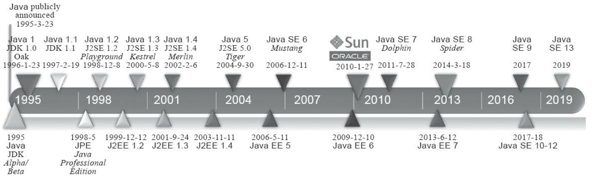

#### 2，实战：编译JDK

## 二，Java内存区域与内存溢出异常

#### 1，运行时数据区


- 程序计数器（`Program Counter Register`） 是一块较小的内存空间， 可以看作是当前线程所执行的字节码的行号指示器。   在 `Java` 虚拟机的概念模型里， **字节码解释器**工作时就是通过改变这个计数器的值来选取下一条需要执行的字节码指令， 它是程序控制流的指示器， 分支、 循环、 跳转、 异常处理、 线程恢复等基础功能都需要依赖这个计数器来完成。  

- `Java` 虚拟机栈（`Java Virtual Machine Stack`） 也是线程私有的， 它的生命周期与线程相同。 虚拟机栈描述的是 `Java` 方法执行的线程内存模型： 每个方法被执行的时候， `Java` 虚拟机都会同步创建一个栈帧（`Stack Frame`）用于存储局部变量表、 操作数栈、 动态连接、 方法出口等信息。  

> `Java` 虚拟机基本数据类型（`boolean`、`byte`、`char`、`short`、`int`、`float`、`long`、 `double`） 、 对象引用等数据类型在局部变量表中的存储空间以局部变量槽（`Slot`） 来表示， 其中64位长度的 `long` 和 `double` 类型的数据会占用两个变量槽， 其余的数据类型只占用一个。 局部变量表所需的内存空间在编译期间完成分配， 当进入一个方法时， 这个方法需要在栈帧中分配多大的局部变量空间是完全确定的， 在方法运行期间不会改变局部变量表的大小。   
>
> 在《Java虚拟机规范》 中， 对这个内存区域规定了两类异常状况： 
>
> > 如果线程请求的栈深度大于虚拟机所允许的深度， 将抛出 **StackOverflowError异常**；
> >
> > 如果 `Java` 虚拟机栈容量可以动态扩展，当栈扩展时无法申请到足够的内存会抛出 **OutOfMemoryError异常**。  

- 本地方法栈（`Native Method Stacks`） 与虚拟机栈所发挥的作用是非常相似的， 其区别只是虚拟机栈为虚拟机执行 `Java` 方法（也就是字节码） 服务， 而本地方法栈则是为虚拟机使用到的本地（`Native`）方法服务。  

- `Java`堆（`Java Heap`） 是虚拟机所管理的内存中最大的一块，是被所有线程共享的一块内存区域， 在虚拟机启动时创建。 此内存区域的唯一目的就是存放对象实例， `Java` 世界里“几乎”所有的对象实例都在这里分配内存。 在《`Java` 虚拟机规范》 中对 `Java` 堆的描述是：“==所有的对象实例以及数组都应当在**堆**上分配==”。   

- 方法区（`Method Area`） 与 `Java` 堆一样， 是各个线程共享的内存区域， 用于存储已被虚拟机加载的类型信息、 常量、 静态变量、 即时编译器编译后的代码缓存等数据。  

> 运行时常量池（`Runtime Constant Pool`） 是方法区的一部分。 `Class` 文件中除了有类的版本、 字段、 方法、 接口等描述信息外， 还有一项信息是常量池表（`Constant Pool Table`）， 用于存放编译期生成的各种字面量与符号引用， 这部分内容将在类加载后存放到方法区的运行时常量池中。  

#### 2，对象的创建

当 `Java` 虚拟机遇到一条字节码 `new` 指令时：

> 首先将去检查这个指令的参数是否能在常量池中定位到一个类的符号引用， 并且检查这个符号引用代表的类是否已被加载、 解析和初始化过；
>
> 在类加载检查通过后， 接下来虚拟机将为新生对象分配内存；
>
> > 假设`Java`堆中内存是绝对规整的， 所有被使用过的内存都被放在一边， 空闲的内存被放在另一边， 中间放着一个指针作为分界点的指示器， 那所分配内存就仅仅是把那个指针向空闲空间方向挪动一段与对象大小相等的距离， 这种分配方式称为“**指针碰撞**”（`Bump The Pointer`） 。  
> >
> > 如果`Java`堆中的内存并不是规整的， 已被使用的内存和空闲的内存相互交错在一起， 虚拟机就必须维护一个列表， 记录上哪些内存块是可用的， 在分配的时候从列表中找到一块足够大的空间划分给对象实例， 并更新列表上的记录， 这种分配方式称为“**空闲列表**”（`Free List`） 。  
> >
> > **注意**：
> >
> > 1）垃圾收集器是否带有空间压缩整理能力 –> `Java` 堆是否规整 –> 分配方式选择。
> >
> > 2）线程安全问题的解决方案：
> >
> > > i）对分配内存空间的动作进行同步处理——实际上虚拟机是采用`CAS` 配上失败重试的方式保证更新操作的原子性；  
> > >
> > > ii）把内存分配的动作按照线程划分在不同的空间之中进行， 即每个线程在 `Java` 堆中预先分配一小块内存， 称为 **本地线程分配缓冲**（`Thread Local Allocation Buffer`， `TLAB`） ， 哪个线程要分配内存， 就在哪个线程的本地缓冲区中分配， 只有本地缓冲区用完了， 分配新的缓存区时才需要同步锁定。 虚拟机是否使用`TLAB`， 可以通过 `-XX： +/-UseTLAB` 参数来设定。  
>
> 虚拟机必须将分配到的内存空间（但不包括对象头） 都初始化为零值， 如果使用了 `TLAB` 的话， 这一项工作也可以提前至 `TLAB` 分配时顺便进行；
>
> 接着，`Java` 虚拟机还要对对象进行必要的设置， 例如这个对象是哪个类的实例、 如何才能找到类的元数据信息、 对象的哈希码（实际上对象的哈希码会延后到真正调用 `Object::hashCode()` 方法时才计算） 、 对象的 `GC`分代年龄等信息；
>
> 最后，完成如上工作之后，从虚拟机的视角来看，一个新的对象已经产生了，但从 `Java` 程序的视角来看，对象创建才刚开始，`<init>` 方法还没有执行，所有的字段都还为零。所以一般来说，执行 `new` 指令之后会接着执行 `<init>` 方法，把对象按照程序员的意愿进行初始化，这样一个真正可用的对象才算完全产生出来。

#### 3，对象的内存布局

在 `HotSpot` 虚拟机里， 对象在堆内存中的存储布局可以划分为三个部分： 对象头（`Header`） 、 实例数据（`Instance Data`） 和对齐填充（`Padding`） 。  

`HotSpot` 虚拟机对象的对象头包括：

> 1）用于存储对象自身的运行时数据， 如哈希码（`HashCode`） 、`GC`分代年龄、 锁状态标志、 线程持有的锁、 偏向线程`ID`、 偏向时间戳等， 这部分数据的长度在32位和64位的虚拟机（未开启压缩指针） 中分别为32个比特和64个比特， 官方称它为“``Mark Word`”。   
>
> 2）类型指针， 即对象指向它的类型元数据的指针，`Java` 虚拟机通过这个指针来确定该对象是哪个类的实例。   

`HotSpot` 虚拟机对象头 `Mark Word`  如下图所示：


`HotSpot` 虚拟机对象的实例数据是对象真正存储的有效信息， 即在程序代码里面所定义的各种类型的字段内容， 无论是从父类继承下来的， 还是在子类中定义的字段都必须记录起来。 这部分的存储顺序会受到虚拟机分配策略参数（`-XX： FieldsAllocationStyle` 参数） 和字段在 `Java` 源码中定义顺序的影响。`HotSpot` 虚拟机默认的分配顺序为 `longs/doubles`、`ints`、`horts/chars`、 `bytes/booleans`、 `oops`（`Ordinary Object Pointers`，`OOPs`）。

`HotSpot` 虚拟机对象的对齐填充， 这并不是必然存在的， 也没有特别的含义， 它仅仅起着占位符的作用。  

#### 4， 对象的访问定位

`Java` 程序会通过栈上的 `reference` 数据来操作堆上的具体对象。 由于 `reference` 类型在《Java虚拟机规范》 里面只规定了它是一个指向对象的引用， 并没有定义这个引用应该通过什么方式去定位、 访问到堆中对象的具体位置， 所以对象访问方式也是由虚拟机实现而定的， 主流的访问方式主要有：  

> 使用句柄访问，`Java` 堆中将可能会划分出一块内存来作为句柄池， `reference` 中存储的就是对象的句柄地址， 而句柄中包含了对象实例数据与类型数据各自具体的地址信息。其优点在于：`reference` 中存储的是稳定句柄地址， 在对象被移动（垃圾收集时移动对象是非常普遍的行为） 时只会改变句柄中的实例数据指针， 而 `reference` 本身不需要被修改。
>
> 使用直接指针访问，`Java` 堆中对象的内存布局就必须考虑如何放置访问类型数据的相关信息， `reference` 中存储的直接就是对象地址， 如果只是访问对象本身的话， 就不需要多一次间接访问的开销。其优点在于：速度更快， 它节省了一次指针定位的时间开销， 由于对象访问在 `Java` 中非常频繁， 因此这类开销积少成多也是一项极为可观的执行成本。

通过句柄访问对象，如下图所示：

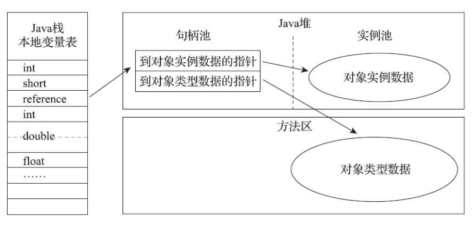

通过直接指针访问对象，如下图所示：


#### 5，实战：OutOfMemoryError异常  

- 代码清单2-1 `Java` 堆内存溢出异常测试

```java
package com.algorithm;

import java.util.ArrayList;
import java.util.List;

/**
 * 堆内存溢出异常测试
 * VM Args： -Xms20m -Xmx20m -XX:+HeapDumpOnOutOfMemoryError
 *
 * @author zhangbc
 * @version 1.0.0
 * @date 2020/7/12 17:25
 **/
public class HeapOOM {

    static class OOMObject {

    }

    public static void main(String[] args) {
        List<OOMObject> objectList = new ArrayList<>();
        while (true) {
            objectList.add(new OOMObject());
        }
    }
}
```

运行结果：

```bash
java.lang.OutOfMemoryError: Java heap space
Dumping heap to java_pid728.hprof ...
Heap dump file created [28418149 bytes in 0.099 secs]
Exception in thread "main" java.lang.OutOfMemoryError: Java heap space
	at java.util.Arrays.copyOf(Arrays.java:3210)
	at java.util.Arrays.copyOf(Arrays.java:3181)
	at java.util.ArrayList.grow(ArrayList.java:265)
	at java.util.ArrayList.ensureExplicitCapacity(ArrayList.java:239)
	at java.util.ArrayList.ensureCapacityInternal(ArrayList.java:231)
	at java.util.ArrayList.add(ArrayList.java:462)
	at com.algorithm.HeapOOM.main(HeapOOM.java:22)
```

- 代码清单2-2 虚拟机栈和本地方法栈测试（使用 `-Xss` 参数减少栈内存容量）  

```java
package com.jvm;

/**
 * 虚拟机栈和本地方法栈测试(使用 `-Xss` 参数减少栈内存容量)
 * VM Args： -Xss128k
 *
 * @author zhangbc
 * @version 1.0.0
 * @date 2020/7/12 17:47
 **/
public class JavaVMStackSOF {

    private int stackLength = 1;

    public void stackLeak() {
        stackLength++;
        stackLeak();
    }

    public static void main(String[] args) {
        JavaVMStackSOF stackSOF = new JavaVMStackSOF();
        try {
            stackSOF.stackLeak();
        } catch (Throwable e) {
            System.out.println("Stack length: " + stackSOF.stackLength);
            throw e;
        }
    }
}
```

运行结果：

```java
Stack length: 996
Exception in thread "main" java.lang.StackOverflowError
	at com.jvm.JavaVMStackSOF.stackLeak(JavaVMStackSOF.java:16)
	at com.jvm.JavaVMStackSOF.stackLeak(JavaVMStackSOF.java:17)
    .............
```

- 代码清单2-3 虚拟机栈和本地方法栈测试（定义大量的本地变量，增大此方法帧中本地变量表的长度）  

```java
package com.jvm;

/**
 * 虚拟机栈和本地方法栈测试(定义大量的本地变量，增大此方法帧中本地变量表的长度)
 *
 * @author zhangbc
 * @version 1.0.0
 * @date 2020/7/12 18:01
 **/
public class JavaVMStackSOFNative {

    private static int stackLength = 0;

    public static void test() {
        long unused1, unused2, unused3, unused4, unused5, unused6, unused7, unused8, unused9, unused10,
                unused11, unused12, unused13, unused14, unused15, unused16, unused17, unused18, unused19, unused20,
                unused21, unused22, unused23, unused24, unused25, unused26, unused27, unused28, unused29, unused30,
                unused31, unused32, unused33, unused34, unused35, unused36, unused37, unused38, unused39, unused40,
                unused41, unused42, unused43, unused44, unused45, unused46, unused47, unused48, unused49, unused50,
                unused51, unused52, unused53, unused54, unused55, unused56, unused57, unused58, unused59, unused60,
                unused61, unused62, unused63, unused64, unused65, unused66, unused67, unused68, unused69, unused70,
                unused71, unused72, unused73, unused74, unused75, unused76, unused77, unused78, unused79, unused80,
                unused81, unused82, unused83, unused84, unused85, unused86, unused87, unused88, unused89, unused90,
                unused91, unused92, unused93, unused94, unused95, unused96, unused97, unused98, unused99, unused100;
        stackLength++;
        test();
        unused1 = unused2 = unused3 = unused4 = unused5 = unused6 = unused7 = unused8 = unused9 = unused10
                = unused11 = unused12 = unused13 = unused14 = unused15 = unused16 = unused17 = unused18 = unused19
                = unused20 = unused21 = unused22 = unused23 = unused24 = unused25 = unused26 = unused27 = unused28
                = unused29 = unused30 = unused31 = unused32 = unused33 = unused34 = unused35 = unused36 = unused37
                = unused38 = unused39 = unused40 = unused41 = unused42 = unused43 = unused44 = unused45 = unused46
                = unused47 = unused48 = unused49 = unused50 = unused51 = unused52 = unused53 = unused54 = unused55
                = unused56 = unused57 = unused58 = unused59 = unused60 = unused61 = unused62 = unused63 = unused64
                = unused65 = unused66 = unused67 = unused68 = unused69 = unused70 = unused71 = unused72 = unused73
                = unused74 = unused75 = unused76 = unused77 = unused78 = unused79 = unused80 = unused81 = unused82
                = unused83 = unused84 = unused85 = unused86 = unused87 = unused88 = unused89 = unused90 = unused91
                = unused92 = unused93 = unused94 = unused95 = unused96 = unused97 = unused98 = unused99 = unused100 = 0;
    }

    public static void main(String[] args) {
        try {
            test();
        } catch (Error e) {
            System.out.println("Stack length: " + stackLength);
            throw e;
        }
    }
}
```

运行结果：

```bash
Stack length: 7478
Exception in thread "main" java.lang.StackOverflowError
	at com.jvm.JavaVMStavckSOFNative.test(JavaVMStavckSOFNative.java:26)
	at com.jvm.JavaVMStavckSOFNative.test(JavaVMStavckSOFNative.java:26)
	................
```

- 代码清单2-4  创建线程导致内存溢出异常

```java
package com.jvm;

/**
 * 创建线程导致内存溢出异常
 * VM Args： -Xss2M
 *
 * @author zhangbc
 * @version 1.0.0
 * @date 2020/7/19 13:46
 **/
public class JavaVMStackOOM {

    private void dontStop() {
        while (true) {

        }
    }

    public void stackLeakByThread() {
        while (true) {
            Thread thread = new Thread(new Runnable() {
                @Override
                public void run() {
                    dontStop();
                }
            });
            thread.start();
        }
    }
}
```

- 代码清单2-5 运行时常量池导致的内存溢出异常

```java
package com.jvm;

import java.util.HashSet;
import java.util.Set;

/**
 * 运行时常量池导致的内存溢出异常
 * VM Args： -XX:PermSize=6M -XX:MaxPermSize=6M (jdk1.6)
 * VM Args： -Xms6M (> jdk1.6)
 * String::intern()是一个本地方法， 作用是如果字符串常量池中已经包含一个等于此String对象的字符串， 
 * 则返回代表池中这个字符串的String对象的引用； 否则， 会将此String对象包含的字符串添加到常量池中， 
 * 并且返回此String对象的引用。 
 *
 * @author zhangbc
 * @version 1.0.0
 * @date 2020/7/19 14:09
 **/
public class RuntimeConstantPoolOOM {

    public static void main(String[] args) {
        Set<String> set = new HashSet<>(16);
        short i = 0;
        while (true) {
            set.add(String.valueOf(i++).intern());
        }
    }
}
```

运行结果：

```bash
Exception in thread "main" java.lang.OutOfMemoryError: GC overhead limit exceeded
	at java.lang.Integer.toString(Integer.java:401)
	at java.lang.String.valueOf(String.java:3099)
	at com.jvm.RuntimeConstantPoolOOM.main(RuntimeConstantPoolOOM.java:24)
```


- 代码清单2-6  `String.intern()`返回引用的测试

```java
package com.jvm;


/**
 * String.intern()返回引用的测试
 * 在JDK6中运行，会得到两个false，而在JDK7中运行，会得到一个true和一个false。
 * 产生差异的原因是：
 * 在JDK6中， intern()方法会把首次遇到的字符串实例复制到永久代的字符串常量池中存储，
 * 返回的也是永久代里面这个字符串实例的引用，而由StringBuilder创建的字符串对象实例
 * 在Java堆上， 所以必然不可能是同一个引用， 结果将返回false。
 * JDK7的intern()方法实现不需要再拷贝字符串的实例到永久代，既然字符串常量池已经移到Java堆中，
 * 那只需要在常量池里记录一下首次出现的实例引用即可，因此intern()返回的引用和由StringBuilder
 * 创建的那个字符串实例就是同一个。 而对str2比较返回false，这是因为“java”这个字符串在执行
 * String-Builder.toString()之前就已经出现过，字符串常量池中已经有它的引用，不符合intern()
 * 方法要求“首次遇到”的原则， “计算机软件”这个字符串则是首次出现的，因此结果返回true。
 *
 * @author zhangbc
 * @version 1.0.0
 * @date 2020/7/19 14:09
 **/
public class RuntimeConstantPoolOOMTest {

    public static void main(String[] args) {
        String s1 = new StringBuilder("计算机").append("软件").toString();
        System.out.println(s1.intern() == s1);

        String s2 = new StringBuilder("ja").append("va").toString();
        System.out.println(s2.intern() == s2);
    }
}
```

- 代码清单2-7 借助CGLib使得方法区出现内存溢出异常

```java
package com.jvm;

import org.springframework.cglib.proxy.Enhancer;
import org.springframework.cglib.proxy.MethodInterceptor;
import org.springframework.cglib.proxy.MethodProxy;

import java.lang.reflect.Method;

/**
 * 借助CGLib使得方法区出现内存溢出异常(jdk1.7)
 * VM Args： -XX:PermSize=10M -XX:MaxPermSize=10M
 *
 * @author zhangbc
 * @version 1.0.0
 * @date 2020/7/19 18:09
 **/
public class JavaMethodAreaOOM {
    public static void main(String[] args) {
        while (true) {
            Enhancer enhancer = new Enhancer();
            enhancer.setSuperclass(OOMObject.class);
            enhancer.setUseCache(false);
            enhancer.setCallback(new MethodInterceptor() {
                @Override
                public Object intercept(Object o, Method method, Object[] objects,
                                        MethodProxy methodProxy) throws Throwable {
                    return methodProxy.invokeSuper(o, objects);
                }
            });

            enhancer.create();
        }
    }

    static class OOMObject {

    }
}
```

- 代码清单2-8  使用 `unsafe` 分配本机内存  

```java
package com.jvm;

import sun.misc.Unsafe;

import java.lang.reflect.Field;

/**
 * 使用unsafe分配本机内存
 * VM Args： -Xmx20M -XX:MaxDirectMemorySize=10M
 *
 * @author zhangbc
 * @version 1.0.0
 * @date 2020/7/19 18:20
 **/
public class DirectMemoryOOM {

    private static final int _1MB = 1024 * 1024;

    public static void main(String[] args) throws Exception {
        Field unsafeField = Unsafe.class.getDeclaredFields()[0];
        unsafeField.setAccessible(true);
        Unsafe unsafe = (Unsafe) unsafeField.get(null);
        while (true) {
            unsafe.allocateMemory(_1MB);
        }
    }
}
```

运行结果：

```bash
Exception in thread "main" java.lang.OutOfMemoryError
	at sun.misc.Unsafe.allocateMemory(Native Method)
	at com.jvm.DirectMemoryOOM.main(DirectMemoryOOM.java:24)
```

## 三，垃圾收集器与内存分配策略

#### 1，引用计数算法

- 代码清单3-1  引用计数算法的缺陷

```java
package com.jvm;

/**
 * 引用计数算法的缺陷
 * 问题：testGC()方法执行后，objA和objB会不会被GC呢？
 * VM Args：-verbose:gc -Xms20m -Xmx20m -Xmn10m -XX:+PrintGCDetails -XX:SurvivorRatio=8
 *
 * @author zhangbc
 * @version 1.0.0
 * @date 2020/7/19 18:39
 **/
public class ReferenceCountingGC {

    private Object instance = null;
    private static final int _1MB = 1024 * 1024;
    /**
     * 占内存，以便能在GC日志中看清是否回收过
     */
    private byte[] bigSize = new byte[2 * _1MB];

    public static void testGC() {
        ReferenceCountingGC objA = new ReferenceCountingGC();
        ReferenceCountingGC objB = new ReferenceCountingGC();
        objA.instance = objB;
        objB.instance = objA;

        objA = null;
        objB = null;

        System.gc();
    }

    public static void main(String[] args) {
        testGC();
    }
}
```

运行结果：

```bash
[GC (System.gc()) [PSYoungGen: 6757K->1002K(9216K)] 6757K->1010K(19456K), 0.0011649 secs] [Times: user=0.00 sys=0.00, real=0.00 secs] 
[Full GC (System.gc()) [PSYoungGen: 1002K->0K(9216K)] [ParOldGen: 8K->889K(10240K)] 1010K->889K(19456K), [Metaspace: 3249K->3249K(1056768K)], 0.0046353 secs] [Times: user=0.02 sys=0.00, real=0.00 secs] 
Heap
 PSYoungGen      total 9216K, used 166K [0x00000000ff600000, 0x0000000100000000, 0x0000000100000000)
  eden space 8192K, 2% used [0x00000000ff600000,0x00000000ff629900,0x00000000ffe00000)
  from space 1024K, 0% used [0x00000000ffe00000,0x00000000ffe00000,0x00000000fff00000)
  to   space 1024K, 0% used [0x00000000fff00000,0x00000000fff00000,0x0000000100000000)
 ParOldGen       total 10240K, used 889K [0x00000000fec00000, 0x00000000ff600000, 0x00000000ff600000)
  object space 10240K, 8% used [0x00000000fec00000,0x00000000fecde718,0x00000000ff600000)
 Metaspace       used 3261K, capacity 4496K, committed 4864K, reserved 1056768K
  class space    used 350K, capacity 388K, committed 512K, reserved 1048576K
```

结果分析：从运行结果中可以清楚看到内存回收日志中包含 “1002K->0K”， 意味着虚拟机并没有因为这两个对象互相引用就放弃回收它们， 这也从侧面说明了`Java` 虚拟机并不是通过引用计数算法来判断对象是否存活的。  

#### 2，可达性分析算法

基本思路：通过一系列称为“`GC Roots`”的根对象作为起始节点集， 从这些节点开始， 根据引用关系向下搜索， 搜索过程所走过的路径称为“**引用链**”（`Reference Chain`） ， 如果某个对象到 `GC Roots` 间没有任何引用链相连，或者用图论的话来说就是从 `GC Roots` 到这个对象不可达时， 则证明此对象是不可能再被使用的。  

在 `Java` 技术体系中， 固定可作为 `GC Roots` 的对象包括：

> 1）在虚拟机栈（栈帧中的本地变量表） 中引用的对象， 如各个线程被调用的方法堆栈中使用到的参数、 局部变量、 临时变量等；
>
> 2）在方法区中类静态属性引用的对象， 如 `Java` 类的引用类型静态变量；
>
> 3）在方法区中常量引用的对象，如字符串常量池（`String Table`） 里的引用；
>
> 4）在本地方法栈中 `JNI`（即通常所说的`Native`方法） 引用的对象；
>
> 5）`Java` 虚拟机内部的引用，如基本数据类型对应的 `Class` 对象，一些常驻的异常对象（如 `NullPointExcepiton`、 `OutOfMemoryError`） 等， 还有系统类加载器；
>
> 6）所有被同步锁（`synchronized`关键字） 持有的对象；
>
> 7）反映`Java`虚拟机内部情况的 `JMXBean`、 `JVMTI` 中注册的回调、本地代码缓存等；
>
> 8）根据用户所选用的垃圾收集器以及当前回收的内存区域不同， 还可以有其他对象“临时性”地加入， 共同构成完整 `GC Roots` 集合。  

在 `JDK 1.2` 版之后，`Java` 对引用的概念进行了扩充，将引用分为**强引用**（`Strongly Re-ference`）、**软引用**（`Soft Reference`）、**弱引用**（`Weak Reference`）和**虚引用**（`Phantom Reference`），引用强度依次逐渐减弱。  

> **强引用**（`Strongly Re-ference`）：指在程序代码之中普遍存在的引用赋值， 即类似“ `Object obj = new Object()`”这种引用关系。无论任何情况下，只要强引用关系还存在， 垃圾收集器就永远不会回收掉被引用的对象。  
>
> **软引用**（`Soft Reference`）：描述一些还有用， 但非必须的对象。 只被软引用关联着的对象， 在系统将要发生内存溢出异常前， 会把这些对象列进回收范围之中进行第二次回收， 如果这次回收还没有足够的内存，才会抛出内存溢出异常。   
>
> **弱引用**（`Weak Reference`）：描述那些非必须对象， 但是它的强度比软引用更弱一些， 被弱引用关联的对象只能生存到下一次垃圾收集发生为止。 当垃圾收集器开始工作， 无论当前内存是否足够， 都会回收掉只被弱引用关联的对象。   
>
> **虚引用**（`Phantom Reference`）：也称为“幽灵引用”或者“幻影引用”， 它是最弱的一种引用关系。 一个对象是否有虚引用的存在， 完全不会对其生存时间构成影响， 也无法通过虚引用来取得一个对象实例。  

- 代码清单3-2  一次对象自我拯救演示

```java
package com.jvm;

/**
 * 一次对象自我拯救的演示：
 *                     1）对象可以在被GC时自我拯救；
 *                     2）这种自救的机会只有一次， 因为一个对象的finalize()方法最多只会被系统自动调用一次
 *
 * @author zhangbc
 * @version 1.0.0
 * @date 2020/8/8 15:22
 **/
public class FinalizeEscapeGC {
    
    public static FinalizeEscapeGC saveHook = null;
    
    public void isAlive() {
        System.out.println("Yes, I am still alive.");
    }

    @Override
    protected void finalize() throws Throwable {
        super.finalize();
        System.out.println("Finalize method executed.");
        FinalizeEscapeGC.saveHook = this;
    }

    public static void main(String[] args) throws Throwable {
        
        saveHook = new FinalizeEscapeGC();
        saveHook = null;
        System.gc();
        // 因为Finalizer方法的优先级很低，暂停0.5s等待。
        Thread.sleep(500);
        
        if (saveHook != null) {
            saveHook.isAlive();
        } else {
            System.out.println("No, I am dead(first).");
        }

        saveHook = null;
        System.gc();
        // 因为Finalizer方法的优先级很低，暂停0.5s等待。
        Thread.sleep(500);

        if (saveHook != null) {
            saveHook.isAlive();
        } else {
            System.out.println("No, I am dead(second).");
        }
    }
}
```

运行结果：

```bash
Finalize method executed.
Yes, I am still alive.
No, I am dead(second).
```

#### 3，回收方法区

方法区的垃圾收集主要回收：**废弃的常量**和**不再使用的类型**。   

判定一个类型是否属于“不再被使用的类”，需要同时满足下面三个条件：

> 1）该类所有的实例都已经被回收， 也就是 `Java` 堆中不存在该类及其任何派生子类的实例；
>
> 2）加载该类的类加载器已经被回收， 这个条件除非是经过精心设计的可替换类加载器的场景， 如 `OSGi`、`JSP` 的重加载等，否则通常是很难达成的；
>
> 3）该类对应的 `java.lang.Class` 对象没有在任何地方被引用，无法在任何地方通过反射访问该类的方法。  

#### 4，垃圾收集算法

从如何判定对象消亡的角度出发， 垃圾收集算法可以划分为“**引用计数式垃圾收集**”（`Reference Counting GC`）和“**追踪式垃圾收集**”（`Tracing GC`）两大类，这两类也常被称作“**直接垃圾收集**”和“**间接垃圾收集**”。  

###### 1，分代收集理论

分代收集名为理论， **实质**是一套符合大多数程序运行实际情况的经验法则， 其基础是两个**分代假说**：

> 1）**弱分代假说**（`Weak Generational Hypothesis`）：绝大多数对象都是朝生夕灭的；
>
> 2）**强分代假说**（`Strong Generational Hypothesis`）：熬过越多次垃圾收集过程的对象就越难以消亡；
>
> > 1）& 2）**推论**：存在互相引用关系的两个对象， 是应该倾向于同时生存或者同时消亡的。   
>
> 3）**跨代引用假说**（`Intergenerational Reference Hypothesis`）：跨代引用相对于同代引用来说仅占极少数。  

这两个分代假说共同奠定了多款常用的垃圾收集器的一致的**设计原则**：收集器应该将 `Java` 堆划分出不同的区域， 然后将回收对象依据其年龄（年龄即对象熬过垃圾收集过程的次数） 分配到不同的区域之中存储。  

**收集器（GC）** 统一定义：

> **部分收集**（`Partial GC`）：指目标不是完整收集整个 `Java` 堆的垃圾收集，其中又分为：
>
> > **新生代收集**（ `Minor GC/Young GC`）：指目标只是新生代的垃圾收集；
> >
> > **老年代收集**（ `Major GC/Old GC`）：指目标只是老年代的垃圾收集。目前只有 `CMS` 收集器会有单
> > 独收集老年代的行为；
> >
> > **混合收集**（ `Mixed GC`）：指目标是收集整个新生代以及部分老年代的垃圾收集。目前只有 `G1` 收
> > 集器会有这种行为。
>
> **整堆收集**（ `Full GC` ）：收集整个 `Java` 堆和方法区的垃圾收集。  

###### 2，标记-清除算法

最早出现也是最基础的垃圾收集算法是“**标记-清除**”（`Mark-Sweep`）算法， 在1960年由 `Lisp` 之父 `John McCarthy` 所提出。 算法分为“**标记**”和“**清除**”两个阶段：

> 首先标记出所有需要回收的对象（或者存活的对象）；
>
> 在标记完成后， 统一回收掉所有被标记的对象（或者所有未被标记的对象）。

其主要缺点：

> 1）是执行效率不稳定，如果 `Java` 堆中包含大量对象，而且其中大部分是需要被回收的， 这时必须进行大量标记和清除的动作， 导致标记和清除两个过程的执行效率都随对象数量增长而降低； 
> 
>2）是内存空间的碎片化问题， 标记、清除之后会产生大量不连续的内存碎片， 空间碎片太多可能会导致当以后在程序运行过程中需要分配较大对象时无法找到足够的连续内存而不得不提前触发另一次垃圾收集动作。  

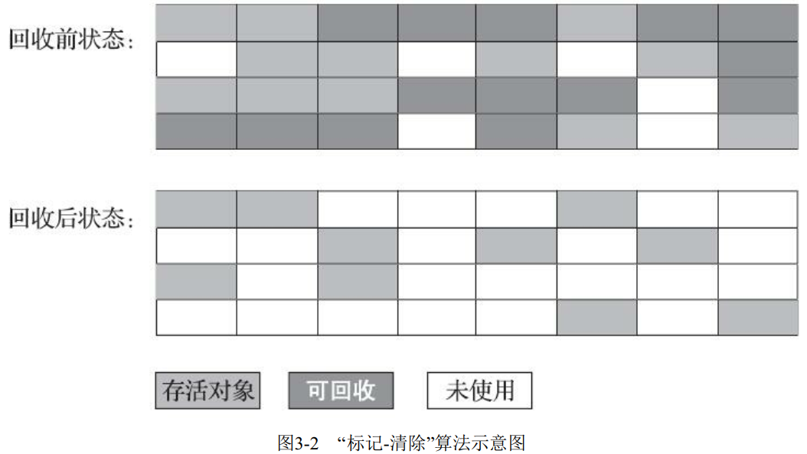

###### 3，标记-复制算法

为了解决标记-清除算法面对大量可回收对象时**执行效率低**的问题， 1969年 `Fenichel` 提出了一种称为“**半区复制**”（`Semispace Copying`）的垃圾收集算法，它将可用内存按容量划分为大小相等的两块，每次只使用其中的一块，当这一块的内存用完了， 就将还存活着的对象复制到另外一块上面， 然后再把已使用过的内存空间**一次清理掉**。 如果内存中多数对象都是存活的， 这种算法将会产生**大量的内存间复制的开销**， 但对于多数对象都是可回收的情况， 算法需要复制的就是占少数的存活对象， 而且每次都是针对整个半区进行内存回收， 分配内存时也就不用考虑有空间碎片的复杂情况， 只要移动堆顶指针， 按顺序分配即可。 

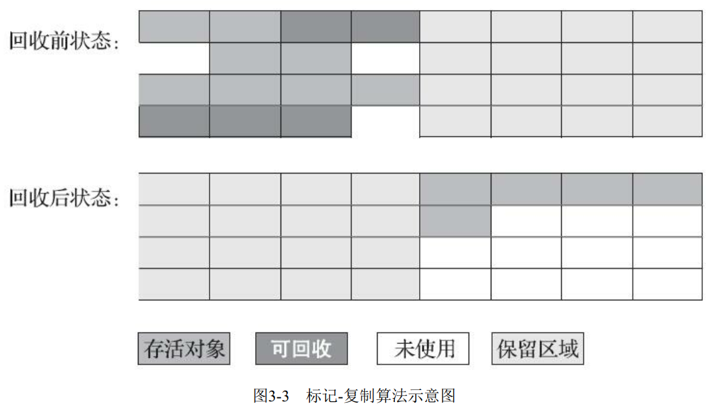

在1989年，`Andrew Appel` 针对具备“**朝生夕灭**”特点的对象， 提出了一种更优化的半区复制分代策略， 现在称为“**`Appel`式回收**”。具体做法是把新生代分为一块较大的 `Eden` 空间和两块较小的 `Survivor` 空间， 每次分配内存只使用 `Eden` 和其中一块 `Survivor`，发生垃圾搜集时， 将 `Eden` 和 `Survivor` 中仍然存活的对象一次性复制到另外一块 `Survivor` 空间上， 然后直接清理掉 `Eden` 和已用过的那块 `Survivor` 空间。`HotSpot` 虚拟机默认 `Eden` 和 `Survivor` 的大小比例是 8∶ 1，即每次新生代中可用内存空间为整个新生代容量的90%（`Eden`的80%加上一个`Survivor`的10%），只有一个 `Survivor` 空间，即10%的新生代是会被“浪费”的。 

###### 4，标记-整理算法

针对老年代对象的存亡特征，1974年 `Edward Lueders` 提出了另外一种有针对性的“**标记-整理**”（`Mark-Compact`） 算法， 其中的标记过程仍然与“标记-清除”算法一样， 但后续步骤不是直接对可回收对象进行清理， 而是让所有存活的对象都向内存空间一端移动， 然后直接清理掉边界以外的内存。与**标记-清除**算法**本质区别**在于它是一种移动式的回收算法，是否移动回收后的存活对象是一项优缺点并存的风险决策：

> 如果移动存活对象，尤其是在老年代这种每次回收都有大量对象存活区域， 移动存活对象并更新所有引用这些对象的地方将会是一种极为负重的操作， 而且这种对象移动操作必须全程暂停用户应用程序才能进行，这就更加让使用者权衡其弊端，像这样的停顿被最初的虚拟机设计者形象地描述为“ `Stop The World`”；（**内存回收复杂**）
>
> 如果跟标记-清除算法那样完全不考虑移动和整理存活对象的话，弥散于堆中的存活对象导致的空间碎片化问题就只能依赖更为复杂的内存分配器和内存访问器来解决。 譬如通过“分区空闲分配链表”来解决内存分配问题（计算机硬盘存储大文件就不要求物理连续的磁盘空间， 能够在碎片化的硬盘上存储和访问就是通过硬盘分区表实现的） 。 内存的访问是用户程序最频繁的操作，假如在这个环节上增加了额外的负担， 势必会直接影响应用程序的吞吐量。  （**内存分配复杂**）


#### 5，HotSpot的算法细节实现

1）**枚举根节点**

所有收集器在根节点枚举这一步骤时都是必须暂停用户线程的，即使是号称停顿时间可控， 或者（几乎） 不会发生停顿的 `CMS`、`G1`、`ZGC` 等收集器， 枚举根节点时也是必须要停顿的。  

2）**安全点**

在 `OopMap` 的协助下，`HotSpot` 可以快速准确地完成 `GC Roots` 枚举，但可能导致引用关系变化，或者说导致 `OopMap` 内容变化的指令非常多， 如果为每一条指令都生成对应的 `OopMap`，那将会需要大量的额外存储空间，这样垃圾收集伴随而来的空间成本就会变得无法忍受的高昂。  

实际上，`HotSpot` 的确没有为每条指令都生成 `OopMap`，只是在“特定的位置”记录了这些信息， 这些位置被称为**安全点**（`Safepoint`）。  

**安全点位置的选取**基本上是以“是否具有让程序长时间执行的特征”为标准进行选定的， 因为每条指令执行的时间都非常短暂， 程序不太可能因为指令流长度太长这样的原因而长时间执行， “长时间执行”的**最明显特征**就是指令序列的复用， 例如方法调用、 循环跳转、 异常跳转等都属于指令序列复用， 所以只有具有这些功能的指令才会产生安全点。  

如何在垃圾收集发生时让所有线程（这里其实不包括执行 `JNI` 调用的线程）都跑到最近的安全点，然后停顿下来。这里有两种选择方案：

> **抢先式中断**（`Preemptive Suspension`） ：不需要线程的执行代码主动去配合， 在垃圾收集发生时， 系统首先把所有用户线程全部中断， 如果发现有用户线程中断的地方不在安全点上， 就恢复这条线程执行， 让它一会再重新中断， 直到跑到安全点上。 现在几乎没有虚拟机实现采用抢先式中断来暂停线程响应 `GC` 事件。
>
>  **主动式中断**（`Voluntary Suspension`）：其思想是当垃圾收集需要中断线程的时候， 不直接对线程操作， 仅仅简单地设置一个标志位， 各个线程执行过程时会不停地主动去轮询这个标志， 一旦发现中断标志为真时就自己在最近的安全点上主动中断挂起。 轮询标志的地方和安全点是重合的， 另外还要加上所有创建对象和其他需要在 `Java` 堆上分配内存的地方，这是为了检查是否即将要发生垃圾收集，避免没有足够内存分配新对象。由于轮询操作在代码中会频繁出现， 这要求它必须足够高效。 `HotSpot` 使用内存保护陷阱的方式，把轮询操作精简至只有一条汇编指令的程度。 

安全点机制保证了程序执行时， 在不太长的时间内就会遇到可进入垃圾收集过程的安全点。  

3）**安全区域**

**程序不执行**：指没分配处理器时间， 典型的场景便是用户线程处于 `Sleep` 状态或者 `Blocked` 状态，这时候线程无法响应虚拟机的中断请求， 不能再走到安全的地方去中断挂起自己， 虚拟机也显然不可能持续等待线程重新被激活分配处理器时间。 对于这种情况， 就必须引入**安全区域**（`Safe Region`） 来解决。

**安全区域**是指能够确保在某一段代码片段之中， 引用关系不会发生变化， 因此， 在这个区域中任意地方开始垃圾收集都是安全的。  

4）**记忆集与卡表**

**记忆集**（`Remembered Set `）是一种用于记录从非收集区域指向收集区域的指针集合的抽象数据结构。   

```java
Class RememberedSet {
	Object[] set[OBJECT_INTERGENERATIONAL_REFERENCE_SIZE];
}
```

可供选择的**记录精度**如下：

> **字长精度**：每个记录精确到一个机器字长（就是处理器的寻址位数，如常见的32位或64位，这个精度决定了机器访问物理内存地址的指针长度），该字包含跨代指针；
>
> **对象精度**：每个记录精确到一个对象， 该对象里有字段含有跨代指针；
>
> **卡精度**：每个记录精确到一块内存区域，该区域内有对象含有跨代指针。  

**卡表**：是记忆集的一种具体实现，定义了记忆集的记录精度、与堆内存的映射关系等。

```java
CARD_TABLE [this address >> 9] = 0;
```

字节数组 `CARD_TABLE` 的每一个元素都对应着其标识的内存区域中一块特定大小的内存块，这个内存块被称作“**卡页**”（`Card Page`）。一般来说， 卡页大小都是以2的 `N` 次幂的字节数， 通过上面代码可以看出 `HotSpot` 中使用的卡页是2的9次幂， 即512字节（地址右移9位， 相当于用地址除以512） 。  

一个卡页的内存中通常包含不止一个对象， 只要卡页内有一个（或更多） 对象的字段存在着跨代指针， 那就将对应卡表的数组元素的值标识为1，称为这个元素**变脏**（`Dirty`），没有则标识为0。   

5）**写屏障**

在 `HotSpot` 虚拟机里是通过**写屏障**（`Write Barrier`）技术维护卡表状态的。   

**写屏障**可以看作在虚拟机层面对“引用类型字段赋值”这个动作的 `AOP` 切面，在引用对象赋值时会产生一个环形（`Around`） 通知， 供程序执行额外的动作， 也就是说赋值的前后都在写屏障的覆盖范畴内。在赋值前的部分的写屏障叫作**写前屏障**（`Pre-Write Barrier`），在赋值后的则叫作**写后屏障**（`Post-Write Barrier`） 。   

```c++
/** 写后屏障更新卡表 **/
void oop_field_store(oop* field, oop new_value) {
	// 引用字段赋值操作
	*field = new_value;
	// 写后屏障， 在这里完成卡表状态更新
	post_write_barrier(field, new_value);
}
```

除了写屏障的开销外， 卡表在高并发场景下还面临着“**伪共享**”（`False Sharing`）问题。

**伪共享**是处理并发底层细节时一种经常需要考虑的问题，现代中央处理器的缓存系统中是以缓存行（`Cache Line`）为单位存储的， 当多线程修改互相独立的变量时， 如果这些变量恰好共享同一个缓存行， 就会彼此影响（写回、 无效化或者同步） 而导致性能降低， 这就是**伪共享问题**。  

为了避免伪共享问题， 一种简单的**解决方案**是不采用无条件的写屏障， 而是先检查卡表标记， 只有当该卡表元素未被标记过时才将其标记为变脏。

```java
if (CARD_TABLE [this address >> 9] != 0)
	CARD_TABLE [this address >> 9] = 0;
```

在 `JDK 7` 之后， `HotSpot` 虚拟机增加了一个新的参数 ``-XX： +UseCondCardMark`， 用来决定是否开启卡表更新的条件判断。   

6）并发的可达性分析

**三色标记**（`Tri-color Marking`）  ： 

> **白色**：表示对象尚未被垃圾收集器访问过。显然在可达性分析刚刚开始的阶段， 所有的对象都是白色的， 若在分析结束的阶段， 仍然是白色的对象， 即代表不可达。
>
> **黑色**：表示对象已经被垃圾收集器访问过， 且这个对象的所有引用都已经扫描过。黑色的对象代表已经扫描过， 它是安全存活的， 如果有其他对象引用指向了黑色对象， 无须重新扫描一遍。 黑色对象不可能直接（不经过灰色对象） 指向某个白色对象；
>
> **灰色**： 表示对象已经被垃圾收集器访问过， 但这个对象上至少存在一个引用还没有被扫描过。  


`Wilson` 于1994年在理论上证明：当且仅当以下两个条件同时满足时， 会产生“对象消失”的问题， 即原本应该是黑色的对象被误标为白色：

> 赋值器插入了一条或多条从黑色对象到白色对象的新引用；
>
> 赋值器删除了全部从灰色对象到该白色对象的直接或间接引用。

解决方案：

> **增量更新**（`Incremental Update`）：要破坏的是第一个条件， 当黑色对象插入新的指向白色对象的引用关系时，就将这个新插入的引用记录下来， 等并发扫描结束之后， 再将这些记录过的引用关系中的黑色对象为根， 重新扫描一次。 可以简化理解为， 黑色对象一旦新插入了指向白色对象的引用之后， 它就变回灰色对象了。
>
> **原始快照**（`Snapshot At The Beginning，SATB`） ：要破坏的是第二个条件， 当灰色对象要删除指向白色对象的引用关系时， 就将这个要删除的引用记录下来， 在并发扫描结束之后， 再将这些记录过的引用关系中的灰色对象为根， 重新扫描一次。 可以简化理解为， 无论引用关系删除与否， 都会按照刚刚开始扫描那一刻的对象图快照来进行搜索  。

#### 6，经典垃圾收集器


###### 1，Serial 收集器

`Serial` 收集器是最基础、历史最悠久的收集器，曾经（在 `JDK 1.3.1` 之前） 是 `HotSpot` 虚拟机新生代收集器的唯一选择。   （**串行回收**）


对于内存资源受限的环境， 它是所有收集器里额外内存消耗（`Memory Footprint`）最小的； 对于单核处理器或处理器核心数较少的环境来说， `Serial`收集器由于没有线程交互的开销， 专心做垃圾收集自然可以获得最高的单线程收集效率。   

###### 2，ParNew 收集器

`ParNew` 收集器实质上是 `Serial` 收集器的多线程并行版本，除了同时使用多条线程进行垃圾收集之外， 其余的行为包括 `Serial` 收集器可用的所有控制参数（例如：`-XX： SurvivorRatio`、`-XX：PretenureSizeThreshold`、`-XX： HandlePromotionFailure` 等）、收集算法、`Stop The World`、对象分配规则、 回收策略等都与 `Serial` 收集器完全一致。


除了 `Serial` 收集器外， 目前只有它能与 `CMS` 收集器配合工作。  

在 `JDK 5` 发布时，`HotSpot` 推出了一款在强交互应用中几乎可称为具有划时代意义的垃圾收集器— `CMS`收集器。这款收集器是 `HotSpot` 虚拟机中第一款真正意义上支持并发的垃圾收集器， 它**首次**实现了让垃圾收集线程与用户线程（基本上） 同时工作。

但是，`CMS` 作为老年代的收集器，却无法与 `JDK 1.4.0` 中已经存在的新生代收集器 `Parallel Scavenge` 配合工作，所以在 `JDK 5` 中使用 `CMS` 来收集老年代的时候， 新生代只能选择 `ParNew` 或者 `Serial` 收集器中的一个。 `ParNew` 收集器是激活 `CMS` 后（使用 `-XX： +UseConcMarkSweepGC` 选项）的默认新生代收集器， 也可以使用 `-XX： +/-UseParNewGC` 选项来强制指定或者禁用它。  

> **并行**（`Parallel`）：并行描述的是多条垃圾收集器线程之间的关系，说明同一时间有多条这样的线程在协同工作， 通常默认此时用户线程是处于等待状态；
>
> **并发**（`Concurrent`）：并发描述的是垃圾收集器线程与用户线程之间的关系，说明同一时间垃圾收集器线程与用户线程都在运行。 由于用户线程并未被冻结， 所以程序仍然能响应服务请求， 但由于垃圾收集器线程占用了一部分系统资源， 此时应用程序的处理的吞吐量将受到一定影响。  

###### 3，Parallel Scavenge 收集器  

`Parallel Scavenge`收集器的**目标**是达到一个可控制的**吞吐量**（`Throughput`）。所谓**吞吐量**就是处理器用于运行用户代码的时间与处理器总消耗时间的比值，
即：
$$
吞吐量=\frac{运行用户代码时间}{运行用户代码时间+运行垃圾收集时间} \tag{3.1}
$$
`Parallel Scavenge`收集器提供了两个参数用于精确控制吞吐量， 分别是**控制最大垃圾收集停顿时间**的 `-XX： MaxGCPauseMillis` 参数以及**直接设置吞吐量**大小的 `-XX： GCTimeRatio` 参数。  

> `-XX： MaxGCPauseMillis` 参数：允许的值是一个大于0的毫秒数，收集器将尽力保证内存回收花费的时间不超过用户设定值。垃圾收集停顿时间缩短是以牺牲吞吐量和新生代空间为代价换取的：系统把新生代调得小一些， 收集300MB新生代肯定比收集500MB快， 但这也直接导致垃圾收集发生得更频繁， 原来10秒收集一次、 每次停顿100毫秒， 现在变成5秒收集一次、 每次停顿70毫秒。 停顿时间的确在下降， 但吞吐量也降下来了。
>
> `-XX： GCTimeRatio`参数：允许的值是一个大于0小于100的整数，也就是垃圾收集时间占总时间的比率， 相当于吞吐量的倒数。
>
> `-XX： +UseAdaptiveSizePolicy` 是一个开关参数，当这个参数被激活之后， 就不需要人工指定新生代的大小（`-Xmn`）、`Eden` 与 `Survivor` 区的比例（`-XX： SurvivorRatio`）、 晋升老年代对象大小（`-XX： PretenureSizeThreshold`）等细节参数了， 虚拟机会根据当前系统的运行情况收集性能监控信息， 动态调整这些参数以提供最合适的停顿时间或者最大的吞吐量。 这种调节方式称为**垃圾收集的自适应的调节策略**（`GC Ergonomics`）。  

###### 4，Serial Old收集器

`Serial Old` 是 `Serial` 收集器的老年代版本，它同样是一个单线程收集器， 使用标记-整理算法。其主要意义在于供客户端模式下的 `HotSpot` 虚拟机使用。如果在服务端模式下， 它也可能有两种用途：

> 1）在 `JDK 5` 以及之前的版本中与 `Parallel Scavenge` 收集器搭配使用；
>
> 2）作为 `CMS` 收集器发生失败时的后备预案，在并发收集发生 `Concurrent Mode Failure` 时使用。 


###### 5，Parallel Old收集器

`Parallel Old` 是 `Parallel Scavenge` 收集器的老年代版本， 支持多线程并发收集， 基于标记-整理算法实现，直到JDK 6时才开始提供的。在注重吞吐量或者处理器资源较为稀缺的场合， 都可以优先考虑 `Parallel Scavenge+Parallel Old` 收集器这个组合。


###### 6，CMS收集器

`CMS（Concurrent Mark Sweep）` 收集器是一种以获取最短回收停顿时间为目标的收集器。`CMS` 收集器是基于标记-清除算法实现的， 它的运作过程分为四个步骤， 包括：

> 1） **初始标记**（`CMS initial mark`）：需要 “`Stop The World`”，仅仅只是标记一下 `GC Roots` 能直接关联到的对象， 速度很快；
>
> 2） **并发标记**（`CMS concurrent mark`）：从 `GC Roots` 的直接关联对象开始遍历整个对象图的过程，耗时较长但不需要停顿用户线程，可以与垃圾收集线程一起并发运行；  
>
> 3） **重新标记**（`CMS remark`）：需要 “`Stop The World`”，为了修正并发标记期间， 因用户程序继续运作而导致标记产生变动的那一部分对象的标记记录 ， 停顿时间通常会比初始标记阶段稍长一些， 但也远比并发标记阶段的时间短；   
>
> 4） **并发清除**（`CMS concurrent sweep`）：清理删除掉标记阶段判断的已经死亡的对象， 由于不需要移动存活对象， 所以这个阶段也是可以与用户线程同时并发的。       

从总体上来说，`CMS`收集器的内存回收过程是与用户线程一起并发执行的。  


`CMS` 是一款优秀的收集器， 最主要的优点：**并发收集、 低停顿**，一些官方公开文档里面也称之为“**并发低停顿收集器**”（`Concurrent Low Pause Collector`） 。 但其缺点也明显：

> 1）`CMS` 收集器对处理器资源非常敏感。在并发阶段， 它虽然不会导致用户线程停顿， 但却会因为占用了一部分线程（或者说处理器的计算能力） 而导致应用程序变慢， 降低总吞吐量。 `CMS` 默认启动的回收线程数是（处理器核心数量+3） /4， 即如果处理器核心数在四个或以上， 并发回收时垃圾收集线程只占用不超过25%的处理器运算资源， 并且会随着处理器核心数量的增加而下降；
>
> 2）由于 `CMS` 收集器无法处理“浮动垃圾”（`Floating Garbage`），有可能出现“`Con-current Mode Failure`”失败进而导致另一次完全“`Stop The World`”的 `Full GC` 的产生；
>
> > 在 `CMS` 的并发标记和并发清理阶段，用户线程是还在继续运行的，程序在运行自然就还会伴随有新的垃圾对象不断产生，但这一部分垃圾对象是出现在标记过程结束以后，`CMS` 无法在当次收集中处理掉它们， 只好留待下一次垃圾收集时再清理掉。 这一部分垃圾就称为“**浮动垃圾**”。   
>
> 3）`CMS` 是一款基于“标记-清除”算法实现的收集器，意味着收集结束时会有大量空间碎片产生。 空间碎片过多时， 将会给大对象分配带来很大麻烦， 往往会出现老年代还有很多剩余空间， 但就是无法找到足够大的连续空间来分配当前对象， 而不得不提前触发一次 `Full GC` 的情况。   

###### 7，Garbage First收集器  

`Garbage First`（简称 `G1`） 收集器是垃圾收集器技术发展历史上的里程碑式的成果， 它开创了收集器面向局部收集的设计思路和基于 `Region` 的内存布局形式。

`G1`是一款主要**面向服务端应用**的垃圾收集器。 `HotSpot` 开发团队最初赋予它的期望是未来可以替换掉 `JDK 5` 中发布的 `CMS` 收集器。`JDK 9` 发布之日， `G1` 宣告取代`Parallel Scavenge+Parallel Old` 组合， 成为服务端模式下的默认垃圾收集器， 而 `CMS` 则沦落至被声明为不推荐使用（`Deprecate`） 的收集器。

`G1` 可以面向堆内存任何部分来组成回收集（`Collection Set`， 一般简称 `CSet`） 进行回收，衡量标准不再是它属于哪个分代，而是哪块内存中存放的垃圾数量最多， 回收收益最大，这就是 `G1` 收集器的 `Mixed GC` 模式。

`G1` 不再坚持固定大小以及固定数量的分代区域划分， 而是把连续的 `Java` 堆划分为多个大小相等的独立区域（`Region`），每一个 `Region` 都可以根据需要， 扮演新生代的 `Eden` 空间、 `Survivor` 空间， 或者老年代空间；`Region` 中还有一类特殊的 `Humongous` 区域， 专门用来存储大对象。 `G1` 认为只要大小超过了一个
`Region`容量一半的对象即可判定为大对象。 每个`Region` 的大小可以通过参数 `-XX： G1HeapRegionSize` 设定， 取值范围为 `1MB～32MB`， 且应为2的 `N` 次幂。而对于那些超过了整个`Region` 容量的超级大对象，将会被存放在 `N` 个连续的 `Humongous Region` 之中，`G1` 的大多数行为都把 `Humongous Region` 作为老年代的一部分来进行看待。


`CMS`收集器采用增量更新算法实现， 而 `G1` 收集器则是通过原始快照（`SATB`）算法来实现的。   

`G1`收集器的运作过程划分为以下四个步骤：

> **初始标记**（`Initial Marking`）：仅仅只是标记一下 `GC Roots` 能直接关联到的对象，并且修改 `TAMS（Top at Mark Start）` 指针的值， 让下一阶段用户线程并发运行时， 能正确地在可用的 `Region`中分配新对象。 这个阶段需要停顿线程， 但耗时很短， 而且是借用进行 `Minor GC` 的时候同步完成的， 所以 `G1` 收集器在这个阶段实际并没有额外的停顿；
>
> **并发标记**（`Concurrent Marking`）：从 `GC Root` 开始对堆中对象进行可达性分析，递归扫描整个堆里的对象图， 找出要回收的对象， 这阶段耗时较长， 但可与用户程序并发执行。 当对象图扫描完成以后， 还要重新处理 `SATB` 记录下的在并发时有引用变动的对象；
>
> **最终标记**（`Final Marking`）：对用户线程做另一个短暂的暂停， 用于处理并发阶段结束后仍遗留下来的最后那少量的 `SATB` 记录；
>
> **筛选回收**（`Live Data Counting and Evacuation`）：负责更新 `Region` 的统计数据， 对各个 `Region` 的回收价值和成本进行排序， 根据用户所期望的停顿时间来制定回收计划， 可以自由选择任意多个 `Region` 构成回收集， 然后把决定回收的那一部分 `Region` 的存活对象复制到空的 `Region` 中，再清理掉整个旧 `Region` 的全部空间。 这里的操作涉及存活对象的移动， 是必须暂停用户线程， 由多条收集器线程并行完成的。

从上述阶段可以看出， `G1` 收集器除了并发标记外，其余阶段也是要完全暂停用户线程的，换言之， 它并非纯粹地追求低延迟， 它的目标是在延迟可控的情况下获得尽可能高的吞吐量。


#### 7，低延迟垃圾收集器

衡量垃圾收集器的最重要的指标是：**内存占用**（`Footprint`）、**吞吐量**（`Throughput`）和**延迟**（`Latency`）。

###### 1，Shenandoah 收集器  

`Shenandoah` 相比 `G1` 有如下明显的改进之处：

> 1）`Shenandoah` 最核心的功能：支持并发的整理算法， `G1` 的回收阶段是可以多线程并行的， 但却不能与用户线程并发；
>
> 2）`Shenandoah`（目前）是默认不使用分代收集的，即不会有专门的新生代 `Region` 或者老年代 `Region` 的存在，没有实现分代，出于性价比的权衡， 基于工作量上的考虑而将其放到优先级较低的位置上；
>
> 3）`Shenandoah` 摒弃了在 `G1` 中耗费大量内存和计算资源去维护的记忆集，改用名为“**连接矩阵**”（`Connection Matrix`）的全局数据结构来记录跨 `Region` 的引用关系， 降低了处理跨代指针时的记忆集维护消耗， 也降低了**伪共享**问题的发生概率。  

`Shenandoah` 收集器的工作过程可以划分为以下九个阶段：

> **初始标记**（`Initial Marking`）：标记与 `GC Roots` 直接关联的对象，这个阶段仍是“ `Stop The World` ”的，但停顿时间与堆大小无关， 只与 `GC Roots`的数量相关；
>
> **并发标记**（`Concurrent Marking`）：遍历对象图，标记出全部可达的对象，这个阶段是与用户线程一起并发的， 时间长短取决于堆中存活对象的数量以及对象图的结构复杂程度；
>
> **最终标记**（`Final Marking`）：处理剩余的 `SATB` 扫描， 并在这个阶段统计出回收价值最高的 `Region`， 将这些`Region`构成一组回收集（`Collection Set`）。这个阶段也会有一小段短暂的停顿；
>
> **并发清理**（`Concurrent Cleanup`）：用于清理那些整个区域内连一个存活对象都没有找到的 `Region`（这类 `Region` 被称为 `Immediate Garbage Region`） ；
>
> **并发回收**（`Concurrent Evacuation`）：`Shenandoah` 与之前 `HotSpot` 中其他收集器的**核心差异**之处。`Shenandoah` 要把回收集里面的存活对象先复制一份到其他未被使用的 `Region` 之中。此阶段的复制对象困难点是在移动对象的同时， 用户线程仍然可能不停对被移动的对象进行读写访问， 移动对象是一次性的行为， 但移动之后整个内存中所有指向该对象的引用都还是旧对象的地址， 这是很难一瞬间全部改变过来的。 `Shenandoah` 将会通过读屏障和被称为“``Brooks Pointers`”的转发指针来解决。并发回收阶段运行的时间长短取决于回收集的大小；
>
> **初始引用更新**（`Initial Update Reference`）： 并发回收阶段复制对象结束后， 还需要把堆中所有指向旧对象的引用修正到复制后的新地址， 这个操作称为**引用更新**。这个阶段任务只是为了建立一个线程集合点， 确保所有并发回收阶段中进行的收集器线程都已完成分配给它们的对象移动任务而已。 初始引用更新时间很短， 会产生一个非常短暂的停顿；
>
> **并发引用更新**（`Concurrent Update Reference`）：真正开始进行引用更新操作，与用户线程一起并发的， 时间长短取决于内存中涉及的引用数量的多少。 并发引用更新与并发标记不同， 它不再需要沿着对象图来搜索， 只需要按照内存物理地址的顺序， 线性地搜索出引用类型， 把旧值改为新值即可；
>
> **最终引用更新**（`Final Update Reference`）：解决了堆中的引用更新后， 还要修正存在于 `GC Roots` 中的引用。 这个阶段是 `Shenandoah` 的最后一次停顿， 停顿时间只与 `GC Roots` 的数量相关；
>
> **并发清理**（`Concurrent Cleanup`）：经过并发回收和引用更新之后， 整个回收集中所有的 `Region` 已再无存活对象， 这些 `Region` 都变成 `Immediate Garbage Regions` ，最后再调用一次并发清理过程来回收这些 `Region` 的内存空间， 供以后新对象分配使用。  

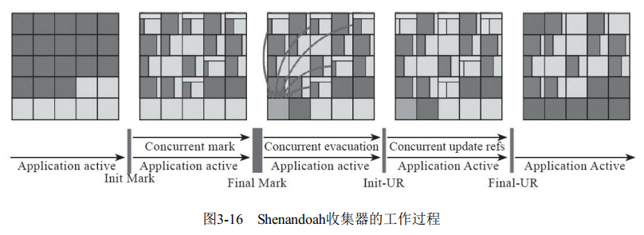

`Brooks Pointer` 简介：

> 1984年， `Rodney A.Brooks` 在论文《`Trading Data Space for Reduced Time and Code Space in Real-Time Garbage Collection on Stock Hardware`》 中提出了使用转发指针（`Forwarding Pointer`， 也常被称为 `Indirection Pointer`） 来实现对象移动与用户程序并发的一种解决方案。
>
>  此前， 要做类似的并发操作， 通常是在被移动对象原有的内存上设置保护陷阱（`Memory Protection Trap`） ，一旦用户程序访问到归属于旧对象的内存空间就会产生自陷中段， 进入预设好的异常处理器中， 再由其中的代码逻辑把访问转发到复制后的新对象上。虽然确实能够实现对象移动与用户线程并发， 但是如果没有操作系统层面的直接支持， 这种方案将导致用户态频繁切换到核心态，代价是非常大的， 不能频繁使用。  
>
> `Brooks`提出的新方案不需要用到内存保护陷阱， 而是在原有对象布局结构的最前面统一增加一个新的引用字段， 在正常不处于并发移动的情况下， 该引用指向对象自己。但是出现的问题有：
>
> > 1）多线程竞争问题：如果收集器线程与用户线程发生的只是并发读取， 那无论读到旧对象还是新对象上的字段， 返回的结果都应该是一样的； 但如果发生的是并发写入， 就一定必须保证写操作只能发生在新复制的对象上， 而不是写入旧对象的内存中；
> >
> > 解决方案：`Shenandoah` 收集器是通过**比较并交换**（`Compare And Swap， CAS`） 操作来保证并发时对象的访问正确性的。  
> >
> > 2）执行频率的问题：尽管通过对象头上的 `Brooks Pointer` 来保证并发时原对象与复制对象的访问一致性，但要覆盖全部对象访问操作， `Shenandoah` 不得不同时设置读、 写屏障去拦截。  
> >
> > 解决方案：在 `JDK 13` 中将 `Shenandoah` 的内存屏障模型改进为基于 **引用访问屏障**（`Load Reference Barrier`）的实现，所谓“**引用访问屏障**”是指内存屏障只拦截对象中数据类型为引用类型的读写操作， 而不去管原生数据类型等其他非引用字段的读写， 这能够省去大量对原生类型、 对象比较、 对象加锁等场景中设置内存屏障所带来的消耗。

###### 2，ZGC 收集器  

`ZGC`（`Z Garbage Collector`）是一款在 `JDK 11` 中新加入的具有实验性质的低延迟垃圾收集器，是由 `Oracle` 公司研发的。   

`ZGC` 收集器是一款基于 `Region` 内存布局的，不设分代的， 使用了读屏障、 染色指针和内存多重映射等技术来实现可并发的标记-整理算法的， 以低延迟为首要目标的一款垃圾收集器。  

`ZGC` 的 `Region`（`Page` 或者 `ZPage`）具有**动态性**——动态创建和销毁， 以及动态的区域容量大小。 在 `x64` 硬件平台下， `ZGC` 的 `Region` 可以具有大、中、小三类容量：

> **小型`Region`**（`Small Region`）：容量固定为 `2MB`， 用于放置小于 `256KB` 的小对象；
>
> **中型`Region`**（`Medium Region`）：容量固定为 `32MB`，用于放置大于等于 `256KB` 但小于 `4MB` 的对象；
>
> **大型`Region`**（`Large Region`）：容量不固定，可以动态变化，但必须为 `2MB` 的整数倍，用于放置 `4MB` 或以上的大对象。每个大型 `Region` 中只会存放一个大对象，大型 `Region` 在 `ZGC` 的实现中是不会被重分配，因为复制一个大对象的代价非常高昂 。

`ZGC` 收集器有一个**标志性**的设计是采用的**染色指针技术**（`Colored Pointer`，亦称 `Tag Pointer` 或者 `Version Pointer`）。

> **染色指针**是一种直接将少量额外的信息存储在指针上的技术。在64位系统中， 理论可以访问的内存高达16EB（2的64次幂） 字节。
>
> 在 `AMD64` 架构中只支持到52位（`4PB`） 的地址总线和48位（`256TB`）的虚拟地址空间， 所以目前64位的硬件实际能够支持的最大内存只有 `256TB`。 此外， 操作系统一侧也还会施加自己的约束， 64位的 `Linux` 则分别支持47位（`128TB`） 的进程虚拟地址空间和46位（`64TB`） 的物理地址空间，64位的`Windows` 系统甚至只支持44位（`16TB`） 的物理地址空间。      
>
> 染色指针的优势所在：
>
> > 1）使得一旦某个 `Region` 的存活对象被移走之后，这个 `Region` 立即就能够被释放和重用掉， 而不必等待整个堆中所有指向该 `Region` 的引用都被修正后才能清理。
> >
> > 2）可以大幅减少在垃圾收集过程中内存屏障的使用数量， 设置内存屏障， 尤其是写屏障的目的通常是为了记录对象引用的变动情况， 如果将这些信息直接维护在指针中， 显然就可以省去一些专门的记录操作；
> >
> > 3）可以作为一种可扩展的存储结构用来记录更多与对象标记、 重定位过程相关的数据， 以便日后进一步提高性能。


`ZGC` 的运作过程可划分为以下四个大的阶段，全部四个阶段都是可以并发执行的， 仅是两个阶段中间会存在短暂的停顿小阶段。

> **并发标记**（`Concurrent Mark`）：遍历对象图做可达性分析的阶段，`ZGC`的标记是在指针上而不是在对象上进行的，会更新染色指针中的 `Marked 0`、`Marked 1`标志位；
>
> **并发预备重分配**（`Concurrent Prepare for Relocate`）：需要根据特定的查询条件统计得出本次收集过程要清理哪些 `Region`，将这些 `Region` 组成重分配集（`Relocation Set`） 。`ZGC` 划分 `Region` 的目的并非为了像G1那样做收益优先的增量回收，相反， `ZGC` 每次回收都会扫描所有的 `Region`，用范围更大的扫描成本换取省去 `G1` 中记忆集的维护成本。 因此， `ZGC` 的重分配集只是决定了里面的存活对象会被重新复制到其他的 `Region` 中，里面的`Region`会被释放， 而并不能说回收行为就只是针对这个集合里面的 `Region` 进行， 因为标记过程是针对全堆的。
>
> **并发重分配**（`Concurrent Relocate`）：重分配是 `ZGC` 执行过程中的**核心阶段**，这个过程要把重分配集中的存活对象复制到新的`Region`上， 并为重分配集中的每个`Region`维护一个转发表（`Forward Table`），记录从旧对象到新对象的转向关系。 得益于染色指针的支持， ZGC收集器能仅从引用上就明确得知一个对象是否处于重分配集之中， 如果用户线程此时并发访问了位于重分配集中的对象， 这次访问将会被预置的内存屏障所截获， 然后立即根据`Region`上的转发表记录将访问转发到新复制的对象上，并同时修正更新该引用的值， 使其直接指向新对象， `ZGC` 将这种行为称为指针的 “**自愈**” （`SelfHealing`） 能力。 
>
> **并发重映射**（`Concurrent Remap`）：重映射所做的就是修正整个堆中指向重分配集中旧对象的所有引用，`ZGC` 的并发重映射并不是一个必须要“迫切”去完成的任务，即使是旧引用， 它也是可以自愈的， 最多只是第一次使用时多一次转发和修正操作。 重映射清理这些旧引用的主要目的是为了不变慢（还有清理结束后可以释放转发表这样的附带收益） ， 所以说这并不是很“迫切”。

#### 8，选择合适的垃圾收集器  

`Epsilon` 是一款以不能够进行垃圾收集为“卖点”的垃圾收集器，出现在 `JDK 11` 的特征清单中。

如何选择一款适合自己应用的收集器呢？

> **应用程序的主要关注点**是什么？如果是数据分析、 科学计算类的任务， 目标是能尽快算出结果，那**吞吐量**就是主要关注点； 如果是SLA应用， 那停顿时间直接影响服务质量， 严重的甚至会导致事务超时， 这样**延迟**就是主要关注点； 而如果是客户端应用或者嵌入式应用， 那垃圾收集的**内存占用**则是不可忽视的。
>
> **运行应用的基础设施**如何？ 譬如硬件规格， 要涉及的系统架构是`x86-32/64`、 `SPARC` 还是 `ARM/Aarch64`； 处理器的数量多少， 分配内存的大小； 选择的操作系统是 `Linux`、`Solaris` 还是 `Windows`等。
>
> **使用JDK的发行商**是什么？版本号是多少？ 是 `ZingJDK/Zulu`、 `OracleJDK`、 `Open-JDK`、 `OpenJ9` 抑或是其他公司的发行版？ 该 `JDK` 对应了《Java虚拟机规范》 的哪个版本？     

`HotSpot` 所有功能的日志都收归到了“`-Xlog`”参数上：

```bash
-Xlog[:[selector][:[output][:[decorators][:output-options]]]]
```

**注意**：命令行中最关键的参数是**选择器**（`Selector`） ， 它由标签（`Tag`） 和日志级别（`Level`） 共同组成。

> **标签**：可理解为虚拟机中某个功能模块的名字， 它告诉日志框架用户希望得到虚拟机哪些功能的日志输出。垃圾收集器的标签名称为“`gc`”，由此可见， 圾收集器日志只是`HotSpot`众多功能日志的其中一项， 全部支持的功能模块标签名如下所示：
>
> ```bash
> add, age, alloc, annotation, aot, arguments, attach, barrier, biasedlocking, blocks, bot, breakpoint, bytecode
> ```
>
> **日志**：日志级别从低到高， 共有 `Trace`，`Debug`，`Info`，`Warning`，`Error`，`Off` 六种级别， 日志级别决定了输出信息的详细程度， 默认级别为`Info`，`HotSpot`的日志规则与`Log4j、 SLF4j`这类`Java`日志框架大体上是一致的。支持附加在日志行上的信息包括：
>
> > `time`： 当前日期和时间。
> > `uptime`： 虚拟机启动到现在经过的时间， 以秒为单位。
> > `timemillis`： 当前时间的毫秒数， 相当于`System.currentTimeMillis()`的输出。
> > `uptimemillis`： 虚拟机启动到现在经过的毫秒数。
> > `timenanos`： 当前时间的纳秒数， 相当于`System.nanoTime()`的输出。
> > `uptimenanos`： 虚拟机启动到现在经过的纳秒数。
> > `pid`： 进程`ID`。
> > `tid`： 线程`ID`。
> > `level`： 日志级别。
> > `tags`： 日志输出的标签集。
>
> 如果不指定， 默认值是 `uptime`、` level`、 `tags`， 此时日志输出类似于以下形式：
>
> ```bash
> [3.080s][info][gc,cpu] GC(5) User=0.03s Sys=0.00s Real=0.01s  
> ```

日志示例：

- 代码清单3-3  垃圾收集器日志测试

```java
package com.jvm;

/**
 * 垃圾收集器日志测试
 *
 * @author zhangbc
 * @version 1.0.0
 * @date 2020/8/9 19:00
 **/
public class GCTest {

    private static final int _1MB = 1024 * 1024;

    public static void main(String[] args) {
        byte[] alloc1, alloc2, alloc3, alloc4;
        alloc1 = new byte[2 * _1MB];
        alloc2 = new byte[2 * _1MB];
        alloc3 = new byte[2 * _1MB];
        alloc4 = new byte[4 * _1MB];
    }
}
```

以下测试环境为：

```bash
☁  java [interview] ⚡  java -version
java version "11.0.6" 2020-01-14 LTS
Java(TM) SE Runtime Environment 18.9 (build 11.0.6+8-LTS)
Java HotSpot(TM) 64-Bit Server VM 18.9 (build 11.0.6+8-LTS, mixed mode)
```

1）查看 `GC` 基本信息，在`JDK 9`之前使用`-XX：+PrintGC`，`JDK 9`后使用`-Xlog：gc`。

```bash
☁  java [interview] ⚡  java -Xlog:gc com.jvm.GCTest       
[0.009s][info][gc] Using G1
```

2）查看 `GC` 详细信息，在`JDK 9`之前使用`-XX：+PrintGCDetails`，`JDK 9`后使用`-Xlog：gc*`。

```bash
☁  java [interview] ⚡  java -Xlog:gc* com.jvm.GCTest          
[0.008s][info][gc,heap] Heap region size: 1M
[0.010s][info][gc     ] Using G1
[0.010s][info][gc,heap,coops] Heap address: 0x0000000780000000, size: 2048 MB, Compressed Oops mode: Zero based, Oop shift amount: 3
[0.089s][info][gc,heap,exit ] Heap
[0.089s][info][gc,heap,exit ]  garbage-first heap   total 131072K, used 15360K [0x0000000780000000, 0x0000000800000000)
[0.089s][info][gc,heap,exit ]   region size 1024K, 2 young (2048K), 0 survivors (0K)
[0.089s][info][gc,heap,exit ]  Metaspace       used 3462K, capacity 4486K, committed 4864K, reserved 1056768K
[0.089s][info][gc,heap,exit ]   class space    used 308K, capacity 386K, committed 512K, reserved 1048576K
```

3）查看`GC`前后的堆、方法区可用容量变化，在`JDK 9`之前使用`-XX：+PrintHeapAtGC`，`JDK 9`之后使用`-Xlog：gc+heap=debug`。

```bash
☁  java [interview] ⚡  java -Xlog:gc+heap=debug com.jvm.GCTest
[0.014s][info][gc,heap] Heap region size: 1M
[0.014s][debug][gc,heap] Minimum heap 8388608  Initial heap 134217728  Maximum heap 2147483648
```

4）查看`GC`过程中用户线程并发时间以及停顿的时间，在`JDK 9`之前使用`-XX：+PrintGCApplicationConcurrentTime` 以及 `-XX：+PrintGCApplicationStoppedTime`，`JDK 9`之后使用`-Xlog：safepoint`。

```bash
☁  java [interview] ⚡  java -Xlog:safepoint com.jvm.GCTest
[0.090s][info][safepoint] Entering safepoint region: EnableBiasedLocking
[0.091s][info][safepoint] Leaving safepoint region
[0.091s][info][safepoint] Total time for which application threads were stopped: 0.0005900 seconds, Stopping threads took: 0.0000416 seconds
[0.100s][info][safepoint] Application time: 0.0057175 seconds
[0.100s][info][safepoint] Entering safepoint region: RevokeBias
[0.100s][info][safepoint] Leaving safepoint region
[0.100s][info][safepoint] Total time for which application threads were stopped: 0.0000894 seconds, Stopping threads took: 0.0000355 seconds
[0.109s][info][safepoint] Application time: 0.0092134 seconds
[0.109s][info][safepoint] Entering safepoint region: Halt
```

5）查看收集器 `Ergonomics` 机制（自动设置堆空间各分代区域大小、收集目标等内容，从`Parallel`收集器开始支持）自动调节的相关信息。在`JDK 9`之前使用`-XX：+PrintAdaptive-SizePolicy`，`JDK 9`之后使用`-Xlog：gc+ergo*=trace`。

```bash
☁  java [interview] ⚡  java -Xlog:gc+ergo*=trace com.jvm.GCTest
[0.007s][debug][gc,ergo,heap] Expand the heap. requested expansion amount: 134217728B expansion amount: 134217728B
[0.008s][debug][gc,ergo,refine] Initial Refinement Zones: green: 4, yellow: 12, red: 20, min yellow size: 8
```

6）查看熬过收集后剩余对象的年龄分布信息，在`JDK 9`前使用`-XX：+PrintTenuring-Distribution`，`JDK 9`之后使用`-Xlog：gc+age=trace`。

```bash
☁  java [interview] ⚡  java -Xlog:gc+age=trace com.jvm.GCTest
```

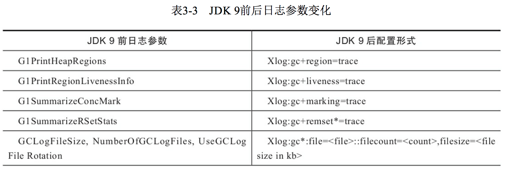


垃圾收集相关的常用参数如下：

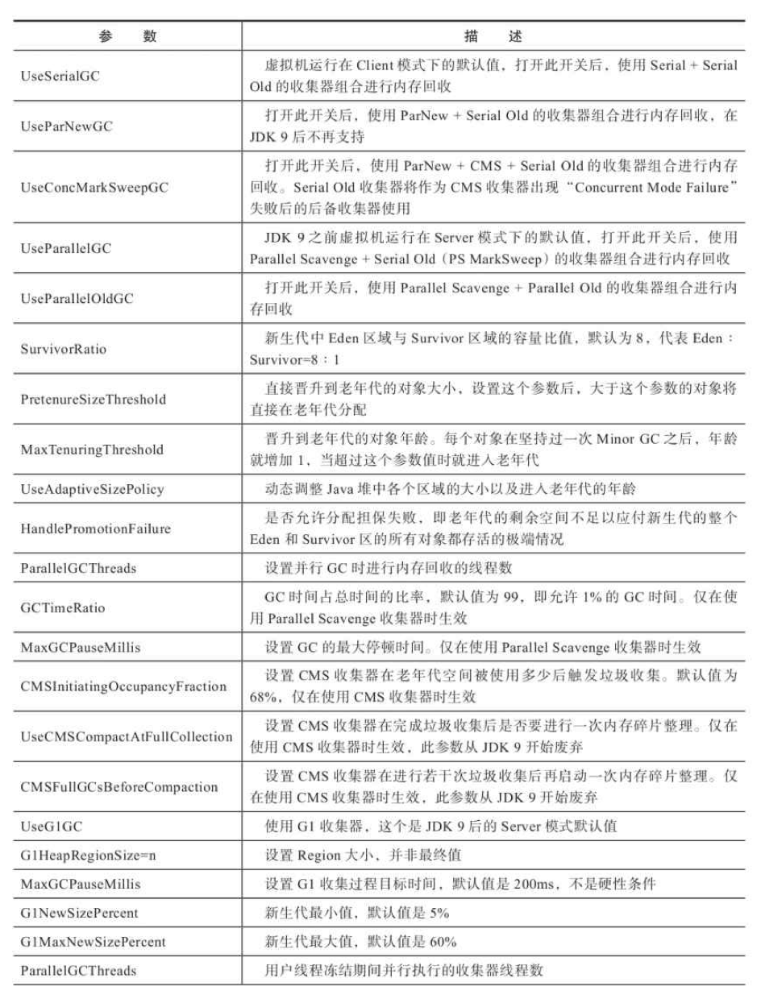


#### 9，实战：内存分配与回收策略

`Java` 技术体系的自动内存管理，**最根本的目标**是自动化地解决两个问题：自动给对象分配内存以及自动回收分配给对象的内存。

大多数情况下，对象在新生代`Eden`区中分配。当`Eden`区没有足够空间进行分配时，虚拟机将发起一次 `Minor GC`。

- 代码清单3-4 新生代 `Minor GC`

```java
package com.jvm;

/**
 * 新生代Minor GC
 * VM Args： -verbose:gc -Xms20M -Xmx20M -Xmn10M -XX:+PrintGCDetails -XX:SurvivorRatio=8
 *
 * @author zhangbocheng
 * @version v1.0
 * @date 2020/8/10 00:45
 */
public class MinorGC {

    private static final int _1MB = 1024 * 1024;

    public static void testAllocation() {
        byte[] allocation1, allocation2, allocation3, allocation4;
        allocation1 = new byte[2 * _1MB];
        allocation2 = new byte[2 * _1MB];
        allocation3 = new byte[2 * _1MB];
        // 出现一次 Minor GC
        allocation4 = new byte[4 * _1MB];
    }

    public static void main(String[] args) {
        testAllocation();
    }
}
```

运行结果：

```bash
Heap
 PSYoungGen      total 9216K, used 7324K [0x00000007bf600000, 0x00000007c0000000, 0x00000007c0000000)
  eden space 8192K, 89% used [0x00000007bf600000,0x00000007bfd27088,0x00000007bfe00000)
  from space 1024K, 0% used [0x00000007bff00000,0x00000007bff00000,0x00000007c0000000)
  to   space 1024K, 0% used [0x00000007bfe00000,0x00000007bfe00000,0x00000007bff00000)
 ParOldGen       total 10240K, used 4096K [0x00000007bec00000, 0x00000007bf600000, 0x00000007bf600000)
  object space 10240K, 40% used [0x00000007bec00000,0x00000007bf000010,0x00000007bf600000)
 Metaspace       used 2673K, capacity 4486K, committed 4864K, reserved 1056768K
  class space    used 287K, capacity 386K, committed 512K, reserved 1048576K
```

`HotSpot` 虚拟机提供了 `-XX：PretenureSizeThreshold` 参数，指定大于该设置值的对象直接在老年代分配，这样做的目的就是避免在`Eden`区及两个`Survivor`区之间来回复制，产生大量的内存复制操作。

**注意**：`-XX：PretenureSizeThreshold` 参数只对 `Serial` 和 `ParNew` 两款新生代收集器有效，`HotSpot` 的其他新生代收集器，如 `Parallel Scavenge` 并不支持这个参数，如果必须使用此参数进行调优，可考虑 `ParNew` 加 `CMS` 的收集器组合。

代码清单3-5 大对象直接进入老年代 `GC`

```java
package com.jvm;

/**
 * 大对象直接进入老年代 GC
 * VM Args： -verbose:gc -Xms20M -Xmx20M -Xmn10M -XX:+PrintGCDetails -XX:SurvivorRatio=8
 *
 * @author zhangbocheng
 * @version v1.0
 * @date 2020/8/10 00:45
 */
public class PretenureSizeThresholdGC {

    private static final int _1MB = 1024 * 1024;

    public static void testPretenureSizeThreshold() {
        byte[] allocation;
        // 直接分配在老年代中
        allocation = new byte[4 * _1MB];
    }

    public static void main(String[] args) {
        testPretenureSizeThreshold();
    }
}
```

运行结果：

```bash
Heap
 PSYoungGen      total 9216K, used 5276K [0x00000007bf600000, 0x00000007c0000000, 0x00000007c0000000)
  eden space 8192K, 64% used [0x00000007bf600000,0x00000007bfb27070,0x00000007bfe00000)
  from space 1024K, 0% used [0x00000007bff00000,0x00000007bff00000,0x00000007c0000000)
  to   space 1024K, 0% used [0x00000007bfe00000,0x00000007bfe00000,0x00000007bff00000)
 ParOldGen       total 10240K, used 0K [0x00000007bec00000, 0x00000007bf600000, 0x00000007bf600000)
  object space 10240K, 0% used [0x00000007bec00000,0x00000007bec00000,0x00000007bf600000)
 Metaspace       used 2671K, capacity 4486K, committed 4864K, reserved 1056768K
  class space    used 287K, capacity 386K, committed 512K, reserved 1048576K
```

对象通常在`Eden`区里诞生，如果经过第一次 `Minor GC` 后仍然存活，并且能被 `Survivor` 容纳的话，该对象会被移动到 `Survivor` 空间中，并且将其对象年龄设为1岁。对象在 `Survivor` 区中每熬过一次 `Minor GC`，年龄就增加1岁，当它的年龄增加到一定程 度（默认为15），就会被晋升到老年代中。对象晋升老年代的年龄阈值，可以通过参数 `-XX： MaxTenuringThreshold`设置。

- 代码清单3-6 长期存活的对象进入老年代 `GC`

```java
package com.jvm;

/**
 * 长期存活的对象进入老年代 GC
 * VM Args： -verbose:gc -Xms20M -Xmx20M -Xmn10M -XX:+PrintGCDetails -XX:SurvivorRatio=8
 * -XX:MaxTenuringThreshold=1 -XX:+PrintTenuringDistribution
 *
 * @author zhangbocheng
 * @version v1.0
 * @date 2020/8/10 00:45
 */
public class TenuringThresholdGC {

    private static final int _1MB = 1024 * 1024;

    @SuppressWarnings("unused")
    public static void testTenuringThreshold() {
        byte[] allocation1, allocation2, allocation3;
        allocation1 = new byte[_1MB / 4];
        allocation2 = new byte[4 * _1MB];
        allocation3 = new byte[4 * _1MB];
        allocation3 = null;
        allocation3 = new byte[4 * _1MB];
    }

    public static void main(String[] args) {
        testTenuringThreshold();
    }
}
```

运行结果：

1）以`-verbose:gc -Xms20M -Xmx20M -Xmn10M -XX:+PrintGCDetails -XX:SurvivorRatio=8  -XX:MaxTenuringThreshold=1 -XX:+PrintTenuringDistribution`执行

```bash
Heap
 PSYoungGen      total 9216K, used 5532K [0x00000007bf600000, 0x00000007c0000000, 0x00000007c0000000)
  eden space 8192K, 67% used [0x00000007bf600000,0x00000007bfb670b0,0x00000007bfe00000)
  from space 1024K, 0% used [0x00000007bff00000,0x00000007bff00000,0x00000007c0000000)
  to   space 1024K, 0% used [0x00000007bfe00000,0x00000007bfe00000,0x00000007bff00000)
 ParOldGen       total 10240K, used 8192K [0x00000007bec00000, 0x00000007bf600000, 0x00000007bf600000)
  object space 10240K, 80% used [0x00000007bec00000,0x00000007bf400020,0x00000007bf600000)
 Metaspace       used 2673K, capacity 4486K, committed 4864K, reserved 1056768K
  class space    used 287K, capacity 386K, committed 512K, reserved 1048576K
```

2）以`-verbose:gc -Xms20M -Xmx20M -Xmn10M -XX:+PrintGCDetails -XX:SurvivorRatio=8  -XX:MaxTenuringThreshold=15 -XX:+PrintTenuringDistribution`执行

```bash
Heap
 PSYoungGen      total 9216K, used 5532K [0x00000007bf600000, 0x00000007c0000000, 0x00000007c0000000)
  eden space 8192K, 67% used [0x00000007bf600000,0x00000007bfb670b0,0x00000007bfe00000)
  from space 1024K, 0% used [0x00000007bff00000,0x00000007bff00000,0x00000007c0000000)
  to   space 1024K, 0% used [0x00000007bfe00000,0x00000007bfe00000,0x00000007bff00000)
 ParOldGen       total 10240K, used 8192K [0x00000007bec00000, 0x00000007bf600000, 0x00000007bf600000)
  object space 10240K, 80% used [0x00000007bec00000,0x00000007bf400020,0x00000007bf600000)
 Metaspace       used 2669K, capacity 4486K, committed 4864K, reserved 1056768K
  class space    used 287K, capacity 386K, committed 512K, reserved 1048576K
```

- 代码清单3-7 动态对象年龄判定 `GC`

```java
package com.jvm;

/**
 * 动态对象年龄判定 GC
 * VM Args： -verbose:gc -Xms20M -Xmx20M -Xmn10M -XX:+PrintGCDetails -XX:SurvivorRatio=8
 * -XX:MaxTenuringThreshold=15 -XX:+PrintTenuringDistribution
 *
 * @author zhangbocheng
 * @version v1.0
 * @date 2020/8/10 00:45
 */
public class TenuringAgeThresholdGC {

    private static final int _1MB = 1024 * 1024;

    @SuppressWarnings("unused")
    public static void testTenuringThreshold() {
        byte[] allocation1, allocation2, allocation3, allocation4;
        allocation1 = new byte[_1MB / 4];
        allocation2 = new byte[_1MB / 4];
        allocation3 = new byte[4 * _1MB];
        allocation4 = new byte[4 * _1MB];
        allocation4 = null;
        allocation4 = new byte[4 * _1MB];
    }

    public static void main(String[] args) {
        testTenuringThreshold();
    }
}
```

运行结果：

```bash
Heap
 PSYoungGen      total 9216K, used 5788K [0x00000007bf600000, 0x00000007c0000000, 0x00000007c0000000)
  eden space 8192K, 70% used [0x00000007bf600000,0x00000007bfba7128,0x00000007bfe00000)
  from space 1024K, 0% used [0x00000007bff00000,0x00000007bff00000,0x00000007c0000000)
  to   space 1024K, 0% used [0x00000007bfe00000,0x00000007bfe00000,0x00000007bff00000)
 ParOldGen       total 10240K, used 8192K [0x00000007bec00000, 0x00000007bf600000, 0x00000007bf600000)
  object space 10240K, 80% used [0x00000007bec00000,0x00000007bf400020,0x00000007bf600000)
 Metaspace       used 2673K, capacity 4486K, committed 4864K, reserved 1056768K
  class space    used 287K, capacity 386K, committed 512K, reserved 1048576K
```

- 代码清单3-8 动态对象年龄判定 `GC`

```java
package com.jvm;

/**
 * 空间分配担保
 * VM Args：-Xms20M -Xmx20M -Xmn10M -XX:+PrintGCDetails -XX:SurvivorRatio=8
 * -XX:-Handle-PromotionFailure (jdk1.8运行有误)
 *
 * @author zhangbocheng
 * @version v1.0
 * @date 2020/8/10 00:45
 */
public class HandlePromotionGC {

    private static final int _1MB = 1024 * 1024;

    @SuppressWarnings("unused")
    public static void testHandlePromotion() {
        byte[] allocation1, allocation2, allocation3, allocation4, allocation5, allocation6, allocation7;
        allocation1 = new byte[2 * _1MB];
        allocation2 = new byte[2 * _1MB];
        allocation3 = new byte[2 * _1MB];
        allocation1 = null;
        allocation4 = new byte[2 * _1MB];
        allocation5 = new byte[2 * _1MB];
        allocation6 = new byte[2 * _1MB];
        allocation4 = null;
        allocation5 = null;
        allocation6 = null;
        allocation7 = new byte[2 * _1MB];
    }

    public static void main(String[] args) {
        testHandlePromotion();
    }
}
```

在 `JDK 6 Update 24` 之后，`-XX：HandlePromotionFailure` 参数不会再影响到虚拟机的空间分配担保策略，观察 `OpenJDK` 中的源码变化，虽然源码中还定义了`-XX：HandlePromotionFailure` 参数，但是在实际虚拟机中已经不会再使用它。`JDK 6 Update 24` 之后的规则变为只要老年代的连续空间大于新生代对象总大小或者历次晋升的平均大小，就会进行 `Minor GC`，否则将进行 `Full GC`。

## 四，虚拟机性能监控、故障处理工具

#### 1，基础故障处理工具

根据软件可用性和授权的不同，可以把用于监视虚拟机运行状态和进行故障处理的工具划分：

> **商业授权工具**：主要是`JMC`（`Java Mission Control`）及它要使用到的`JFR`（`Java Flight Recorder`），`JMC`这个原本来自于`JRockit` 的运维监控套件从 `JDK 7 Update 40`开始就被集成到`OracleJDK`中，`JDK 11`之前都无须独立下载，但是在商业环境中使用它则是要付费的；
>
> **正式支持工具**：这一类工具属于被长期支持的工具，不同平台、不同版本的`JDK`之间，这类工具可能会略有差异，但是不会出现某一个工具突然消失的情况；
>
> **实验性工具**：这一类工具在它们的使用说明中被声明为“没有技术支持，并且是实验性质 的”（`Unsupported and Experimental`）产品，日后可能会转正，也可能会在某个`JDK`版本中无声无息 消失。但事实上它们通常都非常稳定而且功能强大，也能在处理应用程序性能问题、定位故障时发挥很大的作用。

- **jps**：虚拟机进程状况工具

`jps`的作用是列出正在运行的虚拟机进程，并显示虚拟机执行主类（`Main Class`，`main()`函数所在的类）名称以及这些进程的本地虚拟机唯一 `ID`（`LVMID`，`Local Virtual Machine Identifier`）。

`jps`命令格式：

```bash
jps [options] [hostid] 
```

基本使用实例：

```bash
douqu@iZ2ze0blc58weob3oi45cjZ:~$ jps -l
29203 douqu_channel.jar
24500 douqu_console.jar
16029 sun.tools.jps.Jps
```

<center>表4-1  jps工具主要选项</center>

| 选项 | 作用                                                   |
| :--: | ------------------------------------------------------ |
|  -q  | 只输出`LVMID`，省略主类的名称                          |
|  -m  | 输出虚拟机进程启动时传递给主类`main()`函数的参数       |
|  -l  | 输出主类的全名，如果进程执行的`JAR`包，则输出`JAR`路径 |
|  -v  | 输出虚拟机进程启动时的`JVM`参数                        |

- **jstat**：虚拟机统计信息监视工具

`jstat`（`JVM Statistics Monitoring Tool`）是用于监视虚拟机各种运行状态信息的命令行工具。它可以显示本地或者远程虚拟机进程中的类加载、内存、垃圾收集、即时编译等运行时数据，在没有 GUI图形界面、只提供了纯文本控制台环境的服务器上，它将是运行期定位虚拟机性能问题的常用工具。

`jstat` 命令格式：

```bash
jstat [option vmid [interval[s|ms] [count]]]
```

**参数说明**：

1）对于命令格式中的 `VMID` 与 `LVMID` 需要特别说明：如果是本地虚拟机进程，`VMID` 与 `LVMID` 是一致的；如果是远程虚拟机进程，那 `VMID` 的格式应当是：

```bash
[protocol:][//]lvmid[@hostname[:port]/servername]
```

2）参数 `interval` 和 `count` 代表查询间隔和次数，如果省略这2个参数，说明只查询一次。假设需要每250 毫秒查询一次进程2764垃圾收集状况，一共查询20次，那命令应当是：

```bash
jstat -gc 2764 250 20
```

3）选项 `option` 代表用户希望查询的虚拟机信息，主要分为三类：类加载、垃圾收集、运行期编译状况。

基本使用实例：

```bash
douqu@iZ2ze0blc58weob3oi45cjZ:~$ jstat -gcutil 3063
  S0     S1     E      O      M     CCS    YGC     YGCT    FGC    FGCT     GCT   
 18.45   0.00  34.15   9.21  97.25  95.67     90    1.792     6    0.237    2.029
```

**查询结果表明**：这台服务器的新生代`Eden`区（`E`，表示`Eden`）使用了34.15%的空间，2个`Survivor`区 （`S0`、`S1`，表示`Survivor0`、`Survivor1`）分别使用了18.45%和0，老年代（`O`，表示`Old`）使用了9.21%，永久代（`P`，表示`Permanent`）没显示。程序运行以来共发生`Minor GC`（`YGC`，表示`Young GC`）90次，总耗时1.792秒；发生 `Full GC`（`FGC`，表示`Full GC`）6次，总耗时（`FGCT`，表示`Full GC Time`）为0.237秒；所有`GC`总耗时（`GCT`，表示`GC Time`）为2.029秒。

<center>表4-2  jstat工具主要选项</center>

|       选项        | 作用                                                         |
| :---------------: | ------------------------------------------------------------ |
|      -class       | 监视类加载、卸载数量、总空间以及类装载所耗费的时间           |
|        -gc        | 监视`Java`堆状况，包括`Eden`区，2个`Survivor`区，老年代，永久代等的容量，已用空间，垃圾收集时间合计等信息 |
|    -gccapacity    | 监视内容基本与 `-gc`一致，但输出主要关注 `Java` 堆各个区域使用到的最大最小空间 |
|      -gcutil      | 监视内容基本与 `-gc`一致，但输出主要关注已使用空间占总空间的百分比 |
|     -gccause      | 功能与`-gcutil`一致，但会额外输出导致上一次垃圾收集产生的原因 |
|      -gcnew       | 监视新生代垃圾收集状况                                       |
|  -gcnewcapacity   | 监视内容基本与 `-gcnew`一致，但输出主要关注使用到的最大最小空间 |
|      -gcold       | 监视老年代垃圾收集状况                                       |
|  -gcoldcapacity   | 监视内容基本与 `-gcold`一致，但输出主要关注使用到的最大最小空间 |
|  -gcpermcapacity  | 输出永久代使用到的最大最小空间                               |
|     -compiler     | 输出即时编译器编译过的方法、耗时等信息                       |
| -printcompilation | 输出已被即时编译过的方法                                     |

- **jinfo**：`Java`配置信息工具

`jinfo`（`Configuration Info for Java`）的作用是实时查看和调整虚拟机各项参数。

`jinfo`命令格式：

```bash
jinfo [ option ] pid
```

基本使用实例：

```bash
douqu@iZ2ze0blc58weob3oi45cjZ:~$ jinfo -flag CMSInitiatingOccupancyFraction 3063
-XX:CMSInitiatingOccupancyFraction=70
```

- **jmap**：`Java`内存映像工具

`jmap`（`Memory Map for Java`）命令用于生成堆转储快照（一般称为`heapdump`或`dump`文件），还可以查询`finalize`执行队列、`Java`堆和方法区的详细信息，如空间使用率、当前用的是哪种收集器等。

`jmap`命令格式：

```bash
jmap [ option ] vmid
```

基本使用实例：

```bash
douqu@iZ2ze0blc58weob3oi45cjZ:~$ jmap -dump:format=b,file=douqu_console.bin 3063
Dumping heap to /home/douqu/douqu_console.bin ...
Heap dump file created
```

<center>表4-3  jmap工具主要选项</center>

|      选项      | 作用                                                         |
| :------------: | ------------------------------------------------------------ |
|     -dump      | 生成`Java`堆转储快照。格式为`-dump:[live,]format=b,file=<filename>`，其中`live`子参数说明是否只`dump`出存活的对象 |
| -finalizerinfo | 显示在`F-Queue` 中等待`Finalizer`线程执行`finalize`方法的对象；只在`Linux/Solaris`平台下有效 |
|     -heap      | 显示`Java`堆详细信息，如使用哪种回收器，参数配置，分代状况等；只在`Linux/Solaris`平台下有效 |
|     -histo     | 显示堆中对象统计信息，包括类，实例数量，合计容量             |
|   -permstat    | 以`ClassLoader`为统计口径显示永久代内存状态。只在`Linux/Solaris`平台下有效 |
|       -F       | 当虚拟机进程对`-dump`选项没有响应时，可以使用这个选项强制生成`dump`快照；只在`Linux/Solaris`平台下有效 |

- **jhat**：虚拟机堆转储快照分析工具

`jhat`（`JVM Heap Analysis Tool`）命令与`jmap`搭配使用，来分析`jmap`生成的堆转储快照。`jhat`内置了一个微型的`HTTP/Web`服务器，生成堆转储快照的分析结果后，可以在浏览器中查看。在实际工作中多数人是不会直接使用 `jhat` 命令来分析堆转储快照文件的，主要原因有：

> 1）一般不会在部署应用程序的服务器上直接分析堆转储快照，即使可以这样做，也会尽量将堆转储快照文件复制到其他机器上进行分析，因为分析工作是一个耗时而且极为耗费硬件资源的过程；
>
> 2）`jhat`的分析功能相对来说比较简陋，不如VisualVM，以及专业用于分析堆转储快照文件的`Eclipse Memory Analyzer`、`IBM HeapAnalyzer` 等工具，它们都能实现比 `jhat` 更强大专业的分析功能。

基本使用实例：

```bash
☁  2020-07-11 [master] ⚡  /Library/Java/JavaVirtualMachines/jdk1.8.0_131.jdk/Contents/Home/bin/jhat douqu_console.bin
Reading from douqu_console.bin...
Dump file created Tue Aug 11 13:45:36 CST 2020
Snapshot read, resolving...
Resolving 3243089 objects...
Chasing references, expect 648 dots........................................................................................................................................................................................................................................................................................................................................................................................................................................................................................................................................................................................................................................................................
Eliminating duplicate references........................................................................................................................................................................................................................................................................................................................................................................................................................................................................................................................................................................................................................................................................
Snapshot resolved.
Started HTTP server on port 7000
Server is ready.
```

- **jstack**：`Java`堆栈跟踪工具

`jstack`（`Stack Trace for Java`）命令用于生成虚拟机当前时刻的线程快照（一般称为`threaddump`或者`javacore`文件）。

`jstack`命令格式：

```bash
jstack [option] vmid
```

基本使用实例：

```bash
douqu@iZ2ze0blc58weob3oi45cjZ:~$ jstack -l 3063
2020-08-11 14:01:12
Full thread dump OpenJDK 64-Bit Server VM (25.191-b12 mixed mode):

"Attach Listener" #65 daemon prio=9 os_prio=0 tid=0x00007f0cac005000 nid=0x59c9 waiting on condition [0x0000000000000000]
   java.lang.Thread.State: RUNNABLE

   Locked ownable synchronizers:
        - None

"ThreadPoolTaskScheduler-10" #56 prio=5 os_prio=0 tid=0x00007f0ce4018800 nid=0x1870 waiting on condition [0x00007f0c733f8000]
   java.lang.Thread.State: WAITING (parking)
        at sun.misc.Unsafe.park(Native Method)
        - parking to wait for  <0x00000000d414ca98> (a java.util.concurrent.locks.AbstractQueuedSynchronizer$ConditionObject)
        at java.util.concurrent.locks.LockSupport.park(LockSupport.java:175)
        at java.util.concurrent.locks.AbstractQueuedSynchronizer$ConditionObject.await(AbstractQueuedSynchronizer.java:2039)
        at java.util.concurrent.ScheduledThreadPoolExecutor$DelayedWorkQueue.take(ScheduledThreadPoolExecutor.java:1088)
        at java.util.concurrent.ScheduledThreadPoolExecutor$DelayedWorkQueue.take(ScheduledThreadPoolExecutor.java:809)
        at java.util.concurrent.ThreadPoolExecutor.getTask(ThreadPoolExecutor.java:1074)
        at java.util.concurrent.ThreadPoolExecutor.runWorker(ThreadPoolExecutor.java:1134)
        at java.util.concurrent.ThreadPoolExecutor$Worker.run(ThreadPoolExecutor.java:624)
        at java.lang.Thread.run(Thread.java:748)

   Locked ownable synchronizers:
        - None

"ThreadPoolTaskScheduler-9" #55 prio=5 os_prio=0 tid=0x00007f0c84117800 nid=0xfc1 waiting on condition [0x00007f0c739fc000]
   java.lang.Thread.State: WAITING (parking)
        at sun.misc.Unsafe.park(Native Method)
        - parking to wait for  <0x00000000d414ca98> (a java.util.concurrent.locks.AbstractQueuedSynchronizer$ConditionObject)
        at java.util.concurrent.locks.LockSupport.park(LockSupport.java:175)
        at java.util.concurrent.locks.AbstractQueuedSynchronizer$ConditionObject.await(AbstractQueuedSynchronizer.java:2039)
        at java.util.concurrent.ScheduledThreadPoolExecutor$DelayedWorkQueue.take(ScheduledThreadPoolExecutor.java:1088)
        at java.util.concurrent.ScheduledThreadPoolExecutor$DelayedWorkQueue.take(ScheduledThreadPoolExecutor.java:809)
        at java.util.concurrent.ThreadPoolExecutor.getTask(ThreadPoolExecutor.java:1074)
        at java.util.concurrent.ThreadPoolExecutor.runWorker(ThreadPoolExecutor.java:1134)
        at java.util.concurrent.ThreadPoolExecutor$Worker.run(ThreadPoolExecutor.java:624)
        at java.lang.Thread.run(Thread.java:748)

   Locked ownable synchronizers:
        - None

"ThreadPoolTaskScheduler-8" #54 prio=5 os_prio=0 tid=0x00007f0cd8037800 nid=0xf71 waiting on condition [0x00007f0c738fb000]
   java.lang.Thread.State: WAITING (parking)
        at sun.misc.Unsafe.park(Native Method)
        - parking to wait for  <0x00000000d414ca98> (a java.util.concurrent.locks.AbstractQueuedSynchronizer$ConditionObject)
        at java.util.concurrent.locks.LockSupport.park(LockSupport.java:175)
        at java.util.concurrent.locks.AbstractQueuedSynchronizer$ConditionObject.await(AbstractQueuedSynchronizer.java:2039)
        at java.util.concurrent.ScheduledThreadPoolExecutor$DelayedWorkQueue.take(ScheduledThreadPoolExecutor.java:1088)
        at java.util.concurrent.ScheduledThreadPoolExecutor$DelayedWorkQueue.take(ScheduledThreadPoolExecutor.java:809)
        at java.util.concurrent.ThreadPoolExecutor.getTask(ThreadPoolExecutor.java:1074)
        at java.util.concurrent.ThreadPoolExecutor.runWorker(ThreadPoolExecutor.java:1134)
        at java.util.concurrent.ThreadPoolExecutor$Worker.run(ThreadPoolExecutor.java:624)
        at java.lang.Thread.run(Thread.java:748)

   Locked ownable synchronizers:
        - None

"ThreadPoolTaskScheduler-7" #53 prio=5 os_prio=0 tid=0x00007f0c9407d000 nid=0xebc waiting on condition [0x00007f0c73bfe000]
   java.lang.Thread.State: WAITING (parking)
        at sun.misc.Unsafe.park(Native Method)
        - parking to wait for  <0x00000000d414ca98> (a java.util.concurrent.locks.AbstractQueuedSynchronizer$ConditionObject)
        at java.util.concurrent.locks.LockSupport.park(LockSupport.java:175)
        at java.util.concurrent.locks.AbstractQueuedSynchronizer$ConditionObject.await(AbstractQueuedSynchronizer.java:2039)
        at java.util.concurrent.ScheduledThreadPoolExecutor$DelayedWorkQueue.take(ScheduledThreadPoolExecutor.java:1088)
        at java.util.concurrent.ScheduledThreadPoolExecutor$DelayedWorkQueue.take(ScheduledThreadPoolExecutor.java:809)
        at java.util.concurrent.ThreadPoolExecutor.getTask(ThreadPoolExecutor.java:1074)
        at java.util.concurrent.ThreadPoolExecutor.runWorker(ThreadPoolExecutor.java:1134)
        at java.util.concurrent.ThreadPoolExecutor$Worker.run(ThreadPoolExecutor.java:624)
        at java.lang.Thread.run(Thread.java:748)

   Locked ownable synchronizers:
        - None

"ThreadPoolTaskScheduler-6" #52 prio=5 os_prio=0 tid=0x00007f0cb0007000 nid=0xe6d waiting on condition [0x00007f0c735fa000]
   java.lang.Thread.State: WAITING (parking)
        at sun.misc.Unsafe.park(Native Method)
        - parking to wait for  <0x00000000d414ca98> (a java.util.concurrent.locks.AbstractQueuedSynchronizer$ConditionObject)
        at java.util.concurrent.locks.LockSupport.park(LockSupport.java:175)
        at java.util.concurrent.locks.AbstractQueuedSynchronizer$ConditionObject.await(AbstractQueuedSynchronizer.java:2039)
        at java.util.concurrent.ScheduledThreadPoolExecutor$DelayedWorkQueue.take(ScheduledThreadPoolExecutor.java:1088)
        at java.util.concurrent.ScheduledThreadPoolExecutor$DelayedWorkQueue.take(ScheduledThreadPoolExecutor.java:809)
        at java.util.concurrent.ThreadPoolExecutor.getTask(ThreadPoolExecutor.java:1074)
        at java.util.concurrent.ThreadPoolExecutor.runWorker(ThreadPoolExecutor.java:1134)
        at java.util.concurrent.ThreadPoolExecutor$Worker.run(ThreadPoolExecutor.java:624)
        at java.lang.Thread.run(Thread.java:748)

   Locked ownable synchronizers:
        - None

"ThreadPoolTaskScheduler-5" #51 prio=5 os_prio=0 tid=0x00007f0c8437b000 nid=0xdcf waiting on condition [0x00007f0c734f9000]
   java.lang.Thread.State: WAITING (parking)
        at sun.misc.Unsafe.park(Native Method)
        - parking to wait for  <0x00000000d414ca98> (a java.util.concurrent.locks.AbstractQueuedSynchronizer$ConditionObject)
        at java.util.concurrent.locks.LockSupport.park(LockSupport.java:175)
        at java.util.concurrent.locks.AbstractQueuedSynchronizer$ConditionObject.await(AbstractQueuedSynchronizer.java:2039)
        at java.util.concurrent.ScheduledThreadPoolExecutor$DelayedWorkQueue.take(ScheduledThreadPoolExecutor.java:1088)
        at java.util.concurrent.ScheduledThreadPoolExecutor$DelayedWorkQueue.take(ScheduledThreadPoolExecutor.java:809)
        at java.util.concurrent.ThreadPoolExecutor.getTask(ThreadPoolExecutor.java:1074)
        at java.util.concurrent.ThreadPoolExecutor.runWorker(ThreadPoolExecutor.java:1134)
        at java.util.concurrent.ThreadPoolExecutor$Worker.run(ThreadPoolExecutor.java:624)
        at java.lang.Thread.run(Thread.java:748)

   Locked ownable synchronizers:
        - None

"ThreadPoolTaskScheduler-4" #50 prio=5 os_prio=0 tid=0x00007f0c94329800 nid=0xd3e waiting on condition [0x00007f0c73afd000]
   java.lang.Thread.State: WAITING (parking)
        at sun.misc.Unsafe.park(Native Method)
        - parking to wait for  <0x00000000d414ca98> (a java.util.concurrent.locks.AbstractQueuedSynchronizer$ConditionObject)
        at java.util.concurrent.locks.LockSupport.park(LockSupport.java:175)
        at java.util.concurrent.locks.AbstractQueuedSynchronizer$ConditionObject.await(AbstractQueuedSynchronizer.java:2039)
        at java.util.concurrent.ScheduledThreadPoolExecutor$DelayedWorkQueue.take(ScheduledThreadPoolExecutor.java:1088)
        at java.util.concurrent.ScheduledThreadPoolExecutor$DelayedWorkQueue.take(ScheduledThreadPoolExecutor.java:809)
        at java.util.concurrent.ThreadPoolExecutor.getTask(ThreadPoolExecutor.java:1074)
        at java.util.concurrent.ThreadPoolExecutor.runWorker(ThreadPoolExecutor.java:1134)
        at java.util.concurrent.ThreadPoolExecutor$Worker.run(ThreadPoolExecutor.java:624)
        at java.lang.Thread.run(Thread.java:748)

   Locked ownable synchronizers:
        - None

"ThreadPoolTaskScheduler-3" #41 prio=5 os_prio=0 tid=0x00007f0c84566800 nid=0xc91 waiting on condition [0x00007f0c8c19a000]
   java.lang.Thread.State: TIMED_WAITING (parking)
        at sun.misc.Unsafe.park(Native Method)
        - parking to wait for  <0x00000000d414ca98> (a java.util.concurrent.locks.AbstractQueuedSynchronizer$ConditionObject)
        at java.util.concurrent.locks.LockSupport.parkNanos(LockSupport.java:215)
        at java.util.concurrent.locks.AbstractQueuedSynchronizer$ConditionObject.awaitNanos(AbstractQueuedSynchronizer.java:2078)
        at java.util.concurrent.ScheduledThreadPoolExecutor$DelayedWorkQueue.take(ScheduledThreadPoolExecutor.java:1093)
        at java.util.concurrent.ScheduledThreadPoolExecutor$DelayedWorkQueue.take(ScheduledThreadPoolExecutor.java:809)
        at java.util.concurrent.ThreadPoolExecutor.getTask(ThreadPoolExecutor.java:1074)
        at java.util.concurrent.ThreadPoolExecutor.runWorker(ThreadPoolExecutor.java:1134)
        at java.util.concurrent.ThreadPoolExecutor$Worker.run(ThreadPoolExecutor.java:624)
        at java.lang.Thread.run(Thread.java:748)

   Locked ownable synchronizers:
        - None

"SessionValidationThread-1" #40 daemon prio=5 os_prio=0 tid=0x00007f0c6c5e2800 nid=0xc45 waiting on condition [0x00007f0c8c69b000]
   java.lang.Thread.State: TIMED_WAITING (parking)
        at sun.misc.Unsafe.park(Native Method)
        - parking to wait for  <0x00000000d406e620> (a java.util.concurrent.locks.AbstractQueuedSynchronizer$ConditionObject)
        at java.util.concurrent.locks.LockSupport.parkNanos(LockSupport.java:215)
        at java.util.concurrent.locks.AbstractQueuedSynchronizer$ConditionObject.awaitNanos(AbstractQueuedSynchronizer.java:2078)
        at java.util.concurrent.ScheduledThreadPoolExecutor$DelayedWorkQueue.take(ScheduledThreadPoolExecutor.java:1093)
        at java.util.concurrent.ScheduledThreadPoolExecutor$DelayedWorkQueue.take(ScheduledThreadPoolExecutor.java:809)
        at java.util.concurrent.ThreadPoolExecutor.getTask(ThreadPoolExecutor.java:1074)
        at java.util.concurrent.ThreadPoolExecutor.runWorker(ThreadPoolExecutor.java:1134)
        at java.util.concurrent.ThreadPoolExecutor$Worker.run(ThreadPoolExecutor.java:624)
        at java.lang.Thread.run(Thread.java:748)

   Locked ownable synchronizers:
        - None

"DestroyJavaVM" #39 prio=5 os_prio=0 tid=0x00007f0d0800b800 nid=0xbf8 waiting on condition [0x0000000000000000]
   java.lang.Thread.State: RUNNABLE

   Locked ownable synchronizers:
        - None

"http-nio-10010-AsyncTimeout" #37 daemon prio=5 os_prio=0 tid=0x00007f0d093ce000 nid=0xc44 waiting on condition [0x00007f0c8c99c000]
   java.lang.Thread.State: TIMED_WAITING (sleeping)
        at java.lang.Thread.sleep(Native Method)
        at org.apache.coyote.AbstractProtocol$AsyncTimeout.run(AbstractProtocol.java:1211)
        at java.lang.Thread.run(Thread.java:748)

   Locked ownable synchronizers:
        - None

"http-nio-10010-Acceptor-0" #36 daemon prio=5 os_prio=0 tid=0x00007f0d089b1000 nid=0xc43 runnable [0x00007f0c8ca9d000]
   java.lang.Thread.State: RUNNABLE
        at sun.nio.ch.ServerSocketChannelImpl.accept0(Native Method)
        at sun.nio.ch.ServerSocketChannelImpl.accept(ServerSocketChannelImpl.java:422)
        at sun.nio.ch.ServerSocketChannelImpl.accept(ServerSocketChannelImpl.java:250)
        - locked <0x00000000d414a050> (a java.lang.Object)
        at org.apache.tomcat.util.net.NioEndpoint$Acceptor.run(NioEndpoint.java:455)
        at java.lang.Thread.run(Thread.java:748)

   Locked ownable synchronizers:
        - None

"http-nio-10010-ClientPoller-1" #35 daemon prio=5 os_prio=0 tid=0x00007f0d09ca8000 nid=0xc42 runnable [0x00007f0c8cb9e000]
   java.lang.Thread.State: RUNNABLE
        at sun.nio.ch.EPollArrayWrapper.epollWait(Native Method)
        at sun.nio.ch.EPollArrayWrapper.poll(EPollArrayWrapper.java:269)
        at sun.nio.ch.EPollSelectorImpl.doSelect(EPollSelectorImpl.java:93)
        at sun.nio.ch.SelectorImpl.lockAndDoSelect(SelectorImpl.java:86)
        - locked <0x00000000d4150f80> (a sun.nio.ch.Util$3)
        - locked <0x00000000d4150f68> (a java.util.Collections$UnmodifiableSet)
        - locked <0x00000000d38b67d0> (a sun.nio.ch.EPollSelectorImpl)
        at sun.nio.ch.SelectorImpl.select(SelectorImpl.java:97)
        at org.apache.tomcat.util.net.NioEndpoint$Poller.run(NioEndpoint.java:793)
        at java.lang.Thread.run(Thread.java:748)

   Locked ownable synchronizers:
        - None

"http-nio-10010-ClientPoller-0" #34 daemon prio=5 os_prio=0 tid=0x00007f0c8905e800 nid=0xc41 runnable [0x00007f0c8cc9f000]
   java.lang.Thread.State: RUNNABLE
        at sun.nio.ch.EPollArrayWrapper.epollWait(Native Method)
        at sun.nio.ch.EPollArrayWrapper.poll(EPollArrayWrapper.java:269)
        at sun.nio.ch.EPollSelectorImpl.doSelect(EPollSelectorImpl.java:93)
        at sun.nio.ch.SelectorImpl.lockAndDoSelect(SelectorImpl.java:86)
        - locked <0x00000000d414cae0> (a sun.nio.ch.Util$3)
        - locked <0x00000000d414cac8> (a java.util.Collections$UnmodifiableSet)
        - locked <0x00000000d4119678> (a sun.nio.ch.EPollSelectorImpl)
        at sun.nio.ch.SelectorImpl.select(SelectorImpl.java:97)
        at org.apache.tomcat.util.net.NioEndpoint$Poller.run(NioEndpoint.java:793)
        at java.lang.Thread.run(Thread.java:748)

   Locked ownable synchronizers:
        - None

"http-nio-10010-exec-10" #33 daemon prio=5 os_prio=0 tid=0x00007f0d090d5800 nid=0xc40 waiting on condition [0x00007f0c8cda0000]
   java.lang.Thread.State: WAITING (parking)
        at sun.misc.Unsafe.park(Native Method)
        - parking to wait for  <0x00000000d414a080> (a java.util.concurrent.locks.AbstractQueuedSynchronizer$ConditionObject)
        at java.util.concurrent.locks.LockSupport.park(LockSupport.java:175)
        at java.util.concurrent.locks.AbstractQueuedSynchronizer$ConditionObject.await(AbstractQueuedSynchronizer.java:2039)
        at java.util.concurrent.LinkedBlockingQueue.take(LinkedBlockingQueue.java:442)
        at org.apache.tomcat.util.threads.TaskQueue.take(TaskQueue.java:103)
        at org.apache.tomcat.util.threads.TaskQueue.take(TaskQueue.java:31)
        at java.util.concurrent.ThreadPoolExecutor.getTask(ThreadPoolExecutor.java:1074)
        at java.util.concurrent.ThreadPoolExecutor.runWorker(ThreadPoolExecutor.java:1134)
        at java.util.concurrent.ThreadPoolExecutor$Worker.run(ThreadPoolExecutor.java:624)
        at org.apache.tomcat.util.threads.TaskThread$WrappingRunnable.run(TaskThread.java:61)
        at java.lang.Thread.run(Thread.java:748)

   Locked ownable synchronizers:
        - None

"http-nio-10010-exec-9" #32 daemon prio=5 os_prio=0 tid=0x00007f0d0a71c000 nid=0xc3f waiting on condition [0x00007f0c8cea1000]
   java.lang.Thread.State: WAITING (parking)
        at sun.misc.Unsafe.park(Native Method)
        - parking to wait for  <0x00000000d414a080> (a java.util.concurrent.locks.AbstractQueuedSynchronizer$ConditionObject)
        at java.util.concurrent.locks.LockSupport.park(LockSupport.java:175)
        at java.util.concurrent.locks.AbstractQueuedSynchronizer$ConditionObject.await(AbstractQueuedSynchronizer.java:2039)
        at java.util.concurrent.LinkedBlockingQueue.take(LinkedBlockingQueue.java:442)
        at org.apache.tomcat.util.threads.TaskQueue.take(TaskQueue.java:103)
        at org.apache.tomcat.util.threads.TaskQueue.take(TaskQueue.java:31)
        at java.util.concurrent.ThreadPoolExecutor.getTask(ThreadPoolExecutor.java:1074)
        at java.util.concurrent.ThreadPoolExecutor.runWorker(ThreadPoolExecutor.java:1134)
        at java.util.concurrent.ThreadPoolExecutor$Worker.run(ThreadPoolExecutor.java:624)
        at org.apache.tomcat.util.threads.TaskThread$WrappingRunnable.run(TaskThread.java:61)
        at java.lang.Thread.run(Thread.java:748)

   Locked ownable synchronizers:
        - None

"http-nio-10010-exec-8" #31 daemon prio=5 os_prio=0 tid=0x00007f0d08cf9000 nid=0xc3e waiting on condition [0x00007f0c8cfa2000]
   java.lang.Thread.State: WAITING (parking)
        at sun.misc.Unsafe.park(Native Method)
        - parking to wait for  <0x00000000d414a080> (a java.util.concurrent.locks.AbstractQueuedSynchronizer$ConditionObject)
        at java.util.concurrent.locks.LockSupport.park(LockSupport.java:175)
        at java.util.concurrent.locks.AbstractQueuedSynchronizer$ConditionObject.await(AbstractQueuedSynchronizer.java:2039)
        at java.util.concurrent.LinkedBlockingQueue.take(LinkedBlockingQueue.java:442)
        at org.apache.tomcat.util.threads.TaskQueue.take(TaskQueue.java:103)
        at org.apache.tomcat.util.threads.TaskQueue.take(TaskQueue.java:31)
        at java.util.concurrent.ThreadPoolExecutor.getTask(ThreadPoolExecutor.java:1074)
        at java.util.concurrent.ThreadPoolExecutor.runWorker(ThreadPoolExecutor.java:1134)
        at java.util.concurrent.ThreadPoolExecutor$Worker.run(ThreadPoolExecutor.java:624)
        at org.apache.tomcat.util.threads.TaskThread$WrappingRunnable.run(TaskThread.java:61)
        at java.lang.Thread.run(Thread.java:748)

   Locked ownable synchronizers:
        - None

"http-nio-10010-exec-7" #30 daemon prio=5 os_prio=0 tid=0x00007f0d0a8c9000 nid=0xc3d waiting on condition [0x00007f0c8d0a3000]
   java.lang.Thread.State: WAITING (parking)
        at sun.misc.Unsafe.park(Native Method)
        - parking to wait for  <0x00000000d414a080> (a java.util.concurrent.locks.AbstractQueuedSynchronizer$ConditionObject)
        at java.util.concurrent.locks.LockSupport.park(LockSupport.java:175)
        at java.util.concurrent.locks.AbstractQueuedSynchronizer$ConditionObject.await(AbstractQueuedSynchronizer.java:2039)
        at java.util.concurrent.LinkedBlockingQueue.take(LinkedBlockingQueue.java:442)
        at org.apache.tomcat.util.threads.TaskQueue.take(TaskQueue.java:103)
        at org.apache.tomcat.util.threads.TaskQueue.take(TaskQueue.java:31)
        at java.util.concurrent.ThreadPoolExecutor.getTask(ThreadPoolExecutor.java:1074)
        at java.util.concurrent.ThreadPoolExecutor.runWorker(ThreadPoolExecutor.java:1134)
        at java.util.concurrent.ThreadPoolExecutor$Worker.run(ThreadPoolExecutor.java:624)
        at org.apache.tomcat.util.threads.TaskThread$WrappingRunnable.run(TaskThread.java:61)
        at java.lang.Thread.run(Thread.java:748)

   Locked ownable synchronizers:
        - None

"http-nio-10010-exec-6" #29 daemon prio=5 os_prio=0 tid=0x00007f0d08c2c800 nid=0xc3c waiting on condition [0x00007f0c8d1a4000]
   java.lang.Thread.State: WAITING (parking)
        at sun.misc.Unsafe.park(Native Method)
        - parking to wait for  <0x00000000d414a080> (a java.util.concurrent.locks.AbstractQueuedSynchronizer$ConditionObject)
        at java.util.concurrent.locks.LockSupport.park(LockSupport.java:175)
        at java.util.concurrent.locks.AbstractQueuedSynchronizer$ConditionObject.await(AbstractQueuedSynchronizer.java:2039)
        at java.util.concurrent.LinkedBlockingQueue.take(LinkedBlockingQueue.java:442)
        at org.apache.tomcat.util.threads.TaskQueue.take(TaskQueue.java:103)
        at org.apache.tomcat.util.threads.TaskQueue.take(TaskQueue.java:31)
        at java.util.concurrent.ThreadPoolExecutor.getTask(ThreadPoolExecutor.java:1074)
        at java.util.concurrent.ThreadPoolExecutor.runWorker(ThreadPoolExecutor.java:1134)
        at java.util.concurrent.ThreadPoolExecutor$Worker.run(ThreadPoolExecutor.java:624)
        at org.apache.tomcat.util.threads.TaskThread$WrappingRunnable.run(TaskThread.java:61)
        at java.lang.Thread.run(Thread.java:748)

   Locked ownable synchronizers:
        - None

"http-nio-10010-exec-5" #28 daemon prio=5 os_prio=0 tid=0x00007f0c8946c000 nid=0xc3b waiting on condition [0x00007f0c8d2a5000]
   java.lang.Thread.State: WAITING (parking)
        at sun.misc.Unsafe.park(Native Method)
        - parking to wait for  <0x00000000d414a080> (a java.util.concurrent.locks.AbstractQueuedSynchronizer$ConditionObject)
        at java.util.concurrent.locks.LockSupport.park(LockSupport.java:175)
        at java.util.concurrent.locks.AbstractQueuedSynchronizer$ConditionObject.await(AbstractQueuedSynchronizer.java:2039)
        at java.util.concurrent.LinkedBlockingQueue.take(LinkedBlockingQueue.java:442)
        at org.apache.tomcat.util.threads.TaskQueue.take(TaskQueue.java:103)
        at org.apache.tomcat.util.threads.TaskQueue.take(TaskQueue.java:31)
        at java.util.concurrent.ThreadPoolExecutor.getTask(ThreadPoolExecutor.java:1074)
        at java.util.concurrent.ThreadPoolExecutor.runWorker(ThreadPoolExecutor.java:1134)
        at java.util.concurrent.ThreadPoolExecutor$Worker.run(ThreadPoolExecutor.java:624)
        at org.apache.tomcat.util.threads.TaskThread$WrappingRunnable.run(TaskThread.java:61)
        at java.lang.Thread.run(Thread.java:748)

   Locked ownable synchronizers:
        - None

"http-nio-10010-exec-4" #27 daemon prio=5 os_prio=0 tid=0x00007f0d0a811800 nid=0xc3a waiting on condition [0x00007f0c8d3a6000]
   java.lang.Thread.State: WAITING (parking)
        at sun.misc.Unsafe.park(Native Method)
        - parking to wait for  <0x00000000d414a080> (a java.util.concurrent.locks.AbstractQueuedSynchronizer$ConditionObject)
        at java.util.concurrent.locks.LockSupport.park(LockSupport.java:175)
        at java.util.concurrent.locks.AbstractQueuedSynchronizer$ConditionObject.await(AbstractQueuedSynchronizer.java:2039)
        at java.util.concurrent.LinkedBlockingQueue.take(LinkedBlockingQueue.java:442)
        at org.apache.tomcat.util.threads.TaskQueue.take(TaskQueue.java:103)
        at org.apache.tomcat.util.threads.TaskQueue.take(TaskQueue.java:31)
        at java.util.concurrent.ThreadPoolExecutor.getTask(ThreadPoolExecutor.java:1074)
        at java.util.concurrent.ThreadPoolExecutor.runWorker(ThreadPoolExecutor.java:1134)
        at java.util.concurrent.ThreadPoolExecutor$Worker.run(ThreadPoolExecutor.java:624)
        at org.apache.tomcat.util.threads.TaskThread$WrappingRunnable.run(TaskThread.java:61)
        at java.lang.Thread.run(Thread.java:748)

   Locked ownable synchronizers:
        - None

"http-nio-10010-exec-3" #26 daemon prio=5 os_prio=0 tid=0x00007f0d08de4000 nid=0xc39 waiting on condition [0x00007f0c8d4a7000]
   java.lang.Thread.State: WAITING (parking)
        at sun.misc.Unsafe.park(Native Method)
        - parking to wait for  <0x00000000d414a080> (a java.util.concurrent.locks.AbstractQueuedSynchronizer$ConditionObject)
        at java.util.concurrent.locks.LockSupport.park(LockSupport.java:175)
        at java.util.concurrent.locks.AbstractQueuedSynchronizer$ConditionObject.await(AbstractQueuedSynchronizer.java:2039)
        at java.util.concurrent.LinkedBlockingQueue.take(LinkedBlockingQueue.java:442)
        at org.apache.tomcat.util.threads.TaskQueue.take(TaskQueue.java:103)
        at org.apache.tomcat.util.threads.TaskQueue.take(TaskQueue.java:31)
        at java.util.concurrent.ThreadPoolExecutor.getTask(ThreadPoolExecutor.java:1074)
        at java.util.concurrent.ThreadPoolExecutor.runWorker(ThreadPoolExecutor.java:1134)
        at java.util.concurrent.ThreadPoolExecutor$Worker.run(ThreadPoolExecutor.java:624)
        at org.apache.tomcat.util.threads.TaskThread$WrappingRunnable.run(TaskThread.java:61)
        at java.lang.Thread.run(Thread.java:748)

   Locked ownable synchronizers:
        - None

"http-nio-10010-exec-2" #25 daemon prio=5 os_prio=0 tid=0x00007f0d0909a800 nid=0xc38 waiting on condition [0x00007f0c8d5a8000]
   java.lang.Thread.State: WAITING (parking)
        at sun.misc.Unsafe.park(Native Method)
        - parking to wait for  <0x00000000d414a080> (a java.util.concurrent.locks.AbstractQueuedSynchronizer$ConditionObject)
        at java.util.concurrent.locks.LockSupport.park(LockSupport.java:175)
        at java.util.concurrent.locks.AbstractQueuedSynchronizer$ConditionObject.await(AbstractQueuedSynchronizer.java:2039)
        at java.util.concurrent.LinkedBlockingQueue.take(LinkedBlockingQueue.java:442)
        at org.apache.tomcat.util.threads.TaskQueue.take(TaskQueue.java:103)
        at org.apache.tomcat.util.threads.TaskQueue.take(TaskQueue.java:31)
        at java.util.concurrent.ThreadPoolExecutor.getTask(ThreadPoolExecutor.java:1074)
        at java.util.concurrent.ThreadPoolExecutor.runWorker(ThreadPoolExecutor.java:1134)
        at java.util.concurrent.ThreadPoolExecutor$Worker.run(ThreadPoolExecutor.java:624)
        at org.apache.tomcat.util.threads.TaskThread$WrappingRunnable.run(TaskThread.java:61)
        at java.lang.Thread.run(Thread.java:748)

   Locked ownable synchronizers:
        - None

"http-nio-10010-exec-1" #24 daemon prio=5 os_prio=0 tid=0x00007f0c88f46000 nid=0xc37 waiting on condition [0x00007f0c8d6a9000]
   java.lang.Thread.State: WAITING (parking)
        at sun.misc.Unsafe.park(Native Method)
        - parking to wait for  <0x00000000d414a080> (a java.util.concurrent.locks.AbstractQueuedSynchronizer$ConditionObject)
        at java.util.concurrent.locks.LockSupport.park(LockSupport.java:175)
        at java.util.concurrent.locks.AbstractQueuedSynchronizer$ConditionObject.await(AbstractQueuedSynchronizer.java:2039)
        at java.util.concurrent.LinkedBlockingQueue.take(LinkedBlockingQueue.java:442)
        at org.apache.tomcat.util.threads.TaskQueue.take(TaskQueue.java:103)
        at org.apache.tomcat.util.threads.TaskQueue.take(TaskQueue.java:31)
        at java.util.concurrent.ThreadPoolExecutor.getTask(ThreadPoolExecutor.java:1074)
        at java.util.concurrent.ThreadPoolExecutor.runWorker(ThreadPoolExecutor.java:1134)
        at java.util.concurrent.ThreadPoolExecutor$Worker.run(ThreadPoolExecutor.java:624)
        at org.apache.tomcat.util.threads.TaskThread$WrappingRunnable.run(TaskThread.java:61)
        at java.lang.Thread.run(Thread.java:748)

   Locked ownable synchronizers:
        - None

"NioBlockingSelector.BlockPoller-1" #23 daemon prio=5 os_prio=0 tid=0x00007f0d0ad3d000 nid=0xc36 runnable [0x00007f0c8d7aa000]
   java.lang.Thread.State: RUNNABLE
        at sun.nio.ch.EPollArrayWrapper.epollWait(Native Method)
        at sun.nio.ch.EPollArrayWrapper.poll(EPollArrayWrapper.java:269)
        at sun.nio.ch.EPollSelectorImpl.doSelect(EPollSelectorImpl.java:93)
        at sun.nio.ch.SelectorImpl.lockAndDoSelect(SelectorImpl.java:86)
        - locked <0x00000000d414a140> (a sun.nio.ch.Util$3)
        - locked <0x00000000d414a128> (a java.util.Collections$UnmodifiableSet)
        - locked <0x00000000d40887b8> (a sun.nio.ch.EPollSelectorImpl)
        at sun.nio.ch.SelectorImpl.select(SelectorImpl.java:97)
        at org.apache.tomcat.util.net.NioBlockingSelector$BlockPoller.run(NioBlockingSelector.java:339)

   Locked ownable synchronizers:
        - None

"ThreadPoolTaskScheduler-2" #22 prio=5 os_prio=0 tid=0x00007f0c845b9800 nid=0xc35 waiting on condition [0x00007f0cc57ac000]
   java.lang.Thread.State: WAITING (parking)
        at sun.misc.Unsafe.park(Native Method)
        - parking to wait for  <0x00000000d414ca98> (a java.util.concurrent.locks.AbstractQueuedSynchronizer$ConditionObject)
        at java.util.concurrent.locks.LockSupport.park(LockSupport.java:175)
        at java.util.concurrent.locks.AbstractQueuedSynchronizer$ConditionObject.await(AbstractQueuedSynchronizer.java:2039)
        at java.util.concurrent.ScheduledThreadPoolExecutor$DelayedWorkQueue.take(ScheduledThreadPoolExecutor.java:1088)
        at java.util.concurrent.ScheduledThreadPoolExecutor$DelayedWorkQueue.take(ScheduledThreadPoolExecutor.java:809)
        at java.util.concurrent.ThreadPoolExecutor.getTask(ThreadPoolExecutor.java:1074)
        at java.util.concurrent.ThreadPoolExecutor.runWorker(ThreadPoolExecutor.java:1134)
        at java.util.concurrent.ThreadPoolExecutor$Worker.run(ThreadPoolExecutor.java:624)
        at java.lang.Thread.run(Thread.java:748)

   Locked ownable synchronizers:
        - None

"ThreadPoolTaskScheduler-1" #21 prio=5 os_prio=0 tid=0x00007f0d08ca0800 nid=0xc34 waiting on condition [0x00007f0c8f5d2000]
   java.lang.Thread.State: WAITING (parking)
        at sun.misc.Unsafe.park(Native Method)
        - parking to wait for  <0x00000000d414ca98> (a java.util.concurrent.locks.AbstractQueuedSynchronizer$ConditionObject)
        at java.util.concurrent.locks.LockSupport.park(LockSupport.java:175)
        at java.util.concurrent.locks.AbstractQueuedSynchronizer$ConditionObject.await(AbstractQueuedSynchronizer.java:2039)
        at java.util.concurrent.ScheduledThreadPoolExecutor$DelayedWorkQueue.take(ScheduledThreadPoolExecutor.java:1088)
        at java.util.concurrent.ScheduledThreadPoolExecutor$DelayedWorkQueue.take(ScheduledThreadPoolExecutor.java:809)
        at java.util.concurrent.ThreadPoolExecutor.getTask(ThreadPoolExecutor.java:1074)
        at java.util.concurrent.ThreadPoolExecutor.runWorker(ThreadPoolExecutor.java:1134)
        at java.util.concurrent.ThreadPoolExecutor$Worker.run(ThreadPoolExecutor.java:624)
        at java.lang.Thread.run(Thread.java:748)

   Locked ownable synchronizers:
        - None

"commons-pool-evictor-thread" #20 prio=5 os_prio=0 tid=0x00007f0d0aa8c800 nid=0xc33 waiting on condition [0x00007f0c8daab000]
   java.lang.Thread.State: TIMED_WAITING (parking)
        at sun.misc.Unsafe.park(Native Method)
        - parking to wait for  <0x00000000d3c77d48> (a java.util.concurrent.locks.AbstractQueuedSynchronizer$ConditionObject)
        at java.util.concurrent.locks.LockSupport.parkNanos(LockSupport.java:215)
        at java.util.concurrent.locks.AbstractQueuedSynchronizer$ConditionObject.awaitNanos(AbstractQueuedSynchronizer.java:2078)
        at java.util.concurrent.ScheduledThreadPoolExecutor$DelayedWorkQueue.take(ScheduledThreadPoolExecutor.java:1093)
        at java.util.concurrent.ScheduledThreadPoolExecutor$DelayedWorkQueue.take(ScheduledThreadPoolExecutor.java:809)
        at java.util.concurrent.ThreadPoolExecutor.getTask(ThreadPoolExecutor.java:1074)
        at java.util.concurrent.ThreadPoolExecutor.runWorker(ThreadPoolExecutor.java:1134)
        at java.util.concurrent.ThreadPoolExecutor$Worker.run(ThreadPoolExecutor.java:624)
        at java.lang.Thread.run(Thread.java:748)

   Locked ownable synchronizers:
        - None

"Abandoned connection cleanup thread" #18 daemon prio=5 os_prio=0 tid=0x00007f0d09058800 nid=0xc31 in Object.wait() [0x00007f0c8efce000]
   java.lang.Thread.State: TIMED_WAITING (on object monitor)
        at java.lang.Object.wait(Native Method)
        at java.lang.ref.ReferenceQueue.remove(ReferenceQueue.java:144)
        - locked <0x00000000d1deb160> (a java.lang.ref.ReferenceQueue$Lock)
        at com.mysql.jdbc.AbandonedConnectionCleanupThread.run(AbandonedConnectionCleanupThread.java:43)

   Locked ownable synchronizers:
        - None

"Tomcat JDBC Pool Cleaner[791452441:1597113681423]" #17 daemon prio=5 os_prio=0 tid=0x00007f0d086ee800 nid=0xc30 in Object.wait() [0x00007f0c8f0cf000]
   java.lang.Thread.State: TIMED_WAITING (on object monitor)
        at java.lang.Object.wait(Native Method)
        at java.util.TimerThread.mainLoop(Timer.java:552)
        - locked <0x00000000d1deb178> (a java.util.TaskQueue)
        at java.util.TimerThread.run(Timer.java:505)

   Locked ownable synchronizers:
        - None

"container-0" #16 prio=5 os_prio=0 tid=0x00007f0d09a96000 nid=0xc2f waiting on condition [0x00007f0c8f3d0000]
   java.lang.Thread.State: TIMED_WAITING (sleeping)
        at java.lang.Thread.sleep(Native Method)
        at org.apache.catalina.core.StandardServer.await(StandardServer.java:427)
        at org.springframework.boot.context.embedded.tomcat.TomcatEmbeddedServletContainer$1.run(TomcatEmbeddedServletContainer.java:177)

   Locked ownable synchronizers:
        - None

"ContainerBackgroundProcessor[StandardEngine[Tomcat]]" #15 daemon prio=5 os_prio=0 tid=0x00007f0d09a95800 nid=0xc2e waiting on condition [0x00007f0c8f4d1000]
   java.lang.Thread.State: TIMED_WAITING (sleeping)
        at java.lang.Thread.sleep(Native Method)
        at org.apache.catalina.core.ContainerBase$ContainerBackgroundProcessor.run(ContainerBase.java:1355)
        at java.lang.Thread.run(Thread.java:748)

   Locked ownable synchronizers:
        - None

"Service Thread" #9 daemon prio=9 os_prio=0 tid=0x00007f0d08208000 nid=0xc0e runnable [0x0000000000000000]
   java.lang.Thread.State: RUNNABLE

   Locked ownable synchronizers:
        - None

"C1 CompilerThread2" #8 daemon prio=9 os_prio=0 tid=0x00007f0d081fc800 nid=0xc0d waiting on condition [0x0000000000000000]
   java.lang.Thread.State: RUNNABLE

   Locked ownable synchronizers:
        - None

"C2 CompilerThread1" #7 daemon prio=9 os_prio=0 tid=0x00007f0d081fa800 nid=0xc0c waiting on condition [0x0000000000000000]
   java.lang.Thread.State: RUNNABLE

   Locked ownable synchronizers:
        - None

"C2 CompilerThread0" #6 daemon prio=9 os_prio=0 tid=0x00007f0d081f8800 nid=0xc0b waiting on condition [0x0000000000000000]
   java.lang.Thread.State: RUNNABLE

   Locked ownable synchronizers:
        - None

"Signal Dispatcher" #5 daemon prio=9 os_prio=0 tid=0x00007f0d081f6800 nid=0xc0a runnable [0x0000000000000000]
   java.lang.Thread.State: RUNNABLE

   Locked ownable synchronizers:
        - None

"Surrogate Locker Thread (Concurrent GC)" #4 daemon prio=9 os_prio=0 tid=0x00007f0d081f5000 nid=0xc09 waiting on condition [0x0000000000000000]
   java.lang.Thread.State: RUNNABLE

   Locked ownable synchronizers:
        - None

"Finalizer" #3 daemon prio=8 os_prio=0 tid=0x00007f0d081c3000 nid=0xc08 in Object.wait() [0x00007f0cc6bd7000]
   java.lang.Thread.State: WAITING (on object monitor)
        at java.lang.Object.wait(Native Method)
        at java.lang.ref.ReferenceQueue.remove(ReferenceQueue.java:144)
        - locked <0x00000000d010b0a0> (a java.lang.ref.ReferenceQueue$Lock)
        at java.lang.ref.ReferenceQueue.remove(ReferenceQueue.java:165)
        at java.lang.ref.Finalizer$FinalizerThread.run(Finalizer.java:216)

   Locked ownable synchronizers:
        - None

"Reference Handler" #2 daemon prio=10 os_prio=0 tid=0x00007f0d081c0800 nid=0xc07 in Object.wait() [0x00007f0cc6cd8000]
   java.lang.Thread.State: WAITING (on object monitor)
        at java.lang.Object.wait(Native Method)
        at java.lang.Object.wait(Object.java:502)
        at java.lang.ref.Reference.tryHandlePending(Reference.java:191)
        - locked <0x00000000d0109ff0> (a java.lang.ref.Reference$Lock)
        at java.lang.ref.Reference$ReferenceHandler.run(Reference.java:153)

   Locked ownable synchronizers:
        - None

"VM Thread" os_prio=0 tid=0x00007f0d081b6800 nid=0xc06 runnable 

"Gang worker#0 (Parallel GC Threads)" os_prio=0 tid=0x00007f0d08011000 nid=0xbf9 runnable 

"Gang worker#1 (Parallel GC Threads)" os_prio=0 tid=0x00007f0d0801e800 nid=0xbfa runnable 

"Gang worker#2 (Parallel GC Threads)" os_prio=0 tid=0x00007f0d08020000 nid=0xbfb runnable 

"Gang worker#3 (Parallel GC Threads)" os_prio=0 tid=0x00007f0d08022000 nid=0xbfc runnable 

"Gang worker#4 (Parallel GC Threads)" os_prio=0 tid=0x00007f0d08023800 nid=0xbfd runnable 

"Gang worker#5 (Parallel GC Threads)" os_prio=0 tid=0x00007f0d08025800 nid=0xbfe runnable 

"Concurrent Mark-Sweep GC Thread" os_prio=0 tid=0x00007f0d08088000 nid=0xc05 runnable 

"Gang worker#0 (Parallel CMS Threads)" os_prio=0 tid=0x00007f0d0807d800 nid=0xbff runnable 

"Gang worker#1 (Parallel CMS Threads)" os_prio=0 tid=0x00007f0d0807f000 nid=0xc00 runnable 

"Gang worker#2 (Parallel CMS Threads)" os_prio=0 tid=0x00007f0d08081000 nid=0xc01 runnable 

"Gang worker#3 (Parallel CMS Threads)" os_prio=0 tid=0x00007f0d08082800 nid=0xc02 runnable 

"Gang worker#4 (Parallel CMS Threads)" os_prio=0 tid=0x00007f0d08084800 nid=0xc03 runnable 

"Gang worker#5 (Parallel CMS Threads)" os_prio=0 tid=0x00007f0d08086000 nid=0xc04 runnable 

"VM Periodic Task Thread" os_prio=0 tid=0x00007f0d0820a800 nid=0xc0f waiting on condition 

JNI global references: 287
```

<center>表4-4  jstack工具主要选项</center>

| 选项 | 作用                                           |
| :--: | ---------------------------------------------- |
|  -F  | 当正常输出的情况下不被响应时，强制输出线程堆栈 |
|  -l  | 除堆栈外，显示关于锁的附加信息                 |
|  -m  | 如果调用到本地方法时，可以显示`C/C++`的堆栈    |

- 基础工具总结


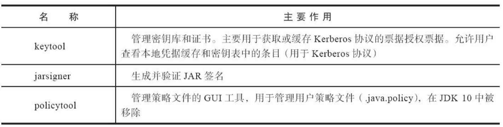


`Java IDL` 与 `RMI-IIOP`：在 `JDK 11` 中结束了十余年的 `CORBA` 支持，这些工具不再提供。


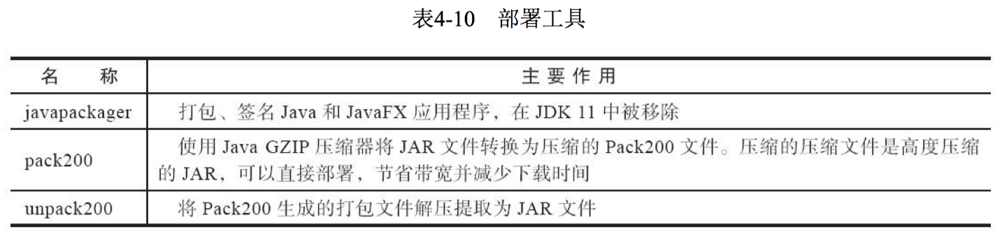


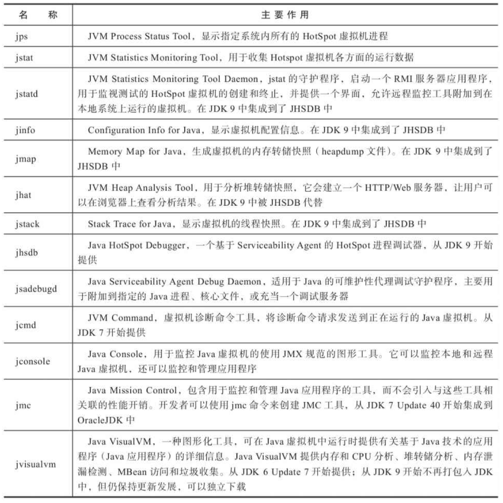

`WebService` 工具：与 `CORBA` 一起在 `JDK 11` 中被移除。

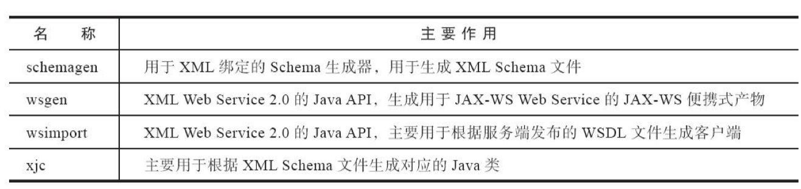

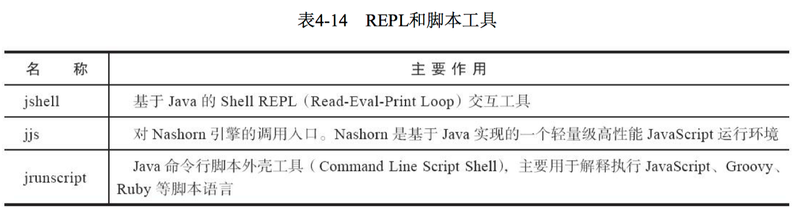

#### 2，可视化故障处理工具

- **JHSDB**：基于服务性代理的调试工具

`JHSDB`是一款基于服务性代理（`Serviceability Agent`，`SA`）实现的进程外调试工具。服务性代理是 `HotSpot` 虚拟机中一组用于映射 `Java` 虚拟机运行信息的、主要基于 `Java` 语言（含少量 `JNI` 代码）实现的 `API` 集合。

`JCMD`、`JHSDB`和基础工具的对比：


查看 `jdk` 本地安装多个版本：

```java
☁  images [interview] ⚡  /usr/libexec/java_home -V

Matching Java Virtual Machines (2):
    11.0.6, x86_64:	"Java SE 11.0.6"	/Library/Java/JavaVirtualMachines/jdk-11.0.6.jdk/Contents/Home
    1.8.0_131, x86_64:	"Java SE 8"	/Library/Java/JavaVirtualMachines/jdk1.8.0_131.jdk/Contents/Home

/Library/Java/JavaVirtualMachines/jdk-11.0.6.jdk/Contents/Home
```

基本使用实例：

1）代码清单4-1 `JHSDB` 测试用例

```java
package com.jvm;


/**
 * JHSDB 测试用例
 * VM Args： -Xmx10M -XX:+UseSerialGC -XX:UseCompressedOops
 * staticObj、instanceObj、localObj存放在哪里？
 *
 * @author zhangbocheng
 * @version v1.0
 * @date 2020/8/11 23:33
 */
public class JhsdbTestCase {

    static class TestCase {
        /**
         * 方法区
         */
        static ObjectHolder staticObj = new ObjectHolder();

        /**
         * Java堆
         */
        ObjectHolder instanceObj = new ObjectHolder();

        void foo() {
            // 局部变量表
            ObjectHolder localObj = new ObjectHolder();
            System.out.println("Done.");
        }
    }

    public static class ObjectHolder {}

    public static void main(String[] args) {
        TestCase testCase = new JhsdbTestCase.TestCase();
        testCase.foo();
    }
}
```

2）`debug`执行后

```bash
# 查看进程ID
☁  ~  jps -l
963 org.jetbrains.jps.cmdline.Launcher
1476 org.jetbrains.jps.cmdline.Launcher
1477 com.jvm.JhsdbTestCase
917
1479 jdk.jcmd/sun.tools.jps.Jps
1144
☁  ~  jhsdb hsdb 1477
# 执行 jhsdb
☁  ~  jhsdb hsdb --pid 1477
```

```bash
Heap Parameters:
Gen 0:   eden [0x0000000124400000,0x000000012459f298,0x00000001246b0000) space capacity = 2818048, 60.343329851017444 used
  from [0x0000000124700000,0x000000012474fff8,0x0000000124750000) space capacity = 327680, 99.99755859375 used
  to   [0x00000001246b0000,0x00000001246b0000,0x0000000124700000) space capacity = 327680, 0.0 usedInvocations: 1

Gen 1:   old  [0x0000000124750000,0x000000012486ed78,0x0000000124e00000) space capacity = 7012352, 16.754777854848133 usedInvocations: 0
```

```bash
scanoops 0x0000000124400000 0x0000000124700000 JhsdbTestCase$ObjectHolder
```

- **JConsole**：`Java`监视与管理控制台

`JConsole`（`Java Monitoring and Management Console`）是一款基于`JMX`（`Java Manage-ment Extensions`）的可视化监视、管理工具。它的主要功能是通过`JMX`的`MBean`（`Managed Bean`）对系统进行信息收集和参数动态调整。

代码清单4-2  `JConsole` 监视用例

```java
package com.jvm;

import java.util.ArrayList;
import java.util.List;

/**
 * JConsole 监视用例
 * 内存占位符对象：一个 OOMObject 大约占64KKB
 * VM Args：-Xms100m -Xmx100m -XX:+UseSerialGC
 *
 * @author zhangbocheng
 * @version v1.0
 * @date 2020/8/13 01:18
 */
public class JconsoleTestCase {

    static class OOMObject {
        public byte[] placeholder = new byte[64 * 1024];
    }

    public static void fillHeap(int num) throws InterruptedException {
        List<OOMObject> list = new ArrayList<>(16);
        for (int i = 0; i < num; i++) {
            Thread.sleep(5000);
            list.add(new OOMObject());
        }

        System.gc();
    }

    public static void main(String[] args) throws Exception {
        fillHeap(1000);
    }
}
```

```bash
☁  ~  /Library/Java/JavaVirtualMachines/jdk1.8.0_131.jdk/Contents/Home/bin/jconsole
```

代码清单4-3 线程等待演示

```java
package com.jvm;

import java.io.BufferedReader;
import java.io.InputStreamReader;

/**
 * 线程等待用例
 *
 * @author zhangbocheng
 * @version v1.0
 * @date 2020/8/13 08:35
 */
public class ThreadWaitingCase {

    /**
     * 线程死循环
     */
    public static void createBusyThread() {
        Thread thread = new Thread(new Runnable() {
            @Override
            public void run() {
                while (true) {

                }
            }
        }, "testBusyThread");
        thread.start();
    }

    /**
     * 线程锁等待
     * @param lock 锁
     */
    public static void createLockThread(final Object lock) {
        Thread thread = new Thread(new Runnable() {
            @Override
            public void run() {
                synchronized (lock) {
                    try {
                        lock.wait();
                    } catch (InterruptedException e) {
                        e.printStackTrace();
                    }
                }
            }
        }, "testLockThread");
        thread.start();
    }

    public static void main(String[] args) throws Exception {
        BufferedReader reader = new BufferedReader(new InputStreamReader(System.in));
        reader.readLine();
        createBusyThread();
        reader.readLine();
        Object obj = new Object();
        createLockThread(obj);
    }
}
```

代码清单4-4 线程死锁演示

```java
package com.jvm;

/**
 * 线程死锁用例
 *
 * @author zhangbocheng
 * @version v1.0
 * @date 2020/8/13 22:57
 */
public class ThreadLockCase {

    /**
     * 线程死锁等待
     */
    static class SynAddRunnable implements Runnable {
        int x, y;
        public SynAddRunnable(int x, int y) {
            this.x = x;
            this.y = y;
        }

        @Override
        public void run() {
            synchronized (Integer.valueOf(x)) {
                synchronized (Integer.valueOf(y)) {
                    System.out.println(x + y);
                }
            }
        }
    }

    public static void main(String[] args) {
        int count = 100;
        for (int i = 0; i < count; i++) {
            new Thread(new SynAddRunnable(1, 2)).start();
            new Thread(new SynAddRunnable(2, 1)).start();
        }
    }
}
```

- **VisualVM**：多合-故障处理工具

`VisualVM（All-in-One Java Troubleshooting Tool）`是功能最强大的运行监视和故障处理程序之一，曾经是`Oracle`官方主力发展的虚拟机故障处理工具。`VisualVM`在`JDK 6 Update 7`中首次发布。

> 显示虚拟机进程以及进程的配置、环境信息（`jps`、`jinfo`）；
>
> 监视应用程序的处理器、垃圾收集、堆、方法区以及线程的信息（`jstat`、`jstack`）；
>
> `dump`以及分析堆转储快照（`jmap`、`jhat`）；
>
> 方法级的程序运行性能分析，找出被调用最多、运行时间最长的方法；
>
> 离线程序快照：收集程序的运行时配置、线程`dump`、内存`dump`等信息建立一个快照，可以将快照发送开发者处进行`Bug`反馈；
>
> 其他插件带来的无限可能性。

- **Java Mission Control**：可持续在线的监控工具

## 五 调优案例分析与实战

#### 1，案例分析

- 大内存硬件上的程序部署策略

监控服务器运行状况后，发现网站失去响应是由**垃圾收集停顿**所导致的，在该系统软硬件条件下，`HotSpot` 虚拟机是以服务端模式运行，默认使用的是**吞吐量优先收集器**，回收`12GB`的`Java`堆，一次`Full GC`的停顿时间就高达14秒。

目前单体应用在较大内存的硬件上主要的部署方式有两种：

> 1）通过一个单独的`Java`虚拟机实例来管理大量的`Java`堆内存；
>
> 2）同时使用若干个`Java`虚拟机，建立逻辑集群来利用硬件资源。

如果计划使用单个`Java`虚拟机实例来管理大内存，还需要考虑下面可能面临的问题：

> 1）回收大块堆内存而导致的长时间停顿，自从`G1`收集器的出现，增量回收得到比较好的应用，这个问题有所缓解，但要到`ZGC`和`Shenandoah`收集器成熟之后才得到相对彻底地解决；
>
> 2）大内存必须有64位`Java`虚拟机的支持，但由于压缩指针、处理器缓存行容量（`Cache Line`）等因素，64位虚拟机的性能测试结果普遍略低于相同版本的32位虚拟机；
>
> 3）必须保证应用程序足够稳定，因为这种大型单体应用要是发生了堆内存溢出，几乎无法产生堆转储快照（要产生十几`GB`乃至更大的快照文件），哪怕成功生成了快照也难以进行分析；如果确实出了问题要进行诊断，可能就必须应用`JMC`这种能够在生产环境中进行的运维工具；
>
> 4）相同的程序在64位虚拟机中消耗的内存一般比32位虚拟机要大，这是由于指针膨胀，以及数据类型对齐补白等因素导致的，可以开启（默认即开启）压缩指针功能来缓解。

- 集群间同步导致的内存溢出

一个基于`B/S`的`MIS`系统，硬件为两台双路处理器、`8GB`内存的`HP`小型机，应用中间件是`WebLogic 9.2`，每台机器启动了3个`WebLogic`实例，构成一个6个节点的亲合式集群。由于是亲合式集群，节点之间没有进行`Session`同步，但是有一些需求要实现部分数据在各个节点间共享。最开始这些数据是存放在数据库中的，但由于读写频繁、竞争很激烈，性能影响较大，后面使用`JBossCache`构建了一个全局缓存。全局缓存启用后，服务正常使用了一段较长的时间。但在最近不定期出现多次的内存溢出问题。

- 堆外内存导致的溢出错误

基于`B/S`的电子考试系统，为了实现客户端能实时地从服务器端接收考试数据，系统使用了逆向`AJAX`技术（也称为`Comet`或者`Server Side Push`），选用`CometD 1.1.1`作为服务端推送框架，服务器是`Jetty 7.1.4`，硬件为一台很普通`PC`机，`Core i5 CPU`，`4GB`内存，运行32位 `Windows`操作系统。测试期间发现服务端不定时抛出内存溢出异常，服务不一定每次都出现异常。网站管理员尝试过把堆内存调到最大，32位系统最多到1.6GB基本无法再加大，而且开大了基本没效果，抛出内存溢出异常好像还更加频繁。加入`-XX： +HeapDumpOnOutOfMemoryError`参数，居然也没有任何反应，抛出内存溢出异常时什么文件都没有 产生。无奈之下只好挂着`jstat`紧盯屏幕，发现垃圾收集并不频繁，`Eden`区、`Survivor`区、老年代以及 法区的内存全部都很稳定，压力并不大，但就是照样不停抛出内存溢出异常。最后，在内存溢出后从系统日志中找到异常堆栈。

- 外部命令导致系统缓慢

每个用户请求的处理都需要执行一个外部`Shell`脚本来获得系统的一些信息。执行这个`Shell`脚本是通过`Java`的`Runtime.getRuntime().exec()`方法来调用的。 这种调用方式可以达到执行`Shell`脚本的目的，但是它在`Java`虚拟机中是非常消耗资源的操作，即使外部命令本身能很快执行完毕，频繁调用时创建进程的开销也会非常可观。Java虚拟机执行这个命令的过程是首先复制一个和当前虚拟机拥有一样环境变量的进程，再用这个新的进程去执行外部命令，最后再退出这个进程。

- 服务器虚拟机进程崩溃

一个基于`B/S`的`MIS`系统，硬件为两台双路处理器、`8GB`内存的`HP`系统，服务器是`WebLogic 9.2`，正常运行一段时间后，最近发现在运行期间频繁出现集群节点的虚拟机进程自动关闭的现象，留下了一个`hs_err_pid###.log`文件后，虚拟机进程就消失了，两台物理机器里的每个节点都出现过进程崩溃的现象。从系统日志中注意到，每个节点的虚拟机进程在崩溃之前，都发生过大量相同的异常。

- 不恰当数据结构导致内存占用过大

一个后台`RPC`服务器，使用64位`Java`虚拟机，内存配置为`-Xms4g-Xmx8g-Xmn1g`，使用`ParNew`加 `CMS` 的收集器组合。平时对外服务的`Minor GC`时间约在30毫秒以内，完全可以接受。但业务上需要每10分钟加载一个约`80MB`的数据文件到内存进行数据分析，这些数据会在内存中形成超过100万个 `HashMap<Long，Long>Entry`，在这段时间里面`Minor GC`就会造成超过500毫秒的停顿。

> 在`HashMap<Long，Long>`结构中，只有`Key`和`Value`所存放的两个长整型数据是有效数据，共16字节（2×8字节）。这两个长整型数据包装成`java.lang.Long`对象之 后，就分别具有8字节的`Mark Word`、8字节的`Klass`指针，再加8字节存储数据的`long`值。然后这2个 `Long`对象组成`Map.Entry`之后，又多了16字节的对象头，然后一个8字节的`next`字段和4字节的`int`型的 `hash`字段，为了对齐，还必须添加4字节的空白填充，最后还有`HashMap`中对这个`Entry`的8字节的引用，这样增加两个长整型数字，实际耗费的内存为`(Long(24byte)×2)+Entry(32byte)+HashMap Ref(8byte)=88byte`，空间效率为有效数据除以全部内存空间，即16字节/88字节=18%。

- 由`Windows`虚拟内存导致的长时间停顿


在`Java`的`GUI`程序中要避免这种现象，可以加入参数“`Dsun.awt.keepWorkingSetOnMinimize=true`”来解决。这个参数在许多`AWT`的程序上都有应用，例如 `JDK`（曾经）自带的`VisualVM`，启动配置文件中就有这个参数，保证程序在恢复最小化时能够立即响应。

- 由安全点导致长时间停顿

```bash
[Times: user=1.51 sys=0.67, real=0.14 secs] 
2019-06-25T 12:12:43.376+0800: 3448319.277: Total time for which application threads were stopped: 2.2645818 second
```

> `user`：进程执行用户态代码所耗费的处理器时间；
>
> `sys`：进程执行核心态代码所耗费的处理器时间；
>
> `rea`l：执行动作从开始到结束耗费的时钟时间。

处理器时间代表的是线程占用处理器一个核心的耗时计数，而时钟时间就是现实世界中的时间计数。如果是单核单线程的场景下，这两者可以认为是等价的，但如果是多核环境下，同一个时钟时间内有多少处理器核心正在工 作，就会有多少倍的处理器时间被消耗和记录下来。

在垃圾收集调优时，我们主要依据`real`时间为目标来优化程序，因为最终用户只关心发出请求到得到响应所花费的时间，也就是响应速度，而不太关心程序到底使用了多少个线程或者处理器来完成任务。

#### 2，实战：Eclipse运行速度调优

## 六 类文件结构

#### 1，无关性的基石

各种不同平台的`Java`虚拟机，以及所有平台都统一支持的程序存储格式——**字节码**（`Byte Code`）是构成**平台无关性**的基石。

实现**语言无关性**的基础是虚拟机和字节码存储格式。`Java`虚拟机不与包括Java语言在内的任何程序语言绑定，它只与“`Class`文件”这种特定的二进制文件格式所关联，`Class`文件中包含了`Java`虚拟机指令集、符号表以及若干其他辅助信息。


#### 2，Class类文件的结构

`Class`文件是一组以8个字节为基础单位的二进制流，各个数据项目严格按照顺序紧凑地排列在文件之中，中间没有添加任何分隔符，这使得整个`Class`文件中存储的内容几乎全部是程序运行的必要数据，没有空隙存在。当遇到需要占用8个字节以上空间的数据项时，则会按照高位在前成若干个8个字节进行存储。

根据《Java虚拟机规范》的规定，`Class`文件格式采用一种类似于`C`语言结构体的伪结构来存储数据，这种伪结构中只有两种数据类型：“**无符号数**”和“**表**”。

> **无符号数**属于基本的数据类型，以`u1`、`u2`、`u4`、`u8`来分别代表1个字节、2个字节、4个字节和8个字节的无符号数，可以用来描述数字、索引引用、数量值或者按照`UTF-8`编码构成字符串值；
>
> **表**是由多个无符号数或者其他表作为数据项构成的复合数据类型，为了便于区分，所有表的命名都习惯性地以“`_info`”结尾。表用于描述有层次关系的复合结构的数据，整个`Class`文件**本质**上也可以视作是一张表，这张表由表6-1所示的数据项按严格顺序排列构成。

<center>表6-1 Class文件格式</center>

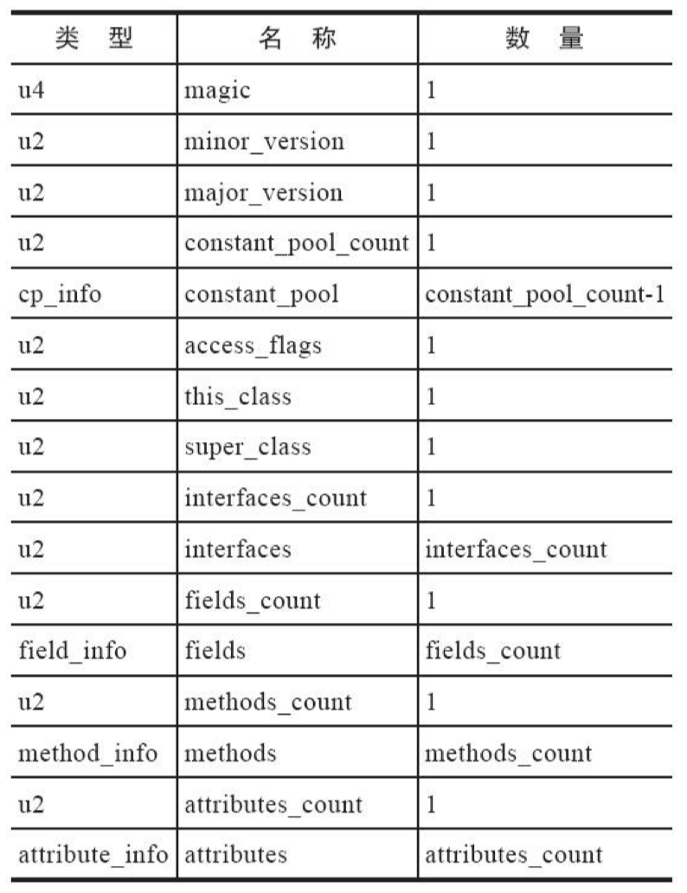

- 魔数

每个`Class`文件的头4个字节被称为**魔数**（`Magic Number`），其唯一作用是确定这个文件是否为一个能被虚拟机接受的`Class`文件。紧接着魔数的4个字节存储的是`Class`文件的版本号：第5和第6个字节是次版本号（`Minor Version`），第7和第8个字节是主版本号（`Major Version`）。`Java`的版本号是从45开始的，`JDK 1.1`之后 的每个`JDK`大版本发布主版本号向上加1（`JDK 1.0～1.1`使用了45.0～45.3的版本号）。

```bash
☁  jvm [interview] ⚡  hexdump -C GCTest.class
00000000  ca fe ba be 00 00 00 37  00 15 0a 00 05 00 12 07  |.......7........|
00000010  00 13 03 00 20 00 00 03  00 40 00 00 07 00 14 01  |.... ....@......|
00000020  00 04 5f 31 4d 42 01 00  01 49 01 00 0d 43 6f 6e  |.._1MB...I...Con|
00000030  73 74 61 6e 74 56 61 6c  75 65 03 00 10 00 00 01  |stantValue......|
00000040  00 06 3c 69 6e 69 74 3e  01 00 03 28 29 56 01 00  |..<init>...()V..|
00000050  04 43 6f 64 65 01 00 0f  4c 69 6e 65 4e 75 6d 62  |.Code...LineNumb|
00000060  65 72 54 61 62 6c 65 01  00 04 6d 61 69 6e 01 00  |erTable...main..|
00000070  16 28 5b 4c 6a 61 76 61  2f 6c 61 6e 67 2f 53 74  |.([Ljava/lang/St|
00000080  72 69 6e 67 3b 29 56 01  00 0a 53 6f 75 72 63 65  |ring;)V...Source|
00000090  46 69 6c 65 01 00 0b 47  43 54 65 73 74 2e 6a 61  |File...GCTest.ja|
000000a0  76 61 0c 00 0a 00 0b 01  00 0e 63 6f 6d 2f 6a 76  |va........com/jv|
000000b0  6d 2f 47 43 54 65 73 74  01 00 10 6a 61 76 61 2f  |m/GCTest...java/|
000000c0  6c 61 6e 67 2f 4f 62 6a  65 63 74 00 21 00 02 00  |lang/Object.!...|
000000d0  05 00 00 00 01 00 1a 00  06 00 07 00 01 00 08 00  |................|
000000e0  00 00 02 00 09 00 02 00  01 00 0a 00 0b 00 01 00  |................|
000000f0  0c 00 00 00 1d 00 01 00  01 00 00 00 05 2a b7 00  |.............*..|
00000100  01 b1 00 00 00 01 00 0d  00 00 00 06 00 01 00 00  |................|
00000110  00 0a 00 09 00 0e 00 0f  00 01 00 0c 00 00 00 3e  |...............>|
00000120  00 01 00 05 00 00 00 16  12 03 bc 08 4c 12 03 bc  |............L...|
00000130  08 4d 12 03 bc 08 4e 12  04 bc 08 3a 04 b1 00 00  |.M....N....:....|
00000140  00 01 00 0d 00 00 00 16  00 05 00 00 00 10 00 05  |................|
00000150  00 11 00 0a 00 12 00 0f  00 13 00 15 00 14 00 01  |................|
00000160  00 10 00 00 00 02 00 11                           |........|
00000168
```

```bash
☁  jvm [interview] ⚡  javap -verbose GCTest
警告: 文件 ./GCTest.class 不包含类 GCTest
Classfile /home/projects/java_pro/java_projects/interview/src/main/java/com/jvm/GCTest.class
  Last modified 2020年8月15日; size 360 bytes
  MD5 checksum f362bf05a49a6afff1b198be515746f6
  Compiled from "GCTest.java"
public class com.jvm.GCTest
  minor version: 0
  major version: 55
  flags: (0x0021) ACC_PUBLIC, ACC_SUPER
  this_class: #2                          // com/jvm/GCTest
  super_class: #5                         // java/lang/Object
  interfaces: 0, fields: 1, methods: 2, attributes: 1
Constant pool:
   #1 = Methodref          #5.#18         // java/lang/Object."<init>":()V
   #2 = Class              #19            // com/jvm/GCTest
   #3 = Integer            2097152
   #4 = Integer            4194304
   #5 = Class              #20            // java/lang/Object
   #6 = Utf8               _1MB
   #7 = Utf8               I
   #8 = Utf8               ConstantValue
   #9 = Integer            1048576
  #10 = Utf8               <init>
  #11 = Utf8               ()V
  #12 = Utf8               Code
  #13 = Utf8               LineNumberTable
  #14 = Utf8               main
  #15 = Utf8               ([Ljava/lang/String;)V
  #16 = Utf8               SourceFile
  #17 = Utf8               GCTest.java
  #18 = NameAndType        #10:#11        // "<init>":()V
  #19 = Utf8               com/jvm/GCTest
  #20 = Utf8               java/lang/Object
{
  public com.jvm.GCTest();
    descriptor: ()V
    flags: (0x0001) ACC_PUBLIC
    Code:
      stack=1, locals=1, args_size=1
         0: aload_0
         1: invokespecial #1                  // Method java/lang/Object."<init>":()V
         4: return
      LineNumberTable:
        line 10: 0

  public static void main(java.lang.String[]);
    descriptor: ([Ljava/lang/String;)V
    flags: (0x0009) ACC_PUBLIC, ACC_STATIC
    Code:
      stack=1, locals=5, args_size=1
         0: ldc           #3                  // int 2097152
         2: newarray       byte
         4: astore_1
         5: ldc           #3                  // int 2097152
         7: newarray       byte
         9: astore_2
        10: ldc           #3                  // int 2097152
        12: newarray       byte
        14: astore_3
        15: ldc           #4                  // int 4194304
        17: newarray       byte
        19: astore        4
        21: return
      LineNumberTable:
        line 16: 0
        line 17: 5
        line 18: 10
        line 19: 15
        line 20: 21
}
SourceFile: "GCTest.java"
```

- 常量池

紧接着主、次版本号之后的是**常量池入口**，常量池可以比喻为 `Class` 文件里的资源仓库，它是 `Class` 文件结构中与其他项目关联最多的数据，通常也是占用 `Class` 文件空间最大的数据项目之一。

由于常量池中常量的数量是不固定的，所以在常量池的入口需要放置一项`u2`类型的数据，代表常量池容量计数值（`constant_pool_count`），其计数是从1而不是0开始的，如（上述例子），常量池容量（偏移地址：0x00000008）为十六进制数0x0015，即十进制的21，代表常量池中有20项常量，索引值范围为1～20。

常量池中主要存放两大类常量：**字面量**（`Literal`）和**符号引用**（`Symbolic References`）。字面量比较接近于`Java`语言层面的常量概念，如文本字符串、被声明为`final`的常量值等。而符号引用则属于编译原理方面的概念，主要包括：

> 被模块导出或者开放的包（`Package`） 
>
> 类和接口的全限定名（`Fully Qualified Name`） 
>
> 字段的名称和描述符（`Descriptor`） 
>
> 方法的名称和描述符 
>
> 方法句柄和方法类型（`Method Handle`、`Method Type`、`Invoke Dynamic`） 
>
> 动态调用点和动态常量（`Dynamically-Computed Call Site`、`Dynamically-Computed Constant`） 

常量池中每一项常量都是一个表，最初常量表中共有11种结构各不相同的表结构数据，后来为了更好地支持动态语言调用，额外增加了4种动态语言相关的常量，为了支持`Java`模块化系统 （`Jigsaw`），又加入了`CONSTANT_Module_info`和`CONSTANT_Package_info`两个常量，所以截至`JDK 13`，常量表中分别有17种不同类型的常量。其共同的特点是，表结构起始的第一位是个`u1`类型的标志位（`tag`），代表着当前常量属于哪种常量类型。


- 访问标志

在常量池结束之后，紧接着的2个字节代表访问标志（`access_flags`），用于识别一些类或者接口层次的访问信息，包括：这个`Class`是类还是接口；是否定义为`public`类型；是否定义为`abstract` 类型；如果是类的话，是否被声明为`final`；等等。


- 类索引、父类索引与接口索引集合

类索引（`this_class`）和父类索引（`super_class`）都是一个`u2`类型的数据，而接口索引集合 （`interfaces`）是一组`u2`类型的数据的集合，`Class`文件中由这三项数据来确定该类型的继承关系。类索 引用于确定这个类的全限定名，父类索引用于确定这个类的父类的全限定名。

代码清单6-1 类文件结构测试用例

```java
package com.jvm;

/**
 * 类文件结构测试用例
 *
 * @author zhangbocheng
 * @version v1.0
 * @date 2020/8/15 12:28
 */
public class ClassTest {

    private int number;

    public int increase() {
        return number + 1;
    }
}
```


- 字段表集合

字段表（`field_info`）用于描述接口或者类中声明的变量。`Java`语言中的“字段”（`Field`）包括类级变量以及实例级变量，但不包括在方法内部声明的局部变量。

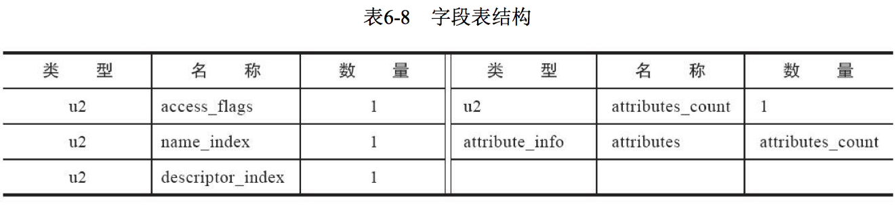

字段修饰符放在`access_flags`项目中，是一个`u2`的数据类型。


由于语法规则的约束，`ACC_PUBLIC`、`ACC_PRIVATE` 、`ACC_PROTECTED` 三个标志最多只能选择其一，`ACC_FINAL`、`ACC_VOLATILE` 不能同时选择。接口之中的字段必须有 `ACC_PUBLIC`、`ACC_STATIC`、`ACC_FINAL`  标志，这些都是由 `Java` 本身的语言规则所导致的。

跟随 `access_flags` 标志的是两项索引值：`name_index` 和 `descriptor_index`。它们都是对常量池项的引用，分别代表着字段的简单名称以及字段和方法的描述符。

全限定名和简单名称：以代码清单6-1中的代码为例，“`com/jvm/ClassTest`”是这个类的**全限定名**，仅仅是把类全名中的“.”替换成了“/”而已，为了使连续的多个全限定名之间不产生混淆，在使用时最后一般会加入一个“；”号表示全限定名结束；**简单名称**则是指没有类型和参数修饰的方法或者字段名称，这个类中的 `increase()` 方法和 `number` 字段的简单名称分别就是“`increase`”和“`number`”。

**描述符**的作用是用来描述字段的数据类型、方法的参数列表（包括数量、类型以及顺序）和返回值。根据描述符规则，基本数据类型（`byte`、`char`、`double`、`float`、`int`、`long`、`short`、`boolean`）以及代表无返回值的`void`类型都用一个大写字符来表示，而对象类型则用字符`L`加对象的全限定名来表示。

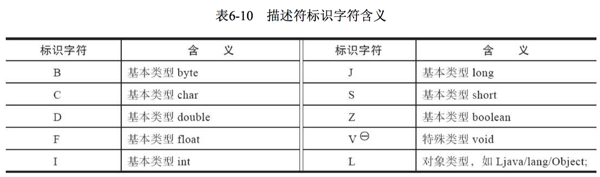

对于**数组类型**，每一维度将使用一个前置的“[”字符来描述，如一个定义为“`java.lang.String[][]`”类型的二维数组将被记录成“`[[Ljava/lang/String；`”，一个整型数组“`int[]`”将被记录成“`[I`”。

用描述符来描述**方法**时，按照先参数列表、后返回值的顺序描述，参数列表按照参数的严格顺序放在一组小括号“`()`”之内。如方法 `void inc()` 的描述符为“`()V`”；方法 `java.lang.String toString()` 的描述符 为“`()Ljava/lang/String；`”；方法 `int indexOf(char[]source，int sourceOffset，int sourceCount，char[]target， int targetOffset，int targetCount，int fromIndex)` 的描述符为“`([CII[CIII)I`”。

- 方法表集合

方法表的结构依次包括访问标志（`access_flags`）、名称索引（`name_index`）、描述符索引（`descriptor_index`）、属性表 集合（`attributes`）。

在`Java`语言中，要重载（`Overload`）一个方法，除了要与原方法具有相同的简单名称之外，还要求必须拥有一个与原方法不同的特征签名。**特征签名**是指一个方法中各个参数在常量池中的字段符号引用的集合。如果两个方法有相同的名称和特征签名，但返回值不同，那么也是可以合法共存于同一个`Class`文件中的。


- 属性表集合

属性表（`attribute_info`），`Class`文件、字段表、方法表都可以携带自己的属性表集合，以描述某些场景专有的信息。

对于每一个属性，它的名称都要从常量池中引用一个`CONSTANT_Utf8_info`类型的常量来表示， 而属性值的结构则是完全自定义的，只需要通过一个`u4`的长度属性去说明属性值所占用的位数即可。


1）`Code`属性

`Java` 程序方法体里面的代码经过 `Javac` 编译器处理之后，最终变为字节码指令存储在 `Code` 属性内。`Code` 属性出现在方法表的属性集合之中，但并非所有的方法表都必须存在这个属性，如接口或者抽象类中的方法就不存在`Code`属性。

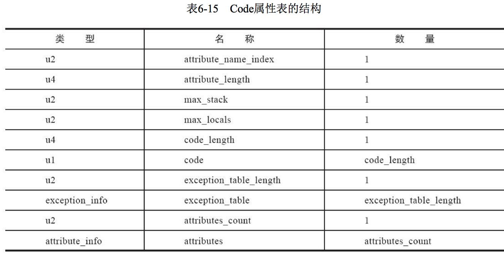

**说明**：

> `attribute_name_index` 是一项指向 `CONSTANT_Utf8_info` 型常量的索引，此常量值固定为“`Code`”，它 代表了该属性的属性名称；
>
> `attribute_length`指示了属性值的长度，由于属性名称索引与属性长度一共为6个字节，所以属性值的长度固定为整个属性表长度减去6个字节；
>
> `max_stack` 代表了操作数栈（`Operand Stack`）深度的最大值。在方法执行的任意时刻，操作数栈都 不会超过这个深度。虚拟机运行的时候需要根据这个值来分配栈帧（`Stack Frame`）中的操作栈深度；
>
> `max_locals` 代表了局部变量表所需的存储空间，单位是变量槽（`Slot`），**变量槽**是虚拟机为局部变量分配内存所使用的最小单位；
>
> `code_length`和`code`用来存储`Java`源程序编译后生成的字节码指令。`code_length`代表字节码长度，` code`是用于存储字节码指令的一系列字节流。**字节码指令**，顾名思义每个指令就是一个`u1`类型的单字节，当虚拟机读取到`code`中的一个字节码时，就可以对应找出这个字节码代表的是什么指令，并且可以知道这条指令后面是否需要跟随参数，以及后续的参数应当如何解析。

字节码分析：

```bash
☁  java [interview] ⚡  jjavap -verbose com.jvm.ClassTest                   
Classfile /home/projects/java_pro/java_projects/interview/src/main/java/com/jvm/ClassTest.class
  Last modified 2020年8月15日; size 293 bytes
  MD5 checksum 61e56613c3b29b394a1ea4dbdc0aca53
  Compiled from "ClassTest.java"
public class com.jvm.ClassTest
  minor version: 0
  major version: 55
  flags: (0x0021) ACC_PUBLIC, ACC_SUPER
  this_class: #3                          // com/jvm/ClassTest
  super_class: #4                         // java/lang/Object
  interfaces: 0, fields: 1, methods: 2, attributes: 1
Constant pool:
   #1 = Methodref          #4.#15         // java/lang/Object."<init>":()V
   #2 = Fieldref           #3.#16         // com/jvm/ClassTest.number:I
   #3 = Class              #17            // com/jvm/ClassTest
   #4 = Class              #18            // java/lang/Object
   #5 = Utf8               number
   #6 = Utf8               I
   #7 = Utf8               <init>
   #8 = Utf8               ()V
   #9 = Utf8               Code
  #10 = Utf8               LineNumberTable
  #11 = Utf8               increase
  #12 = Utf8               ()I
  #13 = Utf8               SourceFile
  #14 = Utf8               ClassTest.java
  #15 = NameAndType        #7:#8          // "<init>":()V
  #16 = NameAndType        #5:#6          // number:I
  #17 = Utf8               com/jvm/ClassTest
  #18 = Utf8               java/lang/Object
{
  public com.jvm.ClassTest();
    descriptor: ()V
    flags: (0x0001) ACC_PUBLIC
    Code:
      stack=1, locals=1, args_size=1
         0: aload_0
         1: invokespecial #1                  // Method java/lang/Object."<init>":()V
         4: return
      LineNumberTable:
        line 10: 0

  public int increase();
    descriptor: ()I
    flags: (0x0001) ACC_PUBLIC
    Code:
      stack=2, locals=1, args_size=1
         0: aload_0
         1: getfield      #2                  // Field number:I
         4: iconst_1
         5: iadd
         6: ireturn
      LineNumberTable:
        line 15: 0
}
SourceFile: "ClassTest.java"
```

这个类有两个方法——实例构 造器`<init>()`和`increase()`，这两个方法很明显都是没有参数的，为什么`args_size`会为1？而且无论是在参数列表里还是方法体内，都没有定义任何局部变量，那`locals`又为什么会等于1？

答案：在任何实例方法里面，都可以通过“`this`”关键字访问到此方法所属的对象。在实例方法的局部变量表中至少会存在一个指向当前对象实例的局部变量，局部变量表中也会预留出第一个变量槽位来存放对象实例的引用，所以实例方法参数值从1开始计算。

如果存在异常表，它应该包含四个字段，这些字段的含义为：如果当字节码从第`start_pc`行到第`end_pc`行之间（不含第`end_pc`行）出现了类型为`catch_type`或者其子类的异常（`catch_type`为指向一个`CONSTANT_Class_info`型常量的索引），则转到第`handler_pc`行继续处理。当 `catch_type` 的值为0时，代表任意异常情况都需要转到`handler_pc`处进行处理。


代码清单6-2 异常表运作实例

```java
package com.jvm;

/**
 * 异常表运作实例
 *
 * @author zhangbocheng
 * @version v1.0
 * @date 2020/8/16 13:30
 */
public class ExceptionInstance {

    private static int getNumber() {
        int x;
        try {
            x = 1;
            return x;
        } catch (Exception e) {
            x = 2;
            return x;
        } finally {
            x = 3;
            System.out.println(x);
        }
    }

    public static void main(String[] args) {
        System.out.println(getNumber());
    }
}
```

编译后，字节码为：

```bash
☁  java [interview] ⚡  /Library/Java/JavaVirtualMachines/jdk1.8.0_131.jdk/Contents/Home/bin/javap -verbose com.jvm.ExceptionInstance 
Classfile /home/projects/java_pro/java_projects/interview/src/main/java/com/jvm/ExceptionInstance.class
  Last modified 2020-8-16; size 680 bytes
  MD5 checksum 4de130fcf098363c0f055a0a1b2fa81d
  Compiled from "ExceptionInstance.java"
public class com.jvm.ExceptionInstance
  minor version: 0
  major version: 52
  flags: ACC_PUBLIC, ACC_SUPER
Constant pool:
   #1 = Methodref          #7.#21         // java/lang/Object."<init>":()V
   #2 = Fieldref           #22.#23        // java/lang/System.out:Ljava/io/PrintStream;
   #3 = Methodref          #24.#25        // java/io/PrintStream.println:(I)V
   #4 = Class              #26            // java/lang/Exception
   #5 = Methodref          #6.#27         // com/jvm/ExceptionInstance.getNumber:()I
   #6 = Class              #28            // com/jvm/ExceptionInstance
   #7 = Class              #29            // java/lang/Object
   #8 = Utf8               <init>
   #9 = Utf8               ()V
  #10 = Utf8               Code
  #11 = Utf8               LineNumberTable
  #12 = Utf8               getNumber
  #13 = Utf8               ()I
  #14 = Utf8               StackMapTable
  #15 = Class              #26            // java/lang/Exception
  #16 = Class              #30            // java/lang/Throwable
  #17 = Utf8               main
  #18 = Utf8               ([Ljava/lang/String;)V
  #19 = Utf8               SourceFile
  #20 = Utf8               ExceptionInstance.java
  #21 = NameAndType        #8:#9          // "<init>":()V
  #22 = Class              #31            // java/lang/System
  #23 = NameAndType        #32:#33        // out:Ljava/io/PrintStream;
  #24 = Class              #34            // java/io/PrintStream
  #25 = NameAndType        #35:#36        // println:(I)V
  #26 = Utf8               java/lang/Exception
  #27 = NameAndType        #12:#13        // getNumber:()I
  #28 = Utf8               com/jvm/ExceptionInstance
  #29 = Utf8               java/lang/Object
  #30 = Utf8               java/lang/Throwable
  #31 = Utf8               java/lang/System
  #32 = Utf8               out
  #33 = Utf8               Ljava/io/PrintStream;
  #34 = Utf8               java/io/PrintStream
  #35 = Utf8               println
  #36 = Utf8               (I)V
{
  public com.jvm.ExceptionInstance();
    descriptor: ()V
    flags: ACC_PUBLIC
    Code:
      stack=1, locals=1, args_size=1
         0: aload_0
         1: invokespecial #1                  // Method java/lang/Object."<init>":()V
         4: return
      LineNumberTable:
        line 10: 0

  public static void main(java.lang.String[]);
    descriptor: ([Ljava/lang/String;)V
    flags: ACC_PUBLIC, ACC_STATIC
    Code:
      stack=2, locals=1, args_size=1
         0: getstatic     #2                  // Field java/lang/System.out:Ljava/io/PrintStream;
         3: invokestatic  #5                  // Method getNumber:()I
         6: invokevirtual #3                  // Method java/io/PrintStream.println:(I)V
         9: return
      LineNumberTable:
        line 27: 0
        line 28: 9
}
SourceFile: "ExceptionInstance.java"
```

2） `Exceptions` 属性

`Exceptions` 属性的作用是列举出方法中可能抛出的受查异常（`Checked Excepitons`），也 就是方法描述时在`throws`关键字后面列举的异常。


3）`LineNumberTable`属性

`LineNumberTable`属性用于描述`Java`源码行号与字节码行号（字节码的偏移量）之间的对应关系。

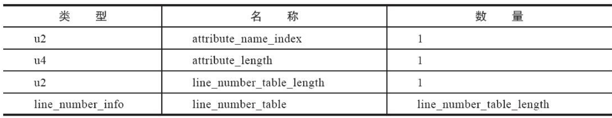

4）`LocalVariableTable`及`LocalVariableTypeTable`属性

`LocalVariableTable`属性用于描述栈帧中局部变量表的变量与`Java`源码中定义的变量之间的关系，它也不是运行时必需的属性，但默认会生成到`Class`文件之中，可以在`Javac`中使用`-g：none`或`-g：vars`选项来取消或要求生成这项信息。如果没有生成这项属性，最大的影响就是当其他人引用这个方法时，所有的参数名称都将会丢失。

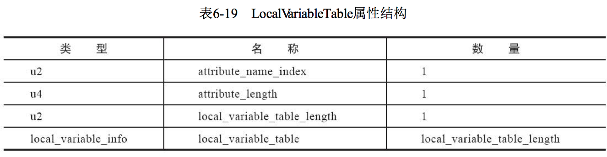


**说明**：

> `start_pc` 和 `length` 属性分别代表了这个局部变量的生命周期开始的字节码偏移量及其作用范围覆盖的长度，两者结合起来就是这个局部变量在字节码之中的作用域范围；
>
> `name_index`和`descriptor_index`都是指向常量池中`CONSTANT_Utf8_info`型常量的索引，分别代表了局部变量的名称以及这个局部变量的描述符；
>
> `index`是这个局部变量在栈帧的局部变量表中变量槽的位置。当这个变量数据类型是64位类型时 （`double`和`long`），它占用的变量槽为`index`和`index+1`两个。
>
> 在`JDK 5`引入泛型之后，`LocalVariableTable`属性增加了一个“姐妹属性”—`LocalVariableTypeTable`，仅仅是把记录的字段描述符的`descriptor_index`替换成了字段的特征签名（`Signature`）。
>

5）`SourceFile`及`SourceDebugExtension`属性

`SourceFile`属性用于记录生成这个`Class`文件的源码文件名称。这个属性也是可选的，可以使用`Javac` 的`-g：none`或`-g：source`选项来关闭或要求生成这项信息。

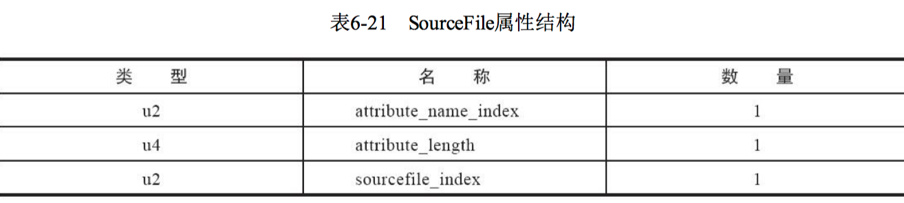

**说明**：

> `sourcefile_index`数据项是指向常量池中`CONSTANT_Utf8_info`型常量的索引，常量值是源码文件的文件名。

在`JDK 5`时，新增了 `SourceDebugExtension` 属性用于存储额外的代码调试信息。典型的场景是在进行`JSP`文件调试时，无法通过`Java`堆栈来定位到`JSP`文件的行号。


**说明**：

> `debug_extension`存储的就是额外的调试信息，是一组通过变长`UTF-8`格式来表示的字符串。一 个类中最多只允许存在一个`SourceDebugExtension`属性。

6）`ConstantValue`属性

`Cons ConstantValue`属性的作用是通知虚拟机自动为静态变量赋值。只有被`static`关键字修饰的变量（类变量）才可以使用这项属性。

> 对非static类型的变量（也就是 实例变量）的赋值是在实例构造器`<init>()`方法中进行的；而对于类变量，则有两种方式可以选择：在 类构造器`<clinit>()`方法中或者使用`ConstantValue`属性。


7）`InnerClasses`属性

`InnerClasses`属性用于记录内部类与宿主类之间的关联。如果一个类中定义了内部类，那编译器将会为它以及它所包含的内部类生成`InnerClasses`属性。

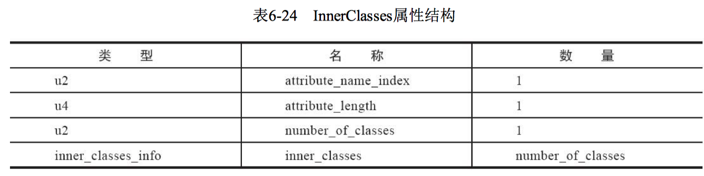

数据项`number_of_classes`代表需要记录多少个内部类信息，每一个内部类的信息都由一个 `inner_classes_info` 表进行描述。


**说明**：

> `inner_class_info_index`和`outer_class_info_index`都是指向常量池中`CONSTANT_Class_info`型常量的索 引，分别代表了内部类和宿主类的符号引用；
>
> `inner_name_index`是指向常量池中`CONSTANT_Utf8_info`型常量的索引，代表这个内部类的名称，如果是匿名内部类，这项值为0；
>
> `inner_class_access_flags`是内部类的访问标志，类似于类的`access_flags`。


8）`Deprecated`及`Synthetic`属性

`Deprecated`和`Synthetic`两个属性都属于标志类型的布尔属性，只存在有和没有的区别，没有属性值的概念。

`Deprecated`属性用于表示某个类、字段或者方法，已经被程序作者定为不再推荐使用，它可以通过代码中使用“`@deprecated`”注解进行设置。

`Synthetic` 属性代表此字段或者方法并不是由`Java`源码直接产生的，而是由编译器自行添加的，在 `JDK 5` 之后，标识一个类、字段或者方法是编译器自动产生的，也可以设置它们访问标志中的 `ACC_SYNTHETIC` 标志位。


**说明**：

> `attribute_length`数据项的值必须为`0x00000000`，因为没有任何属性值需要设置。

9）`StackMapTable`属性 

`StackMapTable`属性在`JDK 6`增加到`Class`文件规范之中，它是一个相当复杂的变长属性，位于`Code` 属性的属性表中。这个属性会在虚拟机类加载的字节码验证阶段被新类型检查验证器（`Type Checker`）使用，目的在于代替以前比较消耗性能的基于数据流分析的 类型推导验证器。这个类型检查验证器最初来源于`Sheng Liang`实现为`Jav ME CLDC`实现的字节码验证器。

`StackMapTable`属性中包含零至多个栈映射帧（`Stack Map Frame`），每个栈映射帧都显式或隐式地代表了一个字节码偏移量，用于表示执行到该字节码时局部变量表和操作数栈的验证类型。


10）`Signature`属性

`Signature`属性在`JDK 5`增加到`Class`文件规范之中，它是一个可选的定长属性，可以出现于类、字段 表和方法表结构的属性表中。


11）`BootstrapMethods`属性 

`BootstrapMethods`属性在`JDK 7`时增加到`Class`文件规范之中，它是一个复杂的变长属性，位于类文件的属性表中。这个属性用于保存`invokedynamic`指令引用的引导方法限定符。


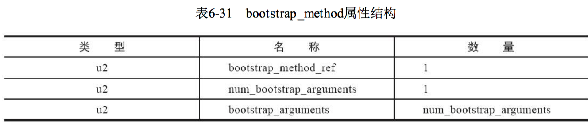

**说明**：

> `bootstrap_method_ref` ：值必须是一个对常量池的有效索引。常量池在该索引处的值必须是一个`CONSTANT_MethodHandle_info`结构；
>
> `num_bootstrap_arguments`：值给出了`bootstrap_argu-ments[]` 数组成员的数量；
>
> `bootstrap_arguments[]`：数组的每个成员必须是一个对常量池的有效索引。 常量池在该索引出必须是下列结构之一：`CONSTANT_String_info`、`CONSTANT_Class_info`、 `CONSTANT_Integer_info`、`CONSTANT_Long_info`、`CONSTANT_Float_info`、 `CONSTANT_Double_info`、`CONSTANT_MethodHandle_info` 或 `CONSTANT_MethodType_info`。

12） `MethodParameters`属性 

`MethodParameters`是在`JDK 8`时新加入到`Class`文件格式中的，它是一个用在方法表中的变长属性。 `MethodParameters`的作用是记录方法的各个形参名称和信息。


**说明**：

> `name_index`是一个指向常量池`CONSTANT_Utf8_info`常量的索引值，代表了该参数的名称。而`access_flags`是参数的状态指示器，它可以包含以下三种状态中的一种或多种：
>
> > `0x0010（ACC_FINAL）`：表示该参数被`final`修饰；
> >
> > `0x1000（ACC_SYNTHETIC）`：表示该参数并未出现在源文件中，是编译器自动生成的；
> >
> > `0x8000（ACC_MANDATED）`：表示该参数是在源文件中隐式定义的。`Java`语言中的典型场景是 `this` 关键字。

13）模块化相关属性

`JDK 9`的一个重量级功能是`Java`的模块化功能，因为模块描述文件（`module-info.java`）最终是要编译成一个独立的`Class`文件来存储的，所以，`Class`文件格式也扩展了`Module`、`ModulePackages`和 `ModuleMainClass` 三个属性用于支持`Java`模块化相关功能。

`Module`属性是一个非常复杂的变长属性，除了表示该模块的名称、版本、标志信息以外，还存储 了这个模块 `requires`、`exports`、`opens`、`uses`和`provides`定义的全部内容。

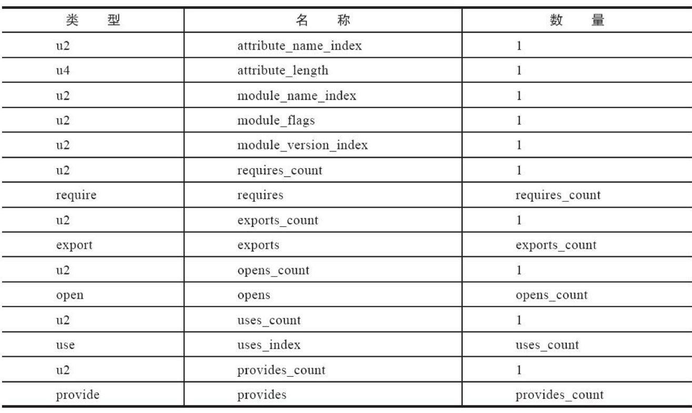

**说明**：

> `module_name_index`是一个指向常量池`CONSTANT_Utf8_info`常量的索引值，代表了该模块的名称；
>
> `module_flags`是模块的状态指示器，它可以包含以下三种状态中的一种或多种： 
>
> > `0x0020（ACC_OPEN）`：表示该模块是开放；
> >
> > `0x1000（ACC_SYNTHETIC）`：表示该模块并未出现在源文件中，是编译器自动生成的； 
> >
> > `0x8000（ACC_MANDATED）`：表示该模块是在源文件中隐式定义的。
>
>  `module_version_index`是一个指向常量池`CONSTANT_Utf8_info`常量的索引值，代表了该模块的版本号。


**说明**：

> `exports`属性的每一元素都代表一个被模块所导出的包；
>
> `exports_index`是一个指向常量池 `CONSTANT_Package_info` 常量的索引值，代表了被该模块导出的包；
>
> `exports_flags`是该导出包的状态指示器，它可以包含以下两种状态中的一种或多种：
>
> > `0x1000（ACC_SYNTHETIC）`：表示该导出包并未出现在源文件中，是编译器自动生成的；
> >
> > `0x8000（ACC_MANDATED）`：表示该导出包是在源文件中隐式定义的。
>
> `exports_to_count`是该导出包的限定计数器，如果这个计数器为零，这说明该导出包是无限定的 （`Unqualified`），即完全开放的，任何其他模块都可以访问该包中所有内容。如果该计数器不为零， 则后面的`exports_to_index`是以计数器值为长度的数组，每个数组元素都是一个指向常量池中 `CONSTANT_Module_info`常量的索引值，代表着只有在这个数组范围内的模块才被允许访问该导出包的内容。

`ModulePackages`是用于支持Java模块化的变长属性，它用于描述该模块中所有的包，不论是不是被`export`或者`open`的。


`ModuleMainClass` 属性是一个定长属性，用于确定该模块的主类（`Main Class`）。


14）运行时注解相关

`RuntimeVisibleAnnotations`是一个变长属性，它记录了类、字段或方法的声明上记录运行时可见注解，当我们使用反射`API`来获取类、字段或方法上的注解时，返回值就是通过这个属性来取到的。

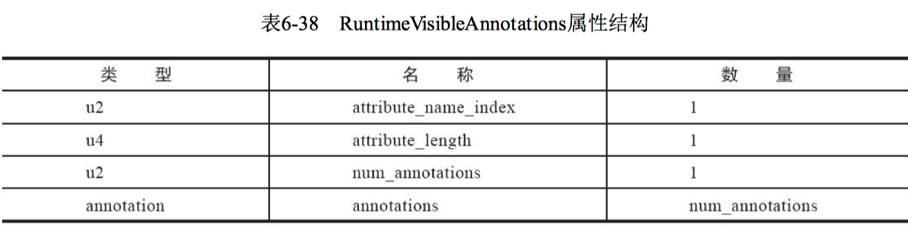


#### 3，字节码指令

`Java`虚拟机的**指令**由一个字节长度的、代表着某种特定操作含义的数字（称为操作码，`Opcode`） 以及跟随其后的零至多个代表此操作所需的参数（称为操作数，`Operand`）构成。

- 字节码与数据类型

对于大部分与数据类型相关的**字节码指令**，它们的操作码助记符中都有特殊的字符来表明专门为哪种数据类型服务：`i`代表对`int`类型的数据操作，`l`代表`long`，`s`代表`short`，`b`代表`byte`，`c`代表`char`，`f`代表 `float`，`d`代表`double`，`a`代表`reference`；也有一些指令的助记符中没有明确指明操作类型的字母，如 ·arraylength· 指令，它没有代表数据类型的特殊字符，但操作数永远只能是一个数组类型的对象；还有另 外一些指令，如无条件跳转指令`goto`则是与数据类型无关的指令。

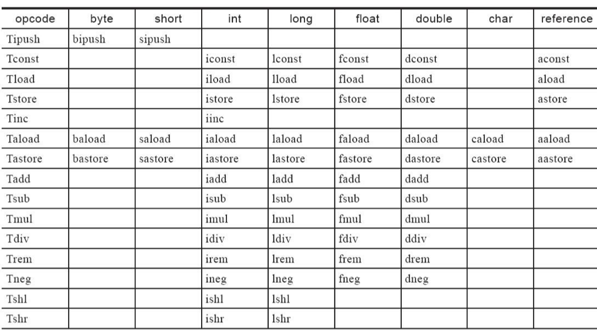

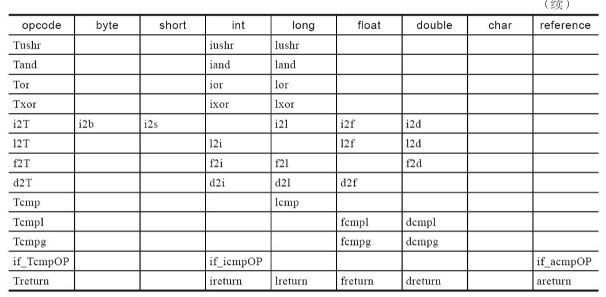

- 加载和存储指令

**加载和存储指令** 用于将数据在栈帧中的局部变量表和操作数栈之间来回传输，这类指令包括：

> 将一个局部变量加载到操作栈：`iload、iload_<n>、lload、lload_<n>、fload、fload_<n>、dload、 dload_<n>、aload、aload_<n>`；
>
> 将一个数值从操作数栈存储到局部变量表：`istore、istore_<n>、lstore、lstore_<n>、fstore、 fstore_<n>、dstore、dstore_<n>、astore、astore_<n>`；
>
> 将一个常量加载到操作数栈：`bipush、sipush、ldc、ldc_w、ldc2_w、aconst_null、iconst_m1、 iconst_<i>、lconst_<l>、fconst_<f>、dconst_<d>`；
>
> 扩充局部变量表的访问索引的指令：`wide`

- 运算指令

**算术指令**用于对两个操作数栈上的值进行某种特定运算，并把结果重新存入到操作栈顶。大体上运算指令可以分为两种：

> 对整型数据进行运算的指令：
>
> 对浮点型数据进行运算的指令。
>
> 不存在直接支持`byte`、`short`、`char`和`boolean`类型的算术指令，应使用操作`int`类型的指令代替。

所有的算术指令包括：

> 加法指令：`iadd、ladd、fadd、dadd`；
>
> 减法指令：`isub、lsub、fsub、dsub`； 
>
> 乘法指令：`imul、lmul、fmul、dmul`；
>
> 除法指令：`idiv、ldiv、fdiv、ddiv`；
>
> 求余指令：`irem、lrem、frem、drem`；
>
> 取反指令：`ineg、lneg、fneg、dneg`；
>
> 位移指令：`ishl、ishr、iushr、lshl、lshr、lushr`；
>
> 按位或指令：`ior、lor`；
>
> 按位与指令：`iand、land`；
>
> 按位异或指令：`ixor、lxor`；
>
> 局部变量自增指令：`iinc`；
>
> 比较指令：`dcmpg、dcmpl、fcmpg、fcmpl、lcmp`

- 类型转换指令

**类型转换指令**可以将两种不同的数值类型相互转换，这些转换操作一般用于实现用户代码中的显式类型转换操作，或者用来处理字节码指令集中数据类型相关指令无法与数据类型 一一对应的问题。

`Java`虚拟机直接支持（即转换时无须显式的转换指令）以下数值类型的**宽化类型转换**（`Widening Numeric Conversion`，即小范围类型向大范围类型的安全转换）：

> `int`类型到`long`、`float`或者`double`类型
>
> `long`类型到`float`、`double`类型 
>
> `float`类型到`double`类型

处理**窄化类型转换**（`Narrowing Numeric Conversion`）时，就必须显式地使用转换指令来完成，这些转换指令包括`i2b`、`i2c`、`i2s`、`l2i`、`f2i`、`f2l`、`d2i`、`d2l`和`d2f`。窄化类型转换可能会导致转换结果产生不同的正负号、不同的数量级的情况，转换过程很可能会导致数值的精度丢失。

- 对象创建与访问指令

`Java`虚拟机对类实例和数组的创建与操作使用了不同的字节码指令。对象创建后，就可以通过**对象访问指令**获取对象实例或者数组实例中的字段或者数组元素，这些指令包括：

> 创建类实例的指令：`new` 
>
> 创建数组的指令：`newarray`、`anewarray`、`multianewarray` 
>
> 访问类字段（`static`字段，或者称为类变量）和实例字段（非`static`字段，或者称为实例变量）的 指令：`getfield`、`putfield`、`getstatic`、`putstatic`
>
> 把一个数组元素加载到操作数栈的指令：`baload`、`caload`、`saload`、`iaload`、`laload`、`faload`、 `daload`、`aaload`
>
>  将一个操作数栈的值储存到数组元素中的指令：`bastore`、`castore`、`sastore`、`iastore`、`fastore`、 `dastore`、`aastore` 
>
> 取数组长度的指令：`arraylength` 
>
> 检查类实例类型的指令：`instanceof`、`checkcast`

- 操作数栈管理指令

`Java`虚拟机提供了一些用于直接操作操作数栈的指令，包括：

> 将操作数栈的栈顶一个或两个元素出栈：`pop`、`pop2` 
>
> 复制栈顶一个或两个数值并将复制值或双份的复制值重新压入栈顶：`dup`、`dup2`、`dup_x1`、` dup2_x1`、`dup_x2`、`dup2_x2` 
>
> 将栈最顶端的两个数值互换：`swap`

- 控制转移指令

**控制转移指令**可以让`Java`虚拟机有条件或无条件地从指定位置指令（而不是控制转移指令）的下 一条指令继续执行程序，从概念模型上理解，可以认为控制指令就是在有条件或无条件地修改`PC`寄存器的值。控制转移指令包括：

> 条件分支：`ifeq、iflt、ifle、ifne、ifgt、ifge、ifnull、ifnonnull、if_icmpeq、if_icmpne、if_icmplt、 if_icmpgt、if_icmple、if_icmpge、if_acmpeq` 和 `if_acmpn`
>
> 复合条件分支：`tableswitch`、`lookupswitch`
>
> 无条件分支：`goto、goto_w、jsr、jsr_w、ret`

- 方法调用和返回指令

**方法调用**（分派、执行过程）有如下指令：

> `invokevirtual`指令：用于调用对象的实例方法，根据对象的实际类型进行分派（虚方法分派）， 这也是 `Java` 语言中最常见的方法分派方式；
>
> `invokeinterface`指令：用于调用接口方法，它会在运行时搜索一个实现了这个接口方法的对象，找出适合的方法进行调用；
>
> `invokespecial`指令：用于调用一些需要特殊处理的实例方法，包括实例初始化方法、私有方法和父类方法；
>
> `invokestatic`指令：用于调用类静态方法（`static`方法）；
>
> `invokedynamic`指令：用于在运行时动态解析出调用点限定符所引用的方法并执行该方法；前面四条调用指令的分派逻辑都固化在`Java`虚拟机内部，用户无法改变，而`invokedynamic`指令的分派逻辑是由用户所设定的引导方法决定的。

**方法返回指令**是根据返回值的类型区分的，包括 `ireturn`（当返回值是`boolean`、`byte`、`char`、`short`和`int`类型时使用）、`lreturn`、`freturn`、`dreturn` 和 `areturn`，另外还有一条`return`指令供声明为`void`的方法、实例初始化方法、类和接口的类初始化方法使用。

- 异常处理指令

在`Java`程序中显式抛出异常的操作（`throw`语句）都由`athrow`指令来实现，除了用`throw`语句显式抛出异常的情况之外，《`Java`虚拟机规范》还规定了许多运行时异常会在其他`Java`虚拟机指令检测到异常状况时自动抛出。

在`Java`虚拟机中，处理异常（`catch`语句）不是由字节码指令来实现的（曾经使用`jsr`和 `ret`指令来实现，现已废弃），而是采用**异常表**来完成。

- 同步指令

`Java` 虚拟机可以支持方法级的同步和方法内部一段指令序列的同步，这两种同步结构都是使用**管程**（`Monitor`，更常见的是直接将它称为“**锁**”）来实现的。

方法级的同步是**隐式**的，无须通过字节码指令来控制，它实现在方法调用和返回操作之中。虚拟机可以从方法常量池中的方法表结构中的 `ACC_SYNCHRONIZED` 访问标志得知一个方法是否被声明为同步方法。当方法调用时，调用指令将会检查方法的 `ACC_SYNCHRONIZED` 访问标志是否被设置，如果设置了，执行线程就要求先成功持有管程，然后才能执行方法，最后当方法完成（无论是正常完成还是非正常完成）时释放管程。在方法执行期间，执行线程持有了管程，其他任何线程都无法再获取到同一个管程。如果一个同步方法执行期间抛出了异常，并且在方法内部无法处理此异常，那这个同 步方法所持有的管程将在异常抛到同步方法边界之外时自动释放。

同步一段指令集序列通常是由`Java`语言中的 `synchronized` 语句块来表示的，`Java` 虚拟机的指令集中有 `monitorenter` 和 `monitorexit` 两条指令来支持 `synchronized` 关键字的语义，正确实现 `synchronized` 关键字需要`Javac` 编译器与 `Java` 虚拟机两者共同协作支持。

#### 4，公有设计，私有实现

理解公有设计与私有实现之间的分界线是非常有必要的，任何一款 `Java` 虚拟机实现都必须能够读取 `Class` 文件并精确实现包含在其中的 `Java` 虚拟机代码的语义。一个优秀的虚拟机实现，在满足《`Java`虚拟机规范》的约束下对具体实现做出修改和优化也是完全可行的，只要优化以后 `Class` 文件依然可以被正确读取，并且包含在其中的语义能得到完整保持， 那实现者就可以选择以任何方式去实现这些语义，虚拟机在后台如何处理 `Class` 文件完全是实现者自己 的事情，只要它在外部接口上看起来与规范描述的一致即可。

虚拟机实现者可以使用这种伸缩性来让 `Java` 虚拟机获得更高的性能、更低的内存消耗或者更好的可移植性，选择哪种特性取决于 `Java` 虚拟机实现的目标和关注点是什么，虚拟机实现的方式主要有：

> 将输入的`Java`虚拟机代码在加载时或执行时翻译成另一种虚拟机的指令集； 
>
> 将输入的`Java`虚拟机代码在加载时或执行时翻译成宿主机处理程序的本地指令集（即即时编译器代码生成技术）。

#### 5，Class文件结构的发展

`Class`文件格式所具备的平台中立（不依赖于特定硬件及操作系统）、紧凑、稳定和可扩展的特 点，是`Java`技术体系实现平台无关、语言无关两项特性的重要支柱。

## 七，虚拟机类加载机制

#### 1，类加载的时机

`Java` 虚拟机把描述类的数据从 `Class` 文件加载到内存，并对数据进行校验、转换解析和初始化，最终形成可以被虚拟机直接使用的 `Java` 类型，这个过程被称作**虚拟机的类加载机制**。

一个类型从被加载到虚拟机内存中开始，到卸载出内存为止，它的整个**生命周期**将会经历**加载** （`Loading`）、**验证**（`Verification`）、**准备**（`Preparation`）、**解析**（`Resolution`）、**初始化** （`Initialization`）、**使用**（`Using`）和**卸载**（`Unloading`）七个阶段，其中验证、准备、解析三个部分统称为**连接**（`Linking`）。

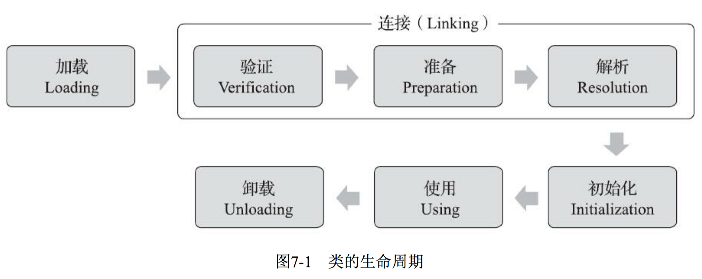

对于初始化阶段，《`Java`虚拟机规范》 则是严格规定了有且只有**六**种情况必须立即对类进行“初始化”：

> 1）遇到`new`、`getstatic`、`putstatic` 或 `invokestatic` 这四条字节码指令时，如果类型没有进行过初始 化，则需要先触发其初始化阶段。能够生成这四条指令的典型 `Java` 代码场景有：
>
> > 使用`new`关键字实例化对象
> >
> > 读取或设置一个类型的静态字段（被`final`修饰、已在编译期把结果放入常量池的静态字段除外） 
> >
> > 调用一个类型的静态方法
>
> 2）使用 `java.lang.reflect` 包的方法对类型进行反射调用的时候，如果类型没有进行过初始化，则需要先触发其初始化；
>
> 3）当初始化类的时候，如果发现其父类还没有进行过初始化，则需要先触发其父类的初始化；
>
> 4）当虚拟机启动时，用户需要指定一个要执行的主类（包含 `main()` 方法的类），虚拟机会先初始化这个主类；
>
> 5）当使用 `JDK 7` 新加入的动态语言支持时，如果一个 `java.lang.invoke.MethodHandle` 实例最后的解析结果为 `REF_getStatic`、`REF_putStatic`、`REF_invokeStatic`、`REF_newInvokeSpecial` 四种类型的方法句 柄，并且这个方法句柄对应的类没有进行过初始化，则需要先触发其初始化；
>
> 6）当一个接口中定义了`JDK 8`新加入的默认方法（被`default` 关键字修饰的接口方法）时，如果有这个接口的实现类发生了初始化，那该接口要在其之前被初始化。

上述六种场景中的行为称为对一个类型进行**主动引用**；除此之外，所有引用类型的方式都不会触发初始化，称为**被动引用**。

代码清单7-1&7-2  通过子类引用父类的静态字段，不会导致子类初始化 & 通过数组定义来引用类，不会触发此类的初始化

```java
package com.jvm;

/**
 * 父类
 *
 * @author zhangbocheng
 * @version v1.0
 * @date 2020/8/16 21:31
 */
public class SuperClass {

    static {
        System.out.println("SuperClass init!");
    }

    public static int value = 123;
}
```

```java
package com.jvm;

/**
 * 子类
 *
 * @author zhangbocheng
 * @version v1.0
 * @date 2020/8/16 21:31
 */
public class SubClass extends SuperClass {

    static {
        System.out.println("SubClass init!");
    }
}
```

```java
package com.jvm;

/**
 * 非主动使用类字段用例
 *
 * @author zhangbocheng
 * @version v1.0
 * @date 2020/8/16 21:37
 */
public class NotInitialization {
    public static void main(String[] args) {
        
        /**
         * 被动使用类字段演示(1)：通过子类引用父类的静态字段，不会导致子类初始化
         * 输出结果：
         *        SuperClass init!
         *        123
         */
        System.out.println(SubClass.value);

        /**
         * 被动使用类字段演示(2)：通过数组定义来引用类，不会触发此类的初始化
         * 输出结果：无
         */
        SuperClass[] sca = new SuperClass[10];
      
      	/**
         * 被动使用类字段演示(3)：常量在编译阶段会存入调用类的常量池中，本质上没有直接引用到定义常量的类，
         *                    因此不会触发定义常量的 类的初始化
         * 输出结果: Hello world
         */
        System.out.println(ConstClass.HELLO_WORLD);
    }
}
```

代码清单7-3  常量在编译阶段会存入调用类的常量池中，本质上没有直接引用到定义常量的类，因此不会触发定义常量的 类的初始化

```java
package com.jvm;

/**
 * 常量类
 *
 * @author zhangbocheng
 * @version v1.0
 * @date 2020/8/16 21:49
 */
public class ConstClass {

    static {
        System.out.println("ConstClass init!");
    }

    public static final String HELLO_WORLD = "Hello world";
}
```

####  2，类加载的过程

1）加载

在 **加载** 阶段，`Java` 虚拟机需要完成以下事情：

> 1）通过一个类的全限定名来获取定义此类的二进制字节流；
>
> 2）将这个字节流所代表的静态存储结构转化为方法区的运行时数据结构；
>
> 3）在内存中生成一个代表这个类的 `java.lang.Class` 对象，作为方法区这个类的各种数据的访问入口。

相对于类加载过程的其他阶段，**非数组类型**的加载阶段（加载阶段中获取类的二进 制字节流的动作）是开发人员可控性最强的阶段。加载阶段既可以使用`Java`虚拟机里内置的引导类加载器来完成，也可以由用户自定义的类加载器去完成，开发人员通过定义自己的类加载器去控制字节流的获取方式，实现根据自己的想法来赋予应用程序获取运行代码的动态性。

对于**数组类**而言，因其本身不通过类加载器创建，它是由`Java`虚拟机直接在内存中动态构造出来的。

2）验证

**验证**是连接阶段的第一步，目的是确保`Class`文件的字节流中包含的信息符合《`Java`虚拟机规范》的全部约束要求，保证这些信息被当作代码运行后不会危害虚拟机自身的安全。

从整体上看，验证阶段大致上会完成下面四个阶段的检验动作：

> **文件格式验证**：验证字节流是否符合 `Class` 文件格式的规范，并且能被当前版本的虚拟机处理。
>
> **元数据验证**：对字节码描述的信息进行语义分析，以保证其描述的信息符合《`Java`语言规范》的要求。
>
> **字节码验证**：整个验证过程中最复杂的一个阶段，主要目的是通过数据流分析和控制流分析，确定程序语义是合法的、符合逻辑的。
>
> **符号引用验证**：校验行为发生在虚拟机将符号引用转化为直接引用的时候，这个转化动作将在连接的第三阶段——解析阶段中发生。符号引用验证可以看作是对类自身以外（常量池中的各种符号引用）的各类信息进行匹配性校验，即该类是否缺少或者被禁止访问它依赖的某些外部类、方法、字段等资源。

3）准备

**准备**阶段是正式为类中定义的变量（即静态变量，被`static`修饰的变量）分配内存并设置类变量初始值的阶段，从概念上讲，这些变量所使用的内存都应当在方法区中进行分配，但必须注意到方法区本身是一个逻辑上的区域，在`JDK 7`及之前，`HotSpot` 使用永久代来实现方法区时，实现是完全符合这种逻辑概念的；而在 `JDK 8` 及之后，类变量则会随着 `Class` 对象一起存放在 `Java` 堆中，这时候“类变量在 方法区”就完全是一种对逻辑概念的表述。

4）解析

**解析**阶段是 `Java` 虚拟机将常量池内的符号引用替换为直接引用的过程，符号引用在 `Class` 文件中它以`CONSTANT_Class_info`、`CONSTANT_Fieldref_info`、`CONSTANT_Methodref_info` 等类型的常量出现，那解析阶段中所说的直接引用与符号引用又有什么关联呢？

> **符号引用**（`Symbolic References`）：以一组符号来描述所引用的目标，符号可以是任何形式的字面量，只要使用时能无歧义地定位到目标即可。符号引用与虚拟机实现的内存布局无关，但是各种虚拟机能接受的符号引用必须都是一致的，因为符号引用的字面量形式明确定义在《`Java`虚拟机规范》的 `Class` 文件格式中；
>
> **直接引用**（`Direct References`）：是可以直接指向目标的指针、相对偏移量或者是一个能间接定位到目标的句柄。直接引用是和虚拟机实现的内存布局直接相关的，同一个符号引用在不同虚拟机实例上翻译出来的直接引用一般不会相同。

《`Java` 虚拟机规范》之中并未规定解析阶段发生的具体时间，只要求了在执行 `ane-warray、 checkcast、getfield、getstatic、instanceof、invokedynamic、invokeinterface、invoke-special、 invokestatic、invokevirtual、ldc、ldc_w、ldc2_w、multianewarray、new、putfield、putstatic` 这17个用于操作符号引用的字节码指令之前，先对它们所使用的符号引用进行解析。

对同一个符号引用进行多次解析请求，除 `invokedynamic` 指令以外，虚拟机实现可以对第一次解析的结果进行缓存。

解析动作主要针对类或接口、字段、类方法、接口方法、方法类型、方法句柄和调用点限定符这7类符号引用进行，分别对应于常量池的 `CONSTANT_Class_info、CON-STANT_Fieldref_info、 CONSTANT_Methodref_info、CONSTANT_InterfaceMethodref_info、 CONSTANT_MethodType_info、CONSTANT_MethodHandle_info、CONSTANT_Dyna-mic_info、CONSTANT_InvokeDynamic_info` 8种常量类型。

- 类或接口的解析

假设当前代码所处的类为 $D$，如果要把一个从未解析过的符号引用 $N$ 解析为一个类或接口 $C$ 的直接引用，那虚拟机完成整个解析的过程需要包括以下步骤：

> 1）如果 $C$ 不是一个数组类型，那虚拟机将会把代表 $N$ 的全限定名传递给 $D$ 的类加载器去加载这个类 $C$。在加载过程中，由于元数据验证、字节码验证的需要，又可能触发其他相关类的加载动作，如加载这个类的父类或实现的接口。一旦这个加载过程出现了任何异常，解析过程就将宣告失败；
>
> 2）如果 $C$ 是一个数组类型，并且数组的元素类型为对象，也就是 $N$ 的描述符会是类似“ `[Ljava/lang/Integer` ” 的形式，那将会按照1）的规则加载数组元素类型。如果 $N$ 的描述符如前面所假设的形式，需要加载的元素类型就是“ `java.lang.Integer` ”，接着由虚拟机生成一个代表该数组维度和元素的数组对象；
>
> 3）如果上面两步没有出现任何异常，那么 $C$ 在虚拟机中实际上已经成为一个有效的类或接口，但在解析完成前还要进行符号引用验证，确认 $D$ 是否具备对 $C$ 的访问权限。如果发现不具备访问权限，将抛出  `java.lang.IllegalAccessError `异常。

- 字段解析

要解析一个未被解析过的字段符号引用，首先将会对字段表内 `class_index` 项中索引的 `CONSTANT_Class_info` 符号引用进行解析，也就是字段所属的类或接口的符号引用。如果在解析这个类或接口符号引用的过程中出现了任何异常，都会导致字段符号引用解析的失败。如果解析成功完成，那把这个字段所属的类或接口用 $C$ 表示，《`Java` 虚拟机规范》要求按照如下步骤对 $C$ 进行后续字段的搜索：

> 1）如果 $C$ 本身就包含了简单名称和字段描述符都与目标相匹配的字段，则返回这个字段的直接引用，查找结束；
>
> 2）否则，如果在 $C$ 中实现了接口，将会按照继承关系从下往上递归搜索各个接口和它的父接口，如果接口中包含了简单名称和字段描述符都与目标相匹配的字段，则返回这个字段的直接引用，查找结束；
>
> 3）否则，如果 $C$ 不是 `java.lang.Object` 的话，将会按照继承关系从下往上递归搜索其父类，如果在父类中包含了简单名称和字段描述符都与目标相匹配的字段，则返回这个字段的直接引用，查找结束；
>
> 4）否则，查找失败，抛出 `java.lang.NoSuchFieldError` 异常；
>
> 5）如果查找过程成功返回了引用，将会对这个字段进行权限验证，如果发现不具备对字段的访问权限，将抛出 `java.lang.IllegalAccessError` 异常。

代码清单7-4	字段解析

```java
package com.jvm;

/**
 * 字段解析
 *
 * @author zhangbocheng
 * @version v1.0
 * @date 2020/8/17 01:07
 */
public class FieldResolution {

    interface Interdace0 {
        int number = 0;
    }

    interface Interdace1 extends Interdace0 {
        int number = 1;
    }

    interface Interdace2 {
        int number = 2;
    }

    static class Parent implements Interdace1 {
        public static int number = 3;
    }

    static class Children extends Parent implements Interdace2 {
        /**
         * 若注释掉，会抛出异常：
         * Error:(33, 36) java: 对number的引用不明确
                            com.jvm.FieldResolution.Parent 中的变量 number
                                和 com.jvm.FieldResolution.Interdace2 中的变量 number 都匹配
         */
        public static int number = 4;
    }

    public static void main(String[] args) {
        System.out.println(Children.number);
    }
}
```

- 方法解析

首先解析出方法表的 `class_index` 项中索引的方法所属的类或接口的符号引用，如果解析成功，那么依然用 $C$ 表示这个类，接下来虚拟机将会按照如下步骤进行后续的方法搜索：

> 1）由于 `Class` 文件格式中类的方法和接口的方法符号引用的常量类型定义是分开的，如果在类的方法表中发现 `class_index` 中索引的 $C$ 是个接口的话，那就直接抛出 `java.lang.IncompatibleClassChangeError` 异常；
>
> 2）如果通过了步骤 1），在类 $C$ 中查找是否有简单名称和描述符都与目标相匹配的方法，如果有则返回这个方法的直接引用，查找结束；
>
> 3）否则，在类 $C$ 的父类中递归查找是否有简单名称和描述符都与目标相匹配的方法，如果有则返回这个方法的直接引用，查找结束；
>
> 4）否则，在类 $C$ 实现的接口列表及它们的父接口之中递归查找是否有简单名称和描述符都与目标相匹配的方法，如果存在匹配的方法，说明类 $C$ 是一个抽象类，这时候查找结束，抛出 `java.lang.AbstractMethodError` 异常；
>
> 5）否则，宣告方法查找失败，抛出 `java.lang.NoSuchMethodError`；
>
> 6）如果查找过程成功返回了直接引用，将会对这个方法进行权限验证，如果发现不具备对此方法的访问权限，将抛出 `java.lang.IllegalAccessError` 异常。

- 接口方法解析

首先解析出接口方法表的 `class_index`  项中索引的方法所属的类或接口的符号引用，如果解析成功，依然用 $C$ 表示这个接口，接下来虚拟机将会按照如下步骤进行后续的接口方法搜索：

> 1）与类的方法解析相反，如果在接口方法表中发现 `class_index` 中的索引 $C$ 是个类而不是接口，那 么就直接抛出 `java.lang.IncompatibleClassChangeError` 异常；
>
> 2）否则，在接口 $C$ 中查找是否有简单名称和描述符都与目标相匹配的方法，如果有则返回这个方法的直接引用，查找结束；
>
> 3）否则，在接口 $C$ 的父接口中递归查找，直到 `java.lang.Object` 类（接口方法的查找范围也会包括 `Object` 类中的方法）为止，看是否有简单名称和描述符都与目标相匹配的方法，如果有则返回这个方法的直接引用，查找结束；
>
> 4）对于步骤 3），由于 `Java` 的接口允许多重继承，如果 $C$ 的不同父接口中存有多个简单名称和描述符都与目标相匹配的方法，那将会从这多个方法中返回其中一个并结束查找，《`Java` 虚拟机规范》中没有进一步规则约束应该返回哪一个接口方法；
>
> 5）否则，宣告方法查找失败，抛出 `java.lang.NoSuchMethodError` 异常；
>
> 6）在 `JDK 9` 之前，`Java` 接口中的所有方法都默认是 `public` 的，也没有模块化的访问约束，所以不存在访问权限的问题，接口方法的符号解析就不可能抛出 `java.lang.IllegalAccessError` 异常；在 `JDK 9` 中增加了接口的静态私有方法，也有了模块化的访问约束，所以从 `JDK 9` 起，接口方法的访问也完全有可能因访问权限控制而出现 `java.lang.IllegalAccessError` 异常。

5）初始化

类的**初始化**阶段是类加载过程的最后一个步骤，`Java` 虚拟机才真正开始执行类中编写的 `Java` 程序代码，将主导权移交给应用程序。

进行准备阶段时，变量已经赋过一次系统要求的初始零值，而在初始化阶段，则会根据程序员通过程序编码制定的主观计划去初始化类变量和其他资源。**初始化阶段就是执行类构造器 `<clinit>()` 方法的过程。**

`<clinit>()` 方法是由编译器自动收集类中的所有类变量的赋值动作和静态语句块（`static{}` 块）中的语句合并产生的，编译器收集的顺序是由语句在源文件中出现的顺序决定的，静态语句块中只能访问到定义在静态语句块之前的变量，定义在它之后的变量，在前面的静态语句块可以赋值，但是不能访问。

`Java` 虚拟机必须保证一个类的 `<clinit>()` 方法在多线程环境中被正确地加锁同步，如果多个线程同时去初始化一个类，那么只会有其中一个线程去执行这个类的 `<clinit>()` 方法，其他线程都需要阻塞等待，直到活动线程执行完毕`<clinit>()` 方法。如果在一个类的 `<clinit>()` 方法中有耗时很长的操作，那就可能造成多个进程阻塞，在实际应用中这种阻塞往往是很隐蔽的。

代码清单7-5  死循环(初始化)

```java
package com.jvm;

/**
 * 死循环(初始化)
 *
 * @author zhangbocheng
 * @version v1.0
 * @date 2020/8/18 00:26
 */
public class DeadLoop {

    static {
        if (true) {
            System.out.println(Thread.currentThread() + " init DeadLoop Class.");
            while (true) {

            }
        }
    }

    public static void main(String[] args) {
        Runnable script = new Runnable() {
            @Override
            public void run() {
                System.out.println(Thread.currentThread() + " start.");
                new DeadLoop();
                System.out.println(Thread.currentThread() + " end.");
            }
        };

        Thread t1 = new Thread(script);
        Thread t2 = new Thread(script);
        t1.start();
        t2.start();
    }
}
```

#### 3，类加载器

`Java` 虚拟机设计团队有意把类加载阶段中的“通过一个类的全限定名来获取描述该类的二进制字节流”这个动作放到 `Java` 虚拟机外部去实现，以便让应用程序自己决定如何去获取所需的类。实现这个动作的代码被称为“**类加载器**”（`Class Loader`）。

对于任意一个类，都必须由加载它的类加载器和这个类本身一起共同确立其在 `Java` 虚拟机中的唯一性，每一个类加载器，都拥有一个独立的类名称空间。

代码清单7-6　不同的类加载器对 `instanceof` 关键字运算的结果的影响

```java
package com.jvm;

import java.io.IOException;
import java.io.InputStream;

/**
 * 类加载器与instanceof关键字
 *
 * @author zhangbocheng
 * @version v1.0
 * @date 2020/8/18 00:58
 */
public class ClassLoaderTest {

    public static void main(String[] args) throws Exception {

        ClassLoader loader = new ClassLoader() {
            @Override
            public Class<?> loadClass(String name) throws ClassNotFoundException {
                try {
                    String fileName = name.substring(name.lastIndexOf(".") + 1) + ".class";
                    InputStream is = getClass().getResourceAsStream(fileName);
                    if (is == null) {
                        return super.loadClass(name);
                    }

                    byte[] bytes = new byte[is.available()];
                    is.read(bytes);
                    return defineClass(name, bytes, 0, bytes.length);
                } catch (IOException e) {
                    throw new ClassNotFoundException(name);
                }
            }
        };

        Object obj = loader.loadClass("com.jvm.ClassLoaderTest").newInstance();

        System.out.println(obj.getClass());
        System.out.println(obj instanceof com.jvm.ClassLoaderTest);
    }
}
```

运行结果：

```bash
class com.jvm.ClassLoaderTest
false
```

在Java虚拟机的角度来看，只存在两种不同的类加载器：一种是**启动类加载器**（`Bootstrap ClassLoader`），这个类加载器使用 `C++` 语言实现，是虚拟机自身的一部分；另一种就是**其他所有的类加载器**，由 `Java` 语言实现，独立存在于虚拟机外部，并且全都继承自抽象类 `java.lang.ClassLoader`。

自 `JDK 1.2` 以来，`Java` 一直保持着 **三层类加载器**、**双亲委派** 的类加载架构。

- 三层类加载器

> **启动类加载器**（`Bootstrap Class Loader`）：负责加载存放在 `<JAVA_HOME>\lib` 目录，或者被 `-Xbootclasspath` 参数所指定的路径中存放的，而且是 `Java` 虚拟机能够识别的（按照文件名识别，如 `rt.jar`、`tools.jar`，名字不符合的类库即使放在 `lib` 目录中也不会被加载）类库加载到虚拟机的内存中。启动类加载器无法被 `Java` 程序直接引用，用户在编写自定义类加载器时，如果需要把加载请求委派给引导类加载器去处理，那直接使用 `null` 代替即可；
>
> **扩展类加载器**（`Extension Class Loader`）：在类 `sun.misc.Launcher$ExtClassLoader` 中以 `Java` 代码的形式实现的。负责加载 `<JAVA_HOME>\lib\ext` 目录中，或者被 `java.ext.dirs` 系统变量所指定的路径中所有的类库。`JDK` 的开发团队允许用户将具有通用性的类库放置在 `ext` 目录里以扩展 `Java SE` 的功能，在 `JDK 9` 后，这种扩展机制被**模块化**带来的天然的扩展能力所取代；
>
> **应用程序类加载器**（`Application Class Loader`）：由 `sun.misc.Launcher$AppClassLoader` 来实现。由于应用程序类加载器是 `ClassLoader` 类中的 `getSystemClassLoader()` 方法的返回值，所以有些场合中也称它为“**系统类加载器**”。负责加载用户类路径 （`ClassPath`）上所有的类库，开发者可以直接在代码中使用这个类加载器。如果应用程序中没有自定义过类加载器，一般情况下这个就是程序中默认的类加载器。

`JDK 9` 之前的 `Java` 应用都是由这三种类加载器互相配合来完成加载的。

- 双亲委派模型

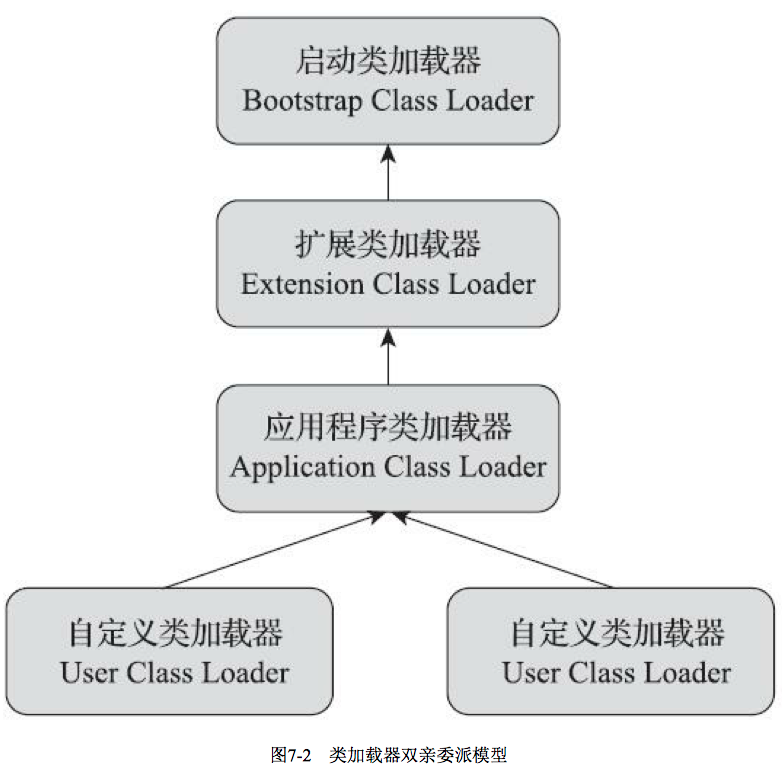

各种类加载器之间的层次关系被称为类加载器的“**双亲委派模型**（`Parents Delegation Model`）”，在 `JDK 1.2` 时期被引入。双亲委派模型要求除了顶层的启动类加载器外，其余的类加载器都应有自己的父类加载器。类加载器之间的父子关系一般不是以 **继承**（`Inheritance`）的关系来实现的，而是通常使用 **组合**（`Composition`）关系来复用父加载器的代码。

**双亲委派模型工作过程** ：如果一个类加载器收到了类加载的请求，它首先不会自己去尝试加载这个类，而是把这个请求委派给父类加载器去完成，每一个层次的类加载器都是如此，因此所有的加载请求最终都应该传送到最顶层的启动类加载器中，只有当父加载器反馈自己无法完成这个加载请求（它的搜索范围中没有找到所需的类）时，子加载器才会尝试自己去完成加载。

代码清单7-7　双亲委派模型的实现（`jdk1.8`）

```java
protected Class<?> loadClass(String name, boolean resolve)
  throws ClassNotFoundException
{
  synchronized (getClassLoadingLock(name)) {
    // First, check if the class has already been loaded
    Class<?> c = findLoadedClass(name);
    if (c == null) {
      long t0 = System.nanoTime();
      try {
        if (parent != null) {
          c = parent.loadClass(name, false);
        } else {
          c = findBootstrapClassOrNull(name);
        }
      } catch (ClassNotFoundException e) {
        // ClassNotFoundException thrown if class not found
        // from the non-null parent class loader
      }

      if (c == null) {
        // If still not found, then invoke findClass in order
        // to find the class.
        long t1 = System.nanoTime();
        c = findClass(name);

        // this is the defining class loader; record the stats
        sun.misc.PerfCounter.getParentDelegationTime().addTime(t1 - t0);
        sun.misc.PerfCounter.getFindClassTime().addElapsedTimeFrom(t1);
        sun.misc.PerfCounter.getFindClasses().increment();
      }
    }
    if (resolve) {
      resolveClass(c);
    }
    return c;
  }
}
```

- 破坏双亲委派模型

双亲委派模型的 **第一次“被破坏”** 发生在双亲委派模型出现之前——即 `JDK 1.2` 面世以前的“远古”时代。面对已经存在的用户自定义类加载器的代码，`Java` 设计者引入双亲委派模型时不得不做出一些妥协，为了兼容这些已有代码，无法再以技术手段避免 `loadClass()` 被子类覆盖的可能性，只能在 `JDK 1.2` 之后的 `java.lang.ClassLoader` 中添加一个新的 `protected` 方法 `findClass()` ，并引导用户编写的类加载逻辑时尽可能去重写这个方法，而不是在 `loadClass()` 中编写代码。

**第二次“被破坏”** 是由这个模型自身的缺陷导致的，双亲委派很好地解决了各个类加载器协作时基础类型的一致性问题（越基础的类由越上层的加载器进行加载），但程序设计往往没有绝对不变的完美规则，如果有基础类型又要调用回用户的代码，那该怎么办呢？

一个典型的例子是 `JNDI` 服务，`JNDI` 现已是 `Java` 的标准服务， 它的代码由 **启动类加载器** 来完成加载（在 `JDK 1.3` 时加入到 `rt.jar` ），但 `JNDI` 的目的是对资源进行查找和集中管理，需要调用由其他厂商实现并部署在应用程序的 `ClassPath` 下的 `JNDI` 服务提供者接口（`Service Provider Interface，SPI`）的代码，然而，启动类加载器是绝不可能认识、加载这些代码，那该怎么办？

为了解决这个困境，`Java` 的设计团队引入了一个不太优雅的设计：**线程上下文类加载器** （`Thread Context ClassLoader`）。这个类加载器可以通过 `java.lang.Thread` 类的 `setContext-ClassLoader()` 方法进行设置，如果创建线程时还未设置，它将会从父线程中继承一个，如果在应用程序的全局范围内都没有设置过的话，那这个类加载器默认就是应用程序类加载器。`JNDI` 服务使用这个线程上下文类加载器去加载所需的 `SPI` 服务代码，这是一种父类加载器去请求子类加载器完成类加载的行为，实际上是打通了双亲委派模型的层次结构来逆向使用类加载器，已经违背了双亲委派模型的一般性原则。`Java` 中涉及 `SPI` 的加载基本上都采用这种方式来完成，例如 `JNDI`、 `JDBC`、`JCE`、`JAXB` 和`JBI` 等。在 `JDK 6` 时，`JDK` 提供了 `java.util.ServiceLoader` 类，以 `META-INF/services` 中的配置信息，辅以责任链模式，这才算是给 `SPI` 的加载提供了一种相对合理的解决方案。

**第三次“被破坏”** 是由于用户对程序动态性的追求而导致的，这里所说的“动态性”指的是 **代码热替换**（`Hot Swap`）、**模块热部署**（`Hot Deployment`）等。

**`OSGi`** 实现模块化热部署的**关键**是它自定义的类加载器机制的实现，每一个程序模块（`OSGi` 中称为 `Bundle`）都有一个自己的类加载器，当需要更换一个 `Bundle` 时，就把 `Bundle` 连同类加载器一起换掉以实现代码的热替换。在 `OSGi` 环境下，类加载器不再双亲委派模型推荐的树状结构，而是进一步发展为更加复杂的网状结构，当收到类加载请求时， `OSGi` 将按照以下顺序进行类搜索：

> 1）将以 `java.*` 开头的类，委派给父类加载器加载；
>
> 2）否则，将委派列表名单内的类，委派给父类加载器加载；
>
> 3）否则，将 `Import` 列表中的类，委派给 `Export` 这个类的 `Bundle` 的类加载器加载；
>
> 4）否则，查找当前 `Bundle` 的 `ClassPath`，使用自己的类加载器加载；
>
> 5）否则，查找类是否在自己的 `Fragment Bundle` 中，如果在，则委派给 `Fragment Bundle` 的类加载器加载；
>
> 6）否则，查找 `Dynamic Import` 列表的 `Bundle`，委派给对应 `Bundle` 的类加载器加载；
>
> 7）否则，类查找失败。

#### 4，Java模块化系统

在 `JDK 9` 中引入的 `Java` **模块化系统**（`Java Platform Module System，JPMS`）是对 `Java` 技术的一次重要升级，为了能够实现模块化的 **关键目标**——可配置的封装隔离机制，`Java` 虚拟机对类加载架构也做出了相应的变动调整，才使模块化系统得以顺利地运作。`JDK 9` 的模块除了代码外，还包含以下内容：

> 依赖其他模块的列表；
>
> 导出的包列表，即其他模块可以使用的列表；
>
> 开放的包列表，即其他模块可反射访问模块的列表；
>
> 使用的服务列表；
>
> 提供服务的实现列表。

**可配置的封装隔离机制** 首先解决了 `JDK 9` 之前基于类路径（`ClassPath`）来查找依赖的可靠性问题；还解决了原来类路径上跨 `JAR` 文件的 `public` 类型的可访问性问题。

**模块路径**（`ModulePath`）即某个类库到底是模块还是传统的 `JAR` 包，只取决于它存放在哪种路径上。只要是放在类路径上的 `JAR` 文件，无论其中是否包 含模块化信息（是否包含了 `module-info.class` 文件），它都会被当作传统的 `JAR` 包来对待；相应地，只要放在模块路径上的 `JAR` 文件，即使没有使用 `JMOD` 后缀，甚至说其中并不包含 `module-info.class` 文 件，它也仍然会被当作一个模块来对待。

模块化系统将按照以下规则来保证使用传统类路径依赖的 `Java` 程序可以不经修改地直接运行在 `JDK 9` 及以后的 `Java` 版本上：

> **`JAR` 文件在类路径的访问规则**：所有类路径下的 `JAR` 文件及其他资源文件，都被视为自动打包在一个匿名模块（`Unnamed Module`）里，这个匿名模块几乎是没有任何隔离的，它可以看到和使用类路径上所有的包、`JDK` 系统模块中所有的导出包，以及模块路径上所有模块中导出的包；
>
> **模块在模块路径的访问规则**：模块路径下的具名模块（`Named Module`）只能访问到它依赖定义中列明依赖的模块和包，匿名模块里所有的内容对具名模块来说都是不可见的，即具名模块看不见传统 `JAR` 包的内容；
>
> **`JAR` 文件在模块路径的访问规则**：如果把一个传统的、不包含模块定义的 `JAR` 文件放置到模块路径中，它就会变成一个自动模块（`Automatic Module`）。尽管不包含 `module-info.class`，但自动模块将默认依赖于整个模块路径中的所有模块，因此可以访问到所有模块导出的包，自动模块也默认导出自己所有的包。

```bash
☁  images [interview] ⚡  java --list-modules
java.base@11.0.6
java.compiler@11.0.6
java.datatransfer@11.0.6
java.desktop@11.0.6
java.instrument@11.0.6
java.logging@11.0.6
java.management@11.0.6
java.management.rmi@11.0.6
java.naming@11.0.6
................................
```

模块化下的类加载器有如下特点：

> 1）扩展类加载器（`Extension Class Loader`）被 **平台类加载器**（`Platform Class Loader`）取代；
>
> 2）平台类加载器和应用程序类加载器都不再派生自 `java.net.URLClassLoader`，如果有程序直接依赖了这种继承关系，或者依赖了 `URLClassLoader` 类的特定方法，那代码很可能会在 `JDK 9` 及更高版本的 `JDK` 中崩溃。现在启动类加载器、平台类加载器、应用程序类加载器全都继承于 `jdk.internal.loader.BuiltinClassLoader`，在 `BuiltinClassLoader` 中实现了新的模块化架构下类如何从模块中加载的逻辑，以及模块中资源可访问性的处理；
>
> 3）`JDK 9` 中虽然仍然维持着三层类加载器和双亲委派的架构，但类加载的委派关系也发生了变动。当平台及应用程序类加载器收到类加载请求，在委派给父加载器加载前，要先判断该类是否能够归属到某一个系统模块中，如果可以找到这样的归属关系，就要优先委派给负责那个模块的加载器完成加载，也许这可以算是对双亲委派的**第四次破坏**。


启动类加载器负责加载的模块：

```bash
java.base 
java.datatransfer 
java.desktop 
java.instrument 
java.logging 
java.management 
java.management.rmi 
java.naming 
java.prefs
java.rmi
java.security.sasl 
java.xml 
jdk.httpserver 
jdk.internal.vm.ci 
jdk.management 
jdk.management.agent
jdk.naming.rmi 
jdk.net 
jdk.sctp 
jdk.unsupported
```

平台类加载器负责加载的模块：

```bash
java.activation* 
java.compiler* 
java.corba* 
java.scripting
java.se 
java.se.ee 
java.security.jgss 
java.smartcardio 
java.sql 
java.sql.rowset 
java.transaction* 
java.xml.bind* 
java.xml.crypto 
java.xml.ws* 
java.xml.ws.annotation*
jdk.accessibility
jdk.charsets
jdk.crypto.cryptoki 
jdk.crypto.ec 
jdk.dynalink 
jdk.incubator.httpclient 
jdk.internal.vm.compiler*
jdk.jsobject
jdk.localedata 
jdk.naming.dns
jdk.scripting.nashorn
jdk.security.auth 
jdk.security.jgss 
jdk.xml.dom 
jdk.zipfs
```

应用程序类加载器负责加载的模块：

```bash
jdk.aot
jdk.attach
jdk.compiler 
jdk.editpad 
jdk.hotspot.agent
jdk.internal.ed 
jdk.internal.jvmstat 
jdk.internal.le 
jdk.internal.opt
jdk.jartool 
jdk.javadoc 
jdk.jcmd 
jdk.jconsole
jdk.jdeps 
jdk.jdi 
jdk.jdwp.agent 
jdk.jlink 
jdk.jshell
jdk.jstatd 
jdk.pack
jdk.policytool
jdk.rmic 
jdk.scripting.nashorn.shell 
jdk.xml.bind* 
jdk.xml.ws*
```

## 八，虚拟机字节码执行引擎

#### 1，运行时栈帧结构

`Java` 虚拟机以 **方法** 作为最基本的执行单元，“**栈帧**”（`Stack Frame`）则是用于支持虚拟机进行方法调用和方法执行背后的数据结构，也是虚拟机运行时数据区中的虚拟机栈（`Virtual Machine Stack`）的栈元素。栈帧存储了方法的局部变量表、操作数栈、动态连接和方法返回地址等信息，每 一个方法从调用开始至执行结束的过程，都对应着一个栈帧在虚拟机栈里面从入栈到出栈的过程。

一个栈帧需要分配多少内存，并不会受到程序运行期变量数据的影响，而仅仅取决于程序源码和具体的虚拟机实现的栈内存布局形式。以 `Java` 程序的角度来看，同一时刻、同一条线程里面，在调用堆栈的所有方法都同时处于执行状态。对于执行引擎来讲，在活动线程中，只有位于栈顶的方法才是在运行的，只有位于栈顶的栈帧才是生效的，其被称为“**当前栈帧**”（`Current Stack Frame`），与这个栈帧所关联的方法被称为“**当前方法**”（`Current Method`）。

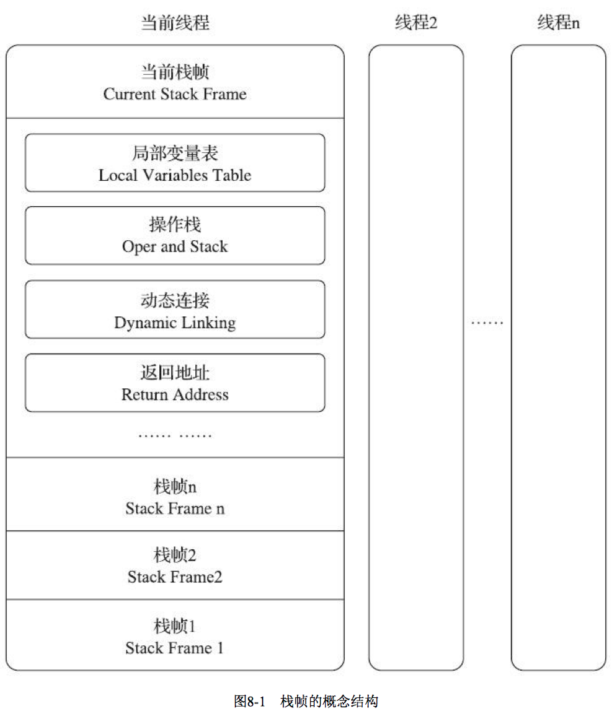

- 局部变量表

**局部变量表**（`Local Variables Table`）是一组变量值的存储空间，用于存放方法参数和方法内部定义的局部变量。局部变量表的容量以 **变量槽**（`Variable Slot`）为最小单位。

一个变量槽可以存放一个32位以内的数据类型，`Java` 中占用不超过32位存储空间的数据类型有 `boolean、byte、char、short、int、float、reference`  和 `returnAddress` 等8种类型。其中，`reference` 类型表示对一个对象实例的引用，《`Java` 虚拟机规范》既没有说明它的长度，也没有明确指出这种引用应有怎样的结构。一般来说，虚拟机实现至少都应当能通过这个引用做到两件事情：

> 1）从根据引用直接或间接地查找到对象在 `Java` 堆中的数据存放的起始地址或索引；
>
> 2）根据引用直接或间接地查找到对象所属数据类型在方法区中的存储的类型信息，否则将无法实现《`Java` 语言规范》中定义的语法约定。

`returnAddress` 类型目前已经很少见，是为字节码指令 `jsr`、`jsr_w` 和 `ret` 服务的，指向了一条字节码指令的地址，某些很古老的 `Java` 虚拟机曾经使用这几条指令来实现异常处理时的跳转，但现在也已经全部改为采用 **异常表** 来代替。

对于64位的数据类型，`Java` 虚拟机会以 **高位对齐** 的方式为其分配两个连续的变量槽空间。`Java` 语言中明确的64位的数据类型只有 `long` 和 `double` 两种。

当一个方法被调用时，`Java` 虚拟机会使用局部变量表来完成参数值到参数变量列表的传递过程， 即实参到形参的传递。

代码清单8-1 局部变量表槽复用对垃圾收集的影响之一

```java
package com.jvm;

/**
 * 局部变量表槽复用对垃圾收集的影响之一
 * VM Args：-verbose:gc
 *
 * @author zhangbocheng
 * @version v1.0
 * @date 2020/8/20 23:41
 */
public class LocalTableOne {
    public static void main(String[] args) {
        byte[] placeholder = new byte[64 * 1024 * 1024];
        System.gc();
    }
}
```

运行结果：

```bash
[GC (System.gc())  67532K->66024K(125952K), 0.0020378 secs]
[Full GC (System.gc())  66024K->65915K(125952K), 0.0060439 secs]
```

原因分析：没有回收掉 `placeholder` 所占的内存，因为在执行 `System.gc()` 时， 变量 `placeholder` 还处于作用域之内，虚拟机自然不敢回收掉 `placeholder` 的内存。

代码清单8-2 局部变量表 `Slot` 复用对垃圾收集的影响之二

```java
package com.jvm;

/**
 * 局部变量表Slot复用对垃圾收集的影响之二
 * VM Args：-verbose:gc
 *
 * @author zhangbocheng
 * @version v1.0
 * @date 2020/8/20 23:41
 */
public class LocalTableTwo {
    public static void main(String[] args) {
        {
            byte[] placeholder = new byte[64 * 1024 * 1024];
        }
        
        System.gc();
    }
}
```

运行结果：

```bash
[GC (System.gc())  67532K->66056K(125952K), 0.0008080 secs]
[Full GC (System.gc())  66056K->65915K(125952K), 0.0052654 secs]
```

原因分析：`placeholder` 的作用域被限制在花括号以内，从代码逻辑上讲，在执行 `System.gc()` 的时候，`placeholder` 已经不可能再被访问，但同时在此之后，再没有发生过任何对局部变量表的读写操作，`placeholder` 原本所占用的变量槽还没有被其他变量所复用，所以作为 `GC Roots` 一部分的局部变量表仍然保持着对它的关联。

代码清单8-3 局部变量表 `Slot` 复用对垃圾收集的影响之三

```java
package com.jvm;

/**
 * 局部变量表Slot复用对垃圾收集的影响之三
 * VM Args：-verbose:gc
 *
 * @author zhangbocheng
 * @version v1.0
 * @date 2020/8/20 23:41
 */
public class LocalTableThree {
    public static void main(String[] args) {
        {
            byte[] placeholder = new byte[64 * 1024 * 1024];
        }

        int a = 0;
        System.gc();
    }
}
```

运行结果：

```bash
[GC (System.gc())  67532K->65992K(125952K), 0.0019575 secs]
[Full GC (System.gc())  65992K->379K(125952K), 0.0062516 secs]
```

原因分析：本次内存被正确回收。 `placeholder` 能否被回收的 **根本原因**：局部变量表中的变量槽是否还存有关于 `placeholder` 数组对象的引用。

- 操作数栈

**操作数栈**（`Operand Stack`）也常被称为 **操作栈**，它是一个后入先出（`Last In First Out`，`LIFO`）栈。操作数栈的最大深度也在编译的时候被写入到 `Code` 属性的 `max_stacks` 数据项之中。操作数栈的每一个元素都可以是包括 `long` 和 `double` 在内的任意 `Java` 数据类型。32位数据类型所占的栈容量为1，64位数据类型所占的栈容量为2。

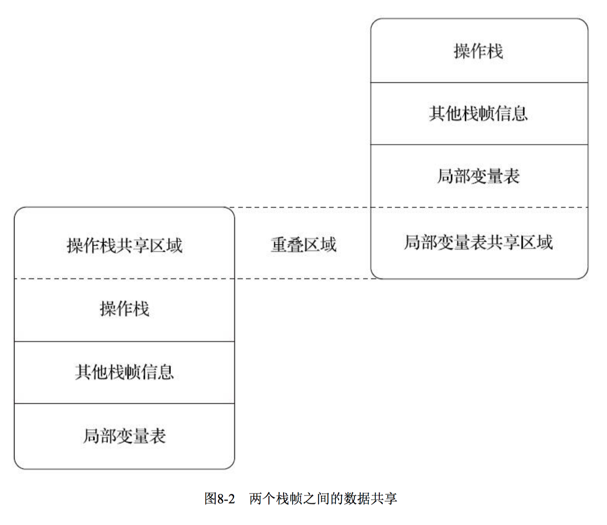

- 动态连接

每个栈帧都包含一个指向运行时常量池中该栈帧所属方法的引用，持有这个引用是为了支持方法调用过程中的 **动态连接**（`Dynamic Linking`）。在 `Class` 文件的常量池中存有大量的符号引用，字节码中的方法调用指令就以常量池里指向方法的符号引用作为参数。这些符号引用一部分会在类加载阶段或者第一次使用的时候就被转化为直接引用，这种转化被称为 **静态解析**。 另外一部分将在每一次运行期间都转化为直接引用，这部分就称为 **动态连接**。

- 方法返回地址

当一个方法开始执行后，只有两种方式退出这个方法：

> 1）执行引擎遇到任意一个方法返回的字节码指令，这时候可能会有返回值传递给上层的方法调用者（调用当前方法的方法称为 **调用者** 或者 **主调方法**），方法是否有返回值以及返回值的类型将根据遇到何种方法返回指令来决定，这种退出方法的方式称为“**正常调用完成**”（`Normal Method Invocation Completion`）；
>
> 2）在方法执行的过程中遇到了异常，并且这个异常没有在方法体内得到妥善处理。无论是 `Java` 虚拟机内部产生的异常，还是代码中使用 `athrow` 字节码指令产生的异常，只要在本方法的异常表中没有搜索到匹配的异常处理器，就会导致方法退出，这种退出方法的方式称为“**异常调用完成**（`Abrupt Method Invocation Completion`）”。一个方法使用异常完成出口的方式退出，是不会给它的上层调用者提供任何返回值的。

方法退出的过程实际上等同于把当前栈帧出栈，因此退出时可能执行的操作有：恢复上层方法的局部变量表和操作数栈，把返回值（如果有的话）压入调用者栈帧的操作数栈中，调整 `PC` 计数器的值以指向方法调用指令后面的一条指令等。

- 附加信息

《`Java` 虚拟机规范》允许虚拟机实现增加一些规范里没有描述的信息到栈帧之中，例如与调试、 性能收集相关的信息，这部分信息完全取决于具体的虚拟机实现。在讨论概念时，一 般会把动态连接、方法返回地址与其他附加信息全部归为一类，称为 **栈帧信息**。

#### 2，方法调用

方法调用并不等同于方法中的代码被执行，方法调用阶段唯一的 **任务** 就是确定被调用方法的版本 （即调用哪一个方法），暂时还未涉及方法内部的具体运行过程。

- 解析

所有方法调用的目标方法在 `Class` 文件里面都是一个常量池中的符号引用，在类加载的解析阶段，会将其中的一部分符号引用转化为直接引用，这种解析能够成立的 **前提** 是：方法在程序真正运行之前就有一个可确定的调用版本，并且这个方法的调用版本在运行期是不可改变的。换而言之，调用目标在程序代码写好、编译器进行编译那一刻就已经确定下来，这类方法的调用被称为 **解析**（`Resolution`）。

在 `Java` 语言中符合“**编译期可知，运行期不可变**”这个要求的方法，主要有 **静态方法** 和 **私有方法** 两大类，前者与类型直接关联，后者在外部不可被访问，这两种方法各自的特点决定了它们都不可能通过继承或别的方式重写出其他版本，因此它们都适合在类加载阶段进行解析。

在 `Java` 虚拟机支持以下5条方法调用字节码指令，分别是：

> `invokestatic`：用于调用静态方法；
>
> `invokespecial`：用于调用实例构造器 `<init>()` 方法、私有方法和父类中的方法；
>
> `invokevirtual`：用于调用所有的虚方法；
>
> `invokeinterface`：用于调用接口方法，会在运行时再确定一个实现该接口的对象；
>
> `invokedynamic`：先在运行时动态解析出调用点限定符所引用的方法，然后再执行该方法。前面4条调用指令，分派逻辑都固化在 `Java` 虚拟机内部，而 `invokedynamic` 指令的分派逻辑是由用户设定的引导方法来决定的。

只要能被 `invokestatic` 和 `invokespecial` 指令调用的方法，都可以在解析阶段中确定唯一的调用版本， `Java` 语言里符合这个条件的方法共有 **静态方法、私有方法、实例构造器、父类方法** 4种，再加上被 `final` 修饰的方法（尽管它使用 `invokevirtual` 指令调用），这5种方法调用会在类加载的时候就可以把符号引用解析为该方法的直接引用。这些方法统称为“**非虚方法**”（`Non-Virtual Method`），与之相反，其他方法就被称为“**虚方法**”（`Virtual Method`）。

代码清单8-4 方法静态解析

```java
package com.jvm;

/**
 * 方法静态解析
 *
 * @author zhangbocheng
 * @version v1.0
 * @date 2020/8/21 23:01
 */
public class StaticResolution {

    public static void sayHello() {
        System.out.println("Hello world!");
    }

    public static void main(String[] args) {
        StaticResolution.sayHello();
    }
}
```

运行结果：

```bash
☁  java [interview] ⚡  javap -verbose com.jvm.StaticResolution 
...
 public static void main(java.lang.String[]);
    descriptor: ([Ljava/lang/String;)V
    flags: (0x0009) ACC_PUBLIC, ACC_STATIC
    Code:
      stack=0, locals=1, args_size=1
         0: invokestatic  #5                  // Method sayHello:()V
         3: return
      LineNumberTable:
        line 17: 0
        line 18: 3
}
...
```

- 分派

1）静态分派

“**分派**”（`Dispatch`）这个词本身就具有动态性，一 般不应用在静态语境之中，这部分原本在英文原版的《`Java` 虚拟机规范》和《`Java` 语言规范》里的说法都是“`Method Overload Resolution`”，但部分其他外文资料和国内翻译的许多中文资料都将这种行为称为“**静态分派**”。

代码清单8-5 方法静态分派

```java
package com.jvm;

/**
 * 方法静态分派
 *
 * @author zhangbocheng
 * @version v1.0
 * @date 2020/8/21 23:28
 */
public class StaticDispatch {

    static abstract class BaseHuman {

    }

    static class Man extends BaseHuman {

    }

    static class Woman extends BaseHuman {

    }

    public void sayHello(BaseHuman guy) {
        System.out.println("Hello, guy!");
    }

    public void sayHello(Man guy) {
        System.out.println("Hello, gentleman!");
    }

    public void sayHello(Woman guy) {
        System.out.println("Hello, lady!");
    }

    public static void main(String[] args) {
        BaseHuman man = new Man();
        BaseHuman woman = new Woman();
        StaticDispatch dispatch = new StaticDispatch();
        dispatch.sayHello(man);
        dispatch.sayHello(woman);

        // 改进代码
        // dispatch.sayHello((Man) man);
        // dispatch.sayHello((Woman) woman);
    }
}
```

运行结果：

```bash
Hello, guy!
Hello, guy!
```

原因分析：

对于

```java
BaseHuman man = new Man();
```

代码中的“`BaseHuman`”称为变量的“**静态类型**”（`Static Type`），或者叫“**外观类型**”（`Apparent Type`），后面的“`Man`”则被称为变量的“**实际类型**”（`Actual Type`）或者叫“**运行时类型**”（`Runtime Type`）。静态类型和实际类型在程序中都可能会发生变化，**区别**是静态类型的变化仅仅在使用时发生，变量本身的静态类型不会被改变，并且最终的静态类型是在编译期可知的；而实际类型变化的结果在运行期才可确定，编译器在编译程序的时候并不知道一个对象的实际类型是什么。

`main()` 里面的两次 `sayHello()` 方法调用，在方法接收者已经确定是对象“`dispatch`”的前提下，使用哪个重载版 本，就完全取决于传入参数的数量和数据类型。代码中故意定义了两个静态类型相同，而实际类型不同的变量，但虚拟机（或者准确地说是编译器）在重载时是通过**参数的静态类型**而不是实际类型作为判定依据的。由于静态类型在编译期可知，所以在编译阶段，`Javac` 编译器就根据参数的静态类型决定了会使用哪个重载版本，因此选择了 `sayHello(Human)` 作为调用目标，并把这个方法的符号引用写到 `main()` 方法里的两条 `invokevirtual` 指令的参数中。

所有依赖静态类型来决定方法执行版本的分派动作，都称为 **静态分派**。静态分派的最典型应用表现就是 **方法重载**。静态分派发生在编译阶段，因此确定静态分派的动作实际上不是由虚拟机来执行的。

改进代码：

```java
public static void main(String[] args) {
   BaseHuman man = new Man();
   BaseHuman woman = new Woman();
   StaticDispatch dispatch = new StaticDispatch();
   dispatch.sayHello((Man) man);
   dispatch.sayHello((Woman) woman);
}
```

运行结果：

```bash
Hello, gentleman!
Hello, lady!
```

代码清单8-6 重载方法匹配优先级

```java
package com.jvm;

import java.io.Serializable;

/**
 * 重载方法匹配优先级
 *
 * @author zhangbocheng
 * @version v1.0
 * @date 2020/8/22 13:46
 */
public class OverLoading {

    public static void sayHello(Object arg) {
        System.out.println("Hello Object.");
    }

    public static void sayHello(int arg) {
        System.out.println("Hello int.");
    }

  	public static void sayHello(Integer arg) {
        System.out.println("Hello Integer.");
    }
    
    public static void sayHello(long arg) {
        System.out.println("Hello long.");
    }

    public static void sayHello(Character arg) {
        System.out.println("Hello Character.");
    }

    public static void sayHello(char arg) {
        System.out.println("Hello char.");
    }

    public static void sayHello(char... arg) {
        System.out.println("Hello char... .");
    }

    public static void sayHello(Serializable arg) {
        System.out.println("Hello Serializable.");
    }

    public static void main(String[] args) {
        sayHello('a');
    }
}
```

分析：搜索顺序：`char-->int-->long-->Character-->Serializable-->Object-->char…`，因为 `java.lang.Serializable` 是 `java.lang.Character` 类实现的一个接口，当自动装箱之后发现还是找不到装箱类，但是找到了装箱类所实现的接口类型，所以紧接着又发生一次自动转型。`char` 可以转型成 `int`，但是 `Character` 是绝对不会转型为 `Integer` 的，它只能安全地转型为它实现的接口或父类。

2）动态分派

在运行期根据实际类型确定方法执行版本的分派过程称为 **动态分派**。

代码清单8-7 方法动态分派

```java
package com.jvm;

/**
 * 方法动态分派
 *
 * @author zhangbocheng
 * @version v1.0
 * @date 2020/8/22 14:16
 */
public class DynamicDispatch {

    static abstract class BaseHuman {
        /**
         * sayHello方法
         */
        protected abstract void sayHello();
    }

    static class Man extends BaseHuman {
        @Override
        protected void sayHello() {
            System.out.println("Man say hello.");
        }
    }

    static class Woman extends BaseHuman {
        @Override
        protected void sayHello() {
            System.out.println("Woman say hello.");
        }
    }

    public static void main(String[] args) {

        BaseHuman man = new Man();
        BaseHuman woman = new Woman();
        man.sayHello();
        woman.sayHello();

        man = new Woman();
        man.sayHello();
    }
}
```

运行结果：

```bash
Man say hello.
Woman say hello.
Woman say hello.
```

```bash
☁  java [interview] ⚡  javap com.jvm.DynamicDispatch
public static void main(java.lang.String[]);
    descriptor: ([Ljava/lang/String;)V
    flags: (0x0009) ACC_PUBLIC, ACC_STATIC
    Code:
      stack=2, locals=3, args_size=1
         0: new           #2                  // class com/jvm/DynamicDispatch$Man
         3: dup
         4: invokespecial #3                  // Method com/jvm/DynamicDispatch$Man."<init>":()V
         7: astore_1
         8: new           #4                  // class com/jvm/DynamicDispatch$Woman
        11: dup
        12: invokespecial #5                  // Method com/jvm/DynamicDispatch$Woman."<init>":()V
        15: astore_2
        16: aload_1
        17: invokevirtual #6                  // Method com/jvm/DynamicDispatch$Human.sayHello:()V
        20: aload_2
        21: invokevirtual #6                  // Method com/jvm/DynamicDispatch$Human.sayHello:()V
        24: new           #4                  // class com/jvm/DynamicDispatch$Woman
        27: dup
        28: invokespecial #5                  // Method com/jvm/DynamicDispatch$Woman."<init>":()V
        31: astore_1
        32: aload_1
        33: invokevirtual #6                  // Method com/jvm/DynamicDispatch$Human.sayHello:()V
        36: return
      LineNumberTable:
        line 32: 0
        line 33: 8
        line 34: 16
        line 35: 20
        line 37: 24
        line 38: 32
        line 39: 36
}
...
```

因为 `invokevirtual` 指令执行的第一步就是在运行期确定接收者的实际类型，所以两次调用中的 `invokevirtual` 指令并不是把常量池中方法的符号引用解析到直接引用上就结束了，还会根据方法接收者的实际类型来选择方法版本，这个过程就是 `Java` 语言中 **方法重写的本质**。

代码清单8-8 字段没有多态性

```java
package com.jvm;

/**
 * 字段没有多态性
 *
 * @author zhangbocheng
 * @version v1.0
 * @date 2020/8/22 16:22
 */
public class FieldHashNoPolymorphic {

    static class Father {
        private int money = 1;

        public Father() {
            money = 2;
            showMoney();
        }

        public void showMoney() {
            System.out.println("I am Father, I have $" + money);
        }
    }

    static class Son extends Father {
        public int money = 3;

        public Son() {
            money = 4;
            showMoney();
        }

        @Override
        public void showMoney() {
            System.out.println("I am Son, I have $" + money);
        }
    }

    public static void main(String[] args) {
        Father gay = new Son();
        System.out.println("The gay has $" + gay.money);
    }
}
```

 运行结果：

```bash
I am Son, I have $0
I am Son, I have $4
The gay has $2
```

原因分析：输出两句都是“`I am Son`”，这是因为 `Son` 类在创建的时候，首先隐式调用了 `Father` 的构造函数，而  `Father` 构造函数中对 `showMeTheMoney()` 的调用是一次虚方法调用，实际执行的版本是 `Son::showMeTheMoney()` 方法，所以输出的是“`I am Son`”。虽然父类的 `money` 字段已经被初始化成2了，但 `Son::showMeTheMoney()` 方法中访问的却是子类的 `money` 字段，这时候结果自然还是0，因为它要到子类的构造函数执行时才会被初始化。`main()` 的最后一句通过静态类型访问到了父类中的 `money`，输出了2。

3）单分派与多分派

方法的接收者与方法的参数统称为 **方法的宗量**，最早应该来源于著名的《`Java` 与模式》 。根据分派基于多少种宗量，可以将分派划分为 **单分派** 和 **多分派** ：

> **单分派** 是根据一个宗量对目标方法进行选择；
>
> **多分派** 则是根据多于一个宗量对目标方法进行选择。

代码清单8-9 单分派和多分派

```java
package com.jvm;

/**
 * 单分派和多分派
 *
 * @author zhangbocheng
 * @version v1.0
 * @date 2020/8/22 16:43
 */
public class Dispatch {

    static class Tencent {}
    static class Aily {}

    public static class Father {
        public void hardChoice(Tencent arg) {
            System.out.println("Father choose QQ.");
        }

        public void hardChoice(Aily arg) {
            System.out.println("Father choose Aily.");
        }
    }

    public static class Son extends Father {
        @Override
        public void hardChoice(Tencent arg) {
            System.out.println("Son choose QQ.");
        }

        @Override
        public void hardChoice(Aily arg) {
            System.out.println("Son choose Aily.");
        }
    }

    public static void main(String[] args) {
        Father father = new Father();
        Father son = new Son();
        father.hardChoice(new Aily());
        son.hardChoice(new Tencent());
    }
}
```

原因分析：

> 在 `main()` 里调用了两次 `hardChoice()` 方法，首先关注的是编译阶段中编译器的选择过程，也就是 **静态分派** 的过程。这时候选择目标方法的依据有：一是静态类型是 `Father` 还是 `Son`，二是方法参数是 `Tencent` 还是 `Aily`。这次选择结果的最终产物是产生了两条 `invokevirtual` 指令，两条指令的参数分别为常量池中指向 `Father::hardChoice(Tencent)` 及 `Father::hardChoice(Aliy)` 方法的符号引用。因为是根据两个宗量进行选择，所以 `Java` 语言的静态分派属于 **多分派类型**；
>
> 对于运行阶段中虚拟机的选择，也就是 **动态分派** 的过程：在执行“`son.hardChoice(new Tencent())`”这行代码时，更准确地说，是在执行这行代码所对应的 `invokevirtual` 指令时，由于编译期已经决定目标方法的签名必须为 `hardChoice(Tencent)`，虚拟机此时不会关心传递过来的参数“`Tencent`”到底是“`Tencent`”还是“`Aily`”，因为这时候参数的静态类型、实际类型都对方法的选择不会构成任何影响，唯一可以影响虚拟机选择的因素只有该方法的接受者的实际类型是 `Father` 还是 `Son`。因为只有一个宗量作为选择依据， 所以 `Java` 语言的动态分派属于 **单分派类型**。

4）虚拟机动态分派的实现

**动态分派** 是执行非常频繁的动作，而且动态分派的方法版本选择过程需要运行时在接收者类型的方法元数据中搜索合适的目标方法，因此，`Java` 虚拟机实现基于执行性能的考虑，真正运行时一般不会如此频繁地去反复搜索类型元数据。面对这种情况，一种基础而且常见的优化手段是为类型在方法区中建立一个虚方法表（`Virtual Method Table`，也称为 `vtable`，与此对应的，在 `invokeinterface` 执行时也会用到接口方法表——`Interface Method Table`，简称  `itable`），使用虚方法表索引来代替元数据查找以提高性能。

#### 3，动态类型语言支持

- 动态类型语言

**动态类型语言** 的 **关键特征** 是它的类型检查的主体过程是在运行期而不是编译期进行的，满足这个特征的语言有如：`APL、Clojure、Erlang、Groovy、 JavaScript、Lisp、Lua、PHP、Prolog、Python、Ruby、Smalltalk、Tcl` 等等。

**动态类型语言**与 `Java` 有一个 **核心差异** 是变量 `obj` 本身并没有类型，变量 `obj` 的值才具有类型，所以编译器在编译时最多只能确定方法名称、参数、返回值这些信息，而不会去确定方法所在的具体类型 （即方法接收者不固定）。“**变量无类型而变量值才有类型**” 是动态类型语言的一个**核心特征**。

- `Java` 与动态类型

`JDK 7` 以前的字节码指令集中，4条方法调用指令（`invokevirtual`、`invokespecial`、`invokestatic`、 `invokeinterface`）的第一个参数都是被调用的方法的符号引用（`CONSTANT_Methodref_info` 或者  `CONSTANT_InterfaceMethodref_info` 常量），方法的符号引用在编译时产生，而动态类型语言只有在运行期才能确定方法的接收者。

- `java.lang.invoke` 包

`JDK 7` 时新加入的 `java.lang.invoke` 包是 `JSR 292` 的一个重要组成部分，这个包的主要目的是在之前单纯依靠符号引用来确定调用的目标方法这条路之外，提供一种新的动态确定目标方法的机制，称 为“**方法句柄**”（`Method Handle`）。

代码清单8-10 方法句柄

```java
package com.jvm;

import static java.lang.invoke.MethodHandles.lookup;

import java.lang.invoke.MethodHandle;
import java.lang.invoke.MethodType;

/**
 * 方法句柄
 *
 * @author zhangbocheng
 * @version v1.0
 * @date 2020/8/22 20:08
 */
public class MethodHandleTest {

    static class Demo {
        public void println(String s) {
            System.out.println(s);
        }
    }

    public static void main(String[] args) throws Throwable {
        Object obj = System.currentTimeMillis() % 2 == 0 ? System.out : new Demo();
        getPrintln(obj).invokeExact("com.jvm");
    }

    private static MethodHandle getPrintln(Object receiver) throws Throwable {
        // MethodType：代表“方法类型”，包含了方法的返回值（methodType()的第一个参数）
        // 和具体参数（methodType()第二个及以后的参数）。
        MethodType type = MethodType.methodType(void.class, String.class);
        // lookup()方法来自于MethodHandles.lookup，
        // 这句的作用是在指定类中查找符合给定的方法 名称、方法类型，并且符合调用权限的方法句柄。
        return lookup().findVirtual(receiver.getClass(), "println", type).bindTo(receiver);
    }
}
```

`MethodHandle` 在使用方法和效果上与 `Reflection` 有众多相似之处，不过也有以下区别：

> `Reflection` 和 `MethodHandle` 机制本质上都是在模拟方法调用，但是 `Reflection` 是在模拟 `Java` 代码层次 的方法调用，而 `MethodHandle` 是在模拟字节码层次的方法调用。在 `MethodHandles.Lookup` 上的3个方法  `findStatic()`、`findVirtual()`、`findSpecial()` 正是为了对应于 `invokestatic`、`invokevirtual`（以及 `invokeinterface`）和 `invokespecial` 这几条字节码指令的执行权限校验行为，而这些底层细节在使用  `Reflection API` 时是不需要关心的；
>
> `Reflection` 中的 `java.lang.reflect.Method` 对象远比 `MethodHandle` 机制中的  `java.lang.invoke.MethodHandle` 对象所包含的信息来得多。前者是方法在 `Java` 端的全面映像，包含了方法 的签名、描述符以及方法属性表中各种属性的 `Java` 端表示方式，还包含执行权限等的运行期信息。而 后者仅包含执行该方法的相关信息。`Reflection` 是重量级，而 `MethodHandle` 是轻量级。

- `invokedynamic` 指令

每一处含有 `invokedynamic` 指令的位置都被称作“**动态调用点**（`Dynamically-Computed Call Site`）”， 这条指令的第一个参数不再是代表方法符号引用的 `CONSTANT_Methodref_info` 常量，而是变为 `JDK 7` 时新加入的 `CONSTANT_InvokeDynamic_info` 常量，从这个新常量中可以得到3项信息：引导方法 （`Bootstrap Method`，该方法存放在新增的 `BootstrapMethods` 属性中）、方法类型（`MethodType`）和名称。引导方法是有固定的参数，并且返回值规定是 `java.lang.invoke.CallSite` 对象，这个对象代表了真正要执行的目标方法调用。根据 `CONSTANT_InvokeDynamic_info` 常量中提供的信息 ，虚拟机可以找到 并且执行引导方法，从而获得一个 `CallSite` 对象，最终调用到要执行的目标方法上。

代码清单8-11 `InvokeDynamic` 指令

```java
package com.jvm;

import java.lang.invoke.*;

import static java.lang.invoke.MethodHandles.lookup;

/**
 * InvokeDynamic指令
 *
 * @author zhangbocheng
 * @version v1.0
 * @date 2020/8/22 20:08
 */
public class InvokeDynamicTest {

    public static void main(String[] args) throws Throwable {
        IndyBootstrapMethod().invokeExact("com.jvm.InvokeDynamicTest");
    }

    private static MethodHandle IndyBootstrapMethod() throws Throwable {
        CallSite cs = (CallSite) MhBootstrapMethod().invokeWithArguments(lookup(), "testMethod",
                MethodType.fromMethodDescriptorString("(Ljava/lang/String;)V", null));
        return cs.dynamicInvoker();
    }

    private static MethodHandle MhBootstrapMethod() throws Throwable {
        return lookup().findStatic(InvokeDynamicTest.class, "BoostrapMethod", MtBoostrapMethod());
    }

    private static MethodType MtBoostrapMethod() {
        return MethodType
                .fromMethodDescriptorString(
                        "(Ljava/lang/invoke/MethodHandles$Lookup;Ljava/lang/String;Ljava/lang/invoke/MethodType;) Ljava/lang/invoke/CallSite;", null);
    }

    public static CallSite BoostrapMethod(MethodHandles.Lookup lookup, String name, MethodType mt)
        throws Throwable {
        return new ConstantCallSite(lookup.findStatic(InvokeDynamicTest.class, name, mt));
    }

    public static void testMethod(String s) {
        System.out.println("Hello String: " + s);
    }
}
```

- 实战：掌控方法分派规则

`invokedynamic` 指令与此前4条传统的“`invoke*`”指令的 **最大区别** 就是它的分派逻辑不是由虚拟机决定的，而是由程序员决定。

代码清单8-12 方法调用问题

```java
package com.jvm;

import static java.lang.invoke.MethodHandles.lookup;

import java.lang.invoke.MethodHandle;
import java.lang.invoke.MethodHandles;
import java.lang.invoke.MethodType;
import java.lang.reflect.Field;

/**
 * 方法调用问题
 *
 * @author zhangbocheng
 * @version v1.0
 * @date 2020/9/3 10:52
 */
public class GrandFatherTest {
    public static void main(String[] args) {
        (new SonMethodHandle()).thinking();
        (new SonMethodHandleTrust()).thinking();
    }
}


class GrandFather {
    void thinking() {
        System.out.println("I am grandfather.");
    }
}


class Father extends GrandFather {
    @Override
    void thinking() {
        System.out.println("I am father.");
    }
}


/**
 * 问题：实现调用祖父类的thinking()方法，打印 "I am grandfather."
 *
 * 使用JDK 7 Update 9之前的HotSpot虚拟机运行，结果为：I am grandfather.
 * 使用JDK 7 Update 10修正之后的HotSpot虚拟机运行，结果为：I am father.
 *
 */
class SonMethodHandle extends Father {
    @Override
    void thinking() {
        try {
            MethodType mt = MethodType.methodType(void.class);
            MethodHandle mh = lookup().findSpecial(GrandFather.class, "thinking", mt, getClass());
            mh.invoke(this);
        } catch (Throwable e) {
            e.printStackTrace();
        }
    }
}


/**
 * 问题：实现调用祖父类的thinking()方法，打印 "I am grandfather."
 *
 */
class SonMethodHandleTrust extends Father {
    @Override
    void thinking() {
        try {
            MethodType mt = MethodType.methodType(void.class);
            Field lookupImpl = MethodHandles.Lookup.class.getDeclaredField("IMPL_LOOKUP");
            lookupImpl.setAccessible(true);
            MethodHandle mh = ((MethodHandles.Lookup) lookupImpl.get(null)).findSpecial(GrandFather.class,
                    "thinking", mt, GrandFather.class);
            mh.invoke(this);
        } catch (Throwable e) {
            e.printStackTrace();
        }
    }
}
```

#### 4，基于栈的字节码解释执行引擎

 在 `Java` 语言中，`Javac` 编译器完成了程序代码经过词法分析、语法分析到抽象语法树，再遍历语法树生成线性的字节码指令流的过程。因为这一部分动作是在 `Java` 虚拟机之外进行的，而解释器在虚拟机的内部，所以 `Java` 程序的编译就是半独立的实现。

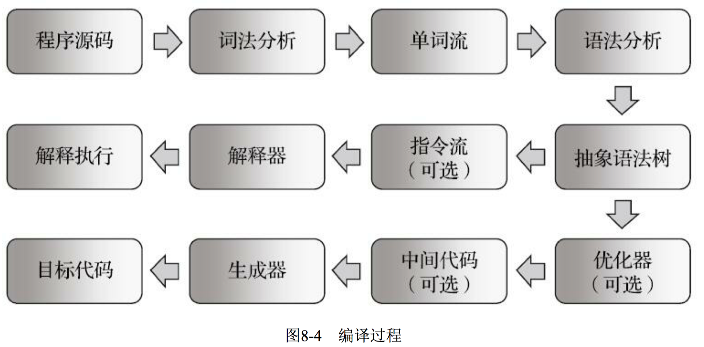

`Javac` 编译器输出的字节码指令流，基本上是一种 **基于栈的指令集架构**（`Instruction Set Architecture`，`ISA`），字节码指令流里面的指令大部分都是零地址指令，它们依赖操作数栈进行工作。与之相对的一套常用的指令集架构是 **基于寄存器** 的指令集，最典型的就是 `x86` 的二地址指令集，如果说得更通俗一些就是现在主流 `PC` 机中物理硬件直接支持的指令集架构，这些指令依赖寄存器进行工作。

基于 **栈的指令集主要优点** 是可移植，因为寄存器由硬件直接提供，程序直接依赖这些硬件寄存器则不可避免地要受到硬件的约束。此外还有其他的优点， 如代码相对更加紧凑（字节码中每个字节就对应一条指令，而多地址指令集中还需要存放参数）、编 译器实现更加简单（不需要考虑空间分配的问题，所需空间都在栈上操作）等。

**栈架构指令集的主要缺点** 是理论上执行速度相对来说会稍慢一些，不过这里的执行速度是要局限在解释执行的状态下，如果经过即时编译器输出成物理机上的汇编指令流，那就与虚拟机采用哪种指令集架构没有什么关系。

## 九，类加载及执行子系统的案例与实战

#### 1，案例分析

- `Tomcat`：正统的类加载器架构

一个功能健全的 `Web` 服务器，需要解决如下的这些问题：

> 部署在同一个服务器上的两个 `Web` 应用程序所使用的 `Java` 类库可以实现相互隔离。这是最基本的需求，两个不同的应用程序可能会依赖同一个第三方类库的不同版本，不能要求每个类库在一个服务器中只能有一份，服务器应当能够保证两个独立应用程序的类库可以互相独立使用；
>
> 部署在同一个服务器上的两个 `Web` 应用程序所使用的 `Java` 类库可以互相共享。例如用户可能有10个使用 `Spring` 组织的应用程序部署在同一台服务器上，如果把10份 `Spring` 分别存放在各个应用程序的隔离目录中，将会是很大的资源浪费——这主要倒不是浪费磁盘空间的问题，而是指类库在使用时都要被加载到服务器内存，如果类库不能共享，虚拟机的方法区就会很容易出现过度膨胀的风险；
>
> 服务器需要尽可能地保证自身的安全不受部署的 `Web` 应用程序影响。目前，有许多主流的 `Java Web` 服务器自身也是使用 `Java` 语言来实现的。因此服务器本身也有类库依赖的问题，一般来说，基于安全考虑，服务器所使用的类库应该与应用程序的类库互相独立；
>
> 支持 `JSP` 应用的 `Web` 服务器，大部分都需要支持 `HotSwap` 功能。

在 `Tomcat` 目录结构中，可以设置3组目录（`/common/`、`/server/` 和 `/shared/`，但默认不一定是开放的，可能只有 `/lib/` 目录存在）用于存放 `Java` 类库，另外还应该加上 `Web` 应用程序自身的“`/WEBINF/`”目录，一共4组。把 `Java` 类库放置在这4组目录中，每一组都有独立的含义，分别是：

> 放置在 `/common` 目录中，类库可被 `Tomcat` 和所有的 `Web` 应用程序共同使用；
>
> 放置在 `/server` 目录中，类库可被Tomcat使用，对所有的Web应用程序都不可见；
>
> 放置在/shared目录中，类库可被所有的Web应用程序共同使用，但对Tomcat自己不可见。
>
> 放置在 `/WebApp/WEB-INF` 目录中，类库仅仅可以被该 `Web` 应用程序使用，对 `Tomcat` 和其他 `Web` 应用程序都不可见。

为了支持这套目录结构，并对目录里面的类库进行加载和隔离，`Tomcat` 自定义了多个类加载器， 这些类加载器按照经典的 **双亲委派模型** 来实现，其关系如图所示。

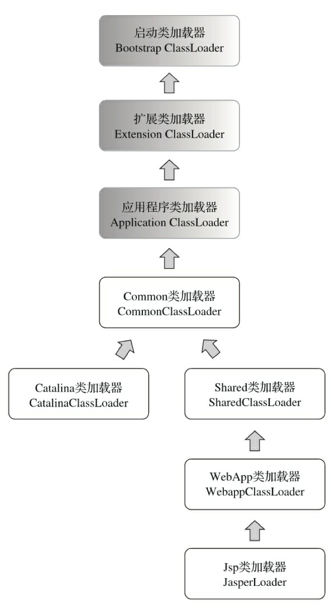

- `OSGi`：灵活的类加载器架构

`OSGi` （`Open Service Gateway Initiative`）是 `OSGi` 联盟（`OSGi Alliance`）制订的一个基于 `Java` 语言的动态模块化规范（在 `JDK 9` 引入的 `JPMS` 是静态的模块系统），这个规范最初由 `IBM`、爱立信等公司 联合发起，在早期连 `Sun` 公司都有参与。目的是使服务提供商通过住宅网关为各种家用智能设备提供服务，现成为 `Java` 世界中“事实上”的动态模块化标准，并且已经有了 `Equinox`、`Felix` 等成熟的实现。

在今天，通常引入 `OSGi` 的主要理由是基于 `OSGi` 架构的程序很可能会实现模块级的热插拔功能，当程序升级更新或调试除错时，可以只停用、重新安装然后启用程序的其中一部分，这对大型软件、企业级程序开发来说是一个非常有诱惑力 的特性，譬如 `Eclipse` 中安装、卸载、更新插件而不需要重启动，就使用到了这种特性。

`OSGi` 之所以能有上述诱人的特点，必须要归功于它灵活的类加载器架构。`OSGi` 的 `Bundle` 类加载器之间只有规则，没有固定的委派关系。另外，一个 `Bundle` 类加载器为其他 `Bundle` 提供服务时，会根据 `Export-Package` 列表严格控制访问范围。如果一个类存在于 `Bundle` 的类库中但是没有被 `Export`，那么这个 `Bundle` 的类加载器能找到这个类， 但不会提供给其他 `Bundle` 使用，而且 `OSGi` 框架也不会把其他 `Bundle` 的类加载请求分配给这个 `Bundle` 来处理。

- 字节码生成技术与动态代理的实现

代码清单9-1　动态代理的简单示例

```java
package com.jvm;

import java.lang.reflect.InvocationHandler;
import java.lang.reflect.Method;
import java.lang.reflect.Proxy;

/**
 * 动态代理的简单示例
 *
 * @author zhangbocheng
 * @version v1.0
 * @date 2020/9/3 22:34
 */
public class DynamicProxyTest {

    interface IHello {
        void sayHello();
    }

    static class Hello implements IHello {
        @Override
        public void sayHello() {
            System.out.println("Hello world.");
        }
    }

    static class DynamicProxy implements InvocationHandler {
        Object object;

        Object bind(Object o) {
            this.object = o;
            return Proxy.newProxyInstance(object.getClass().getClassLoader(), object.getClass().getInterfaces(), this);
        }

        @Override
        public Object invoke(Object proxy, Method method, Object[] args) throws Throwable {
            System.out.println("Welcome");
            return method.invoke(object, args);
        }
    }

    public static void main(String[] args) {
        IHello hello = (IHello) new DynamicProxy().bind(new Hello());
        hello.sayHello();
    }
}
```

- `Backport` 工具：`Java` 的时光机器

`Retrotranslator` 的作用是将 `JDK 5` 编译出来的 `Class` 文件转变为可以在 `JDK 1.4` 或 `1.3` 上部署的版本， 它能很好地支持自动装箱、泛型、动态注解、枚举、变长参数、遍历循环、静态导入这些语法特性，甚至还可以支持 `JDK 5` 中新增的集合改进、并发包及对泛型、注解等的反射操作。`Retrolambda` 的作用是将 `JDK 8` 的 `Lambda` 表达式和 `try-resources` 语法转变为可以在 `JDK 5、JDK 6、JDK 7` 中使用的形式，同时也对接口默认方法提供了有限度的支持。

#### 2，实战：自己动手实现远程执行功能

代码清单9-2　`HotSwapClassLoader` 的实现

```java
package com.jvm;

/**
 * HotSwapClassLoader的实现
 *      为了多次载入执行类而加入的加载器
 *      把defineClass方法开放出来，只有外部显式调用的时候才会使用到loadByte方法
 *      由虚拟机调用时，仍然按照原有的双亲委派规则使用loadClass方法进行类加载
 *
 * @author zhangbocheng
 * @version v1.0
 * @date 2020/9/3 23:05
 */
public class HotSwapClassLoader extends ClassLoader {

    public HotSwapClassLoader() {
        super(HotSwapClassLoader.class.getClassLoader());
    }

    public Class loadByte(byte[] bytes) {
        return defineClass(null, bytes, 0, bytes.length);
    }
}
```

代码清单9-3　`ClassModifier` 的实现

```java
package org.jvm;

/**
 * ClassModifier的实现
 *      修改Class文件，暂时只提供修改常量池常量的功能
 *
 * @author zhangbocheng
 * @version v1.0
 * @date 2020/9/3 23:30
 */
public class ClassModifier {

    /**
     * Class文件中常量池的起始偏移
     */
    private static final int CONSTANT_POOL_COUNT_INDEX = 8;

    /**
     * CONSTANT_Utf8_info常量的tag标志
     */
    private static final int CONSTANT_UTF8_INFO = 1;

    /**
     * 常量池中11种常量所占的长度，CONSTANT_Utf8_info型常量除外，因为它不是定长的
     */
    private static final int[] CONSTANT_ITEM_LENGTH = {-1, -1, -1, 5, 5, 9, 9, 3, 3, 5, 5, 5, 5};

    private static final int U1 = 1;
    private static final int U2 = 2;

    private byte[] bytes;

    public ClassModifier(byte[] bytes) {
        this.bytes = bytes;
    }

    public byte[] modifyUtf8Constant(String oldStr, String newStr) {
        int cpc = getConstantPoolCount();
        int offset = CONSTANT_POOL_COUNT_INDEX + U2;
        for (int i = 0; i < cpc; i++) {
            int tag = ByteUtils.bytes2Int(bytes, offset, U1);
            if (tag == CONSTANT_UTF8_INFO) {
                int len = ByteUtils.bytes2Int(bytes, offset + U1, U2);
                offset += (U1 + U2);
                String str = ByteUtils.bytes2String(bytes, offset, len);
                if (str.equalsIgnoreCase(oldStr)) {
                    byte[] strBytes = ByteUtils.string2Bytes(newStr);
                    byte[] strLen = ByteUtils.int2Byte(newStr.length(), U2);
                    bytes = ByteUtils.byteReplace(bytes, offset - U2, U2, strLen);
                    bytes = ByteUtils.byteReplace(bytes, offset, len, strBytes);
                    return bytes;
                } else {
                    offset += len;
                }
            } else {
                offset += CONSTANT_ITEM_LENGTH[tag];
            }
        }

        return bytes;
    }

    private int getConstantPoolCount() {
        return ByteUtils.bytes2Int(bytes, CONSTANT_POOL_COUNT_INDEX, U2);
    }
}
```

代码清单9-4　`ByteUtils` 的实现

```java
package org.jvm;

/**
 * ByteUtils 的实现
 *      Bytes数组处理工具
 *
 * @author zhangbocheng
 * @version v1.0
 * @date 2020/9/3 23:56
 */
public class ByteUtils {
    
    public static int bytes2Int(byte[] bytes, int start, int len) {
        int sum = 0;
        int end = start + len;
        for (int i = start; i < end; i++) {
            int n = ((int) bytes[i]) & 0xff;
            n <<= (--len) * 8;
            sum += n;
        }
        
        return sum;
    }

    public static String bytes2String(byte[] bytes, int offset, int len) {
        return new String(bytes, offset, len);
    }

    public static byte[] string2Bytes(String str) {
        return st.getBytes();
    }

    public static byte[] int2Byte(int value, int len) {
        byte[] bytes = new byte[len];
        for (int i = 0; i < len; i++) {
            bytes[len - i - 1] = (byte) ((value >> 8 * i) & 0xff);
        }

        return bytes;
    }

    public static byte[] byteReplace(byte[] bytes, int offset, int len, byte[] replaceBytes) {
        byte[] newBytes = new byte[bytes.length + (replaceBytes.length - len)];
        System.arraycopy(bytes, 0, newBytes, 0, offset);
        System.arraycopy(replaceBytes, 0, newBytes, offset, replaceBytes.length);
        System.arraycopy(bytes, offset + len, newBytes, offset + replaceBytes.length, bytes.length);
        return newBytes;
    }
}
```

代码清单9-5　`HackSystem` 的实现

```java
package org.jvm;

import java.io.ByteArrayOutputStream;
import java.io.InputStream;
import java.io.PrintStream;

/**
 * HackSystem的实现
 *      为 Java class 劫持java.lang.System提供支持
 *      除了out和err外，其余的都直接转发给System处理
 *
 * @author zhangbocheng
 * @version v1.0
 * @date 2020/9/4 00:24
 */
public class HackSystem {

    public final static InputStream in = System.in;
    private static ByteArrayOutputStream buffer = new ByteArrayOutputStream();
    public final static PrintStream out = new PrintStream(buffer);
    public final static PrintStream err = out;

    public static String getBufferString() {
        return buffer.toString();
    }

    public static void clearBuffer() {
        buffer.reset();
    }

    public static void setSecurityManager(final SecurityManager s) {
        System.setSecurityManager(s);
    }

    public static SecurityManager getSecurityManager() {
        return System.getSecurityManager();
    }

    public static long currentTimeMillis() {
        return System.currentTimeMillis();
    }

    public static void arraycopy(Object src, int srcPos, Object dest, int destPos, int length) {
        System.arraycopy(src, srcPos, dest, destPos, length);
    }
}
```

代码清单9-6　`JavaClassExecutor` 的实现

```java
package org.jvm;

import java.lang.reflect.Method;

/**
 * Java Class 执行工具
 *
 * @author zhangbocheng
 * @version v1.0
 * @date 2020/9/4 17:06
 */
public class JavaClassExecutor {

    public static String execute(byte[] bytes) {
        HackSystem.clearBuffer();
        ClassModifier cm = new ClassModifier(bytes);
        byte[] modiBytes = cm.modifyUtf8Constant("java/lang/System", "org/jvm/HackSystem");
        HotSwapClassLoader loader = new HotSwapClassLoader();
        Class cls = loader.loadByte(modiBytes);
        try {
            Method method = cls.getMethod("main", new Class[] {String[].class});
            method.invoke(null, new String[] {null});
        } catch (Throwable e) {
            e.printStackTrace();
        }

        return HackSystem.getBufferString();
    }
}
```


## 十，前端编译与优化

#### 1，编译器分类

> **前端编译器**：`JDK` 的 `Javac`、`Eclipse JDT` 中的增量式编译器（`ECJ`）；
>
> **即时编译器**：`HotSpot` 虚拟机的 `C1`、`C2` 编译器，`Graal` 编译器；
>
> **提前编译器**：`JDK` 的 `Jaotc`、`GNU Compiler for the Java`（`GCJ`）、`Excelsior JET`。

#### 2，`Javac` 编译器

在 `JDK 6` 以前，`Javac` 并不属于标准 `Java SE API` 的一部分，它实现代码单独存放在 `tools.jar` 中，要在程序中使用的话就必须把这个库放到类路径上。在 `JDK 6` 发布时通过了 `JSR 199` 编译器 `API` 的提案，使得 `Javac` 编译器的实现代码晋升成为标准 `Java` 类库之一，它的源码就改为放在 `JDK_SRC_HOME/langtools/src/share/classes/com/sun/tools/javac` 中。到了 `JDK 9` 时，整个 `JDK` 所有的 `Java` 类库都采用模块化进行重构划分，`Javac` 编译器就被挪到了 `jdk.compiler` 模块（路径为：  `JDK_SRC_HOME/src/jdk.compiler/share/classes/com/sun/tools/javac`）里面。

创建 `JAVA JDK` 工程：

```bash
☁  openjdk-jdk8u [master] cp -rf langtools/src/share/classes/com ../java_projects/jdk-src/src/
```

执行：

```bash
/Library/Java/JavaVirtualMachines/jdk1.8.0_131.jdk/Contents/Home/bin/java -Dfile.encoding=UTF-8 -classpath...jects/java_pro/java_projects/jdk-src/out/production/jdk-src com.sun.tools.javac.Main
用法: javac <options> <source files>
其中, 可能的选项包括:
  -g                         生成所有调试信息
  -g:none                    不生成任何调试信息
  -g:{lines,vars,source}     只生成某些调试信息
  -nowarn                    不生成任何警告
  -verbose                   输出有关编译器正在执行的操作的消息
  -deprecation               输出使用已过时的 API 的源位置
  -classpath <路径>            指定查找用户类文件和注释处理程序的位置
  -cp <路径>                   指定查找用户类文件和注释处理程序的位置
  -sourcepath <路径>           指定查找输入源文件的位置
  -bootclasspath <路径>        覆盖引导类文件的位置
  -extdirs <目录>              覆盖所安装扩展的位置
  -endorseddirs <目录>         覆盖签名的标准路径的位置
  -proc:{none,only}          控制是否执行注释处理和/或编译。
  -processor <class1>[,<class2>,<class3>...] 要运行的注释处理程序的名称; 绕过默认的搜索进程
  -processorpath <路径>        指定查找注释处理程序的位置
  -parameters                生成元数据以用于方法参数的反射
  -d <目录>                    指定放置生成的类文件的位置
  -s <目录>                    指定放置生成的源文件的位置
  -h <目录>                    指定放置生成的本机标头文件的位置
  -implicit:{none,class}     指定是否为隐式引用文件生成类文件
  -encoding <编码>             指定源文件使用的字符编码
  -source <发行版>              提供与指定发行版的源兼容性
  -target <发行版>              生成特定 VM 版本的类文件
  -profile <配置文件>            请确保使用的 API 在指定的配置文件中可用
  -version                   版本信息
  -help                      输出标准选项的提要
  -A关键字[=值]                  传递给注释处理程序的选项
  -X                         输出非标准选项的提要
  -J<标记>                     直接将 <标记> 传递给运行时系统
  -Werror                    出现警告时终止编译
  @<文件名>                     从文件读取选项和文件名


Process finished with exit code 2
```

从 `Javac` 代码的总体结构来看，编译过程大致可以分为1个准备过程和3个处理过程，它们分别如下：

> 1）准备过程：初始化插入式注解处理器；
>
> 2）解析与填充符号表过程，包括：
>
> > 词法、语法分析：将源代码的字符流转变为标记集合，构造出抽象语法树；
> >
> > > **词法分析** 是将源代码的字符流转变为标记（`Token`，如关键字、变量名、字面量、运算符等）集合的过程，单个字符是程序编写时的最小元素，但标记才是编译时的最小元素；其过程由  `com.sun.tools.javac.parser.Scanner` 类来实现；
> > >
> > > **语法分析** 是根据标记序列构造抽象语法树的过程，**抽象语法树**（`Abstract Syntax Tree`，`AST`）是一种用来描述程序代码语法结构的树形表示方式，抽象语法树的每一个节点都代表着程序代码中的一个语法结构（`Syntax Construct`），例如包、类型、修饰符、运算符、接口、返回值甚至连代码注释等都可以是一种特定的语法结构；其过程由  `com.sun.tools.javac.parser.Parser` 类实现，这个阶段产出的抽象语法树是以`com.sun.tools.javac.tree.JCTree` 类表示的。
> >
> > 填充符号表：产生符号地址和符号信息。
> >
> > > **符号表**（`Symbol Table`）是由一组符号地址和符号信息构成的数据结构，可以把它类比想象成哈希表中键值对的存储形式（实际上符号表不一定是哈希表实现，可以是有序符号表、树状符号表、栈结构符号表等各种形式）。符号表中所登记的信息在编译的不同阶段都要被用到；其过程由 `com.sun.tools.javac.comp.Enter` 类实现，该过程的产出物是一个待处理列表，其中包含了每一个编译单元的抽象语法树的顶级节点，以及 `package-info.java`（如果存在的话）的顶级节点。
>
> 3）插入式注解处理器的注解处理过程：插入式注解处理器的执行阶段，影响 `Javac` 的编译行为；
>
> > `JDK 5` 之后，`Java` 语言提供了对 **注解**（`Annotations`）的支持，只会在程序运行期间发挥作用。但在 `JDK 6` 中又提出并通过了 `JSR-269` 提案，该提案设计了一组被称为“插入式注解处理器”的0标准 `API`，可以提前至编译期对代码中的特定注解进行处理， 从而影响到前端编译器的工作过程。把插入式注解处理器看作是一组编译器的插件，当这些插件工作时，允许读取、修改、添加抽象语法树中的任意元素。如果这些插件在处理注解期间对语法树进行过修改，编译器将回到解析及填充符号表的过程重新处理，直到所有插入式注解处理器都没有再对语法树进行修改为止，每一次循环过程称为一个 **轮次**（`Round`）。
> >
> > 在 `Javac` 源码中，插入式注解处理器的初始化过程是在 `initPorcessAnnotations()` 方法中完成的，而它的执行过程则是在 `processAnnotations()` 方法中完成。这个方法会判断是否还有新的注解处理器需要执行，如果有的话，通过 `com.sun.tools.javac.processing.JavacProcessing-Environment` 类的 `doProcessing()` 方法来生成一个新的 `JavaCompiler` 对象，对编译的后续步骤进行处理。
>
> 4）语义分析与字节码生成过程，包括： 
>
> > 标注检查：对语法的静态信息进行检查；
> >
> > > `Javac` 在编译过程中，**语义分析过程** 可分为 **标注检查** 和 **数据及控制流分析** 两个步骤，分别由 `attribute()` 和 `flow()` 方法完成。
> > >
> > > 标注检查步骤要检查的内容包括诸如变量使用前是否已被声明、变量与赋值之间的数据类型是否能够匹配等等。在标注检查中，还会顺便进行 一个称为 **常量折叠**（`Constant Folding`）的代码优化，这是 `Javac` 编译器会对源代码做的极少量优化措施之一。
> > >
> > > 标注检查步骤在 `Javac` 源码中的实现类是 `com.sun.tools.javac.comp.Attr` 类和  `com.sun.tools.javac.comp.Check` 类。
> >
> > 数据流及控制流分析：对程序动态运行过程进行检查；
> >
> > > 数据流分析和控制流分析是对程序上下文逻辑更进一步的验证，它可以检查出诸如程序局部变量在使用前是否有赋值、方法的每条路径是否都有返回值、是否所有的受查异常都被正确处理了等问题。
> > >
> > > 在 `Javac` 的源码中， 数据及控制流分析的入口是 `flow()` 方法，具体操作由  `com.sun.tools.javac.comp.Flow` 类来完成。
> >
> > 解语法糖：将简化代码编写的语法糖还原为原有的形式；
> >
> > > **语法糖**（`Syntactic Sugar`），也称 **糖衣语法**，是由英国计算机科学家 `Peter J.Landin` 发明的一种编程术语，指的是在计算机语言中添加的某种语法，这种语法对语言的编译结果和功能并没有实际影响， 但是却能更方便程序员使用该语言，通常来说使用语法糖能够减少代码量、增加程序的可读性，从而减少程序代码出错的机会。
> > >
> > > 在 `Javac` 的源码中，解语法糖的过程由 `desugar()` 方法触发，在 `com.sun.tools.javac.comp.TransTypes` 类和 `com.sun.tools.javac.comp.Lower` 类中完成。
> >
> > 字节码生成：将前面各个步骤所生成的信息转化成字节码。
> >
> > > 在 `Javac` 源码里面由 `com.sun.tools.javac.jvm.Gen` 类来完成。字节码生成阶段不仅仅是把前面各个步骤所生成的信息（语法树、符号表）转化成字节码指令写到磁盘中，编译器还进行了少量的代码添加和转换工作。
> > >
> > > 完成了对语法树的遍历和调整之后，就会把填充了所有所需信息的符号表交到  `com.sun.tools.javac.jvm.ClassWriter` 类手上，由这个类的 `writeClass()` 方法输出字节码，生成最终的 `Class` 文件，到此，整个编译过程宣告结束。

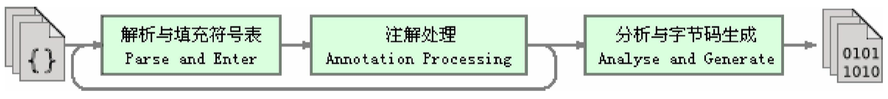

`Javac` 编译动作的入口是 `com.sun.tools.javac.main.JavaCompiler` 类。

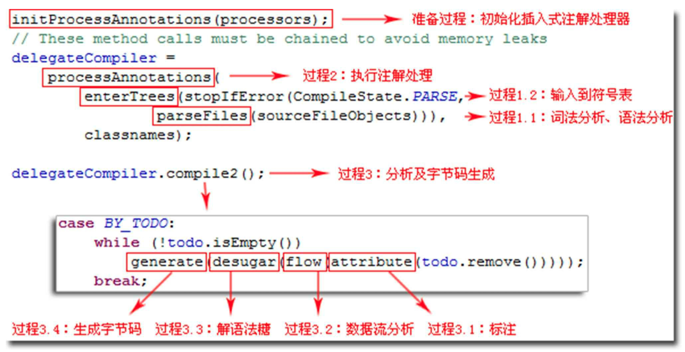

#### 3，`Java` 语法糖

- 泛型

**泛型的本质** 是参数化类型（`Parameterized Type`）或者参数化多态（`Parametric Polymorphism`）的应用，即可以将操作的数据类型指定为方法签名中的一种特殊参数，这种参数类型能够用在类、接口和方法的创建中，分别构成泛型类、泛型接口和泛型方法。`Java` 于2004年 `JDK5.0` 引入。

`Java` 选择的泛型实现方式叫作“**类型擦除式泛型**”（`Type Erasure Generics`），而 `C#` 选择的泛型实现方式是“**具现化式泛型**”（`Reified Generics`）。

擦除式泛型的实现几乎只需要在 `Javac` 编译器上做出改进即可，不需要改动字节码、不需要改动 `Java` 虚拟机，也保证了以前没有使用泛型的库可以 直接运行在 `Java 5.0` 之上。

以 `ArrayList` 为例来介绍 `Java` 泛型的 **类型擦除** 具体是如何实现的。由于 `Java` 选择了直接把已有的类型泛型化。要让所有需要泛型化的已有类型，譬如 `ArrayList`，原地泛型化后变成 了 `ArrayList<T>`，而且保证以前直接用 `ArrayList` 的代码在泛型新版本里必须还能继续用这同一个容器，这就必须让所有泛型化的实例类型，譬如 `ArrayList<Integer>`、`ArrayList<String>` 这些全部自动成为 `ArrayList` 的子类型才能可以，否则类型转换就是不安全的。由此就引出了“**裸类型**”（`Raw Type`）的概念，裸类型应被视为所有该类型泛型化实例的共同父类型（`Super Type`）。

代码清单 10-1　裸类型赋值

```java
package com.jvm;

import j0ava.util.ArrayList;

/**
 * 泛型示例
 * 1. 裸类型赋值
 *
 * @author zhangbocheng
 * @version v1.0
 * @date 2020/9/17 23:44
 */
public class GenericsDemo {

    public static void main(String[] args) {

        ArrayList<Integer> iList = new ArrayList<>(16);
        ArrayList<String> sList = new ArrayList<>(16);
        // 裸类型
        ArrayList list;
        list = iList;
        list = sList;
    }
}
```

如何实现裸类型？

> 1）是在运行期由 `Java` 虚拟机来自动地、真实地构造出 `ArrayList<Integer>` 这样的类型，并且自动实现从 `ArrayList<Integer>` 派生自 `ArrayList` 的继承关系来满足裸类型的定义；
>
> 2）是直接在编译时把 `ArrayList<Integer>` 还原回 `ArrayList`，只在元素访问、修改时自动插入一些强制类型转换和检查指令。


擦除法所谓的 **擦除**，仅仅是对方法的 `Code` 属性中的字节码进行擦除，实际上元数据中还是保留了泛型信息，这也是在编码时能通过反射手段取得参数化类型的根本依据。

- 自动装箱、拆箱与遍历循环

代码清单 10-2　自动装箱、拆箱与遍历循环

```java
package com.jvm;

import java.util.ArrayList;
import java.util.Arrays;
import java.util.List;

/**
 * 泛型&装箱示例
 * 1. 裸类型赋值
 * 2. 自动装箱、拆箱与遍历循环
 *
 * @author zhangbocheng
 * @version v1.0
 * @date 2020/9/17 23:44
 */
public class GenericsDemo {

    public static void main(String[] args) {

        List<Integer> ls = Arrays.asList(1, 2, 3, 4);
        int sum =0;
        for (int i: ls) {
            sum += i;
        }

        System.out.println(sum);
    }
}
```

代码清单 10-3　自动装箱的陷阱

```java
package com.jvm;

import java.util.ArrayList;
import java.util.Arrays;
import java.util.List;

/**
 * 泛型&装箱示例
 * 1. 裸类型赋值
 * 2. 自动装箱、拆箱与遍历循环
 * 3. 自动装箱的陷阱
 *
 * @author zhangbocheng
 * @version v1.0
 * @date 2020/9/17 23:44
 */
public class GenericsDemo {

    public static void main(String[] args) {
       
        Integer a = 1, b = 2, c = 3, d = 3;
        Integer e = 321, f = 321;
        Long g = 3L;
        // true
        System.out.println(c == d);
        // false
        System.out.println(e == f);
        // true
        System.out.println(c == (a + b));
        // true
        System.out.println(c.equals(a + b));
        // true
        System.out.println(g == (a + b));
        // false
        System.out.println(g.equals(a + b));
    }
}
```

- 条件编译

`Java` 可以进行条件编译，方法是使用条件为常量的 `if` 语句。

`Java` 语言中条件编译的实现，也是 `Java` 语言的一颗语法糖，根据布尔常量值的真假，编译器将会把分支中不成立的代码块消除掉，这一工作将在编译器解除语法糖阶段（`com.sun.tools.javac.comp.Lower` 类中）完成。

#### 4，实战：插入式注解处理器

实现注解处理器的代码需要继承抽象类 `javax.annotation.processing.AbstractProcessor`，这个抽象类中只有一个子类必须实现的抽象方法：“`process()`”，它是 `Javac` 编译器在执行注解处理器代码时要调用的过程，可以从这个方法的第一个参数“`annotations`”中获取到此注解处理器所要处理的注解集合，从第二个参数“`roundEnv`”中访问到当前这个轮次（`Round`）中的抽象语法树节点，每个语法树节点在这里都表示为一个 `Element`。在 `javax.lang.model.ElementKind` 中定义了18类 `Element`，已经包括了 `Java` 代码中可能出现 的全部元素，如：“包（`PACKAGE`）、枚举（`ENUM`）、类（`CLASS`）、注解 （`ANNOTATION_TYPE`）、接口（`INTERFACE`）、枚举值（`ENUM_CONSTANT`）、字段 （`FIELD`）、参数（`PARAMETER`）、本地变量（`LOCAL_VARIABLE`）、异常（`EXCEPTION_PARAMETER`）、方法（`METHOD`）、构造函数（`CONSTRUCTOR`）、静态语句块 （`STATIC_INIT`，即 `static{}` 块）、实例语句块（`INSTANCE_INIT`，即 `{}` 块）、参数化类型 （`TYPE_PARAMETER`，泛型尖括号内的类型）、资源变量（`RESOURCE_VARIABLE`，`try-resource` 中定义的变量）、模块（`MODULE`）和未定义的其他语法树节点（`OTHER`）”。除了 `process()` 方法的 传入参数之外，还有一个很重要的实例变量“`processingEnv`”，它是 `AbstractProcessor` 中的一个 `protected` 变量，在注解处理器初始化的时候（`init()` 方法执行的时候）创建，继承了 `AbstractProcessor` 的注解处理器代码可以直接访问它。

代码清单10-4 注解处理器 `NameCheckProcessor`

```java
package com.jvm;

import javax.annotation.processing.*;
import javax.lang.model.SourceVersion;
import javax.lang.model.element.Element;
import javax.lang.model.element.TypeElement;
import java.util.Set;

/**
 * 注解处理器 NameCheckProcessor
 *
 * @author zhangbocheng
 * @version v1.0
 * @date 2020/9/18 00:24
 */
@SupportedAnnotationTypes("*")
@SupportedSourceVersion(SourceVersion.RELEASE_8)
public class NameCheckProcessor extends AbstractProcessor {

    private NameChecker nameChecker;

    /**
     * 初始化名称检查插件
     * @param processingEnv 环境变量参数
     */
    @Override
    public synchronized void init(ProcessingEnvironment processingEnv) {
        super.init(processingEnv);
        nameChecker = new NameChecker(processingEnv);
    }

    /**
     * 对输入的语法树的各个节点进行名称检查
     * @param annotations annotations 参数
     * @param roundEnv 环境变量参数
     * @return true or false
     */
    @Override
    public boolean process(Set<? extends TypeElement> annotations, RoundEnvironment roundEnv) {
        if (!roundEnv.processingOver()) {
            for (Element element: roundEnv.getRootElements()) {
                nameChecker.checkNames(element);
            }
        }

        return false;
    }
}
```

代码清单10-5 命名检查器 `NameChecker`

```java
package com.jvm;

import javax.annotation.processing.Messager;
import javax.annotation.processing.ProcessingEnvironment;
import javax.lang.model.element.*;
import javax.lang.model.util.ElementScanner8;
import javax.tools.Diagnostic;
import java.util.EnumSet;

import static javax.lang.model.element.ElementKind.*;
import static javax.lang.model.element.Modifier.*;
import static javax.tools.Diagnostic.Kind.*;

/**
 * 命名检查器 NameChecker
 * 程序名称规范的编译器插件：
 *  如果程序命名不合规范，将会输出一个编译器的 WARNING 信息
 *
 * @author zhangbocheng
 * @version v1.0
 * @date 2020/9/18 00:29
 */
public class NameChecker {

    private final Messager messager;

    NameCheckScanner nameCheckScanner = new NameCheckScanner();

    public NameChecker(ProcessingEnvironment processingEnv) {
        this.messager = processingEnv.getMessager();
    }

    /**
     * 对Java程序命名进行检查，根据《Java语言规范》第三版第6.8节的要求，Java程序命名应当符合下列格式：
     * 类或接口：符合驼式命名法，首字母大写。
     * 方法：符合驼式命名法，首字母小写。
     * 字段：
     *      类、实例变量: 符合驼式命名法，首字母小写。
     *      常量: 要求全部大写。
     * @param element 要检查的元素
     */
    public void checkNames(Element element) {
        nameCheckScanner.scan(element);
    }

    /**
     * 名称检查器实现类，继承了 JDK 8 中新提供的ElementScanner8
     * 将会以Visitor模式访问抽象语法树中的元素
     */
    private class NameCheckScanner extends ElementScanner8<Void, Void> {
        /**
         * 检查Java类
         */
        @Override
        public Void visitType(TypeElement e, Void p) {
            scan(e.getTypeParameters(), p);
            checkCamelCase(e, true);
            super.visitType(e, p);
            return null;
        }

        /**
         * 检查方法命名是否合法
         */
        @Override
        public Void visitExecutable(ExecutableElement e, Void p) {
            if (e.getKind() == ElementKind.METHOD) {
                Name name = e.getSimpleName();
                if (name.contentEquals(e.getEnclosingElement().getSimpleName())) {
                    messager.printMessage(Diagnostic.Kind.WARNING,
                            "一个普通方法 “" + name + "” 不应当与类名重复，避免与构造函数产生混淆");
                }

                checkCamelCase(e, false);
            }
            super.visitExecutable(e, p);
            return null;
        }

        /**
         * 检查变量命名是否合法
         */
        @Override
        public Void visitVariable(VariableElement e, Void p) {
            if (e.getKind() == ENUM_CONSTANT || e.getConstantValue() != null || heuristicallyConstant(e)) {
                checkAllCaps(e);
            } else {
                checkCamelCase(e, false);
            }

            return null;
        }

        /**
         * 大写命名检查，要求第一个字母必须是大写的英文字母，其余部分可以是下划线或大写字母
         */
        private void checkAllCaps(Element e) {
            String name = e.getSimpleName().toString();
            boolean conventional = true;
            int firstCodePoint = name.codePointAt(0);

            if (!Character.isUpperCase(firstCodePoint)) {
                conventional = false;
            } else {
                boolean previousUnderscore = false;
                int cp = firstCodePoint;
                for (int i = Character.charCount(cp); i < name.length(); i += Character.charCount(cp)) {
                    cp = name.codePointAt(i);
                    if (cp == (int) '_') {
                        if (previousUnderscore) {
                            conventional = false;
                            break;
                        }
                        previousUnderscore = true;
                    } else {
                        previousUnderscore = false;
                        if (!Character.isUpperCase(cp) && !Character.isDigit(cp)) {
                            conventional = false;
                            break;
                        }
                    }
                }
            }

            if (!conventional) {
                messager.printMessage(WARNING, "常量“" + name + "”应当全部以大写字母或下划线命名，并且以字母开头", e);
            }
        }

        /**
         * 判断一个变量是否是常量
         */
        private boolean heuristicallyConstant(VariableElement e) {
            if (e.getEnclosingElement().getKind() == INTERFACE) {
                return true;
            } else {
                return e.getKind() == FIELD && e.getModifiers().containsAll(EnumSet.of(PUBLIC, STATIC, FINAL));
            }
        }

        /**
         * 检查传入的Element是否符合驼式命名法，如果不符合，则输出警告信息
         */
        private void checkCamelCase(Element e, boolean initialCaps) {
            String name = e.getSimpleName().toString();
            boolean previousUpper = false;
            boolean conventional = true;
            int firstCodePoint = name.codePointAt(0);

            if (Character.isUpperCase(firstCodePoint)) {
                previousUpper = true;
                if (!initialCaps) {
                    messager.printMessage(WARNING, "名称 “" + name + "” 应当以小写字母开头", e);
                    return;
                }
            } else if (Character.isLowerCase(firstCodePoint)) {
                if (initialCaps) {
                    messager.printMessage(WARNING, "名称 “" + name + "” 应当以大写字母开头", e);
                    return;
                }
            } else {
                conventional = false;
            }

            if (conventional) {
                int cp = firstCodePoint;
                for (int i = Character.charCount(cp); i < name.length(); i += Character.charCount(cp)) {
                    cp = name.codePointAt(i);
                    if (Character.isUpperCase(cp)) {
                        if (previousUpper) {
                            conventional = false;
                            break;
                        }
                        previousUpper = true;
                    } else {
                        previousUpper = false;
                    }
                }
            }

            if (!conventional) {
                messager.printMessage(WARNING, "名称 “" + name + "” 应当符合驼式命名法(Camel Case Names)", e);
            }
        }
    }
}
```

代码清单10-6 包含了多处不规范命名的代码样例

```java
package com.jvm;

/**
 * 包含了多处不规范命名的代码样例
 *
 * @author zhangbocheng
 * @version v1.0
 * @date 2020/9/20 18:23
 */
public class BADLY_NAMED_CODE {
    enum colors {
        red, blue, green;
    }

    static final int _FORTY_TWO = 42;
    public static int NOT_A_CONSTANT = _FORTY_TWO;

    protected void BADLY_NAMED_CODE() {
        return;
    }

    public void NOTcamelCASEmethodNAME() {
        return;
    }
}
```

运行测试：

```bash
☁  java [interview] ⚡  javac com/jvm/NameChecker.java                                         
☁  java [interview] ⚡  javac com/jvm/NameCheckProcessor.java                                 
☁  java [interview] ⚡  javac -processor com.jvm.NameCheckProcessor com/jvm/BADLY_NAMED_CODE.java
警告: 来自注释处理程序 'com.jvm.NameCheckProcessor' 的受支持 source 版本 'RELEASE_8' 低于 -source '11'
com/jvm/BADLY_NAMED_CODE.java:10: 警告: 名称 “BADLY_NAMED_CODE” 应当符合驼式命名法(Camel Case Names)
public class BADLY_NAMED_CODE {
       ^
com/jvm/BADLY_NAMED_CODE.java:11: 警告: 名称 “colors” 应当以大写字母开头
    enum colors {
    ^
com/jvm/BADLY_NAMED_CODE.java:12: 警告: 常量“red”应当全部以大写字母或下划线命名，并且以字母开头
        red, blue, green;
        ^
com/jvm/BADLY_NAMED_CODE.java:12: 警告: 常量“blue”应当全部以大写字母或下划线命名，并且以字母开头
        red, blue, green;
             ^
com/jvm/BADLY_NAMED_CODE.java:12: 警告: 常量“green”应当全部以大写字母或下划线命名，并且以字母开头
        red, blue, green;
                   ^
com/jvm/BADLY_NAMED_CODE.java:15: 警告: 常量“_FORTY_TWO”应当全部以大写字母或下划线命名，并且以字母开头
    static final int _FORTY_TWO = 42;
                     ^
com/jvm/BADLY_NAMED_CODE.java:16: 警告: 名称 “NOT_A_CONSTANT” 应当以小写字母开头
    public static int NOT_A_CONSTANT = _FORTY_TWO;
                      ^
警告: 一个普通方法 “BADLY_NAMED_CODE” 不应当与类名重复，避免与构造函数产生混淆
com/jvm/BADLY_NAMED_CODE.java:18: 警告: 名称 “BADLY_NAMED_CODE” 应当以小写字母开头
    protected void BADLY_NAMED_CODE() {
                   ^
com/jvm/BADLY_NAMED_CODE.java:22: 警告: 名称 “NOTcamelCASEmethodNAME” 应当以小写字母开头
    public void NOTcamelCASEmethodNAME() {
                ^
11 个警告

```

## 十一，后端编译与优化

#### 1，即时编译器

- 解释器与编译器

> 解释器与编译器两者各有优势：
>
> > 当程序需要迅速启动和执行的时候，解释器可以首先发挥作用，省去编译的时间，立即运行；
> >
> > 当程序启动后，随着时间的推移，编译器逐渐发挥作用，把越来越多的代码编译成本地代码，这样可以减少解释器的中间损耗，获得更高的执行效率；
> >
> > 当程序运行环境中内存资源限制较大，可以使用解释执行节约内存（如部分嵌入式系统中和大部分的  `JavaCard` 应用中就只有解释器的存在），反之可以使用编译执行来提升效率；
> >
> > 解释器可以作为编译器激进优化时后备的“**逃生门**”（如果情况允许，`HotSpot` 虚拟机中也会采用不进行激进优化的客户端编译器充当“逃生门”的角色），让编译器根据概率选择一些不能保证所有情况都正确，但大多数时候都能提升运行速度的优化手段，当激进优化的假设不成立，如加载了新类以后，类型继承结构出现变化、出现“**罕见陷阱**”（`Uncommon Trap`）时可以通过 **逆优化**（`Deoptimization`）退回到解释状态继续执行，因此在整个 `Java` 虚拟机执行架构里，解释器与编译器经常是相辅相成地配合工作。
>
> `HotSpot` 虚拟机中内置了两个（或三个）即时编译器，其中有两个编译器存在已久，分别被称为“**客户端编译器**”（`Client Compiler`）和“**服务端编译器**”（`Server Compiler`），或者简称为 **`C1` 编译器** 和 **`C2` 编译器**，第三个是在 `JDK 10` 时才出现的、长期目标是代替 `C2` 的 `Graal` 编译器。`Graal` 编译器目前还处于实验状态。
>
> 在分层编译（`Tiered Compilation`）的工作模式出现以前，`HotSpot` 虚拟机通常是采用解释器与其中一个编译器直接搭配的方式工作，程序使用哪个编译器，只取决于虚拟机运行的模式，`HotSpot` 虚拟机会根据自身版本与宿主机器的硬件性能自动选择运行模式，用户也可以使用“`-client`”或“`-server`”参数去强制指定虚拟机运行在客户端模式还是服务端模式。
>
> 无论采用的编译器是客户端编译器还是服务端编译器，解释器与编译器搭配使用的方式在虚拟机中被称为“**混合模式**”（`Mixed Mode`），用户也可以使用参数“`-Xint`”强制虚拟机运行于“**解释模式**”（`Interpreted Mode`），这时候编译器完全不介入工作，全部代码都使用解释方式执行；另外，也 可以使用参数“`-Xcomp`”强制虚拟机运行于“**编译模式**”（`Compiled Mode`），这时候将优先采用编译方式执行程序，但是解释器仍然要在编译无法进行的情况下介入执行过程。
>
> 在 `JDK 7` 的服务端模式虚拟机中作为默认编译策略被开启。分层编译根据编译器编译、优化的规模与耗时，划分出不同的编译层次，其中包括：
>
> > 第0层：程序纯解释执行，并且解释器不开启性能监控功能（`Profiling`）；
> >
> > 第1层：使用客户端编译器将字节码编译为本地代码来运行，进行简单可靠的稳定优化，不开启性能监控功能；
> >
> > 第2层：仍然使用客户端编译器执行，仅开启方法及回边次数统计等有限的性能监控功能；
> >
> > 第3层：仍然使用客户端编译器执行，开启全部性能监控，除了第2层的统计信息外，还会收集如分支跳转、虚方法调用版本等全部的统计信息；
> >
> > 第4层：使用服务端编译器将字节码编译为本地代码，相比起客户端编译器，服务端编译器会启用更多编译耗时更长的优化，还会根据性能监控信息进行一些不可靠的激进优化。

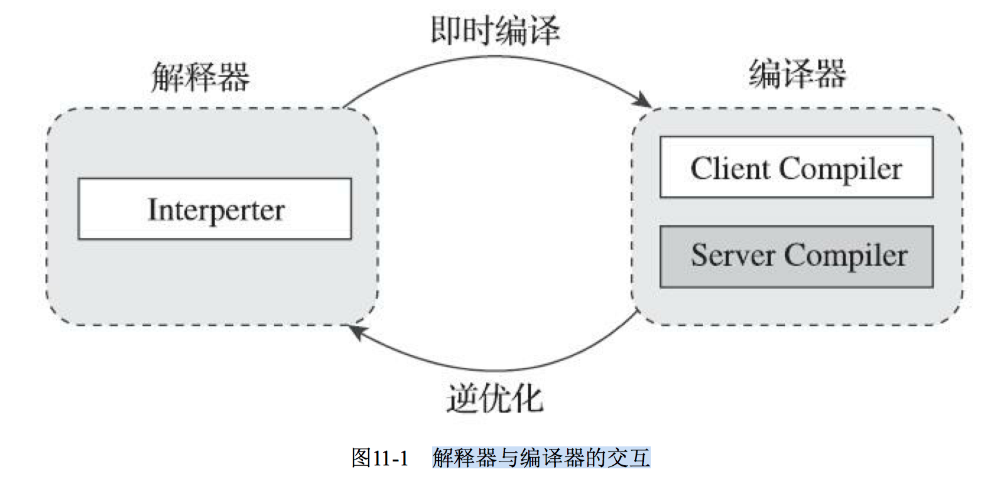

代码清单11-1　虚拟机执行模式

```bash
☁  java_projects [interview] java -version
java version "11.0.6" 2020-01-14 LTS
Java(TM) SE Runtime Environment 18.9 (build 11.0.6+8-LTS)
Java HotSpot(TM) 64-Bit Server VM 18.9 (build 11.0.6+8-LTS, mixed mode)
☁  java_projects [interview] java -Xint -version 
java version "11.0.6" 2020-01-14 LTS
Java(TM) SE Runtime Environment 18.9 (build 11.0.6+8-LTS)
Java HotSpot(TM) 64-Bit Server VM 18.9 (build 11.0.6+8-LTS, interpreted mode)
☁  java_projects [interview] java -Xcomp -version
java version "11.0.6" 2020-01-14 LTS
Java(TM) SE Runtime Environment 18.9 (build 11.0.6+8-LTS)
Java HotSpot(TM) 64-Bit Server VM 18.9 (build 11.0.6+8-LTS, compiled mode)
```

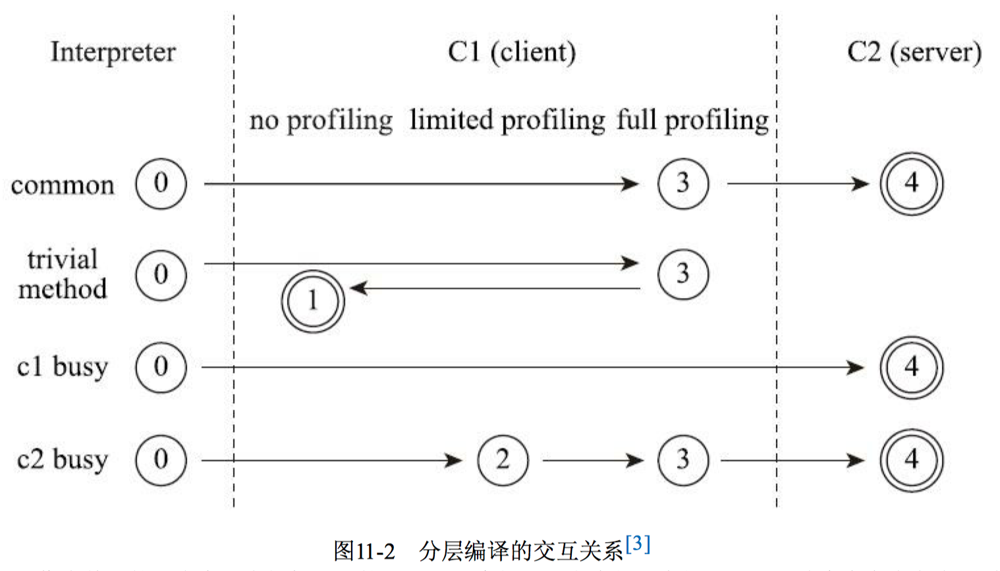

- 编译对象与触发条件

在运行过程中会被即时编译器编译的目标是“**热点代码**”，主要有两类：

> 1）**被多次调用的方法**：依靠方法调用触发的编译，那编译器理所当然地会以整个方法作为编译对象，这种编译也是虚拟机中标准的即时编译方式。
>
> 2）**被多次执行的循环体**：尽管编译动作是由循环体所触发的，热点只是方法的一 部分，但编译器依然必须以整个方法作为编译对象，只是执行入口（从方法第几条字节码指令开始执行）会稍有不同，编译时会传入执行入口点字节码序号（`Byte Code Index，BCI`）。这种编译方式因为编译发生在方法执行的过程中，因此被称为“**栈上替换**”（`On Stack Replacement，OSR`），即方法的栈帧还在栈上，方法就被替换。

要知道某段代码是不是热点代码，是不是需要触发即时编译，这个行为称为“**热点探测**”（`Hot Spot Code Detection`），其实进行热点探测并不一定要知道方法具体被调用了多少次，目前主流的热点探测判定方式有：

> 1）**基于采样的热点探测**（`Sample Based Hot Spot Code Detection`）：采用这种方法的虚拟机会周期性地检查各个线程的调用栈顶，如果发现某个（或某些）方法经常出现在栈顶，那这个方法就是“**热点方法**”。基于采样的热点探测的 **好处** 是实现简单高效，还可以很容易地获取方法调用关系（将调用堆栈展开即可），**缺点** 是很难精确地确认一个方法的热度，容易因为受到线程阻塞或别的外界因素的影响而 扰乱热点探测；
>
> 2）**基于计数器的热点探测**（`Counter Based Hot Spot Code Detection`）：采用这种方法的虚拟机会为每个方法（甚至是代码块）建立计数器，统计方法的执行次数，如果执行次数超过一定的阈值就认为它是“**热点方法**”。这种统计方法实现起来要麻烦一些，需要为每个方法建立并维护计数器，而且不能直接获取到方法的调用关系，但是它的统计结果相对来说更加精确严谨。

在 `HotSpot` 虚拟机中使用的是基于计数器的热点探测方法，为了实现热点计数，`HotSpot` 为每个方法准备了两类计数器：

> **方法调用计数器**（`Invocation Counter`）：
>
> > 用于统计方法被调用的次数，它的默认阈值在客户端模式下是1500次，在服务端模式下是10000次，这个阈值可以通过虚拟机参数 `-XX： CompileThreshold` 来人为设定。当一个方法被调用时，虚拟机会先检查该方法是否存在被即时编译过的版本，如果存在，则优先使用编译后的本地代码来执行。如果不存在已被编译过的版本，则将该方法 的调用计数器值加一，然后判断方法调用计数器与回边计数器值之和是否超过方法调用计数器的阈值。一旦已超过阈值的话，将会向即时编译器提交一个该方法的代码编译请求。
> >
> > 如果没有做过任何设置，执行引擎默认不会同步等待编译请求完成，而是继续进入解释器按照解释方式执行字节码，直到提交的请求被即时编译器编译完成。
> >
> > 在默认设置下，方法调用计数器统计的并不是方法被调用的绝对次数，而是一个相对的执行频率，即一段时间之内方法被调用的次数。当超过一定的时间限度，如果方法的调用次数仍然不足以让它提交给即时编译器编译，那该方法的调用计数器就会被减少一半，这个过程被称为方法调用计数器 **热度的衰减**（`Counter Decay`），而这段时间就称为此方法统计的 **半衰周期**（`Counter Half Life Time`）， 进行热度衰减的动作是在虚拟机进行垃圾收集时顺便进行的，可以使用虚拟机参数 `-XX：UseCounterDecay` 来关闭热度衰减，让方法计数器统计方法调用的绝对次数，这样只要系统运行时间足 够长，程序中绝大部分方法都会被编译成本地代码；另外还可以使用 `-XX：CounterHalfLifeTime` 参数设置半衰周期的时间，单位是秒。
>
> **回边计数器**（`Back Edge Counter`，“回边”的意思是指在循环边界往回跳转）：
>
> > 其作用是统计一个方法中循环体代码执行的次数，在字节码中遇到控制流向后跳转的指令就称为“**回边**（`Back Edge`）”，很显然建立回边计数器统计的目的是为了触发栈上的替换编译。
> >
> > 关于回边计数器的阈值，虽然 `HotSpot` 虚拟机也提供了一个类似于方法调用计数器阈值 `-XX： CompileThreshold` 的参数 `-XX：BackEdgeThreshold` 供用户设置，但是当前的 `HotSpot` 虚拟机实际上并未使用此参数，必须设置另外一个参数 `-XX：OnStackReplacePercentage` 来间接调整回边计数器的阈值，其计算公式有：
> >
> > > 1）客户端模式下，回边计数器阈值计算公式为：方法调用计数器阈值（`-XX： CompileThreshold`）乘以 `OSR` 比率（`-XX：OnStackReplacePercentage`）除以100。其中 `-XX： OnStackReplacePercentage` 默认值为933，如果都取默认值，那客户端模式虚拟机的回边计数器的阈值为 13995；
> > >
> > > 2）服务端模式下，回边计数器阈值的计算公式为：方法调用计数器阈值（`-XX： CompileThreshold`）乘以（`OSR` 比率（`-XX：OnStackReplacePercentage`）减去解释器监控比率（`-XX： InterpreterProfilePercentage`）的差值）除以100。其中 `-XX：OnStack ReplacePercentage` 默认值为140，`XX：InterpreterProfilePercentage` 默认值为33，如果都取默认值，那服务端模式虚拟机回边计数器的阈值为10700。
> >
> > 当解释器遇到一条回边指令时，会先查找将要执行的代码片段是否有已经编译好的版本，如果有，它将会优先执行已编译的代码，否则就把回边计数器的值加一，然后判断方法调用计数器与回边计数器值之和是否超过回边计数器的阈值。当超过阈值的时候，将会提交一个栈上替换编译请求， 并且把回边计数器的值稍微降低一些，以便继续在解释器中执行循环，等待编译器输出编译结果。

当虚拟机运行参数确定的前提下，这两个计数器都有一个明确的阈值，计数器阈值一旦溢出，就会触发即时编译。

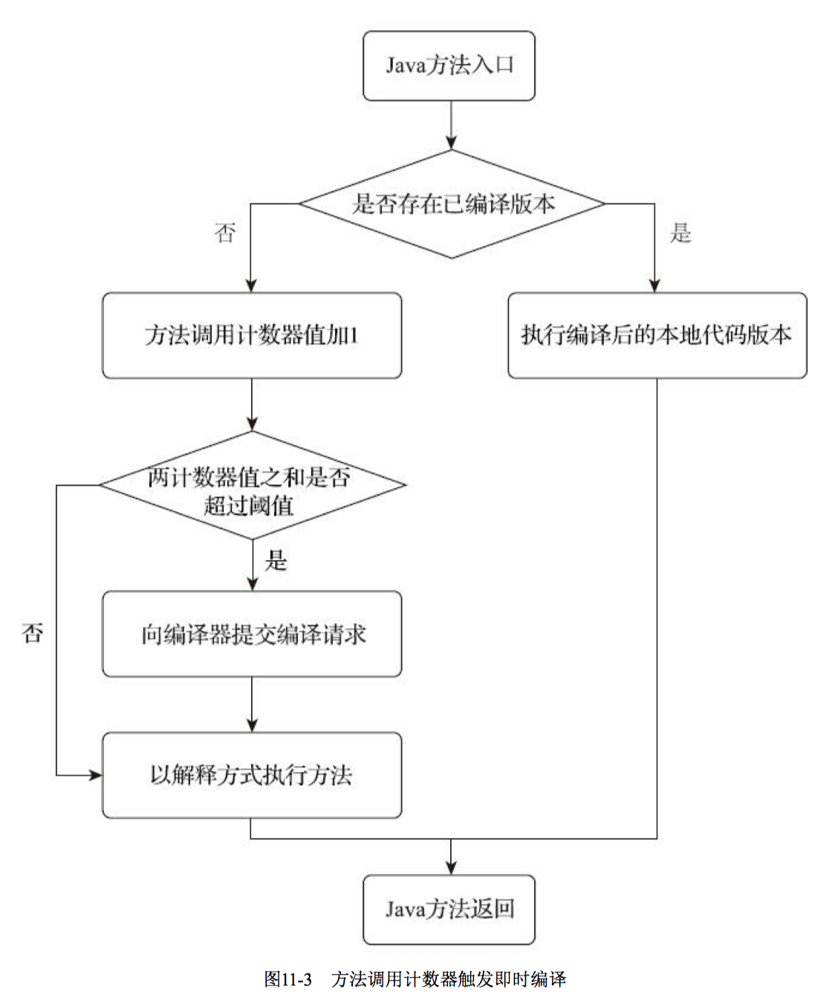

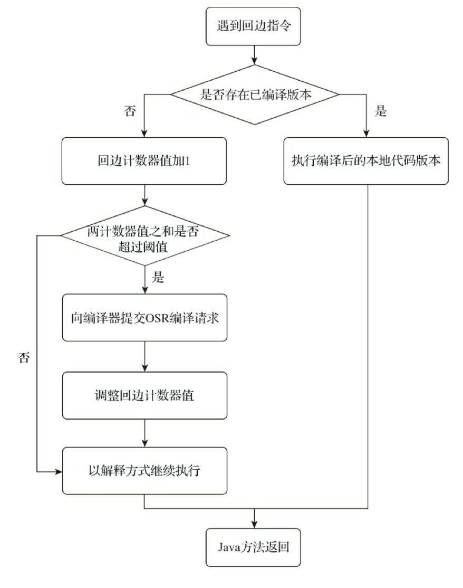

- 编译过程

在默认条件下，无论是方法调用产生的标准编译请求，还是栈上替换编译请求，虚拟机在编译器还未完成编译之前，都仍然将按照解释方式继续执行代码，而编译动作则在后台的编译线程中进行。 用户可以通过参数 `-XX：-BackgroundCompilation` 来禁止后台编译，后台编译被禁止后，当达到触发即时编译的条件时，执行线程向虚拟机提交编译请求以后将会一直阻塞等待，直到编译过程完成再开始 执行编译器输出的本地代码。

对于客户端编译器来说，它是一个相对简单快速的三段式编译器，主要的 **关注点** 在于局部性的优化，而放弃了许多耗时较长的全局优化手段。

> 第一阶段：一个平台独立的前端将字节码构造成一种 **高级中间代码表示**（`High-Level Intermediate Representation`，`HIR`，即与目标机器指令集无关的中间表示）。`HIR` 使用静态单分配 （`Static Single Assignment，SSA`）的形式来代表代码值，这可以使得一些在 `HIR` 的构造过程之中和之后进行的优化动作更容易实现。在此之前编译器已经会在字节码上完成一部分基础优化，如方法内联、常量传播等优化将会在字节码被构造成 `HIR`之前完成；
>
> 第二阶段：一个平台相关的后端从 `HIR` 中产生 **低级中间代码表示**（`Low-Level Intermediate Representation`，`LIR`，即与目标机器指令集相关的中间表示），而在此之前会在 `HIR` 上完成另外一些优 化，如空值检查消除、范围检查消除等，以便让 `HIR` 达到更高效的代码表示形式；
>
> 第三阶段：是在平台相关的后端使用线性扫描算法（`Linear Scan Register Allocation`）在 `LIR` 上分配寄存器，并在 `LIR` 上做窥孔（`Peephole`）优化，然后产生机器代码。

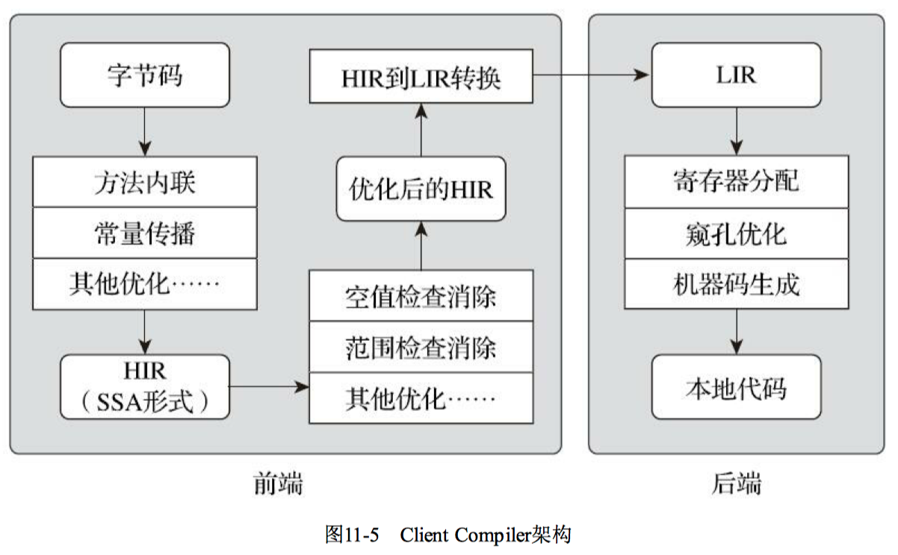

- 实战：查看及分析即时编译结果

代码清单11-2　查看及分析即时编译结果用例

```java
package com.jvm;

/**
 * 查看及分析即时编译结果
 * VM Args： -XX:+PrintCompilation (要求虚拟机在即时编译时将被编译成本地代码的方法名称打印出来)
 * VM Args： -XX:+UnlockDiagnosticVMOptions -XX:+PrintInlining (要求虚拟机输出方法内联信息)
 * ==============only in debug version of VM============================
 * VM Args： -XX:+PrintOptoAssembly（用于服务端模式的虚拟机）
 * VM Args： -XX:+PrintLIR（用于客户端模式的虚拟机）来输出比较接近最终结果的中间代码表示
 *
 * @author zhangbocheng
 * @version v1.0
 * @date 2020/9/21 09:44
 */
public class JitCompilerTest {

    public static final int NUM = 15000;

    public static int doubleValue(int i) {
        // 空循环用于后面演示JIT代码优化过程
        int count = 100000;
        for (int j = 0; j < count; j++) { }
        return i * 2;
    }

    public static long calcSum() {
        long sum = 0;
        int count = 100;
        for (int i = 0; i < count; i++) {
            sum += doubleValue(i);
        }

        return sum;
    }

    public static void main(String[] args) {
        for (int i = 0; i < NUM; i++) {
            calcSum();
        }
    }
}
```

运行结果：

1）要求虚拟机在即时编译时将被编译成本地代码的方法名称打印出来

```bash
132    1       3       java.lang.String::equals (81 bytes)
133    2       3       java.lang.String::hashCode (55 bytes)
134    3       4       java.lang.String::charAt (29 bytes)
134    4     n 0       java.lang.System::arraycopy (native)   (static)
134    5       3       java.lang.String::lastIndexOf (52 bytes)
135    6       3       java.lang.Object::<init> (1 bytes)
135    8       3       java.lang.Math::min (11 bytes)
135    7       3       java.lang.String::length (6 bytes)
139    9       3       java.lang.String::indexOf (70 bytes)
140   10       3       java.lang.System::getSecurityManager (4 bytes)
140   11       3       sun.nio.cs.UTF_8$Encoder::encode (359 bytes)
141   12       3       java.lang.AbstractStringBuilder::append (50 bytes)
142   14       3       java.lang.Character::toLowerCase (9 bytes)
142   15       3       java.lang.CharacterData::of (120 bytes)
143   16       3       java.lang.CharacterDataLatin1::toLowerCase (39 bytes)
143   13       3       java.lang.String::getChars (62 bytes)
159   17       3       java.util.HashMap::getNode (148 bytes)
159   18       3       java.lang.String::indexOf (166 bytes)
160   19       3       java.lang.String::indexOf (7 bytes)
161   20       1       java.lang.Object::<init> (1 bytes)
161    6       3       java.lang.Object::<init> (1 bytes)   made not entrant
163   21       3       java.io.UnixFileSystem::normalize (75 bytes)
164   22       3       java.util.HashMap::hash (20 bytes)
166   23     n 0       java.lang.Thread::currentThread (native)   (static)
167   24       3       java.util.Arrays::copyOfRange (63 bytes)
168   25       3       java.lang.ref.SoftReference::get (29 bytes)
168   26       3       java.lang.String::startsWith (72 bytes)
169   27       1       java.lang.ref.Reference::get (5 bytes)
169   28       1       java.lang.String::length (6 bytes)
169    7       3       java.lang.String::length (6 bytes)   made not entrant
171   29       3       java.lang.ThreadLocal::getMap (5 bytes)
171   30       1       java.lang.ThreadLocal::access$400 (5 bytes)
171   31       3       java.lang.String::<init> (82 bytes)
172   32       3       java.lang.Character::toLowerCase (6 bytes)
172   33       3       java.lang.StringCoding::deref (19 bytes)
173   34       3       java.lang.ThreadLocal::get (38 bytes)
173   35       1       java.net.URL::getProtocol (5 bytes)
176   36       3       java.util.Arrays::copyOf (19 bytes)
176   38       1       java.net.URL::getAuthority (5 bytes)
176   39       1       java.net.URL::getPath (5 bytes)
176   37  s    1       java.util.Vector::size (5 bytes)
177   40       3       java.nio.charset.CharsetEncoder::maxBytesPerChar (5 bytes)
177   41       1       java.io.File::getPath (5 bytes)
178   42       1       java.net.URL::getFile (5 bytes)
178   43       3       java.lang.String::lastIndexOf (13 bytes)
179   44       3       java.io.UnixFileSystem::prefixLength (25 bytes)
181   45       1       java.util.ArrayList::size (5 bytes)
185   46       3       java.lang.StringBuilder::append (8 bytes)
188   47 %     3       com.jvm.JitCompilerTest::doubleValue @ 5 (20 bytes)
188   48       3       com.jvm.JitCompilerTest::doubleValue (20 bytes)
189   49 %     4       com.jvm.JitCompilerTest::doubleValue @ 5 (20 bytes)
190   47 %     3       com.jvm.JitCompilerTest::doubleValue @ -2 (20 bytes)   made not entrant
190   50       4       com.jvm.JitCompilerTest::doubleValue (20 bytes)
190   48       3       com.jvm.JitCompilerTest::doubleValue (20 bytes)   made not entrant
191   51       3       com.jvm.JitCompilerTest::calcSum (28 bytes)
191   52 %     4       com.jvm.JitCompilerTest::calcSum @ 7 (28 bytes)
194   53       4       com.jvm.JitCompilerTest::calcSum (28 bytes)
195   51       3       com.jvm.JitCompilerTest::calcSum (28 bytes)   made not entrant
```

2）要求虚拟机输出方法内联信息

```bash
@ 16   java.lang.Math::min (11 bytes)
@ 48   java.lang.String::lastIndexOfSupplementary (70 bytes)   callee is too large
@ 66   java.lang.String::indexOfSupplementary (71 bytes)   callee is too large
@ 14   java.lang.Math::min (11 bytes)
@ 139   java.lang.Character::isSurrogate (18 bytes)
@ 157  sun/nio/cs/Surrogate$Parser::<init> (not loaded)   not inlineable
@ 175  sun/nio/cs/Surrogate$Parser::parse (not loaded)   not inlineable
@ 186   java.nio.charset.CharsetEncoder::malformedInputAction (5 bytes)
@ 5   java.lang.AbstractStringBuilder::appendNull (56 bytes)   callee is too large
@ 10   java.lang.String::length (6 bytes)
@ 21   java.lang.AbstractStringBuilder::ensureCapacityInternal (27 bytes)
  @ 17   java.lang.AbstractStringBuilder::newCapacity (39 bytes)   callee is too large
  @ 20   java.util.Arrays::copyOf (19 bytes)
    @ 11   java.lang.Math::min (11 bytes)
    @ 14   java.lang.System::arraycopy (0 bytes)   intrinsic
@ 35   java.lang.String::getChars (62 bytes)   callee is too large
@ 9  java/lang/StringIndexOutOfBoundsException::<init> (not loaded)   not inlineable
@ 27  java/lang/StringIndexOutOfBoundsException::<init> (not loaded)   not inlineable
@ 43  java/lang/StringIndexOutOfBoundsException::<init> (not loaded)   not inlineable
@ 58   java.lang.System::arraycopy (0 bytes)   intrinsic
@ 1   java.lang.CharacterData::of (120 bytes)   callee is too large
@ 5   java.lang.CharacterData::toLowerCase (0 bytes)   no static binding
@ 4   java.lang.CharacterDataLatin1::getProperties (11 bytes)
@ 59   java.lang.Object::equals (11 bytes)   no static binding
@ 94   java.util.HashMap$TreeNode::getTreeNode (22 bytes)   not inlineable
@ 126   java.lang.Object::equals (11 bytes)   no static binding
@ 3   java.lang.String::indexOf (70 bytes)   callee is too large
@ 1   java.lang.String::length (6 bytes)
@ 19   java.lang.String::charAt (29 bytes)
  @ 18  java/lang/StringIndexOutOfBoundsException::<init> (not loaded)   not inlineable
@ 44   java.io.UnixFileSystem::normalize (132 bytes)   callee is too large
@ 69   java.io.UnixFileSystem::normalize (132 bytes)   callee is too large
@ 9   java.lang.Object::hashCode (0 bytes)   no static binding
@ 16   java.lang.StringBuilder::<init> (7 bytes)
  @ 3   java.lang.AbstractStringBuilder::<init> (12 bytes)
    @ 1   java.lang.Object::<init> (1 bytes)
@ 20   java.lang.StringBuilder::append (8 bytes)
  @ 2   java.lang.AbstractStringBuilder::append (62 bytes)   callee is too large
@ 25   java.lang.StringBuilder::append (8 bytes)
  @ 2   java.lang.AbstractStringBuilder::append (50 bytes)   callee is too large
@ 29   java.lang.StringBuilder::append (8 bytes)
  @ 2   java.lang.AbstractStringBuilder::append (62 bytes)   callee is too large
@ 32   java.lang.StringBuilder::toString (17 bytes)
  @ 13   java.lang.String::<init> (82 bytes)   callee is too large
@ 35   java.lang.IllegalArgumentException::<init> (6 bytes)   don't inline Throwable constructors
@ 54   java.lang.Math::min (11 bytes)
@ 57   java.lang.System::arraycopy (0 bytes)   intrinsic
@ 1   java.lang.ref.Reference::get (5 bytes)   intrinsic
@ 1   java.lang.Object::<init> (1 bytes)
@ 13  java/lang/StringIndexOutOfBoundsException::<init> (not loaded)   not inlineable
@ 30  java/lang/StringIndexOutOfBoundsException::<init> (not loaded)   not inlineable
@ 65  java/lang/StringIndexOutOfBoundsException::<init> (not loaded)   not inlineable
@ 75   java.util.Arrays::copyOfRange (63 bytes)   callee is too large
@ 1   java.lang.Character::toLowerCase (9 bytes)
  @ 1   java.lang.CharacterData::of (120 bytes)   callee is too large
  @ 5   java.lang.CharacterData::toLowerCase (0 bytes)   no static binding
@ 1   java.lang.ThreadLocal::get (38 bytes)   callee is too large
@ 15   java.lang.ref.SoftReference::get (29 bytes)
  @ 1   java.lang.ref.Reference::get (5 bytes)   intrinsic
@ 0   java.lang.Thread::currentThread (0 bytes)   intrinsic
@ 6   java.lang.ThreadLocal::getMap (5 bytes)
@ 16   java.lang.ThreadLocal$ThreadLocalMap::access$000 (6 bytes)
  @ 2   java.lang.ThreadLocal$ThreadLocalMap::getEntry (42 bytes)   callee is too large
@ 34   java.lang.ThreadLocal::setInitialValue (36 bytes)   callee is too large
@ 2   java.lang.StringCoding::scale (7 bytes)
@ 11   java.lang.Math::min (11 bytes)
@ 14   java.lang.System::arraycopy (0 bytes)   intrinsic
@ 9   java.lang.String::lastIndexOf (52 bytes)   callee is too large
@ 1   java.lang.String::length (6 bytes)
@ 11   java.lang.String::charAt (29 bytes)
  @ 18  java/lang/StringIndexOutOfBoundsException::<init> (not loaded)   not inlineable
@ 2   java.lang.AbstractStringBuilder::append (50 bytes)   callee is too large
@ 14   com.jvm.JitCompilerTest::doubleValue (20 bytes)   inlining prohibited by policy
@ 14   com.jvm.JitCompilerTest::doubleValue (20 bytes)   inline (hot)
@ 14   com.jvm.JitCompilerTest::doubleValue (20 bytes)   inline (hot)
```

#### 2，提前编译器

- 提前编译器分类

> 1）是做与传统 `C`、`C++` 编译器类似的，在程序运行之前把程序代码编译成机器码的静态翻译工作；在 `Java` 中存在的价值直指即时编译的最大弱点：即时编译要占用程序运行时间和运算资源。
>
> 2）是把原本即时编译器在运行时要做的编译工作提前做好并保存下来，下次运行到这些代码（譬如公共库代码在被同一台机器其他 `Java` 进程使用）时直接把它加载进来使用。**本质** 是给即时编译器做缓存加速，去改善 `Java` 程序的启动时间，以及需要一段时间预热后才能到达最高性能的问题。这种提前编译被称为 **动态提前编译**（`Dynamic AOT`）或者叫 **即时编译缓存**（`JIT Caching`）。在目前的 `Java` 技术体系里，这条路径的提前编译已经完全被主流的商用 `JDK` 支持。在商业应用中，这条路径最早出现在 `JDK 6` 版本的 `IBM J9` 虚拟机上，那时候在它的 `CDS`（`Class Data Sharing`）功能的缓存中就有一块是即时编译缓存。

- 提前编译器的优势

> 1）**性能分析制导优化**（`Profile-Guided Optimization，PGO`）：在解释器或者客户端编译器运行过程中，会不断收集性能监控信息，譬如某个程序 点抽象类通常会是什么实际类型、条件判断通常会走哪条分支、方法调用通常会选择哪个版本、循环 通常会进行多少次等，这些数据一般在静态分析时是无法得到的，或者不可能存在确定且唯一的解， 最多只能依照一些启发性的条件去进行猜测。但在动态运行时却能看出它们具有非常明显的偏好性。 如果一个条件分支的某一条路径执行特别频繁，而其他路径鲜有问津，那就可以把热的代码集中放到 一起，集中优化和分配更好的资源（分支预测、寄存器、缓存等）给它；
>
> 2）**激进预测性优化**（`Aggressive Speculative Optimization`）：已经成为很多即时编译优化措施的基础。静态优化无论如何都必须保证优化后所有的程序外部可见影响（不仅仅是执行结果） 与优化前是等效的，不然优化之后会导致程序报错或者结果不对，若出现这种情况，则速度再快也是没有价值的。然而，相对于提前编译来说，即时编译的策略就可以不必这样保守，如果性能监控信息能够支持它做出一些正确的可能性很大但无法保证绝对正确的预测判断，就已经可以大胆地按照高概率的假设进行优化，万一真的走到罕见分支上，大不了退回到低级编译器甚至解释器上去执行，并不会出现无法挽救的后果。只要出错概率足够低，这样的优化往往能够大幅度降低目标程序的复杂度， 输出运行速度非常高的代码；
>
> 3）**链接时优化**（`Link-Time Optimization，LTO`）：`Java` 语言天生就是动态链接的，一个个 `Class` 文件在运行期被加载到虚拟机内存当中，然后在即时编译器里产生优化后的本地代码，这类事情在 `Java` 程序员眼里看起来毫无违和之处。

- 实战：`Jaotc` 的提前编译

`JDK 9` 引入了用于支持对 `Class` 文件和模块进行提前编译的工具 `Jaotc`，以减少程序的启动时间和到达全速性能的预热时间，但由于这项功能必须针对特定物理机器和目标虚拟机的运行参数来使用，加之限制太多，`Java` 开发人员对此了解、使用普遍比较少，将用 `Jaotc` 来编译 `Java SE` 的基础库 （`java.base` 模块），以改善本机 `Java` 环境的执行效率。

代码清单11-3　`Jaotc` 的提前编译用例

```java
package com.jvm;

/**
 * Jaotc 的提前编译用例
 *
 * @author zhangbocheng
 * @version v1.0
 * @date 2020/9/21 13:08
 */
public class JaotcTest {
    public static void main(String[] args) {
        System.out.println("Hello Jaotc!");
    }
}
```

运行结果：

```bash
☁  java [interview] ⚡  javac com/jvm/JaotcTest.java 
☁  java [interview] ⚡  java com.jvm.JaotcTest 
Hello Jaotc!
☁  java [interview] ⚡  /Library/Java/JavaVirtualMachines/jdk-11.0.6.jdk/Contents/Home/bin/jaotc --output libJaotcTest.so com/jvm/JaotcTest.class 
# mac下用otool -L 替代 ldd
☁  java [interview] ⚡  otool -L libJaotcTest.so
libJaotcTest.so:
        libJaotcTest.so (compatibility version 0.0.0, current version 0.0.0)
☁  java [interview] ⚡  nm libJaotcTest.so 
..........
0000000000001520 t _com.jvm.JaotcTest.<init>()V
0000000000001620 t _com.jvm.JaotcTest.main([Ljava/lang/String;)V
..........
☁  java [interview] ⚡  java -XX:+UnlockExperimentalVMOptions -XX:AOTLibrary=./libJaotcTest.so com.jvm.JaotcTest
Hello Jaotc!
```

#### 3，编译优化技术

- 优化技术概览

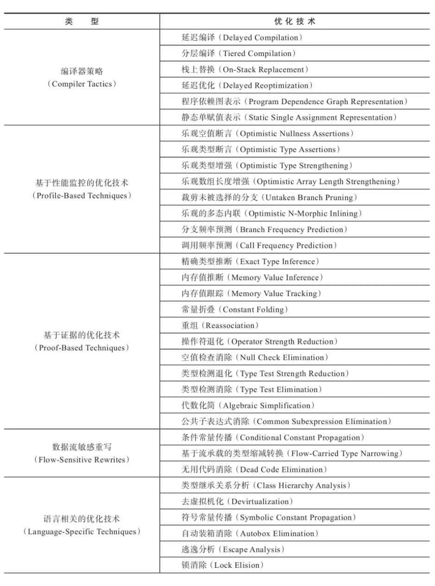

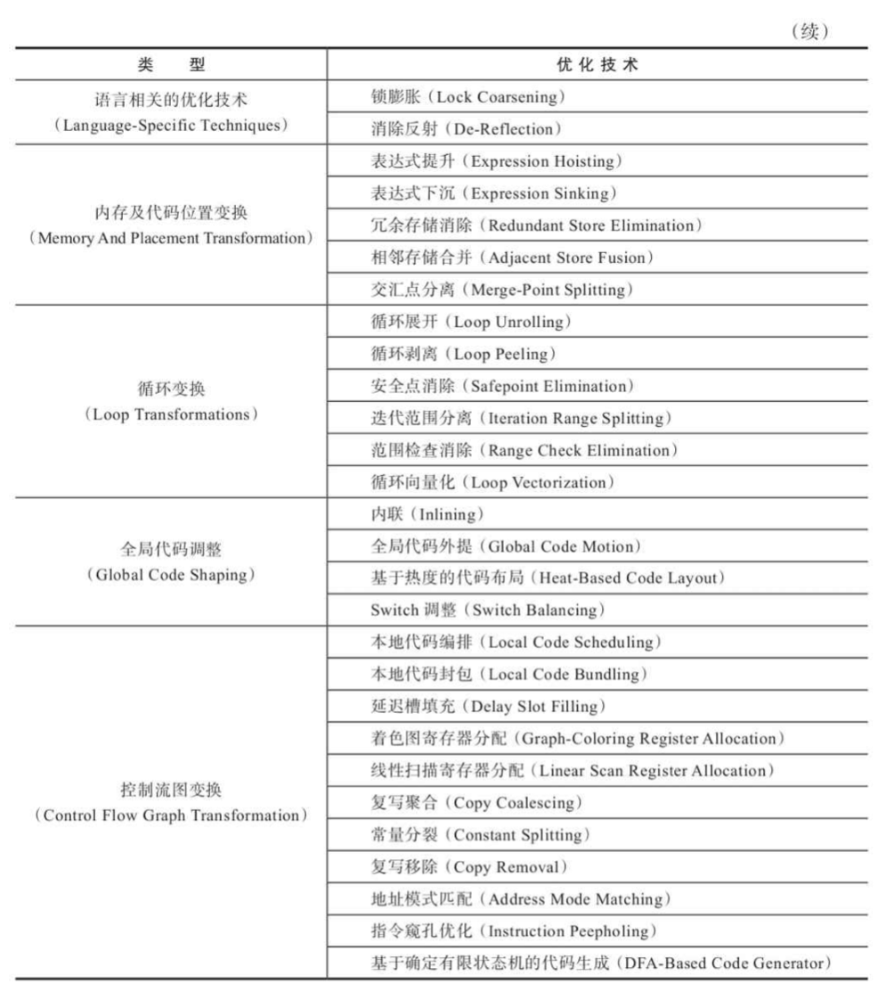

- 方法内联

**方法内联** 的优化行为是把目标方法的代码原封不动地“复制”到发起调用的方法之中，避免发生真实的方法调用而已。但实际上 `Java` 虚拟机中的内联过程却远没有想象中容易，甚至如果不是即时编译器做了一些特殊的努力，按照经典编译原理的优化理论，大多数的 `Java` 方法都无法进行内联。

为了解决虚方法的内联问题，`Java` 虚拟机首先引入了一种名为 **类型继承关系分析**（`Class Hierarchy Analysis`，`CHA`）的技术，这是整个应用程序范围内的类型分析技术，用于确定在目前已加载的类中，某个接口是否有多于一种的实现、某个类是否存在子类、某个子类是否覆盖了父类的某个虚方法 等信息。这样，编译器在进行内联时就会分不同情况采取不同的处理：如果是非虚方法，那么直接进行内联即可，这种的内联是有百分百安全保障的；如果遇到虚方法，则会向 `CHA` 查询此方法在当前程序状态下是否真的有多个目标版本可供选择，如果查询到只有一个版本，那就可以假设“应用程序的全貌就是现在运行的这个样子”来进行内联，这种内联被称为 **守护内联**（`Guarded Inlining`）。

假如向 `CHA` 查询出来的结果是该方法确实有多个版本的目标方法可供选择，那即时编译器还将进行最后一次努力，使用 **内联缓存**（`Inline Cache`）的方式来缩减方法调用的开销。

> **内联缓存** 是一个建立在目标方法正常入口之前的缓存，它的工作原理大致为：在未发生方法调用之前，内联缓存状态为空，当第一次调用发生后，缓存记录下方法接收者的版本信息，并且每次进行方法调用时都比较接收者的版本。如果以后进来的每次调用的方法接收者版本都是一样的，那么这时它就是一种 **单态内联缓存**（`Monomorphic Inline Cache`）。但如果真的出现方法接收者不一致的情况，就说明程序用到了虚方法的多态特性，这时候会退化成 **超多态内联缓存**（`Megamorphic Inline Cache`），其开销相当于真正查找虚方法表来进行方法分派。

- 逃逸分析

**逃逸分析**（`Escape Analysis`）是目前 `Java` 虚拟机中比较前沿的优化技术，不是直接优化代码的手段，而是为其他优化措施提供依据的分析技术。

逃逸分析的  **基本原理** 是：分析对象动态作用域，当一个对象在方法里面被定义后，它可能被外部方法所引用，例如作为调用参数传递到其他方法中，这种称为 **方法逃逸**；甚至还有可能被外部线程访问到，譬如赋值给可以在其他线程中访问的实例变量，这种称为 **线程逃逸**；从不逃逸、方法逃逸到线程逃逸，称为 **对象由低到高的不同逃逸程度**。

> **栈上分配**（`Stack Allocations`）：在 `Java` 虚拟机中，`Java` 堆上分配创建对象的内存空间，`Java` 堆中的对象对于各个线程都是共享和可见的，只要持有这个对象的引用，就可以访问到堆中存储的对象数据。如果确定一个对象不会逃逸出线程之外，那让这个对象在栈上分配内存将会是一个很不错的主意，对象所占用的内存空间就可以随栈帧出栈而销毁。在一般应用中，完全不会逃逸的局部对象和不会逃逸出线程的对象所占的比例是很大的，如果能使用栈上分配，那大量的对象就会随着方法的结束而自动销毁了，垃圾收集子系统的压力将会下降很多。**栈上分配可以支持方法逃逸，但不能支持线程逃逸**；
>
> **标量替换**（`Scalar Replacement`）：若一个数据已经无法再分解成更小的数据来表示了，`Java` 虚拟机中的原始数据类型（`int`、`long` 等数值类型及 `reference` 类型等）都不能再进一步分解，这些数据称为 **标量**；如果一个数据可以继续分解，那它就被称为 **聚合量**（`Aggregate`），`Java` 中的对象就是典型的聚合量。如果把一个 `Java` 对象拆散，根据程序访问的情况，将其用到的成员变量恢复为原始类型来访问，这个过程就称为 **标量替换**。假如逃逸分析能够证明一个对象不会被方法外部访问，并且这个对象可以被拆散，那么程序真正执行的时候将可能不去创建这个对象，而改为直接创 建它的若干个被这个方法使用的成员变量来代替。将对象拆分后，除了可以让对象的成员变量在栈上 （栈上存储的数据，很大机会被虚拟机分配至物理机器的高速寄存器中存储）分配和读写之外，还可 以为后续进一步的优化手段创建条件。标量替换可以视作栈上分配的一种特例，实现更简单（不用考虑整个对象完整结构的分配），但对逃逸程度的要求更高，它不允许对象逃逸出方法范围内；
>
> **同步消除**（`Synchronization Elimination`）：线程同步本身是一个相对耗时的过程，如果逃逸分析能够确定一个变量不会逃逸出线程，无法被其他线程访问，那么这个变量的读写肯定就不会有竞争， 对这个变量实施的同步措施也就可以安全地消除掉。

```java
package com.jvm;

/**
 * 逃逸分析测试用例
 *
 * @author zhangbocheng
 * @version v1.0
 * @date 2020/9/1 16:13
 */
public class EscapeAnalysis {

    /**
     * 完全未优化
     */
    public int test(int x) {
        int xx = x + 2;
        Point p = new Point(xx, 42);
        return  p.getX();
    }

    /**
     * 优化1：将Point的构造函数和getX()方法进行内联优化
     */
    public int test1(int x) {
        int xx = x + 2;
        // 在堆中分配P对象的示意方法
         Point p = point_memory_alloc();
         p.x = xx;
         p.y = 42;
         return  p.x;
    }

    /**
     * 优化2：经过逃逸分析，发现在整个test()方法的范围内Point对象实例不会发生任何程度的逃逸，
     *       这样可以对它进行标量替换优化，把其内部的x和y直接置换出来，分解为test()方法内的局部变量，
     *       从而避免Point对象实例被实际创建
     */
    public int test2(int x) {
        int xx = x + 2;
         int px = xx;
         int py = 42;
         return  px;
    }

    /**
     * 优化3：通过数据流分析，发现py的值其实对方法不会造成任何影响，
     *       那就可以放心地去做无效 代码消除得到最终优化结果
     */
    public int test3(int x) {
        return  x + 2;
    }
}


class Point {
    private int x;
    private int y;

    public Point(int x, int y) {
        this.x = x;
        this.y = y;
    }

    public int getX() {
        return x;
    }

    public void setX(int x) {
        this.x = x;
    }

    public int getY() {
        return y;
    }

    public void setY(int y) {
        this.y = y;
    }
}
```

- 公共子表达式消除

如果一 个表达式 `E` 之前已经被计算过，并且从先前的计算到现在 `E` 中所有变量的值都没有发生变化，那么 `E` 的这次出现就称为 **公共子表达式**。对于这种表达式，没有必要花时间再对它重新进行计算，只需要直接用前面计算过的表达式结果代替 `E`。如果这种优化仅限于程序基本块内，便可称为 **局部公共子表达式消除**（`Local Common Subexpression Elimination`），如果这种优化的范围涵盖了多个基本块，那就称为 **全局公共子表达式消除**（`Global Common Subexpression Elimination`）。

- 数组边界检查消除

**数组边界检查消除**（`Array Bounds Checking Elimination`）是即时编译器中的一项语言相关的经典优化技术。

#### 4，实战：深入理解 `Graal` 编译器

## 十二，Java内存模型与线程

#### 1，硬件的效率与一致性

基于高速缓存的存储交互很好地解决了处理器与内存速度之间的矛盾，但是也为计算机系统带来更高的复杂度，它引入了一个新的问题：**缓存一致性**（`Cache Coherence`）。在多路处理器系统中，每 个处理器都有自己的高速缓存，而它们又共享同一主内存（`Main Memory`），这种系统称为 **共享内存多核系统**（`Shared Memory Multiprocessors System`）。

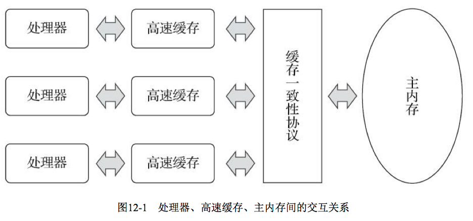

#### 2，`Java` 内存模型

`Java` 内存模型的 **主要目的** 是定义程序中各种变量（实例字段、静态字段和构成数组对象的元素）的访问规则，即关注在虚拟机中把变量值存储到内存和从内存中取出变量值这样的底层细节。

`Java` 内存模型规定了所有的变量都存储在主内存（`Main Memory`）中，每条线程还有自己的工作内存（`Working Memory`），线程的工作内存中保存了被该线程使用的变量的主内存副本，线程对变量的所有操作（读取、赋值等）都必须在工作内存中进行，而不能直接读写主内存中的数据。不同的线程之间也无法直接访问对方工作内存中的变量，线程间变量值的传递均需要通过主内存来完成。

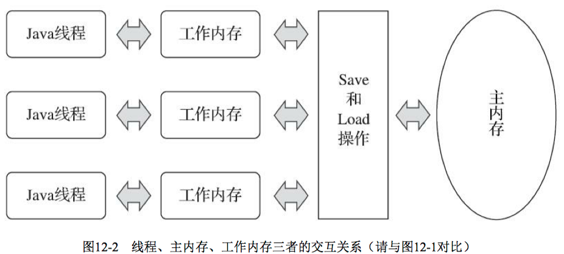

关于主内存与工作内存之间具体的交互协议，即一个变量如何从主内存拷贝到工作内存、如何从 工作内存同步回主内存这一类的实现细节，`Java` 内存模型中定义了以下8种操作来完成，`Java` 虚拟机实现时必须保证下面提及的每一种操作都是原子的、不可再分的。

> `lock`（锁定）：作用于主内存的变量，它把一个变量标识为一条线程独占的状态；
>
> `unlock`（解锁）：作用于主内存的变量，它把一个处于锁定状态的变量释放出来，释放后的变量才可以被其他线程锁定；
>
> `read`（读取）：作用于主内存的变量，它把一个变量的值从主内存传输到线程的工作内存中，以便随后的 `load` 动作使用；
>
> `load`（载入）：作用于工作内存的变量，它把 `read` 操作从主内存中得到的变量值放入工作内存的变量副本中；
>
> `use`（使用）：作用于工作内存的变量，它把工作内存中一个变量的值传递给执行引擎，每当虚 拟机遇到一个需要使用变量的值的字节码指令时将会执行这个操作；
>
> `assign`（赋值）：作用于工作内存的变量，它把一个从执行引擎接收的值赋给工作内存的变量，每当虚拟机遇到一个给变量赋值的字节码指令时执行这个操作；
>
> `store`（存储）：作用于工作内存的变量，它把工作内存中一个变量的值传送到主内存中，以便随后的 `write` 操作使用；
>
> `write`（写入）：作用于主内存的变量，它把 `store` 操作从工作内存中得到的变量的值放入主内存的变量中。

如果要把一个变量从主内存拷贝到工作内存，那就要按顺序执行 `read` 和 `load` 操作，如果要把变量从工作内存同步回主内存，就要按顺序执行 `store` 和 `write` 操作。

`Java` 内存模型还规定了在执行上述8种基本操作时必须满足如下规则：

> 不允许  `read` 和 `load`、`store` 和 `write` 操作之一单独出现，即不允许一个变量从主内存读取了但工作内存不接受，或者工作内存发起回写了但主内存不接受的情况出现；
>
> 不允许一个线程丢弃它最近的 `assign` 操作，即变量在工作内存中改变了之后必须把该变化同步回主内存；
>
> 不允许一个线程无原因地（没有发生过任何 `assign` 操作）把数据从线程的工作内存同步回主内存中； 
>
> 一个新的变量只能在主内存中“诞生”，不允许在工作内存中直接使用一个未被初始化（`load` 或 `assign`）的变量，换句话说就是对一个变量实施 `use`、`store` 操作之前，必须先执行 `assign` 和 `load` 操作；
>
> 一个变量在同一个时刻只允许一条线程对其进行 `lock` 操作，但 `lock` 操作可以被同一条线程重复执行多次，多次执行 `lock` 后，只有执行相同次数的 `unlock` 操作，变量才会被解锁；
>
> 如果对一个变量执行 `lock` 操作，那将会清空工作内存中此变量的值，在执行引擎使用这个变量前，需要重新执行 `load` 或 `assign` 操作以初始化变量的值；
>
> 如果一个变量事先没有被 `lock` 操作锁定，那就不允许对它执行 `unlock` 操作，也不允许去 `unlock` 一个被其他线程锁定的变量；
>
> 对一个变量执行 `unlock` 操作之前，必须先把此变量同步回主内存中（执行 `store`、`write` 操作）。

对于关键字 `volatile` 可以说是 `Java` 虚拟机提供的最轻量级的同步机制，但是它并不容易被正确、完整地理解。

当一个变量被定义成 `volatile` 之后，它将具备两项特性：

> 1）保证此变量对所有线程的可见性，这里的“**可见性**”是指当一条线程修改了这个变量的值，新值对于其他线程来说是可以立即得知的。而普通变量并不能做到这一点，普通变量的值在线程间传递时均需要通过 **主内存** 来完成。
>
> > 关于 `volatile` 变量的可见性误解：“`volatile` 变量对所有线程是立即可见的，对 `volatile` 变量所有的写操作都能立刻反映到其他线程之中。换句话说，`volatile` 变量在各个线程中是一致的，所以基于volatile变量的运算在并发下是线程安全的”。原因解释：`volatile` 变量在各个线程的工作内存中是不存在一致性问题的，但是 `Java` 里面的运算操作符并非原子操作， 这导致 `volatile` 变量的运算在并发下一样是不安全的。
>
> 2）**禁止指令重排序优化**，普通的变量仅会保证在该方法的执行过程中所有依赖赋值结果的地方都能获取到正确的结果，而不能保证变量赋值操作的顺序与程序代码中的执行顺序一致。因为在同一个线程的方法执行过程中无法感知到这点，这就是 `Java` 内存模型中描述的所谓“**线程内表现为串行的语义**”（`Within-Thread As-If-Serial Semantics`）。
>
> 指令重排参考资料：
>
> > [指令重排序](https://www.jianshu.com/p/c6f190018db1)
> >
> > [Java中的指令重排](https://www.jianshu.com/p/7a6118b2d794)

代码清单12-1  `volatile` 变量自增运算

```java
package com.jvm;

/**
 * volatile变量自增运算
 *
 * @author zhangbocheng
 * @version v1.0
 * @date 2020/9/1 23:12
 */
public class VolatileTest {

    private static volatile int race = 0;
    private static final int THREADS_COUNT = 20;
    private static final int COUNT = 10000;

    private static void increase() {
        race++;
    }

    public static void main(String[] args) {
        Thread[] threads = new Thread[THREADS_COUNT];
        for (int i = 0; i < THREADS_COUNT; i++) {
            threads[i] = new Thread(new Runnable() {
                @Override
                public void run() {
                    for (int j = 0; j < COUNT; j++) {
                        increase();
                    }
                }
            });
            threads[i].start();
        }

        while (Thread.activeCount() > 1) {
            Thread.yield();
        }

        // 输出：小于200000的随机数
        System.out.println(race);
    }
}
```

字节码如下：

```bash
☁  java [interview] ⚡  /Library/Java/JavaVirtualMachines/jdk1.8.0_131.jdk/Contents/Home/bin/javap -verbose com.jvm.VolatileTest
Classfile /home/projects/java_pro/java_projects/interview/src/main/java/com/jvm/VolatileTest.class
  Last modified 2020-9-2; size 1028 bytes
  MD5 checksum 789665233c2006a44d406d21dda35381
  Compiled from "VolatileTest.java"
public class com.jvm.VolatileTest
  minor version: 0
  major version: 52
  flags: ACC_PUBLIC, ACC_SUPER
Constant pool:
   #1 = Methodref          #4.#36         // com/jvm/VolatileTest.increase:()V
   #2 = Methodref          #14.#37        // java/lang/Object."<init>":()V
   #3 = Fieldref           #4.#38         // com/jvm/VolatileTest.race:I
   #4 = Class              #39            // com/jvm/VolatileTest
   #5 = Class              #40            // java/lang/Thread
   #6 = Class              #41            // com/jvm/VolatileTest$1
   #7 = Methodref          #6.#37         // com/jvm/VolatileTest$1."<init>":()V
   #8 = Methodref          #5.#42         // java/lang/Thread."<init>":(Ljava/lang/Runnable;)V
   #9 = Methodref          #5.#43         // java/lang/Thread.start:()V
  #10 = Methodref          #5.#44         // java/lang/Thread.activeCount:()I
  #11 = Methodref          #5.#45         // java/lang/Thread.yield:()V
  #12 = Fieldref           #46.#47        // java/lang/System.out:Ljava/io/PrintStream;
  #13 = Methodref          #48.#49        // java/io/PrintStream.println:(I)V
  #14 = Class              #50            // java/lang/Object
  #15 = Utf8               InnerClasses
  #16 = Utf8               race
  #17 = Utf8               I
  #18 = Utf8               THREADS_COUNT
  #19 = Utf8               ConstantValue
  #20 = Integer            20
  #21 = Utf8               COUNT
  #22 = Integer            10000
  #23 = Utf8               <init>
  #24 = Utf8               ()V
  #25 = Utf8               Code
  #26 = Utf8               LineNumberTable
  #27 = Utf8               increase
  #28 = Utf8               main
  #29 = Utf8               ([Ljava/lang/String;)V
  #30 = Utf8               StackMapTable
  #31 = Class              #51            // "[Ljava/lang/Thread;"
  #32 = Utf8               access$000
  #33 = Utf8               <clinit>
  #34 = Utf8               SourceFile
  #35 = Utf8               VolatileTest.java
  #36 = NameAndType        #27:#24        // increase:()V
  #37 = NameAndType        #23:#24        // "<init>":()V
  #38 = NameAndType        #16:#17        // race:I
  #39 = Utf8               com/jvm/VolatileTest
  #40 = Utf8               java/lang/Thread
  #41 = Utf8               com/jvm/VolatileTest$1
  #42 = NameAndType        #23:#52        // "<init>":(Ljava/lang/Runnable;)V
  #43 = NameAndType        #53:#24        // start:()V
  #44 = NameAndType        #54:#55        // activeCount:()I
  #45 = NameAndType        #56:#24        // yield:()V
  #46 = Class              #57            // java/lang/System
  #47 = NameAndType        #58:#59        // out:Ljava/io/PrintStream;
  #48 = Class              #60            // java/io/PrintStream
  #49 = NameAndType        #61:#62        // println:(I)V
  #50 = Utf8               java/lang/Object
  #51 = Utf8               [Ljava/lang/Thread;
  #52 = Utf8               (Ljava/lang/Runnable;)V
  #53 = Utf8               start
  #54 = Utf8               activeCount
  #55 = Utf8               ()I
  #56 = Utf8               yield
  #57 = Utf8               java/lang/System
  #58 = Utf8               out
  #59 = Utf8               Ljava/io/PrintStream;
  #60 = Utf8               java/io/PrintStream
  #61 = Utf8               println
  #62 = Utf8               (I)V
{
  public com.jvm.VolatileTest();
    descriptor: ()V
    flags: ACC_PUBLIC
    Code:
      stack=1, locals=1, args_size=1
         0: aload_0
         1: invokespecial #2                  // Method java/lang/Object."<init>":()V
         4: return
      LineNumberTable:
        line 10: 0

  public static void main(java.lang.String[]);
    descriptor: ([Ljava/lang/String;)V
    flags: ACC_PUBLIC, ACC_STATIC
    Code:
      stack=6, locals=3, args_size=1
         0: bipush        20
         2: anewarray     #5                  // class java/lang/Thread
         5: astore_1
         6: iconst_0
         7: istore_2
         8: iload_2
         9: bipush        20
        11: if_icmpge     43
        14: aload_1
        15: iload_2
        16: new           #5                  // class java/lang/Thread
        19: dup
        20: new           #6                  // class com/jvm/VolatileTest$1
        23: dup
        24: invokespecial #7                  // Method com/jvm/VolatileTest$1."<init>":()V
        27: invokespecial #8                  // Method java/lang/Thread."<init>":(Ljava/lang/Runnable;)V
        30: aastore
        31: aload_1
        32: iload_2
        33: aaload
        34: invokevirtual #9                  // Method java/lang/Thread.start:()V
        37: iinc          2, 1
        40: goto          8
        43: invokestatic  #10                 // Method java/lang/Thread.activeCount:()I
        46: iconst_1
        47: if_icmple     56
        50: invokestatic  #11                 // Method java/lang/Thread.yield:()V
        53: goto          43
        56: getstatic     #12                 // Field java/lang/System.out:Ljava/io/PrintStream;
        59: getstatic     #3                  // Field race:I
        62: invokevirtual #13                 // Method java/io/PrintStream.println:(I)V
        65: return
      LineNumberTable:
        line 21: 0
        line 22: 6
        line 23: 14
        line 31: 31
        line 22: 37
        line 34: 43
        line 35: 50
        line 39: 56
        line 40: 65
      StackMapTable: number_of_entries = 3
        frame_type = 253 /* append */
          offset_delta = 8
          locals = [ class "[Ljava/lang/Thread;", int ]
        frame_type = 250 /* chop */
          offset_delta = 34
        frame_type = 12 /* same */

  static void access$000();
    descriptor: ()V
    flags: ACC_STATIC, ACC_SYNTHETIC
    Code:
      stack=0, locals=0, args_size=0
         0: invokestatic  #1                  // Method increase:()V
         3: return
      LineNumberTable:
        line 10: 0

  static {};
    descriptor: ()V
    flags: ACC_STATIC
    Code:
      stack=1, locals=0, args_size=0
         0: iconst_0
         1: putstatic     #3                  // Field race:I
         4: return
      LineNumberTable:
        line 12: 0
}
SourceFile: "VolatileTest.java"
InnerClasses:
     static #6; //class com/jvm/VolatileTest$1
```

原因分析：当 `getstatic` 指令把 `race` 的值取到操作栈顶时，`volatile` 关键字保证了 `race` 的值在此时是正确的，但是在执行 `iconst_1、iadd` 这些指令的时候，其他线程可能已经把 `race` 的值改变了，而操作栈顶的值就变成了过期的数据，所以 `putstatic` 指令执行后就可能把较小的 `race` 值同步回主内存之中。

由于 `volatile` 变量只能保证可见性，在不符合以下两条规则的运算场景中，仍然要通过加锁 （使用 `synchronized`、`java.util.concurrent` 中的锁或原子类）来保证原子性：

> 运算结果并不依赖变量的当前值，或者能够确保只有单一的线程修改变量的值；
>
> 变量不需要与其他的状态变量共同参与不变约束。

代码清单12-2  `DCL` 单例模式

```java
package com.jvm;

/**
 * DCL单例模式
 *
 * @author zhangbocheng
 * @version v1.0
 * @date 2020/9/2 11:02
 */
public class Singleton {

    private volatile static Singleton instance;

    private Singleton() {
        System.out.println(Thread.currentThread().getName() + " ===== Singleton.Singleton =======");
    }

    public static Singleton getInstance() {
        if (instance == null) {
            synchronized (Singleton.class) {
                if (instance == null) {
                    instance = new Singleton();
                }
            }
        }

        return instance;
    }

    public static void main(String[] args) {
        int count = 10;
        for (int i = 0; i <= count; i++) {
            new Thread(() -> {
                Singleton.getInstance();
            }, String.valueOf(i)).start();
        }
    }
}
```

运行结果：

```bash
0 ===== Singleton.Singleton =======
```

假定 $T$ 表示 一个线程，$V$ 和 $W$ 分别表示两个 `volatile` 型变量，那么在进行  `read`、`load`、`use`、`assign`、 `store` 和 `write` 操作时需要满足如下规则：

> 只有当线程 $T$ 对变量 $V$ 执行的前一个动作是 `load` 的时候，线程 $T$ 才能对变量 $V$ 执行 `use` 动作；并且，只有当线程 $T$ 对变量 $V$ 执行的后一个动作是 `use` 的时候，线程 $T$ 才能对变量 $V$ 执行 `load` 动作；线程 $T$ 对变量 $V$ 的 `use` 动作可以认为是和线程 $T$ 对变量 $V$ 的 `load`、`read` 动作相关联的，必须连续且一起出现；
>
> > 这条规则要求在工作内存中，每次使用 $V$ 前都必须先从主内存刷新最新的值，用于保证能看见其他线程对变量 $V$ 所做的修改。	
>
> 只有当线程 $T$ 对变量 $V$ 执行的前一个动作是 `assign` 的时候，线程 $T$ 才能对变量 $V$ 执行 `store` 动作；并 且，只有当线程 $T$ 对变量 $V$ 执行的后一个动作是 `store` 的时候，线程 $T$ 才能对变量 $V$ 执行 `assign` 动作；线程 $T$ 对变量 $V$ 的 `assign` 动作可以认为是和线程 $T$ 对变量 $V$ 的 `store`、`write` 动作相关联的，必须连续且一起出现；
>
> > 这条规则要求在工作内存中，每次修改 $V$ 后都必须立刻同步回主内存中，用于保证其他线程可以看到自己对变量 $V$ 所做的修改。
>
> 假定动作 $A$ 是线程 $T$ 对变量 $V$ 实施的 `use` 或 `assign` 动作，假定动作 $F$ 是和动作 $A$ 相关联的 `load` 或 `store` 动作，假定动作 $P$ 是和动作 $F$ 相应的对变量 $V$ 的 `read` 或 `write` 动作；与此类似，假定动作 $B$ 是线程 $T$ 对变量 $W$ 实施的 `use` 或 `assign` 动作，假定动作 $G$ 是和动作 $B$ 相关联的 `load ` 或 `store` 动作，假定动作 $Q$ 是和动作 $G$ 相应的对变量 $W$ 的 `read` 或 `write` 动作。如果 $A$ 先于 $B$，那么 $P$ 先于 $Q$。
>
> > 这条规则要求 `volatile` 修饰的变量不会被指令重排序优化，从而保证代码的执行顺序与程序的顺序相同。

`Java` 内存模型要求 `lock、unlock、read、load、assign、use、store、write` 这八种操作都具有原子性，但是对于64位的数据类型（`long` 和 `double`），在模型中特别定义了一条宽松的 **规定**：允许虚拟机将没有被 `volatile` 修饰的64位数据的读写操作划分为两次32位的操作来进行，即允许虚拟机实现自行选择是否要保证64位数据类型的 `load、store、read` 和 `write` 这四个操作的原子性，这就是所谓的“**`long` 和 `double` 的非原子性协定**”（`Non-Atomic Treatment of double and long Variables`）。

如果有多个线程共享一个并未声明为 `volatile` 的 `long` 或 `double` 类型的变量，并且同时对它们进行读取和修改操作，那么某些线程可能会读取到一个既不是原值，也不是其他线程修改值的代表了“半个变量”的数值。不过这种读取到“半个变量”的情况是非常罕见的，在目前主流平台下商用的64位 `Java` 虚拟机中并不会出现非原子性访问行为，但是对于32位的 `Java` 虚拟机，譬如比较常用的32 位 `x86` 平台下的 `HotSpot` 虚拟机，对 `long` 类型的数据确实存在非原子性访问的风险。从 `JDK 9` 起， `HotSpot` 增加了一个实验性的参数 `-XX：+AlwaysAtomicAccesses 来约束虚拟机对所有数据类型进行原子性的访问。而针对 `double` 类型，由于现代中央处理器中一般都包含专门用于处理浮点数据的浮点运算器（`Floating Point Unit`，`FPU`），用来专门处理单、双精度的浮点数据，所以哪怕是32位虚拟机中通常也不会出现非原子性访问的问题。

- 原子性、可见性与有序性

> **原子性**（`Atomicity`）
>
> > 由 `Java` 内存模型来直接保证的原子性变量操作包括 `read、load、assign、use、store` 和 `write` ，基本数据类型的访问、读写都是具备原子性的（例外是 `long` 和 `double` 的非原子性协定）；
> >
> > 如果应用场景需要一个更大范围的原子性保证，`Java` 内存模型还提供了 `lock` 和 `unlock` 操作，尽管虚拟机未把 `lock` 和 `unlock` 操作直接开放给用户使用，但是却提供了更高层次的字节码指令 `monitorenter` 和 `monitorexit` 来隐式地使用这两个操作，这两个字节码指令反映到 `Java` 代码中就是同步块—— `synchronized` 关键字，因此在 `synchronized` 块之间的操作也具备原子性。
>
> **可见性**（`Visibility`）：指当一个线程修改了共享变量的值时，其他线程能够立即得知这个修改。
>
> > 普通变量与 `volatile` 变量的 **区别** 是，`volatile` 的特殊规则保证了新值能立即同步到主内存，以及每次使用前立即从主内存刷新。
> >
> > `synchronized` 同步块的可见性是由“对一个变量执行 `unlock` 操作之前，必须先把此变量同步回主内存中（执行 `store`、`write` 操作）”这条规则获得的；`final` 关键字的可见性是指：被 `final` 修饰的字段在构造器中一旦被初始化完成，并且构造器没有把“`this`”的引用传递出去，那么在其他线程中就能看见 `final` 字段的值。
>
> **有序性**（`Ordering`） 
>
> > `Java` 程序中天然的有序性指：如果在本线程内观察，所有的操作都是有序的（**线程内似表现为串行的语义**）；如果在一个线程中观察另一个线程， 所有的操作都是无序的（**指令重排序** & **工作内存与主内存同步延迟**）。
> >
> > `Java` 语言提供了 `volatile` 和 `synchronized` 两个关键字来保证线程之间操作的有序性，`volatile` 包含了禁止指令重排序的语义，而 `synchronized` 则是由“一个变量在同一个时刻只允许一条线程对其进行 `lock` 操作”这条规则获得的，这个规则决定了持有同一个锁的两个同步块只能串行地进入。

- 先行发生原则

`Java` 语言中有一 个“**先行发生**”（`Happens-Before`）的原则：判断数据是否存在竞争，线程是否安全。

**先行发生** 是 `Java` 内存模型中定义的两项操作之间的偏序关系，比如说操作 $A$ 先行发生于操作 $B$，其实就是说在发生操作 $B$ 之前，操作 $A$ 产生的影响能被操作 $B$ 观察到，“影响”包括修改了内存中共享变量的值、发送了消息、调用了方法等。

> **程序次序规则**（`Program Order Rule`）：在一个线程内，按照控制流顺序，书写在前面的操作先行发生于书写在后面的操作。注意，这里说的是控制流顺序而不是程序代码顺序，因为要考虑分支、循 环等结构。
>
> **管程锁定规则**（`Monitor Lock Rule`）：一个 `unlock` 操作先行发生于后面对同一个锁的 `lock` 操作。这里必须强调的是“同一个锁”，而“后面”是指时间上的先后。
>
> **`volatile` 变量规则**（`Volatile Variable Rule`）：对一个 `volatile` 变量的写操作先行发生于后面对这个变量的读操作，这里的“后面”同样是指时间上的先后。 
>
> **线程启动规则**（`Thread Start Rule`）：`Thread` 对象的 `start()` 方法先行发生于此线程的每一个动作。 
>
> **线程终止规则**（`Thread Termination Rule`）：线程中的所有操作都先行发生于对此线程的终止检测，可以通过 `Thread::join()` 方法是否结束、`Thread::isAlive()` 的返回值等手段检测线程是否已经终止执行。
>
> **线程中断规则**（`Thread Interruption Rule`）：对线程 `interrupt()` 方法的调用先行发生于被中断线程的代码检测到中断事件的发生，可以通过 `Thread::interrupted()` 方法检测到是否有中断发生。
>
> **对象终结规则**（`Finalizer Rule`）：一个对象的初始化完成（构造函数执行结束）先行发生于它的 `finalize()` 方法的开始。
>
> **传递性**（`Transitivity`）：如果操作 $A$ 先行发生于操作 $B$，操作 $B$ 先行发生于操作 $C$，那就可以得出操作 $A$ 先行发生于操作 $C$ 的结论。

#### 3，线程

1）线程的实现

 **线程** 是比进程更轻量级的调度执行单位，线程的引入，可以把一个进程的资源分配和执行调度分开，各个线程既可以共享进程资源（内存地址、文件 `I/O` 等），又可以独立调度。目前线程是 `Java` 里面进行处理器资源调度的 **最基本单位**，不过如果日后 `Loom` 项目能成功为 `Java` 引入 **纤程** （`Fiber`）的话，可能就会改变这一点。

实现线程主要有三种方式：

> 使用 **内核线程** 实现（$1：1$ 实现）
>
> > **内核线程**（`Kernel-Level Thread`，`KLT`）就是直接由操作系统内核（`Kernel`，下称内核）支持的线程，这种线程由内核来完成线程切换，内核通过操纵调度器（`Scheduler`）对线程进行调度，并负责将线程的任务映射到各个处理器上。每个内核线程可以视为内核的一个分身，这样操作系统就有能力同时处理多件事情，支持多线程的内核就称为 **多线程内核**（`Multi-Threads Kernel`）。
> >
> > 程序一般不会直接使用内核线程，而是使用内核线程的一种高级接口——**轻量级进程**（`Light Weight Process`，`LWP`），轻量级进程就是我们通常意义上所讲的线程，由于每个轻量级进程都由一个内核线程支持，因此只有先支持内核线程，才能有轻量级进程。这种轻量级进程与内核线程之间 $1：1$ 的关系称为 **一对一的线程模型**。
> >
> > 轻量级进程的局限性：
> >
> > > 1）由于是基于内核线程实现的，所以各种线程操作，如创建、析构及同步，都需要进行系统调用，而系统调用的代价相对较高，需要在用户态（`User Mode`）和内核态（`Kernel Mode`）中来回切换；
> > >
> > > 2）每个轻量级进程都需要有一个内核线程的支持，因此轻量级进程要消耗一定的内核资源（如内核线程的栈空间），因此一个系统支持轻量级进程的数量是有限的。
>
> 使用 **用户线程** 实现（$1：N$ 实现）
>
> > 广义上来讲，一个线程只要不是内核线程，都可以认为是 **用户线程**（`User Thread`，`UT`）的一种，因此从这个定义上看，轻量级进程也属于用户线程，但轻量级进程的实现始终是建立在内核之上的，许多操作都要进行系统调用，因此效率会受到限制，并不具备通常意义上的用户线程的优点。
> >
> > 狭义上的 **用户线程** 指的是完全建立在用户空间的线程库上，系统内核不能感知到用户线程的存在及如何实现的。用户线程的建立、同步、销毁和调度完全在用户态中完成，不需要内核的帮助。如果程序实现得当，这种线程不需要切换到内核态，因此操作可以是非常快速且低消耗的，也能够支持规模更大的线程数量，部分高性能数据库中的多线程就是由用户线程实现的。这种进程与用户线程之间 $1：N$ 的关系称为 **一对多的线程模型**。
> >
> > 用户线程的 **优势** 在于不需要系统内核支援，**劣势** 也在于没有系统内核的支援，所有的线程操作都需要由用户程序自己去处理。线程的创建、销毁、切换和调度都是用户必须考虑的问题，而且由于操作系统只把处理器资源分配到进程，那诸如“阻塞如何处理”“多处理器系统中如何将线程映射到其他处理器上”这类问题解决起来将会异常困难，甚至有些是不可能实现的。因为使用用户线程实现的程序通常都比较复杂 。
> >
>
> 使用 **用户线程加轻量级进程混合** 实现（$N：M$ 实现）
>
> > 线程除了依赖内核线程实现和完全由用户程序自己实现之外，还有一种将内核线程与用户线程一起使用的实现方式，被称为 $N：M$ 实现。在这种混合实现下，既存在用户线程，也存在轻量级进程。 用户线程还是完全建立在用户空间中，因此用户线程的创建、切换、析构等操作依然廉价，并且可以支持大规模的用户线程并发。而操作系统支持的轻量级进程则作为用户线程和内核线程之间的桥梁， 这样可以使用内核提供的线程调度功能及处理器映射，并且用户线程的系统调用要通过轻量级进程来完成，这大大降低了整个进程被完全阻塞的风险。在这种混合模式中，用户线程与轻量级进程的数量比是不定的，是 $N：M$ 的关系，这种就是 **多对多的线程模型**。

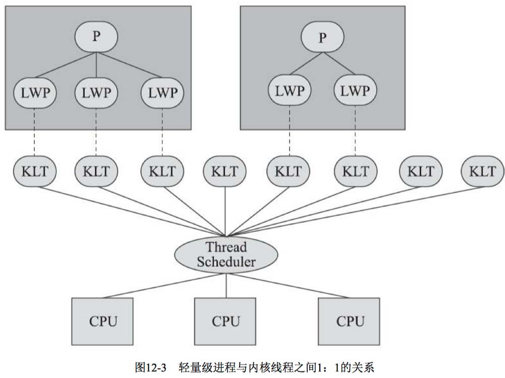

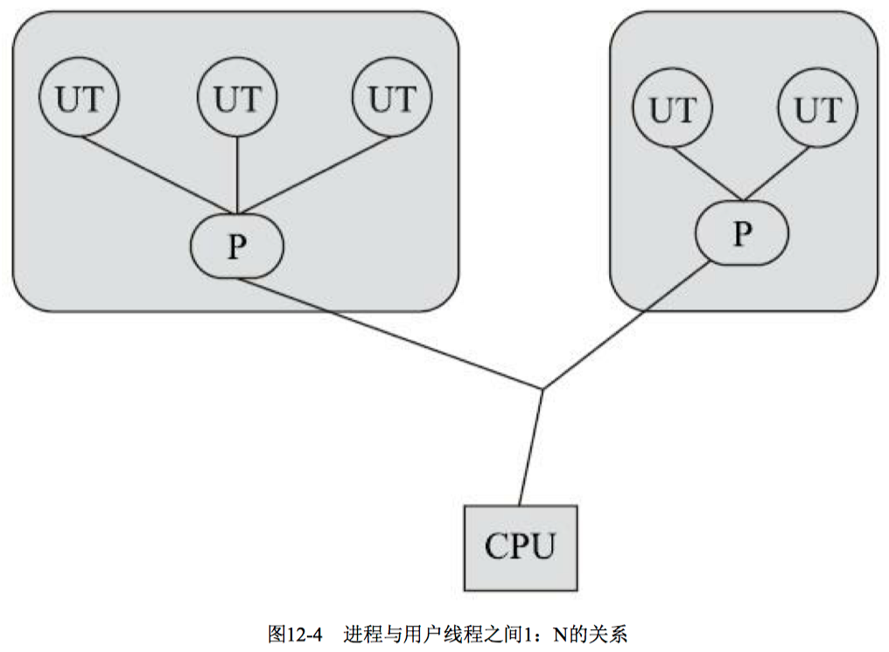

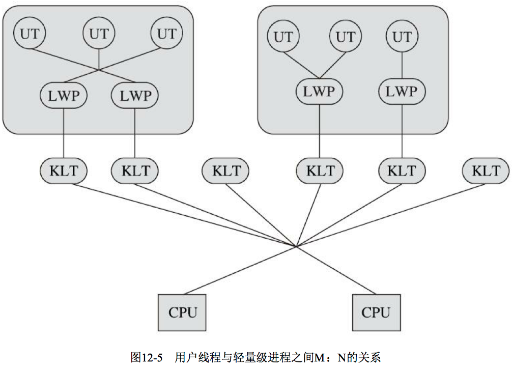

`Java` 线程如何实现并不受 `Java` 虚拟机规范的约束，这是一个与具体虚拟机相关的话题。`Java` 线程在早期的 `Classic` 虚拟机上（`JDK 1.2` 以前），是基于一种被称为“**绿色线程**”（`Green Threads`）的用户线程实现的，但从 `JDK 1.3` 起，“主流”平台上的“主流”商用 `Java` 虚拟机的线程模型普遍都被替换为基于操作系统 **原生线程模型** 来实现，即采用 $1：1$ 的线程模型。

以 `HotSpot` 为例，它的每一个 `Java` 线程都是直接映射到一个操作系统原生线程来实现的，而且中间没有额外的间接结构，所以 `HotSpot` 自己是不会去干涉线程调度的（可以设置线程优先级给操作系统提供调度建议），全权交给底下的操作系统去处理，所以何时冻结或唤醒线程、该给线程分配多少处理 器执行时间、该把线程安排给哪个处理器核心去执行等，都是由操作系统完成的，也都是由操作系统全权决定的。

前面强调是两个“主流”，那就说明肯定还有例外的情况。

> 1）用于 `Java ME` 的 `CLDC HotSpot Implementation`。它同时支持两种线程模型，默认使用 $1：N$ 由用户线程实现的线程模型，所有 `Java` 线程都映射到一个内核线程上；不过它也可以使用另一种特殊的混合模型，`Java` 线程仍然全部映射到一个内核线程上，但当 `Java` 线程要执行一个阻塞调用时，`CLDC-HI` 会为该调用单独开一个内核线程，并且调度执行其他 `Java` 线程，等到那个阻塞调用完成之后再重新调度之前的 `Java` 线程继续执行；
>
> 2）在 `Solaris` 平台的 `HotSpot` 虚拟机，由于操作系统的线程特性本来就可以同时支持 $1：1$（通过 `Bound Threads` 或 `Alternate Libthread` 实现）及 $N：M$（通过 `LWP/Thread Based Synchronization` 实现）的线程模型，因此 `Solaris` 版的HotSpot也对应提供了两个平台专有的虚拟机参数，即 `-XX： +UseLWPSynchronization`（默认值）和 `-XX：+UseBoundThreads` 来明确指定虚拟机使用哪种线程模型。

2）线程调度

**线程调度** 是指系统为线程分配处理器使用权的过程，调度主要方式有两种分别是 **协同式** （`Cooperative Threads-Scheduling`）线程调度和 **抢占式**（`Preemptive Threads-Scheduling`）线程调度。

> 如果使用 **协同式调度** 的多线程系统，线程的执行时间由 **线程本身** 来控制，线程把自己的工作执行 完了之后，要主动通知系统切换到另外一个线程上去。协同式多线程的最大好处是 **实现简单**，而且由于线程要把自己的事情干完后才会进行线程切换，切换操作对线程自己是可知的，所以一般没有什么线程同步的问题。它的劣势在于：**线程执行时间不可控制**，甚至如果一个线程的代码编写有问题，一直不告知系统进行线程切换，那么程序就会一直阻塞在那里；
>
> 如果使用 **抢占式调度** 的多线程系统，那么每个线程将由 **系统来分配执行时间** ，线程的切换不由线程本身来决定。如在 `Java` 中，有 `Thread::yield()` 方法可以主动让出执行时间，但是如果想要主动获取执行时间，线程本身是没有什么办法的。在这种实现线程调度的方式下，线程的执行时间是 **系统可控** 的，也不会有一个线程导致整个进程甚至整个系统阻塞的问题。`Java` 使用的线程调度方式就是 **抢占式调度**。

`Java` 线程调度是系统自动完成的，但是可以“建议”操作系统给某些线程多分配一点执行时间，另外的一些线程则可以少分配一点——这项操作是通过 **设置线程优先级** 来完成的。`Java` 语言一共设置了10个级别的线程优先级（`Thread.MIN_PRIORITY` 至 `Thread.MAX_PRIORITY`）。在两个线程同时处于 `Ready` 状态时，优先级越高的线程越容易被系统选择执行。

<center>表12-1　Java 线程优先级与 Windows 线程优先级之间的对应关系</center>

| `Java` 线程优先级           | `Windows` 线程优先级           |
| --------------------------- | ------------------------------ |
| 1（`Thread.MIN_PRIORITY`）  | `THREAD_PRIORITY_LOWEST`       |
| 2                           | `THREAD_PRIORITY_LOWEST`       |
| 3                           | `THREAD_PRIORITY_BELOW_NORMAL` |
| 4                           | `THREAD_PRIORITY_BELOW_NORMAL` |
| 5（`Thread.NORM_PRIORITY`） | `THREAD_PRIORITY_NORMAL`       |
| 6                           | `THREAD_PRIORITY_ABOVE_NORMAL` |
| 7                           | `THREAD_PRIORITY_ABOVE_NORMAL` |
| 8                           | `THREAD_PRIORITY_HIGHEST`      |
| 9                           | `THREAD_PRIORITY_HIGHEST`      |
| 10（`Thread.MAX_PRIORITY`） | `THREAD_PRIORITY_CRITICAL`     |

3）状态转换

`Java` 语言定义了6种线程状态，在任意一个时间点中，一个线程只能有且只有其中的一种状态，并 且可以通过特定的方法在不同状态之间转换。这6种状态分别是： 

> **新建**（`New`）：创建后尚未启动的线程处于这种状；
>
> **运行**（`Runnable`）：包括操作系统线程状态中的 `Running` 和 `Ready`，也就是处于此状态的线程有可能正在执行，也有可能正在等待着操作系统为它分配执行时间；
>
> **无限期等待**（`Waiting`）：处于这种状态的线程不会被分配处理器执行时间，它们要等待被其他线程显式唤醒。以下方法会让线程陷入无限期的等待状态：
>
> > 没有设置 `Timeout` 参数的 `Object::wait()` 方法； 
> >
> > 没有设置 `Timeout` 参数的 `Thread::join()` 方法；
> >
> > `LockSupport::park()` 方法。 
>
> **限期等待**（`Timed Waiting`）：处于这种状态的线程也不会被分配处理器执行时间，不过无须等待被其他线程显式唤醒，在一定时间之后它们会由系统自动唤醒。以下方法会让线程进入限期等待状 态：
>
> > `Thread::sleep()` 方法；
> >
> > 设置了 `Timeout` 参数的 `Object::wait()` 方法； 
> >
> > 设置了 `Timeout` 参数的`Thread::join()` 方法；
> >
> > `LockSupport::parkNanos()` 方法； 
> >
> > `LockSupport::parkUntil()` 方法。 
>
> **阻塞**（`Blocked`）：线程被阻塞了，“阻塞状态”与“等待状态”的区别是“阻塞状态”在等待着获取到 一个排它锁，这个事件将在另外一个线程放弃这个锁的时候发生；而“等待状态”则是在等待一段时间，或者唤醒动作的发生。在程序等待进入同步区域的时候，线程将进入这种状态；
>
> **结束**（`Terminated`）：已终止线程的线程状态，线程已经结束执行。

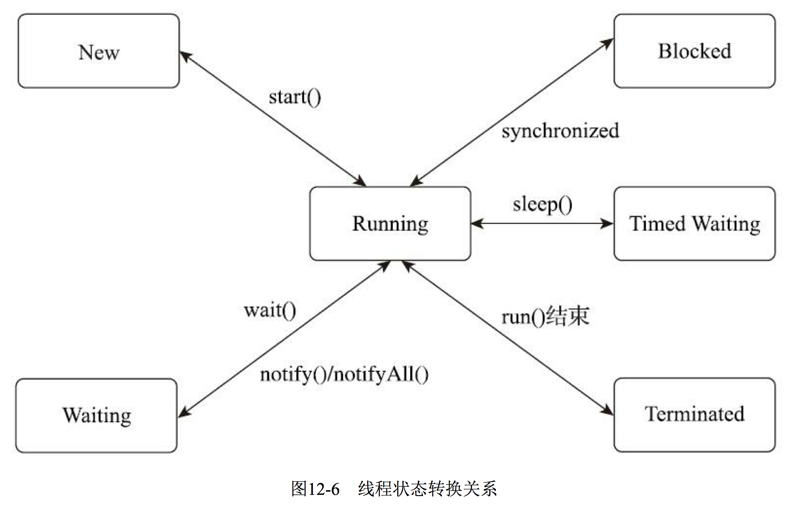

#### 4，协程

**内核线程的局限**：$1：1$ 的内核线程模型是如今 `Java` 虚拟机线程实现的主流选择，但是这种映射到操作系统上的线程天然的缺陷是切换、调度成本高昂，系统能容纳的线程数量也很有限。以前处理一个请求可以允许花费很长时间在单体应用中，具有这种线程切换的成本也是无伤大雅的，但现在在每个请求本身的执行时间变得很短、数量变得很多的前提下， 用户线程切换的开销甚至可能会接近用于计算本身的开销，这就会造成严重的浪费。

内核线程的 **调度成本** 主要来自于用户态与核心态之间的状态转换，而这两种状态转换的开销主要来自于响应中断、保护和恢复执行现场的成本。

**协程的复苏**：由于最初多数的用户线程是被设计成协同式调度 （`Cooperative Scheduling`）的，所以它有了一个别名——“**协程**”（`Coroutine`）。又由于这时候的协程会完整地做调用栈的保护、恢复工作，所以也被称为“**有栈协程**”（`Stackfull Coroutine`）。

协程的 **主要优势** 是轻量，无论是有栈协程还是无栈协程，都要比传统内核线程要轻量得多。如果不显式设置 `-Xss` 或 `-XX：ThreadStackSize`，则在64位 `Linux` 上 `HotSpot` 的线程栈容量默认是1MB，此外内核数据结构（`Kernel Data Structures`）还会额外消耗16KB内存。

协程的 **局限** 在于，需要在应用层面实现的内容（调用栈、调度器）特别多。

**`Java` 的解决方案**：对于有栈协程，有一种特例实现名为 **纤程**（`Fiber`），最早是来自微软公司，后来微软还推出过系统层面的纤程包来方便应用做现场保存、恢复和纤程调度。`OpenJDK` 在2018年创建了 `Loom` 项目，这是 `Java` 的官方解决方案，日后该项目为 `Java` 语言引入的、与现在线程模型平行的新并发编程机制中应该也会采用“纤程”。

在新并发模型下，一段使用纤程并发的代码会被分为两部分——**执行过程**（`Continuation`）和 **调度器**（`Scheduler`）。**执行过程** 主要用于维护执行现场，保护、恢复上下文状态，而 **调度器** 则负责编排所有要执行的代码的顺序。将调度程序与执行过程分离的好处是，用户可以选择自行控制其中的一个或者多个，而且 `Java` 中现有的调度器也可以被直接重用。事实上，`Loom` 中默认的调度器就是原来已存在的用于任务分解的 `Fork/Join` 池（`JDK 7` 中加入的`ForkJoinPool`）。

## 十三，线程安全与锁优化

#### 1，线程安全

《`Java` 并发编程实战（`Java Concurrency In Practice`）》的作者 `Brian Goetz` 为“ **线程安全** ”做 出了一个比较恰当的定义：“当多个线程同时访问一个对象时，如果不用考虑这些线程在运行时环境下的调度和交替执行，也不需要进行额外的同步，或者在调用方进行任何其他的协调操作，调用这个对象的行为都可以获得正确的结果，那就称这个对象是线程安全的。”

此定义很严谨而且有可操作性，它要求线程安全的代码都必须具备一个 **共同特征**：代码本身封装了所有必要的正确性保障手段（如互斥同步等），令调用者无须关心多线程下的调用问题，更无须自己实现任何措施来保证多线程环境下的正确调用。

按照线程安全的“安全程度”由强至弱来排序，将 `Java` 语言中各种操作共享的数据分为以下五类：

> **不可变** ：在 `Java` 语言里面（特指 `JDK 5` 以后），**不可变** （`Immutable`）的对象一定是线程安全的，无论是对象的方法实现还是方法的 调用者，都不需要再进行任何线程安全保障措施。只要 一个不可变的对象被正确地构建出来（即没有发生 `this` 引用逃逸的情况），那其外部的可见状态永远都不会改变，永远都不会看到它在多个线程之中处于不一致的状态。“不可变”带来的安全性是最直接、 最纯粹的；
>
> **绝对线程安全** ：一个类要达到“不管运行时环境如何，调用者都不需要任何额外的同步措施”可能需要付出非常高昂的， 甚至不切实际的代价。`java.util.Vector` 是一个线程安全的容器，因为它的 `add()`、`get()` 和 `size()` 等方法都是被 `synchronized` 修饰的，尽管这样效率不高，但保证了具备 **原子性**、**可见性** 和 **有序性**；
>
> 假如 `Vector` 一定要做到 **绝对** 的线程安全，那就必须在它内部维护一组一致性的快照访问才行，每次对其中元素进行改动都要产生新的快照，这样要付出的时间和空间成本都是非常大的。
>
> **相对线程安全** ：即通常意义上的线程安全，它需要保证对这个对象单次的操作是线程安全的，在调用的时候不需要进行额外的保障措施，但是对于一些特定顺序的连续调用，就可能需要在调用端使用额外的同步手段来保证调用的正确性。在 `Java` 语言中，大部分声称线程安全的类都属于这种类型，例如 `Vector`、`HashTable`、`Collections` 的 `synchronizedCollection()` 方法包装的集合等；
>
> **线程兼容** ：指对象本身并不是线程安全的，但是可以通过在调用端正确地使用同步手段来保证对象在并发环境中可以安全地使用；
>
> **线程对立** ：指不管调用端是否采取了同步措施，都无法在多线程环境中并发使用代码。由于 `Java` 语言天生就支持多线程的特性，线程对立这种排斥多线程的代码是很少出现的，而且通常都是有害的，应当尽量避免。
>
> > 线程对立的**典型案例**： `Thread` 类的 `suspend()` 和 `resume()` 方法。如果有两个线程同时持有一个线程对象，一个尝试去中断线程，一个尝试去恢复线程，在并发进行的情况下，无论调用时是否进行了同 步，目标线程都存在死锁风险——假如 `suspend()` 中断的线程就是即将要执行 `resume()` 的那个线程，那就肯定要产生死锁。也正是这个原因，`suspend()` 和 `resume()` 方法都已经被声明废弃了。常见的线程对立的操作还有 `System.setIn()`、`Sytem.setOut()` 和 `System.runFinalizersOnExit()` 等。

代码清单13-1　对 `Vector` 线程安全的测试

```java
package com.jvm;

import java.util.Vector;

/**
 * 对 Vector 线程安全的测试
 *
 * @author zhangbocheng
 * @version v1.0
 * @date 2020/8/29 00:54
 */
public class VectorThreadTest {
    private static Vector<Integer> vector = new Vector<>(16);

    public static void main(String[] args) {
        while (true) {
            int count = 10;
            for (int i = 0; i < count; i++) {
                vector.add(i);
            }

            Thread removeThread = new Thread(new Runnable() {
                @Override
                public void run() {
                    for (int i = 0; i < vector.size(); i++) {
                        vector.remove(i);
                    }
                }
            });

            Thread printThread = new Thread(new Runnable() {
                @Override
                public void run() {
                    for (int i = 0; i < vector.size(); i++) {
                        System.out.println(vector.get(i));
                    }
                }
            });

            removeThread.start();
            printThread.start();

            int number = 20;
            while (Thread.activeCount() > number) { }
        }
    }
}
```

代码清单13-2　必须加入同步保证 `Vector` 访问的线程安全性

```java
package com.jvm;

import java.util.Vector;

/**
 * 必须加入同步保证Vector访问的线程安全性
 *
 * @author zhangbocheng
 * @version v1.0
 * @date 2020/8/29 00:54
 */
public class VectorThreadSynchronizedTest {
    private static Vector<Integer> vector = new Vector<>(16);

    public static void main(String[] args) {
        while (true) {
            int count = 100;
            for (int i = 0; i < count; i++) {
                vector.add(i);
            }

            Thread removeThread = new Thread(new Runnable() {
                @Override
                public void run() {
                    synchronized (vector) {
                        for (int i = 0; i < vector.size(); i++) {
                            vector.remove(i);
                        }
                    }
                }
            });

            Thread printThread = new Thread(new Runnable() {
                @Override
                public void run() {
                    synchronized (vector) {
                        for (int i = 0; i < vector.size(); i++) {
                            System.out.println(vector.get(i));
                        }
                    }
                }
            });

            removeThread.start();
            printThread.start();

            int number = 20;
            while (Thread.activeCount() > number) { }
        }
    }
}
```

#### 2，线程安全的实现方法

- 互斥同步 

**互斥同步**（`Mutual Exclusion & Synchronization`）是一种最常见也是最主要的并发正确性保障手段。

> **同步** 是指在多个线程并发访问共享数据时，保证共享数据在同一个时刻只被一条（或者是一些， 当使用信号量的时候）线程使用；
>
> **互斥** 是实现同步的一种手段，临界区（`Critical Section`）、互斥量 （`Mutex`）和信号量（`Semaphore`）都是常见的互斥实现方式。因此在“互斥同步”这四个字里面，互斥是因，同步是果；互斥是方法，同步是目的。

在 `Java` 里面，最基本的互斥同步手段就是 `synchronized` 关键字，这是一种 **块结构**（`Block Structured`）的同步语法。`synchronized` 关键字经过 `Javac` 编译之后，会在同步块的前后分别形成 `monitorenter` 和 `monitorexit` 这两个字节码指令。这两个字节码指令都需要一个 `reference` 类型的参数来指明要锁定和解锁的对象。如果 `Java` 源码中的`synchronized` 明确指定了对象参数，那就以这个对象的引用作为 `reference`；如果没有明确指定，那将根据 `synchronized` 修饰的方法类型（如实例方法或类方法），来决定是取代码所在的对象实例还是取类型对应的 `Class` 对象来作为线程要持有的锁。

>被 `synchronized` 修饰的同步块对同一条线程来说是可重入的，这意味着同一线程反复进入同步块也不会出现自己把自己锁死的情况；
>
>被 `synchronized` 修饰的同步块在持有锁的线程执行完毕并释放锁之前，会无条件地阻塞后面其他线程的进入,这意味着无法像处理某些数据库中的锁那样，强制已获取锁的线程释放锁；也无法强制正在等待锁的线程中断等待或超时退出。

除了 `synchronized` 关键字以外，自 `JDK 5` 起（实现了 `JSR 166` ），`Java` 类库中新提供了 `java.util.concurrent` 包（下文称 `J.U.C` 包），其中的 `java.util.concurrent.locks.Lock` 接口便成了 `Java` 的另一种全新的互斥同步手段。基于 `Lock` 接口，用户能够 以 **非块结构**（`Non-Block Structured`）来实现互斥同步，从而摆脱了语言特性的束缚，改为在类库层面去实现同步。

**重入锁**（`ReentrantLock`）是 `Lock` 接口最常见的一种实现，它与 `synchronized` 一样是可重入的。在基本用法上，   `ReentrantLock` 也与 `synchronized` 很相似，只是代码写法上稍有区别而已。不过，`ReentrantLock` 增加了一些高级功能，主要有以下三项：**等待可中断**、**可实现公平锁** 及 **锁可以绑定多个条件**。

> **等待可中断**：是指当持有锁的线程长期不释放锁的时候，正在等待的线程可以选择放弃等待，改为处理其他事情。可中断特性对处理执行时间非常长的同步块很有帮助；
>
> **公平锁**：是指多个线程在等待同一个锁时，必须按照申请锁的时间顺序来依次获得锁；而 **非公平锁** 在锁被释放时，任何一个等待锁的线程都有机会获得锁。`synchronized` 中的锁是非公平的，`ReentrantLock` 在默认情况下也是非公平的，但可以通过带布尔值的构造函数要求使用公平锁。不过一旦使用了公平锁，将会导致 `ReentrantLock` 的性能急剧下降，会明显影响吞吐量；
>
> **锁绑定多个条件**：是指一个 `ReentrantLock` 对象可以同时绑定多个 `Condition` 对象。在 `synchronized` 中，锁对象的 `wait()` 跟它的 `notify()` 或者 `notifyAll()` 方法配合可以实现一个隐含的条件，如果要和多于一 个的条件关联的时候，就不得不额外添加一个锁；而 `ReentrantLock` 则无须这样做，多次调用 `newCondition()` 方法即可。

推荐在 `synchronized` 与 `ReentrantLock` 都可满足需要时优先使用 `synchronized`：

> `synchronized` 是在 `Java` 语法层面的同步，足够清晰，也足够简单。因此在只需要基础的同步功能时，更推荐  `synchronized`；
>
> `Lock` 应该确保在 `finally` 块中释放锁，否则一旦受同步保护的代码块中抛出异常，则有可能永远不会释放持有的锁。这一点必须由程序员自己来保证，而使用 `synchronized` 的话则可以由 `Java` 虚拟机来确保即使出现异常，锁也能被自动释放；
>
> 尽管在 `JDK 5` 时代 `ReentrantLock` 曾经在性能上领先过 `synchronized`。从长远来看，`Java` 虚拟机更容易针对 `synchronized` 来进行优化，因为 `Java` 虚拟机可以在线程和对象的元数据中记录 `synchronized` 中锁的相关信息，而使用 `J.U.C` 中的 `Lock` 的话，`Java` 虚拟机是很难得知具体哪些锁对象是由特定线程锁持有的。

互斥同步面临的主要问题是进行线程阻塞和唤醒所带来的性能开销，因此这种同步也被称为 **阻塞同步**（`Blocking Synchronization`）。

- 非阻塞同步

基于冲突检测的乐观并发策略，通俗地说就是不管风险，先进行操作，如果没有其他线程争用共享数据，那操作就直接成功了；如果共享的数据的确被争用，产生了冲突，那再进行其他的补偿措施，最常用的补偿措施是不断地重试，直到出现 没有竞争的共享数据为止。这种乐观并发策略的实现不再需要把线程阻塞挂起，因此这种同步操作被称为 **非阻塞同步**（`Non-Blocking Synchronization`），使用这种措施的代码也常被称为 **无锁**（`Lock-Free`） 编程。

在 `JDK 5` 之后，`Java` 类库中才开始使用 `CAS` 操作，该操作由 `sun.misc.Unsafe` 类里面的 `compareAndSwapInt()` 和 `compareAndSwapLong()` 等几个方法包装提供。

`CAS` 指令需要有三个操作数，分别是 **内存位置**（在 `Java` 中可以简单地理解为变量的内存地址，用 `V` 表示）、**旧的预期值**（用 `A` 表示）和 **准备设置的新值**（用 `B` 表示）。`CAS` 指令执行时，当且仅当 `V` 符合 `A` 时，处理器才会用 `B` 更新 `V` 的值，否则它就不执行更新。但是，不管是否更新了 `V` 的值，都会返回 `V` 的旧值，上述的处理过程是一个原子操作，执行期间不会被其他线程中断。

代码清单13-3　`Atomic` 的原子自增运算

```java
package com.jvm;

import org.omg.PortableServer.THREAD_POLICY_ID;

import java.util.concurrent.atomic.AtomicInteger;

/**
 * Atomic 变量自增运算测试
 *
 * @author zhangbocheng
 * @version v1.0
 * @date 2020/8/31 17:30
 */
public class AtomicTest {

    private static final int THREADS_COUNT = 20;
    public static AtomicInteger race = new AtomicInteger(0);

    public static void increase() {
        race.incrementAndGet();
    }

    public static void main(String[] args) throws Exception {
        Thread[] threads = new Thread[THREADS_COUNT];
        for (int i = 0; i < THREADS_COUNT; i++) {
            threads[i] = new Thread(new Runnable() {
                @Override
                public void run() {
                    int count = 10000;
                    for (int j = 0; j < count; j++) {
                        increase();
                    }
                }
            });

            threads[i].start();
        }

        while (Thread.activeCount() > 1) {
            Thread.yield();
        }

        // 输出：200000
        System.out.println(race);  
    }
}
```

　`incrementAndGet()` 方法的 `JDK` 源码（`jdk1.8.0_131`）

```java
public final int incrementAndGet() {
  return unsafe.getAndAddInt(this, valueOffset, 1) + 1;
}
```

```java
public final int getAndAddInt(Object var1, long var2, int var4) {
  int var5;
  do {
    var5 = this.getIntVolatile(var1, var2);
  } while(!this.compareAndSwapInt(var1, var2, var5, var5 + var4));

  return var5;
}
```

`CAS` 从语义上来说存在一个逻辑漏洞：如果一个变量 `V` 初次读取的时候是 `A` 值，并且在准备赋值的时候检查到它仍然为 `A` 值，那就能说明它的值没有被其他线程改变过了吗？这是不能的，因为如果在这段期间它的值曾经被改成 `B`，后来又被改回为 `A`，那 `CAS` 操作就会误认为它从来没有被改变过。这个漏洞称为 `CAS` 操作的“**ABA问题**”。`J.U.C` 包为了解决这个问题，提供了一个带有标记的原子引用类 `AtomicStampedReference`，它可以通过控制变量值的版本来保证 `CAS` 的正确性。不过目前来说这个类处于相当鸡肋的位置，大部分情况下 `ABA` 问题不会影响程序并发的正确性，如果需要解决 `ABA` 问题，改用传统的互斥同步可能会比原子类更为高效。

- 同步方案

**可重入代码**（`Reentrant Code`）：这种代码又称 **纯代码**（`Pure Code`），是指可以在代码执行的任何时刻中断它，转而去执行另外一段代码（包括递归调用它本身），而在控制权返回后，原来的程序不会出现任何错误，也不会对结果有所影响。可重 入性是更为基础的特性，它可以保证代码线程安全，即所有可重入的代码都是线程安全的，但并非所有的线程安全的代码都是可重入的。

**线程本地存储**（`Thread Local Storage`）：如果一段代码中所需要的数据必须与其他代码共享，那就看看这些共享数据的代码是否能保证在同一个线程中执行。如果能保证，我们就可以把共享数据的可见范围限制在同一个线程之内，这样，无须同步也能保证线程之间不出现数据争用的问题。

`Java` 语言中，如果一个变量要被多线程访问，可以使用 `volatile` 关键字将它声明为“**易变的**”；如果 一个变量只要被某个线程独享，`Java` 中就没有类似 `C++` 中 `__declspec(thread)` 这样的关键字去修饰，不 过还可以通过`java.lang.ThreadLocal` 类来实现线程本地存储的功能。每一个线程的 `Thread` 对象中都有一个 `ThreadLocalMap` 对象，这个对象存储了一组以 `ThreadLocal.threadLocalHashCode` 为键，以本地线程变量为值的 `K-V` 值对，`ThreadLocal` 对象就是当前线程的 `ThreadLocalMap` 的访问入口，每一个 `ThreadLocal` 对象都包含了一个独一无二的 `threadLocalHashCode` 值，使用这个值就可以在线程 `K-V` 值对中找回对应的本地线程变量。

#### 3，锁优化

- 自旋与自适应自旋

为了让线程等待，只须让线程执行一个忙循环（自旋），这项技术就是所谓的 **自旋锁**。自旋锁在 `JDK 1.4.2` 中就已经引入，只不过默认是关闭的，可以使用 `-XX：+UseSpinning` 参数来开 启，在 `JDK 6` 中就已经改为默认开启。自旋等待不能代替阻塞，且先不说对处理器数量的要求，自旋等待本身虽然避免了线程切换的开销，但它是要占用处理器时间的，所以如果锁被占用的时间很短，自旋等待的效果就会非常好，反之如果锁被占用的时间很长，那么自旋的线程只会白白消耗处理 器资源，而不会做任何有价值的工作，这就会带来性能的浪费。自旋次数的默认值是10次，用户也可以使用参数 `-XX：PreBlockSpin` 来自行更改。

在 `JDK 6` 中对自旋锁的优化，引入了 **自适应自旋**。自适应意味着自旋的时间不再是固定的了，而是由前一次在同一个锁上的自旋时间及锁的拥有者的状态来决定的。如果在同一个锁对象上，自旋等待刚刚成功获得过锁，并且持有锁的线程正在运行中，那么虚拟机就会认为这次自旋也很有可能再次成功，进而允许自旋等待持续相对更长的时间，比如持续100次忙循环。另一方面，如果对于某个锁，自 旋很少成功获得过锁，那在以后要获取这个锁时将有可能直接省略掉自旋过程，以避免浪费处理器资源。

- 锁消除

**锁消除** 是指虚拟机即时编译器在运行时，对一些代码要求同步，但是对被检测到不可能存在共享数据竞争的锁进行消除。锁消除的 **主要判定依据** 来源于逃逸分析的数据支持，如果判断到一段代码中，在堆上的所有数据都不会逃逸出去被其他线程访问到，那就可以把它们当作栈上数据对待，认为它们是线程私有的，同步加锁自然就无须再进行。

- 锁粗化

原则上在编写代码的时候，总是推荐将同步块的作用范围限制得尽量小——只在共享数 的实际作用域中才进行同步，这样是为了使得需要同步的操作数量尽可能变少，即使存在锁竞争，等待锁的线程也能尽可能快地拿到锁；但是如果一系列的连续操作都对同一个对象反复加锁和解锁，甚至加锁操作是出现在循环体之中的，那即使没有线程竞争，频繁地进行互斥同步操作也会导致不必要的性能损耗。

- 轻量级锁

**轻量级锁** 是 `JDK 6` 时加入的新型锁机制，它名字中的“轻量级”是相对于使用操作系统互斥量来实现的传统锁而言的，因此传统的锁机制就被称为“**重量级**”锁。轻量级锁设计的 **初衷** 是在没有多线程竞争的前提下，减少传统的重量级锁使用操作系统互斥量产生的性能消耗。

`HotSpot` 虚拟机的对象头（`Object Header`）分为两部分：

> 1）用于存储对象自身的运行时数据，如哈希码（`HashCode`）、`GC` 分代年龄（`Generational GC Age`） 等。这部分数据的长度在32位和64位的 `Java` 虚拟机中分别会占用32个或64个比特，官方称它为“`Mark Word`”。这部分是实现轻量级锁和偏向锁的关键；
>
> 2）用于存储指向方法区对象类型数据的指针，如果是数组对象，还会有一个额外的部分用于存储数组长度。

由于对象头信息是与对象自身定义的数据无关的额外存储成本，考虑到 `Java` 虚拟机的空间使用效率，`Mark Word` 被设计成一个非固定的动态数据结构，以便在极小的空间内存储尽量多的信息。它会根据对象的状态复用自己的存储空间。例如在32位的 `HotSpot` 虚拟机中，对象未被锁定的状态下，`Mark Word` 的32个比特空间里的25个比特将用于存储对象哈希码，4个比特用于存储对象分代年龄，2 个比特用于存储锁标志位，还有1个比特固定为0（这表示未进入偏向模式）。

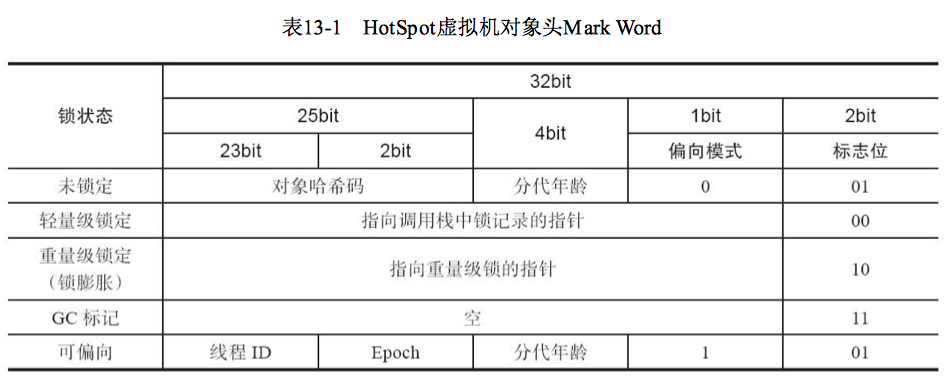

- 偏向锁

**偏向锁** 是 `JDK 6` 中引入的一项锁优化措施，目的是消除数据在无竞争情况下的同步原语， 进一步提高程序的运行性能。如果说轻量级锁是在无竞争的情况下使用 `CAS` 操作去消除同步使用的互斥量，那偏向锁就是在无竞争的情况下把整个同步都消除掉，连CAS操作都不去做。

偏向锁中的“偏”，是指这个锁会偏向于第一个获得它的线程，如果在接下来的执行过程中，该锁一直没有被其他的线程获取，则持有偏向锁的线程将永远不需要再进行同步。

假设当前虚拟机启用了偏向锁（启用参数 `-XX：+UseBiased Locking`，这是自 `JDK 6` 起 `HotSpot` 虚拟机的默认值），那么当锁对象第一次被线程获取的时候，虚拟机将会把对象头中的标志位设置为“01”、把偏向模式设置为“1”，表示进入偏向模式。同时使用 `CAS` 操作把获取到这个锁的线程的 `ID` 记录在对象的 `Mark Word` 之中。如果 `CAS` 操作成功，持有偏向锁的线程以后每次进入这个锁相关的同步块时，虚拟机都可以不再进行任何同步操作（例如加锁、解锁及对 `Mark Word` 的更新操作等）。一旦出现另外一个线程去尝试获取这个锁的情况，偏向模式就马上宣告结束。根据锁对象目前是 否处于被锁定的状态决定是否撤销偏向（偏向模式设置为“0”），撤销后标志位恢复到未锁定（标志位 为“01”）或轻量级锁定（标志位为“00”）的状态。

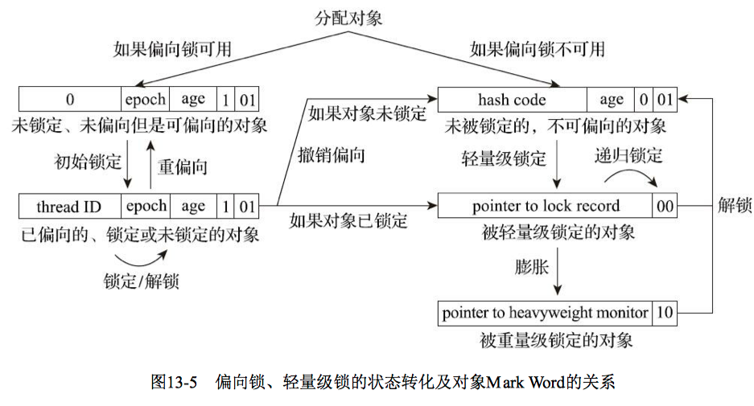 