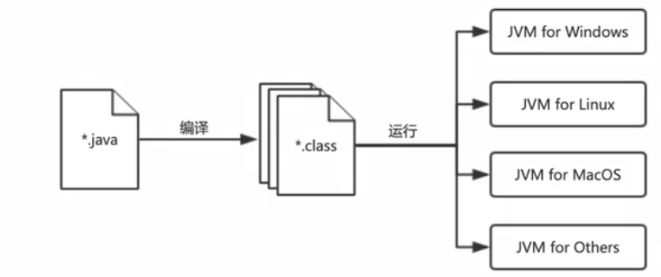

[TOC]

# 大数据视频课程笔记

> 视频课程：https://www.bilibili.com/video/BV1vX4y1T7WR?p=1

## 一，大数据概念

#### 1，大数据定义

指海量数据，具有高增长率，数据类型多样化，一定时间内无法使用常规软件工具进行捕捉、管理和处理的数据集合。

#### 2，大数据特征

> `Volume`（大量）；`Variety`（多样）；`Velocity`（高速）；`Value`（价值）

大数据产业链的形成：

> 数据源—>数据源—>数据储存—>数据分析—>数据展示—>数据应用

## 二，Java基础

#### 1，`Java` 的发展历程，特点

> 面向对象：使用计算机模拟现实世界，解决现实问题，贴近人类思维模式；
>
> 简单：相比 `C/C++`，不易造成内存溢出，减少代码量；代码可读性强；
>
> 跨平台：操作系统，服务器 `—>` 平台无关性。

#### 2，`Java` 的执行机制



> 设计理念：`Write once Run Anywhere`

> `JDK`（`Java Development Kit`）开发环境：包含 `JRE`，类库，开发工具包（编译器+调试工具）；
>
> `JRE`（`Java Runtime Environment`）运行环境：包括 `JVM` 和解释器，完整的`Java` 运行环境；
>
> `JVM`（`Java Virtual Machine`）虚拟机：使用软件在不同操作系统中，模拟相同的环境。

#### 3，`Java` 的数据类型

1）基本数据类型

|   数据类型   |  关键字   | 占用空间大小 |             取值范围              |
| :----------: | :-------: | :----------: | :-------------------------------: |
|    字节型    |  `byte`   |      1       |          $$[-128,127]$$           |
|    短整型    |  `short`  |      2       |      $$[-2^{15},2^{15}-1]$$       |
|     整型     |   `int`   |      4       |      $$[-2^{31},2^{31}-1]$$       |
|    长整型    |  `long`   |      8       |      $$[-2^{63},2^{63}-1]$$       |
| 单精度浮点型 |  `float`  |      4       |                 -                 |
| 双精度浮点型 | `double`  |      8       |                 -                 |
|    字符型    |  `char`   |      2       | $$[\text{\u0000},\text{\uFFFF}]$$ |
|    布尔型    | `boolean` |      1       |          `true / false`           |

2）引用数据类型

#### 4，标识符

每一个数据都需要一个唯一标识来表示，这个用来表示内存中的某一个数据的表示形式，就是一个标识符。

标识符，是由若干个字符组成的有序序列。命名规则如下：

> 1）由字母、数字、下划线和 `$` 符号组成；
>
> 2）不能以数字作为开头；
>
> 3）不能与系统关键字或保留字重名。

标识符的命名规范，首先要遵循望文知意，即一个标识符的命名应该一眼能够看出来想表达什么含义。

> `name`：表示姓名；
>
> `age`：表示年龄；
>
> `gender`：表示性别。

其次，遵循驼峰命名法。

> 大驼峰命名法：每一个单词的首字母都大写；
>
> 小驼峰命名法：首单词除外，从第二个单词开始，每个单词的首字母都大写。

变量/常量：计算机内存中的一块存储空间，是存储数据的基本单元。

> 如果某个数据在程序运行过程中，值是可以改变的，这样的数据称为 **变量**；
>
> 如果某个数据在程序运行过程中，值是不可改变的，这样的数据称为 **常量**。
>
> 变量的组成：数据类型，变量名，值。
>
> 如果一个局部变量没有经过赋值，此时这个变量是不可用的。
>
> 定义常量，需要使用关键字 `final`，一般全部大写，单词之间用下划线 `_` 连接。
>
> 浮点型字面量默认的类型是 `double` ，如果需要给一个 `float` 类型的变量进行赋值，需要在字面量的结尾添加 `F` 或 `f`。

转义字符：

> 1）可以将一些特殊字符变成普通字符，没有特殊含义；
>
> 2）可以配合一些普通的字符使用，使其具有特殊含义。

#### 5，数据类型转换

数据类型转换是指声明一个新的指定类型的变量，将原来变量中的值拷贝到新的变量中。

> 自动类型转换：又叫隐式转换，一般是由取值范围小的数据类型向取值范围更大的数据类型转换；转换过程不需要任何额外操作；转换后没有任何精度丢失；
>
> 强制类型转换：又叫显式转换，一般是由取值范围大的数据类型向取值范围更小的数据类型转换；转换过程需要强制操作；转换后可能会出现精度丢失。

位运算符：

| 运算符 | 描述                                                         |
| :----: | :----------------------------------------------------------- |
|  `&`   | 位与运算，对补码中的每一位进行与运算。                       |
|  `|`   | 位或运算，对补码中的每一位进行或运算。                       |
|  `^`   | 位异或运算，对补码中的每一位进行异或运算。                   |
|  `~`   | 按位取反运算，对补码中的每一位进行取反操作，包括符号位。     |
|  `<<`  | 位左移运算，对补码中的每一位依次向左移动指定的位数。         |
|  `>>`  | 位右移运算，对补码中的每一位一次向右移动指定的位数，左侧补符号位。 |
| `>>>`  | 无符号位右移运算，对补码中的每一位一次向右移动指定的位数，左侧补0。 |

> > 5的原码是 0000 0101，补码是 0000 0101
> >
> > -7的原码是 1000 0111，补码是 1111 1001
>
> $$5 \& -7 = 1$$ ：0000 0101 & 1111 1001 = 0000 0001 => (1)（正数的补码与原码相同）
>
> $$5 | -7 = -3$$ ：0000 0101 | 1111 1001 = 1111 1101 => 1111 1100(反) => 1000 0011(原) => (-3) 
>
> $$5 \text{^} -7 = -4$$ ：0000 0101^1111 1001 = 1111 1100 =>1111 1011(反) => 1000 0100(原) => (-4)
>
> $$\text{~}5 = -6$$ ：~0000 0101=1111 1010 => 1111 1001(反) => 1000 0110(原) => (-6)
>
> $$2 << 3 = 16$$ ：0000 0010 << 3=0001 0000 => (16)
>
> $$48 >> 2 = 12$$ ：0011 0000 >> 2=0000 1100 => (12)
>
> $$ -45 >> 3 = -6$$ ：1101 0011 << 3=1111 1010 => 1111 1001(反) => 1000 0110(原) => (-6)
>
> $$-45 >>> 3 = 536870906$$ ：1111 1111 1111 1111 1111 1111 1101 0011 >>> 3=0001 1111 1111 1111 1111 1111 1111 1010 => (536870906)

#### 6，流程控制

在 `Java` 中，程序的执行结构分为：

> 顺序结构：代码从上至下，逐行依次执行，是程序执行的默认结构；
>
> 分支结构：程序在某一个节点遇到了多种向下执行的可能性，根据条件，选择一个分支继续执行；
>
> 循环结构：某一段代码需要被重复执行多次。

`switch` 穿透性：当 `switch` 的变量和某一个 `case` 值匹配上之后，将会跳跃后续的 `case` 或者 `default` 的匹配，直接向后穿透。

#### 7，方法

在一个类的方法中，如果多个方法满足如下条件，则他们之间的关系称为 **重载**：

> 方法名相同
>
> 参数不同：参数的数量不同或参数的类型不同
>
> ==**注意**：== 方法的重载，与返回值没有关系！

#### 8，数组

增强 `for` 循环：依次使用数组中的每一个元素，给迭代变量进行赋值。

可变长参数：可以接收多个类型形同的实参，个数不限，使用方式与数组相同；在调用方法时，实参的数量可以写任意多个。

> 数据类型… 形参名（必须放到形参列表的最后位，且只能有一个）

```java
// 参数 params 实质上是一个数组
static void show(int... params) {
  //
}
```

二维数组，实质上就是数组中嵌套数组。

数组扩容：实例化一个新的指定长度的数组，将原数组中的元素依次拷贝到新的数组中即可。

#### 9，泛型

泛型类/接口的特点：

> 1）在类/接口中定义的泛型，虽然还不明确是什么类型，但是在当前类/接口中是可以使用的；
>
> 2）在使用这个类/接口时，必须要指定泛型的类型，如果不指定，则默认为 `Object`；
>
> 3）泛型只能在当前类/接口中使用，不能在其他类/接口包括子类/子接口中使用。

泛型方法的特点：

> 1）在方法中定义的泛型，虽然还不明确是什么类型，但是在当前方法中是可以使用的；
>
> 2）在使用这个方法时，泛型的设置在参数中体现：
>
> > 泛型方法一定是有参的，参数列表中必须有泛型类型；
> >
> > 泛型方法中的泛型设置是在调用方法时通过实参的类型推导出来的。
>
> 3）泛型只能在当前方法中使用，不能在其他方法使用。（==静态方法只能自己使用泛型==）

#### 10，集合

`Java` 中的集合，分为两大类：`Collection` 和 `Map`，其中，`Collection` 是单列集合的顶级接口：

>`List` ：
>
>> `Vector`
>>
>> > `Stack`
>>
>> `ArrayList`
>>
>> `LinkedList`
>
>`Set`：
>
>> `HashSet`
>>
>> > `LinkedHashSet`
>>
>> `TreeSet`

`Map` 是双列集合的顶级接口：

> `HashMap`
>
> > `LinkedHashMap`
>
> `Hashtable`
>
> > `Properties`
>
> `TreeMap`

## 三，进制

进制即进位制，是人为定义的带进位的计数方法。`X` 进制就是逢 `X` 进位，常用进制有：二进制（`0b`），八进制（`0`），十进制，十六进制（`0x`）。

十进制转其他进制：辗转相除法，即用数字除进制，再用商除进制，一直到商为零结束，最后将每一步得到的余数倒着连接起来，即为这个数字指定的进制表示形式。

> $$18=0b10010=022=0\text{x}12$$

其他进制转十进制：每一位的数字乘进制的位数-1次方，再将所有的结果累加到一起。

> $$0b10010=1*2^4+1*2^1$$
>
> $$022=2*8^1+2*8^0$$
>
> $$0\text{x}12=1*16^1+2*16^0$$

**==技巧==**：每一个八进制位可以等价替换为三个二进制位；每一个十六进制位可以等价替换为四个二进制位。

在计算机中，所有的数据存储都是以二进制的形式存储的。每一个二进制位称为一个比特位（`bit`），8个比特位称为一个字节（`byte`）。

在使用二进制表示数字时，最高位（最左侧的位）不是用来表示数字的大小，而是表示数字的正负的，0表示正数，1表示负数。因此，最高位又被称为符号位。

为了规避在计算过程中，符号位参与运算导致结果出错，引入补码，所有的数据存储和运算都是以补码的形式进行的。

> 原码：一个数字的二进制表示形式；
>
> 反码：正数的反码与原码相同；负数的反码是原码符号位不变，其他位按位取反；
>
> 补码：正数的补码与原码相同；负数的补码是反码加1。
>
> > 8，因为是正数，原反补码都是 `0000 1000`；
> >
> > -8[原码]=`1000 1000`；
> >
> > -8[反码]=`1111 0111`；
> >
> > -8[补码]=`1111 1000`。

