# 数据库基础面试题

## MySQL基础知识

#### 1，MySQL 基本介绍

- MySQL体系结构

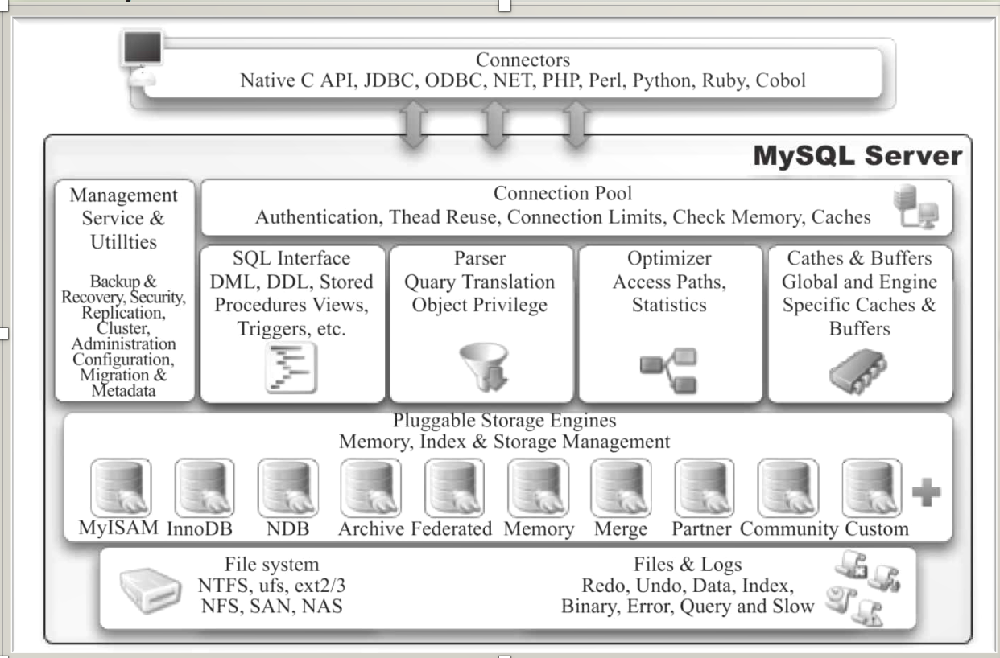

- MySQL逻辑架构

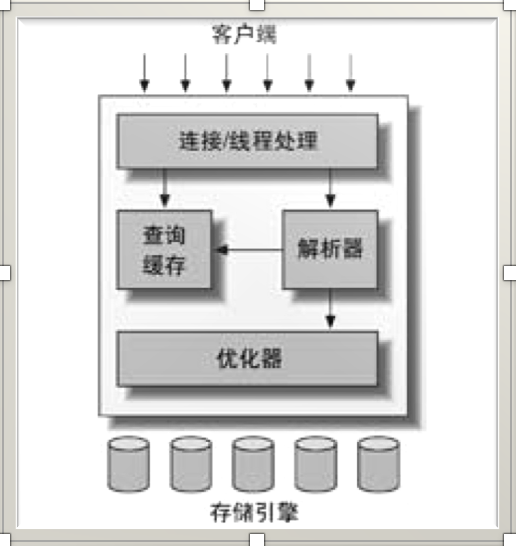

- MySQL查询过程

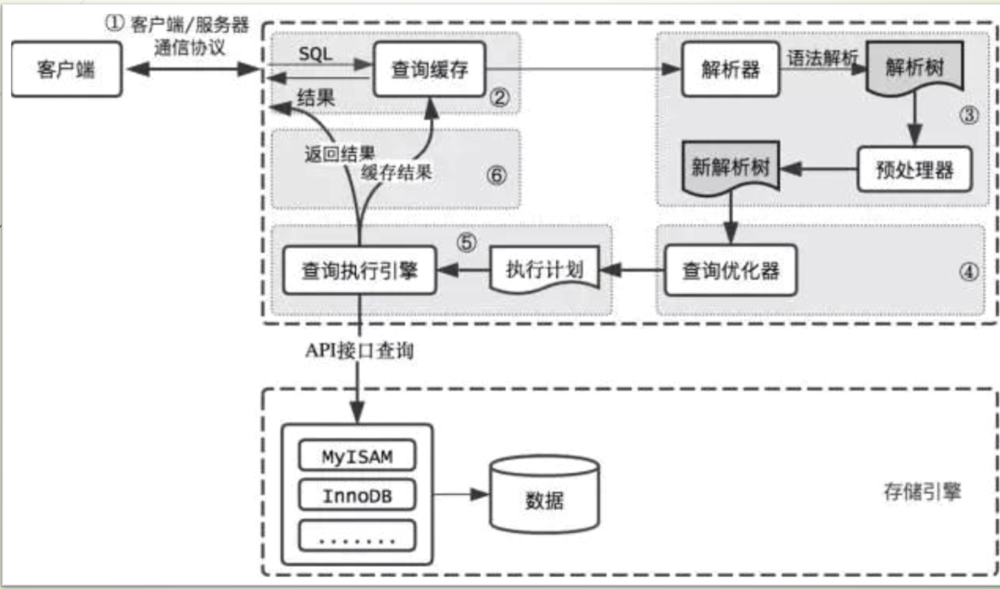

#### 2，MySQL 存储引擎机制

- `InnoDB` 存储引擎

>  支持事务，主要面向在线事务处理（`OLTP`）方面的应用，其特点是行锁设计，支持外键，支持非锁定读（默认情况下读取操作不会产生锁）。

> （1）可以通过自动增长列，方法是 `auto_increment`；
>
> （2）支持事务。默认的事务隔离级别为可重复度，通过 `MVCC`（并发版本控制）来实现的；
>
> （3）使用的锁粒度为行级锁，可以支持更高的并发；
>
> （4）支持外键约束；外键约束其实降低了表的查询速度，但是增加了表之间的耦合度；
>
> （5）支持在线热备份；
>
> > **双机热备** 就是使用 `MySQL` 提供的一种主从备份机制实现。所谓双机热备其实是一个复制的过程，复制过程中一个服务器充当主服务器，一个或多个服务器充当从服务。这个复制的过程 **实质** 上是从服务器复制主服务器上 `MySQL` 的二进制日志（`bin-log`），并在从服务器上还原主服务器上的操作。
>
> （6）在 `InnoDB` 中存在着缓冲管理，通过缓冲池，将索引和数据全部缓存起来，加快查询的速度；
>
> （7）对于 `InnoDB` 类型的表，其数据的物理组织形式是聚簇表，所有的数据按照主键来组织。数据和索引放在一块，都位于 `B+` 数的叶子节点上；
>
> （8）支持类似于 `Oracle` 的非锁定读，即默认读取操作不会产生锁；
>
> （9）从 `MySQL` 数据库5.5.8版本开始，`InnoDB` 存储引擎是默认的存储引擎。

> `InnoDB` 的存储表和索引有如下形式：
>
> （1）使用共享表空间存储：所有的表和索引存放在同一个表空间中。
>
> （2）使用多表空间存储：表结构放在 `frm` 文件，数据和索引放在 `IBD` 文件中。若使用分区表，每个分区对应单独的 `IBD` 文件。使用分区表的好处在于提升查询效率。

双机热备的具体步骤：

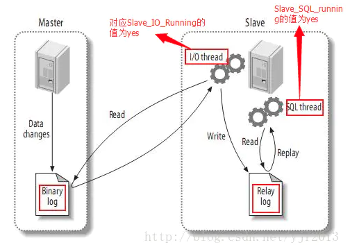

`MYSQL` 官方 `InnoDB` 架构图：

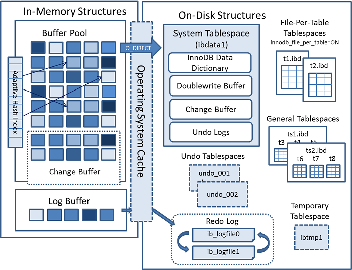

`InnoDB` 引擎的四大特性：

> 插入缓冲（`insert buffer`）—> 性能
>
> > 对于非聚集索引的插入或者更新操作，不是每一次直接插入到索引页中，而是先判断插入的非聚集索引页是否在缓冲池中，若在，则直接插入；若不在，则先放入到一个 `Insert Buffer` 对象中。数据库这个非聚集索引已经插到叶子节点，而实际并没有，只是存放在另一个位置。然后再以一定频率和情况进行 `Insert Buffer` 和辅助索引页子节点的 `merge`（合并）操作，通常可以将多个插入合并到一个操作中（以为在一个索引页中），大大提高了非聚集索引的插入性能。
> >
> > **条件**
> >
> > > 1）索引是辅助索引；
> > >
> > > 2）索引不是唯一索引。
> > >
> > > 满足以上两个条件时，`InnoDB` 存储引擎会使用 `Insert Buffer`，提高插入操作的性能。
>
> 二次写（`double write`）—> 可靠性
>
> > `double write` 技术带给 `innodb` 存储引擎的是数据页的可靠性。
> >
> > `innodb` 的数据页一般大小是 `16KB`，`MySQL` 存取数据的最小单位也是页，而操作系统并不能保障一个数据页的原子性，也就是说当写入数据时，有可能在一个页中写入一半时（比如 `8K`）数据库宕机，这种情况称为 **部分写失效**（`partial page write`），从而导致数据丢失。
> >
> > > 1）数据库宕机，物理文件完好无损，是可以通过 `redo log` 进行崩溃恢复；
> > >
> > > 2）数据库宕机，正在刷新到磁盘的页发生 `partial page write`，而正好在磁盘上的这个数据页由于宕机发生损坏，这时就无法通过 `redo log` 进行数据恢复，这是因为，`redo log` 里记录的是对页的物理操作。
> >
> > `double write` 由两部分组成：
> >
> > > 1）内存中的 `double write buffer`，其大小为 `2MB`；
> > >
> > > 2）磁盘上共享表空间（`ibdata x`）中连续的128个页，即2个区（`extent`），大小也是 `2M`。
> >
> > `double write` 工作流程如下：
> >
> > > 1）当一系列机制（`main` 函数触发、`checkpoint` 等）触发数据缓冲池中的脏页进行刷新时，并不直接写磁盘，而是会通过 `memcpy` 函数将脏页先复制到内存中的 `double write buffer`，之后通过 `double write buffer` 再分两次，每次 `1MB` 顺序写入共享表空间的物理磁盘上；
> > >
> > > 2）调用 `fsync` 函数，同步脏页进磁盘。由于在这个过程中，`double write` 页的存储时连续的，因此写入磁盘为顺序 写，性能很高；完成 `double write` 后，再将脏页写入实际的各个表空间文件，这时写入就是离散的。
>
> 自适应哈希索引（`Adaptive Hash Index, AHI`）
>
> > `Innodb` 存储引擎会监控对表上索引的查找，如果观察到建立哈希索引可以带来速度的提升，则建立哈希索引，所以称之为“**自适应哈希索引（`Adaptive Hash Index, AHI`）**”。
> >
> > 维护索引叶页面中所有记录的索引键值(或键值前缀)到索引叶页面位置的 `Hash` 映射关系，能够根据索引键值(前缀)快速定位到叶页面满足条件记录的 `Offset`，减少了 `B+` 树 `Search Path` 的代价，将 `B+` 树从 `Root` 页面至 `Leaf` 页面的路径定位，优化为 `Hash Index` 的快速查询。`Adaptive Hash Index` 是针对 `B+` 树 `Search Path` 的优化，因此所有会涉及到 `Search Path` 的操作，均可使用此 `Hash` 索引进行优化。
> >
> > 启用 `AHI` 后，读取和写入速度可以提高2倍，辅助索引的连接操作性能可以提高5倍。
> >
> > `AHI` 的设计思想是数据库自优化，不需要 `DBA` 对数据库进行手动调整，只能选择开启或者关闭。
>
> 预读（`read ahead`）

```mysql
mysql> show status like '%InnoDB_dblwr%';
+----------------------------+-------+
| Variable_name              | Value |
+----------------------------+-------+
| Innodb_dblwr_pages_written | 2     |
| Innodb_dblwr_writes        | 1     |
+----------------------------+-------+
2 rows in set (0.01 sec)
```

各模块协作情况如下图（第一步应为脏页产生的 `redo` 记录 `log buffer`，然后 `log buffer` 写入 `redo log file`，为简化次要步骤直接连线表示）：

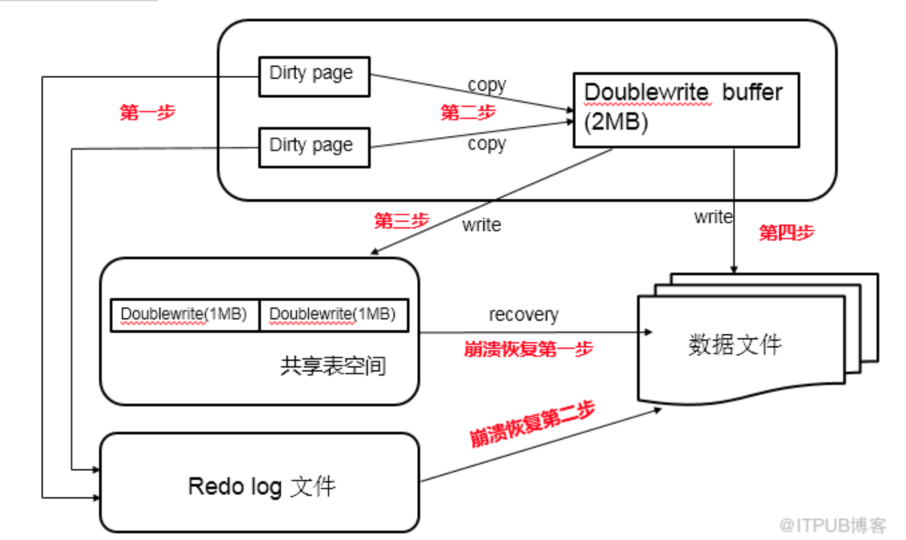

`AHI` 结构图：

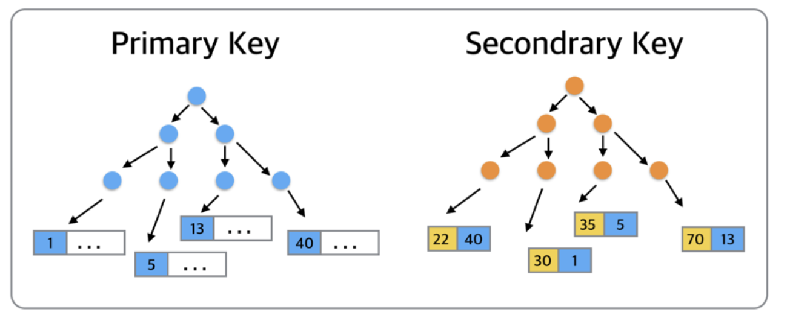

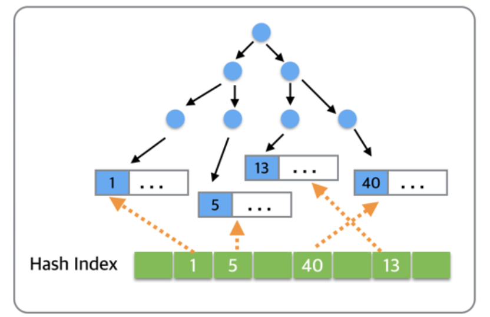

`InnoDB` 存储引擎的逻辑结构：

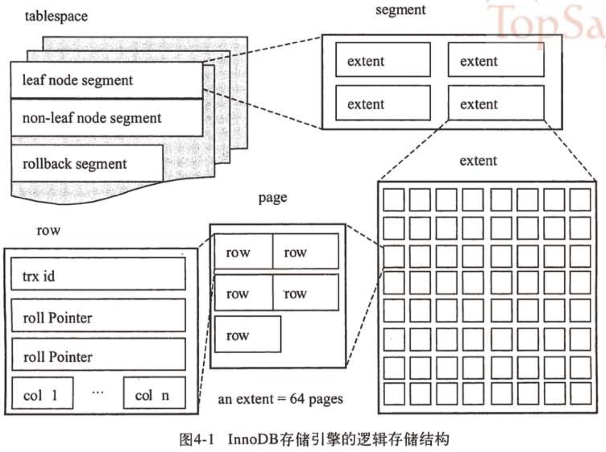

`update` 的更新流程：

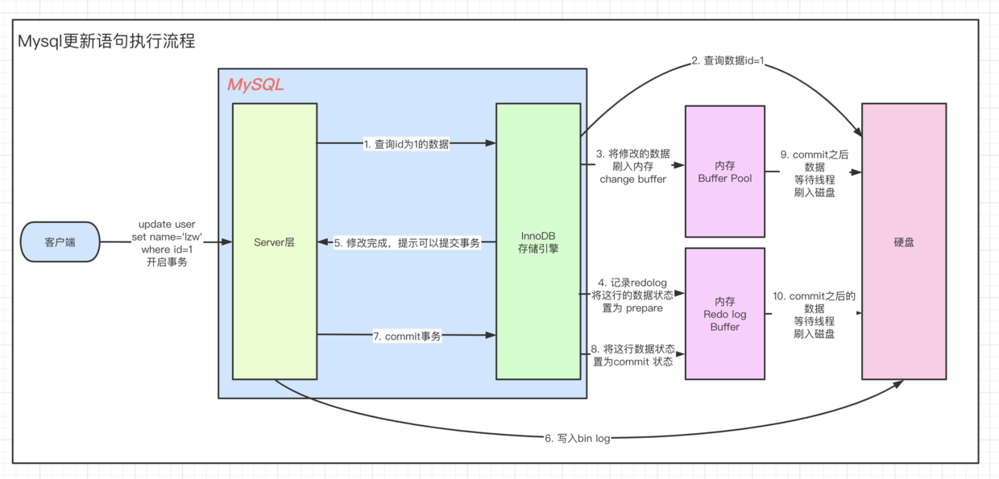

- `MyISAM` 存储引擎

> 不支持行级锁，只支持并发插入的表锁，主要用于高负载的 `select`；
>
> 不支持事务；
>
> `MyISAM` 表是独立于操作系统的：`.FRM` 存储表定义；`.MYD` 存储数据；`.MYI` 存储索引。

> （1）大文件（达到63位文件长度）在支持大文件的文件系统和操作系统上被支持；
>
> （2）每个 `MyISAM` 表最大索引数是64，这可以通过重新编译来改变。每个索引最大的列数是16；
>
> （3）最大的键长度是1000字节，这也可以通过编译来改变，对于键长度超过250字节的情况，一个超过1024字节的键将被用上；
>
> （4）`BLOB` 和 `TEXT` 列可以被索引；
>
> （5）`NULL` 被允许在索引的列中，这个值占每个键的0~1个字节；
>
> （6）所有数字键值以高字节优先被存储以允许一个更高的索引压缩；
>
> （7）每个 `MyISAM` 类型的表都有一个 `AUTO_INCREMENT` 的内部列，当 `INSERT` 和 `UPDATE` 操作的时候该列被更新，同时 `AUTO_INCREMENT` 列将被刷新。所以说，`MyISAM` 类型表的 `AUTO_INCREMENT` 列更新比`InnoDB` 类型的 `AUTO_INCREMENT` 更快；
>
> （8）每个字符列可以有不同的字符集；
>
> （9）有 `VARCHAR` 的表可以固定或动态记录长度；
>
> （10）`VARCHAR` 和 `CHAR` 列可以多达 `64KB`。

> `MyISAM` 类型的表支持三种不同的存储结构：
>
> > 1）静态型：指定义的表列的大小是固定（即不含有：`xblob、xtext、varchar` 等长度可变的数据类型），这样 `MySQL` 就会自动使用静态 `MyISAM` 格式；
> >
> > 2）动态型：如果列（即使只有一列）定义为动态的（`xblob, xtext, varchar` 等数据类型），这时 `MyISAM` 就自动使用动态型，虽然动态型的表占用了比静态型表较少的空间，但带来了性能的降低，随着数据变化的增多，碎片也随之增加，数据访问性能会随之降低；
> >
> > 3）压缩型：如果在数据库中创建在整个生命周期内只读的表，则应该使用 `MyISAM` 的压缩型表来减少空间的占用。

- `MEMORY` 存储引擎（`HEAP`）

> 所有的数据存储在内存中，默认使用哈希（`HASH`）索；支持的锁粒度为表级锁。

- `CSV` 存储引擎

> （1）是基于 `CSV` 格式文件存储数据；
>
> （2）所有列必须强制指定 `NOT NULL`；
>
> （3）`CSV` 引擎也不支持索引，不支持分区；
>
> （4）`CSV` 存储引擎也会包含一个存储表结构的 `.frm` 文件，还会创建一个 `.csv` 存储数据的文件，还会创建一个同名的元信息文件，该文件的扩展名为 ` .csm` ，用来保存表的状态及表中保存的数据量；
>
> （5）每个数据行占用一个文本行。

- `ARCHIVE`

> 仅仅支持插入和查询；
>
> 在 `MySQL` 5.1 版以前不支持索引，但是在 `MySQL` 5.1 以后的版本支持；
>
> 使用 `zlib` 压缩库（行压缩，压缩率可达10%），在记录被请求时会实时压缩，所以它经常被用来当做仓库使用。

- `BLACKHOLE`

> 不做实际存储；`MySQL` 还是会正常的记录下 `Binlog`，而且这些 `Binlog` 还会被正常的同步到 `Slave` 上，可以在 `Slave` 上对数据进行后续的处理。
>
> 应用场景：
>
> > （1）验证语法：验证 `dump file` 语法的正确性；
> >
> > （2）检测负载：以使用 `blackhole` 引擎来检测 `binlog` 功能所需要的额外负载；
> >
> > （3）检测性能：由于 `blackhole` 性能损耗极小，可以用来检测除了存储引擎这个功能点之外的其他 `MySQL` 功能点的性能。

- `FEDERATED`

> 主要用于访问其它远程 `MySQL` 服务器一个代理，它通过创建一个到远程 `MySQL` 服务器的客户端连接，并将查询传输到远程服务器执行，而后完成数据存取；在 `MariaDB` 上的实现是 `FederatedX`。

- `NDB`

> 是一个集群存储引擎，`share nothing` 的集群架构，能提供更高级别的高可用性，数据全部放在内存中。

- `Maria`

> 主要用途替代 `MyISAM` 存储引擎，缓存数据和索引文件，行锁设计，提供 `MVCC` 功能，支持事务和非事务安全的选项支持，以及 `BLOB` 字符类型的处理性能。

|                                                              | MyISAM                                                       | Innodb                                                       |
| ------------------------------------------------------------ | ------------------------------------------------------------ | ------------------------------------------------------------ |
| 存储结构                                                     | 每张表被存放在三个文件：`frm`-表格定义、`MYD(MYData)`-数据文件、`MYI(MYIndex)`-索引文件 | 所有的表都保存在同一个数据文件中（也可能是多个文件，或者是独立的表空间文件），`InnoDB` 表的大小只受限于操作系统文件的大小，一般为 `2GB` |
| 存储空间                                                     | `MyISAM` 可被压缩，存储空间较小                              | `InnoDB` 的表需要更多的内存和存储，它会在主内存中建立其专用的缓冲池用于高速缓冲数据和索引 |
| 可移植性、备份及恢复                                         | 由于 `MyISAM` 的数据是以文件的形式存储，所以在跨平台的数据转移中会很方便。在备份和恢复时可单独针对某个表进行操作 | 免费的方案可以是拷贝数据文件、备份 `binlog`，或者用 `mysqldump`，在数据量达到几十G的时候就相对痛苦 |
| 文件格式                                                     | 数据和索引是分别存储的，数据`.MYD`，索引`.MYI`               | 数据和索引是集中存储的，`.ibd`                               |
| 记录存储顺序                                                 | 按记录插入顺序保存                                           | 按主键大小有序插入                                           |
| 外键                                                         | 不支持                                                       | 支持                                                         |
| 事务                                                         | 不支持                                                       | 支持                                                         |
| 锁支持（锁是避免资源争用的一个机制，`MySQL` 锁对用户几乎是透明的） | 表级锁定                                                     | 行级锁定、表级锁定，锁定力度小并发能力高                     |
| `SELECT`                                                     | `MyISAM` 更优                                                |                                                              |
| `INSERT、UPDATE、DELETE`                                     |                                                              | `InnoDB` 更优                                                |
| `select count(*)`                                            | `myisam` 更快，因为 `myisam` 内部维护了一个计数器，可以直接调取。 |                                                              |
| 索引的实现方式                                               | `B+` 树索引，`myisam` 是堆表                                 | `B+` 树索引，`Innodb` 是索引组织表                           |
| 哈希索引                                                     | 不支持                                                       | 支持                                                         |
| 全文索引                                                     | 支持                                                         | 不支持                                                       |

#### 3，锁 `LOCK`

锁是计算机协调多个进程或纯线程并发访问某一资源的机制。

- 数据的逻辑结构

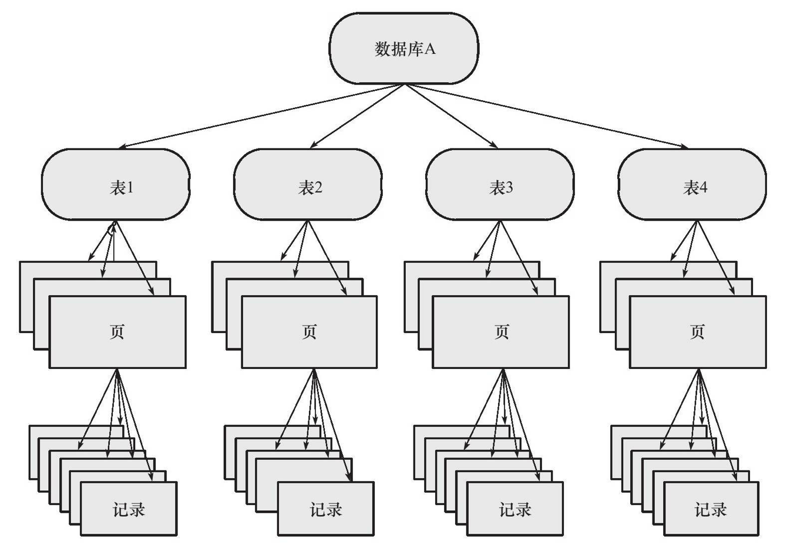

- 锁类型

> 表级锁：`MySQL` 中最基本的锁策略，并且是开销最小的策略。开销小，加锁快；不易出现死锁；锁定粒度大，发生锁冲突的概率最高，并发度最低。会发生在：`MyISAM、memory、InnoDB、BDB` 等存储引擎中；
>
> 行级锁：开销大，加锁慢；会出现死锁；锁定粒度最小，发生锁冲突的概率最低，并发度也最高。会发生在：`InnoDB`，`XtraDB` 存储引擎；
>
> 页级锁：开销和加锁时间界于表锁和行锁之间；会出现死锁；锁定粒度界于表锁和行锁之间，并发度一般。会发生在：`BDB` 存储引擎（`BDB`：可替代 `InnoDB` 的事务引擎，支持 `COMMIT、ROLLBACK` 和其他事务特性）。

- 行锁

> 共享锁（`S Lock`）允许事务读一行数据，与 `X` 锁互斥，与 `S` 锁兼容；
>
> 排它锁 （`X Lock`） 允许事务读一行数据，与 `X` 锁，`S` 锁均互斥。

- 表锁

> 意向共享锁（`IS`）：事务在给一个数据行加共享锁前必须先取得该表的IS锁；
>
> 意向排他锁（`IX`）：事务在给一个数据行加排他锁前必须先取得该表的IX锁；
>
> 自增锁(`AUTO-INC Locks`)：特殊表锁，自增长计数器通过该“锁”来获得子增长计数器最大的计数值。

| 兼容性 | IS   | IX   | S    | X    |
| ------ | ---- | ---- | ---- | ---- |
| IS     | 兼容 | 兼容 | 互斥 | 互斥 |
| IX     | 兼容 | 兼容 | 互斥 | 互斥 |
| S      | 兼容 | 互斥 | 兼容 | 互斥 |
| X      | 互斥 | 互斥 | 互斥 | 互斥 |

意向锁的作用：

> 意向锁主要用于多粒度的锁并存，在添加行锁之前添加；
>
> 意向锁是在添加行锁之前添加；
>
> 如果没有意向锁，当向一个表添加表级 `X` 锁时，就需要遍历整张表来判断是否存行锁，以免发生冲突；
>
> 如果有了意向锁，只需要判断该意向锁与表级锁是否兼容即可。

#### 4，MVCC

**多版本并发控制 （MVCC）**，是行级锁的一个变种，通过保存数据在某个时间节点的快照(`snapshot`)，类似实现了行级锁。实现上通过在不同的数据行后增加创建日期版本号和删除日期版本号，且版本号不断递增，进而实现数据快照。

- **MVCC的作用**：避免脏读、写不阻塞读、实现可重复读、多版本控制。

> 脏读：指一个线程中的事务读取到了另外一个线程中未提交的数据；
>
> 不可重复读（虚读）：指一个线程中的事务读取到了另外一个线程中提交的 `update` 的数据；
>
> 幻读：指一个线程中的事务读取到了另外一个线程中提交的 `insert` 的数据。

- **ACID**：

> 原子性：事务是数据库的逻辑工作单位，事务中包含的各操作要么都做，要么都不做；
>
> 一致性：事务执行的结果必须是使数据库从一个一致性状态变到另一个一致性状态。因此当数据库只包含成功事务提交的结果时，就说数据库处于一致性状态；
>
> 隔离性：一个事务的执行不能其它事务干扰，即一个事务内部的操作及使用的数据对其它并发事务是隔离的，并发执行的各个事务之间不能互相干扰；
>
> 持续性：也称永久性，指一个事务一旦提交，它对数据库中的数据的改变就应该是永久性的。

- 事务的实现：

> 原子性、一致性、持久性通过数据库的 `redo log` 和 `undo log` 来完成。
>
> > `redo log` 称为重做日志，用来保证事务的原子性和持久性；
> >
> > `undo log` 用来保证事务的一致性。
>
> 差别：
>
> > `redo` 和 `undo` 的作用都可以视为是一种恢复操作；
> >
> > `redo` 恢复提交事务修改的页操作；
> >
> > `undo` 回滚行记录到某个特定版本；
> >
> > `redo` 是物理日志，记录的是页的物理修改操作；
> >
> > `undo` 是逻辑日志，根据每行记录进行记录。

- 事务的隔离级别：

> **未提交读（`Read  uncommitted`）**：事务中的修改，即使没有提交，对其他事务也是可见的；
>
> **已提交读（`Read  committed`）**：一个事务开始时，只能“看见”已经提交的事务所做的修改；
>
> **可重复读（`Repeatable  read`）**：`MySQL` 的默认级别，保证了在同一个事务中多次读取同样记录的结果是一致的，但无法解决 **幻读** 问题（当某个事务在读取某个范围的记录时，另外一个事务又在该范围内插入了新记录，当之前的的事务再次读取该范围的记录时，会产生幻行）；
>
> **可串行化（`Serializable`）**：这是最高的隔离级别，它通过强制事务排序，使之不可能相互冲突，从而解决幻读问题。简言之，它是在每个读的**数据行**上加上**共享锁**。在这个级别，可能导致大量的超时现象和锁竞争。 

| 不同隔离级别的问题              | 脏读（Dirty  Read） | 不可重复读（NonRepeatable  Read） | 幻读（Phantom  Read） |
| ------------------------------- | ------------------- | --------------------------------- | --------------------- |
| 未提交读（`Read  uncommitted`） | 可能                | 可能                              | 可能                  |
| 已提交读（`Read  committed`）   | 不可能              | 可能                              | 可能                  |
| 可重复读（`Repeatable  read`）  | 不可能              | 不可能                            | 可能                  |
| 可串行化（`Serializable`）      | 不可能              | 不可能                            | 不可能                |

`InnoDB` 和 `XtraDB` 存储引擎通过多版本并发控制（`MVCC，Multiversion Concurrency Control`）机制解决了 **幻读** 问题。

- `MVCC` 一致性非锁定读（快照读）

在事务隔离级别提交读（`RC`）和可重复读（`RR`）下，`InnoDB` 存储引擎使用非锁定的一致性读。

> `RC` 模式下，读取最新的快照；
>
> `RR` 模式下，读取事务开始时的快照。

`MySQL` 默认 `RR`，`InnoDB` 默认一致性非锁定读。

- `MVCC` 一致性锁定读 （当前读） 

`InnoDB` 存储引擎对于 `SELECT` 语句支持两种一致性的锁定读（`locking read`）操作：

> `SELECT…FOR UPDATE`：对读取的行记录加一个 `X` 锁，其他事务不能对已锁定的行加上任何锁；
>
> `SELECT…LOCK IN SHARE MODE`：对读取的行记录加一个 `S` 锁，其他事务可以向被锁定的行加 `S` 锁，但是如果加 `X` 锁，则会被阻塞。

#### 5，阻塞与死锁

- 阻塞

在有些时刻一个事务中的锁需要等待另一个事务中的锁释放它所占用的资源，这就是 **阻塞**。阻塞并不是一件坏事，其目的是为了确保事务可以并发且正常地运行。

在 `InnoDB` 存储引擎中，参数`innodb_lock_wait_timeout`用来控制等待的时间（默认是50秒），该参数是动态的，可以在 `MySQL` 数据库运行时进行调整；

`innodb_rollback_on_timeout`用来设定是否在等待超时时对进行中的事务进行回滚操作（默认是OFF，代表不回滚），`innodb_rollback_on_timeout` 是静态的，不可在启动时进行修改。

- 死锁

产生死锁的的四个必要条件：

> 1）互斥条件：一个资源每次只能被一个进程使用； 
>
> 2）请求与保持条件：一个进程因请求资源而阻塞时，对已获得的资源保持不放； 
>
> 3）不剥夺条件：进程已获得的资源，在没使用完之前，不能强行剥夺； 
>
> 4）循环等待条件：多个进程之间形成一种互相循环等待资源的关系。

#### 6，日志

日志文件记录了影响 `MySQL` 数据库的各种类型活动。常见的日志文件有：

> 错误日志（`error log`）
>
> 二进制日志（`binlog`）
>
> 慢查询日志（`slow query log`）
>
> 查询日志（`log`）

- `MySQL` 日志分类

> 错误日志
>
> > 错误日志文件对 `MySQL` 的启动、运行、关闭过程进行了记录；
> >
> > 可以通过命令 `SHOW VARIABLES LIKE ’log_error’` 来定位该文件。默认情况下，错误日志是存储在数据库的数据文件目录中，名称为 `hostname.err`，其中，`hostname` 为服务器主机名；
> >
> > 默认情况下，错误日志是开启的。
>
> 查询日志
>
> > 查询日志在 `MySQL` 中被称为 `general log`(通用日志)，记录了数据库执行的**所有命令**，不管语句是否正确，都会被记录，具体原因如下:
> >
> > > `insert` 查询：为了避免数据冲突，如果此前插入过数据，当前插入的数据如果跟主键或唯一键的数据重复那肯定会报错；
> > >
> > > `update` 时也会查询：因为更新的时候很可能会更新符合条件的数据；
> > >
> > > `delete` 查询：只删除符合条件的数据。
> >
> > 默认文件名为：`主机名.log`。
> >
> > 如果开启了查询日志，参数 `log_output` 控制着查询日志的存储方式，`log_output` 可以设置为以下值:
> >
> > > `FILE` : 表示日志存储在文件中；
> > >
> > > `TABLE` : 表示日志存储在 `mysql` 库中的 `general_log` 表中；
> > >
> > > `FILE, TABLE` : 表示将日志同时存储在文件和 `general_log` 表中，改值会徒增很多 `IO` 压力，一般不会这样设置；
> > >
> > > `NONE` : 表示不记录日志，即使 `general_log` 设置为 `ON`，也不会记录查询日志。
>
> 慢查询日志
>
> > 慢查询会导致 `CPU`，`IOPS`，内存消耗过高。当数据库遇到性能瓶颈时，大部分时间都是由于慢查询导致的；
> >
> > 默认情况下，慢查询日志是不开启的；
> >
> > `pt-query-digest` 是分析 `MySQL` 查询日志的有力工具，该工具功能强大，它可以分析 `binlog，generallog，slowlog`，也可以通过 `show processlist` 或者通过 `tcpdump` 抓取的 `MySQL` 协议数据来进行分析，比 `mysqldumpslow` 更具体，更完善。
>
> 事务日志
>
> > `InnoDB` 通过 `force log at commit` 机制实现事务的持久性，即在事务提交的时候，必须先将该事务的所有事务日志写入到磁盘上的 `redo log file` 和 `undo log file` 中进行持久化。
> >
> > `redo log`：
> >
> > > **作用：** 确保事务的持久性；
> > >
> > > **内容：** 物理格式的日志，记录的是物理数据页面的修改的信息，其 `redo log` 是顺序写入 `redo log file` 的物理文件中去的；
> > >
> > > **什么时候产生：** 事务开始之后就产生 `redo log`，`redo log` 的落盘在事务的执行过程中，开始写入 `redo log` 文件中；
> > >
> > > **什么时候释放：** 当对应事务的脏页写入到磁盘之后，`redo log` 的使命也就完成了，重做日志占用的空间就可以重用（被覆盖）；
> > >
> > > **对应的物理文件：** 默认情况下，对应的物理文件位于数据库的 `data` 目录下的`ib_logfile1& ib_logfile2`。
> > >
> > > `redo log` 执行策略有：
> > >
> > > > 1）不用写 `Log Buffer`，只需要每秒写 `redo log` 磁盘数据一次，性能高，但会造成数据 `1s` 内的一致性问题。适用于 **强实时性，弱一致性**，比如评论区评论；
> > > >
> > > > 2）写 `Log Buffer`，同时写入磁盘，性能最差，一致性最高。 适用于 **弱实时性，强一致性**，比如支付场景；
> > > >
> > > > 3）写 `Log Buffer`，同时写到 `os buffer`（其会每秒调用 `fsync` 将数据刷入磁盘），性能好，安全性也高。适用于 **实时性适中` `一致性适中** ，比如订单类。
> > >
> > > 通过 `innodb_flush_log_at_trx_commit` 设置执行策略，默认为 1。
> >
> > `undo log`：
> >
> > > **作用：** 保存了事务发生之前的数据的一个版本，可以用于回滚，同时可以提供多版本并发控制下的读（`MVCC`），也即非锁定读；
> > >
> > > **内容：** 逻辑格式的日志，在执行 `undo` 的时候，仅仅是将数据从逻辑上恢复至事务之前的状态，而不是从物理页面上操作实现的；
> > >
> > > **什么时候产生：**　事务开始之前，将当前是的版本生成 `undo log`，`undo` 也会产生 `redo` 来保证 `undo log`的可靠性；
> > >
> > > **什么时候释放：** 当事务提交之后，`undo log` 并不能立马被删除，而是放入待清理的链表，由 `purge` 线程判断是否由其他事务在使用 `undo` 段中表的上一个事务之前的版本信息，决定是否可以清理 `undo log` 的日志空间；
> > >
> > > **对应的物理文件：** `MySQL5.6` 之前，`undo` 表空间位于共享表空间的回滚段中，共享表空间的默认的名称是 `ibdata` ，位于数据文件目录中；`MySQL5.6` 之后，`undo` 表空间可以配置成独立的文件，但是提前需要在配置文件中配置，完成数据库初始化后生效且不可改变 `undo log` 文件的个数。
> >
> > 补充：**`purge`线程**
> >
> > > Purge线程主要做两件事：
> > >
> > > > 1）数据页内标记的删除操作需要从物理上删除，为了提高删除效率和空间利用率，由后台 `Purge` 线程解析 `undolog` 定期批量清理；
> > > >
> > > > 2）当数据页上标记的删除记录已经被物理删除，同时 `undo` 所对应的记录已经能被所有事务看到，这个时候 `undo` 就没有存在的必要了，因此 `Purge` 线程还会把这些 `undo` 给 `truncate` 掉，释放更多的空间。
> > >
> > > Purge线程分为：
> > >
> > > > 1）`Purge Worker` (`srv_worker_thread`)：从队列中取出 `Purge` 任务，然后清理已经被标记的记录；
> > > >
> > > > 2）`Purge Coordinator` (`srv_purge_coordinator_thread`)：除了清理删除记录外，还需要把 `Purge` 任务放入队列，唤醒 `Purge Worker` 线程，此外，它还要 `truncate undolog`。
>
> 二进制日志
>
> > `MySQL` 的二进制日志（`binary log`）是一个二进制文件，主要记录所有数据库表结构变更以及表数据修改的所有操作。
> >
> > 二进制日志（`binary log`）中记录了对 `MySQL` 数据库执行更改的所有操作，并且记录了语句发生时间、执行时长、操作数据等其它额外信息，但是它不记录 `SELECT、SHOW` 等那些不修改数据的 `SQL` 语句。
> >
> > `binlog`作用：
> >
> > > 恢复（`recovery`）：某些数据的恢复需要二进制日志；
> > >
> > > 复制（`replication`）：通过复制和执行二进制日志使一台远程的 `MySQL` 数据库（一般称为`slave`或者`standby`）与一台 `MySQL` 数据库（一般称为`master`或者`primary`）进行实时同步；
> > >
> > > 审计（`audit`）：用户可以通过二进制日志中的信息来进行审计，判断是否有对数据库进行注入攻击。
> >
> > 默认关闭，可以在 `MySQL` 配置文件中通过配置参数 `log-bin = [base-name]` 启动二进制日志。
> >
> > 对于二进制文件当满足下面三种情况时会创建新的文件，文件后缀会自增：
> >
> > > 文件大小达到 `max_binlog_size` 参数设置值时；
> > >
> > > 执行 `flush logs` 命令；
> > >
> > > 重启 `mysqld` 进程。
> >
> > `binlog`格式：
> >
> > > **STATEMENT：** `binlog` 记录的是数据库上执行的原生 `SQL` 语句；
> > >
> > > **ROW：** 从 `MySQL5.1` 开始支持基于行的复制，也就是基于数据的复制，基于行的更改，最大的好处是可以正确地复制每一行数据；主要的缺点就是二进制日志可能会很大，而且不直观；
> > >
> > > **MIXED：** `MySQL` 默认使用的二进制日志记录方式，但 `MIXED` 格式默认采用基于语句的复制，一旦发现基于语句的无法精确的复制时，就会采用基于行的复制。
>
> 中继日志
>

#### 7，explain&profile

- `explain`

> `explain` 返回的结果是以表为粒度的，每个表输出一行，这里的表示广义上的表，可以是一个子查询，也可以是一个 `UNION` 后的结果。一个语句可能涉及多个表；
>
> `explain` 对于内存排序和临时文件排序都使用 “`filesort`”；
>
> `explain` 对于磁盘上的临时表和内存上的临时表都使用 “`Using temporary`”。

`type` 类型字段说明：

> `type` 提供了判断查询是否高效的重要依据依据：全表扫描 `or` 索引扫描？
>
> > `system`: 表中只有一条数据. 这个类型是特殊的 `const` 类型；
> >
> > `const`: 针对主键或唯一索引的等值查询扫描, 最多只返回一行数据。 `const` 查询速度非常快, 因为它仅仅读取一次即可；
> >
> > `eq_ref`: 通常出现在多表的 `join` 查询, 表示对于前表的每一个结果, 都只能匹配到后表的一行结果，并且查询的比较操作通常是 `=` 查询效率较高；
> >
> > `ref`: 通常出现在多表的 `join` 查询, 针对于非唯一或非主键索引, 或者是使用了最左前缀规则索引的查询；
> >
> > `range`: 表示使用索引范围查询, 通过索引字段范围获取表中部分数据记录。这个类型通常出现在 `=, <>, >, >=, <, <=, IS NULL, <=>, BETWEEN, IN()` 操作中；
> >
> > `index`: 表示全索引扫描 (`full index scan`) 和` ALL` 类型类似, 只不过 `ALL` 类型是全表扫描, 而 `index` 类型则仅仅扫描所有的索引, 而不扫描数据；`index` 类型通常出现在: 所要查询的数据直接在索引树中就可以获取到，而不需要扫描数据，当是这种情况时, `Extra` 字段会显示 `Using index`；
> >
> > `ALL`: 表示全表扫描，这个类型的查询是性能最差的查询之一。
>
> 不同的 `type` 类型的性能关系如下:
>
> > **ALL < index < range ~** **index_merge** **< ref <** **eq_ref** **< const < system**

`MySQL` 的查询执行计划总是左侧深度优先树。如果把这个计划放倒，就能按顺序读出叶子节点，它们直接对应于`EXPLAIN` 中的行。

`ken_len` 字段说明：

> `key_len` 表示查询优化器使用了索引的字节数。 其计算规则如下:
>
> > 字符串：
> >
> > > `char(n)`: `n` 字节长度；
> > >
> > > `varchar(n)`: 如果是 `utf8` 编码, 则是 `3 n + 2` 字节; 如果是 `utf8mb4` 编码, 则是 `4 n + 2` 字节。
> >
> > 数值类型：
> >
> > > `TINYINT`: 1字节；
> > >
> > > `SMALLINT`: 2字节；
> > >
> > > `MEDIUMINT`: 3字节；
> > >
> > > `INT`: 4字节；
> > >
> > > `BIGINT`: 8字节。
> >
> > 时间类型：
> >
> > > `DATE`: 3字节；
> > >
> > > `TIMESTAMP`: 4字节；
> > >
> > > `DATETIME`: 8字节；
> >
> > 字段属性：
> >
> > > `NULL` 属性占用一个字节，如果一个字段是 NOT NULL 的，则没有此属性。

`Extra` 字段说明：

> EXplain 中的很多额外的信息会在 `Extra` 字段显示, 常见的有以下几种内容:
>
> > `Using filesort`：表示 MySQL 需额外的排序操作，不能通过索引顺序达到排序效果， CPU 资源消耗大，建议优化去掉；
> >
> > `Using index`：“覆盖索引扫描”，表示查询在索引树中就可查找所需数据，不用扫描表数据文件，往往说明性能不错；
> >
> > `Using temporary`：查询有使用临时表，一般出现于排序，分组和多表 `join` 的情，查询效率不高，建议优化。

- show profile

#### 8，文件


## MySQL面试试题

#### 1，自增主键

问题：一张表，里面有 `ID` 自增主键，当 `insert` 了 17 条记录之后，删除了第 15,16,17 条记录， 再把 `MySQL` 重启，再 `insert` 一条记录，这条记录的 `ID` 是 18 还是 15 ？

> （1）如果表的类型是 `MyISAM`，那么是 18；
>
> > 因为 `MyISAM` 表会把自增主键的最大 `ID` 记录到数据文件里，重启 `MySQL` 自增主键的最大 `ID` 也不会丢失。
>
> （2）如果表的类型是 `InnoDB`，那么是 15。
>
> > `InnoDB` 表只是把自增主键的最大 `ID` 记录到内存中，所以重启数据库或者是对表进行 `OPTIMIZE` 操作，都会导致最大 `ID` 丢失。

#### 2，`MySQL` 的技术特点

> `MySQL` 数据库软件是一个客户端或服务器系统，其中包括：支持各种客户端程序和库的多线程 `SQL` 服务器、不同的后端、广泛的应用程序编程接口和管理工具。

#### 3，`Heap` 表

> `HEAP` 表存在于内存中，用于临时高速存储；
>
> `BLOB` 或 `TEXT` 字段是不允许的；
>
> 只能使用比较运算符 `=，<，>，=>，= <`；
>
> `HEAP` 表不支持 `AUTO_INCREMENT`；
>
> 索引不可为 `NULL`。

#### 4，`MySQL` 服务器默认端口

> `MySQL` 服务器的默认端口是 3306。

#### 5，与 Oracle 相比，Mysql 有什么优势？

> `Mysql` 是开源软件，随时可用，无需付费；
>
> `Mysql` 是便携式的；
>
> 带有命令提示符的 `GUI`；
>
> 使用 `Mysql` 查询浏览器支持管理

#### 6，如何区分 FLOAT 和 DOUBLE？

> 浮点数以 8 位精度存储在 `FLOAT` 中，并且有四个字节；
>
> 浮点数存储在 `DOUBLE` 中，精度为 18 位，有八个字节。

#### 7，区分 CHAR_LENGTH 和 LENGTH？

> `CHAR_LENGTH` 是字符数，而 `LENGTH` 是字节数。`Latin` 字符的这两个数据是相同的，但是对于 `Unicode` 和其他编码，它们是不同的。

#### 8，请简洁描述 MySQL 中 InnoDB 支持的四种事务隔离级别名称，以及逐级之间的区别？ 

> `SQL` 标准定义的四个隔离级别为：
>
> > `read uncommited`：读到未提交数据
>>
> > `read committed`：脏读，不可重复读
>>
> > `repeatable read`：可重读
>>
> > `serializable`：串行事物

#### 9，在 MySQL 中 ENUM 的用法是什么？

> `ENUM` 是一个字符串对象，用于指定一组预定义的值，并可在创建表时使用。

```mysql
Create table size(name ENUM('Smail,'Medium','Large');
```

#### 10，如何定义 REGEXP？

> `REGEXP` 是模式匹配，其中匹配模式在搜索值的任何位置。

#### 11，CHAR 和 VARCHAR 的区别？

> `CHAR` 和 `VARCHAR` 类型在存储和检索方面有所不同；
>
> `CHAR` 列长度固定为创建表时声明的长度，长度值范围是 1 到 255；
>
> 当 `CHAR` 值被存储时，它们被用空格填充到特定长度，检索 `CHAR` 值时需删除尾随空格。

#### 12，列的字符串类型可以是什么？

> `SET`
>
> `BLOB`
>
> `ENUM`
>
> `CHAR`
>
> `TEXT`
>
> `VARCHAR`

#### 13，如何获取当前的 MySQL 版本？

```mysql
SELECT VERSION(); # 用于获取当前 Mysql 的版本。
```

#### 14，MySQL 中使用什么存储引擎？ 

> 存储引擎称为表类型，数据使用各种技术存储在文件中。
>
> 技术涉及：
>
> > `Storage mechanism`
> >
> > `Locking levels`
> >
> > `Indexing`
> >
> > `Capabilities`
> >
> >  `functions`

#### 15，MySQL 驱动程序是什么？

> `PHP` 驱动程序
>
> `JDBC` 驱动程序
>
> `ODBC` 驱动程序
>
> `CWRAPPER`
>
> `PYTHON` 驱动程序
>
> `PERL` 驱动程序
>
> `RUBY` 驱动程序
>
> `CAP11PHP` 驱动程序
>
> `Ado.net5.mxj`

#### 16，`TIMESTAMP` 在 `UPDATE CURRENT_TIMESTAMP` 数据类型上做什么？

> 创建表时 `TIMESTAMP` 列用 `Zero` 更新。只要表中的其他字段发生更改，`UPDATE CURRENT_TIMESTAMP` 修饰符就将时间戳字段更新为当前时间。

#### 17，主键和候选键有什么区别？

> 表格的每一行都由主键唯一标识，一个表只有一个主键。
>
> 主键也是候选键。按照惯例，候选键可以被指定为主键，并且可以用于任何外键引用。

#### 18，如何使用 Unix shell 登录 MySQL？

```bash
[mysql dir]/bin/mysql -h hostname -u
```

#### 19，myisamchk 是用来做什么的？

> 它用来压缩 `MyISAM` 表，这减少了磁盘或内存使用。

#### 20，如何控制 HEAP 表的最大尺寸？

> `Heap` 表的大小可通过称为 `max_heap_table_size` 的 `MySQL` 配置变量来控制。

#### 21，`MyISAM Static` 和 `MyISAM Dynamic` 有什么区别？

> 在 `MyISAM Static` 上的所有字段有固定宽度。动态 `MyISAM` 表将具有像 `TEXT`，`BLOB` 等字 段，以适应不同长度的数据类型。
>
> `MyISAM Static` 在受损情况下更容易恢复。

#### 22，federated 表是什么？

> `federated` 表，允许访问位于其他服务器数据库上的表。

#### 23，如果一个表有一列定义为 TIMESTAMP，将发生什么？

> 每当行被更改时，时间戳字段将获取当前时间戳。

#### 24，列设置为 AUTO INCREMENT 时，如果在表中达到最大值，会发生什么情况？

> 它会停止递增，任何进一步的插入都将产生错误，因为密钥已被使用。

#### 25，怎样才能找出最后一次插入时分配了哪个自动增量？

> `LAST_INSERT_ID` 将返回由 `Auto_increment` 分配的最后一个值，并且不需要指定表名称。

#### 26，你怎么看到为表格定义的所有索引？

```bash
SHOW INDEX FROM TABLE
```

#### 27，`LIKE` 声明中的 `％` 和 `_` 是什么意思？

> `％` 对应于 0 个或更多字符，`_` 只是 `LIKE` 语句中的一个字符。

#### 28，如何在 Unix 和 MySQL 时间戳之间进行转换？

> `UNIX_TIMESTAMP` 是从 `MySQL` 时间戳转换为 `Unix` 时间戳的命令
>
> `FROM_UNIXTIME` 是从 `Unix` 时间戳转换为 `Mysql` 时间戳的命令

#### 29，列对比运算符是什么？

> 在 `SELECT` 语句的列比较中使用 `=，<>，<=，<，> =，>，<<，>>，<=>，AND，OR` 或 `LIKE` 运算符。

#### 30，如何得到受查询影响的行数？

```mysql
SELECT COUNT(user_id) FROM users;
```

#### 31，MySQL 查询是否区分大小写？

> 不区分，所有这些例子都是一样的，`MySQL` 不区分大小写。

```mysql
SELECT VERSION(), CURRENT_DATE;

SeLect version(), current_date;

seleCt vErSiOn(), current_DATE;
```

#### 32，LIKE 和 REGEXP 操作有什么区别？

> `LIKE` 和 `REGEXP` 运算符用于表示 `^` 和 `％` 。

```mysql
SELECT * FROM employee WHERE emp_name REGEXP "^b";

SELECT * FROM employee WHERE emp_name LIKE "%b";
```

#### 33，BLOB 和 TEXT 有什么区别？

> `BLOB` 是一个二进制对象，可以容纳可变数量的数据。有四种类型的 `BLOB`：
>
> > `TINYBLOB`
> >
> > `BLOB`
> >
> > `MEDIUMBLOB` 
> >
> > `LONGBLOB`
>
> 它们只能在所能容纳价值的最大长度上有所不同。
>
> `TEXT` 是一个不区分大小写的 `BLOB`。四种 `TEXT` 类型：
>
> > `TINYTEXT`
> >
> > `TEXT`
> >
> > `MEDIUMTEXT`
> >
> > `LONGTEXT`
>
> 它们对应于四种 `BLOB` 类型，并具有相同的最大长度和存储要求。 `BLOB` 和 `TEXT` 类型之间的唯一区别在于 **对 BLOB 值进行排序和比较时区分大小写，对 TEXT 值不区分大小写**。

#### 34，mysql_fetch_array 和 mysql_fetch_object 的区别是什么？

> `mysql_fetch_array()` - 将结果行作为关联数组或来自数据库的常规数组返；
>
> `mysql_fetch_object` - 从数据库返回结果行作为对象。

#### 35，如何在 `mysql` 中运行批处理模式？

```mysql
mysql;

mysql mysql.out
```

#### 36，MyISAM 表格将在哪里存储，并且还提供其存储格式？

> 每个 `MyISAM` 表格以三种格式存储在磁盘上：
>
> > “`.frm`”文件存储表定义
> >
> > 数据文件具有 “`.MYD`”（`MYData`）扩展名
> >
> > 索引文件具有“`.MYI`”（`MYIndex`）扩展名

#### 37，Mysql 中有哪些不同的表格？

> 共有 5 种类型的表格：
>
> `MyISAM`
>
> `Heap`
>
> `Merge`
>
> `INNODB`
>
> `ISAM`
>
> `MyISAM` 是 `MySQL` （5.5以前）的默认存储引擎。

#### 38，ISAM 是什么？

> `ISAM` 简称为索引顺序访问方法。它是由 `IBM` 开发的，用于在磁带等辅助存储系统上存储和检索数据。

 #### 39，`InnoDB` 是什么？

> `lnnoDB` 是一个由 `Oracle` 公司开发的 `Innobase Oy` 事务安全存储引擎。

#### 40，MySQL 如何优化 DISTINCT ？

> `DISTINCT` 在所有列上转换为 `GROUP BY`，并与 `ORDER BY` 子句结合使用。

#### 41，如何输入字符为十六进制数字？

> 如果想输入字符为十六进制数字，可以输入带有单引号的十六进制数字和前缀（`X`），或者只用（`Ox`）前缀输入十六进制数字。
>
> 如果表达式上下文是字符串，则十六进制数字串将自动转换为字符串。

#### 42，如何显示前 50 行？

> 在 `MySQL` 中，使用以下代码查询显示前 50 行：

```mysql
SELECT * FROM TABLE LIMIT 0,50;
```

#### 43，可以使用多少列创建索引？

> 任何标准表最多可以创建 16 个索引列。

#### 44，NOW() 和 CURRENT_DATE() 有什么区别？

> `NOW()` 命令用于显示当前年份，月份，日期，小时，分钟和秒。

> `CURRENT_DATE()` 仅显示当前年份，月份和日期。

#### 45，什么样的对象可以使用 `CREATE` 语句创建？

> 以下对象是使用 `CREATE` 语句创建的：
>
> > `DATABASE`
> >
> > `EVENT`
> >
> > `FUNCTION`
> >
> > `INDEX`
> >
> > `PROCEDURE`
> >
> > `TABLE`
> >
> > `TRIGGER`
> >
> > `USER`
> >
> > `VIEW`

#### 46，MySQL 表中允许有多少个 TRIGGERS？

> 在 `MySQL` 表中允许有六个触发器，如下：
>
> `BEFORE INSERT`
>
> `AFTER INSERT`
>
> `BEFORE UPDATE`
>
> `AFTER UPDATE`
>
> `BEFORE DELETE`
>
> `AFTER DELETE`

#### 47，什么是非标准字符串类型？

> 以下是非标准字符串类型：
>
> `TINYTEXT`
>
> `TEXT`
>
> `MEDIUMTEXT`
>
> `LONGTEXT`

#### 48，什么是通用 SQL 函数？

> 数学函数
>
> > `Abs(num)` 求绝对值
> >
> > `floor(num)` 向下取整
> >
> > `ceil(num)` 向上取整
>
> 字符串函数
>
> > `insert (s1,index,length,s2)` 替换函数：`S1` 表示被替换的字符串，`S2` 表示将要替换的字符串，`Index` 表示被替换的位置, 从 1 开始，`Length` 表示被替换的长度
> >
> > `upper(str)，ucase(str)` 将字母改为大写
> >
> > `lower(str)，lcase(str)` 将字母改为小写
> >
> > `left(str,length)` 返回 `str` 字符串的前 `length` 个字符
> >
> > `right(str,length)` 返回 `str` 字符串的后 `length` 个字符
> >
> > `substring(str,index,length)` 返回 `str` 字符串从 `index` 位开始长度为 `length` 个字符（`index`  从 1 开始）
> >
> > `reverse(str)` 将 `str` 字符串倒序输出
>
> 日期函数
>
> > `curdate()、current_date()` 获取当前日期
> >
> > `curtime()、current_time()` 获取当前日期
> >
> > `now()` 获取当前日期和时间
> >
> > `datediff(d1、d2)` `d1` 和 `d2` 之间的天数差
> >
> > `adddate(date，num)` 返回 `date` 日期开始，之后 `num` 天的日期
> >
> > `subdate(date，num)` 返回 `date` 日期开始，之前 `num` 天的日期 
>
> 聚合函数
>
> > `count(字段)` 根据某个字段统计总记录数（当前数据库保存到多少条数据）
> >
> > `sum(字段)` 计算某个字段的数值总和
> >
> > `avg(字段)` 计算某个字段的数值的平均值
> >
> > `max(字段)、min(字段)` 求某个字段最大或最小值

#### 49，解释访问控制列表

> `ACL`（访问控制列表）是与对象关联的权限列表。这个列表是 `MySQL` 服务器安全模型的基础，它有助于排除用户无法连接的问题。
>
> `MySQL` 将 `ACL`（也称为授权表）缓存在内存中。当用户尝试认证或运行命令时，`MySQL` 会按照预定的顺序检查 `ACL` 的认证信息和权限。
>
> MySQL服务器通过权限表来控制用户对数据库的访问，权限表存放在mysql数据库里，由mysql_install_db脚本初始化。这些权限表分别 `user，db，table_priv，columns_priv` 和 `host`。
>
> > `user` 权限表：记录允许连接到服务器的用户帐号信息，里面的权限是全局级的；
> >
> > `db` 权限表：记录各个帐号在各个数据库上的操作权限；
> >
> > `table_priv` 权限表：记录数据表级的操作权限；
> >
> > `columns_priv` 权限表：记录数据列级的操作权限；
> >
> > `host` 权限表：配合 `db` 权限表对给定主机上数据库级操作权限作更细致的控制。这个权限表不受 `GRANT` 和 `REVOKE` 语句的影响。

#### 50，MYSQL 支持事务吗？

> 在缺省模式下，`MYSQL` 是 `autocommit` 模式的，所有的数据库更新操作都会即时提交，所以在缺省情况下，`mysql` 是不支持事务的。
>
> 但是如果 `MYSQL` 表类型是使用 `InnoDB Tables` 或 `BDB tables` 的话，`MYSQL` 就可以使用事务处理，使用 `SET AUTOCOMMIT=0` 就可以使 `MYSQL` 允许在非 `autocommit` 模式，在非 `autocommit` 模式下，必须使用 `COMMIT` 来提交你的更改，或者用 `ROLLBACK` 来回滚你的更改。

- 示例如下：

```mysql
START TRANSACTION;

SELECT @A:=SUM(salary) FROM table1 WHERE type=1;

UPDATE table2 SET summmary=@A WHERE type=1;

COMMIT;
```

#### 51，MYSQL 里记录货币用什么字段类型好？

> `NUMERIC` 和 `DECIMAL` 类型被 `MySQL` 实现为同样的类型，这在 `SQL92` 标准允许。他们被用于保存值，该值的准确精度是极其重要的值，例如与金钱有关的数据。当声明一个类是这些类型之一时，精度和规模的能被(并且通常是)指定。

#### 52，MYSQL 数据表在什么情况下容易损坏？

> 服务器突然断电导致数据文件损坏。
>
> 强制关机，没有先关闭 `mysql` 服务等。

#### 53，MYSQL 有关权限的表都有哪几个？

> `MySQL` 服务器通过权限表来控制用户对数据库的访问，权限表存放在 `mysql` 数据库里，由 `mysql_install_db` 脚本初始化。这些权限表分别 `user，db，table_priv，columns_priv` 和 `host`。

#### 54，MySQL 中有哪几种锁？

> `MyISAM` 支持表锁，`InnoDB` 支持表锁和行锁，默认为行锁。
>
> 表级锁：开销小，加锁快，不会出现死锁。锁定粒度大，发生锁冲突的概率最高，并发量最低；
>
> 行级锁：开销大，加锁慢，会出现死锁。锁力度小，发生锁冲突的概率小，并发度最高。

#### 55，数据库的三范式？

> 第一范式：数据库表的每一个字段都是不可分割的；
>
> 第二范式：数据库表中的非主属性只依赖于主键；
>
> 第三范式：不存在非主属性对关键字的传递函数依赖关系。

#### 56，MySQL 数据优化

> 优化数据类型
>
> > 避免使用 `NULL`，`NULL` 需要特殊处理, 大多数时候应该使用 `NOT NULL`，或者使用一个特殊的值，如 0，-1 作为默认值。 
> >
> > 仅可能使用更小的字段，`MySQL` 从磁盘读取数据后是存储到内存中 的，然后使用 `cpu` 周期和磁盘 `I/O` 读取它，这意味着越小的数据类型占用的空间越小。
>
> 小心字符集转换
>
> > 客户端或应用程序使用的字符集可能和表本身的字符集不一样，这需要 `MySQL` 在运行过程中隐含地进行转换，此外，要确定字符集如 `UTF8` 是否支持多字节字符，因此它们需要更多的存储空间。
>
> 优化 `count(mycol)` 和 `count(*)`
>
> 优化子查询
>
> > 遇到子查询时，`MySQL` 查询优化引擎并不是总是最有效的，这就是为什么经常将子查询转换为连接查询的原因了，优化器已经能够正确处理连接查询了，当然要注意的一点是，确保连接表 (第二个表) 的连接列是有索引的，在第一个表上 `MySQL` 通常会相对于第二个表的查询子集进行一次全表扫描，这是嵌套循环算法的一部分。
>
> 优化 `UNION`
>
> > 在跨多个不同的数据库时使用 `UNION` 是一个有趣的优化方法， `UNION` 从两个互不关联的表中返回数据，这就意味着不会出现重复的行，同时也必须对数据进行排序，我们知道排序是非常耗费资源的，特 别是对大表的排序。
> >
> > `UNION ALL` 可以大大加快速度，如果你已经知道你的数据不会包括重复行，或者你不在乎是否会出现重复的行，在这两种情况下使用 `UNION ALL` 更适合。此外，还可以在应用程序逻辑中采用某些方法避免出现重复的行，这样 `UNION ALL` 和 `UNION` 返回的结果都是一样的，但 **UNION ALL 不会进行排序**。

#### 57，MySQL 的关键字。

- 添加索引：

```mysql
alter table tableName add 索引（索引字段）
```

- 主键：`primary key`
- 唯一：`unique`
- 全局：`fulltext`
- 普通：`index`
- 多列： `index index_name`
- 页级: 引擎 `BDB`，只锁定相邻的一组记录。
- 表级: 引擎 `MyISAM`， 理解为锁住整个表，可以同时读，写不行。 
- 行级: 引擎 `INNODB`， 单独的一行记录加锁，对指定的记录进行加锁，这样其它进程还是可以 对同一个表中的其它记录进行操作。 表级锁速度快，但冲突多，行级冲突少，但速度慢。

#### 58，存储引擎。

> 存储引擎说白了就是如何存储数据、如何为存储的数据建立索引和如何更新、查询数 据等技术的实现方法。
>
> `MyISAM`：这种引擎是 `mysql` 最早提供的。这种引擎又可以分为静态 `MyISAM`、动态 `MyISAM` 和压缩 `MyISAM`  三种：
>
> > 静态 `MyISAM`：如果数据表中的各数据列的长度都是预先固定好的， 服务器将自动选择这种表类型。因为数据表中每一条记录所占用的空间 都是一样的，所以这种表存取和更新的效率非常高。当数据受损时，恢 复工作也比较容易做；
> >
> > 动态 `MyISAM`：如果数据表中出现 `varchar`、`text` 或 `BLOB` 字段时，服务器将自动选择这种表类型。相对于静态 `MyISAM`，这种表存储空间比较小，但由于每条记录的长度不一，所以多次修改数据后，数据表中的数据就可能离散的存储在内存中，进而导致执行效率下降。同 时，内存中也可能会出现很多碎片。因此，这种类型的表要经常用 `optimize table` 命令或优化工具来进行碎片整理；
> >
> > 压缩 `MyISAM`：以上说到的两种类型的表都可以用 `myisamchk` 工具压缩。这种类型的表进一步减小了占用的存储，但是这种表压缩之后不能再被修改。另外，因为是压缩数据，所以这种表在读取的时候要先行解压缩。
>
> 但是，不管是何种 `MyISAM` 表，目前它都不支持事务，行级锁和外键约束的功能。
>
> `MyISAM Merge` 引擎：这种类型是 `MyISAM` 类型的一种变种。合并表是将几个相同的 `MyISAM` 表合并为一个虚表。常应用于日志和数据仓库。 
>
> `InnoDB`：`InnoDB` 表类型可以看作是对 `MyISAM` 的进一步更新产品，它提 供了事务、行级锁机制和外键约束的功能。
>
> `memory(heap)`：这种类型的数据表只存在于内存中。它使用散列索引，所以 数据的存取速度非常快。因为是存在于内存中，所以这种类型常应用于临时表中。
>
> `archive`：这种类型只支持 `select` 和 `insert` 语句，而且不支持索引。

```mysql
Desc[ribe] tablename # 查看数据表的结构。
show engines # 显示当前数据库支持的存储引擎情况。
```

#### 59，数据库备份。

> **必须要在未登录状态下执行**

- 导出整个数据库

```bash
mysqldump -u 用户名 -p 数据库名 > 导出的文件名
```

- 导出一个表

```bash
mysqldump -u 用户名 -p 数据库名 表名> 导出的文件名
```

- 导出一个数据库结构

```bash
# -d 没有数据 --add-drop-table 在每个 create 语句之前增加一个 drop table
mysqldump -u dbuser -p -d --add-drop-table dbname >d:/dbname_db.sql
```

#### 60，truncate delete drop 的区别。

> `drop`(`DDL` 语句)：是不可逆操作，会将表所占用空间全部释放掉；
>
>  `truncate`(`DDL` 语句)：只针对于删除表的操作，在删除过程中不会激活与表有关的删除触发器并且不会把删除记录放在日志中；当表被 `truncate` 后，这个表和索引会恢复到初始大小；
>
> `delete`(`DML` 语句)：可以删除表也可以删除行，但是删除记录会被计入日志保存，而且表空间大小不会恢复到原来；
>
> 执行速度：`drop > truncate > delete`。

## Redis面试试题

#### 1，`Redis` 是什么？

> 是一个完全开源免费的 `key-value` 内存数据库；
>
> 通常被认为是一个数据结构服务器，主要是因为其有着丰富的数据结构 `strings、map、 list、sets、 sorted sets`。

> `Redis` 使用最佳方式是全部数据 `in-memory`；
>
> `Redis` 更多场景是作为 Memcached 的替代者来使用；
>
> 当需要除 `key/value` 之外的更多数据类型支持时，使用 `Redis` 更合适；
>
> 当存储的数据不能被剔除时，使用 `Redis` 更合适。

#### 2，Redis（管道，哈希）。

> `Redis` 不仅仅支持简单的 `k/v` 类型的数据，同时还提供 `strings、map、 list、sets、 sorted sets` 等数据结构的存储。
>
> `Redis` 支持数据的备份，即 `master-slave` 模式的数据备份。
>
> `Redis` 支持数据的持久化，可以将内存中的数据保持在磁盘中，重启的时候可以再次加载进行使用。

#### 3， `Redis` 实现原理或机制。

> `Redis` 是一个 `key-value` 存储系统。和 `Memcached` 类似，但是解决了断电后数据完全丢失的情况，而且她支持更多无化的 `value` 类型，除了和 `string` 外，还支持 `lists`（链表）、`sets`（集合）和 `zsets`（有序集合）几种数据类型。这些数据类型都支持 `push/pop`、`add/remove` 及取交集并集和差集及更丰富的操作，而且这些操作都是原子性的。
>
> `Redis` 是一种基于客户端 - 服务端模型以及请求 / 响应协议的 `TCP` 服务。这意味 着通常情况下一个请求会遵循以下步骤：
>
> > 客户端向服务端发送一个查询请求，并监听 `Socket` 返回，通常是以阻塞模式，等待服务端响应。服务端处理命令，并将结果返回给客户端；
> >
> > 在服务端未响应时，客户端可以继续向服务端发送请求，并最终一次性读取所有服务端的响应。
>
> `Redis` 管道技术最显著的优势是提高了 `Redis` 服务的性能。
>
> 分区是分割数据到多个 `Redis` 实例的处理过程，因此每个实例只保存 `key` 的一个子集。
>
> 通过利用多台计算机内存的和值，允许我们构造更大的数据库。
>
> 通过多核和多台计算机，允许我们扩展计算能力；通过多台计算机和网络适配器，允 许我们扩展网络带宽。 `Redis` 的一些特性在分区方面表现的不是很好：
>
> > 涉及多个 `key` 的操作通常是不被支持的。举例来说，当两个 `set` 映射到不同的 `Redis` 实例上时，你就不能对这两个 `set` 执行交集操作。
> >
> > 涉及多个 `key` 的 `Redis` 事务不能使用。
> >
> > 当使用分区时，数据处理较为复杂，比如你需要处理多个 `rdb/aof` 文件，并且从多个实例和主机备份持久化文件。
> >
> > 增加或删除容量也比较复杂。`Redis` 集群大多数支持在运行时增加、删除节点的透明 数据平衡的能力，但是类似于客户端分区、代理等其他系统则不支持这项特性。然 而，一种叫做 `presharding` 的技术对此是有帮助的。

#### 4，Redis 有两种类型分区。

> 最简单的分区方式是按范围分区，就是映射一定范围的对象到特定的 `Redis` 实例。
>
> > 比如，`ID` 从 0 到 10000 的用户会保存到实例 `R0`，`ID` 从 10001 到 20000 的用户会保存到 `R1`，以此类推。
> >
> > 这种方式是可行的，并且在实际中使用，不足就是要有一个区间范围到实例的映射 表。这个表要被管理，同时还需要各种对象的映射表，通常对 `Redis` 来说并非是好的方法。
>
> 哈希分区：另外一种分区方法是 `hash` 分区。这对任何 `key` 都适用，也无需是 `object_name` 这种形式，像下面描述的一样简单： 用一个 `hash` 函数将 `key` 转换为一个数字，比如使用 `crc32 hash` 函数。对 `keyfoobar` 执行 `crc32(foobar)` 会输出类似 93024922 的整数。对这个整数取模，将其转化为 0-3 之间的数字，就可以将这个整数映射到 4 个 `Redis` 实例中的一个了。93024922 % 4 = 2，就是说 `key foobar` 应该被存到 `R2` 实例中。注意：取模操作是取除的余数，通常在多种编程语言中用 `%` 操作符实现。

## 参与过的面试题

- 同花顺二面（2021届秋招）（2020.10.9下午）

> 1，有索引和无索引，下面哪个查询更快？
>
> ```mysql
> select * from A where id=1;
> select * from A where id=10000;
> ```
>
> 2，`update` 原理？
>
> 3，什么情况下，全表扫描比索引快？
>
> 4，`update`（亿级表）其中一条数据，怎么实现？
>
> 5，说说你工作过程中遇到的最难的数据库难题，解决方案？

## 参考文献

- [mysql 数据库的热备份原理](https://www.jianshu.com/p/730ef3acd78b)
- [MySQL数据库的热备份和冷备份](https://www.linuxidc.com/Linux/2014-03/98710.htm)
- [解决死锁之路（终结篇） - 再见死锁](https://www.aneasystone.com/archives/2018/04/solving-dead-locks-four.html)
- [MySQL数据库面试题（2020最新版）](https://blog.csdn.net/ThinkWon/article/details/104778621)
- [MySQL优化/面试，看这一篇就够了](https://juejin.im/post/6844903750839058446)
- [【MYSQL】innodb两次写（double write）实现解析](http://blog.itpub.net/29018063/viewspace-2086098/)
- [自适应哈希索引(Adaptive Hash Index, AHI)](https://juejin.im/post/6844903888080863245)

- [一篇文章让你搞懂MYSQL底层原理 - 内部结构、索引、锁、集群](https://juejin.im/post/6892914758006079496)