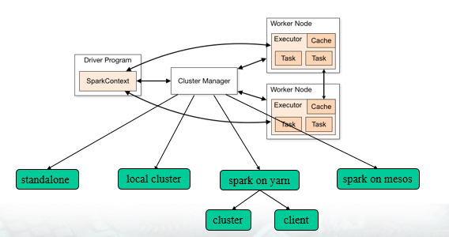
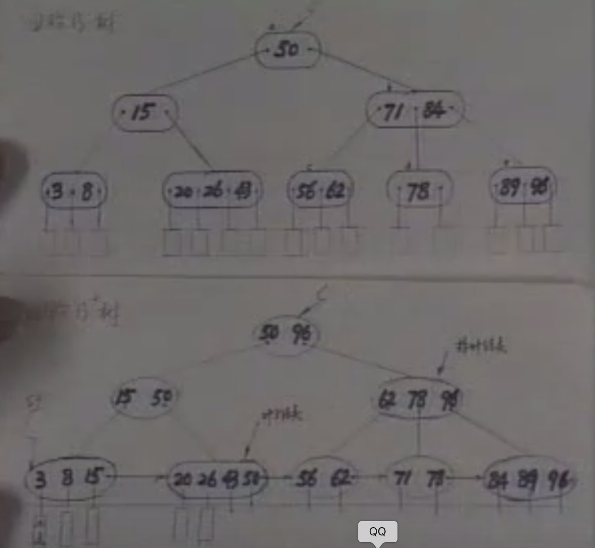
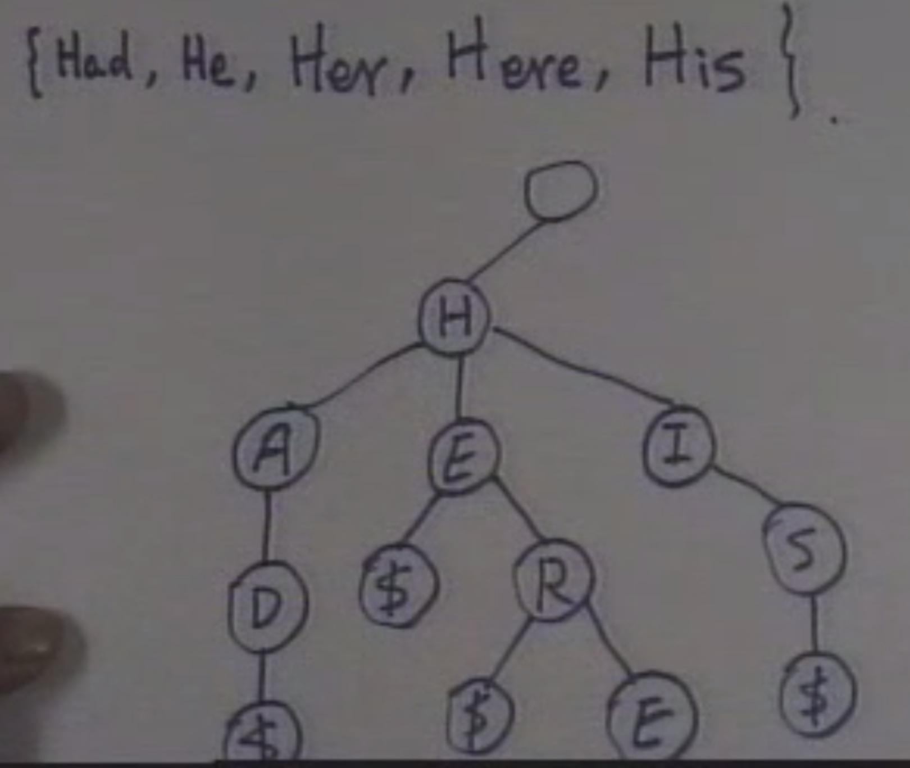

# 牛客网错题集

## 计算机基础

1，关于读屏障、写屏障、通用屏障和优化屏障。

> 知识点解析：内存屏障主要有：读屏障、写屏障、通用屏障、优化屏障。
>
> > 1）以读屏障为例，它用于保证读操作有序。屏障之前的读操作一定会先于屏障之后的读操作完成，写操作不受影响，同属于屏障的某一侧的读操作也不受影响；
> >
> > 2）写屏障用于限制写操作；
> >
> > 3）而通用屏障则对读写操作都有作用；
> >
> > 4）优化屏障则用于限制编译器的指令重排，不区分读写。前三种屏障都隐含了优化屏障的功能。

2，构造函数中，成员变量一定要通过初始化列表来初始化的问题。

> 知识点解析：在构造函数中需要初始化列表初始化的有如下三种情况：
>
> （1）带有const修饰的类成员 ，如`const int a`；
> （2）引用成员数据，如`int& p`;
> （3）带有引用的类变量，如：
>
> ```C++
> class A {
> private:
> int &a;
> };
> class B{
> private:
> A c;
> }
> ```
> 这里的`c`需要用初始化列表进行初始化。

3，解释型语言的特性有什么？

> 知识点与解析：
>
> 1）解释性语言的程序**不需要编译**，在运行程序的时候才翻译，每个语句都是执行的时候才翻译。这样解释性语言每执行一次就需要逐行翻译一次，**效率比较低**；**非独立性**体现在运行结果需要依赖于环境；**跨平台兼容性好**（编译型语言进行移植后要重新编译）；
>
> 2）编译性语言写的程序在被执行之前，需要一个专门的**编译**过程，把程序编译成为机器语言的文件，比如exe文件，以后要运行的话就不用重新翻译了，直接使用编译的结果就行了（exe文件），因为翻译只做了一次，运行时不需要翻译，所以编译型语言的程序**执行效率高**。

4，一个稀疏矩阵$A_{m*n}$ 采用三元组形式表示,若把三元组中有关行下标与列下标的值互换，并把 $m$ 和 $n$ 的值互换，则就完成了 $A_{m*n}$ 的转置运算。

> 解析：错误。三元组可实现矩阵的转置条件：
>
> > （1）将矩阵的行列值交换。
>>
> > （2）将每个三元组中的 i 和 j 相互调换。
>>
> > （3）重排三元组之间的次序。

## 编程语言


## 专业技能

1，Spark中driver的作用？



> 知识点与解析：1）`standalone`模式既独立模式，自带完整服务，可单独部署到一个集群中，无需依赖其他任何资源管理系统，只支持`FIFO`调度器；
>
> 2）`standalone`模式的单机版，`master`和`worker`分别运行在一台机器的不同进程上；
>
> 3） `spark on yarn`的支持两种模式：
>
> > （1）`yarn-cluster`：适用于生产环境；
> >
> > （2）`yarn-client`：适用于交互、调试，希望立即看到`app`的输出。
>
> `yarn-cluster`和`yarn-client`的区别在于`yarn appMaster`，每个`yarn app`实例有一个`appMaste`r进程，是为`app`启动的第一个`container`；负责从`ResourceManager`请求资源，获取到资源后，告诉`NodeManager`为其启动`container`。
>
> 4）在`Spark On Mesos`环境中，用户可选择两种调度模式之一运行自己的应用程序。
>
> > （1）粗粒度模式（`Coarse-grained Mode`）：每个应用程序的运行环境由一个`Dirver`和若干个`Executor`组成，其中，每个`Executor`占用若干资源，内部可运行多个`Task`（对应多少个“`slot`”）；
> >
> > （2）细粒度模式（`Fine-grained Mode`）：鉴于粗粒度模式会造成大量资源浪费，这种模式类似于现在的云计算，思想是按需分配。
>
> `driver`的作用：运行应用程序的`main`函数。
>
> > 创建`spark`的上下文；
> >
> > 划分`RDD`并生成有向无环图（`DAGScheduler`）；
> >
> > 与`spark`中的其他组进行协调，协调资源等等（`SchedulerBackend`）；
> >
> > 生成并发送`task`到`executor`（`taskScheduler`）。


## 通用能力

1，中国四大名砚是澄泥砚是石砚吗？

> 解析：位于中国北部山西省的新绛县，古称“绛州”，出产于这里的澄泥砚是中国历史上著名的“四大名砚”之一。“四大名砚”中的其它三种均为石砚，唯有绛州澄泥砚是泥砚。它与端、歙、洮砚齐名，史称“三石一陶”。

2，在信用风险组合管理模型中，违约模型的重要输入参数包括（ ）

> 解析：贷款金额，回收率，贷款违约风险之间的相关性。违约贷款回收率是商业银行实施内部评级高级法的一个重要因素，在计算预期损失与非预期损失时都需要对回收率进行估计。回收率的波动性不是重要输入参数，只是回收率的一个参数指标。

3，德国人（ ）建造了飞艇。

> 解析：鲁道夫•狄塞尔：柴油机之父；卡尔•本茨：汽车之父；西门子：电子电气之父；齐柏林：建造飞艇。

## 参考资料

- [Spark的架构以及driver的理解](https://blog.csdn.net/weixin_44695980/article/details/94719774)

# 面试常考试题

## Q1：Java与C/C++的区别

##Q2：什么是反射

## Q3：Spring的AOP实现原理

##Q4：TCP和UDP的区别

## Q5：产生死锁的基本条件

> 1）互斥条件：一个资源每次只能被一个进程使用； 
>
> 2）请求与保持条件：一个进程因请求资源而阻塞时，对已获得的资源保持不放； 
>
> 3）不剥夺条件：进程已获得的资源，在没使用完之前，不能强行剥夺； 
>
> 4）循环等待条件：多个进程之间形成一种互相循环等待资源的关系。

## Q6：Hash索引和B+树索引的区别

> `Hash` 索引结构的特殊性，其检索效率非常高，索引的检索可以一次定位，不像 `B-Tree` 索引需要从根节点到枝节点，最后才能访问到叶节点这样多次的 `I/O` 访问，所以 `Hash` 索引的查询效率要远高于 `B-Tree` 索引；但是：
>
> > （1）Hash 索引仅仅能满足"=","IN"和"<=>"查询，不能使用范围查询；
> >
> > （2）`Hash` 索引无法被用来避免数据的排序操作；
> >
> > （3）Hash 索引不能利用部分索引键查询；
> >
> > （4）`Hash` 索引在任何时候都不能避免表扫描；
> >
> > （5）`Hash` 索引遇到大量 `Hash` 值相等的情况后性能并不一定就会比 `B-Tree` 索引高。
>
> `MySQL` 中，只有 `Memory`（`Memory` 表只存在内存中，断电会消失，适用于临时表）存储引擎显示支持 `Hash` 索引，是 `Memory` 表的默认索引类型。
>
> `B+Tree` 所有索引数据都在叶子节点上，并且增加了顺序访问指针，每个叶子节点都有指向相邻叶子节点的指针。
>
> 数据库系统的设计者巧妙利用了**磁盘预读原理**，将一个节点的大小设为等于一个页，这样每个节点需要一次 `I/O` 就可以完全载入。

## Q7：mysql数据库：isnull,ifnull,nullif的区别和用法

> `ISNULL(expr)`：如果 `expr` 的值为 `null`，则返回1,如果不为`null`,则返回0；
>
> `IFNULL(expr1,expr2)`：如果 `expr1` 不为 `NULL`，则返回 `expr1`; 否则返回 `expr2`；
>
> `NULLIF(expr1,expr2)` ：如果 `expr1` 和 `expr2` 相等，则返回 `null`，否则返回 `expr1` 的值。

# 常考知识点

#### 1，kNN算法（腾讯微宝2020春）

> 试题描述：对于N个样本，每个样本为D维向量，采用欧式距离使用kNN做类预测。
>
> 1）给出预测时间复杂度。
>
> 2）当N很大时，有哪些方法可以降低复杂度？
>
> 3）k取值的大小对预测方差和偏差有何影响？

知识点：

> kNN是通过测量不同特征值之间的距离进行分类。 
>
> 思路是：如果一个样本在特征空间中的k个最邻近的样本中的大多数属于某一个类别，则该样本也划分为这个类别。kNN算法中，所选择的邻居都是已经正确分类的对象。该方法在定类决策上只依据最邻近的一个或者几个样本的类别来决定待分样本所属的类别。
>
> 算法的描述：
>
> > 1）计算测试数据与各个训练数据之间的距离；
> >
> > 2）按照距离的递增关系进行排序；
> >
> > 3）选取距离最小的K个点；
> >
> > 4）确定前K个点所在类别的出现频率；
> >
> > 5）返回前K个点中出现频率最高的类别作为测试数据的预测分类
>
>  $K$ 值选择：
>
> > 当 $K$ 的取值过小时，一旦有噪声得成分存在们将会对预测产生比较大影响，例如取 $K$ 值为1时，一旦最近的一个点是噪声，那么就会出现偏差， $K$ 值的减小就意味着整体模型变得复杂，容易发生过拟合；
> >
> > 当$K$的值取的过大时，就相当于用较大邻域中的训练实例进行预测，学习的近似误差会增大。这时与输入目标点较远实例也会对预测起作用，使预测发生错误。 $K$ 值的增大就意味着整体的模型变得简单；
> >
> > 当 $K==N$ 的时候，那么就是取全部的实例，即为取实例中某分类下最多的点，就对预测没有什么实际的意义；
> >
> >  $K$ 的取值尽量要取奇数，以保证在计算结果最后会产生一个较多的类别，如果取偶数可能会产生相等的情况，不利于预测。
>
> 关于距离：
>
> > 常用的有：欧几里得距离、余弦值（`cos`）, 相关度 （`correlation`）, 曼哈顿距离 （`Manhattan distance`）。
>
> kNN 很耗时，时间复杂度为 $O(n)$，一般适用于样本数较少的数据集，当数据量大时，可以将数据以树的形式呈现，能提高速度，常用的有 `kd-tree` 和 `ball-tree`。

#### 2，关于Dropout

> Dropout 背景：
>
> > 在2012年，`Hinton` 在其论文《`Improving neural networks by preventing co-adaptation of feature detectors`》中提出 `Dropout`。当一个复杂的前馈神经网络被训练在小的数据集时，容易造成过拟合。为了防止过拟合，可以通过阻止特征检测器的共同作用来提高神经网络的性能。
>
> `Dropout` 可以作为训练深度神经网络的一种 `trick` 供选择。在每个训练批次中，通过忽略一半的特征检测器（让一半的隐层节点值为0），可以明显地减少过拟合现象。
>
> 当前 `Dropout` 被大量利用于全连接网络，而且一般认为设置为0.5或者0.3，而在卷积网络隐藏层中由于卷积自身的稀疏化以及稀疏化的 `ReLu` 函数的大量使用等原因，`Dropout` 策略在卷积网络隐藏层中使用较少。

#### 3，动态查找树

- **二叉搜索树（二叉排序树 or 二叉查找树）**：或者是一棵空树，或者具有以下性质的二叉树：

> 1）若它的左子树不空，则左子树上**所有**结点的值**均小于**其根结点的值；
>
> 2）若它的右子树不空，则左子树上**所有**结点的值**均大于**其根结点的值；
>
> 3）它的左右子树也分别为二叉排序树。
>
> 其查找时间复杂度为 $O(logn)$。

- **平衡二叉树（AVL树）**：或者是一棵空树，或者具有以下性质的二叉树：

> 它的左右子树也分别为平衡二叉树，且左子树和右子树的深度之差的**绝对值不超过1**；
>
> 其查找时间复杂度为 $O(logn)$。

- **B-树**：是一种平衡的多路搜索树，适用于文件系统。

一棵 $m$ 阶的 $B-$ 树或者是空树，或满足以下性质的 $m$ 叉树： 

> 1）树中每个节点至多有 $m$ 棵子树；
>
> 2）若根节点不是叶子结点，则至少有两棵子树；
>
> 3）除根之外的所有非终端结点至少有 $⌈m/2⌉$ 棵子树；
>
> 4）所有非终端结点包含以下的信息数据：
>
> $(n,A_0,K_1,A_1,K_2,A_2,\dots,K_n,A_n)$ 
>
> 其中，$K_i$ 为关键字，$K_i<K_{i+1}$；$A_i$ 为指向子树根结点的指针，且 $A_{i-1}$ 所指子树中所有结点的关键字**均小于** $K_i$ ， $A_{i}$ 所指子树中所有结点的关键字**均大于** $K_i$ ；
>
> 5）所有的叶子结点都出现在同一层次上，并且不带信息（空指针）。
>
> 计算树的深度：$H \le {log}_{⌈m/2⌉}((N+1)/2)+1$

- **B+树**：B+树是应文件系统所需而出的一种B-树的变体，也是一种多路搜索树。

一棵 $m$ 阶的 $B+$ 树与 $B-$ 的差异在于：

> 1）有n棵子树的结点含有n个关键字；
>
> 2）所有的叶子结点包含了全部关键字的信息及其指针，且叶子结点本身依关键字的大小自小而大链接；
>
> 3）所有非终端结点可以看作是索引部分，结点中仅含有其子树中的最小（或最大）的关键字。
>
> B+树有两种查找运算：
>
> > 1）从最小关键字起顺序查找；
> >
> > 2）从根结点开始，进行随机查找。
>
> B+的特性：
>
> > 1）所有关键字都出现在叶子结点的链表中（稠密索引），且链表中的关键字恰好是有序的；
> >
> > 2）不可能在非叶子结点命中；
> >
> > 3）非叶子结点相当于是叶子结点的索引（稀疏索引），叶子结点相当于是存储（关键字）数据的数据层；
> >
> >  4）更适合文件索引系统。



- **B\*树**：是B+树的变体，在B+树的非根和非叶子结点再增加指向兄弟的指针。

> B\* 树定义了非叶子结点关键字个数至少为(2/3)*M，即块的最低使用率为2/3（代替B+树的1/2）；
>
> B+树的分裂：当一个结点满时，分配一个新的结点，并将原结点中1/2的数据复制到新结点，最后在父结点中增加新结点的指针；B+树的分裂只影响原结点和父结点，而不会影响兄弟结点，所以它不需要指向兄弟的指针；
>
>  B\*树的分裂：当一个结点满时，如果它的下一个兄弟结点未满，那么将一部分数据移到兄弟结点中，再在原结点插入关键字，最后修改父结点中兄弟结点的关键字（因为兄弟结点的关键字范围改变了）；如果兄弟也满了，则在原结点与兄弟结点之间增加新结点，并各复制1/3的数据到新结点，最后在父结点增加新结点的指针；
>
> 所以，B*树分配新结点的概率比B+树要低，空间使用率更高。

- **键树（数字查找树）**

> 是一棵度 $\ge 2$ 的树，树中的每个结点中不包括一个或者几个关键字，而是只含有组成关键字的符号；
>
> 关键字中的各个符号分布在从根结点到叶子结点的路径上，叶子结点内的 `$` 符号为结束标志符号，因此键树的深度与关键字的集合大小无关；
>
> 键树被约定为一棵有序树。



#### 4， MYSQL索引：B树与 B+ 树的区别

> B+ 树的磁盘读写更低，因为非叶子节点可以存储更多的索引 `key`，而 `key` 索引在同一层更集中，那么会降低磁盘 `IO` 读写次数；
>
> B+ 树的查询效率更稳定，任何查询都必须从根节点到叶子节点，路径是相似的，所以更稳定（最好最坏都在底层）；
>
> 区间访问友好性，MySQL 是关系型数据库，所以经常会按照区间来访问某个索引，B+ 树的叶子节点会按照顺序建立起链状指针，增强了区间访问性。

- MySQL 为什么使用 `B/B+` 树来实现索引？

> MySQL 是基于磁盘的数据库，索引是以索引文件的形式存于磁盘中的。索引的过程就是磁盘 IO 的过程，磁盘 IO 消耗比内存 IO 消耗好几个数量级，所以能有效减少磁盘 IO 的数据结构适合用来实现数据库索引。

- 为什么使用B-Tree（B+Tree）

> 主存是一系列的存储单元组成的矩阵，每个存储单元存储固定大小的数据。每个存储单元有唯一的地址，现代主存的编址规则比较复杂，这里将其简化成一个二维地址：通过一个行地址和一个列地址可以唯一定位到一个存储单元。
>
> 主存的存取过程如下：
>
> > 当系统需要读取主存时，则将地址信号放到地址总线上传给主存，主存读到地址信号后，解析信号并定位到指定存储单元，然后将此存储单元数据放到数据总线上，供其它部件读取。
>
> 局部性原理：
>
> > 当一个数据被用到时，其附近的数据也通常会马上被使用。
>
> 由于磁盘顺序读取的效率很高（不需要寻道时间，只需很少的旋转时间），因此对于具有局部性的程序来说，**预读可以提高I/O效率**。
>
> 预读的长度一般为**页（page）**的整倍数。页是计算机管理存储器的逻辑块，硬件及操作系统往往将主存和磁盘存储区分割为连续的大小相等的块，每个存储块称为一页（在许多操作系统中，页得大小通常为**4k**），**主存和磁盘以页为单位交换数据**。当程序要读取的数据不在主存中时，会触发一个缺页异常，此时系统会向磁盘发出读盘信号，磁盘会找到数据的起始位置并向后连续读取一页或几页载入内存中，然后异常返回，程序继续运行。
>
> B/B+性能分析：
>
> > 数据库系统的设计者巧妙利用了**磁盘预读原理**，将一个节点的大小设为等于一个页，这样每个节点只需要一次 `I/O` 就可以完全载入。为了达到这个目的，在实际实现 `B-Tree` 还需要使用如下技巧：
> >
> > > 每次新建节点时，直接申请一个页的空间，这样就保证一个节点物理上也存储在一个页里，加之计算机存储分配都是按页对齐的，就实现了一个 `node` 只需一次 `I/O`。
> >
> > `B-Tree` 中一次检索最多需要 $h-1$ 次 `I/O`（根节点常驻内存），渐进复杂度为 $O(h)=O(log_{d}N)O(h)=O(log_{d}N)$ 。一般实际应用中，出度 $d$ 是非常大的数字，通常超过100，因此 $h$ 非常小（通常不超过3）。
> >
> > `B+Tree` 更适合外存索引，原因和内节点出度 $d$ 有关。从上面分析可以看到，$d$ 越大索引的性能越好，而出度的上限取决于节点内 `key` 和 `data` 的大小：
> >
> > $$ d_{max}=floor(\frac{pagesize}{(keysize+datasize+pointsize)})$$

- Innodb与MyISAM索引的实现

>**MyISAM引擎**使用 `B+Tree` 作为索引结构，叶节点的 `data` 域存放的是数据记录的地址。
>
>**InnoDB引擎**：
>
>> `InnoDB` 的**数据文件本身就是索引文件** ，`MyISAM` 索引文件和数据文件是分离的，索引文件仅保存数据记录的地址；在`InnoDB`中，表数据文件本身就是按`B+Tree`组织的一个索引结构，这棵树的叶节点 `data` 域保存了完整的数据记录，这个索引的`key`是数据表的主键，因此`InnoDB`表数据文件本身就是**主索引**；
>>
>> 与`MyISAM`索引的不同是`InnoDB`的辅助索引`data`域存储相应记录**主键的值**而不是地址，即：`InnoDB`的所有辅助索引都引用主键作为`data`域。

#### 5，卡特兰数

> **卡特兰数**又称**卡塔兰数**，英文名 `Catalan number`，卡特兰数是组合数学中一个常出现在各种计数问题中的数列。以比利时的数学家欧仁·查理·卡塔兰 (1814–1894)的名字来命名。
>
> 设 $h(n)$ 为`catalan`数的第 $n+1$ 项，令 $h(0)=1$ , $h(1)=1$，`catalan` 数满足递推式：
>
> $h(n)= h(0){*}h(n-1)+h(1){*}h(n-2) + \dots + h(n-1){*}h(0) (n\ge2)$
>
> 即有递推公式(二)：
>
> > $h(n)=C(2n,n)/(n+1) (n=0,1,2,...)$
>
> 应用：
>
> > 1）**括号化**
> >
> > > 矩阵连乘： $P=a_1 \times a_2 \times a_3 \times \dots \times a_n$，依据乘法结合律，不改变其顺序，只用括号表示成对的乘积，试问有几种括号化的方案？
> >
> > 2）**出栈次序**
> >
> > > 一个栈(无穷大)的**进栈**序列为 $1,2,3,\dots,n$，有多少个不同的出栈序列？
> >
> > 3）**买票找零**
> >
> > > 有 $2n$ 个人排成一行进入剧场，入场费5元。其中只有 $n$ 个人有一张5元钞票，另外 $n$ 人只有10元钞票，剧院无其它钞票，问有多少种方法使得只要有10元的人买票，售票处就有5元的钞票找零？(将持5元者到达视作将5元入栈，持10元者到达视作使栈中某5元出栈)
> >
> > 4）**凸多边形三角划分**
> >
> > > 在一个凸多边形中，通过若干条互不相交的对角线，把这个多边形划分成了若干个三角形。任务是键盘上输入凸多边形的边数 $n$，求不同划分的方案数？
> >
> > **类似问题**：
> >
> > > （1）一位大城市的律师在她住所以北 $n$ 个街区和以东 $n$ 个街区处工作。每天她走 $2n$ 个街区去上班。如果她从不穿越（但可以碰到）从家到办公室的对角线，那么有多少条可能的道路？
> > >
> > > （2）在圆上选择 $2n$ 个点,将这些点成对连接起来使得所得到的 $n$ 条线段不相交的方法数？
> >
> > 5）**给定节点组成二叉搜索树**
> >
> > > 给定 $N$ 个节点，能构成多少种不同的二叉搜索树？
> >
> > 6）**n对括号正确匹配数目**
> >
> > 给定 $n$ 对括号，求括号正确配对的字符串数。
>
> 

#### 参考文献

- [kNN算法：K最近邻(kNN，k-NearestNeighbor)分类算法](https://www.cnblogs.com/jyroy/p/9427977.html)
- [深度学习中Dropout原理解析](https://blog.csdn.net/program_developer/article/details/80737724)
- [B树，B-树和B+树、B*树的区别](https://blog.csdn.net/qq_22613757/article/details/81218741)
- [MySql 索引之 B 树与 B+ 树](https://www.cnblogs.com/paulwang92115/p/12244854.html)
- [MySQL索引背后的数据结构及算法原理](http://blog.codinglabs.org/articles/theory-of-mysql-index.html)
- [MySQL的btree索引和hash索引的区别](https://www.cnblogs.com/AndyAo/p/8183383.html)
- [卡特兰数](https://baike.baidu.com/item/%E5%8D%A1%E7%89%B9%E5%85%B0%E6%95%B0/6125746?fr=aladdin)
- [mysql数据库 isnull,ifnull,nullif的区别和用法](https://cloud.tencent.com/developer/article/1555551)

